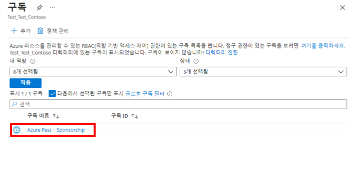

---
lab:
    title: '랩 03: 개발 환경 설정'
    module: '모듈 2: 디바이스 및 디바이스 통신'
---

# 개발 환경 설정

## 랩 시나리오

Contoso의 개발자 중 한 명으로서 Azure IoT 솔루션을 빌드하기 전에 개발 환경을 설정하는 것이 중요하다는 것을 알고 계십니다. 또한 Microsoft와 타사에서는 IoT 솔루션을 개발하고 지원하는 데 사용할 수 있는 여러 가지 도구를 제공한다는 것과 팀에서 사용할 도구에 대해 몇 가지 결정을 해야한다는 것을 알고 계십니다.

그래서 팀이 IoT 솔루션 관련 작업에 사용할 수 있는 개발 환경을 준비하기로 했습니다. 이 환경은 Azure 및 로컬 PC에서 수행하는 작업을 지원해야 합니다. 팀은 몇 가지 논의 후 개발 환경에 대해 다음과 같은 높은 수준의 결정을 내렸습니다.

* 운영 체제: OS로 Windows 10을 사용할 니다. Windows는 대부분의 팀에서 사용므로 논리적인 선택이었습니다. Azure 서비스는 기타 운영 체제(예: Mac OS, Linux)를 지원하며 Microsoft는 이러한 대안 중 하나를 선택하는 팀의 구성원에게 지원 설명서를 제공한다는 점을 팀에게 설명했습니다.
* 일반 코딩 도구: Visual Studio Code 및 Azure CLI를 기본 코딩 도구로 사용할 것입니다. 두 도구 모두 Azure IoT SDK를 활용하는 IoT에 대한 확장을 지원합니다.
* IoT Edge 도구: Docker Desktop Community와 Python을 사용(Visual Studio Code와 함께)하여 사용자 지정 IoT Edge 모듈 개발을 지원합니다.

이러한 결정을 지원하기 위해 다음과 같은 환경을 설정합니다.

* Windows 10 64비트: Pro, Enterprise 또는 Education(빌드 15063 이상). 다음과 같은 항목이 포함됩니다.
  * 4GB – 8GB 시스템 RAM(높을수록 Docker에 유리합니다)
  * Windows의 Hyper-V 및 컨테이너 기능을 사용하도록 설정해야 합니다.
  * BIOS 수준의 하드웨어 가상화 지원은 BIOS 설정에서 사용하도록 설정되어야 합니다.

  > **참고**: 가상 머신에서 개발 환경을 설정할 때 VM 환경은 중첩된 가상화를 지원해야 합니다 - [중첩된 가상화](https://docs.microsoft.com/ko-kr/virtualization/hyper-v-on-windows/user-guide/nested-virtualization)

* Azure CLI(현재/최신)
* .NET Core 3.1.200(혹은 그 이상) SDK
* VS Code(최신)
* Python 3.9
* Linux Containers으로 설정된 Docker Desktop Community 2.1.0.5(혹은 그 이상)
* VS Code 및 Azure CLI에 대한 IoT 확장
* node.js(최신)

> **참고**: 위에서 언급한 대부분의 도구를 제공하는 이 과정에 가상 머신이 만들어졌습니다. 아래 지침은 준비된 VM을 사용하거나 PC를 사용하여 로컬로 개발 환경을 설정하는 것을 지원합니다.

## 랩 내용

이 랩에서는 개발 환경용 기본 개발자 도구를 설치하고 Visual Studio Code 및 Azure CLI용 Azure IoT 확장을 설치합니다. 그런 후에 랩에서 사용할 몇 가지 파일을 GitHub에서 다운로드합니다. 랩에 포함된 연습은 다음과 같습니다.

* 개발자 도구 및 제품 설치
* 개발 도구 확장 프로그램 설치
* 과정 랩 파일 및 대체 도구 설정

## 랩 지침

### 연습 1: 개발자 도구 및 제품 설치

> **중요**: 이 연습과 연관된 도구 및 제품은 이 과정을 위해 만든 가상 머신에 미리 설치되어 있습니다. 계속하기 전에 과정 강사에게 문의하여 호스팅된 랩 VM 환경을 사용하여 랩을 완료하는지 혹은 PC에서 로컬로 개발 환경을 설정할지 여부를 확인하세요.

#### 작업 1: .NET Core 설치

.NET Core는 웹 사이트, 서비스 및 콘솔 앱을 빌드하기 위한 .NET의 교차 플랫폼 버전입니다.

1. .NET Core 다운로드 페이지를 열려면 다음 링크를 사용하세요. [.NET 다운로드](https://dotnet.microsoft.com/download)

1. .NET 다운로드 페이지의 .NET Core 아래에서 **.NET Core SDK 다운로드**를 클릭합니다.

    .NET Core SDK는 .NET Core 앱을 빌드하는 데 사용됩니다. 이 과정의 랩에서는 코드 파일 빌드/편집을 사용합니다.

1. 팝업 메뉴에서 **실행**을 클릭한 다음 화면의 지침에 따라 설치를 완료합니다.

    설치를 완료하는 데에는 1분 미만이 소요됩니다. 다음 구성 요소가 설치됩니다.

    * .NET Core SDK 3.1.100 이상
    * .NET Core Runtime 3.1.100 이상
    * ASP.NET Core Runtime 3.1.100 이상
    * .NET Core Windows Desktop Runtime 3.1.0 이상

    자세한 내용은 다음 리소스를 참조하세요.

    * [.NET Core 설명서](https://aka.ms/dotnet-docs-kor)
    * [.NET Core 종속성 및 요구 사항](https://docs.microsoft.com/ko-kr/dotnet/core/install/dependencies?tabs=netcore31&pivots=os-windows)
    * [SDK 설명서](https://aka.ms/dotnet-sdk-docs-kor)
    * [릴리스 정보](https://aka.ms/netcore3releasenotes)
    * [자습서](https://aka.ms/dotnet-tutorials-kor)

#### 작업 2: Visual Studio Code 설치

Visual Studio 코드는 데스크톱에서 실행되며 Windows, macOS 및 Linux에 사용할 수 있는 간단하지만 강력한 소스 코드 편집기입니다. JavaScript, TypeScript 및 Node.js를 기본적으로 지원하며 다른 언어(예: C++, C#, Java, Python, PHP, Go) 및 실행 시간(예: .NET 및 Unity)에 대한 풍부한 확장 에코시스템을 제공합니다.

1. Visual Studio Code 다운로드 페이지를 열려면 다음 링크를 클릭합니다. [Visual Studio Code 다운로드하기](https://code.visualstudio.com/Download)

    Mac OS X 및 Linux에 Visual Studio Code를 설치하는 방법은 Visual Studio Code 설정 가이드([여기](https://code.visualstudio.com/docs/setup/setup-overview))에서 찾을 수 있습니다. 이 페이지에는 Windows 설치에 대한 자세한 지침과 팁도 포함되어 있습니다.

1. Visual Studio Code 다운로드 페이지에서 **Windows**를 클릭합니다.

    다운로드를 시작하면 팝업 대화 상자가 열리고 시작 안내가 표시됩니다.

1. 팝업 대화 상자에서 설치 프로세스를 시작하려면 **실행**을 클릭한 다음 화면의 지침을 따릅니다.

    설치 관리자를 다운로드 폴더에 저장하도록 선택한 경우 폴더를 연 다음 VSCodeSetup 실행 파일을 두 번 클릭하여 설치를 완료할 수 있습니다.

    기본적으로 Visual Studio Code는 "C:\Program Files (x86)\Microsoft VS Code" 폴더 위치에 설치됩니다(64비트 컴퓨터의 경우). 설치 프로세스는 1분 정도밖에 걸리지 않습니다.

    > **참고**:  .NET Framework 4.5는 Windows에 설치할 때 Visual Studio Code에 필요합니다. Windows 7을 사용하는 경우 [.NET Framework 4.5](https://www.microsoft.com/ko-kr/download/details.aspx?id=30653)가 설치되어 있는지 확인하세요.

    Visual Studio Code 설치에 대한 자세한 지침은 여기([https://code.visualstudio.com/Docs/editor/setup](https://code.visualstudio.com/Docs/editor/setup))에서 Microsoft Visual Studio Code 설치 지침을 참조하세요.

#### 작업 3: Azure CLI 설치

Azure CLI는 Azure 관련 작업을 보다 쉽게 스크립팅할 수 있도록 설계된 명령줄 도구입니다. 또한 데이터를 유연하게 쿼리할 수 있으며 비차단 프로세스로 장기 실행 작업을 지원합니다.

1. 브라우저를 연 다음 Azure CLI 도구 다운로드 페이지로 이동합니다. [Azure CLI 설치](https://docs.microsoft.com/ko-kr/cli/azure/install-azure-cli?view=azure-cli-latest "Azure CLI Install")

    Azure CLI 도구의 최신 버전(현재 버전 2.4)을 설치해야 합니다. 버전 2.4가 이 "azure-cli-latest" 다운로드 페이지에 나열된 최신 버전이 아닌 경우 최신 버전을 설치합니다.

1. **Azure CLI 설치** 페이지에서 OS에 맞는 설치 옵션(예: **Windows에 설치**)을 선택한 다음 화면의 지침에 따라 Azure CLI 도구를 설치합니다.

    이 과정의 랩에서 Azure CLI 도구 사용에 대한 자세한 지침을 제공하지만 지금 자세한 정보를 원할 경우 [Azure CLI 시작](https://docs.microsoft.com/ko-kr/cli/azure/get-started-with-azure-cli?view=azure-cli-latest)을 참조하세요.

#### 작업 4: Python 3.9 설치

IoT Edge 및 Docker를 지원하기 위해 Python 3.9을 사용합니다.

1. 웹 브라우저에서 [https://www.python.org/downloads/](https://www.python.org/downloads/)로 이동합니다.

1. Python 다운로드 페이지에서 운영 체제에 적합한 설치 관리자 파일을 선택합니다.

1. 메시지가 표시되면 설치 관리자를 실행하는 옵션을 선택합니다.

1. Install Python 대화 상자에서 **Add Python 3.9 to PATH**를 클릭합니다.

1. **지금 설치**를 클릭합니다.

1. "설정이 완료되었습니다" 페이지가 나타나면 **경로 길이 제한 사용 안 함**을 클릭합니다.

1. 설치 프로세스를 완료하려면 **닫기**를 클릭합니다.

#### 작업 5: Docker Desktop 설치

사용자 지정 IoT Edge 모듈 만들기와 배포 과정을 설명하는 랩에서 Docker Desktop Community(안정적인 최신 버전)를 사용합니다.

1. 웹 브라우저에서 [https://docs.docker.com/docker-for-windows/install/](https://docs.docker.com/docker-for-windows/install/)로 이동합니다.

    왼쪽 탐색 메뉴는 추가적인 운영 체제 설치에 대한 액세스를 제공합니다.

1. PC가 시스템 요구 사항을 충족하는지 확인합니다.

    Windows 설정을 사용하여 Windows 기능 대화 상자를 연 다음 해당 대화 상자를 통해 Hyper-V 및 컨테이너가 활성화되어 있는지 확인할 수 있습니다.

1. **Docker Hub에서 다운로드**를 클릭합니다.

1. Windows용 Docker Desktop 아래에서 **Windows용 Docker Desktop 가져오기(안정적)** 를 클릭합니다.

1. 설치를 시작하려면 **실행**을 클릭합니다.

    Docker Desktop에 대한 설치 대화 상자가 나타나려면 다소 시간이 걸릴 수 있습니다.

1. 설치 성공 메시지가 나타나면 **닫기**를 클릭합니다.

    Docker Desktop은 설치 후 자동으로 시작되지 않습니다. Docker Desktop을 시작하려면 Docker를 검색하고 검색 결과에서 Docker Desktop을 선택합니다. 상태 표시줄의 고래 아이콘이 계속 그대로 있다면 Docker Desktop이 작동 중이며 모든 터미널 창에서 액세스할 수 있습니다.

#### 작업 6 - node.js 설치

node.js를 사용하여 로컬에서 실행되는 샘플 웹 애플리케이션도 있습니다. 다음 단계를 수행하면 최신 버전 node.js를 설치하여 실행할 수 있습니다.

1. 브라우저에서 [node.js 다운로드 페이지](https://nodejs.org/en/#home-downloadhead)로 이동합니다.

1. 최신 LTS(Long Term Support) 버전을 다운로드합니다. 이 문서 작성 시점의 최신 LTS 버전인 14.16.0입니다.

1. 메시지가 표시되면 설치 관리자를 실행하는 옵션을 선택합니다.

1. 설치 관리자를 단계별로 실행합니다.

   * **End-User License Agreement** - 조건에 동의하고 **Next**를 클릭합니다.
   * **Destination Folder** - 기본값을 적용(하거나 필요한 경우 폴더를 변경)하고 **Next**를 클릭합니다.
   * **Custom Setup** - 기본값을 적용하고 **Next**를 클릭합니다.
   * **Tools for Native Modules** - **Automatically install**을 선택하고 **Next**를 클릭합니다.
   * **Ready to install Node.js** - **Install**을 클릭합니다.
     * UAC 대화 상자에서 **Yes**를 클릭합니다.

1. 설치가 완료될 때까지 기다렸다가 **Finish**를 클릭합니다.

1. **Install Additional Tools for Node.js** 명령 창에서 메시지가 표시되면 **Enter** 키를 눌러 계속 진행합니다.

1. UAC 대화 상자에서 **Yes**를 클릭합니다.

    여러 패키지가 다운로드되어 설치됩니다. 이 작업에는 약간의 시간이 걸립니다.

1. 설치가 완료되면 **새** 명령 셸을 열고 다음 명령을 입력합니다.

    ```powershell
    node --version
    ```

    노드가 정상적으로 설치되었으면 설치된 버전이 표시됩니다.

### 연습 2: 개발 도구 확장 프로그램 설치

Visual Studio Code 및 Azure CLI 도구는 개발자가 솔루션을 보다 효율적으로 만들 수 있도록 도와주는 Azure IoT 확장을 지원합니다. Azure IoT SDK를 활용하는 이러한 확장을 활용하는 경우 개발 시간은 줄이면서 더욱 우수한 보안 기능을 제공할 수 있습니다. 여기서는 Visual Studio Code용 C# 확장도 추가합니다.

#### 작업 1: Visual Studio Code 확장 설치

1. Visual Studio Code를 엽니다.

1. Visual Studio Code 창의 왼쪽에서 **확장**을 클릭합니다.

    단추 위에 마우스 포인터를 가져가 단추 제목을 표시할 수 있습니다. 확장 단추는 위에서 여섯 번째입니다.

1. Visual Studio Code 확장 관리자에서 다음 확장을 검색한 다음 설치합니다.

    * Microsoft가 제공하는 [Azure IoT Tools](https://marketplace.visualstudio.com/items?itemName=vsciot-vscode.azure-iot-tools)(`vsciot-vscode.azure-iot-tools`)
    * Microsoft가 제공하는 [Visual Studio Code용 C#](https://marketplace.visualstudio.com/items?itemName=ms-vscode.csharp)(`ms-vscode.csharp`)
    * Microsoft가 제공하는 [Visual Studio Code용 Azure Tools](https://marketplace.visualstudio.com/items?itemName=ms-vscode.vscode-node-azure-pack)(ms-vscode.vscode-node-azure-pack)
    * Microsoft가 제공하는 [Visual Studio Code용 DTDL 편집기](https://marketplace.visualstudio.com/items?itemName=vsciot-vscode.vscode-dtdl)(vsciot-vscode.vscode-dtdl)

1. Visual Studio Code를 닫습니다.

#### 작업 2: Azure CLI 확장 설치 - 로컬 환경

1. Azure IoT CLI 확장을 로컬에 설치하려면 새 명령줄/터미널 창을 엽니다.

    예를 들어 Windows **명령 프롬프트** 명령줄 애플리케이션을 사용할 수 있습니다.

1. 명령 프롬프트에서 IoT용 Azure CLI 확장을 설치하려면 다음 명령을 입력합니다.

    ```bash
    az extension add --name azure-iot
    ```

1. 명령 프롬프트에서 Time Series Insights용 Azure CLI 확장을 설치하려면 다음 명령을 입력합니다.

    ```bash
    az extension add --name timeseriesinsights
    ```

#### 작업 3: Azure CLI 확장 설치 - 클라우드 환경

이 과정에 포함된 대다수 랩에서는 Azure Cloud Shell을 통해 Azure CLI IoT 확장을 사용해야 합니다. 다음 단계를 수행하면 최신 버전 확장을 설치하여 실행할 수 있습니다.

1. 브라우저를 사용하여 [Azure Cloud Shell](https://shell.azure.com/)을 열고 이 과정에 사용 중인 Azure 구독으로 로그인합니다.

1. Cloud Shell에 대한 스토리지 설정 관련 메시지가 표시되면 기본값을 수락합니다.

1. Cloud Shell에서 **Bash**를 사용하고 있는지 확인합니다.

    Azure Cloud Shell 페이지의 왼쪽 상단에 있는 드롭다운은 환경을 선택하는 데 사용됩니다. 선택한 드롭다운 값이 **Bash**인지 확인합니다.

1. 명령 프롬프트에서 IoT용 Azure CLI 확장을 설치하려면 다음 명령을 입력합니다.

    ```bash
    az extension add --name azure-iot
    ```

    **참고**: 확장이 이미 설치되어 있는 경우 다음 명령을 입력하여 최신 버전을 실행 중인지 확인할 수 있습니다.

    ```bash
    az extension update --name azure-iot
    ```

1. 명령 프롬프트에서 Time Series Insights용 Azure CLI 확장을 설치하려면 다음 명령을 입력합니다.

    ```bash
    az extension add --name timeseriesinsights
    ```

#### 작업 4: 개발 환경 설정 확인

개발 환경이 성공적으로 설정되었는지 확인해야 합니다. 이 작업이 완료되면 IoT 솔루션 빌드를 시작할 수 있습니다.

1. 새 명령줄/터미널 창을 엽니다.

1. 현재 설치된 Azure CLI 버전의 버전 정보를 출력하는 다음 명령을 실행하여 **Azure CLI** 설치의 유효성을 검사합니다.

    ```cmd/sh
    az --version
    ```

    `az --version` 명령은 설치한 Azure CLI의 버전 정보(`azure-cli` 버전 번호)를 출력합니다. 또한 이 명령은 IoT 확장을 포함하여 설치된 모든 Azure CLI 모듈의 버전 번호를 출력합니다. 다음과 같은 출력이 표시되어야 합니다.

    ```cmd/sh
    azure-cli                           2.20.0

    core                                2.20.0
    telemetry                           1.0.6

    확장:
    azure-iot                           0.10.9
    ```

1. 현재 설치된 .NET Core SDK 버전의 버전 번호를 출력하는 다음 명령을 실행하여 **NET Core 3.x SDK** 설치의 유효성을 검사합니다.

    ```cmd/sh
    dotnet --version
    ```

    `dotnet --version` 명령은 현재 설치된 .NET Core SDK 버전을 출력합니다.

1. .NET Core 3.1 이상이 설치되어 있는지 확인합니다.

이제 개발 환경이 설정되었습니다!

### 연습 3: 과정 랩 파일 및 대체 도구 설정

이 과정의 랩 중 상당수는 랩 작업의 시작점으로 사용할 수 있는 코드 프로젝트 등과 같이 미리 빌드된 리소스에 의존합니다. 이러한 랩 리소스는 GitHub 프로젝트에서 제공되며, 개발 환경에 해당 프로젝트를 다운로드해야 합니다.

과정 랩을 직접 지원하는 리소스(GitHub 프로젝트에 포함된 리소스) 외에 몇 가지 선택적 도구도 설치할 수 있습니다. 이러한 도구를 활용하면 이 과정에 포함되어 있지 않은 내용을 학습할 수 있기 때문입니다. 가령 Microsoft 자습서와 기타 리소스 내에서 언급될 수 있는 PowerShell 등을 설치할 수 있습니다.

아래 지침은 이러한 두 리소스 유형의 구성을 알려줍니다.

#### 작업 1: 과정 랩 파일 다운로드

Microsoft는 랩 리소스 파일에 대한 액세스를 제공하기 위해 GitHub 리포지토리를 만들었습니다. 이러한 파일을 개발자 환경에 로컬로 두는 것은 경우에 따라 필요하며 많은 경우에 편리합니다. 이 작업에서는 개발 환경 내에서 리포지토리의 내용을 다운로드하고 추출합니다.

1. 웹 브라우저에서 다음 위치로 이동합니다. [https://github.com/MicrosoftLearning/AZ-220KO-Microsoft-Azure-IoT-Developer](https://github.com/MicrosoftLearning/AZ-220KO-Microsoft-Azure-IoT-Developer)

1. 페이지 오른쪽에서 **복제 또는 다운로드**를 클릭한 다음 **ZIP 다운로드**를 클릭합니다.

1. ZIP 파일을 개발 환경에 저장하려면 **저장**을 클릭합니다.

1. 파일이 저장되면 **폴더 열기**를 클릭합니다.

1. 저장된 ZIP 파일을 마우스 오른쪽 단추로 클릭한 다음 **압축 풀기**를 클릭합니다.

1. **찾아보기**를 클릭한 다음 액세스하기 편리한 폴더 위치로 이동합니다.

    > **중요**: 기본적으로 Windows의 [최대 파일 경로 길이는 260](https://docs.microsoft.com/ko-kr/windows/win32/fileio/naming-a-file#maximum-path-length-limitation)입니다. ZIP 파일 내의 파일 경로 자체가 긴 상태이므로, 파일 경로가 긴 중첩 폴더 내에 보관 파일의 압축을 풀지 마세요. 예를 들어 zip의 압축을 풀 때는 **c:\users\\[사용자 이름]\downloads\AZ-220-Microsoft-Azure-IoT-Developer-master**와 같은 기본 경로가 표시될 수 있습니다. 이 기본 경로를 **c:\az220**과 같이 최대한 줄이는 것이 좋습니다.

1. 파일 압축을 풀려면 **압축 풀기**를 클릭합니다.

    파일의 위치를 기록해 둡니다.

#### 작업 2: Azure PowerShell 모듈 설치

> **참고**: 이 과정의 랩 활동에서는 PowerShell을 사용하지 않지만 PowerShell을 사용하는 참조 문서에 샘플 코드가 표시될 수 있습니다. PowerShell 코드를 실행하려면 다음 지침을 사용하여 설치 단계를 완료할 수 있습니다.

Azure PowerShell은 PowerShell 명령줄에서 직접 Azure 리소스를 관리하기 위한 cmdlet 세트입니다. Azure PowerShell은 쉽게 배우고 시작할 수 있도록 설계되었지만 자동화를 위한 강력한 기능을 제공합니다. .NET Standard로 작성된 Azure PowerShell은 Windows의 PowerShell 5.1 및 모든 플랫폼의 PowerShell 6.x 이상에서 작동합니다.

> **경고**:  Windows용 PowerShell 5.1에 대한 AzureRM 및 Az 모듈을 동시에 설치할 수 없습니다. 시스템에서 AzureRM을 사용할 수 있도록 유지해야 하는 경우 PowerShell Core 6.x 이상용 Az 모듈을 설치합니다. 이렇게 하려면 PowerShell Core 6.x 이상을 설치한 다음 PowerShell Core 터미널에서 이러한 지침을 따릅니다.

1. Azure PowerShell 모듈을 현재 사용자를 위해서만 설치할지(권장 방법) 또는 모든 사용자를 위해 설치할지를 결정합니다.

1. 선택한 PowerShell 터미널을 시작합니다. 모든 사용자를 위해 설치하는 경우 **관리자로 실행**을 선택하거나 macOS 또는 Linux에서 **sudo** 명령을 사용하여 관리자 권한 PowerShell 세션을 시작해야 합니다.

1. 현재 사용자에 대해서만 설치하려면 다음 명령을 입력합니다.

    ```powershell
    Install-Module -Name Az -AllowClobber -Scope CurrentUser
    ```

    또는 시스템의 모든 사용자에 대해 설치하려면 다음 명령을 입력합니다.

    ```powershell
    Install-Module -Name Az -AllowClobber -Scope AllUsers
    ```

1. 기본적으로 PowerShell 갤러리는 PowerShellGet의 신뢰할 수 있는 리포지토리로 구성되지 않습니다. PSGallery를 처음 사용할 때는 다음과 같은 메시지가 표시됩니다.

    ```output
    Untrusted repository

    You are installing the modules from an untrusted repository. If you trust this repository, change
    its InstallationPolicy value by running the Set-PSRepository cmdlet.

    Are you sure you want to install the modules from 'PSGallery'?
    [Y] Yes  [A] Yes to All  [N] No  [L] No to All  [S] Suspend  [?] Help (default is "N"):
    ```

1. 설치를 계속하려면 **예** 또는 **모두 예**라고 답변합니다.

    Az 모듈은 Azure PowerShell cmdlet의 롤업 모듈입니다. 설치하면 사용 가능한 모든 Azure Resource Manager 모듈이 다운로드되고 cmdlet을 사용할 수 있게 됩니다.

> **참고**: **Az** 모듈이 이미 설치되어 있는 경우 다음을 사용하여 최신 버전으로 업데이트할 수 있습니다.
>
> ```powershell
> Update-Module -Name Az
> ```

### 연습 3 - 리소스 공급자 등록

이 과정에서는 다양한 종류의 리소스를 만듭니다. 그 중에서는 현재 구독에서 사용 가능하도록 등록되지 않은 리소스도 있을 수 있습니다. 처음 사용할 때 자동으로 등록되는 리소스도 있지만, 사용하려면 먼저 등록해야 하며 등록하지 않으면 오류가 보고되는 리소스도 있습니다.

#### 작업 1 - Azure CLI를 사용하여 리소스 공급자 등록

Azure CLI에서는 리소스 공급자 관리용으로 다양한 명령을 제공합니다. 이 작업에서는 이 과정에 필요한 리소스 공급자가 등록되어 있는지 확인합니다.

1. 브라우저를 사용하여 [Azure Cloud Shell](https://shell.azure.com/)을 열고 이 과정에 사용 중인 Azure 구독으로 로그인합니다.

1. 리소스 공급자의 현재 상태 목록을 확인하려면 다음 명령을 입력합니다.

    ```powershell
    az provider list -o table
    ```

    그러면 다음과 같은 *긴* 리소스 목록이 표시됩니다.

    ```powershell
    Namespace                                RegistrationPolicy    RegistrationState
    ---------------------------------------  --------------------  -------------------
    Microsoft.OperationalInsights            RegistrationRequired  Registered
    microsoft.insights                       RegistrationRequired  NotRegistered
    Microsoft.DataLakeStore                  RegistrationRequired  Registered
    Microsoft.DataLakeAnalytics              RegistrationRequired  Registered
    Microsoft.Web                            RegistrationRequired  Registered
    Microsoft.ContainerRegistry              RegistrationRequired  Registered
    Microsoft.ResourceHealth                 RegistrationRequired  Registered
    Microsoft.BotService                     RegistrationRequired  Registered
    Microsoft.Search                         RegistrationRequired  Registered
    Microsoft.EventGrid                      RegistrationRequired  Registered
    Microsoft.SignalRService                 RegistrationRequired  Registered
    Microsoft.VSOnline                       RegistrationRequired  Registered
    Microsoft.Sql                            RegistrationRequired  Registered
    Microsoft.ContainerService               RegistrationRequired  Registered
    Microsoft.ManagedIdentity                RegistrationRequired  Registered
    ...
    ```

1. **Event** 문자열이 포함된 네임스페이스 목록을 반환하려면 다음 명령을 실행합니다.

    ```powershell
    az provider list -o table --query "[?contains(namespace, 'Event')]"
    ```

    그러면 다음과 같은 결과가 표시됩니다.

    ```powershell
    Namespace            RegistrationState    RegistrationPolicy
    -------------------  -------------------  --------------------
    Microsoft.EventGrid  NotRegistered        RegistrationRequired
    Microsoft.EventHub   Registered           RegistrationRequired
    ```

1. 이 과정에 필요한 리소스를 등록하려면 다음 명령을 실행합니다.

    ```powershell
    az provider register --namespace "Microsoft.EventGrid" --accept-terms
    az provider register --namespace "Microsoft.EventHub" --accept-terms
    az provider register --namespace "Microsoft.Insights" --accept-terms
    az provider register --namespace "Microsoft.TimeSeriesInsights" --accept-terms
    ```

    > **참고**: **-accept-terms**가 미리 보기 상태라는 경고가 표시될 수 있습니다. 해당 경고는 무시하면 됩니다.

    > **참고**: 위의 명령에는 **microsoft.insights**가 소문자로 나와 있지만 등록/등록 취소 명령은 대/소문자를 구분하지 않습니다.

1. 리소스의 업데이트된 상태를 확인하려면 다음 명령을 실행합니다.

    ```powershell
    az provider list -o table --query "[?(contains(namespace, 'insight') || contains(namespace, 'Event') || contains(namespace, 'TimeSeriesInsights'))]"
    ```

    > **참고**: 등록/등록 취소 명령은 대/소문자를 구분하지 않지만 쿼리 언어는 대/소문자를 구분하므로 **insight**는 소문자로 표기해야 합니다.

    이제 리소스가 등록되었습니다.

#### 작업 2 - Azure Portal을 사용하여 리소스 공급자 등록

등록 상태를 볼 수 있으며 포털을 통해 리소스 공급자 네임스페이스를 등록할 수 있습니다. 이 작업에서는 UI 사용법을 파악합니다.

1. 필요한 경우 Azure 계정 자격 증명을 사용하여 [portal.azure.com](https://portal.azure.com)에 로그인합니다.

1. Portal에서 모든 서비스를 선택합니다.

    

1. 구독을 선택합니다.

    

1. 구독 목록에서 리소스 공급자를 등록하는 데 사용하려는 구독을 선택합니다.

    

1. 구독의 **리소스 공급자**를 선택합니다.

    

1. 리소스 공급자 목록을 살펴봅니다. 해당 작업을 클릭하여 리소스를 등록하거나 등록 취소할 수 있습니다.

    

1. 목록의 리소스를 필터링하려면 검색 텍스트 상자에 **insights**를 입력합니다.

    검색 기준을 입력하면 목록이 필터링됩니다. 검색도 대/소문자를 구분하지 않습니다.
