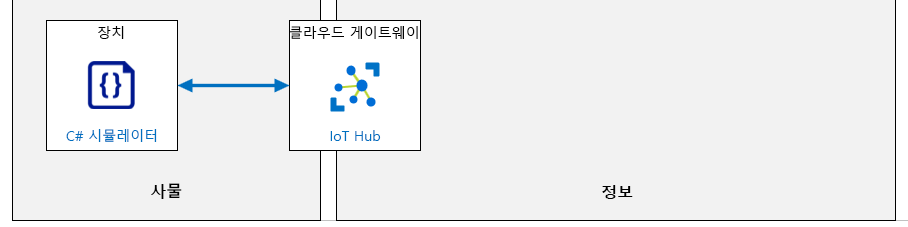

---
lab:
    title: '랩 04: IoT 디바이스를 Azure에 연결'
    module: '모듈 2: 디바이스 및 디바이스 통신'
---

# IoT 디바이스를 Azure에 연결

## 랩 시나리오

Contoso는 고품질 치즈를 생산하는 것으로 유명합니다. 회사는 인기와 판매량이 급속히 성장하고 있어서 치즈 품질을 고객이 기대하는 높은 수준으로 유지할 수 있게 조치를 취하고자 합니다.

과거에는 각 근무 교대 근무 시 공장 작업자가 온도 및 습도 데이터를 수집했습니다. 이 회사는 공장을 확장하면 새로운 시설이 온라인으로 전환되어 모니터링을 확대해야 하지만 수동 데이터 수집 프로세스는 확장하지 않을 것을 우려하고 있습니다.

Contoso는 IoT 디바이스를 사용하여 온도와 습도를 모니터링하는 자동화 시스템을 사용하기로 결정했습니다. 원격 분석 데이터가 전달되는 속도는 치즈 덩어리들이 환경적으로 민감한 공정을 통해 진행될 때 제조 공정이 제어되도록 조정할 수 있습니다.

본격적으로 구현하기에 앞서 이 자산 모니터링 솔루션을 평가하려면, 온도 및 습도 센서를 포함하는 IoT 디바이스를 IoT Hub에 연결합니다.

> **참고**: 이 랩에서는 실제 IoT 디바이스와 센서를 시뮬레이트하는 .NET Core 콘솔 애플리케이션을 만듭니다. 시뮬레이션된 디바이스는 IoT 디바이스 SDK를 구현하며, 실제 디바이스처럼 IoT Hub에 연결됩니다. 또한 실제 디바이스가 사용하는 것과 같은 SDK 리소스를 사용하여 원격 분석 값을 전달합니다. 단, 센서 판독값으로는 생성된 값을 사용하며 온도 및 습도 센서에서 실제 값을 읽지는 않습니다.

다음 리소스가 만들어집니다.



## 랩 내용

이 랩에서는 먼저 랩 필수 구성 요소를 검토한 후 필요에 따라 스크립트를 실행하여 Azure 구독에 필요한 리소스가 포함되어 있는지를 확인합니다. 그런 다음 Azure Portal을 사용하여 Azure IoT Hub에 디바이스 ID를 등록하고, Visual Studio Code에서 이 ID에 해당하는 시뮬레이션된 디바이스 앱을 개발합니다. 그 후에는 시뮬레이션된 디바이스 코드에 연결 문자열(디바이스 등록 시 IoT Hub에서 작성됨)을 삽입하고, 앱을 실행하여 연결을 테스트해 원격 분석이 IoT Hub에 정상적으로 전송되는지 확인합니다. 랩에 포함된 연습은 다음과 같습니다.

* 랩 필수 구성 요소 확인
* Azure Portal을 사용하여 Azure IoT Hub 디바이스 ID 만들기
* 시뮬레이션된 디바이스 만들기 및 테스트(C#)

## 랩 지침

### 연습 1: 랩 필수 구성 요소 확인

이 랩은 다음 Azure 리소스를 사용할 수 있다고 가정합니다.

| 리소스 유형  | 리소스 이름                |
| :------------- | :--------------------------- |
| 리소스 그룹 | rg-az220                     |
| IoT Hub        | iot-az220-training-{your-id} |

이러한 리소스를 사용할 수 없는 경우 연습 2로 이동하기 전에 아래 설명에 따라 **lab04-setup.azcli** 스크립트를 실행해야 합니다. 스크립트 파일은 개발자 환경 구성(랩 3)의 일부로 로컬로 복제한 GitHub 리포지토리에 포함됩니다.

> **참고**:  **lab04-setup.azcli** 스크립트는 **bash** 셸 환경에서 실행되도록 작성됩니다. 이는 Azure Cloud Shell에서 실행할 수 있는 가장 쉬운 방법입니다.

1. 브라우저를 사용하여 [Azure Cloud Shell](https://shell.azure.com/)을 열고 이 과정에 사용 중인 Azure 구독으로 로그인합니다.

1. Cloud Shell에 대한 스토리지 설정 관련 메시지가 표시되면 기본값을 수락합니다.

1. Cloud Shell에서 **Bash**를 사용하고 있는지 확인합니다.

    Azure Cloud Shell 페이지의 왼쪽 상단에 있는 드롭다운은 환경을 선택하는 데 사용됩니다. 선택한 드롭다운 값이 **Bash**인지 확인합니다.

1. Cloud Shell 도구 모음에서 **파일 업로드/다운로드**(오른쪽의 네 번째 단추)를 클릭합니다.

1. 드롭다운에서 **업로드**를 클릭합니다.

1. 파일 선택 대화 상자에서 개발 환경을 구성할 때 다운로드한 GitHub 랩 파일의 폴더 위치로 이동합니다.

    이 과정의 랩 3 "개발 환경 설정"에서 ZIP 파일을 다운로드하고 내용을 로컬로 추출하여 랩 리소스를 포함하는 GitHub 리포지토리를 복제했습니다. 추출된 폴더 구조에는 다음 폴더 경로가 포함됩니다.

    * 모든 파일
      * 랩
          * 04-IoT 디바이스를 Azure에 연결
            * 설정

    lab04-setup.azcli 스크립트 파일은 랩 4의 Setup 폴더에 있습니다.

1. **lab04-setup.azcli** 파일을 선택한 다음 **열기**를 클릭합니다.

    파일 업로드가 완료되면 알림이 표시됩니다.

1. 올바른 파일을 업로드했는지 확인하려면 다음 명령을 입력합니다.

    ```bash
    ls
    ```

    `ls` 명령으로 현재 디렉터리의 내용을 나열합니다. lab04-setup.azcli 파일이 나열됩니다.

1. 설치 스크립트가 포함된 이 랩에 대한 디렉터리를 만든 다음 해당 디렉터리로 이동하려면 다음 Bash 명령을 입력합니다.

    ```bash
    mkdir lab4
    mv lab04-setup.azcli lab4
    cd lab4
    ```

    이러한 명령은 이 랩의디렉터리를 만들고 **lab04-setup.azcli** 파일을 해당 디렉터리로 이동한 다음 디렉터리를 변경하여 새 디렉터리를 현재 작업 디렉터리로 만듭니다.

1. **lab04-setup.azcli**에 실행 권한이 있는지 확인하려면 다음 명령을 입력합니다.

    ```bash
    chmod +x lab04-setup.azcli
    ```

1. Cloud Shell 도구 모음에서 lab04-setup.azcli 파일에 액세스할 수 있도록 설정하려면 **편집기 열기**(오른쪽에서 두 번째 단추 - **{}**)를 클릭합니다.

1. **파일** 목록에서 lab4 폴더를 확장하고 스크립트 파일을 열려면 **lab4**를 클릭한 다음 **lab04-setup.azcli**를 클릭합니다.

    이제 편집기에서 **lab04-setup.azcli** 파일의 내용을 표시합니다.

1. 편집기에서 `{your-id}` 및 `{your-location}` 변수의 값을 업데이트합니다.

    아래 샘플을 예로 들어 보면, `{your-id}`는 이 과정을 시작할 때 만든 고유 ID(예: **cah191211**)로 설정하고 `{your-location}`는 리소스 그룹용으로 사용한 위치로 설정해야 합니다(아래 설명과 예제 참조).

    ```bash
    #!/bin/bash

    # 아래 값을 변경하세요!
    YourID="{your-id}"
    Location="{your-location}"
    ```

    > **참고**:  `{your-location}` 변수는 모든 리소스를 배포하는 지역의 짧은 이름으로 설정해야 합니다. 이 명령을 입력하면 사용 가능한 위치 및 짧은 이름(**이름** 열)의 목록을 볼 수 있습니다.

    ```bash
    az account list-locations -o Table

    DisplayName           Latitude    Longitude    Name
    --------------------  ----------  -----------  ------------------
    East Asia             22.267      114.188      eastasia
    Southeast Asia        1.283       103.833      southeastasia
    Central US            41.5908     -93.6208     centralus
    East US               37.3719     -79.8164     eastus
    East US 2             36.6681     -78.3889     eastus2
    ```

1. 파일의 변경 내용을 저장하고 편집기를 닫으려면 편집기 창 오른쪽 위의 **...** 를 클릭한 다음 **편집기 닫기**를 클릭합니다.

    저장하라는 메시지가 표시된 경우 **저장**을 클릭하면 편집기가 닫힙니다.

    > **참고**:  **CTRL+S**를 사용하여 언제든지 저장할 수 있으며 **CTRL+Q**를 사용하여 편집기를 닫을 수 있습니다.

1. 이 랩에 필요한 리소스를 만들려면 다음 명령을 입력합니다.

    ```bash
    ./lab04-setup.azcli
    ```

    이 작업을 실행하려면 몇 분 정도 걸립니다. 각 단계가 완료될 때 출력이 표시됩니다.

스크립트가 완료되면 랩으로 계속할 준비가 끝납니다.

### 연습 2: Azure Portal을 사용하여 Azure IoT Hub 디바이스 ID 만들기

이 과정에서는 IoT Hub 기능을 사용하여 Contoso용으로 모든 기능을 갖춘 확장 가능 IoT 솔루션을 만듭니다. 그러나 이 랩에서는 IoT Hub를 사용해 IoT 디바이스와 IoT Hub 간에 안정적인 보안 양방향 통신을 설정하는 과정을 중점적으로 진행합니다.

이 연습에서는 Azure Portal에서 IoT Hub를 열고 디바이스 레지스트리에 새 IoT 디바이스를 추가합니다. 그런 다음 IoT Hub에서 디바이스용으로 작성한 연결 문자열 복사본을 가져옵니다(이 랩 뒷부분에 나오는 디바이스 코드에서 해당 연결 문자열을 사용함).

#### 작업 1: 디바이스 만들기

1. 필요한 경우 Azure 계정 자격 증명을 사용하여 [portal.azure.com](https://portal.azure.com)에 로그인합니다.

    Azure 계정이 두 개 이상인 경우 이 과정에 사용할 구독에 연결된 계정으로 로그인해야 합니다.

1. AZ-220 대시보드가 표시되는지 확인합니다.

1. **rg-az220** 리소스 그룹 타일에서 **iot-az220-training-{your-id}** 를 클릭합니다.

1. IoT Hub 블레이드의 왼쪽 메뉴에서 **탐색기** 아래의 **IoT 디바이스**를 클릭합니다.

1. **IoT 디바이스** 창 상단에서 **+ 새로 만들기**를 클릭합니다.

1. **디바이스 ID** 필드에 **sensor-th-0001**을 입력합니다.

    디바이스 ID는 디바이스 인증 및 액세스 제어에 사용됩니다.

    디바이스 ID용으로 특정 형식의 명명 규칙을 설정해 두면 유용합니다. 여러 가지 이유가 있는데, 그 중 하나는 디바이스 ID가 IoT Hub에서 디바이스를 표시하는 데 사용하는 값이기 때문입니다. 그러므로 디바이스를 쉽게 구분할 수 있으며 디바이스 관련 정보를 제공하는 디바이스 ID를 설정하면 도움이 되빈다.

    위에 제안되어 있는 명명 규칙인 _sensor-th-0001_에서는 해당 디바이스가 센서 지원 디바이스(_sensor_)이고, 온도와 습도 값을 보고하며(_-th_), 최대 9999개 디바이스가 포함된 해당 디바이스 유형 시리즈의 첫 번째 디바이스(_-0001_)임을 나타냅니다. Contoso에서는 이러한 디바이스를 200~5000대 설치할 수 있으며, 이러한 디바이스는 공장의 환경 상태를 보고합니다. 그리고 디바이스 ID는 디바이스를 인식할 수 있는 방법 중 한 가지로 사용될 예정입니다.

1. **인증 유형**에 **대칭 키**가 선택되어 있는지 확인합니다.

    사용 가능한 인증 유형은 세 가지입니다. 이 랩에서는 세 가지 중 가장 단순한 유형인 대칭 키를 활용합니다. X.509 인증서 및 인증에 이러한 인증서를 사용하는 방법에 대해서는 이후 랩에서 다룹니다.

1. **기본 키** 및 **보조 키** 필드는 사용하지 않도록 설정되어 있습니다.

1. **키 자동 생성**에서 체크박스가 선택되어 있는지 확인합니다.

    **키 자동 생성**을 선택하면 **기본 키** 및 **보조 키** 필드가 사용하지 않도록 설정되며, 레코드를 저장하고 나면 해당 필드에 값이 입력됩니다. **키 자동 생성** 선택을 취소하면 이러한 필드가 사용하도록 설정되므로 해당 필드에 값을 직접 입력할 수 있습니다.

1. **IoT Hub에 이 디바이스 연결**에서 **사용**이 선택되어 있는지 확인합니다.

    롤아웃 전에 디바이스 항목을 만드는 경우에는 디바이스 초기 작성 시에 여기서 사용 안 함 옵션을 선택할 수 있습니다. 디바이스 레코드는 유지하되 관련 디바이스가 IoT Hub에 연결하지 않도록 하려는 경우 나중에 이 값을 사용 안 함으로 설정할 수도 있습니다.

1. **상위 디바이스**의 값은 **상위 디바이스 없음**으로 유지합니다.

    IoT Edge 디바이스 등의 다른 디바이스가 IoT 디바이스의 상위 디바이스인 경우도 있습니다. 상위-하위 디바이스 관계는 이 과정 뒷부분에서 구현할 예정입니다.

1. IoT Hub에 이 디바이스 레코드를 추가하려면 **저장**을 클릭합니다.

    잠시 후에 **IoT 디바이스** 창이 새로 고쳐지고 새 디바이스가 표시됩니다.

    > **팁**: 창을 수동으로 새로 고쳐야 할 수도 있습니다. 이 경우에는 브라우저를 새로 고치지 말고 페이지 아래쪽의 **새로 고침**을 클릭하세요.

#### 작업 2: 디바이스 연결 문자열 가져오기

IoT Hub에 연결하려는 디바이스는 IoT Hub에 대한 연결을 설정해야 합니다. 이 랩에서는 연결 문자열을 사용하여 디바이스를 IoT Hub에 직접 연결합니다(이러한 인증 형식을 대개 대칭 키 인증이라고 함). 대칭 키 인증을 사용할 때는 기본 키를 사용하는 연결 문자열과 보조 키를 사용하는 연결 문자열의 두 가지 연결 문자열을 사용할 수 있습니다. 앞에서 설명한 것처럼, 디바이스 레코드를 저장해야 기본 키와 보조 키가 생성됩니다. 그러므로 연결 문자열 중 하나를 가져오려면 먼저 레코드를 저장(이전 작업에서와 같이)한 후 디바이스 레코드를 다시 열어야 합니다(이 작업에서 디바이스 레코드를 다시 열 예정임).

1. IoT Hub의 **IoT 디바이스** 창 **디바이스 ID** 아래에서 **sensor-th-0001**을 클릭합니다.

1. **sensor-th-0001** 디바이스 세부 정보 블레이드의 내용을 잠시 검토합니다.

    디바이스 속성이 제공되는 디바이스 세부 정보 블레이드의 위쪽에서는 다양한 디바이스 관련 기능(예: 직접 메서드, 디바이스 트윈)에 액세스하는 기능도 제공됩니다.

1. 이제 이 블레이드에 키와 연결 문자열 값이 입력되어 있습니다.

    이러한 값은 기본적으로 난독 처리됩니다. 하지만 각 필드 오른쪽의 "눈 모양" 아이콘을 클릭하면 값 표시와 숨기기 간을 토글할 수 있습니다.

1. **기본 연결 문자열** 필드의 오른쪽에서 **복사**를 클릭합니다.

    단추 아이콘을 마우스 포인터로 가리키면 단추 이름이 표시됩니다. 복사 단추는 맨 오른쪽에 있습니다.

    > **참고**: 이 랩 뒷부분에서 기본 연결 문자열 값을 사용해야 하므로, 쉽게 액세스할 수 있는 위치에 해당 값을 저장해 두면 좋습니다(예: 메모장 등의 텍스트 편집기에 값을 붙여넣은 후 파일 저장).

    연결 문자열의 형식은 다음과 같습니다.

    ```text
    HostName={IoTHubName}.azure-devices.net;DeviceId=sensor-th-0001;SharedAccessKey={SharedAccessKey}
    ```

### 연습 3: 시뮬레이션된 디바이스 만들기 및 테스트(C#)

Azure IoT 디바이스 SDK에서는 디바이스 클라이언트를 사용하여 IoT 디바이스에서 실행되는 앱을 빌드할 수 있습니다. SDK의 도구를 활용하면 보안 연결을 설정할 수 있으며, 메시지를 패키지하고 IoT Hub와의 통신도 구현할 수 있습니다. 또한 디바이스 SDK를 통해 IoT Hub에서 메시지, 작업, 메서드 또는 디지털 트윈 업데이트를 수신할 수도 있습니다.

이 연습에서는 Visual Studio Code 및 Azure IoT 디바이스 SDK를 사용하여 시뮬레이션된 디바이스 애플리케이션을 만듭니다. 그런 다음 이전 연습에서 만든 디바이스 ID 및 공유 액세스 키(기본 연결 문자열)를 사용하여 Azure IoT Hub에 디바이스를 연결합니다. 그런 후에는 보안 디바이스 연결과 통신을 테스트하여 IoT Hub에서 디바이스의 시뮬레이션된 온도 및 습도 값을 정상적으로 수신하는지를 확인합니다.

> **참고**: 이 랩에서는 C# 프로그래밍 언어를 사용하여 시뮬레이션된 디바이스 코드를 작성합니다. 평소에 다른 프로그래밍 언어를 사용해 왔거나 프로그래밍 기술 수준이 높지 않더라도 지침에 따라 쉽게 코드를 작성할 수 있습니다. 코드에서 IoT 디바이스 SDK가 구현되는 방식만 이해하면 됩니다(이 구현 방식에 대해서도 자세히 설명할 예정임).

#### 작업 1: 초기 프로젝트 만들기

1. 새 명령줄/터미널 창을 엽니다.

    예를 들어 Windows **명령 프롬프트** 명령줄 애플리케이션을 사용할 수 있습니다.

1. 시뮬레이션된 디바이스 애플리케이션을 만들 폴더 위치로 이동합니다.

    루트 폴더 위치는 중요하지 않으며, 쉽게 찾을 수 있도록 짧은 폴더 경로를 사용하는 것이 좋습니다.

1. "CaveDevice" 디렉터리를 만들고 현재 디렉터리를 해당 디렉터리로 변경하려면 명령 프롬프트에서 다음 명령을 입력합니다.

   ```bash
   mkdir CaveDevice
   cd CaveDevice
   ```

1. 새 .NET 콘솔 애플리케이션을 만들려면 다음 명령을 입력합니다.

    ```bash
    dotnet new console
    ```

    이 명령은 프로젝트 파일과 함께 폴더에 **Program.cs** 파일을 만듭니다.

1. 시뮬레이션된 디바이스 앱에 필요한 Azure IoT 디바이스 SDK 및 코드 라이브러리를 설치하려면 다음 명령을 입력합니다.

    ```bash
    dotnet add package Microsoft.Azure.Devices.Client
    ```

    > **참고**: .NET 용 Azure IoT 디바이스 SDK가 들어 있는 **Microsoft.Azure.Devices.Client** 패키지에는 **Newtonsoft.Json** 패키지가 종속성으로 포함되어 있습니다. **Newtonsoft.Json** 패키지에 포함된 API를 활용하면 JSON을 만들고 조작할 수 있습니다.

    다음 작업에서 시뮬레이션된 디바이스 앱을 빌드하고 테스트합니다.

1. 애플리케이션 종속성을 모두 다운로드하려면 다음 명령을 입력합니다.

    ```bash
    dotnet restore
    ```

1. **Visual Studio Code**를 엽니다.

1. **파일** 메뉴에서 **폴더 열기**를 클릭합니다.

1. **폴더 열기** 대화 상자에서 **CaveDevice** 디렉터리를 만든 위치로 이동합니다.

1. 폴더 목록에서 **CaveDevice**를 클릭하고 **폴더 선택**을 클릭합니다.

    이제 Visual Studio Code의 탐색기 창에 두 개의 C# 프로젝트 파일이 나열됩니다.

    * CaveDevice.csproj
    * Program.cs

    > **참고**: **빌드 및 디버그에 필요한 자산이 `CaveDevice`에서 누락되었습니다. 추가하시겠습니까?** 라는 메시지가 표시되는 경우 **예**를 클릭하여 계속 진행하면 됩니다.

#### 작업 2: 애플리케이션 살펴보기

앞에서 설명한 것처럼, 애플리케이션은 현재 다음의 두 파일로 구성되어 있습니다.

* CaveDevice.csproj
* Program.cs

이 작업에서는 Visual Studio Code를 사용하여 애플리케이션 파일 2개의 내용과 용도를 검토합니다.

1. **탐색기** 창에서 애플리케이션 프로젝트 파일을 열려면 **CaveDevice.csproj**를 클릭합니다.

    코드 편집기 창에서 **CaveDevice.csproj** 파일이 열립니다.

1. **CaveDevice.csproj** 파일의 내용을 잠시 검토합니다.

    파일 내용은 다음과 같습니다.

    ```xml
    <Project Sdk="Microsoft.NET.Sdk">

        <PropertyGroup>
            <OutputType>Exe</OutputType>
            <TargetFramework>netcoreapp3.1</TargetFramework>
        </PropertyGroup>

        <ItemGroup>
            <PackageReference Include="Microsoft.Azure.Devices.Client" Version="1.*" />
        </ItemGroup>

    </Project>
    ```

    > **참고**: 파일의 패키지 버전 번호가 위에 나와 있는 것과 다를 수도 있는데, 달라도 괜찮습니다.

    프로젝트 파일(.csproj)은 작업 중인 프로젝트 유형을 지정하는 XML 문서입니다. 이 랩의 프로젝트는 **Sdk** 스타일 프로젝트입니다.

    위의 코드에 나와 있듯이 프로젝트 정의에는 **PropertyGroup**과 **ItemGroup**의 2개 섹션이 포함되어 있습니다.

    **PropertyGroup**은 이 프로젝트를 빌드하면 생성되는 출력 유형을 정의합니다. 여기서는 .NET Core 3.1을 대상으로 하는 실행 파일을 작성합니다.

    **ItemGroup**은 애플리케이션에 필요한 외부 라이브러리를 지정합니다. 위 코드에 포함된 참조는 NuGet 패키지 참조이며, 각 패키지 참조에는 패키지 이름과 버전이 지정되어 있습니다. `dotnet add package` 명령(위의 단계에서 입력한 명령)이 해당 참조를 프로젝트 파일에 추가했으며, `dotnet restore` 명령이 모든 종속성이 다운로드되었는지를 확인했습니다.

    > **팁**: [여기](https://docs.microsoft.com/ko-kr/nuget/what-is-nuget)서 NuGet에 대해 자세히 알아볼 수 있습니다.

1. **탐색기** 창에서 **Program.cs**를 클릭합니다.

    코드 편집기 창에서 **Program.cs** 파일이 열립니다.

1. **Program.cs** 파일의 내용을 잠시 검토합니다.

    파일 내용은 다음과 같습니다.

    ```csharp
    using System;

    namespace CaveSensor
    {
        class Program
        {
            static void Main(string[] args)
            {
                Console.WriteLine("Hello World!");
            }
        }
    }
    ```

    이 프로그램은 명령줄 창에 "Hello World!"를 작성하는 단순한 프로그램입니다. 코드가 많지는 않지만 부족해야 하는 부분은 있습니다.

    * `using` 부분 - 소스 파일에 나열되는 네임스페이스의 코드가 **using**임을 나타냅니다(위의 코드에서처럼 파일 맨 위에 지정됨). 이 예제의 코드는 `System`을 사용하도록 지정되어 있습니다. 즉, 코드가 **System** 네임스페이스 내에 포함된 구성 요소를 사용하는 경우에는 해당 코드 줄 내에 **System**이라는 단어를 명시적으로 포함할 필요가 없습니다. 예를 들어 위의 코드에서는 `Console` 클래스를 사용하여 "Hello World!"를 작성합니다. `Console` 클래스는 **System** 네임스페이스의 일부분이지만 `Console`을 사용할 때 `System`이라는 단어를 포함할 필요가 없습니다. 여러 수준으로 중첩되는 네임스페이스도 있다는 점(5개 수준 이상 중첩되는 네임스페이스도 흔히 확인할 수 있음)을 감안할 때 이러한 기능은 매우 효율적입니다. 다시 위의 코드를 살펴보겠습니다. `using System;`을 지정하지 않는다면 다음과 같이 `Console` 줄을 작성해야 합니다.

        ```csharp
        System.Console.WriteLine("Hello World!");
        ```

    * `namespace` 부분 - 네임스페이스 뒤의 `{ }` 안에 들어 있는 클래스가 해당 네임스페이스의 일부분임을 지정합니다. 즉, 위의 예제에서 **Console**이 **System** 네임스페이스의 일부분인 것처럼 **Program** 클래스는 **CaveSensor** 네임스페이스의 일부분이며 해당 클래스의 전체 이름은 **CaveSensor.Program**입니다.

    * `class` 부분 - **Program** 클래스의 내용을 정의합니다. 소스 파일 하나에 클래스를 여러 개 포함할 수 있습니다.

    > **참고**: 특히 규모가 큰 프로젝트에서는 개발자가 대개 클래스를 소스 파일별로 구분합니다(소스 파일당 클래스 하나씩). 그러나 이 과정의 랩에서는 소스 파일당 클래스를 여러 개 포함합니다. 모범 사례와는 다소 다르더라도 쉽게 이해할 수 있는 랩 지침을 제공하기 위해서입니다.

1. Visual Studio Code **보기** 메뉴에서 **터미널**을 클릭합니다.

    이렇게 하면 Visual Studio Code 창 하단에 통합 터미널이 열립니다. 여기서는 터미널 창을 사용해 콘솔 애플리케이션을 컴파일하고 실행합니다.

1. 터미널 창에서 현재 디렉터리 경로가 `CaveDevice` 폴더로 설정되어 있는지 확인합니다.

    터미널 명령 프롬프트에는 현재 디렉터리 경로가 포함되어 있습니다. 입력하는 명령은 현재 위치에서 실행되므로 `CaveDevice` 폴더가 현재 위치인지 확인하세요.

1. **CaveDevice** 프로젝트를 빌드하고 실행하려면 다음 명령을 입력합니다.

    ```cmd/sh
    dotnet run
    ```

1. **Hello World!** 가 표시됩니다.

    잠시 기다리면 입력한 `dotnet run` 명령 바로 아래 줄에 **Hello World!** 가 표시됩니다.

    시뮬레이션된 디바이스 애플리케이션에서도 이와 동일한 `Console.WriteLine` 방식을 사용하여 정보를 로컬에 표시합니다. 그러면 IoT Hub로 전송되는 정보를 확인할 수 있으며, 디바이스가 완료하는 프로세스를 추적할 수 있습니다.

    이 Hello World 앱은 시뮬레이션과 관련된 기본적인 개념을 시연하기는 하지만 시뮬레이션된 디바이스는 아닙니다. 다음 작업에서는 이 코드를 시뮬레이션된 디바이스용 코드로 바꿉니다.

#### 작업 3: 시뮬레이션된 디바이스 코드 구현

이 작업에서는 Visual Studio Code를 사용하여 코드를 입력합니다. 이 코드는 Azure IoT 디바이스 SDK를 활용해 IoT Hub 리소스에 연결합니다.

1. **탐색기** 창에서 **Program.cs**를 클릭합니다.

1. 기존 코드를 모두 선택하여 삭제합니다.

1. 시뮬레이션된 디바이스 애플리케이션의 기본 구조를 만들려면 코드 편집기 창에서 다음 코드를 입력합니다.

    > **중요**: LODS 등의 학습 환경에 코드를 붙여넣으려는 경우 다음과 같은 몇 가지 사항에 유의해야 합니다.
    >
    > * **텍스트 입력 -> 클립보드 텍스트 입력** 버퍼가 제한되므로 복사한 코드가 잘릴 수도 있습니다. 그러므로 작업 내용을 다시 확인하여 누락된 문자를 추가해야 합니다.
    > * **클립보드 텍스트 입력**에서 입력을 시뮬레이트할 때는 Visual Studio Code의 기본 설정에 따라 코드가 자동으로 들여쓰기되며 닫는 괄호 `)`, `}`, `]`가 삽입됩니다. 따라서 문자가 중복되며 들여쓰기가 잘못 설정됩니다. 다음 설정을 사용하여 이러한 작업을 해제할 수 있습니다.
    >    * **편집기: 자동 닫는 괄호**
    >    * **편집기: 자동 들여쓰기**
    > * **F1** 키를 누르고 **문서 서식**을 입력하거나 **Shift+Alt+F**를 눌러 언제든지 소스 서식을 다시 지정할 수 있습니다.


    ```csharp
    // INSERT 이 주석 아래에 using 문을 삽입합니다.

    namespace CaveDevice
    {
        class Program
        {
            // INSERT 이 주석 아래에 변수를 삽입합니다.

            // INSERT 이 주석 아래에 Main 메서드를 삽입합니다.

            // INSERT 이 주석 아래에 SendDeviceToCloudMessagesAsync 메서드를 삽입합니다.

            // INSERT 이 주석 아래에 CreateMessageString 메서드를 삽입합니다.

        }

        // INSERT 이 주석 아래에 EnvironmentSensor 클래스를 삽입합니다.

    }
    ```

    > **참고:** 위의 코드에 나와 있는 것처럼, 네임스페이스와 클래스는 그대로 유지되었지만 다른 항목은 자리 표시자 주석으로 포함되어 있습니다. 다음 단계에서는 파일의 특정 주석 아래에 코드를 삽입합니다.

    > **팁**: Visual Studio Code에서 붙여넣은 텍스트의 서식을 다시 지정하려면 **Shift+Alt+F**를 누르거나, **F1** 키를 눌러 명령 팔레트를 연 다음 **문서 서식**을 검색합니다.

1. `// INSERT using statements below here` 주석을 찾습니다.

1. 애플리케이션 코드가 사용하도록 할 네임스페이스를 지정하려면 다음 코드를 입력합니다.

    ```csharp
    using System;
    using System.Text;
    using System.Threading.Tasks;
    using Microsoft.Azure.Devices.Client;
    using Newtonsoft.Json;
    ```

    위의 코드에서는 **System**을 지정하는 동시에 코드가 사용하도록 할 다른 네임스페이스도 선언했습니다. 구체적으로는 문자열 인코딩용 **System.Text**, 비동기 작업용 **System.Threading.Tasks**, 그리고 앞에서 추가했던 2개 패키지용 네임스페이스를 선언했습니다.

    > **팁**: 코드를 삽입할 때 코드 레이아웃이 적절하지 않은 경우에는 코드 편집기 창을 마우스 오른쪽 단추로 클릭하고 **문서 서식**을 클릭하면 Visual Studio Code에서 문서 서식을 자동으로 지정합니다. **작업** 창을 열고(**F1** 키 누르기) **문서 서식**을 입력한 다음 **Enter** 키를 눌러도 됩니다. Windows에서 이 작업을 수행하는 바로 가기 키는 **Shift+Alt+F**입니다.

1. `// INSERT variables below here` 주석을 찾습니다.

1. 프로그램에서 사용 중인 변수를 지정하려면 다음 코드를 입력합니다.

    ```csharp
    // 디바이스가 IoT Hub와 메시지를 주고받는 데 사용할 수 있는 메서드가 포함됩니다.
    private static DeviceClient deviceClient;

    // IoT Hub를 사용하여 디바이스를 인증하는 디바이스 연결 문자열입니다.
    // 참고: 실제 애플리케이션에서는 연결 문자열을 "하드 코드"하지 않습니다.
    // 연결 문자열은 환경 변수 내에 저장할 수 있습니다. 이 환경 변수는 명령줄을 통해 전달하거나,
    // TPM 모듈 내에 안전하게 저장할 수 있습니다.
    private readonly static string connectionString = "{Your device connection string here}";
    ```

1. 방금 입력한 코드(및 코드 주석)를 잠시 검토합니다.

    **deviceClient** 변수는 **DeviceClient**의 인스턴스를 저장하는 데 사용됩니다. Azure IoT 디바이스 SDK에서 제공되는 DeviceClient 클래스에는 디바이스가 IoT Hub와 메시지를 주고받는 데 사용할 수 있는 메서드가 포함되어 있습니다.

    **connectionString** 변수에는 앞에서 만든 디바이스용 연결 문자열이 포함됩니다. **DeviceClient**에서는 이 값을 사용하여 IoT Hub에 연결합니다.

    > **중요**: 이 과정 전반에 포함된 이 랩과 다른 랩에서 연결 문자열, 암호 및 기타 구성 정보를 애플리케이션에 하드 코드하는 예제를 살펴보게 됩니다. 이러한 하드 코드 방식은 랩을 쉽게 진행하기 위한 용도로만 사용되며, 권장 방식이 **아닙니다**. 랩을 진행하면서 발생하는 이러한 보안 문제는 랩 내에서 최대한 해결할 예정입니다. 보안 관련 토픽(및 기타 중요 고려 사항)은 전반적인 과정 진행 방식에 따라 강사 프레젠테이션과 수강생 핸드북 콘텐츠에서 제공됩니다. 단, 강사 프레젠테이션과 수강생 핸드북 콘텐츠가 정확하게 일치하지는 않을 수도 있습니다. 그러므로 과정 후반부에서 자세히 설명하는 토픽이 랩에 나올 수도 있습니다.

    코드 주석 내에도 언급되어 있듯이, 연결 문자열 및 유사한 구성 값은 환경 변수, 명령줄 매개 변수 등의 대체 방식을 통해 제공해야 합니다. 가능한 경우에는 TPM(신뢰할 수 있는 플랫폼 모듈) 등의 보안 하드웨어에 이러한 정보를 저장하면 더욱 효율적입니다.

1. IoT Hub에서 복사한 기본 연결 문자열을 사용하여 방금 입력한 코드의 **connectionString** 값을 업데이트합니다.

    업데이트된 **connectionString** 변수 줄은 다음과 같습니다.

    ```csharp
    private readonly static string connectionString = "HostName=iot-az220-training-dm200420.azure-devices.net;DeviceId=sensor-th-0001;SharedAccessKey=hfavUmFgoCPA9feWjyfTx23SUHr+dqG9X193ctdEd90=";
    ```

1. `// INSERT Main method below here` 주석을 찾습니다.

1. 시뮬레이션된 디바이스 애플리케이션의 **Main** 메서드를 생성하려면 다음 코드를 입력합니다.

    ```csharp
    private static void Main(string[] args)
    {
        Console.WriteLine("IoT Hub C# Simulated Cave Device. Ctrl-C to exit.\n");

        // MQTT 프로토콜을 사용하여 IoT Hub에 연결
        deviceClient = DeviceClient.CreateFromConnectionString(connectionString, TransportType.Mqtt);
        SendDeviceToCloudMessagesAsync();
        Console.ReadLine();
    }
    ```

    **Main** 메서드는 앱이 시작되고 나면 실행되는 애플리케이션의 첫 부분입니다.

1. 방금 입력한 코드(및 코드 주석)를 잠시 검토합니다.

    단순한 디바이스 앱의 기본 구조는 다음과 같습니다.

    * IoT Hub에 연결
    * 앱에 원격 분석 전송(디바이스-클라우드 메시지)

    **deviceClient** 변수는 **DeviceClient** 정적 메서드 **CreateFromConnectionString**의 결과를 사용하여 초기화됩니다. 이 메서드는 앞에서 지정한 연결 문자열을 사용합니다. 또한 디바이스가 원격 분석을 전송하는 데 사용할 프로토콜(여기서는 MQTT)을 선택합니다.

    > **참고**: 프로덕션 애플리케이션에서는 연결 문제를 정상적으로 처리할 수 있도록 **CreateFromConnectionString** 메서드 호출을 예외 처리 코드에 래핑합니다. 이 랩과 다른 랩에서는 요점만 집중 파악할 수 있도록 최대한 단순하게 작성되어 있습니다. 따라서 코드를 간략하게 유지하기 위해 대다수 오류 처리 과정은 생략되었습니다.

    디바이스가 연결되면 **SendDeviceToCloudMessagesAsync** 메서드가 호출됩니다. 메서드 이름 아래에는 "빨간색 물결선"이 표시됩니다. Visual Studio Code에서 **SendDeviceToCloudMessagesAsync**가 아직 구현되지 않았음을 확인했기 때문입니다. 잠시 후에 이 메서드를 추가하겠습니다.

    마지막으로, 애플리케이션이 사용자 입력을 대기합니다.

    > **정보**: **DeviceClient** 클래스 관련 설명은 [여기](https://docs.microsoft.com/ko-kr/dotnet/api/microsoft.azure.devices.client.deviceclient?view=azure-dotnet)에 나와 있습니다.
    >
    > **정보**: **CreateFromConnectionString** 메서드 관련 설명은 [여기](https://docs.microsoft.com/ko-kr/dotnet/api/microsoft.azure.devices.client.deviceclient.createfromconnectionstring?view=azure-dotnet#Microsoft_Azure_Devices_Client_DeviceClient_CreateFromConnectionString_System_String_Microsoft_Azure_Devices_Client_TransportType_)에 나와 있습니다.
    >
    > **정보**: 지원되는 전송 프로토콜 관련 설명은 [여기](https://docs.microsoft.com/ko-kr/azure/iot-hub/iot-hub-devguide-protocols)에 나와 있습니다.

1. `// INSERT - SendDeviceToCloudMessagesAsync below here` 주석을 찾습니다.

1. **SendDeviceToCloudMessagesAsync** 메서드를 생성하려면 다음 코드를 입력합니다.

    ```csharp
    private static async void SendDeviceToCloudMessagesAsync()
    {
        // 센서 인스턴스를 만듭니다.
        var sensor = new EnvironmentSensor();

        while (true)
        {
            // 센서에서 데이터를 읽습니다.
            var currentTemperature = sensor.ReadTemperature();
            var currentHumidity = sensor.ReadHumidity();

            var messageString = CreateMessageString(currentTemperature, currentHumidity);

            // ASCII 인코딩을 사용하여 메시지 문자열에서 바이트 배열을 만듭니다.
            var message = new Message(Encoding.ASCII.GetBytes(messageString));

            // 메시지에 사용자 지정 애플리케이션 속성을 추가합니다.
            // IoT Hub는 메시지 본문에 액세스하지 않고 이러한 속성을 필터링할 수 있습니다.
            message.Properties.Add("temperatureAlert", (currentTemperature > 30) ? "true" : "false");

            // 원격 분석 메시지 보내기
            await deviceClient.SendEventAsync(message);
            Console.WriteLine("{0} > Sending message: {1}", DateTime.Now, messageString);

            await Task.Delay(1000);
        }
    }
    ```

    **SendDeviceToCloudMessagesAsync** 메서드 선언에는 `async` 키워드가 포함되어 있습니다. 이 키워드는 해당 메서드에 `await` 키워드를 사용하는 비동기 코드가 포함되어 있음을 지정하며, 콜백 연결 자동 처리를 컴파일러에 명령합니다.

1. 방금 입력한 코드(및 코드 주석)를 잠시 검토합니다.

    이 메서드는 다음과 같은 일반적인 메시지 루프를 구현합니다.

    * 센서 하나 이상에서 값 읽기
    * 보낼 메시지 작성
    * 메시지 보내기
    * 일정 시간 대기하거나 이벤트가 발생할 때까지 대기
    * 루프 반복

    아래에 이 메서드 코드의 자세한 설명이 나와 있습니다.

    * 이 코드는 먼저 **EnvironmentSensor** 클래스의 인스턴스를 만듭니다. 루프 외부에서 작성되는 이 인스턴스는 루프 내의 센서 데이터 시뮬레이션을 지원하는 데 사용됩니다. 잠시 후에 **EnvironmentSensor** 클래스를 추가하겠습니다.

    * 그런 다음 무한 루프 `while(true) {}`를 시작합니다. 이 무한 루프는 사용자가 **Ctrl+C**를 누를 때까지 계속 반복 실행됩니다.

    * 루프 내에서는 먼저 센서의 온도 및 습도를 읽은 다음 해당 값을 사용하여 메시지 문자열을 만듭니다. **CreateMessageString**용 코드도 잠시 후에 추가하겠습니다.

    * 그런 다음 IoT Hub로 전송되는 실제 **message**를 작성합니다. 구체적으로는 Azure IoT 디바이스 SDK에서 **Message** 클래스의 인스턴스를 만듭니다. 이 클래스는 IoT Hub와 상호 작용하는 데 사용되는 메시지를 표시하는 데이터 구조입니다(IoT Hub에는 특정 메시지 형식이 필요함). **Message** 클래스에 사용하는 생성자에서는 메시지 문자열을 바이트 배열로 인코딩해야 합니다.

    * 다음으로는 추가 속성으로 메시지를 보강합니다. 예를 들어 위의 코드에서는 **currentTemperature**가 30보다 크면 **temperatureAlert** 속성을 true로 설정하고 그렇지 않으면 false로 설정합니다.

    * 그 후에는 `await deviceClient.SendEventAsync(message);` 호출을 통해 원격 분석 메시지를 전송합니다. 이 줄에는 `await` 키워드가 포함되어 있습니다. 이 키워드는 이어지는 코드가 비동기식으로 실행되어 나중에 완료될 예정임을 컴파일러에 알립니다. 코드 실행이 완료되면 이 메서드가 다음 줄에서 계속 실행됩니다.

    * 마지막으로, 로컬 콘솔 창에 메시지 문자열을 작성하여 IoT Hub로 원격 분석이 전송되었음을 표시한 후 1000밀리초(1초) 동안 대기했다가 루프를 반복합니다.

    > **정보**: `async`, `await` 및 C#의 비동기 프로그래밍 방식에 대한 자세한 내용은 [여기](https://docs.microsoft.com/ko-kr/dotnet/csharp/async)서 확인할 수 있습니다.

    > **정보**: **Message** 클래스 관련 설명은 [여기](https://docs.microsoft.com/ko-kr/dotnet/api/microsoft.azure.devices.client.message?view=azure-dotnet)에 나와 있습니다.

1. `// INSERT CreateMessageString method below here` 주석을 찾습니다.

1. 센서 판독값에서 JSON 문자열을 작성하는 **CreateMessageString** 메서드를 생성하려면 다음 코드를 입력합니다.

    ```csharp
    private static string CreateMessageString(double temperature, double humidity)
    {
        // 전송할 데이터 구조와 일치하는 비동기 개체를 만듭니다.
        var telemetryDataPoint = new
        {
            temperature = temperature,
            humidity = humidity
        };

        // 비동기 개체에서 JSON 문자열을 만듭니다.
        return JsonConvert.SerializeObject(telemetryDataPoint);
    }
    ```

    이 메서드는 온도 및 습도 속성이 포함된 비동기 개체를 만들어 **telemetryDataPoint**에 할당합니다.

    그러면 **telemetryDataPoint**의 값이 **JsonConvert** 클래스를 통해 JSON 문자열로 변환됩니다. 이 클래스는 앞에서 추가한 **Newtonsoft.Json** 패키지에 포함되어 있습니다. 그리고 나면 메시지에서 페이로드로 사용할 JSON 문자열 값이 반환됩니다.

1. `// INSERT EnvironmentSensor class below here` 주석을 찾습니다.

1. **EnvironmentSensor** 클래스를 생성하려면 다음 코드를 입력합니다.

    ```csharp
    /// <summary>
    /// 이 클래스는 센서에 해당됩니다.
    /// 실제 센서는 디바이스 하나 이상을 초기화하고
    /// 내부 상태를 유지 관리하는 코드가 포함됩니다.
    /// 실제 예제는 https://bit.ly/IoT-BME280에서 확인할 수 있습니다.
    /// </summary>
    internal class EnvironmentSensor
    {
        // 초기 원격 분석 값
        double minTemperature = 20;
        double minHumidity = 60;
        Random rand = new Random();

        internal EnvironmentSensor()
        {
            // 여기서 디바이스를 초기화할 수 있습니다.
        }

        internal double ReadTemperature()
        {
            return minTemperature + rand.NextDouble() * 15;
        }

        internal double ReadHumidity()
        {
            return minHumidity + rand.NextDouble() * 20;
        }
    }
    ```

    이 클래스는 난수를 사용하여 온도와 습도에 해당하는 값을 반환하는 매우 단순한 클래스입니다. 실제 클래스는 센서와 상호 작용하는 훨씬 더 복잡한 코드인 경우가 많습니다. 특히 (적절한 단위가 지정된 직접 판독값을 가져오는 대신) 하위 수준에서 센서와 통신하여 측정값을 파생해야 하는 경우에는 코드가 더욱 복잡해집니다.

    > **정보**: 단순한 온도, 습도 및 압력 센서와 상호 작용하는 코드의 대표적인 예제는 [여기](https://bit.ly/IoT-BME280)서 확인할 수 있습니다.

1. **파일** 메뉴에서 **저장**을 클릭합니다.

1. 완성된 애플리케이션을 잠시 살펴봅니다.

    완성된 애플리케이션은 간단한 시뮬레이션된 디바이스에 해당하며, IoT Hub에 디바이스를 연결하고 디바이스-클라우드 메시지를 보내는 방법을 시연합니다.

    이제 애플리케이션을 테스트할 준비가 되었습니다.

#### 작업 4: 애플리케이션 테스트

1. Visual Studio Code 탐색기 창의 **보기 **메뉴에서** 터미널**을 클릭합니다.

    선택한 터미널 셸이 Windows 명령 프롬프트인지 확인합니다.

1. 터미널 보기의 명령 프롬프트에서 다음 명령을 입력합니다.

    ```cmd/sh
    dotnet run
    ```

    이 명령은 시뮬레이션된 디바이스 애플리케이션을 빌드하고 실행합니다. 터미널 위치가 `CaveDevice.cs` 파일이 포함된 디렉터리로 설정되어 있는지 확인합니다.

    > **참고**:  명령이 `Malformed Token` 또는 기타 오류 메시지를 출력하는 경우 **기본 연결 문자열** 값이 `connectionString` 변수의 값으로 올바르게 구성되어 있는지 확인합니다.

    추가 오류 메시지가 표시되는 경우에는 이 랩의 **Final** 폴더에서 참조용으로 제공되는 완성된 솔루션 코드를 참조하여 코드를 올바르게 생성했는지 확인하면 됩니다. 이 **Final** 폴더는 랩 3에서 개발 환경을 설정할 때 다운로드한 랩 리소스 파일에 포함되어 있습니다. 폴더 경로는 다음과 같습니다.

    >
    > * 모든 파일
    >   * 랩
    >      * LAB_AK_04-connect-iot-device-to-azure
    >        * Final

1. 터미널에 표시된 메시지 문자열 출력을 살펴봅니다.

    시뮬레이션된 디바이스 애플리케이션이 실행되면 `temperature` 및 `humidity` 값이 포함된 이벤트 메시지를 Azure IoT Hub로 전송하며 콘솔에 메시지 문자열 출력을 표시합니다.

    터미널 출력은 다음과 유사합니다.

    ```text
    IoT Hub C# Simulated Cave Device. Ctrl-C to exit.

    10/25/2019 6:10:12 PM > Sending message: {"temperature":27.714212817472504,"humidity":63.88147743599558}
    10/25/2019 6:10:13 PM > Sending message: {"temperature":20.017463779085066,"humidity":64.53511070671263}
    10/25/2019 6:10:14 PM > Sending message: {"temperature":20.723927165718717,"humidity":74.07808918230147}
    10/25/2019 6:10:15 PM > Sending message: {"temperature":20.48506045736608,"humidity":71.47250854944461}
    10/25/2019 6:10:16 PM > Sending message: {"temperature":25.027703996760632,"humidity":69.21247714628115}
    10/25/2019 6:10:17 PM > Sending message: {"temperature":29.867399432634656,"humidity":78.19206098010395}
    10/25/2019 6:10:18 PM > Sending message: {"temperature":33.29597232085465,"humidity":62.8990878830194}
    10/25/2019 6:10:19 PM > Sending message: {"temperature":25.77350195766124,"humidity":67.27347029711747}
    ```

    > **참고**: 지금은 시뮬레이션된 디바이스 앱을 실행 상태로 둡니다. 다음 작업은 IoT Hub가 원격 분석 메시지를 받고 있는지 확인하는 것입니다.

#### 작업 3: Azure IoT Hub로 전송된 원격 분석 스트림 확인

이 작업에서는 Azure CLI를 사용하여 시뮬레이션된 디바이스에서 보낸 원격 분석이 Azure IoT Hub에서 수신되고 있는지 확인합니다.

1. 브라우저를 사용하여 [Azure Cloud Shell](https://shell.azure.com/)을 열고 이 과정에 사용 중인 Azure 구독으로 로그인합니다.

1. IoT Hub에서 수신 중인 이벤트 메시지를 모니터링하려면 Azure Cloud Shell에서 다음 명령을 입력합니다.

    ```cmd/sh
    az iot hub monitor-events --hub-name {IoTHubName} --device-id sensor-th-0001
    ```

    _**{IoTHubName}** 자리 표시자를 Azure IoT Hub의 이름으로 바꿔야 합니다._

    > **참고**:  Azure CLI 명령을 실행할 때 _"IoT 확장 버전에 필요한 종속성 업데이트"_라는 메시지가 나타나면 `y` 키를 눌러 업데이트를 수락하고 `Enter` 키를 누릅니다. 이렇게 하면 명령이 예상대로 계속될 수 있습니다.

    `monitor-events` 명령(`az iot hub` Azure CLI 모듈 내에 있음)은 Azure IoT Hub로 전송된 디바이스 원격 분석 및 메시지를 모니터링하는 기능을 제공합니다. 이 명령은 코드 개발 중에 매우 유용한 도구로 활용할 수 있으며, 명령줄 인터페이스를 사용할 수 있으므로 더욱 편리합니다.

    `--device-id` 매개 변수는 선택 사항이며 이를 통해 단일 디바이스에서 이벤트를 모니터링할 수 있습니다. 매개 변수가 생략된 경우 명령은 지정된 Azure IoT Hub로 전송된 모든 이벤트를 모니터링합니다.

1. `az iot hub monitor-events` Azure CLI 명령은 지정된 Azure IoT Hub에 도착하는 이벤트의 JSON 표현을 출력합니다.

    이 명령을 사용하면 IoT Hub로 전송되는 이벤트를 모니터링할 수 있습니다. 또한 디바이스가 IoT Hub에 연결하고 통신할 수 있는지 확인합니다.

    다음과 유사한 메시지가 표시됩니다.

    ```cmd/sh
    Starting event monitor, filtering on device: sensor-th-0001, use ctrl-c to stop...
    {
        "event": {
            "origin": "sensor-th-0001",
            "payload": "{\"temperature\":25.058683971901743,\"humidity\":67.54816981383979}"
        }
    }
    {
        "event": {
            "origin": "sensor-th-0001",
            "payload": "{\"temperature\":29.202181296051563,\"humidity\":69.13840303623043}"
        }
    }
    ```

1. IoT Hub가 원격 분석을 받고 있는 것으로 확인되면 Azure Cloud Shell 및 Visual Studio Code 창에서 **Ctrl C**를 누릅니다.

    Ctrl C는 실행 중인 앱을 중지하는 데 사용됩니다. 불필요한 앱과 작업을 종료해야 한다는 것을 기억하세요.
