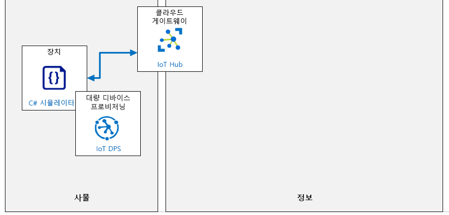

---
lab:
    title: '랩 05: DPS에서 디바이스 개별 등록'
    module: '모듈 3: 대규모로 디바이스 프로비저닝'
---

# DPS에서 디바이스 개별 등록

## 랩 시나리오

Contoso 경영진은 IoT 디바이스를 사용하여 현재 시스템에서 요구하는 수동 데이터 입력 작업을 줄이고 배송 중에 더욱 뛰어난 모니터링을 제공하는 자산 모니터링 및 추적 솔루션을 업데이트하고자 합니다. 이 솔루션은 IoT 디바이스를 프로비저닝하고 프로비저닝 해제하는 기능에 의존합니다. 프로비저닝 요구 사항을 관리하는 가장 좋은 옵션은 DSP인 것으로 판단됩니다.

제안된 시스템은 운송 중 배송 컨테이너의 위치, 온도, 압력을 추적하기 위해 통합 센서가 있는 IoT 디바이스를 사용합니다. 디바이스는 Contoso가 치즈를 운반하는 데 사용하는 기존 배송 컨테이너에 부착되며, 차량 WiFi를 사용하여 Azure IoT Hub에 연결됩니다. 새 시스템은 제품 환경을 지속적으로 모니터링하고 문제가 감지되었을 때 다양한 알림 시나리오를 가능하게 해줍니다.

Contoso의 치즈 포장 시설에서 빈 컨테이너가 시스템에 입력되면 새로운 IoT 디바이스가 장착된 후 포장된 치즈 제품이 적재됩니다. IoT 디바이스는 디바이스 프로비저닝 서비스를 사용하여 IoT Hub에 자동 프로비전되어야 합니다. 컨테이너가 목적지에 도착하면 IoT 디바이스를 회수한 후 DPS를 통해 "서비스 해제"됩니다. 이 디바이스는 이후의 배송품에 다시 사용됩니다.

DPS를 사용하여 디바이스 프로비저닝 및 프로비저닝 취소 프로세스의 유효성을 검사해야 하는 임무를 받았습니다. 프로세스의 초기 단계에서는 개별 등록 방법을 사용합니다.

다음의 리소스가 만들어집니다.



## 이 랩에서

이 랩에서는 다음 활동을 완료할 예정입니다.

* 랩 필수 구성 요소가 충족되는지 확인(필요한 Azure 리소스가 있음)
* DPS에서 새 개별 등록 만들기
* 시뮬레이션된 디바이스 구성
* 시뮬레이션된 디바이스 테스트
* 디바이스 사용 중지

## 랩 지침

### 연습 1: 랩 필수 구성 요소 확인

이 랩은 다음 Azure 리소스를 사용할 수 있다고 가정합니다.

| 리소스 종류 | 리소스 이름 |
| :-- | :-- |
| 리소스 그룹 | AZ-220-RG |
| IoT Hub | AZ-220-HUB-_{YOUR-ID}_ |
| 디바이스 프로비저닝 서비스 | AZ-220-DPS-_{YOUR-ID}_ |

이러한 리소스를 사용할 수 없는 경우 연습 2로 이동하기 전에 아래 설명에 따라 **lab05-setup.azcli** 스크립트를 실행해야 합니다. 스크립트 파일은 개발자 환경 구성(랩 3)의 일부로 로컬로 복제한 GitHub 리포지토리에 포함됩니다.

**lab05-setup.azcli** 스크립트는 **bash** 셸 환경에서 실행하도록 작성됩니다. 이를 실행하는 가장 쉬운 방법은 Azure Cloud Shell에서 실행하는 것입니다.

1. 브라우저를 사용하여 [Azure Cloud Shell](https://shell.azure.com/)을 열고 이 과정에 사용 중인 Azure 구독으로 로그인합니다.

    Cloud Shell에 대한 저장소 설정 관련 메시지가 표시되면 기본값을 수락합니다.

1. Azure Cloud Shell에서 **Bash**를 사용하고 있는지 확인합니다.

    Azure Cloud Shell 페이지의 왼쪽 상단에 있는 드롭다운으로 환경을 선택할 수 있습니다. 선택한 드롭다운 값이 **Bash**인지 확인합니다.

1. Azure Shell 도구 모음에서 **파일 업로드/다운로드**(오른쪽에서 네 번째 단추)를 클릭합니다.

1. 드롭다운에서 **업로드**를 클릭합니다.

1. 파일 선택 대화 상자에서 개발 환경을 구성할 때 다운로드한 GitHub 랩 파일의 폴더 위치로 이동합니다.

    _랩 3: 개발 환경 설정_, ZIP 파일을 다운로드하고 콘텐츠를 로컬로 추출하여 랩 리소스를 포함하는 GitHub 리포지토리를 복제했습니다. 추출된 폴더 구조는 다음 폴더 경로를 포함합니다.

    * Allfiles
      * 랩
          * 05-DPS에서 디바이스 개별 등록
            * 설정

    lab05-setup.azcli 스크립트 파일은 랩 5에 대한 Setup 폴더에 있습니다.

1. **lab05-setup.azcli** 파일을 선택한 다음 **열기**를 클릭합니다.

    파일 업로드가 완료되면 알림이 나타납니다.

1. 올바른 파일을 업로드했는지 확인하려면 다음 명령을 입력합니다.

    ```bash
    ls
    ```

    `ls` 명령으로 현재 디렉터리의 내용을 나열합니다. lab05-setup.azcli 파일이 나열됩니다.

1. 설치 스크립트가 포함된 이 랩에 대한 디렉터리를 만든 다음 해당 디렉터리로 이동하려면 다음 Bash 명령을 입력합니다.

    ```bash
    mkdir lab5
    mv lab05-setup.azcli lab4
    cd lab5
    ```

    이러한 명령은 이 랩에 대한 디렉터리를 만들고 **lab05-setup.azcli** 파일을 해당 디렉터리로 이동한 다음 디렉터리를 변경하여 새 디렉터리를 현재 작업 디렉터리로 만듭니다. 

1. **lab05-setup.azcli** 스크립트에 실행 권한이 있는지 확인하려면 다음 명령을 입력합니다.

    ```bash
    chmod +x lab05-setup.azcli
    ```

1. Cloud Shell 도구 모음에서 lab06-setup.azcli 파일을 편집하려면 **편집기 열기**(오른쪽에서 두 번째 단추 - **{ }**)를 클릭합니다.

1. **파일** 목록에서 lab6 폴더를 확장하고 스크립트 파일을 열려면 **lab5**를 클릭한 다음 **lab05-setup.azcli**를 클릭합니다.

    이제 편집기에서 **lab05-setup.azcli** 파일의 내용을 표시합니다.

1. 편집기에서 `{YOUR-ID}` 및 `{YOUR-LOCATION}` 변수의 값을 업데이트하세요.

    아래 샘플을 예로 들어, `{YOUR-ID}`를 이 과정을 시작할 때 만든 고유 ID(예: **CAH191211**)로 설정하고 `{YOUR-LOCATION}`를 리소스에 적합한 위치로 설정해야 합니다.

    ```bash
    #!/bin/bash

    RGName="AZ-220-RG"
    IoTHubName="AZ-220-HUB-{YOUR-ID}"

    Location="{YOUR-LOCATION}"
    ```

    > **참고**:  `{YOUR-LOCATION}` 변수는 해당 지역의 짧은 이름으로 설정되어야 합니다. 이 명령을 입력하면 사용 가능한 지역 목록과 이 지역의 짧은 이름(**이름** 열)을 볼 수 있습니다.
    >
    > ```bash
    > az account list-locations -o Table
    >
    > 표시이름           위도    경도    이름
    > --------------------  ----------  -----------  ------------------
    > 동아시아             22.267      114.188      eastasia
    > 동남 아시아        1.283       103.833      southeastasia
    > 미국 중부            41.5908     -93.6208     centralus
    > 미국 동부               37.3719     -79.8164     eastus
    > 미국 동부 2             36.6681     -78.3889     eastus2
    > ```

1. 파일의 변경 내용을 저장하고 편집기를 닫으려면 편집기 창의 오른쪽 상단에서 ...를 클릭한 다음 **편집기 닫기**를 클릭합니다.

    저장하라는 메시지가 표시된 경우 **저장**을 클릭하면 편집기가 닫힙니다.

    > **참고**:  **CTRL+S**를 사용하여 언제든지 저장할 수 있으며 **CTRL+Q**를 사용하여 편집기를 닫을 수 있습니다.

1. 이 랩에 필요한 리소스를 만들려면 다음 명령을 입력합니다.

    ```bash
    ./lab05-setup.azcli
    ```

    이 작업을 실행하려면 몇 분 정도 걸립니다. 각 단계가 완료되면 JSON 출력이 표시됩니다.

    스크립트가 완료되면 랩으로 계속할 준비가 끝납니다.

### 연습 2: DPS에서 새 개별 등록(대칭 키) 만들기

이 연습에서는 _대칭 키 증명_을 사용하여 DPS(디바이스 프로비저닝 서비스)에 있는 디바이스에 새 개별 등록을 만듭니다.

#### 작업 1: 등록계약 만들기

1. 필요한 경우 Azure 계정 자격 증명을 사용하여 Azure Portal에 로그인합니다.

    둘 이상의 Azure 계정이 있는 경우에는 이 과정에 사용할 구독에 연결된 계정으로 로그인해야 합니다.

1. 이전 작업에서 만든 **AZ-220** 대시보드가 로드되었습니다.

    IoT Hub 및 DPS 리소스가 모두 나열되어 있습니다.

1. 리소스 그룹 타일에서 **AZ-220-DPS-_{YOUR-ID}_**를 클릭합니다.

1. 왼쪽의 디바이스 프로비저닝 서비스 **설정** 창에서 **등록 관리**를 클릭합니다.

1. 창 상단에서 **+ 개별 등록 추가**를 클릭합니다.

1. **등록 추가** 블레이드의 **메커니즘** 드롭다운에서 **대칭 키**를 클릭합니다.

    이렇게 하면 대칭 키 인증을 사용하는 증명 방법이 설정됩니다.

1. 메커니즘 설정 바로 아래에 **키 자동 생성** 옵션이 선택되어 있습니다.

    그러면 DPS는 디바이스 등록을 만들 시 **기본 키**와 **보조 키** 값 모두를 자동으로 생성하도록 설정됩니다. 선택적으로 이 옵션의 선택을 취소하면 사용자 지정 키를 수동으로 입력할 수 있습니다.

1. DPS 내에 디바이스를 등록할 때 사용할 등록 ID를 지정하려면 **등록 ID** 필드에 **DPSSimulatedDevice1**을 입력합니다.

    기본적으로 등록 ID는 디바이스가 등록에서 프로비저닝될 때 IoT Hub 디바이스 ID로 사용됩니다. 이러한 값이 달라야 하는 경우 해당 필드에 필수 IoT Hub 디바이스 ID를 입력합니다.

1. **IoT Hub 디바이스 ID** 필드를 비워둡니다.

    이 필드를 비워 두면 IoT Hub가 등록 ID를 디바이스 ID로 사용합니다. 선택할 수 없는 필드에 기본 텍스트 값이 표시되어도 걱정하지 마세요. 이 텍스트는 자리 표시자이며 입력한 값으로 취급되지 않습니다.

1. **IoT Edge 디바이스** 필드를 **거짓**으로 설정된 상태로 둡니다.

   새 디바이스는 Edge 디바이스가 아닙니다. IoT Edge 디바이스로 작업하는 것은 이 과정의 뒷부분에서 설명합니다.

1. **허브에 디바이스를 할당할 방법을 선택하세요** 필드를 **균등 가중 배포**로 둡니다.

   등록과 연결된 IoT Hub가 하나만 있으므로 이 설정은 다소 중요하지 않습니다.  여러 분산 허브가 있는 대규모 환경에서 이 설정은 이 디바이스 등록을 받을 IoT Hub를 선택하는 방법을 제어합니다. 지원되는 할당 정책은 네 가지가 있습니다.

    * **최저 대기 시간**: 디바이스는 디바이스에 대한 대기 시간이 가장 짧은 허브를 기반으로 IoT Hub에 프로비저닝됩니다.
    * **균등 가중 분포(기본값)**: 연결된 IoT Hub는 디바이스를 프로비저닝할 가능성이 동일합니다. 이 옵션은 기본 설정입니다. 디바이스를 하나의 IoT Hub로만 프로비저닝하는 경우 이 설정을 유지할 수 있습니다. 
    * **등록 목록을 통한 정적 구성**: 등록 목록에서 원하는 IoT Hub의 사양은 디바이스 프로비저닝 서비스 수준 할당 정책보다 우선시합니다.
    * **사용자 지정(Azure Function 사용)**: 디바이스 프로비저닝 서비스가 Azure Function 코드를 호출하여 디바이스 및 등록에 대한 모든 관련 정보를 제공합니다. 함수 코드가 실행되고 디바이스를 프로비전하는 데 사용되는 IoT 허브 정보를 반환합니다.

1. **이 디바이스를 할당할 수 있는 IoT 허브 선택** 드롭다운은 만든 **AZ-220-HUB-_{YOUR-ID}_** IoT 허브를 지정합니다.

   이 필드는 _DPSSimulatedDevice1_ 디바이스를 할당할 수 있는 IoT Hub를 지정하는 데 사용됩니다.

1. **다시 프로비전닝할 때 디바이스 데이터를 처리하도록 설정하는 방법 선택** 필드가 기본 값인 **데이터 다시 프로비저닝 및 마이그레이션**으로 설정된 상태로 둡니다.

    이 필드는 동일한 디바이스(동일한 등록 ID를 통해 표시된 대로)가 이미 한 번 이상 성공적으로 프로비저닝된 후 나중에 프로비저닝 요청을 제출하는 재프로비저닝 동작에 높은 수준의 제어를 제공합니다. 세 가지 옵션을 사용할 수 있습니다.

    * **데이터 다시 프로비저닝 및 마이그레이션**: 이 정책은 새 등록 항목의 기본값입니다. 이 정책은 등록 항목과 연결된 디바이스가 새 프로비저닝 요청을 제출할 때 조치를 취합니다. 등록 항목 구성에 따라 디바이스가 다른 IoT Hub에 다시 할당될 수 있습니다. 디바이스가 IoT 허브를 변경하는 경우 초기 IoT Hub를 포함한 디바이스 등록이 제거됩니다. 해당 초기 IoT Hub의 모든 디바이스 상태 정보는 새 IoT Hub로 마이그레이션됩니다.
    * **다시 프로비저닝 및 초기 구성으로 다시 설정**: 이 정책은 IoT 허브를 변경하지 않고 공장 초기화에 자주 사용됩니다. 이 정책은 등록 항목과 연결된 디바이스가 새 프로비저닝 요청을 제출할 때 조치를 취합니다. 등록 항목 구성에 따라 디바이스가 다른 IoT Hub에 다시 할당될 수 있습니다. 디바이스가 IoT 허브를 변경하는 경우 초기 IoT Hub를 포함한 디바이스 등록이 제거됩니다. 디바이스를 프로비전닝할 때 프로비저닝 서비스 인스턴스가 받은 초기 구성 데이터가 새 IoT Hub에 제공됩니다.
    * **다시 프로비저닝 안 함**: 디바이스가 다른 허브에 다시 할당되지 않습니다. 이 정책은 이전 버전과의 호환성을 관리하기 위해 제공됩니다.

1. **초기 디바이스 쌍 상태** 필드에서 `properties.desired` JSON 개체를 수정하여 `telemetryDelay`라는 속성의 값을 `"2"`로 지정합니다.

    최종 JSON은 다음과 같습니다.

    ```json
    {
        "tags": {},
        "properties": {
            "desired": {
                "telemetryDelay": "2"
            }
        }
    }
    ```

    이 필드에는 디바이스에 필요한 속성의 초기 구성을 나타내는 JSON 데이터가 포함되어 있습니다. 입력한 데이터는 디바이스에서 센서 원격 분석을 읽고 이벤트를 IoT Hub로 보내는 시간 지연을 설정하는 데 사용됩니다.

1. **입력 사용** 필드를 **사용** 상태로 둡니다.

    일반적으로 새 등록 항목을 사용하도록 설정하고 사용 상태로 유지하려고 합니다.

1. **등록 추가** 블레이드 맨 위에 있는 **저장**을 클릭합니다.

#### 작업 2: 등록 유효성 검사

1. **등록 관리** 블레이드에서 개별 디바이스 등록 목록을 보려면 **개별 등록**을 클릭합니다.

1. 개별 등록에서 **DPSSimulatedDevice1**을 클릭합니다.

    이렇게 하면 방금 만든 개별 등록의 등록 세부 정보를 볼 수 있습니다.

1. **인증 유형** 섹션을 보면 **메커니즘**이 **대칭 키**로 설정되어 있음을 알 수 있습니다.

1. 이 디바이스 등록에 대한 **기본 키**와 **보조 키** 값을 복사하고(각 텍스트 상자의 오른쪽에 해당 버튼이 있음) 나중에 참조할 수 있도록 저장합니다.

    이 키는 디바이스가 서비스로 인증할 수 있는 인증 키입니다.

1. **초기 디바이스 쌍 상태**를 보면 디바이스 쌍의 필요한 상태에 대한 JSON에 `telemetryDelay` 속성 값이 `"2"`로 설정되어 있습니다.

1. **DPSSimulatedDevice1** 보기를 닫고 **AZ-220-DPS-_{YOUR-ID}_** 블레이드로 돌아갑니다.

### 연습 3: 시뮬레이션된 디바이스 구성

이 연습에서는 이전에서 만든 개별 등록계약을 사용하여 Azure IoT에 연결하기 위해 C#으로 작성된 시뮬레이션 디바이스를 구성합니다. 또한 Azure IoT Hub에 있는 디바이스 쌍에 따라 디바이스 구성을 읽고 업데이트하는 시뮬레이션 디바이스에 코드를 추가합니다.

이 연습에서 만든 시뮬레이션된 디바이스는 운송 컨테이너/상자에 있는 IoT 디바이스를 나타내며, 운송하는 동안 Contoso 제품을 모니터링하기 위해 사용합니다. Azure IoT Hub로 전송되는 디바이스의 센서 원격 분석에는 컨테이너의 온도와 습도, 압력, 위도/경도 좌표가 포함됩니다. 이 디바이스는 전체 자산 추적 솔루션의 일부입니다.

이전에는 시뮬레이션된 디바이스가 Azure에 연결된 랩에서 공유 선택키를 사용하여 인증하였으므로 디바이스 프로비저닝이 필요하지 않았고 따라서 프로비저닝 관리 이점(예: 디바이스 쌍)을 누릴 수 없을 뿐 아니라 공유 키를 상당히 많이 배포하고 관리해야 했습니다. 그러나 이번 랩은 이전 랩과는 다릅니다.  이 랩에서는 디바이스 프로비저닝 서비스를 통해 고유한 디바이스를 프로비전합니다.

#### 작업 1: 시뮬레이션된 디바이스 만들기

1. **AZ-220-DPS-_{YOUR-ID}_** 블레이드에서 **개요** 창으로 이동합니다.

1. 블레이드의 오른쪽 상단 영역에서 ID 범위에 할당된 값 위에 마우스 포인터를 놓고 **클립보드에 복사**를 클릭합니다.

    이 값을 곧 사용할 것이므로 클립보드를 사용할 수 없는 경우 값을 기록해 둡니다. 대문자 "O"와 숫자 "0"을 구분해야 합니다.

    **ID 범위**는 다음 값과 유사합니다. `0ne0004E52G`

1. **Visual Studio Code**를 사용하여 랩 5용 Starter 폴더를 엽니다.

    다시 말하지만, 이것은 랩 3에서 개발 환경을 설정할 때 다운로드한 랩 리소스 파일을 참조하는 것입니다. 폴더 경로는 다음과 같습니다.

    * Allfiles
      * 랩
          * 05-DPS에서 디바이스 개별 등록
            * 시작

1. **보기** 메뉴에서 **터미널**을 클릭합니다.

    선택한 터미널 셸이 Windows 명령 프롬프트인지 확인합니다.

1. 명령줄을 통해 모든 애플리케이션 NuGet 패키지를 복원하려면 터미널 보기에서 명령 프롬프트에 다음 명령을 입력합니다.

    ```cmd/sh
    dotnet restore
    ```

1. Visual Studio Code 탐색기 창에서 **Program.cs**를클릭합니다.

1. 코드 편집기에서 프로그램 클래스의 맨 위에 있는 `dpsIdScope` 변수를 찾은 다음 Azure Portal의 디바이스 프로비저닝 서비스에서 복사한 ID Scope 값을 사용하여 할당된 값을 업데이트합니다.

    > **참고**: ID 범위 값을 사용할 수 없는 경우 Azure Portal에 있는 DPS 서비스의 개요 블레이드에서 찾을 수 있습니다.

1. `registrationId` 변수를 찾아 값을 **DPSSimulatedDevice1**로 바꿉니다.

    이 변수는 디바이스 프로비저닝 서비스에서 만든 개별 등록의 **등록 ID** 값을 나타냅니다.

1. `individualEnrollmentPrimaryKey`와 `individualEnrollmentSecondaryKey` 변수를 찾아 해당 값을 시뮬레이션된 디바이스의 개별 등록을 구성할 때 저장한 **기본 키** 및 **보조 키** 값으로 바꿉습니다.

    > **참고**: 이러한 키 값을 사용할 수 없는 경우 다음과 같이 Azure Portal에서 복사할 수 있습니다.
    >
    > **등록 관리** 블레이드를 열고 **개별 등록**을 클릭하고 **DPSSimulatedDevice1**을 클릭합니다. 값을 복사한 다음 위에 명시된 대로 붙여넣습니다.

1. 시뮬레이션된 디바이스의 소스 코드를 검토하고 다음 항목에 주의합니다.

    * `ProvisioningDeviceLogic` 클래스에는 시뮬레이션된 디바이스 센서에서 읽을 수 있도록 논리가 있습니다.
    * `ProvisioningDeviceLogic.SendDeviceToCloudMessagesAsync` 메서드에는 온도, 습도, 압력, 위도 및 경도의 시뮬레이션된 센서 판독값을 만드는 논리가 있습니다. 이 메서드는 원격 분석을 디바이스-클라우드 메시지로 Azure IoT Hub에 보냅니다.

1. `ProvisioningDeviceLogic.SendDeviceToCloudMessagesAsync` 메서드에 `Task.Delay`에 호출이 있습니다.

    `Task.Delay`는 다음 원격 분석 메시지를 만들고 보내기 전에 `while` 루프를 일정 시간 동안 '일시 중지'하는 데 사용됩니다. `_telemetryDelay` 변수는 다음 원격 분석 메시지를 보내기 전에 대기할 시간(초)을 정의하는 데 사용됩니다.

1. `ProvisioningDeviceLogic` 클래스의 맨 위에 있는 `_telemetryDelay` 변수 선언을 찾습니다.

    지연의 기본값은 `1`초로 설정되어 있습니다. 다음 단계는 디바이스 쌍 값을 사용하여 지연 시간을 제어하는 코드를 통합하는 것입니다.

#### 작업 2: 디바이스 쌍 속성 통합

디바이스에서 (Azure IoT Hub의) 디바이스 쌍 속성을 사용하려면 디바이스 쌍 속성에 액세스하고 이를 적용하는 코드를 만들어야 합니다. 이 경우, 시뮬레이션된 디바이스 코드를 업데이트하여 디바이스 쌍의 필요한 속성을 읽은 다음 해당 값을 `_telemetryDelay` 변수에 할당합니다. 또한, 디바이스 쌍의 보고된 속성을 업데이트하여 현재 디바이스에서 구현된 지연 값을 나타냅니다.

1. Visual Studio Code 편집기에서 `RunAsync` 메서드를 찾습니다.

1. 잠시 코드를 살펴본 후 다음을 찾습니다. `// TODO 1: OnDesiredPropertyChanged 이벤트 처리` 주석을 설정합니다.

    디바이스 쌍 속성을 통합하려면 디바이스 쌍 속성이 업데이트될 때 시뮬레이션된 디바이스에 알림을 받을 수 있는 코드가 필요합니다.

    이를 위해 `DeviceClient.SetDesiredPropertyUpdateCallbackAsync` 메서드를 사용하고 `OnDesiredPropertyChanged` 이벤트를 만들어 이벤트 처리기를 설정할 수 있습니다.

1. OnDesiredPropertyChanged 이벤트에 DeviceClient를 설정하려면 다음 코드로 `//TODO 1:` 주석을 대체합니다.

    ```csharp
    Console.WriteLine("Connecting SetDesiredPropertyUpdateCallbackAsync event handler...");
    await iotClient.SetDesiredPropertyUpdateCallbackAsync(OnDesiredPropertyChanged, null).ConfigureAwait(false);
    ```

    ProvisioningDeviceLogic 클래스의 맨 위에 DeviceClient의 `iotClient` 인스턴스를 만들었다는 것을 다시 알려드립니다.

    다음으로, `OnDesiredPropertyChanged` 메서드를 `ProvisioningDeviceLogic` 클래스에 추가해야 합니다.

1. 이벤트 처리기의 설정을 완료하려면 ProvisioningDeviceLogic 클래스에 다음 메서드 코드를 추가합니다.

    > **참고**: 이 코드를 `RunAsync` 메서드 아래에 배치할 수 있습니다(업데이트하는 다른 코드 근처에 있도록).

    ```csharp
    private async Task OnDesiredPropertyChanged(TwinCollection desiredProperties, object userContext)
    {
        Console.WriteLine("Desired Twin Property Changed:");
        Console.WriteLine($"{desiredProperties.ToJson()}");

        // 필요한 쌍 속성 읽기
        if (desiredProperties.Contains("telemetryDelay"))
        {
            string desiredTelemetryDelay = desiredProperties["telemetryDelay"];
            if (desiredTelemetryDelay != null)
            {
                this._telemetryDelay = int.Parse(desiredTelemetryDelay);
            }
            // 필요한 telemetryDelay가 null이거나 지정되지 않은 경우 변경하지 마세요.
        }


        // 쌍 속성 보고
        var reportedProperties = new TwinCollection();
        reportedProperties["telemetryDelay"] = this._telemetryDelay.ToString();
        await iotClient.UpdateReportedPropertiesAsync(reportedProperties).ConfigureAwait(false);
        Console.WriteLine("Reported Twin Properties:");
        Console.WriteLine($"{reportedProperties.ToJson()}");
    }
    ```

    `OnDesiredPropertyChanged` 메서드에는 디바이스 쌍의 필요한 속성을 읽고 `_telemetryDelay` 변수를 구성한 다음 보고된 속성을 다시 디바이스 쌍으로 보고하는 코드가 포함되어 Azure IoT Hub에 시뮬레이션된 디바이스의 현재 상태가 구성된다는 것을 알 수 있습니다.

1. `RunAsync` 메서드에서 다음을 찾으세요. `//TODO 2: 디바이스 쌍 속성 로드` 주석을 찾습니다.

1. 디바이스 쌍의 필요한 속성을 읽고 디바이스 시작 시 일치하도록 디바이스를 구성하려면 `// TODO 2:` 주석을 다음 코드로 바꿉니다.

    ```csharp
    Console.WriteLine("Loading device twin Properties...");
    var twin = await iotClient.GetTwinAsync().ConfigureAwait(false);
    await OnDesiredPropertyChanged(twin.Properties.Desired, null);
    ```

    이 코드는 시뮬레이션된 디바이스에 대한 디바이스 쌍을 검색하는 `DeviceTwin.GetTwinAsync` 메서드를 호출합니다. 그런 다음 `Properties.Desired` 속성 개체에 액세스하여 디바이스에 대해 현재 필요한 상태를 검색하고 시뮬레이션된 디바이스 `_telemetryDelay` 변수를 구성하는 `OnDesiredPropertyChanged` 메서드에 전달합니다.

    이 코드는 _OnDesiredPropertyChanged_ 이벤트를 처리하기 위해 이미 만든 `OnDesiredPropertyChanged` 메서드를 다시 사용합니다. 이렇게 하면 디바이스 쌍의 필요한 상태 속성을 읽고 한 곳에서 시작 시 디바이스를 구성하는 코드를 유지하는 데 도움이 됩니다. 결과 코드는 더 간단하고 유지 관리가 더 쉽습니다.

1. Visual Studio Code의 상단 메뉴에서 **파일**을 클릭한 다음 **저장**을 클릭합니다.

    이제 시뮬레이션된 디바이스에서 Azure IoT Hub의 디바이스 쌍 속성을 사용하여 원격 분석 메시지 간의 지연을 설정합니다.

### 연습 4: 시뮬레이션된 디바이스 테스트

이 연습에서는 시뮬레이션된 디바이스를 실행하고 Azure IoT Hub로 센서 원격 분석을 보내는지 확인합니다. 또한, Azure IoT Hub 내에서 시뮬레이션된 디바이스에 대한 디바이스 쌍 업데이트를 통해 원격 분석이 Azure IoT Hub로 전송되는 지연을 업데이트합니다.

#### 작업 1: 디바이스 빌드 및 실행

1. Visual Studio Code에서 코드 프로젝트를 열어 두었는지 확인합니다.

1. 상단 메뉴에서 **보기**를 클릭한 다음 **터미널**을 클릭합니다.

1. 터미널 창에서 명령 프롬프트에 `Program.cs` 파일의 디렉터리 경로가 표시되는지 확인합니다.

1. 명령 프롬프트에서 시뮬레이션된 디바이스 애플리케이션을 빌드하고 실행하려면 다음 명령을 입력합니다.

    ```cmd/sh
    dotnet run
    ```

    > **참고**: 시뮬레이션된 디바이스 애플리케이션은 실행되면 먼저 콘솔(터미널 창)에 상태에 대한 몇 가지 세부 정보를 작성합니다.

1. `필요한 쌍 속성 변경됨:` 줄 뒤에 있는 JSON 출력에 디바이스의 `telemetryDelay` 필요한 값이 있습니다.

    터미널 창에서 위로 스크롤하여 출력을 확인할 수 있습니다. 다음과 유사하게 나타납니다.

    ```text
    RegistrationID = DPSSimulatedDevice1
    ProvisioningClient RegisterAsync . . . 디바이스 등록 상태: 할당됨
    ProvisioningClient AssignedHub: AZ-220-HUB-CP1019.azure-devices.net; DeviceID: DPSSimulatedDevice1
    대칭 키 DeviceClient 인증 만들기
    시뮬레이션된 디바이스. Ctrl C를 눌러 종료.
    DeviceClient OpenAsync.
    SetDesiredPropertyUpdateCallbackAsync 이벤트 처리기 연결 중...
    디바이스 쌍 속성 로드 중...
    필요한 쌍 속성 변경됨:
    {"telemetryDelay":"2","$version":1}
    보고된 쌍 속성:
    {"telemetryDelay":2}
    디바이스 원격 분석을 읽고 보내기 시작...
    ```

1. 시뮬레이션된 디바이스 애플리케이션은 Azure IoT Hub로 원격 분석 이벤트를 보내기 시작합니다.

    원격 분석 이벤트에는 `온도`, `습도`, `압력`, `위도` 및 `경도` 값이 포함되어 있으며 다음과 유사해야 합니다.

    ```text
    11/6/2019 6:38:55 PM > Sending message: {"temperature":25.59094770373355,"humidity":71.17629229611545,"pressure":1019.9274696347665,"latitude":39.82133964767944,"longitude":-98.18181981142438}
    11/6/2019 6:38:57 PM > Sending message: {"temperature":24.68789062681044,"humidity":71.52098010830628,"pressure":1022.6521258267584,"latitude":40.05846882452387,"longitude":-98.08765031156229}
    11/6/2019 6:38:59 PM > Sending message: {"temperature":28.087463226675737,"humidity":74.76071353757787,"pressure":1017.614206096327,"latitude":40.269273772972454,"longitude":-98.28354453319591}
    2019/11/6 6:39:01 PM > 메시지 전송 중: {"temperature":23.575667940813894,"humidity":77.66409506912534,"pressure":1017.0118147748344,"latitude":40.21020096551372,"longitude":-98.48636739129239}
    ```

    원격 분석 판독값 간의 타임스탬프 차이점을 확인합니다. 원격 분석 메시지 간의 지연은 소스 코드에서는 기본값이 `1`초인 것과 달리 디바이스 쌍으로 구성된 것처럼 `2`초여야 합니다. .

1. 시뮬레이션된 디바이스 앱을 실행 상태로 둡니다.

    다음 활동 중에 디바이스 코드가 예상대로 작동하는지 확인합니다.

#### 작업 2: Azure IoT Hub로 전송된 원격 분석 스트림 확인

이 작업에서는 Azure CLI를 사용하여 시뮬레이션된 디바이스에서 보낸 원격 분석이 Azure IoT Hub에서 수신되고 있는지 확인합니다.

1. 브라우저를 사용하여 [Azure Cloud Shell](https://shell.azure.com/)을 열고 이 과정에 사용 중인 Azure 구독으로 로그인합니다.

1. Azure Cloud Shell에서 다음 명령을 입력합니다.

    ```cmd/sh
    az iot hub monitor-events --hub-name {IoTHubName} --device-id DPSSimulatedDevice1
    ```

    _**IoTHubName** 자리 표시자를 Azure IoT Hub의 이름으로 바꿔야 합니다._

1. IoT 허브가 DPSSimulatedDevice1 디바이스에서 원격 분석 메시지를 받고 있습니다.

    시뮬레이션된 디바이스 애플리케이션이 다음 작업을 계속 실행하도록 둡니다.

#### 작업 3: 쌍을 통해 디바이스 구성 변경

시뮬레이션된 디바이스가 실행되면 Azure IoT Hub에서 디바이스 쌍의 원하는 상태를 편집하여 `telemetryDelay` 구성을 업데이트할 수 있습니다. 이 작업은 Azure Portal의 Azure IoT Hub에서 디바이스를 구성하여 수행할 수 있습니다.

1. **Azure Portal**을 열고(아직 열려 있지 않은 경우) **Azure IoT Hub** 서비스로 이동합니다.

1. IoT Hub 블레이드의 왼쪽에 있는 **탐색기** 섹션에서 **IoT 디바이스**를 클릭합니다.

1. IoT 디바이스 목록에서 **DPSSimulatedDevice1**을 클릭합니다.

    > **중요**: 이 랩에 사용할 디바이스를 선택해야 합니다.

1. 디바이스 블레이드에서 블레이드 상단의 **디바이스 쌍**을 클릭합니다.

    **디바이스 쌍** 블레이드는 편집기에 디바이스 쌍에 대한 전체 JSON을 제공합니다. 이렇게 하면 Azure Portal에서 디바이스 쌍 상태를 직접 보거나 편집할 수 있습니다.

1. `properties.desired` 개체의 JSON을 찾습니다.

    여기에는 디바이스의 필요한 상태가 포함됩니다. DPS의 개별 등록에 따라 디바이스가 프로비저닝될 때 구성된 `telemetryDelay` 속성이 이미 있고 `"2"`로 설정되어 있습니다.

1. `telemetryDelay` 필요한 속성에 할당된 값을 업데이트하려면 값을 `"5"`로 변경합니다.

    값에는 따옴표("")가 포함됩니다.

1. 블레이드 상단에서 **저장**을 클릭합니다.

    `OnDesiredPropertyChanged` 이벤트는 시뮬레이션된 디바이스의 코드 내에서 자동으로 트리거되며 디바이스는 디바이스 쌍의 원하는 상태에 대한 변경 내용을 반영하도록 구성을 업데이트합니다.

1. 시뮬레이션된 디바이스 애플리케이션을 실행하는 데 사용하는 Visual Studio Code 창으로 전환합니다.

1. Visual Studio Code에서 터미널 창의 아래쪽으로 스크롤합니다.

1. 디바이스가 디바이스 쌍 속성의 변경 사항을 인식합니다.

    출력에는 새로운 필요한 `telemetryDelay` 속성 값에의 JSON과 함께 `필요한 쌍 속성 변경됨`이라는 메시지가 표시됩니다. 디바이스가 디바이스 쌍의 필요한 상태의 새로운 구성을 선택하면, 자동으로 현재 구성된 대로 5초마다 센서 원격 분석을 보내도록 업데이트합니다.

    ```text
    필요한 쌍 속성 변경됨:
    {"telemetryDelay":"5","$version":2}
    보고된 쌍 속성:
    {"telemetryDelay":5}
    11/6/2019 7:29:55 PM > 메시지 발송: {"temperature":33.01780830277959,"humidity":68.52464504936927,"pressure":1023.0929576073974,"latitude":39.97641877038439,"longitude":-98.49544472071804}
    11/6/2019 7:30:00 PM > 메세지 발송 중: {"temperature":33.95490410689027,"humidity":71.57070464062072,"pressure":1013.3468084112261,"latitude":40.01604868659767,"longitude":-98.51051877869526}
    11/6/2019 7:30:05 PM > Sending message: {"temperature":22.055266337494956,"humidity":67.50505594886144,"pressure":1018.1765662249767,"latitude":40.22292566031555,"longitude":-98.4367936214764}
    ```

1. Azure Cloud Shell에서 Azure CLI 명령을 실행하는 브라우저 페이지로 전환합니다.

    `az iot hub monitor-events` 명령을 계속 실행 중인지 확인합니다. 실행 중이 아닌 경우 명령을 다시 시작합니다.

1. Azure IoT Hub로 전송된 원격 분석 이벤트는 5초의 새 간격으로 수신됩니다.

1. **Ctrl-C**를 사용하여 `az` 명령과 시뮬레이션된 디바이스 애플리케이션을 모두 중지합니다.

1. Azure Portal에서 **디바이스 쌍** 블레이드를 닫습니다.

1. 계속해서 Azure Portal의 시뮬레이션된 디바이스 블레이드에서 **디바이스 쌍**을 클릭합니다.

1. 이번에는 `properties.reported` 개체의 JSON을 찾습니다.

    여기에는 디바이스에서 보고한 상태가 포함됩니다. `telemetryDelay` 속성도 여기에 있으며 `5`로 설정되어 있습니다.  또한 보고된 데이터 값이 마지막으로 업데이트된 시점과 특정 보고된 값이 마지막으로 업데이트된 시기를 표시하는 `$metadata` 값도 있습니다.

1. **디바이스 쌍** 블레이드를 다시 닫습니다.

1. 시뮬레이션된 디바이스 블레이드를 닫은 후 IoT Hub 블레이드를 닫습니다.

### 연습 5: 디바이스 사용 중지

이 단원에서는 DPS(디바이스 프로비저닝 서비스) 및 Azure IoT Hub에서 디바이스를 사용 중지하는 데 필요한 작업을 수행합니다. Azure IoT 솔루션에서 IoT 디바이스를 완전히 사용 중지하려면 두 서비스 모두에서 제거해야 합니다. 운송 상자가 최종 목적지에 도착하면 센서가 상자에서 제거되고 "서비스 해제"되어야 합니다. 완전하게 디바이스를 사용 중지하는 것은 IoT 솔루션 내의 IoT 디바이스의 수명 주기에서 중요한 단계입니다.

#### 작업 1: DPS에서 디바이스 사용 중지

1. 필요한 경우 Azure 계정 자격 증명을 사용하여 Azure Portal에 로그인합니다.

    둘 이상의 Azure 계정이 있는 경우에는 이 과정에 사용할 구독에 연결된 계정으로 로그인해야 합니다.

1. 이전 작업에서 만든 **AZ-220** 대시보드가 로드되었습니다.

    IoT Hub 및 DPS 리소스가 모두 나열되어 있습니다.

1. 리소스 그룹 타일에서 디바이스 프로비저닝 서비스로 이동하려면 **AZ-220-DPS-_{YOUR-ID}_**를 클릭합니다.

1. 디바이스 프로비저닝 서비스 블레이드의 왼쪽 메뉴에서 **등록 관리**를 클릭합니다.

1. 등록 관리 블레이드에서 개별 디바이스 등록 목록을 보려면 **개별 등록**을 클릭합니다.

1. DPSSimulatedDevice1 개별 디바이스 등록을 선택하려면 이름 왼쪽에 있는 확인란을 선택합니다.

    디바이스 등록을 열지 않고 선택하기만 하면 됩니다.

1. 블레이드 상단에서 **삭제**를 선택합니다.

    > **참고**: DPS에서 개별 등록을 삭제하면 등록이 영구적으로 제거됩니다. 등록을 일시적으로 사용하지 않으려면 개별 등록의 **등록 세부 정보**에서 **항목 사용** 설정을 **사용 안 함**으로 설정할 수 있습니다.

1. **등록 제거** 프롬프트에서 **예**를 클릭합니다.

    이제 개별 등록이 DPS(Device Provisioning Service)에서 제거됩니다. 디바이스 사용 중지를 완료하려면 시뮬레이션된 디바이스의 **디바이스 ID**도 **Azure IoT Hub** 서비스에서 제거해야 합니다.

#### 작업 2: IoT Hub에서 디바이스 사용 중지

1. Azure Portal에서 대시보드로 다시 이동합니다.

1. 리소스 그룹 타일에서 **AZ-220-HUB-_{YOUR-ID}_**를 클릭하여 Azure IoT Hub로 이동합니다.

1. 블레이드의 왼쪽에 있는 IoT Hub 블레이드의 **탐색기** 섹션에서 **IoT 디바이스**를 클릭합니다.

1. IoT 디바이스 목록에서 DPSSimulatedDevice1 장치 ID의 왼쪽에 있는 확인란을 선택합니다.

    > **중요**: 이 랩에 사용한 시뮬레이션된 디바이스를 나타내는 디바이스를 선택해야 합니다.

1. 블레이드 상단에서 **삭제**를 선택합니다.

1. **선택한 디바이스를 삭제하시겠습니까**라는 프롬프트에서  **예**를 클릭합니다.

    > **참고**:  IoT Hub에서 장치 ID를 삭제하면 디바이스 등록이 영구적으로 제거됩니다. 일시적으로 디바이스가 IoT Hub에 연결되지 않게 하려면 디바이스의 속성 내에서 **IoT Hub에 연결 사용**을 **사용 중지**로 설정할 수 있습니다.

이제 디바이스 프로비저닝 서비스에서 장치 등록계약이 제거되고 일치하는 장치 ID가 Azure IoT Hub에서 제거되었으므로 시뮬레이션된 디바이스는 솔루션에서 완전히 폐기되었습니다.
