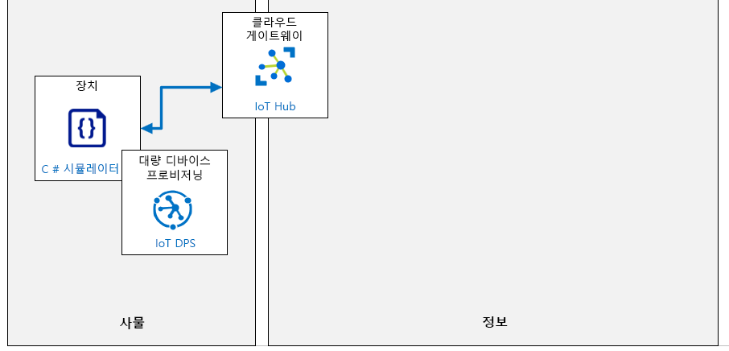

---
lab:
    title: '랩 06: DPS를 통해 IoT 디바이스를 안전하게 대규모로 자동 프로비전'
    module: '모듈 3: 대규모로 디바이스 프로비저닝'
---

# DPS를 통해 IoT 디바이스를 안전하게 대규모로 자동 프로비전

## 랩 시나리오

Contoso의 자산 모니터링 및 추적 솔루션에 대한 최신 작업을 통해 개별 등록을 사용하여 디바이스 프로비저닝 및 프로비저닝 해제 프로세스의 유효성을 검사할 수 있습니다. 지금 관리 팀이 프로세스를 더 큰 규모로 롤아웃하도록 요청했습니다.

프로젝트를 계속 진행하려면 X.509 인증서 인증을 사용하여 더 많은 수의 디바이스를 자동으로 안전하게 등록하는 데 디바이스 프로비저닝 서비스를 사용할 수 있다는 것을 입증해야 합니다.

다음의 리소스가 만들어집니다.



## 이 랩에서

이 랩에서는 다음 활동을 완료할 예정입니다.

* 랩 필수 구성 요소가 충족되는지 확인(필요한 Azure 리소스가 있음)
* OpenSSL을 사용하여 X.509 CA 인증서 생성 및 구성
* DPS에서 그룹 등록 만들기
* X.509 인증서로 시뮬레이션된 디바이스 구성
* 디바이스 쌍의 필요한 속성 변경 처리
* 시뮬레이션된 디바이스의 자동 등록
* 시뮬레이션된 디바이스의 그룹 등록 사용 중지

## 랩 지침

### 연습 1: 랩 필수 구성 요소 확인

이 랩은 다음 Azure 리소스를 사용할 수 있다고 가정합니다.

| 리소스 종류 | 리소스 이름 |
| :-- | :-- |
| 리소스 그룹 | AZ-220-RG |
| IoT Hub | AZ-220-HUB-_{YOUR-ID}_ |
| 디바이스 프로비저닝 서비스 | AZ-220-DPS-_{YOUR-ID}_ |

이러한 리소스를 사용할 수 없는 경우 연습 2로 이동하기 전에 아래 설명에 따라 **lab06-setup.azcli** 스크립트를 실행해야 합니다. 스크립트 파일은 개발자 환경 구성(랩 3)의 일부로 로컬로 복제한 GitHub 리포지토리에 포함됩니다.

**lab06-setup.azcli** 스크립트는 **bash** 셸 환경에서 실행되도록 작성되며, Azure Cloud Shell에서 실행하는 것이 가장 쉬운 방법입니다.

1. 브라우저를 사용하여 [Azure Cloud Shell](https://shell.azure.com/)을 열고 이 과정에 사용 중인 Azure 구독으로 로그인합니다.

    Cloud Shell에 대한 저장소 설정 관련 메시지가 표시되면 기본값을 수락합니다.

1. Azure Cloud Shell에서 **Bash**를 사용하고 있는지 확인합니다.

    Azure Cloud Shell 페이지의 왼쪽 상단에 있는 드롭다운으로 환경을 선택할 수 있습니다. 선택한 드롭다운 값이 **Bash**인지 확인합니다.

1. Azure Shell 도구 모음에서 **파일 업로드/다운로드**(오른쪽에서 네 번째 단추)를 클릭합니다.

1. 드롭다운에서 **업로드**를 클릭합니다.

1. 파일 선택 대화 상자에서 개발 환경을 구성할 때 다운로드한 GitHub 랩 파일의 폴더 위치로 이동합니다.

    _랩 3: 개발 환경 설정_, ZIP 파일을 다운로드하고 콘텐츠를 로컬로 추출하여 랩 리소스를 포함하는 GitHub 리포지토리를 복제했습니다. 추출된 폴더 구조는 다음 폴더 경로를 포함합니다.

    * Allfiles
      * 랩
          * 06-DPS에 있는 디바이스의 자동 등록계약
            * 설정

    lab06-setup.azcli 스크립트 파일은 랩 6의 설치 폴더에 있습니다.

1. **lab06-setup.azcli** 파일을 선택한 다음 **열기**를 클릭합니다.

    파일 업로드가 완료되면 알림이 나타납니다.

1. Azure Cloud Shell에 올바른 파일이 업로드되었는지 확인하려면 다음 명령을 입력합니다.

    ```bash
    ls
    ```

    `ls` 명령으로 현재 디렉터리의 내용을 나열합니다. lab06-setup.azcli 파일이 나열되어야 합니다.

1. 설치 스크립트가 포함된 이 랩에 대한 디렉터리를 만든 다음 해당 디렉터리로 이동하려면 다음 Bash 명령을 입력합니다.

    ```bash
    mkdir lab6
    mv lab06-setup.azcli lab6
    cd lab6
    ```

1. **lab06-setup.azcli** 스크립트에 실행 권한이 있는지 확인하려면 다음 명령을 입력합니다.

    ```bash
    chmod +x lab06-setup.azcli
    ```

1. Cloud Shell 도구 모음에서 lab06-setup.azcli 파일을 편집하려면 **편집기 열기**(오른쪽에서 두 번째 단추 - **{ }**)를 클릭합니다.

1. **파일** 목록에서 lab6 폴더를 펼치고 스크립트 파일을 열려면 **lab6**을 클릭한 다음 **lab06-setup.azcli**를 클릭합니다.

    이제 편집기에 **lab06-setup.azcli** 파일의 콘츠가 표시됩니다.

1. 편집기에서 `{YOUR-ID}` 및 `{YOUR-LOCATION}` 변수의 값을 업데이트하세요.

    아래 샘플을 예로 들어, `{YOUR-ID}`를 이 과정을 시작할 때 만든 고유 ID(예: **CAH191211**)로 설정하고 `{YOUR-LOCATION}`를 리소스에 적합한 위치로 설정해야 합니다.

    ```bash
    #!/bin/bash

    RGName="AZ-220-RG"
    IoTHubName="AZ-220-HUB-{YOUR-ID}"

    Location="{YOUR-LOCATION}"
    ```

    > **참고**:  `{YOUR-LOCATION}` 변수는 해당 지역의 짧은 이름으로 설정되어야 합니다. 이 명령을 입력하면 사용 가능한 지역 목록과 이 지역의 짧은 이름(**이름** 열)을 볼 수 있습니다.
    >
    > ```bash
    > az account list-locations -o Table
    >
    > 표시이름           위도    경도    이름
    > --------------------  ----------  -----------  ------------------
    > 동아시아             22.267      114.188      eastasia
    > 동남 아시아        1.283       103.833      southeastasia
    > 미국 중부            41.5908     -93.6208     centralus
    > 미국 동부               37.3719     -79.8164     eastus
    > 미국 동부 2             36.6681     -78.3889     eastus2
    > ```

1. 파일의 변경 내용을 저장하고 편집기를 닫으려면 편집기 창의 오른쪽 상단에서 ...를 클릭한 다음 **편집기 닫기**를 클릭합니다.

    저장하라는 메시지가 표시된 경우 **저장**을 클릭하면 편집기가 닫힙니다.

    > **참고**:  **CTRL+S**를 사용하여 언제든지 저장할 수 있으며 **CTRL+Q**를 사용하여 편집기를 닫을 수 있습니다.

1. 이 랩에 필요한 리소스를 만들려면 다음 명령을 입력합니다.

    ```bash
    ./lab06-setup.azcli
    ```

    이 작업을 실행하려면 몇 분 정도 걸립니다. 각 단계가 완료되면 JSON 출력이 표시됩니다.

    스크립트가 완료되면 랩으로 계속할 준비가 끝납니다.

### 연습 2: OpenSSL을 사용하여 X.509 CA 인증서 생성 및 구성

이 연습에서는 Azure Cloud Shell 내에서 OpenSSL을 사용하여 X.509 CA 인증서를 생성합니다. 이 인증서는 DPS(디바이스 프로비저닝 서비스) 내에서 그룹 등록계약을 구성하는 데 사용합니다.

#### 작업 1: 인증서 생성

1. 필요한 경우 이 과정에서 사용 중인 Azure 계정 자격 증명을 사용하여 [Azure Portal](https://portal.azure.com)에 로그인합니다.

    둘 이상의 Azure 계정이 있는 경우에는 이 과정에 사용할 구독에 연결된 계정으로 로그인해야 합니다.

1. Azure Cloud Shell을 열려면 포털 창의 오른쪽 상단에서 **Cloud Shell**을 클릭합니다.

    Cloud Shell 단추에는 명령 프롬프트를 나타내는 아이콘이 있습니다(`>_`).

    Cloud Shell 창이 디스플레이 화면 하단 근처에서 열립니다.

1. Cloud Shell 창의 왼쪽 상단에서 **Bash**가 환경 옵션으로 선택되어 있는지 확인합니다.

    > **참고**:  Azure Cloud Shell에 대한 *Bash* 및 *PowerShell* 인터페이스는 **OpenSSL**의 사용을 지원합니다. 이 연습에서는 *Bash* 셸용으로 작성된 일부 도우미 스크립트를 사용합니다.

1. Cloud Shell 명령 프롬프트에서, 사용 중인 Azure IoT 도우미 스크립트를 다운로드하려면 다음 명령을 입력합니다.

    ```sh
    # 인증서 디렉터리 만들기
    mkdir certificates
    # 인증서 디렉터리로 이동
    cd certificates

    # 도우미 스크립트 파일 다운로드
    curl https://raw.githubusercontent.com/Azure/azure-iot-sdk-c/master/tools/CACertificates/certGen.sh --output certGen.sh
    curl https://raw.githubusercontent.com/Azure/azure-iot-sdk-c/master/tools/CACertificates/openssl_device_intermediate_ca.cnf --output openssl_device_intermediate_ca.cnf
    curl https://raw.githubusercontent.com/Azure/azure-iot-sdk-c/master/tools/CACertificates/openssl_root_ca.cnf --output openssl_root_ca.cnf

    # 업데이트 스크립트 사용 권한으로 사용자가 읽고 쓰고 실행할 수 있습니다
    chmod 700 certGen.sh
    ```

    Github에서 호스팅되는 `Azure/azure-iot-sdk-c` 오픈 소스 프로젝트에서 도우미 스크립트 및 지원 파일을 다운로드하고 있습니다. 이 프로젝트는 Azure IoT SDK의 일부인 오픈 소스 프로젝트입니다. `certGen.sh` 도우미 스크립트는 이 랩의 범위를 벗어난 OpenSSL 구성의 세부 사항을 다루지 않고 CA 인증서의 목적을 설명하는 데 도움이 됩니다.

    이 도우미 스크립트 사용에 대한 추가 지침 및 Bash 대신 PowerShell을 사용하는 방법에 대한 지침은 [https://github.com/Azure/azure-iot-sdk-c/blob/master/tools/CACertificates/CACertificateOverview.md](https://github.com/Azure/azure-iot-sdk-c/blob/master/tools/CACertificates/CACertificateOverview.md) 링크를 참조하세요.

    > **경고**: 이 도우미 스크립트로 만든 인증서는 프로덕션에 사용할 수 **없습니다**. 여기에는 하드 코딩된 암호("*1234*")가 포함되어 있고 30일 후에 만료되며, 가장 중요한 것은 CA 인증서를 신속하게 이해할 수 있도록 데모 목적으로 제공됩니다. CA 인증서에 대해 제품을 빌드할 때 인증서 만들기 및 수명 관리를 위해 고유한 보안 모범 사례를 사용해야 합니다.

    관심이 있다면 Cloud Shell에 내장된 편집기를 사용하여 다운로드한 스크립트 파일의 콘텐츠를 빠르게 검사할 수 있습니다.

    * Cloud Shell에서 편집기를 열려면 **`{}`** 를 클릭합니다.
    * 파일 목록에서 **인증서**를 클릭한 다음 **certGen.sh**를 클릭합니다

    > **참고**: Bash 환경에서 `more` 또는 `vi` 명령과 같은 다른 텍스트 파일 보기 도구가 있는 경우 해당 도구를 사용할 수도 있습니다.

    다음 단계에서는 스크립트를 사용하여 루트 및 중간 인증서를 만듭니다.

1. 루트 및 중간 인증서를 만들려면 다음 명령을 입력합니다.

    ```sh
    ./certGen.sh create_root_and_intermediate
    ```

    `create_root_and_intermediate` 옵션을 사용하여 스크립트를 실행했습니다. 이 명령은`~/certificates` 디렉터리 내에서 스크립트를 실행하는 것으로 가정합니다.

    이 명령은 `azure-iot-test-only.root.ca.cert.pem`이라는 루트 CA 인증서를 생성하고 `./certs` 디렉터리(만든 인증서 디렉터리 아래)에 배치했습니다.

1. DPS에 업로드할 수 있도록 로컬 컴퓨터에 루트 인증서를 다운로드하려면 다음 명령을 입력합니다

    ```sh
    download ~/certificates/certs/azure-iot-test-only.root.ca.cert.pem
    ```

    파일을 로컬 컴퓨터에 저장하라는 메시지가 표시됩니다. 다음 작업에 파일이 필요하므로 파일이 저장되는 위치를 기록합니다.

#### 작업 2: 루트 인증서를 신뢰하도록 DPS 구성

1. Azure Portal에서 디바이스 프로비저닝 서비스를 엽니다.

    이것은 디바이스 프로비저닝 서비스 이름 `AZ-220-DPS-{YOUR-ID}`입니다.

1. **디바이스 프로비저닝 서비스** 블레이드의 왼쪽에 있는 **설정** 섹션에서 **인증서**를 클릭합니다.

1. **인증서** 창의 창 상단에서 **추가**를 클릭합니다.  

    **추가**를 클릭하면 X.509 CA 인증서를 DPS 서비스에 업로드하는 프로세스가 시작됩니다.

1. **인증서 추가** 창에서 **인증서 이름** 아래에 **root-ca-cert**를 입력합니다.

    루트 인증서 및 중간 인증서와 같은 인증서 또는 체인 내의 계층 구조 수준에서 여러 인증서를 구분할 수 있는 이름을 하는 것이 중요합니다.

    > **참고**: 입력한 루트 인증서 이름은 인증서 파일의 이름과 같거나 다를 수 있습니다. 제공된 이름은 X.509 CA 인증서 내용에 포함된 _일반 이름_과 상관없는 논리적 이름입니다.

1. **Certificate .pem or .cer file**에서 _파일 선택_ 텍스트 상자 오른쪽의 **열기**를 클릭합니다.

    텍스트 필드 오른쪽의 **열기** 단추를 클릭하면 이전에 다운로드한 `azure-iot-test-only.root.ca.cert.pem` CA 인증서로 이동할 수 있는 OPen 파일 대화 상자가 열립니다.

1. 창 하단에서 **저장**을 클릭합니다.

    X.509 CA 인증서가 업로드되면 _인증서_ 창에 _확인되지 않음_ _상태_의 인증서가 표시됩니다. 이 CA 인증서를 사용하여 디바이스를 DPS에 인증하려면 인증서 **보유 증명**을 확인해야 합니다.

1. 인증서 **보유 증명**을 확인하는 프로세스를 시작하려면 **root-ca-cert**를 클릭합니다.

1. **인증서 세부 정보** 창에서 **확인 코드 생성**을 클릭합니다.

    **확인 코드 생성** 단추를 보려면 아래로 스크롤해야 할 수도 있습니다.

    단추를 클릭하면 생성된 코드가 제출된 확인 코드에 배치됩니다.

1. **확인 코드**의 오른쪽에서 **클립보드에 복사**를 클릭합니다.

    CA 인증서 _보유 증명_은 DPS 내에서 방금 생성된 확인 코드와 함께 CA 인증서에서 생성된 인증서를 업로드하여 DPS에 제공됩니다. 이렇게 하면 CA 인증서를 실제로 보유하고 있다는 증거를 제공할 수 있습니다.

    > **중요**: 확인 인증서를 만드는 동안 **인증서 세부 정보** 창을 열어 두어야 합니다. 창을 닫으면 확인 코드가 무효화되고 새 코드를 생성해야 합니다.

1. **Azure Cloud Shell**을 열고 이전에서 아직 열지 않은 경우 `~/certificates` 디렉터리로 이동합니다.

1. 확인 인증서를 만들려면 다음 명령을 입력합니다.

    ```sh
    ./certGen.sh create_verification_certificate <verification-code>
    ```

    `<verification-code>` 자리 표시자를 Azure Portal에서 만든 **확인 코드**로 바꿔야 합니다.

    예를 들어, 실행하는 명령은 다음과 유사합니다.

    ```sh
    ./certGen.sh create_verification_certificate 49C900C30C78D916C46AE9D9C124E9CFFD5FCE124696FAEA
    ```

    이렇게 하면 CA 인증서에 연결된 _확인 인증서_가 생성됩니다. 인증서의 주체는 확인 코드입니다. `verification-code.cert.pem`이라는 이름으로 생성된 확인 인증서는 Azure Cloud Shell의 `./certs` 디렉터리 내에 있습니다.

    다음 단계에서는 DPS에 업로드할 수 있도록 확인 인증서를 로컬 컴퓨터에 다운로드합니다(이전의 루트 인증서로 수행한 작업과 유사).

1. 확인 인증서를 로컬 컴퓨터에 다운로드하려면 다음 명령을 입력합니다.

    ```sh
    download ~/certificates/certs/verification-code.cert.pem
    ```

    > **참고**: 웹 브라우저에 따라 이 시점에서 여러 다운로드를 허용하라는 메시지가 표시될 수 있습니다. 다운로드 명령에 대한 응답이 없는 것으로 보이면 다운로드 허용 권한을 요청하는 메시지가 화면에 표시되지 않는지 확인합니다.

1. **인증서 세부 정보** 창으로 돌아갑니다.

    기억한다면, DPS 내에서 CA 인증서를 작업하는 동안 Azure Portal에서 이 창을 열어 두었습니다.

1. **인증서 세부 정보** 창 하단의 **확인 인증서 .pem 또는 .cer 파일** 오른쪽에 있는 **열기**를 클릭합니다.

1. 파일 열기 대화 상자에서 다운로드 폴더로 이동한 다음 **verification-code.cert.pem**을 클릭하고 **열기**를 클릭합니다.

1. **인증서 세부 정보** 창 하단에서 **확인**을 클릭합니다.

1. **인증서** 창에서, 이제 인증서 **상태**가 _확인됨_으로 표시되는지 확인합니다.

    이 변경 내용을 보려면 창의 상단에 있는 **새로 고침** 단추(**추가** 단추 오른쪽)를 사용해야 할 수 있습니다.

### 연습 3: DPS에서 그룹 등록계약(X.509 인증서) 만들기

이 연습에서는 _인증서 증명_을 사용하는 DPS(Device Provisioning Service) 내에서 새 등록 그룹을 만듭니다.

#### 작업 1: 등록계약 만들기

1. 필요한 경우 Azure 계정 자격 증명을 사용하여 Azure Portal에 로그인합니다.

    둘 이상의 Azure 계정이 있는 경우에는 이 과정에 사용할 구독에 연결된 계정으로 로그인해야 합니다.

1. 리소스 그룹 타일에서 **AZ-220-DPS-_{YOUR-ID}_** 를 클릭합니다.

1. 디바이스 프로비저닝 서비스 블레이드의 왼쪽에 있는 **설정**에서 **등록 관리**를 클릭합니다.

1. 블레이드 상단에서 **등록 그룹 추가**를 클릭합니다.

    등록 그룹은 기본적으로 자동 프로비저닝을 통해 등록할 수 있는 디바이스의 레코드입니다.

1. **등록 그룹 추가** 블레이드에서 **그룹 이름**에 **simulated-devices**를 입력합니다.

1. **증명 유형**이 **인증서**로 설정되어 있는지 확인합니다.

1. **인증서 유형** 필드가 **CA 인증서**로 설정되어 있는지 확인합니다.

1. **기본 인증서** 드롭다운에서 이전에 DPS에 업로드한 CA 인증서를 선택합니다(**root-ca-cert**와 유사).

1. **보조 인증서** 드롭다운을 **선택한 인증서 없음**으로 설정한 상태로 둡니다.

    보조 인증서는 일반적으로 만료 인증서 또는 손상된 인증서를 수용하기 위해 인증서 회전에 사용됩니다. 롤링 인증서에 대한 자세한 내용은 여기에서 확인할 수 있습니다. [https://docs.microsoft.com/ko-kr/azure/iot-dps/how-to-roll-certificates](https://docs.microsoft.com/ko-kr/azure/iot-dps/how-to-roll-certificates)

1. **허브에 디바이스를 **균등하게 가중치 분포**로 할당하는 방법을 선택**한 상태로 둡니다.

   여러 분산 허브가 있는 대규모 환경에서는 이 설정에서 이 디바이스 등록계약을 받을 IoT Hub를 선택하는 방법을 제어합니다. 이 랩의 등록과 연관된 단일 IoT Hub가 있으므로 IoT Hub에 디바이스를 할당하는 방법은 이 랩 시나리오에는 실제로 적용되지 않습니다. 

1. **AZ-220-HUB-_{YOUR-ID}_** IoT Hub는 **이 디바이스를 할당할 수 있는 IoT Hub 선택:** 드롭다운 내에서 선택됩니다.

   이 필드에서는 이 디바이스를 할당할 수 있는 IoT Hub를 지정합니다.

1. **재프로비저닝에서 디바이스 데이터를 처리할 방법 선택**을 기본값인 **데이터 재프로비저닝 및 마이그레이션**으로 둡니다.

    이 필드는 동일한 디바이스(동일한 등록 ID를 통해 표시된 대로)가 이미 한 번 이상 성공적으로 프로비저닝된 후 나중에 프로비저닝 요청을 제출하는 재프로비저닝 동작에 높은 수준의 제어를 제공합니다.

1. **이 그룹에 할당할 수 있는 IoT Hub 선택** 드롭다운에 **AZ-220-HUB-*{YOUR-ID}*** IoT Hub가 선택되어 있습니다.

    이렇게 하면 디바이스가 프로비전될 때 이 IoT Hub에 추가됩니다.

1. **초기 디바이스 쌍 상태** 필드에서 다음과 같이 JSON 개체를 수정합니다.

    ```json
    {
        "tags": {},
        "properties": {
            "desired": {
                "telemetryDelay": "1"
            }
        }
    }
    ```

    이 JSON 데이터는 이 등록 그룹에 참여하는 모든 디바이스의 디바이스 쌍에 대한 원하는 속성의 초기 구성을 나타냅니다.

    디바이스는 `properties.desired.telemetryDelay` 속성을 사용하여 원격 분석을 읽고 IoT Hub로 보내는 시간 지연을 설정합니다.

1. **항목 사용**을 **사용**으로 설정한 상태로 둡니다.

    일반적으로 새 등록 항목을 사용하도록 설정하고 사용 상태로 유지하려고 합니다.

1. **등록 추가** 블레이드 맨 위에 있는 **저장**을 클릭합니다.

#### 작업 2: 등록 유효성 검사

1. **등록계약 그룹** 탭이 표시되고 새 등록계약 그룹이 나열되었는지 확인합니다.

    등록계약 그룹이 나열되지 않은 경우 블레이드 상단에서 **새로 고침**을 클릭합니다.

1. 그룹 이름 목록에서 **simulated-devices**를 클릭합니다.

1. **등록 그룹 세부 정보** 블레이드에서 다음을 확인합니다.

    * **인증서 유형**이 **CA 인증서**로 설정됩니다.
    * **기본 인증서**가 **root-ca-cert**로 설정됩니다.
    * **보조 인증서**가 **선택된 인증서 없음**으로 설정됨
    * **허브에 디바이스를 할당할 방법 선택**이 **균등하게 가중치 분포**로 설정됨
    * **이 그룹에 할당할 수 있는 IoT Hub 선택**이 **AZ-220-HUB-{YOUR-ID}.azure-devices.net**으로 설정됨
    * **초기 디바이스 쌍 상태**에는 `"1"`의 값으로 설정된 `telemetryDelay` 속성이 있습니다.

1. 등록계약 그룹 설정을 확인한 후 **등록계약 그룹 세부 정보** 블레이드를 닫습니다.

### 연습 4: X.509 인증서로 시뮬레이션된 디바이스 구성

이 연습에서는 X.509 인증서를 사용하여 DPS(디바이스 프로비저닝 서비스)를 통해 Azure IoT Hub에 연결하도록 C#으로 작성된 시뮬레이션된 디바이스를 구성합니다. 또한 이 연습에서는 **시뮬레이션된 디바이스** 소스 코드 내의 워크플로와 DPS로 인증하고 IoT Hub로 메시지를 보내는 방법을 소개합니다.

1. 필요한 경우 Azure 계정 자격 증명을 사용하여 Azure Portal에 로그인합니다.

    둘 이상의 Azure 계정이 있는 경우에는 이 과정에 사용할 구독에 연결된 계정으로 로그인해야 합니다.

1. Azure Portal 창 상단의 도구 모음에서 **Cloud Shell**을 클릭합니다.

    Cloud Shell의 왼쪽 상단에서 **Bash**셸 옵션이 선택되어 있는지 확인합니다.

1. **Cloud Shell** 내에서 다음 명령을 실행하여 `~/certificates` 디렉터리로 이동합니다.

    ```sh
    cd ~/certificates
    ```

    `~/certificates` 디렉터리는 `certGen.sh` 도우미 스크립트가 다운로드된 위치입니다. 이전에 DPS에 대한 CA 인증서를 생성하는 데 사용했습니다. 이 도우미 스크립트는 CA 인증서 체인 내에서 디바이스 인증서를 생성하는 데에도 사용됩니다.

1. CA 인증서 체인 내에서 _X.509 디바이스 인증서_를 생성하려면 다음 명령을입력합니다.

    ```sh
    ./certGen.sh create_device_certificate simulated-device1
    ```

    이 명령은 이전에 생성된 CA 인증서에 의해 서명된 새 X.509 인증서를 만듭니다. 디바이스 ID(``simulated-device1``)가 `certGen.sh` 스크립트의 `create_device_certificate` 명령으로 전달됩니다. 이 디바이스 ID는 디바이스 인증서의 _공통 이름_ 또는 `CN=` 값 내에서 설정됩니다. 이 인증서는 시뮬레이션된 디바이스에 대한 리프 디바이스 X.509 인증서를 만들며 DPS(디바이스 프로비저닝 서비스)를 사용하여 디바이스를 인증하는 데 사용됩니다.

    `create_device_certificate` 명령이 완료되면 만들어진 X.509 디바이스 인증서의 이름이 `new-device.cert.pfx`가 되며 `/certs` 하위 디렉터리 내에 있습니다.

    > **참고**: 이 명령은 `/certs` 하위 디렉터리의 기존 디바이스 인증서를 덮어씁니다. 여러 디바이스에 대한 인증서를 만들려면 명령을 실행할 때마다 `new-device.cert.pfx`의 복사본을 저장해야 합니다.

1. Cloud Shell에서 생성된 X.509 디바이스 인증서를 로컬 컴퓨터로 다운로드하려면 다음 명령을 입력합니다.

    ```sh
    download ~/certificates/certs/new-device.cert.pfx
    ```

    시뮬레이션된 디바이스는 이 X.509 디바이스 인증서를 사용하여 디바이스 프로비저닝 서비스로 인증하도록 구성됩니다.

1. Azure Portal 내에서 **디바이스 프로비저닝 서비스** 블레이드 및 **개요** 창으로 이동합니다.

1. **개요** 창에서 디바이스 프로비저닝 서비스의 **ID 범위**를 복사하고 나중에 참조하기 위해 저장합니다.

    값 위로 마우스를 가져가면 표시되는 값의 오른쪽에 복사 단추가 있습니다.

    **ID 범위**는 다음 값과 유사합니다. `0ne0004E52G`

1. Windows 파일 탐색기를 연 다음 `new-device.cert.pfx`가 다운로드된 폴더로 이동합니다.

1. 파일 탐색기를 사용하여 `new-device.cert.pfx` 파일의 복사본을 만듭니다.

1. 파일 탐색기에서 랩 6(DPS에서 디바이스의 자동 등록계약)에 대한 시작 폴더로 이동합니다.

    _랩 3: 개발 환경 설정_, ZIP 파일을 다운로드하고 콘텐츠를 로컬로 추출하여 랩 리소스를 포함하는 GitHub 리포지토리를 복제했습니다. 추출된 폴더 구조는 다음 폴더 경로를 포함합니다.

    * Allfiles
      * 랩
          * 06-DPS에 있는 디바이스의 자동 등록계약
            * 시작

1. `new-device.cert.pfx` 파일을 시작 폴더에 붙여넣습니다.

    랩 6 시작 폴더의 루트 디렉터리에는 `Program.cs` 파일이 포함되어 있습니다. **시뮬레이션된 디바이스** 프로젝트는 디바이스 프로비저닝 서비스에 인증할 때 이 인증서 파일에 액세스해야 합니다.

1. **Visual Studio Code**를 엽니다.

1. **파일** 메뉴에서 **폴더 열기**를 클릭합니다.

1. 폴더 열기 대화 상자에서 **06-DPS에서 디바이스 자동 등록계약** 폴더로 이동합니다.

1. **시작**을 클릭한 다음 **폴더 선택**을 클릭합니다.

    Visual Studio Code의 EXPLORER 창에 다음 파일이 나열되어야 합니다.

    * new-device.cert.pfx
    * Program.cs
    * SimulatedDevice.csproj

1. `SimulatedDevice.csproj` 파일을 엽니다.

1. `SimulatedDevice.csproj` 파일에서 `<ItemGroup>` 태그에 다음이 포함되어 있는지 확인합니다. 

    ```xml
        <None Update="new-device.cert.pfx" CopyToOutputDirectory="PreserveNewest" />
    ```

    거기에 없는 경우 추가합니다. 작업이 완료되면 `<ItemGroup>` 태그는 다음과 유사해야 합니다.

    ```xml
            <ItemGroup>
                <None Update="new-device.cert.pfx" CopyToOutputDirectory="PreserveNewest" />
                <PackageReference Include="Microsoft.Azure.Devices.Client" Version="1.21.1" />
                <PackageReference Include="Microsoft.Azure.Devices.Provisioning.Transport.Mqtt" Version="1.1.8" />
                <PackageReference Include="Microsoft.Azure.Devices.Provisioning.Transport.Amqp" Version="1.1.9" />
                <PackageReference Include="Microsoft.Azure.Devices.Provisioning.Transport.Http" Version="1.1.6" />
            </ItemGroup>
        </Project>
    ```

    이 구성을 사용하면 C# 코드가 컴파일될 때 `new-device.cert.pfx` 인증서 파일이 빌드 폴더에 복사되고 실행될 때 프로그램에 액세스할 수 있습니다.

    > **참고**: 사용 중인 랩 코드의 정확한 버전에 따라 정확한 `PackageReference` 항목이 약간 다를 수 있습니다.

1. Visual Studio Code **파일** 메뉴에서 **저장**을 클릭합니다.

1. `Program.cs` 파일을 엽니다.

1. `GlobalDeviceEndpoint` 변수를 찾아 해당 값이 Azure 디바이스 프로비저닝 서비스의 전역 디바이스 엔드포인트(`global.azure-devices-provisioning.net`)로 설정되어 있음을 확인합니다. 

    공용 Azure Cloud 내에서 `global.azure-devices-provisioning.net`은 DPS(디바이스 프로비저닝 서비스)의 전역 디바이스 엔드포인트입니다. Azure DPS에 연결하는 모든 디바이스는 이 글로벌 디바이스 엔드포인트 DNS 이름으로 구성됩니다. 다음과 유사한 코드가 표시됩니다.

    ```csharp
    private const string GlobalDeviceEndpoint = "global.azure-devices-provisioning.net";
    ```

1. `dpsIdScope` 변수를 찾아 할당된 값을 디바이스 프로비저닝 서비스의 개요 창에서 복사한 **ID 범위**로 바꿉니다.

    코드를 업데이트한 경우 다음과 유사하게 보입니다.

    ```csharp
    private static string dpsIdScope = "0ne000CBD6C";
    ```

1. `s_certificateFileName` 변수를 찾아 해당 값이 만들어진 디바이스 인증서 파일(`new-device.cert.pfx`)로 설정되어 있는지 확인합니다.

    `new-device.cert.pfx` 파일은 Cloud Shell 내의 `certGen.sh` 도우미 스크립트를 사용하여 만든 X.509 디바이스 인증서 파일입니다. 이 변수는 디바이스 프로비저닝 서비스로 인증할 때 사용할 X.509 디바이스 인증서를 포함하는 파일을 디바이스 코드에 알려줍니다.

1. `s_certificatePassword` 변수를 찾아 해당 값이 `certGen.sh` 스크립트의 기본 암호로 설정되어 있는지 확인합니다.

    `s_certificatePassword` 변수에는 X.509 디바이스 인증서용 암호가 포함되어 있습니다. 이 암호는 X.509 인증서를 생성할 때 `certGen.sh` 도우미 스크립트에서 사용하는 기본 암호이기 때문에 `1234`로 설정됩니다.

    > **참고**: 이 랩을 위해 암호는 하드 코딩됩니다. _프로덕션_ 시나리오에서 암호는 Azure Key Vault와 같이 더 안전한 방식으로 저장되어야 합니다. 또한 인증서 파일(PFX)은 HSM(하드웨어 보안 모듈)을 사용하여 프로덕션 디바이스에 안전하게 저장되어야 합니다.
    >
    > HSM(하드웨어 보안 모듈)은 디바이스 보안의 안전한 하드웨어 기반 저장에 사용되며 가장 안전한 보안 스토리지 형태입니다. X.509 인증서와 SAS 토큰은 모두 HSM에 저장할 수 있습니다. HSM은 프로비저닝 서비스가 지원하는 모든 증명 메커니즘과 함께 사용할 수 있습니다.

1. `public static int Main` 메서드를 찾은 다음 코드를 잠시 검토합니다. 

    Main 메서드는 시뮬레이션된 디바이스 앱의 진입점입니다. 가장 먼저 `X509Certificate2` 개체를 반환하는 `LoadProvisioningCertificate` 메서드를 호출합니다.

1. 아래로 스크롤하여 `LoadProvisioningCertificate` 메서드를 찾은 다음 `X509Certificate2` 개체를 생성하는 데 사용되는 코드를 잠시 검토합니다.

    `LoadProvisioningCertificate`은 `s_certificateFileName`을 사용하여 (`new-device.cert.pfx` 파일에서) X.509 디바이스 인증서를 로드합니다.

1. 다시 `public static int Main` 메서드까지 다시 위로 스크롤한 다음, 중첩된 `using` 문 코드를 잠시 리뷰합니다.

    이 코드는 X.509 디바이스 인증서에 대한 `security` `SecurityProviderX509Certificate` 개체를 시작하고, 시뮬레이션된 디바이스가 Azure IoT Hub에 연결할 때 AMQP를 통신 프로토콜로 사용할 것을 정의하는 `transport` `ProvisioningTransportHandlerAmqp` 개체를 만듭니다.

    DPS ID 범위 및 DPS 전역 디바이스 엔드포인트와 함께 `security` 및 `transport` 개체가 `ProvisioningDeviceClient.Create` 메서드로 전달됩니다. ProvisioningDeviceClient 개체, `provClient`는 디바이스 프로비저닝 서비스에 디바이스를 등록하는 데 사용됩니다.

    `ProvisioningDeviceLogic`은 `provClient` 및 `security` 개체를 전달하여 인스턴스화됩니다. `ProvisioningDeviceLogic` 클래스는 디바이스(시뮬레이션된 디바이스)에 대한 논리를 정의하는 데 사용됩니다. 여기에는 시뮬레이션된 디바이스 센서에서 읽고 Azure IoT Hub로 디바이스-클라우드 메시지를 전송하여 실행 중인 디바이스를 시뮬레이션하기 위한 코드가 포함되어 있습니다. 또한 클라우드에서 디바이스로 전송되는 디바이스 쌍이 원하는 속성의 변경 사항에 따라 디바이스를 업데이트하는 코드를 포함하도록 나중에 수정됩니다.

1. `ProvisioningDeviceLogic` 클래스까지 스크롤한 다음 `RunAsync` 메서드를 찾습니다.

    몇 가지 핵심 포인트를 지적하면서 `RunAsync` 메시지를 검토하는 데에는 잠시 시간이 걸립니다.

1. `RunAsync` 메서드 내에서 ProvisioningDeviceClient.RegisterAsync 메서드가 포함된 코드를 확인합니다(아래 표시).

    ```csharp
    DeviceRegistrationResult result = await _provClient.RegisterAsync().ConfigureAwait(false);
    ```

    RegisterAsync 메서드는 디바이스 프로비저닝 서비스를 사용하여 디바이스를 등록하고 Azure IoT Hub에 할당하는 데 사용됩니다.

1. 새 `DeviceAuthenticationWithX509Certificate` 개체를 인스턴스화하는 코드를 확인합니다(아래 표시). 

    ```csharp
    var auth = new DeviceAuthenticationWithX509Certificate(result.DeviceId, (_security as SecurityProviderX509).GetAuthenticationCertificate());
    ```

    이 개체는 X.509 디바이스 인증서를 사용하여 시뮬레이션된 디바이스를 Azure IoT Hub에 인증하는 데 사용되는 디바이스 인증 개체입니다. 생성자는 DPS에 등록된 디바이스에 대한 디바이스 ID와 디바이스를 인증하기 위한 X.509 디바이스 인증서를 전달합니다.

1. `DeviceClient.Create` 메서드를 호출하는 코드를 확인합니다.

    ```csharp
    using (iotClient = DeviceClient.Create(result.AssignedHub, auth, TransportType.Amqp))
    {
    ```

    `DeviceClient.Create` 메서드는 Azure IoT Hub 서비스와 통신하는 데 사용되는 새 IoT `DeviceClient` 개체를 만드는 데 사용됩니다. 이 코드는 `TransportType.Amqp`의 값을 전달하여 `DeviceClient`가 AMQP 프로토콜을 사용하여 Azure IoT Hub와 통신하도록 지시합니다. 또는 Azure IoT Hub는 네트워크 아키텍처, 디바이스 요구 사항 등에 따라 MQTT 또는 HTTP 프로토콜을 사용하여 연결하고 통신할 수 있습니다.

1. `SendDeviceToCloudMessagesAsync` 메서드에 대한 호출을 확인합니다. 

    ```csharp
    await SendDeviceToCloudMessagesAsync(iotClient);
    ```

    `SendDeviceToCloudMessagesAsync` 메서드는 코드에서 추가로 정의된 별도의 메서드입니다. 이 메서드에는 시뮬레이션된 센서에서 읽고 Azure IoT Hub로 디바이스-클라우드 메시지를 보내는 데 사용되는 코드가 포함되어 있습니다. 이 메서드에는 시뮬레이션된 디바이스가 실행되는 동안 계속 실행되는 루프도 포함되어 있습니다.

1. 여전히 RunAsync 메서드 내에서 `DeviceClient.CloseAsync` 메서드에 대한 호출을 확인합니다.

    ```csharp
    await iotClient.CloseAsync().ConfigureAwait(false);
    ```

    이 메서드는 `DeviceClient` 개체를 닫아 Azure IoT Hub와의 연결을 닫습니다. 시뮬레이션된 디바이스가 종료될 때 실행되는 마지막 코드 줄입니다.

1. `SendDeviceToCloudMessagesAsync` 메서드를 찾을 때까지 아래로 스크롤합니다.

    다시 한 번 몇 가지 주요 세부 사항을 이야기하겠습니다.

1. 시뮬레이션된 센서 판독값을 생성하는 코드를 확인합니다(아래 표시).

    ```csharp
    double currentTemperature = minTemperature + rand.NextDouble() * 15;
    double currentHumidity = minHumidity + rand.NextDouble() * 20;
    double currentPressure = minPressure + rand.NextDouble() * 12;
    double currentLatitude = minLatitude + rand.NextDouble() * 0.5;
    double currentLongitude = minLongitude + rand.NextDouble() * 0.5;
    ```

    각 센서 형식마다 임의 값이 while 반복 안의 최소 센서 값에 추가됩니다. 최소값은 반복 외부에서 초기화됩니다. 이렇게 하면 IoT Hub에 보고할 수 있는 다양한 센서 값 기록이 생성됩니다.

1. 센서 판독값을 JSON 개체로 결합하는 데 사용되는 코드를 확인합니다.

    ```csharp
        var telemetryDataPoint = new
        {
            temperature = currentTemperature,
            humidity = currentHumidity,
            pressure = currentPressure,
            latitude = currentLatitude,
            longitude = currentLongitude
        };
        var messageString = JsonConvert.SerializeObject(telemetryDataPoint);
        var message = new Message(Encoding.ASCII.GetBytes(messageString));
    ```

    IoT Hub에는 적절한 형식의 메시지가 필요합니다.

1. 디바이스-클라우드 `Message`에 `temperatureAlert` 속성을 추가하는 코드 줄을 확인합니다.

    ```csharp
    message.Properties.Add("temperatureAlert", (currentTemperature > 30) ? "true", "false");
    ```

    `temperatureAlert` 속성의 값은 _온도_센서 판독값이 30보다 큰지 여부를 나타내는 `부울` 값으로 설정됩니다. 온도 판독값은 20~35 범위이므로 온도 경고는 시간의 약 3분의 1에 대해 "true"여야 합니다. 

    이 코드는 Azure IoT Hub로 보내기 전에 `Message` 개체에 속성을 추가하는 방법의 간단한 예입니다. 메시지 본문 콘텐츠 외에 전송 중인 메시지에 추가적인 메타데이터를 추가하는 데 사용할 수 있습니다.

1. `DeviceClient.SendEventAsync` 메서드에 대한 호출을 확인합니다.

    ```csharp
    await deviceClient.SendEventAsync(message);
    ```

    `SendEventAsync` 메서드는 생성된 `message`를 매개 변수로 전송한 다음 Azure IoT Hub로 디바이스-클라우드 메시지를 보냅니다.

1. 디바이스-클라우드 원격 분석 메시지 간의 시간을 설정하는 데 사용되는 `Delay` 메서드에 대한 호출을 확인합니다.

    이 간단한 지연은 `_telemetryDelay` 변수를 사용하여 다음 시뮬레이션된 센서 판독값을 보낼 때까지 기다려야 하는 시간(초)을 정의합니다. 다음 연습에서는 디바이스 쌍 속성을 사용하여 지연 시간을 제어합니다.

### 연습 5: 디바이스 쌍의 필요한 속성 변경 처리

디바이스 쌍은 메타데이터, 구성 및 조건 등 디바이스 상태 정보를 저장하는 JSON 문서입니다. Azure IoT Hub는 IoT Hub에 연결하는 각 디바이스를 디바이스 쌍으로 유지 관리합니다.

DPS(디바이스 프로비저닝 서비스)에는 그룹 등록을 사용하여 등록된 디바이스에 초기 디바이스 쌍의 필요한 속성이 포함되어 있습니다. 디바이스를 등록하면 DPS에 있는 이 초기 디바이스 쌍 구성을 사용하여 IoT Hub 내에 디바이스가 만들어집니다. 등록 후 Azure IoT Hub는 IoT Hub 디바이스 레지스트리 내의 각 디바이스에 대해 디바이스 쌍(및 해당 속성)을 유지 관리합니다.

Azure IoT Hub 내의 디바이스에 대해 디바이스 쌍이 원하는 속성이 업데이트되면 IoT SDK에 포함된 `DesiredPropertyUpdateCallback` 이벤트(이 경우 C# SDK)를 사용하여 원하는 변경 내용이 IoT 디바이스로 전송됩니다. 디바이스 코드 내에서 이 이벤트를 처리하면 디바이스에 대한 디바이스 쌍 상태를 쉽게 관리하여 디바이스의 구성 및 속성을 원하는 대로 업데이트할 수 있습니다(IoT Hub에서 액세스 제공).

이 연습에서는 Azure IoT Hub에서 디바이스로 전송되는 디바이스 쌍이 원하는 속성 변경 내용을 기반으로 디바이스 구성을 업데이트하는 이벤트 처리기를 포함하도록 시뮬레이션된 디바이스 소스 코드를 수정합니다.

> **참고**: 여기에서 사용되는 단계 집합은 개념과 프로세스가 동일하기 때문에 시뮬레이션된 디바이스로 작업할 때 이전 랩의 단계와 매우 유사합니다.  프로비저닝 프로세스 내에서 인증에 사용되는 메서드는 디바이스가 프로비전된 후 디바이스 쌍 속성 변경 처리를 변경하지 않습니다.

1. **Visual Studio Code**를 사용하여 랩 6의 **Starter** 폴더를 엽니다.

    이전 연습에서의 코드 프로젝트가 열려 있는 경우 동일한 코드 파일에서 작업을 계속합니다.

1. `Program.cs` 파일을 엽니다.

1. `ProvisioningDeviceLogic` 클래스를 찾은 다음 `RunAsync` 메서드까지 아래로 스크롤합니다.

   이는 `DeviceClient` 개체를 사용하여 시뮬레이션된 디바이스를 Azure IoT Hub에 연결하는 방법입니다. 디바이스가 디바이스 쌍이 원하는 속성 변경 내용에 수신할 `DesiredPropertyUpdateCallback` 이벤트 처리기를 통합하는 코드를 추가합니다. 이 코드는 디바이스가 Azure IoT Hub에 연결된 직후에 실행됩니다. 

1. `// TODO 1` 댓글을 찾은 후 다음 코드를 붙여넣습니다.

    ```csharp
    // TODO 1: OnDesiredPropertyChanged 이벤트 처리가 원하는 속성 변경 내용을 수신하도록 설정합니다
    Console.WriteLine("Connecting SetDesiredPropertyUpdateCallbackAsync event handler...");
    await iotClient.SetDesiredPropertyUpdateCallbackAsync(OnDesiredPropertyChanged, null).ConfigureAwait(false);
    ```

    `iotClient` 개체는 `DeviceClient`의 인스턴스입니다. `SetDesiredPropertyUpdateCallbackAsync` 메서드는 `DesiredPropertyUpdateCallback` 이벤트 처리기를 설정하여 디바이스 쌍이 원하는 속성 변경 내용을 수신하는 데 사용됩니다. 이 코드는 디바이스 쌍 속성 변경 이벤트가 수신될 때 `OnDesiredPropertyChanged`라는 메서드를 호출하기 위해 `iotClient`를 구성합니다.

    이제 이벤트 처리기를 설정할 수 있는 `SetDesiredPropertyUpdateCallbackAsync` 메서드가 있으므로 호출하는 `OnDesiredPropertyChanged` 메서드를 만들어야 합니다.

1. 커서를 `RunAsync` 메서드 바로 아래에 있는 빈 코드 줄에 둡니다.

1. `OnDesiredPropertyChanged` 메서드를 정의하려면 다음 코드에 붙여넣습니다.

    ```csharp
        private async Task OnDesiredPropertyChanged(TwinCollection desiredProperties, object userContext)
        {
            Console.WriteLine("Desired Twin Property Changed:");
            Console.WriteLine($"{desiredProperties.ToJson()}");

            // 필요한 쌍 속성 읽기
            if (desiredProperties.Contains("telemetryDelay"))
            {
                string desiredTelemetryDelay = desiredProperties["telemetryDelay"];
                if (desiredTelemetryDelay != null)
                {
                    this._telemetryDelay = int.Parse(desiredTelemetryDelay);
                }
                // 필요한 telemetryDelay가 null이거나 지정되지 않은 경우 변경하지 마세요.
            }


            // 쌍 속성 보고
            var reportedProperties = new TwinCollection();
            reportedProperties["telemetryDelay"] = this._telemetryDelay;
            await iotClient.UpdateReportedPropertiesAsync(reportedProperties).ConfigureAwait(false);
            Console.WriteLine("Reported Twin Properties:");
            Console.WriteLine($"{reportedProperties.ToJson()}");
        }
    ```

    `OnDesiredPropertyChanged` 이벤트 처리기는 `TwinCollection` 형식의 `desiredProperties` 매개 변수를 허용합니다. 

    `desiredProperties` 매개 변수의 값에 `telemetryDelay`(디바이스 쌍이 원하는 속성)가 포함되어 있는 경우, 코드는 디바이스 쌍 속성의 값을 `this._telemetryDelay` 변수에 할당합니다. `SendDeviceToCloudMessagesAsync` 메서드에는 IoT Hub로 전송된 메시지 간의 지연 시간을 설정하기 위해 `this._telemetryDelay` 변수를 사용하는 `Task.Delay` 호출이 포함되어 있습니다.

    다음 코드 블록은 디바이스 백업의 현재 상태를 Azure IoT Hub에 보고하는 데 사용됩니다. 이 코드는 `DeviceClient.UpdateReportedPropertiesAsync` 메서드를 호출하고 디바이스 속성의 현재 상태를 포함하는 **TwinCollection**을 전달합니다. 이는 디바이스가 디바이스 쌍이 원하는 속성 변경 이벤트를 수신하고 이제 그에 따라 구성을 업데이트 했음을 IoT Hub에 다시 보고하는 방법입니다. 이제 원하는 속성의 반복이 아닌, 설정된 속성을 보고합니다. 디바이스에서 전송된 보고 속성이 디바이스가 수신한 원하는 상태와 다른 경우, IoT Hub는 디바이스의 상태를 반영하는 정확한 디바이스 쌍을 유지합니다.

    이제 디바이스가 Azure IoT Hub에서 디바이스 쌍이 원하는 속성에 대한 업데이트를 받을 수 있으므로 디바이스가 시작될 때 초기 설정을 구성하도록 코딩해야 합니다. 이를 위해 디바이스가 Azure IoT Hub에서 현재 디바이스 쌍이 원하는 속성을 로드하고 그에 따라 자체적으로 구성해야 합니다. 

1. `RunAsync` 메서드 내에서 `//TODO 2` 주석을 찾습니다.

1. 디바이스 시작 시 `OnDesiredPropertyChanged` 메서드를 실행하는 코드를 구현하려면 다음 코드를 입력합니다.

    ```csharp
    // TODO 2: 장치가 막 시작되었으므로 디바이스 쌍 속성을 로드합니다
    Console.WriteLine("Loading Device Twin Properties...");
    var twin = await iotClient.GetTwinAsync().ConfigureAwait(false);
    // OnDesiredPropertyChanged 이벤트 처리기를 사용하여 로드한 디바이스 쌍 속성을 설정합니다(재사용!)
    await OnDesiredPropertyChanged(twin.Properties.Desired, null);
    ```

    `DeviceClient.GetTwinAsync` 메서드에 대한 호출을 확인합니다. 이 메서드는 디바이스에서 언제든지 현재 디바이스 쌍 상태를 검색하는 데 사용할 수 있습니다. 디바이스가 처음 실행을 시작할 때 디바이스 쌍이 원하는 속성과 일치하도록 구성하는 경우에 사용됩니다.

    이 경우 `OnDesiredPropertyChanged` 이벤트 처리기 메서드는 디바이스 쌍이 원하는 속성을 기반으로 `telemetryDelay` 속성의 구성을 단일 위치에 유지하기 위해 재사용되고 있습니다. 이렇게 하면 시간이 지남에 따라 코드를 더 쉽게 유지 관리할 수 있습니다.

1. Visual Studio Code **파일** 메뉴에서 **저장**을 클릭합니다.

### 연습 6: 시뮬레이션된 디바이스 테스트

이 연습에서는 시뮬레이션된 디바이스를 실행합니다. 디바이스가 처음 시작되면 DPS(디바이스 프로비저닝 서비스)에 연결되고 구성된 그룹 등록을 사용하여 자동으로 등록됩니다. DPS 그룹 등록에 등록하면 Azure IoT Hub 디바이스 레지스트리에 디바이스가 자동으로 등록됩니다. 등록되면 디바이스는 구성된 X.509 인증서 인증을 사용하여 Azure IoT Hub와 안전하게 통신합니다.

#### 작업 1: 디바이스 빌드 및 실행

1. **Visual Studio Code**를 사용하여 랩 6의 **Starter** 폴더를 엽니다.

    이전 연습에서의 코드 프로젝트가 열려 있는 경우 동일한 코드 파일에서 작업을 계속합니다.

1. Visual Studio Code **보기** 메뉴에서 **터미널**을 클릭합니다.

    이렇게 하면 Visual Studio Code 창 하단에 통합 터미널이 열립니다.

1. 터미널 명령 프롬프트에서 현재 디렉터리 경로가 `/Starter` 폴더로 설정되어 있는지 확인합니다.

    다음과 유사한 내용이 표시됩니다.

    `Allfiles\Labs\06-Automatic Enrollment of Devices in DPS\Starter>`

1. **SimulatedDevice** 프로젝트를 빌드하고 실행하려면 다음 명령을 입력합니다.

    ```cmd/sh
    dotnet run
    ```

    > **참고**:  시뮬레이션된 디바이스에 대해 `dotnet run`을 실행할 때 `ProvisioningTransportException` 예외가 표시되는 경우 가장 일반적인 원인은 _잘못된 인증서_ 오류입니다. 이 경우 DPS의 CA 인증서와 시뮬레이션된 디바이스 애플리케이션에 대한 디바이스 인증서가 올바르게 구성되었는지 확인합니다.
    >
    > ```text
    > localmachine:LabFiles User$ dotnet run
    > 발견된 인증서: AFF851ED016CA5AEB71E5749BCBE3415F8CF4F37 CN=simulated-device1; PrivateKey: True
    > Using certificate AFF851ED016CA5AEB71E5749BCBE3415F8CF4F37 CN=simulated-device1
    > RegistrationID = simulated-device1
    > ProvisioningClient RegisterAsync . . . 처리되지 않은 예외. Microsoft.Azure.Devices.Provisioning.Client.ProvisioningTransportException: {"errorCode":401002,"trackingId":"2e298c80-0974-493c-9fd9-6253fb055ade","message":"Invalid certificate.","timestampUtc":"2019-12-13T14:55:40.2764134Z"}
    >   at Microsoft.Azure.Devices.Provisioning.Client.Transport.ProvisioningTransportHandlerAmqp.ValidateOutcome(Outcome outcome)
    >   at Microsoft.Azure.Devices.Provisioning.Client.Transport.ProvisioningTransportHandlerAmqp.RegisterDeviceAsync(AmqpClientConnection client, String correlationId, DeviceRegistration deviceRegistration)
    >   at Microsoft.Azure.Devices.Provisioning.Client.Transport.ProvisioningTransportHandlerAmqp.RegisterAsync(ProvisioningTransportRegisterMessage message, CancellationToken cancellationToken)
    >   at X509CertificateSimulatedDevice.ProvisioningDeviceLogic.RunAsync() in /Users/User/Documents/AZ-220/LabFiles/Program.cs:line 121
    >   at X509CertificateSimulatedDevice.Program.Main(String[] args) in /Users/User/Documents/AZ-220/LabFiles/Program.cs:line 55
    > ...
    > ```

1. 터미널 창에 표시되는 시뮬레이션된 디바이스 앱의 콘솔 출력을 확인합니다.

    시뮬레이션된 디바이스 애플리케이션이 실행되면 **터미널**에 앱의 콘솔 출력이 표시됩니다. 

    터미널 창에 표시된 정보의 위쪽까지 스크롤합니다.

    X.509 인증서가 로드되고, 디바이스가 디바이스 프로비저닝 서비스에 등록되었으며, **AZ-220-HUB-_{YOUR-ID}_** IoT Hub에 연결하도록 할당되었고 디바이스 쌍이 원하는 속성이 로드됩니다.

    ```text
    localmachine:LabFiles User$ dotnet run
    발견된 인증서: AFF851ED016CA5AEB71E5749BCBE3415F8CF4F37 CN=simulated-device1; PrivateKey: True
    Using certificate AFF851ED016CA5AEB71E5749BCBE3415F8CF4F37 CN=simulated-device1
    RegistrationID = simulated-device1
    ProvisioningClient RegisterAsync . . . 디바이스 등록 상태: 할당됨
    ProvisioningClient AssignedHub: AZ-220-HUB-CP1119.azure-devices.net; DeviceID: simulated-device1
    X509 DeviceClient 인증 만들기.
    시뮬레이션된 디바이스. Ctrl C를 눌러 종료.
    DeviceClient OpenAsync.
    SetDesiredPropertyUpdateCallbackAsync 이벤트 처리기 연결 중...
    디바이스 쌍 속성 로드 중...
    필요한 쌍 속성 변경됨:
    {"$version":1}
    보고된 쌍 속성:
    {"telemetryDelay":1}
    디바이스 원격 분석을 읽고 보내기 시작...
    ```

    시뮬레이션된 디바이스의 소스 코드를 검토하려면 `Program.cs` 소스 코드 파일을 엽니다. 콘솔에 표시된 메시지를 출력하는 데 사용되는 여러 `Console.WriteLine` 문을 찾습니다.

1. JSON 형식의 원격 분석 메시지가 Azure IoT Hub로 전송되고 있습니다.

    ```text
    디바이스 원격 분석을 읽고 보내기 시작...
    12/9/2019 5:47:00 PM > Sending message: {"temperature":24.047539159212047,"humidity":67.00504162675004,"pressure":1018.8478924248358,"latitude":40.129349260196875,"longitude":-98.42877188146265}
    12/9/2019 5:47:01 PM > Sending message: {"temperature":26.628804161040485,"humidity":68.09610794675355,"pressure":1014.6454375411363,"latitude":40.093269544242695,"longitude":-98.22227128174003}
    ```

    시뮬레이션된 디바이스가 초기 시작을 통과하면 Azure IoT Hub로 시뮬레이션된 센서 원격 분석 메시지를 보내기 시작합니다.

    IoT Hub로 전송되는 각 메시지 간의 `telemetryDelay` 디바이스 쌍 속성에 정의된 지연이 현재 센서 원격 분석 메시지를 보내는 사이에 **1초** 지연되고 있습니다.

    시뮬레이션된 디바이스를 다음 작업을 위해 계속 실행합니다.

#### 작업 2: 쌍을 통해 디바이스 구성 변경

시뮬레이션된 디바이스가 실행되면 Azure IoT Hub에서 디바이스 쌍의 원하는 상태를 편집하여 `telemetryDelay` 구성을 업데이트할 수 있습니다. 이 작업은 Azure Portal의 Azure IoT Hub에서 디바이스를 구성하여 수행할 수 있습니다.

1. **Azure Portal**을 연 다음 **Azure IoT Hub** 서비스로 이동합니다.

1. 블레이드의 왼쪽에 있는 IoT Hub 블레이드의 **탐색기** 섹션에서 **IoT 디바이스**를 클릭합니다.

1. IoT 디바이스 목록에서 **simulated-device1**을 클릭합니다.

    > **중요**: 이 랩에서 디바이스를 선택해야 합니다. 이전 랩에서 만든 _SimulatedDevice1_이라는 디바이스가 표시될 수도 있습니다.

1. 디바이스 블레이드에서 블레이드 상단의 **디바이스 쌍**을 클릭합니다.

    **디바이스 쌍** 블레이드 내에 디바이스 쌍에 대한 전체 JSON이 있는 편집기가 있습니다. 이렇게 하면 Azure Portal에서 디바이스 쌍 상태를 직접 보거나 편집할 수 있습니다.

1. 디바이스 쌍 JSON 내에서 `properties.desired` 노드를 찾습니다. `telemetryDelay` 속성을 `"2"`의 값으로 업데이트합니다. 저장되면 시뮬레이션된 디바이스의 `telemetryDelay`가 업데이트되어 **2초**마다 센서 원격 분석을 전송합니다.

    디바이스 쌍이 원하는 속성의 이 섹션에 대한 결과 JSON이 다음과 유사합니다.

    ```json
    "properties": {
        "desired": {
          "telemetryDelay": "2",
          "$metadata": {
            "$lastUpdated": "2019-12-09T22:48:05.9703541Z",
            "$lastUpdatedVersion": 2,
            "telemetryDelay": {
              "$lastUpdated": "2019-12-09T22:48:05.9703541Z",
              "$lastUpdatedVersion": 2
            }
          },
          "$version": 2
        },
    ```

    JSON 내에서 `properties.desired` 노드의 `$metadata` 및 `$version` 값을 그대로 둡니다. `telemetryDelay` 값을 업데이트하여 새 디바이스 쌍이 원하는 속성 값을 설정해야 합니다.

1. 블레이드 상단에서 디바이스에 대한 새 디바이스 쌍이 원하는 속성을 설정하려면 **저장**을 클릭합니다. 

    일단 저장되면, 업데이트된 디바이스 쌍이 원하는 속성은 자동으로 시뮬레이션된 디바이스로 전송됩니다.

1. 시뮬레이션된 디바이스가 실행되는 **Visual Studio Code 터미널** 창으로 돌아가서 애플리케이션이 디바이스 쌍 `telemetryDelay`가 원하는 속성 설정에 대한 알림을 받았는지 확인합니다.

    애플리케이션은, 새 디바이스 쌍이 원하는 속성이 로드되었으며 변경 내용이 설정되어 Azure IoT Hub에 다시 보고되었음을 보여주는 메시지를 콘솔에 출력합니다.

    ```text
    필요한 쌍 속성 변경됨:
    {"telemetryDelay":2,"$version":2}
    보고된 쌍 속성:
    {"telemetryDelay":2}
    ```

1. 이제 시뮬레이션된 디바이스 센서 원격 분석 메시지가 _2_초마다 Azure IoT Hub로 전송됩니다.

    ```text
    2019년 12월 9일 오후 5:48:06 > 메시지 전송: {"temperature":33.89822140284731,"humidity":78.34939097908763,"pressure":1024.9467544610131,"latitude":40.020042418755764,"longitude":-98.41923808825841}
    12/9/2019 5:48:09 PM > Sending message: {"temperature":27.475786026323114,"humidity":64.4175510594703,"pressure":1020.6866468579678,"latitude":40.2089999240047,"longitude":-98.26223221770334}
    12/9/2019 5:48:11 PM > Sending message: {"temperature":34.63600901637041,"humidity":60.95207713588703,"pressure":1013.6262313688063,"latitude":40.25499096898331,"longitude":-98.51199886959347}
    ```

1. **터미널** 창 내에서 시뮬레이션된 디바이스 앱을 종료하려면 **Ctrl-C**를 누릅니다.

1. Azure Portal에서 **디바이스 쌍** 블레이드를 닫습니다.

1. Azure Portal의 simulated-device1 블레이드에서 **디바이스 쌍**을 클릭합니다.

1. 아래로 스크롤하여 `properties.reported` 개체에 대한 JSON을 찾습니다.

    여기에는 디바이스에서 보고한 상태가 포함됩니다. `telemetryDelay` 속성도 여기에 있으며 `2`로 설정되어 있습니다.  또한 보고된 데이터 값이 마지막으로 업데이트된 시점과 특정 보고된 값이 마지막으로 업데이트된 시기를 표시하는 `$metadata` 값도 있습니다.

1. **디바이스 쌍** 블레이드를 다시 닫습니다.

1. 시뮬레이션된 simulated-device1 블레이드를 닫은 다음 Azure Portal 대시보드로 다시 이동합니다.

### 연습 7: 그룹 등록계약 폐기

이 연습에서는 디바이스 프로비저닝 서비스 및 Azure IoT Hub에서 등록계약 그룹과 디바이스를 모두 사용 중지합니다.

#### 작업 1: DPS에서 등록계약 그룹 폐기

1. 필요한 경우 Azure 계정 자격 증명을 사용하여 Azure Portal에 로그인합니다.

    둘 이상의 Azure 계정이 있는 경우에는 이 과정에 사용할 구독에 연결된 계정으로 로그인해야 합니다.

1. 리소스 그룹 타일에서 디바이스 프로비저닝 서비스로 이동하려면 **AZ-220-DPS-_{YOUR-ID}_** 를 클릭합니다.

1. 왼쪽 메뉴의 **설정**에서 **등록 관리**를 클릭합니다.

1. **등록 그룹** 목록에서 **simulated-devices**를 클릭합니다.

1. **등록 그룹 세부 정보** 블레이드에서 아래로 스크롤하여 **항목 사용** 필드를 찾은 다음 **사용 중지**를 클릭합니다.

    DPS 내에서 그룹 등록계약을 사용 중지하면 이 등록계약 그룹 내의 디바이스를 일시적으로 사용 중지할 수 있습니다. 이렇게 하면 이러한 디바이스에서 사용하는 X.509 인증서의 임시 블랙리스트가 제공됩니다.

1. 블레이드 상단에서 **저장**을 클릭합니다.

    등록 그룹을 영구적으로 삭제하려면 DPS에서 등록 그룹을 삭제해야 합니다. 

1. **등록 관리** 창의 **그룹 이름**에서 **simulated-devices**의 왼쪽에 있는 확인란을 선택합니다.

    **simulated-devices**의 왼쪽에 있는 확인란이 이미 선택된 경우 그 상태로 둡니다.

1. **등록 관리** 창 상단에서 **삭제**를 클릭합니다.

1. **등록 제거** 작업을 확인하라는 메시지가 표시되면 **예**를 클릭합니다.

   그룹 등록계약을 삭제하면 DPS에서 완전히 제거되고 다시 추가하려면 다시 만들어야 합니다.

    > **참고**:  인증서에 대한 등록 그룹을 삭제하는 경우 인증서 체인에 인증서가 있는 디바이스는 루트 인증서 또는 인증서 체인의 상위에 있는 다른 중간 인증서에 대해 활성화된 다른 등록 그룹이 여전히 존재하는 경우에도 등록할 수 있습니다.

1. Azure Portal 대시보드로 돌아옵니다.

#### 작업 2: IoT Hub에서 디바이스 사용 중지

등록 그룹이 DPS(디바이스 프로비저닝 서비스)에서 제거된 후에도 디바이스 등록은 Azure IoT Hub 내에 계속 존재합니다. 디바이스를 완전히 폐기하려면 해당 등록도 제거해야 합니다.

1. Azure Portal 내의 리소스 그룹 타일에서 **AZ-220-HUB-_{YOUR-ID}_** 를 클릭합니다.

1. **탐색기** 아래의 **IoT Hub** 블레이드의 왼쪽에서 **IoT 디바이스**를 클릭합니다.

1. **simulated-device1** 디바이스 ID는 여전히 Azure IoT Hub 디바이스 레지스트리 내에 존재합니다.

1. 디바이스를 제거하려면 **simulated-device1** 왼쪽에 있는 확인란을 선택한 다음 **삭제**를 클릭합니다.

    디바이스(확인란)를 선택하면 블레이드 상단에 있는 **삭제** 단추가 활성화됩니다.

1. "_선택한 디바이스를 삭제하시겠습니까?-"라는 메시지가 표시되면 **예**를 클릭합니다.

#### 작업 3: 사용 중지 확인

디바이스 프로비저닝 서비스에서 그룹 등록이 삭제되고 Azure IoT Hub 디바이스 레지스트리에서 디바이스가 삭제되면 디바이스가 솔루션에서 완전히 제거됩니다.

1. SimulatedDevice 코드 프로젝트가 포함된 Visual Studio Code 창으로 전환합니다.

    이전 연습 후에 Visual Studio Code를 닫은 경우 Visual Studio Code를 사용하여 랩 6 시작 폴더를 엽니다.

1. Visual Studio Code **보기** 메뉴에서 **터미널**을 클릭합니다.

1. 명령 프롬프트가 **시작** 폴더 위치에 있는지 확인

1. 시뮬레이션된 디바이스 앱 실행을 시작하려면 다음 명령을 입력합니다.

    ```cmd/sh
    dotnet run
    ```

1. 디바이스에서 프로비전할 때 나열된 예외를 확인합니다.

    그룹 등록 및 등록된 디바이스가 삭제되었으므로 시뮬레이션된 디바이스는 더 이상 프로비전하거나 연결할 수 없습니다. 애플리케이션이 구성된 X.509 인증서를 사용하여 DPS에 연결하려고 하면  `ProvisioningTransportException` 오류 메시지가 반환됩니다.

    ```txt
    발견된 인증서: AFF851ED016CA5AEB71E5749BCBE3415F8CF4F37 CN=simulated-device1; PrivateKey: True
    Using certificate AFF851ED016CA5AEB71E5749BCBE3415F8CF4F37 CN=simulated-device1
    RegistrationID = simulated-device1
    ProvisioningClient RegisterAsync . . . 처리되지 않은 예외. Microsoft.Azure.Devices.Provisioning.Client.ProvisioningTransportException: {"errorCode":401002,"trackingId":"df969401-c766-49a4-bab7-e769cd3cb585","message":"Unauthorized","timestampUtc":"2019-12-20T21:30:46.6730046Z"}
       at Microsoft.Azure.Devices.Provisioning.Client.Transport.ProvisioningTransportHandlerAmqp.ValidateOutcome(Outcome outcome)
       at Microsoft.Azure.Devices.Provisioning.Client.Transport.ProvisioningTransportHandlerAmqp.RegisterDeviceAsync(AmqpClientConnection client, String correlationId, DeviceRegistration deviceRegistration)
       at Microsoft.Azure.Devices.Provisioning.Client.Transport.ProvisioningTransportHandlerAmqp.RegisterAsync(ProvisioningTransportRegisterMessage message, CancellationToken cancellationToken)
    ```

    디바이스 프로비저닝 서비스를 통해 IoT 디바이스 수명 주기의 일부로 등록, 구성 및 사용 중지를 완료했습니다.
