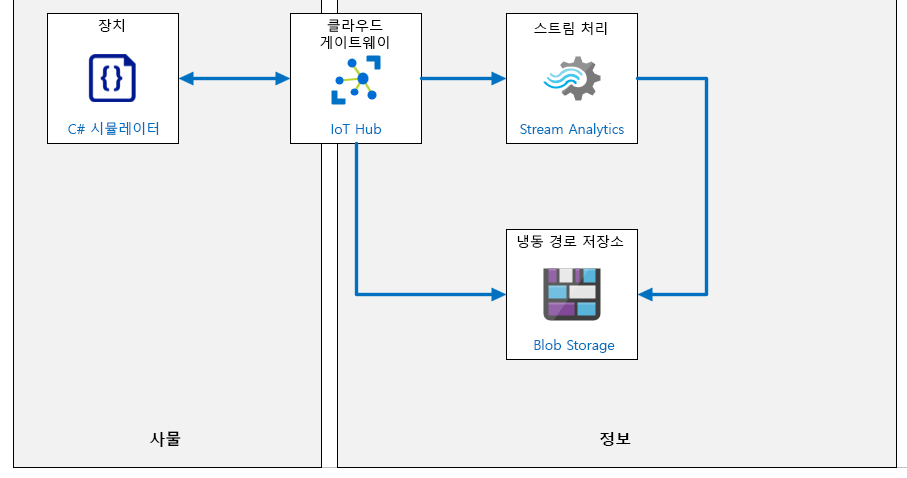

---
lab:
    title: '랩 07: 디바이스 메시지 라우팅
    module: '모듈 4: 메시지 처리 및 분석'
---

# 디바이스 메시지 라우팅

## 랩 시나리오

Contoso Management는 DPS를 사용하여 자동 디바이스 등록을 구현하는 데 깊은 인상을 받았습니다. 그래서 제품 포장 및 배송 관련 IoT 기반 솔루션 개발을 의뢰하려고 합니다.

치즈 판매 업체에서는 포장 및 배송 비용이 매우 많이 듭니다. 비용 효율성을 극대화하기 위해 Contoso는 온-프레미스 포장 시설을 운영하고 있습니다. 포장 과정에서 사용되는 워크플로는 단순합니다. 치즈를 잘라서 포장한 후 패키지를 배송 컨테이너에 실으면 컨테이너가 각 목적지별 보관함으로 운반됩니다. 이 프로세스에서는 컨베이어 벨트 시스템을 사용하여 제품을 옮깁니다. 성공 메트릭은 주어진 기간 동안 컨베이어 벨트 시스템에서 나가는 포장 수입니다(일반적으로 교대 근무).

컨베이어 벨트 시스템은 이 과정에서 중요한 연결고리이며, 최대한 효율적으로 워크플로를 진행할 수 있도록 시각적으로 모니터링됩니다. 이 시스템은 운영자가 정지, 느리게, 빠르게의 세 가지로 속도를 제어할 수 있습니다. 당연히 느린 속도로 배달되는 포장의 수는 빠른 속도보다 적습니다. 그러나 배달 속도와 관련하여 다음과 같은 여러 가지 기타 요인을 고려해야 합니다.

* 컨베이어 벨트 시스템의 진동 수준은 느린 속도에서 훨씬 낮습니다.
* 진동 수준이 높으면 패키지가 컨베이어에서 떨어질 수 있습니다.
* 진동 수준이 높으면 시스템이 더 빨리 마모됩니다.
* 진동 수준이 임계값 한도를 초과하면 컨베이어 벨드를 중지한 후 검사해야 합니다(더욱 심각한 고장 방지를 위한 조치).

자동화된 IoT 솔루션은 처리량을 최대화하는 동시에 진동 수준을 기준으로 하여 일종의 예방 유지 관리를 구현할 예정입니다. 이러한 예방 유지 관리를 통해 시스템이 심각하게 손상되기 전에 초기 경고 징후를 파악하고자 합니다. 

> **참고**: **예방 유지 관리**(예방 유지 관리 또는 예측 유지 관리라고도 함)는 장비가 정상적으로 작동하는 동안 수행되도록 유지 관리 활동을 예약하는 장비 유지 관리 프로그램입니다. 이 방법의 목적은 비용이 많이 들곤 하는 예기치 않은 고장을 방지하는 것입니다.

운영자가 비정상적인 진동 수준을 시각적으로 탐지하기가 항상 쉬운 것은 아닙니다. 이러한 이유로 진동 수준 및 데이터 이상을 측정하는 데 도움이 되는 Azure IoT 솔루션을 찾고 있습니다. 진동 센서는 다양한 위치에서 컨베이어 벨트에 부착되며, IoT 디바이스를 사용하여 원격 분석을 IoT Hub로 전송합니다. IoT Hub는 Azure Stream Analytics 및 기본 제공 ML(기계 학습) 모델을 사용하여 진동 이상 징후를 실시간으로 경고합니다. 또한 나중에 사내 기계 학습 모델을 개발할 수 있도록 모든 원격 분석 데이터를 보관할 계획을 세워야 합니다.

단일 IoT 디바이스에서 시뮬레이션된 원격 분석을 사용하여 솔루션을 프로토타입화하기로 결정했습니다.

진동 데이터를 실질적인 방식으로 시뮬레이션하기 위해 운영 팀 엔지니어와 협력하여 진동 발생 원인을 파악하기로 했습니다. 그 결과 다양한 유형의 진동이 전체 진동 수준에 영향을 미칠 수 있음이 확인되었습니다. 예를 들어, "강제 진동"은 가이드 휠이 깨지거나 컨베이어 벨트에 특별히 무거운 하중이 부적절하게 배치된 경우에 나타날 수 있습니다. 또한 시스템 설계 제한(예: 속도 또는 무게)을 초과할 때 나타날 수 있는 "증가 진동"도 있습니다. 엔지니어링 팀의 도움을 받아 적절한 진동 데이터 표현(변칙 포함)을 생성하는 시뮬레이션된 IoT 디바이스용 코드를 개발하기로 했습니다.

다음 리소스가 만들어집니다.



## 랩 내용

이 랩에서는 먼저 랩 필수 구성 요소를 검토한 후 필요에 따라 스크립트를 실행하여 Azure 구독에 필요한 리소스가 포함되어 있는지를 확인합니다. 그런 다음 IoT Hub로 진동 원격 분석을 전송하는 시뮬레이션된 디바이스를 만듭니다. 시뮬레이션된 데이터가 IoT Hub에 수신되면 데이터를 보관하는 데 사용할 수 있는 IoT Hub 메시지 경로 및 Azure Stream Analytics 작업을 구현합니다. 랩에 포함된 연습은 다음과 같습니다.

* 랩 필수 구성 요소 확인

  * 스크립트를 사용하여 누락된 리소스 및 이 랩용 새 디바이스 ID(sensor-v-3000) 만들기

* 진동 원격 분석을 생성하는 코드 작성
* Azure Blob Storage에 대한 메시지 라우팅 만들기
* 로깅 라우팅 Azure Stream Analytics 작업

## 랩 지침

### 연습 1: 랩 필수 구성 요소 확인

이 랩은 다음 Azure 리소스를 사용할 수 있다고 가정합니다.

| 리소스 유형 | 리소스 이름 |
| :-- | :-- |
| 리소스 그룹 | rg-az220 |
| IoT Hub | iot-az220-training-{사용자 ID} |
| 디바이스 ID | sensor-v-3000 |

> **중요**: 설정 스크립트를 실행하여 필요한 디바이스를 만드세요.

누락된 리소스와 새 디바이스를 만들려면 연습 2를 진행하기 전에 아래 설명에 따라 **lab07-setup.azcli** 스크립트를 실행해야 합니다. 스크립트 파일은 개발자 환경 구성(랩 3)의 일부로 로컬로 복제한 GitHub 리포지토리에 포함됩니다.

**lab07-setup.azcli** 스크립트는 **bash** 셸 환경에서 실행되도록 작성됩니다. 이는 Azure Cloud Shell에서 실행할 수 있는 가장 쉬운 방법입니다.

1. 브라우저를 사용하여 [Azure Cloud Shell](https://shell.azure.com/)을 열고 이 과정에 사용 중인 Azure 구독으로 로그인합니다.

    Cloud Shell에 대한 스토리지 설정 관련 메시지가 표시되면 기본값을 수락합니다.

1. Cloud Shell에서 **Bash**를 사용하고 있는지 확인합니다.

    Azure Cloud Shell 페이지의 왼쪽 상단에 있는 드롭다운은 환경을 선택하는 데 사용됩니다. 선택한 드롭다운 값이 **Bash**인지 확인합니다.

1. Cloud Shell 도구 모음에서 **파일 업로드/다운로드**(오른쪽의 네 번째 단추)를 클릭합니다.

1. 드롭다운에서 **업로드**를 클릭합니다.

1. 파일 선택 대화 상자에서 개발 환경을 구성할 때 다운로드한 GitHub 랩 파일의 폴더 위치로 이동합니다.

    _랩 3: 개발 환경 설정_, ZIP 파일을 다운로드하고 콘텐츠를 로컬로 추출하여 랩 리소스를 포함하는 GitHub 리포지토리를 복제했습니다. 추출된 폴더 구조에는 다음 폴더 경로가 포함됩니다.

    * 모든 파일
      * 랩
          * 07-디바이스 메시지 라우팅
            * 설정

    lab07-setup.azcli 스크립트 파일은 랩 7의 Setup 폴더에 있습니다.

1. **lab07-setup.azcli** 파일을 선택한 다음 **열기**를 클릭합니다.

    파일 업로드가 완료되면 알림이 표시됩니다.

1. Azure Cloud Shell에 올바른 파일이 업로드되었는지 확인하려면 다음 명령을 입력합니다.

    ```bash
    ls
    ```

    `ls` 명령으로 현재 디렉터리의 내용을 나열합니다. lab07-setup.azcli 파일이 나열됩니다.

1. 설치 스크립트가 포함된 이 랩에 대한 디렉터리를 만든 다음 해당 디렉터리로 이동하려면 다음 Bash 명령을 입력합니다.

    ```bash
    mkdir lab7
    mv lab07-setup.azcli lab7
    cd lab7
    ```

1. **lab07-setup.azcli**에 실행 권한이 있는지 확인하려면 다음 명령을 입력합니다.

    ```bash
    chmod +x lab07-setup.azcli
    ```

1. Cloud Shell 도구 모음에서 lab07-setup.azcli 파일에 액세스할 수 있도록 설정하려면 **편집기 열기**(오른쪽에서 두 번째 단추 - **{}**)를 클릭합니다.

1. lab7 폴더를 확장하고 스크립트 파일을 열려면 **파일** 목록에서 **lab7**을 클릭한 다음 **lab07-setup.azcli**를 클릭합니다.

    이제 편집기에서 **lab07-setup.azcli** 파일의 내용을 표시합니다.

1. 편집기에서 `{사용자 ID}` 및 `{사용자 위치}`에 할당된 값을 업데이트합니다.

    아래 샘플을 예로 들어 보면, `{사용자 ID}`는 이 과정을 시작할 때 만든 고유 ID(예: **cah191211**)로 설정하고 `{사용자 위치}`는 리소스에 적합한 위치로 설정해야 합니다.

    ```bash
    #!/bin/bash

    # 아래 값을 변경하세요!
    YourID="{your-id}"
    Location="{your-location}"
    ```

    > **참고**:  `{your-location}` 변수는 모든 리소스를 배포하는 지역의 짧은 이름으로 설정해야 합니다. 이 명령을 입력하면 사용 가능한 위치 및 짧은 이름(**이름** 열)의 목록을 볼 수 있습니다.

    ```bash
    az account list-locations -o Table

    표시이름           위도    경도    이름
    --------------------  ----------  -----------  ------------------
    동아시아             22.267      114.188      eastasia
    동남 아시아        1.283       103.833      southeastasia
    미국 중부            41.5908     -93.6208     centralus
    미국 동부               37.3719     -79.8164     eastus
    미국 동부 2             36.6681     -78.3889     eastus2
    ```

1. 파일의 변경 내용을 저장하고 편집기를 닫으려면 편집기 창 오른쪽 위의 [...]를 클릭한 다음 **편집기 닫기**를 클릭합니다.

    저장하라는 메시지가 표시된 경우 **저장**을 클릭하면 편집기가 닫힙니다.

    > **참고**:  **CTRL+S**를 사용하여 언제든지 저장할 수 있으며 **CTRL+Q**를 사용하여 편집기를 닫을 수 있습니다.

1. 이 랩에 필요한 리소스를 만들려면 다음 명령을 입력합니다.

    ```bash
    ./lab07-setup.azcli
    ```

    이 스크립트를 실행하는 데 몇 분이 걸릴 수 있습니다. 각 단계가 완료될 때 출력이 표시됩니다.

    이 스크립트는 먼저 **rg-az220** 리소스 그룹과 **iot-az220-training-{사용자 ID}** IoT Hub를 만듭니다. 이미 있는 경우 해당 메시지가 표시됩니다. 그런 다음 스크립트는 ID가 **sensor-v-3000**인 디바이스를 IoT Hub에 추가하고 디바이스 연결 문자열을 표시합니다.

1. 스크립트가 완료되면 디바이스의 연결 문자열이 표시됩니다.

    연결 문자열은 "HostName="으로 시작합니다.

1. 연결 문자열을 텍스트 문서에 복사하고 **sensor-v-3000** 디바이스용 연결 문자열임을 기록해 둡니다.

    연결 문자열을 쉽게 찾을 수 있는 위치에 저장하셨다면, 랩을 계속할 준비가 되었습니다.

### 연습 2: 진동 원격 분석을 생성하는 코드 작성

Contoso의 컨베이어 벨트 시스템 모니터링을 자동화하고 예측 유지 관리를 사용하도록 설정하려면 장기간에 걸쳐 실시간 데이터를 분석해야 합니다. 하지만 여기서는 기록 데이터가 없으므로 먼저 실제와 비슷한 진동 데이터 및 데이터 변칙을 나타내는 시뮬레이션된 데이터를 생성해야 합니다. Contoso의 엔지니어들이 기간별 진동을 시뮬레이트하는 알고리즘을 개발하여 코드 클래스 내에 포함했습니다. 여기서는 이 코드 클래스를 구현할 예정입니다. 엔지니어들은 알고리즘을 조정하는 데 필요한 향후 업데이트 지원에도 합의했습니다.

초기 프로토타입 단계에서는 원격 분석 데이터를 생성하는 IoT 디바이스 하나를 구현합니다. 이 디바이스는 진동 데이터 외에 Blob Storage로 전송되는 몇 가지 추가 값(배달되는 패키지, 주변 온도 및 유사한 메트릭)도 작성합니다. 이 추가 데이터는 예측 유지 보수를 위한 기계 학습 모듈을 개발하는 데 사용할 데이터를 시뮬레이트합니다.

이 연습에서 다음을 수행합니다.

* 시뮬레이션된 디바이스 프로젝트 로드
* 시뮬레이션된 디바이스의 연결 문자열 업데이트 및 프로젝트 코드 검토
* 시뮬레이션된 디바이스 연결 및 원격 분석 통신 테스트
* IoT Hub에서 원격 분석이 수신되는지 확인

#### 작업 1: 시뮬레이션된 디바이스 프로젝트 열기

1. **Visual Studio Code**를 엽니다.

1. **파일** 메뉴에서 **폴더 열기**를 클릭합니다.

1. **폴더 열기** 대화 상자에서 **07-Device Message Routing** 폴더로 이동합니다.

    _랩 3: 개발 환경 설정_, ZIP 파일을 다운로드하고 콘텐츠를 로컬로 추출하여 랩 리소스를 포함하는 GitHub 리포지토리를 복제했습니다. 추출된 폴더 구조에는 다음 폴더 경로가 포함됩니다.

    * Allfiles
        * Labs
            * 07-Device Message Routing
                * Starter
                    * VibrationDevice

1. 랩 7의 **Starter** 폴더로 이동합니다.

1. **VibrationDevice**를 클릭하고 **폴더 선택**을 클릭합니다.

    Visual Studio Code의 EXPLORER 창에 다음 파일이 나열되어야 합니다.

    * Program.cs
    * VibrationDevice.csproj

    > **참고**: 필요한 자산을 추가하라는 메시지가 표시되는 경우 지금 자산을 추가하면 됩니다.
 
1. **탐색기** 창에서 **Program.cs**를 클릭합니다.

    **VibrationDevice** 애플리케이션은 이전 랩에서 사용한 애플리케이션과 매우 비슷함을 쉽게 확인할 수 있습니다. 이 애플리케이션 버전은 대칭 키 인증을 사용하며 원격 분석 및 로깅 메시지를 IoT Hub로 전송합니다. 그리고 이전 랩의 애플리케이션보다 더 복잡한 센서가 구현되어 있습니다.

1. **터미널** 메뉴에서 **새 터미널**을 클릭합니다.

    명령 프롬프트에 표시된 디렉터리 경로를 점검하여 현재 위치가 올바른지 확인합니다. 이전 랩 프로젝트의 폴더 구조 내에서 이 프로젝트를 빌드하지 않으려고 합니다.
  
1. 애플리케이션이 오류 없이 빌드되는지 확인하려면 터미널 명령 프롬프트에서 다음 명령을 입력합니다.

    ```cmd
    dotnet build
    ```

    그러면 다음과 같은 출력이 표시됩니다.

    ```text
    ❯ dotnet build
    Microsoft (R) Build Engine version 16.5.0+d4cbfca49 for .NET Core
    Copyright (C) Microsoft Corporation. All rights reserved.

    Restore completed in 39.27 ms for D:\Az220-Code\AllFiles\Labs\07-Device Message Routing\Starter\VibrationDevice\VibrationDevice.csproj.
    VibrationDevice -> D:\Az220-Code\AllFiles\Labs\07-Device Message Routing\Starter\VibrationDevice\bin\Debug\netcoreapp3.1\VibrationDevice.dll

    Build succeeded.
        0 Warning(s)
        0 Error(s)

    Time Elapsed 00:00:01.16
    ```

다음 작업에서 연결 문자열을 구성하고 애플리케이션을 검토합니다.

#### 작업 2: 연결 구성 및 코드 검토

이 작업에서 빌드하는 시뮬레이션된 디바이스 앱은 컨베이어 벨트를 모니터링하는 IoT 디바이스를 시뮬레이트합니다. 앱은 2초마다 센서 판독 값을 시뮬레이션하고 진동 센서 데이터를 보고합니다.

1. Visual Studio Code에서 **Program.cs** 파일이 열려 있는지 확인합니다.

1. **Program** 클래스 위쪽의 `deviceConnectionString` 변수 선언을 찾습니다.

    ```csharp
    private readonly static string deviceConnectionString = "<디바이스 연결 문자열>";
    ```

1. `<디바이스 연결 문자열>`은 앞에서 저장한 디바이스 연결 문자열로 바꿉니다.

    > **참고**: 이 코드에 필요한 변경 사항은 이것뿐입니다.

1. **파일** 메뉴에서 **저장**을 클릭합니다.

1. 프로젝트의 구조를 잠시 검토합니다.

    애플리케이션 구조는 이전 랩에서 사용했던 시뮬레이션된 디바이스 프로젝트의 구조와 비슷합니다.

    * 문 사용
    * 네임스페이스 정의
      * Program 클래스 - Azure IoT에 연결하여 원격 분석을 전송합니다.
      * ConveyorBeltSimulator 클래스 - (EnvironmentSensor 대신 사용됨) 이 클래스는 원격 분석만 생성하는 것이 아니라 실행 중인 컨베이어 벨트도 시뮬레이트합니다.
      * ConsoleHelper - 각기 다른 색의 텍스트를 콘솔에 쓰는 코드를 캡슐화하는 새 클래스입니다.

1. **Main** 메서드를 잠시 검토합니다.

    ```csharp
    private static void Main(string[] args)
    {
        ConsoleHelper.WriteColorMessage("Vibration sensor device app.\n", ConsoleColor.Yellow);

        // MQTT 프로토콜을 사용하여 IoT Hub에 연결합니다.
        deviceClient = DeviceClient.CreateFromConnectionString(deviceConnectionString, TransportType.Mqtt);

        SendDeviceToCloudMessagesAsync();
        Console.ReadLine();
    }
    ```

    위의 코드에 나와 있는 것처럼, **deviceConnectionString** 변수를 사용하면 **DeviceClient** 인스턴스를 쉽게 만들 수 있습니다. `deviceClient` 개체는 **Main** 외부(위 코드에서는 Program 수준)에서 선언되는 전역 개체이므로 IoT Hub와 통신하는 메서드 내에서 사용할 수 있습니다.

1. **SendDeviceToCloudMessagesAsync** 메서드를 잠시 검토합니다.

    ```csharp
    private static async void SendDeviceToCloudMessagesAsync()
    {
        var conveyor = new ConveyorBeltSimulator(intervalInMilliseconds);

        // 컨베이어 벨트의 진동 원격 분석을 시뮬레이션합니다.
        while (true)
        {
            var vibration = conveyor.ReadVibration();

            await CreateTelemetryMessage(conveyor, vibration);

            await CreateLoggingMessage(conveyor, vibration);

            await Task.Delay(intervalInMilliseconds);
        }
    }
    ```

    위의 코드에 나와 있는 것처럼, 이 메서드는 무한 프로그램 루프를 설정하는 데 사용됩니다. 즉, 먼저 진동 판독값을 가져온 다음 정의된 시간 간격으로 메시지를 전송합니다. 

    코드를 자세히 살펴보면, ConveyorBeltSimulator 클래스는 ConveyorBeltSimulator 인스턴스 `conveyor`를 만드는 데 사용됨을 확인할 수 있습니다. 이렇게 작성된 `conveyor`를 사용하여 먼저 진동 판독값을 캡처합니다. 이 판독값은 로컬 `vibration` 변수에 저장된 후 간격이 시작될 때 캡처된 `vibration` 값과 함께 create message 메서드 2개로 전달됩니다. 

1. **CreateTelemetryMessage** 메서드를 잠시 검토합니다.

    ```csharp
    private static async Task CreateTelemetryMessage(ConveyorBeltSimulator conveyor, double vibration)
    {
        var telemetryDataPoint = new
        {
            vibration = vibration,
        };
        var telemetryMessageString = JsonConvert.SerializeObject(telemetryDataPoint);
        var telemetryMessage = new Message(Encoding.ASCII.GetBytes(telemetryMessageString));

        // 메시지에 사용자 지정 애플리케이션 속성을 추가합니다. 메시지를 라우팅하는 데 사용됩니다.
        telemetryMessage.Properties.Add("sensorID", "VSTel");

        // 벨트가 5초 이상 멈춘 경우 경고를 보냅니다.
        telemetryMessage.Properties.Add("beltAlert", (conveyor.BeltStoppedSeconds > 5) ? "true" : "false");

        Console.WriteLine($"Telemetry data: {telemetryMessageString}");

        // 원격 분석 메시지를 보냅니다.
        await deviceClient.SendEventAsync(telemetryMessage);
        ConsoleHelper.WriteGreenMessage($"Telemetry sent {DateTime.Now.ToShortTimeString()}");
    }
    ```

    이 메서드는 이전 랩에서와 마찬가지로 JSON 메시지 문자열을 만든 다음 **Message** 클래스를 사용하여 추가 속성과 함께 메시지를 전송합니다. **sensorID** 속성은 IoT Hub에서 **VSTel** 값을 적절하게 라우팅하는 데 사용됩니다. 그리고 **beltAlert** 속성은 컨베이어 벨트가 6초 이상 중지되면 true로 설정됩니다.

    메시지는 이전과 마찬가지로 디바이스 클라이언트의 **SendEventAsync** 메서드를 통해 전송됩니다.

1. **CreateLoggingMessage** 메서드를 잠시 검토합니다.

    ```csharp
    private static async Task CreateLoggingMessage(ConveyorBeltSimulator conveyor, double vibration)
    {
        // 로깅 JSON 메시지를 만듭니다.
        var loggingDataPoint = new
        {
            vibration = Math.Round(vibration, 2),
            packages = conveyor.PackageCount,
            speed = conveyor.BeltSpeed.ToString(),
            temp = Math.Round(conveyor.Temperature, 2),
        };
        var loggingMessageString = JsonConvert.SerializeObject(loggingDataPoint);
        var loggingMessage = new Message(Encoding.ASCII.GetBytes(loggingMessageString));

        // 메시지에 사용자 지정 애플리케이션 속성을 추가합니다. 메시지를 라우팅하는 데 사용됩니다.
        loggingMessage.Properties.Add("sensorID", "VSLog");

        // 벨트가 5초 이상 멈춘 경우 경고를 보냅니다.
        loggingMessage.Properties.Add("beltAlert", (conveyor.BeltStoppedSeconds > 5) ? "true" : "false");

        Console.WriteLine($"Log data: {loggingMessageString}");

        // 로깅 메시지를 보냅니다.
        await deviceClient.SendEventAsync(loggingMessage);
        ConsoleHelper.WriteGreenMessage("Log data sent\n");
    }
    ```

    이 메서드는 **CreateTelemetryMessage** 메서드와 매우 비슷합니다. 이 메서드와 관련하여 주의해야 하는 주요 항목은 다음과 같습니다.

    * **loggingDataPoint**에는 원격 분석 개체보다 더 많은 정보가 포함됩니다. 일반적으로는 향후 진행할 결함 진단 작업이나 상세 분석을 지원하기 위해 로깅용으로 loggingDataPoint에 최대한 많은 정보를 포함합니다.
    * 로깅 메시지에는 **sensorID** 속성이 포함됩니다. 여기서는 이 속성이 **VSLog**로 설정되어 있습니다. 이 속성 역시 위에서 설명한 것처럼 IoT Hub에서 **VSLog** 값을 적절하게 라우팅하는 데 사용됩니다.

1. 시간이 되면 **ConveyorBeltSimulator** 클래스와 **ConsoleHelper** 클래스를 잠시 검토합니다.

    이 랩을 최대한 효율적으로 완료하기 위해 이 두 클래스의 작동 방식을 반드시 이해해야 하는 것은 아닙니다. 이러한 클래스가 프로젝트에서 원하는 결과를 달성하는 과정을 각기 고유한 방식으로 지원한다는 점만 기억하면 됩니다. **ConveyorBeltSimulator** 클래스는 컨베이어 벨트 작동을 시뮬레이트하며, 이 과정에서 여러 속도 및 관련 상태를 모델링하여 진동 데이터를 생성합니다. **ConsoleHelper** 클래스는 다양한 데이터와 값을 강조 표시하기 위해 각기 다른 색이 지정된 텍스트를 콘솔에 쓰는 데 사용됩니다.

#### 작업 3: 원격 분석 전송 코드 테스트

1. 터미널 명령 프롬프트에서 앱을 실행하려면 다음 명령을 입력합니다.

    ```bash
    dotnet run
    ```

   이 명령은 현재 폴더에서 **Program.cs** 파일을 실행합니다.

1. 콘솔 출력은 다음과 유사하게 표시되어야 합니다.

    ```text
    진동 센서 디바이스 앱.

    원격 분석 데이터: {"vibration":0.0}
    오전 10:29에 원격 분석 전송
    로그 데이터: {"vibration":0.0,"packages":0,"speed":"stopped","temp":60.22}
    로그 데이터 전송함

    원격 분석 데이터: {"vibration":0.0}
    오전 10:29에 원격 분석 전송
    로그 데이터: {"vibration":0.0,"packages":0,"speed":"stopped","temp":59.78}
    로그 데이터 전송함
    ```

    > **참고**:  터미널 창에서 녹색 텍스트는 제대로 작동 중임을 표시하는 데 사용되며 빨간색 텍스트는 문제가 발생했음을 표시하는 데 사용됩니다. 오류 메시지를 수신하면 디바이스 연결 문자열을 확인하여 시작합니다.

1. 다음 작업을 위해 이 앱이 실행되도록 둡니다.

    다음 작업을 계속하지 않으면 터미널 창에 **Ctrl-C**를 입력하여 앱을 중지할 수 있습니다. 나중에 'dotnet run' 명령을 사용하여 다시 시작할 수 있습니다.

#### 작업 4: IoT Hub에서 원격 분석을 수신하고 있는지 확인

이 작업에서는 Azure Portal을 사용하여 IoT Hub가 원격 분석을 받고 있는지 확인합니다.

1. [Azure Portal](https://portal.azure.com)을 엽니다.

1. 리소스 타일에서 **iot-az220-training-{사용자 ID}**를 클릭합니다.

1. **개요** 창에서 아래로 스크롤하여 메트릭 타일을 봅니다.

1. **마지막 데이터 표시**에서 시간 범위를 1시간으로 변경합니다. 

    **클라우드 메시지에 대한 디바이스** 타일은 현재 작업을 일부 표시해야 합니다. 약간의 대기 시간이 있으므로 활동이 표시되지 않더라도 잠시 기다립니다.

    디바이스가 원격 분석 데이터를 보내고 허브에서 이 데이터를 수신하면 다음 단계로 넘어가서 데이터를 올바른 엔드포인트로 라우팅합니다.

### 연습 3: Azure Blob Storage에 대한 메시지 라우팅 만들기

IoT 솔루션에서는 데이터 형식이나 업무상의 이유에 따라 들어오는 메시지 데이터를 여러 엔드포인트 위치로 보내야 하는 경우가 많습니다. Azure IoT Hub에서는 솔루션에서 필요한 위치로 들어오는 데이터를 전송하는 데 사용할 수 있는 _메시지 라우팅_ 기능이 제공됩니다.

Contoso의 시스템 아키텍처에서는 데이터를 보관하기 위한 스토리지 위치와 보다 즉각적인 분석을 위한 위치라는 두 개의 목적지로 데이터를 전송해야 합니다. 

Contoso의 진동 모니터링 시나리오에서는 다음의 두 메시지 경로를 만들어야 합니다.

* 첫 번째 경로: 데이터를 보관할 Azure Blob Storage 위치로의 경로
* 두 번째 경로: 실시간 분석을 위한 Azure Stream Analytics 작업으로의 경로

메시지 경로는 한 번에 하나씩 작성하고 테스트해야 하므로 이 연습에서는 스토리지 경로를 만드는 과정을 중점적으로 진행합니다. 이 경로("로깅" 경로)를 만드는 과정에서 Azure 리소스를 만드는 방법을 자세히 파악합니다.

메시지 라우팅의 중요한 기능 중 하나는 들어오는 데이터를 엔드포인트로 라우팅하기 전에 필터링하는 기능입니다. SQL 쿼리로 작성되는 이 필터는 특정 조건이 충족될 때만 경로를 통해 출력을 전송합니다.

데이터를 필터링하는 가장 쉬운 방법 중 하나는 메시지 속성 평가를 통한 필터링입니다. 이전 연습에서 디바이스 메시지에 메시지 속성을 추가하는 과정에서 추가한 코드는 다음과 같습니다.

```csharp
...
telemetryMessage.Properties.Add("sensorID", "VSTel");
...
loggingMessage.Properties.Add("sensorID", "VSLog");
```

이제 경로 기준으로 `sensorID`를 사용하는 메시지 경로 내에 SQL 쿼리를 포함할 수 있습니다. 여기서는 `sensorID`에 할당된 값이 `VSLog`(진동 센서 로그)이면 해당 메시지를 스토리지에 보관합니다.

이 연습에서는 로깅 라우팅을 만들고 테스트합니다.

#### 작업 1: 메시지 라우팅 엔드포인트 정의

1. [Azure Portal](https://portal.azure.com/)에서 IoT Hub 블레이드가 열려 있는지 확인합니다.

1. 왼쪽 메뉴의 **메시지**에서 **메시지 라우팅**을 클릭합니다.

1. **메시지 라우팅** 창에서 **라우팅** 탭이 선택되어 있는지 확인합니다.

1. 새 경로를 추가하려면 **+ 추가**를 클릭합니다.

    이제 **라우팅 추가** 블레이드가 표시되어야 합니다.

1. **경로 추가** 블레이드에서 **이름** 아래에 **vibrationLoggingRoute**를 입력합니다.

1. **엔드포인트** 오른쪽에서 **+ 엔드포인트 추가**를 클릭한 다음 드롭다운 목록에서 **스토리지**를 클릭합니다.

    그러면 **스토리지 엔드포인트팅 추가** 블레이드가 표시됩니다.

1. **스토리지 엔드포인트 추가** 블레이드의 **엔드포인트 이름** 아래에 **vibrationLogEndpoint**를 입력합니다.

1. 구독과 연결된 스토리지 계정 목록을 표시하려면 **컨테이너 선택**을 클릭합니다.

    Azure 구독에 이미 있는 스토리지 계정 목록이 나열됩니다. 이 시점에서 기존 스토리지 계정 및 컨테이너를 선택할 수 있지만 이 랩에서는 새 스토리지 계정을 만듭니다.

1. 스토리지 계정 만들기를 시작하려면 **+ 스토리지 계정**을 클릭합니다.

    그러면 **스토리지 계정 만들기** 블레이드가 표시됩니다.

1. **스토리지 계정 만들기** 블레이드에서 **이름** 아래에 **vibrationstore{사용자 ID}**를 입력합니다.

    예를 들어 **vibrationstorecah191211**과 같이 입력할 수 있습니다.

    > **참고**:  이 필드에는 3~24자 사이의 고유한 소문자와 숫자만 포함될 수 있습니다.

1. **계정 종류** 드롭다운에서 **StorageV2(범용 v2)**를 클릭합니다.

1. **성능**에서 **표준**이 선택되었는지 확인합니다.

    이렇게 하면 전체 성능을 낮추면서 비용을 절감할 수 있습니다.

1. **복제**에서 **LRS(로컬 중복 저장소)**가 선택되어 있는지 확인합니다.

    이렇게 하면 재해 복구에 대한 위험 완화 비용을 절감할 수 있습니다. 프로덕션에서 솔루션은 보다 강력한 복제 전략이 필요할 수 있습니다.

1. **위치**에서 이 과정의 랩에 사용 중인 지역을 선택합니다.

1. 스토리지 계정 엔드포인트를 만들려면 **확인**을 클릭합니다.

1. 요청의 유효성을 검사하고 스토리지 계정 배포가 완료될 때까지 기다립니다.

    유효성 검사 및 생성에는 1~2분 정도 걸릴 수 있습니다.

    완료되면 **스토리지 계정 만들기** 블레이드가 닫히고 **스토리지 계정** 블레이드가 표시됩니다. 스토리지 계정 블레이드는 자동으로 업데이트되어 방금 만든 스토리지 계정이 표시됩니다.

#### 작업 2: 스토리지 계정 컨테이너 정의

1. **스토리지 계정** 블레이드에서 **vibrationstore{사용자 ID}**를 클릭합니다.

    **컨테이너** 블레이드가 표시되어야 합니다. 이 계정은 새 스토리지 계정이기 때문에 컨테이너는 표시되지 않습니다.

1. 컨테이너를 만들려면 **+ 컨테이너**를 클릭합니다.

    그러면 **새 컨테이너** 대화 상자가 표시됩니다.

1. **새 컨테이너** 대화 상자에서 **이름** 아래에 **vibrationcontainer**를 입력합니다.

   다시 말하지만 소문자와 숫자만 허용됩니다.

1. **공용 액세스 수준**에서 **프라이빗(익명 액세스 없음)**이 선택되어 있는지 확인합니다.

1. 컨테이너를 만들려면 **만들기**를 클릭합니다.

    잠시 후 컨테이너의 **임대 상태**가 업데이트되어 **사용 가능**으로 표시됩니다.

1. 솔루션용으로 이 컨테이너를 선택하려면 **vibrationcontainer**를 클릭한 다음 **선택**을 클릭합니다.

    그러면 **스토리지 엔드포인트 추가** 블레이드가 다시 표시됩니다. 방금 만든 스토리지 계정 및 컨테이너에 대한 URL로 **Azure Storage 컨테이너**가 설정되었습니다.

1. **일괄 처리 빈도** 및 **청크 크기 창** 필드는 기본값인 **100**으로 설정된 상태로 유지합니다.

1. **인코딩**에서, 두 가지 옵션이 있으며 **AVRO**가 선택되어 있음을 알 수 있습니다.

    > **참고**:  기본적으로 IoT Hub는 메시지 본문 속성과 메시지 속성이 모두 있는 Avro 형식으로 콘텐츠를 씁니다. Avro 형식은 다른 엔드포인트에 사용되지 않습니다. Avro 형식은 데이터와 메시지 보존에 적합하지만 이를 사용하여 데이터를 쿼리하기에 어렵습니다. 반면 JSON 또는 CSV 형식은 데이터를 쿼리하기에 훨씬 용이합니다. 이제 IoT Hub는 AVRO뿐만 아니라 JSON의 Blob Storage에 데이터를 기록하는 것을 지원합니다.

1. **파일 이름 형식** 필드에 지정된 값을 잠시 살펴봅니다.

    **파일 이름 형식** 필드는 스토리지의 파일에 데이터를 쓰는 데 사용되는 패턴을 지정합니다. 다양한 토큰은 파일이 생성될 때 값으로 대체됩니다.

1. 스토리지 엔드포인트를 만들려면 블레이드 아래쪽에서 **만들기**를 클릭합니다.

    유효성 검사 및 그 후에 진행되는 만들기 작업은 몇 분 정도 걸립니다. 작업이 완료되면 **경로 추가** 블레이드가 다시 표시됩니다.

#### 작업 3: 라우팅 쿼리 정의

1. **라우팅 추가** 블레이드의 **데이터 원본**에서 **디바이스 원격 분석 메시지**가 선택되어 있는지 확인합니다.

1. **라우팅 활성화**에서 **활성화**가 선택되어 있는지 확인합니다.

1. **라우팅 쿼리**에서 **참**을 아래의 쿼리로 바꿉니다.

    ```sql
    sensorID = 'VSLog'
    ```

    이 쿼리를 실행하면 `sensorID` 애플리케이션 속성이 `VSLog`로 설정된 메시지만 스토리지 엔드포인트로 라우팅됩니다.

1. 이 라우팅을 저장하려면 **저장**을 클릭합니다.

    성공 메시지를 기다립니다. 완료되면 라우팅이 **메시지 라우팅** 창에 나열되어야 합니다.

1. Azure Portal 대시보드로 다시 이동합니다.

#### 작업 4: 데이터 보관 확인

1. Visual Studio Code에서 만든 디바이스 앱이 계속 실행 중인지 확인합니다. 

    그렇지 않은 경우 'dotnet run'을 사용하여 Visual Studio Code 터미널에서 실행합니다.

1. 스토리지 계정 블레이드를 열려면 리소스 타일에서 **vibrationstore{사용자 ID}**를 클릭합니다.

    리소스 타일에 스토리지 계정이 표시되지 않으면 리소스 그룹 타일 상단의 **새로 고침** 단추를 클릭한 후 위의 지침에 따라 스토리지 계정을 엽니다.

1. **vibrationstore{사용자 ID}** 블레이드의 왼쪽 메뉴에서 **Storage Explorer(미리 보기)**를 클릭합니다.

    Storage Explorer를 사용하면 데이터가 스토리지 계정에 추가되고 있는지를 확인할 수 있습니다. 

    > **참고**:  Storage Explorer는 현재 미리 보기 모드이므로 정확한 작동 모드는 변경될 수 있습니다.

1. **Storage Explorer(미리 보기)** 창에서 **BLOB 컨테이너**를 확장한 다음 **vibrationcontainer**를 클릭합니다.

    데이터를 보려면 폴더 계층 구조를 탐색해야 합니다. 먼저 IoT Hub용으로 첫 번째 폴더의 이름을 지정합니다. 

1. 오른쪽 창의 **이름** 아래에서 **iot-az220-training-{사용자 ID}**를 두 번 클릭한 다음 하위 폴더를 계속 두 번 클릭하여 계층 구조 아래쪽으로 이동합니다.

    IoT Hub 폴더에는 Partition 폴더, 그리고 연도, 월, 날짜의 숫자 값에 해당하는 Year, Month, Day 폴더가 있습니다. 마지막 폴더인 Hour는 UTC 시간 단위의 시간을 나타냅니다. Hour 폴더에 들어 있는 여러 블록 Blob에 로깅 메시지 데이터가 포함되어 있습니다. 

1. 타임스탬프가 가장 오래된 데이터에 해당하는 블록 Blob를 두 번 클릭합니다.

    그러면 새 브라우저 탭에서 URL 링크가 열립니다. 이 데이터는 쉽게 읽을 수 있는 서식은 아니지만 진동 메시지임은 알 수 있습니다. 

1. 데이터가 표시된 브라우저 탭을 닫고 Azure Portal 대시보드로 다시 이동합니다.

### 연습 4: 로깅 라우팅 Azure Stream Analytics 작업

이 연습에서는 Blob Storage에 로깅 메시지를 출력하는 Stream Analytics 작업을 만듭니다. 그런 다음 Azure Portal의 Storage Explorer를 사용하여 저장된 데이터를 확인합니다.

이렇게 하면 경로에 다음 설정이 포함되어 있는지 확인할 수 있습니다.

* **이름** - vibrationLoggingRoute
* **데이터 원본** - DeviceMessages
* **라우팅 쿼리** - sensorID = 'VSLog'
* **엔드포인트** - vibrationLogEndpoint
* **활성화됨** - 참

> **참고**: 이 랩에서 데이터를 스토리지로 라우팅한 다음 Azure Stream Analytics를 통해 스토리지로도 보내는 것이 이상하게 보일 수 있습니다. 프로덕션 시나리오에서는 두 경로 모두 장기적으로 사용할 수 없습니다. 대신 여기에서 만드는 두 번째 경로가 존재하지 않을 가능성이 높습니다. 하지만 이 랩 환경에서는 Azure Stream Analytics를 통해 스토리지로 데이터를 전송하는 방식을 사용합니다. 라우팅이 정상적으로 작동하는지 유효성을 검사하고, Azure Stream Analytics의 간단한 구현을 제시하기 위해서입니다.

#### 작업 1: Stream Analytics 작업 만들기

1. Azure Portal 메뉴에서 **+ 리소스 만들기**를 클릭합니다.

1. **새로 만들기** 블레이드의 **Marketplace 검색** 텍스트 상자에 **stream analytics**를 입력한 다음 **Stream Analytics 작업**을 클릭합니다.

1. **Stream Analytics 작업** 블레이드에서 **만들기**를 클릭합니다.

    **새 Stream Analytics 작업** 창이 표시됩니다.

1. **새 Stream Analytics 작업** 창에서 **이름** 아래에 **vibrationJob**을 입력합니다.

1. **구독**에서 랩에 사용 중인 구독을 선택합니다.

1. **리소스 그룹**에서 **rg-az220**을 선택합니다.

1. **위치**에서 이 과정의 랩에 사용 중인 지역을 선택합니다.

1. **호스팅 환경**에서 **클라우드**가 선택되어 있는지 확인합니다.

    Edge 호스팅은 과정의 후반부에서 설명합니다.

1. **스트리밍 단위**에서 수를 **3**에서 **1**로 줄입니다.

    이 랩에서는 3 단위가 필요하지 않으며 이로 인해 비용을 줄일 수 있습니다,

1. Stream Analytics 작업을 만들려면 **만들기**를 클릭합니다.

1. **배포 성공** 메시지를 기다린 다음 새 리소스를 엽니다.

    > **팁:** 새 리소스로 이동하는 메시지를 놓치거나 언제든지 리소스를 찾아야 하는 경우 **홈/모든 리소스**를 선택합니다. 리소스 목록에 표시될 수 있도록 리소스 이름을 충분히 입력합니다.

1. 잠시 후 새 Stream Analytics 작업을 검토합니다.

    입력이나 출력이 없는 비어 있는 작업과 스켈레톤 쿼리가 있습니다. 다음 단계는 이러한 항목을 채우는 것입니다.

1. 왼쪽 메뉴의 **작업 토폴로지**에서 **입력**을 클릭합니다.

    **입력** 창이 표시됩니다.

1. **입력** 창에서 **+ 스트림 입력 추가**를 클릭한 다음 **IoT Hub**를 클릭합니다.

    **IoT Hub - 새 입력** 창이 표시됩니다.

1. **IoT Hub - 새 입력** 창에서 **입력 별칭** 아래에 `vibrationInput`을 입력합니다.

1. **구독에서 IoT Hub 선택**을 선택해야 합니다.

1. **구독**에서, 이전에 IoT Hub를 만드는 데 사용한 구독이 선택되어 있는지 확인합니다.

1. **IoT Hub**에서 **iot-az220-training-{사용자 ID}** IoT Hub가 선택되어 있는지 확인합니다.

1. **엔드포인트**에서 **메시지**가 선택되어 있는지 확인합니다.

1. **공유 액세스 정책 이름**에서 **iothubowner**가 선택되어 있는지 확인합니다.

    > **참고**:  **공유 액세스 정책 키**가 채워졌으며 읽기 전용입니다.

1. **소비자 그룹**에서 **$Default**가 선택되어 있는지 확인합니다.

1. **이벤트 Serialization 형식**에서 **JSON**이 선택되어 있는지 확인합니다.

1. **인코딩**에서 **UTF-8**이 선택되어 있는지 확인합니다.

    일부 필드를 보려면 아래로 스크롤해야 할 수도 있습니다.

1. **이벤트 압축 유형**에서 **없음**이 선택되어 있는지 확인합니다.

1. 새 입력을 저장하려면 **저장**을 클릭한 다음 입력이 만들어질 때까지 기다립니다.

    새 입력을 표시하도록 **입력** 목록을 업데이트해야 합니다.

1. 출력을 만들려면 왼쪽 메뉴의 **작업 토폴로지**에서 **출력**을 클릭합니다.

    **출력** 창이 표시됩니다.

1. **출력** 창에서 **+ 추가**를 클릭한 다음 **Blob Storage/Data Lake Storage Gen2**를 클릭합니다.

    **Blob storage/Data Lake Storage Gen2 - 새 출력** 창이 표시됩니다.

1. **Blob storage/Data Lake Storage Gen2 - 새 출력** 창의 **출력 별칭** 아래에 `vibrationOutput`을 입력합니다.

1. **구독에서 스토리지 선택**이 선택되어 있는지 확인합니다.

1. **구독**에서 이 랩에 사용 중인 구독을 선택합니다.

1. **스토리지 계정**에서 **vibrationstore{사용자 ID}**를 클릭합니다.

    > **참고**:  **스토리지 계정 키**가 자동으로 채워졌으며 읽기 전용입니다.

1. **컨테이너**에서 **기존 사용**이 선택되어 있고 드롭다운 목록에서 **vibrationcontainer**가 선택되어 있는지 확인합니다.

1. **경로 패턴**을 비어 있는 상태로 둡니다.

1. **날짜 형식** 및 **시간 형식**을 기본값으로 둡니다.

1. **이벤트 Serialization 형식**에서 **JSON**이 선택되어 있는지 확인합니다.

1. **인코딩**에서 **UTF-8**이 선택되어 있는지 확인합니다.

1. **형식**에서 **줄로 구분됨**이 선택되어 있는지 확인합니다.

    > **참고**:  이 설정에서 각 레코드를 각 줄에 있는 JSON 개체로 저장하고 전체적으로 수행하면 유효하지 않은 JSON 레코드인 파일이 됩니다. 다른 옵션인 **Array**는 전체 문서에 각 레코드가 배열의 항목인 JSON 배열로 서식이 지정되도록 합니다. 이렇게 하면 전체 파일을 유효한 JSON으로 구문 분석할 수 있습니다.

1. **최소 행**을 비어 있는 상태로 둡니다.

1. **최대 시간**에서 **시간**과 **분**을 비어 있는 상태로 둡니다.

1. **인증 모드**에서 **연결 문자열**이 선택되어 있는지 확인합니다.

1. 출력을 만들려면 **저장**을 클릭한 다음 출력이 만들어질 때까지 기다립니다.

    **출력** 목록이 새 출력으로 업데이트됩니다.

1. 쿼리를 편집하려면 왼쪽 메뉴의 **작업 토폴로지** 아래에서 **쿼리**를 클릭합니다.

1. 쿼리 편집기 창에서 기존 쿼리를 아래의 쿼리로 바꿉니다.

    ```sql
    SELECT:
        *
    INTO
        vibrationOutput
    FROM
        vibrationInput
    ```

1. 쿼리 편집기 창 바로 위의 **쿼리 저장**을 클릭합니다.

1. 왼쪽 메뉴에서 **개요**를 클릭합니다.

#### 작업 2: 로깅 경로 테스트

이제 재미있는 부분입니다. 디바이스 앱에서 보내는 원격 분석이 경로를 따라 이동하여 스토리지 컨테이너까지 전달될까요?

1. Visual Studio Code에서 만든 디바이스 앱이 계속 실행 중인지 확인합니다. 

    그렇지 않은 경우 'dotnet run'을 사용하여 Visual Studio Code 터미널에서 실행합니다.

1. Stream Analytics 작업의 **개요** 창에서 **시작**을 클릭합니다.

1. **작업 시작** 창에서 **작업 출력 시작 시간**을 **지금**으로 설정한 다음 **시작**을 클릭합니다.

    작업이 시작되려면 몇 분 정도 걸릴 수 있습니다.

1. Azure Portal 메뉴에서 **대시보드**를 클릭합니다.

1. 리소스 타일에서 **vibrationstore{사용자 ID}**를 클릭합니다.

    스토리지 계정이 표시되지 않으면 리소스 그룹 타일 상단의 **새로 고침** 단추를 사용합니다.

1. 스토리지 계정의 **개요** 창에서 **모니터링** 섹션이 보일 때까지 아래로 스크롤합니다.

1. **모니터링**에서 **마지막 데이터 표시**에 인접한 시간 범위를**1시간**으로 변경합니다.

    차트에 활동이 표시될 것입니다.

1. 왼쪽 메뉴에서 **Storage Explorer(미리 보기)**를 클릭합니다.

    Storage Explorer를 사용하여 모든 데이터가 스토리지 계정으로 전송됨을 다시 확인할 수 있습니다. 

    > **참고**:  Storage Explorer는 현재 미리 보기 모드이므로 정확한 작동 모드는 변경될 수 있습니다.

1. **Storage Explorer(미리 보기)**의 **BLOB 컨테이너** 아래에서 **vibrationcontainer**를 클릭합니다.

    데이터를 보려면 폴더 계층 구조를 탐색해야 합니다. 첫 번째 폴더는 IoT Hub의 이름으로 지정되고, 다음 폴더는 파티션, 연도, 월, 일 및 시간 순으로 지정됩니다. 

1. 오른쪽 창의 **이름** 아래에서 IoT Hub의 폴더를 두 번 클릭한 다음, 가장 최근 시간 폴더를 열 때까지 두 번 클릭하면서 계층 구조 아래로 이동합니다.

    시간 폴더 내에 생성된 시간(분)의 이름을 한 파일이 표시됩니다. 이러한 파일을 통해 데이터가 정상적으로 스토리지 계정에 수신되고 있음을 확인할 수 있습니다.

1. 대시보드로 다시 이동합니다.

1. 리소스 타일에서 **vibrationJob**을 클릭합니다.

1. **vibrationJob** 블레이드에서 **중지**를 클릭한 다음 **예**를 클릭합니다.

    디바이스 앱에서 경로를 따라 허브를 거쳐 스토리지 컨테이너로 이동하는 활동을 추적했습니다. 수고하셨습니다! 다음 모듈에서 데이터 시각화를 간략하게 살펴볼 때 이 Stream Analytics 시나리오를 계속 진행하겠습니다.

1. Visual Studio Code 창으로 전환합니다.

1. 터미널 명령 프롬프트에서 디바이스 시뮬레이터 앱을 종료하려면 **CTRL-C**를 누릅니다.

> **중요**: 이 과정의 데이터 시각화 모듈을 완료할 때까지 이러한 리소스를 제거하지 마세요.
