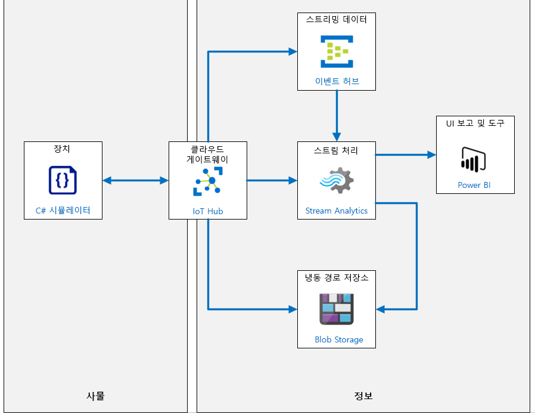
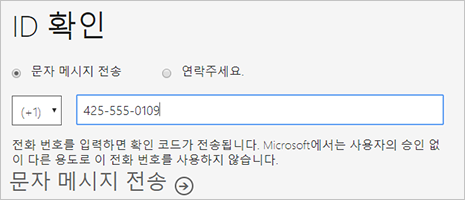
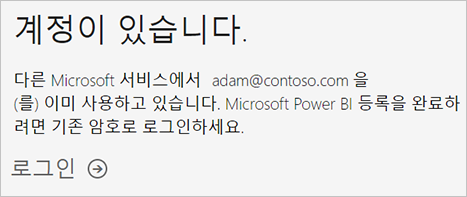
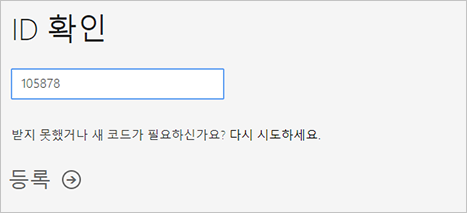
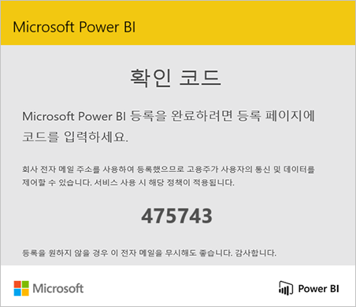
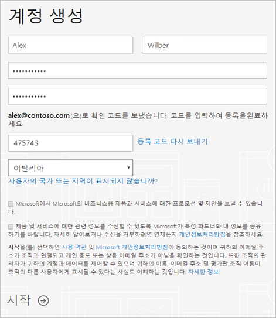

---
lab:
    title: '랩 08: Power BI에서 데이터 스트림 시각화'
    module: '모듈 5: 인사이트 및 비즈니스 통합'
---

# Power BI에서 데이터 스트림 시각화

> **중요**: 이 랩에는 과정을 위해 제공된 Azure 구독과 관련이 없는 몇 가지 서비스 필수 구성 요소가 있습니다.
>
> 1. "회사 또는 학교 계정"(Azure Active Directory 계정)에 로그인하는 기능
> 2. 자신의 계정 로그인 이름을 알고 있어야 하며, 이는 이메일 주소와 일치하지 않을 수 있습니다.
> 3. Power BI에 대한 액세스가 다음과 같이 진행될 수 있습니다.
>       1. 기존 Power BI 계정
>       2. Power BI에 등록하는 기능 - 일부 조직에서는 이를 차단합니다.
>
> 첫 번째 랩 연습에서는 Power BI에 액세스하는 기능을 확인합니다.  첫 번째 연습에 성공하지 못하면 차단된 회사 또는 학교 계정 액세스에 대한 빠른 해결 방법이 없으므로 랩을 완료할 수 없습니다.

## 랩 시나리오

Contoso의 치즈 패키징 과정에 사용되는 컨베이어 벨트 시스템을 대표하는 진동 데이터 및 기타 원격 분석 출력을 생성하는 시뮬레이션된 IoT 디바이스를 개발했습니다. Azure Blob Storage로 데이터를 보내는 로깅 경로를 빌드하고 테스트했습니다. 이제 원격 분석 데이터를 Azure Event Hubs 서비스로 전송하는 IoT Hub 내의 새 경로에 대한 작업을 시작합니다.

Azure IoT Hub와 Azure Event Hubs의 주요 차이점은, Event Hubs는 빅 데이터 스트리밍을 위해 설계되었고 IoT Hub는 IoT 솔루션에 최적화되어 있다는 점입니다. 두 서비스 모두 대기 시간이 짧고 안정성이 높은 데이터 수집을 지원합니다. Azure Event Hubs는 IoT Hub와 유사한 방식으로 스트림 분석에 입력을 제공하기 때문에 이 경우 Event Hubs를 선택하면 솔루션 내에서 추가 Azure 서비스 옵션을 탐색할 수 있습니다.

### 기본 제공 기계 학습 모델에 호출하기

이 랩에서는 기본 제공 ML(기계 학습) 함수 `AnomalyDetection_SpikeAndDip`을 호출합니다. `AnomalyDetection_SpikeAndDip` 함수는 슬라이딩 윈도우를 사용하여 데이터에서 변칙을 분석합니다. 슬라이딩 윈도우는 원격 분석 데이터의 최근 2분 등일 수 있습니다. 이 윈도우는 원격 분석 흐름에 따라 실시간에 가깝게 진행됩니다. 일반적으로는 슬라이딩 윈도우가 커져서 데이터가 더 많이 포함되면 변칙 검색 정확도도 높아집니다(그러나 대기 시간도 길어지므로 정확도와 대기 시간의 적절한 균형을 유지해야 함).

이 함수는 데이터의 "정상" 범위를 설정한 후 해당 범위를 사용해 변칙을 식별하고 등급을 할당합니다. 구체적으로 설명하자면, 함수가 데이터 흐름을 계속 모니터링하는 과정에서 알고리즘이 정상 값 범위를 설정한 후 해당 값 범위의 규칙에 새 값을 비교합니다. 그러면 각 값의 점수가 생성됩니다. 이 점수는 지정된 값이 변칙을 가능성을 나타내는 신뢰도를 결정하는 백분율로 표시됩니다. 당연히 낮은 신뢰도는 무시해도 됩니다. 단, 적절한 것으로 간주되는 신뢰도 값 백분율을 파악해야 합니다. 이 랩의 쿼리에서는 적절한 백분율을 95%로 설정합니다.

데이터에 격차가 있는 것처럼 항상 복잡한 상황이 존재합니다(예: 컨베이어 벨트가 잠시 중지). 이 알고리즘은 값을 대체하여 무효한 데이터를 처리합니다.

> **참고**: 통계에서 대체란 누락된 데이터를 대신할 값으로 바꾸는 프로세스입니다. [여기](https://en.wikipedia.org/wiki/Imputation_%28statistics%29)서 대체에 대해 자세히 알아볼 수 있습니다.

원격 분석 데이터의 급증 및 급락은 일시적인 변칙입니다. 그러나 여기서는 사인파를 사용하여 진동 데이터를 시뮬레이트하므로, 일정 기간 동안 "정상" 값이 생성되다가 낮은 값이나 높은 값이 생성되어 변칙 경고가 트리거될 수 있습니다. 그러므로 운영자는 단시간 동안 발생하는 변칙 클러스터를 파악해야 할 수 있습니다. 이러한 현상이 문제의 징후를 나타내기 때문입니다.

추세 감지를 위한 모델과 같은 다른 기본 제공 ML 모델도 있습니다. 이 모듈에는 이러한 모델이 포함되지 않지만, 따로 알아보실 것을 권장합니다.

### Power BI를 사용하여 데이터 시각화

숫자 데이터, 특히 볼륨을 시각화하는 것은 그 자체로 어려운 일입니다. 무언가가 잘못되었음을 암시하는 일련의 변칙을 사람 운영자에게 알리려면 어떻게 해야 할까요?

이 모듈에서 사용하는 솔루션은 Power BI가 수집할 수 있는 실시간 형식으로 데이터를 보내는 Azure Stream Analytics의 기능과 함께 Power BI의 일부 기본 제공 기능을 사용하는 것입니다.

Power BI의 대시보드 기능을 사용하여 여러 개의 타일을 만듭니다. 한 타일에는 실제 진동 측정값이 포함됩니다. 또 다른 타일은 값이 변칙인 신뢰도 수준을 0.0에서 1.0 사이의 값으로 표시하는 계기입니다. 세 번째 타일은 95% 신뢰도 수준에 도달했는지 여부를 나타냅니다. 마지막으로, 네 번째 타일은 지난 한 시간 동안 검색된 이상 징후의 수를 표시합니다. 시간을 x축에 포함시킴으로써, 수평으로 모여 있는 여러 개의 이상 징후를 보고 이들이 짧게 연속적으로 감지된 것이라는 것을 이 타일을 통해 분명하게 알 수 있습니다.

네 번째 타일을 사용하면 원격 분석 콘솔 창의 빨간색 텍스트와 이상 징후를 비교할 수 있습니다. 강제 진동, 확장 진동 또는 두 진동이 모두 발생 중일 때 탐지되는 변칙 클러스터가 있나요?

다음 리소스가 만들어집니다.



## 랩 내용

이 랩에서는 다음 활동을 완료할 예정입니다.

* 랩 필수 구성 요소가 충족되는지 확인(필요한 Azure 리소스가 있음)
* Power BI 등록
* 시뮬레이션된 디바이스에서 원격 분석 생성
* 실시간 원격 분석 분석
* Azure Event Hubs 서비스 만들기
* 실시간 메시지 경로 만들기
* IoT Hub에 원격 분석 경로 추가
* Power BI 대시보드를 만들어 데이터 이상을 시각화합니다.

Event Hub를 만들고, 두 번째 경로를 만들고, SQL 쿼리를 업데이트하고, Power BI 대시보드를 만들고, 모두 실행해 보겠습니다.

## 랩 지침

### 연습 1: 랩 필수 구성 요소 확인

이 랩에서는 다음과 같은 Azure 리소스를 사용할 수 있다고 가정합니다.

| 리소스 유형 | 리소스 이름 |
| :-- | :-- |
| 리소스 그룹 | rg-az220 |
| IoT Hub | iot-az220-training-{your-id} |
| 디바이스 ID | sensor-v-3000 |
| 스토리지 계정 이름 | vibrationstore{your-id} |
| 스토리지 컨테이너 | vibrationcontainer |
| 이벤트 허브 네임스페이스 | vibrationNamespace{your-id} |
| 이벤트 허브 이름 | vibrationeventhubinstance |
| 스트리밍 작업 | vibrationJob |
| 스트리밍 작업 입력 | vibrationInput |
| 스트리밍 작업 출력 | vibrationOutput |
| 스트리밍 작업 변환 | VibrationJobTransformation |

이러한 리소스를 사용할 수 없는 경우 연습 2로 이동하기 전에 아래 설명에 따라 **lab08-setup.azcli** 스크립트를 실행해야 합니다. 스크립트 파일은 개발자 환경 구성(랩 3)의 일부로 로컬로 복제한 GitHub 리포지토리에 포함됩니다.

**lab08-setup.azcli** 스크립트는 **bash** 셸 환경에서 실행되도록 작성됩니다. 이는 Azure Cloud Shell에서 실행할 수 있는 가장 쉬운 방법입니다.

1. 브라우저를 사용하여 [Azure Shell](https://shell.azure.com/)을 열고 이 과정에 사용 중인 Azure 구독으로 로그인합니다.

    Cloud Shell에 대한 스토리지 설정 관련 메시지가 표시되면 기본값을 수락합니다.

1. Azure Cloud Shell에서 **Bash**를 사용하고 있는지 확인합니다.

    Azure Cloud Shell 페이지의 왼쪽 상단에 있는 드롭다운은 환경을 선택하는 데 사용됩니다. 선택한 드롭다운 값이 **Bash**인지 확인합니다.

1. Azure Shell 도구 모음에서 **파일 업로드/다운로드**(오른쪽의 네 번째 단추)를 클릭합니다.

1. 드롭다운에서 **업로드**를 클릭합니다.

1. 파일 선택 대화 상자에서 개발 환경을 구성할 때 다운로드한 GitHub 랩 파일의 폴더 위치로 이동합니다.

    _랩 3: 개발 환경 설정_, ZIP 파일을 다운로드하고 콘텐츠를 로컬로 추출하여 랩 리소스를 포함하는 GitHub 리포지토리를 복제했습니다. 추출된 폴더 구조에는 다음 폴더 경로가 포함됩니다.

    * Allfiles
      * Labs
          * 08-Visualize a Data Stream in Power BI
            * Setup

    lab08-setup.azcli 스크립트 파일은 랩 7의 Setup 폴더에 있습니다.

1. **lab08-setup.zip** 파일을 선택한 다음 **열기**를 클릭합니다.

    파일 업로드가 완료되면 알림이 표시됩니다.

1. Azure Cloud Shell에 올바른 파일이 업로드되었는지 확인하려면 다음 명령을 입력합니다.

    ```bash
    ls
    ```

    `ls` 명령으로 현재 디렉터리의 내용을 나열합니다. lab08-setup.azcli 파일이 나열됩니다.

1. 설치 스크립트가 포함된 이 랩에 대한 디렉터리를 만든 다음 해당 디렉터리로 이동하려면 다음 Bash 명령을 입력합니다.

    ```bash
    mkdir lab8
    unzip lab08-setup.zip -d ./lab8
    cd lab8
    ```

1. **lab08-setup.azcli** 및 **Create-Job.ps1**에 실행 권한이 있는지 확인하려면 다음 명령을 입력합니다.

    ```bash
    chmod +x lab08-setup.azcli
    chmod +x Create-Job.ps1
    ```

1. Cloud Shell 도구 모음에서 lab08-setup.azcli 파일에 액세스할 수 있도록 설정하려면 **편집기 열기**(오른쪽에서 두 번째 단추 - **{}**)를 클릭합니다.

1. lab8 폴더를 확장하고 스크립트 파일을 열려면 **파일** 목록에서 **lab8**을 클릭한 다음 **lab08-setup.azcli**를 클릭합니다.

    이제 편집기에서 **lab08-setup.azcli** 파일의 내용을 표시합니다.

1. 편집기에서 `{your-id}` 및 `{your-location}`에 할당된 값을 업데이트합니다.

    아래 샘플을 예로 들어 보면, `{your-id}`는 이 과정을 시작할 때 만든 고유 ID(예: **cah191211**)로 설정하고 `{your-location}`는 리소스에 적합한 위치로 설정해야 합니다.

    ```bash
    #!/bin/bash

    # 아래 값을 변경하세요!
    YourID="{your-id}"
    Location="{your-location}"
    ```

    > **참고**:  `{your-location}` 변수는 모든 리소스를 배포하는 지역의 짧은 이름으로 설정해야 합니다. 이 명령을 입력하면 사용 가능한 위치 및 짧은 이름(**이름** 열)의 목록을 볼 수 있습니다.

    ```bash
    az account list-locations -o Table

    표시이름           위도    경도    이름
    --------------------  ----------  -----------  ------------------
    동아시아             22.267      114.188      eastasia
    동남 아시아        1.283       103.833      southeastasia
    미국 중부            41.5908     -93.6208     centralus
    미국 동부               37.3719     -79.8164     eastus
    미국 동부 2             36.6681     -78.3889     eastus2
    ```

1. 파일의 변경 내용을 저장하고 편집기를 닫으려면 편집기 창 오른쪽 위의 [...]를 클릭한 다음 **편집기 닫기**를 클릭합니다.

    저장하라는 메시지가 표시된 경우 **저장**을 클릭하면 편집기가 닫힙니다.

    > **참고**:  **CTRL+S**를 사용하여 언제든지 저장할 수 있으며 **CTRL+Q**를 사용하여 편집기를 닫을 수 있습니다.

1. 이 랩에 필요한 리소스를 만들려면 다음 명령을 입력합니다.

    ```bash
    ./lab08-setup.azcli
    ```

    이 스크립트를 실행하려면 몇 분 정도 걸립니다. 각 단계가 완료될 때 출력이 표시됩니다.

    ```text
    Create resource group rg-az220 - Success
    Create IoT Hub iot-az220-training-dm200420 - Success
    Create device sensor-v-3000 - Success
    Create storage account vibrationstoredm200420 - Success
    Create storage container vibrationcontainer - Success
    Create IoT Hub endpoint vibrationLogEndpoint - Success
    Create IoT Hub route vibrationLoggingRoute - Success
    Create routing-endpoint vibrationTelemetryEndpoint - Success
    Create iot hub route  - Success
    Setup Azure Streaming Job - launching PowerShell

    MOTD: Download scripts from PowerShell Gallery: Install-Script <스크립트 이름>

    VERBOSE: Authenticating to Azure ...
    VERBOSE: Building your Azure drive ...
    Creating job vibrationJob
    Creating job input vibrationInput
    Creating job output vibrationOutput
    Creating job transformation VibrationJobTransformation
    Device Connection String for the application:
    ----------------------------------------------------
    HostName=iot-az220-training-dm200420.azure-devices.net;DeviceId=sensor-v-3000;SharedAccessKey=5p9giH/AnpcykMaM+OYcidtIkNz0o9/KDnZTrgii4cc=
    ```

1. 스크립트가 완료되면 디바이스의 연결 문자열이 표시됩니다.

    연결 문자열은 "HostName="으로 시작합니다.

1. 연결 문자열을 텍스트 문서에 복사하고 **sensor-v-3000** 디바이스용 연결 문자열임을 기록해 둡니다.

    연결 문자열을 쉽게 찾을 수 있는 위치에 저장하셨다면, 랩을 계속할 준비가 되었습니다.

### 연습 2: Power BI 등록

Power BI는 개인 데이터 분석 및 시각화 도구가 될 수 있으며 그룹 프로젝트, 부서 또는 기업 전체의 분석과 의사 결정 엔진 역할을 할 수도 있습니다. 이 랩의 뒷부분에서 Power BI를 사용하여 대시보드를 만들고 데이터를 시각화합니다. 이 연습에서는 Power BI를 개인으로 등록하는 방법을 설명합니다.

>**참고:** Power BI 구독이 이미 있으며 이 과정에서 해당 구독을 사용할 수 있는 경우에는 이 연습을 건너뛰고 연습 2를 진행하면 됩니다.

#### 작업 1: 지원되는 이메일 주소 이해

등록 프로세스를 시작하기 전에 Power BI 등록에 사용할 수 있는 이메일 주소 유형을 알아보는 것이 중요합니다.

* Power BI에 등록할 때는 회사 또는 학교 이메일 주소를 사용해야 합니다. 소비자 이메일 서비스 또는 통신 제공업체에서 제공하는 이메일 주소를 사용하여 등록할 수 없습니다. outlook.com, hotmail.com, gmail.com 등이 여기에 포함됩니다.

* 등록 후에는 [게스트 사용자를 초대](https://docs.microsoft.com/azure/active-directory/active-directory-b2b-what-is-azure-ad-b2b)하여 개인 계정을 포함한 모든 이메일 주소로 Power BI 콘텐츠를 확인할 수 있습니다.

* .gov 또는 .mil 주소로도 Power BI에 등록할 수 있지만 다른 프로세스가 필요합니다. 자세한 내용은 [Power BI 서비스에 미국 정부 조직 등록](https://docs.microsoft.com/ko-kr/power-bi/service-govus-signup)을 참조하세요.

#### 작업 2: Power BI 계정 등록

Power BI 계정에 등록하려면 다음 단계를 따르세요. 이 프로세스를 완료하면 내 작업 영역을 사용하여 Power BI를 직접 사용해 보거나 Power BI Premium 용량에 할당된 Power BI 작업 영역의 콘텐츠를 사용하거나 개별 Power BI Pro 평가판을 시작하는 데 사용할 수 있는 Power BI(무료) 라이선스가 있습니다.

1. 브라우저에서 [등록 페이지](https://signup.microsoft.com/signup?sku=a403ebcc-fae0-4ca2-8c8c-7a907fd6c235)로 이동합니다.

1. **시작** 페이지에서 지원되는 이메일 주소를 입력합니다.

1. 로봇이 아님을 증명해 달라는 메시지가 표시되면 **문자 보내기** 또는 **전화 걸기**를 선택하여 관련 정보를 제공하고 확인 코드를 받은 다음 이 절차의 다음 단계로 계속 이동합니다.

    

    이 메시지 대신 이미 계정이 있다는 알림을 받으면 로그인을 계속하고 Power BI를 사용할 준비가 된 것입니다.

    

1. 문자 메시지를 확인하거나 전화를 기다려서 받은 코드를 입력한 다음 **등록**을 클릭합니다.

    

1. 이메일에 이와 유사한 메시지가 있는지 확인합니다.

    

1. 다음 화면에서 이메일로 받은 정보와 확인 코드를 입력합니다. 지역을 선택하고 이 화면에 연결된 정책을 검토한 다음 시작을 선택합니다.

    

1. 그런 다음 [Power BI 로그인 페이지](https://powerbi.microsoft.com/landing/signin/)로 이동하여 Power BI 사용을 시작할 수 있습니다.

이제 Power BI에 액세스했으므로 실시간 원격 분석 데이터를 Power BI 대시보드로 라우팅할 준비가 되었습니다.

### 연습 3: 시뮬레이션된 디바이스에서 원격 분석 생성

Power BI 대시보드의 IoT Hub에서 라이브 스트리밍 데이터를 시각화하려면 원격 분석 메시지를 보내는 실제 또는 시뮬레이션된 IoT 디바이스가 있어야 합니다. 다행히 랩 7에서 이 요구 사항을 만족하는 시뮬레이션된 디바이스를 만들었습니다.

이 연습에서는 이전 랩의 디바이스 시뮬레이터 앱이 실행 중인지 확인합니다. 

> **중요**: 이 과정의 랩 7을 완료하지 않았다면 지금 완료하세요.

#### 작업 1: Visual Studio Code에서 VibrationDevice 앱 시작

1. Visual Studio Code를 엽니다.

1. **파일** 메뉴에서 **폴더 열기**를 클릭합니다.

1. **폴더 열기** 대화 상자에서 랩 8 Starter 폴더로 이동합니다.

    _랩 3: 개발 환경 설정_, ZIP 파일을 다운로드하고 콘텐츠를 로컬로 추출하여 랩 리소스를 포함하는 GitHub 리포지토리를 복제했습니다. 추출된 폴더 구조에는 다음 폴더 경로가 포함됩니다.

    * 모든 파일
      * 랩
          * 08-Visualize a Data Stream in Power BI
            * Starter
 
1. **VibrationDevice**를 클릭하고 **폴더 선택**을 클릭합니다.

    Program.cs 및 VibrationDevice.csproj 파일이 탐색기 창에 표시됩니다.

1. **탐색기** 창에서 **Program.cs**를 클릭합니다.

1. 코드 편집기 창에서 연결 문자열 변수 `deviceConnectionString`이 올바르게 할당되어 있는지 확인합니다.

    IoT Hub에서 sensor-v-3000 디바이스용 연결 문자열을 찾을 수도 있고 앞에서 완료했던 랩 7 프로젝트를 확인할 수도 있습니다. 

    이 변수는 코드에 다음과 같이 할당되어 있습니다.

    ```csharp
    deviceConnectionString = "HostName=iot-az220-training-cah200509.azure-devices.net;DeviceId=sensor-v-3000;SharedAccessKey=nSUbphUKsS1jEd7INrEtmVWZesMBDIxzjVe4jn01KJI=";
    ```

1. **파일** 메뉴에서 **저장**을 클릭합니다.

1. **보기** 메뉴에서 **터미널**을 클릭합니다.

    명령 프롬프트에 **VibrationDevice** 폴더의 폴더 경로가 표시되어 있는지 확인합니다.
 
1. 터미널에서 앱을 실행하려면 다음 명령을 입력합니다.

    ```bash
    dotnet run
    ```

   이 명령은 현재 폴더에서 **Program.cs** 파일을 실행합니다.

1. 다음과 유사한 콘솔 출력을 빠르게 확인해야 합니다.

    

    > **참고**:  녹색 텍스트는 정상 작동을, 빨간색 텍스트는 문제가 발생했음을 의미합니다. 이 이미지와 비슷한 화면이 표시되지 않으면 디바이스 연결 문자열부터 확인합니다.

1. 이 앱을 실행 상태로 둡니다.

    데이터 시각화를 위한 원격 분석 데이터가 필요합니다.

### 연습 4: Azure Event Hubs 서비스 만들기

이제 원격 분석 데이터를 IoT Hub로 스트리밍하므로 Azure Event Hubs 네임스페이스 및 Azure Event Hubs 인스턴스를 솔루션에 추가합니다. Azure Event Hubs는 스트리밍 데이터를 처리하는 데 이상적이며, 라이브 대시보드 시나리오를 지원하여 진동 데이터를 Power BI로 전달하는 데 적합합니다.

#### 작업 1: Event Hubs 네임스페이스 만들기

이 작업에서는 Azure Portal을 사용하여 Event Hubs 리소스를 만듭니다.

1. Azure 계정 자격 증명을 사용하여 [portal.azure.com](https://portal.azure.com)에 로그인합니다.

    Azure 계정이 두 개 이상인 경우 이 과정에 사용할 구독에 연결된 계정으로 로그인해야 합니다.

1. Azure Portal에서 **모든 서비스**를 클릭합니다.

1. 검색 텍스트 상자에서 **이벤트**를 입력합니다.

1. 검색 텍스트 상자 아래의 검색 결과 패널에서 **Event Hubs**를 클릭합니다.

1. 새 Event Hubs 리소스를 만드는 프로세스를 시작하려면 **이벤트 허브 네임스페이스 만들기**를 클릭합니다.

    **네임스페이스 만들기** 블레이드가 표시됩니다.

1. **네임스페이스 만들기** 블레이드에서 이 과정에 사용 중인 값으로 **구독** 및 **리소스 그룹** 필드를 구성합니다.

    IoT Hub 및 기타 리소스에 사용했던 것과 같은 리소스 그룹인 **rg-az220**을 사용해야 합니다.

1. **네임스페이스 이름** 필드에 **vibrationNamespace**를 입력하고 고유 식별자인 {your-id}를 입력합니다.

    예를 들어 **vibrationNamespacecah191212**과 같이 입력할 수 있습니다.

    이 이름은 전역적으로 고유해야 합니다.

1. **위치**에서 이 과정의 다른 랩에서 사용했던 것과 같은 지역을 선택합니다.

1. **가격 책정 계층** 드롭다운에서 **표준**을 클릭합니다.

   > **참고**:  표준 가격 책정 계층을 선택하면 _Kafka_를 사용할 수 있습니다. Kafka용 Event Hubs 기능은 Kafka 버전 1.0과 호환가능한 이진이며 나중에 Kafka 토픽에서 읽기 및 쓰기를 위한 Azure Event Hubs에 프로토콜 헤드를 제공합니다. Event Hub와 Apache Kafka에 대한 자세한 내용은 [여기](https://docs.microsoft.com/ko-kr/azure/event-hubs/event-hubs-for-kafka-ecosystem-overview)에서 확인할 수 있습니다. 이 랩에서는 Kafka를 사용하지 않습니다.

1. **처리량 단위** 필드에서 값이 1로 설정되어 있는지 확인합니다.

    이 랩은 단위 수를 늘리기 위해 충분한 데이터를 생성하지 않습니다.

1. 블레이드 하단에서 **다음: 기능**을 클릭합니다.

1. **가용성 영역 사용**은 선택하지 않은 상태로 둡니다.

    > **참고**:  이 옵션을 선택하면 추가 비용 없이 한 지역 내의 여러 가용성 영역에 복제본을 분산하여 가용성을 향상시킬 수 있습니다. 그러나 이 랩에서는 해당 기능이 필요하지는 않습니다.

1. **자동 팽창 사용**을 선택하지 않은 상태로 둡니다.

    > **참고**:  자동 팽창은 트래픽이 할당된 처리량 단위의 용량을 초과할 때 이벤트 허브 네임스페이스에 할당된 처리량 단위 수를 자동으로 조정합니다. 네임스페이스가 자동으로 크기 조정되는 제한을 지정할 수 있습니다. 이 랩에서는 해당 기능이 필요하지 않습니다.

1. 블레이드 하단의 **검토 + 생성**을 클릭하세요.

    유효성 검사가 정상적으로 완료되었다는 메시지가 표시됩니다. 이 메시지가 표시되지 않으면 지정된 문제를 해결해야 합니다.
 
1. 리소스를 만들려면 **만들기**를 클릭한 다음 리소스가 배포될 때까지 기다립니다.

    이 배포는 몇 분 정도 걸릴 수 있습니다. 알림 창을 열어 진행 상황을 모니터링할 수 있습니다. 

    Event Hubs 네임스페이스가 있으면 Event Hubs 인스턴스를 만들 수 있습니다.

#### 작업 2: Event Hubs 인스턴스 만들기.

1. Azure Portal 대시보드 페이지로 다시 이동합니다.

1. 리소스 타일에서 **vibrationNamespace{your-id}**를 클릭합니다.

    이벤트 허브 네임스페이스가 나열되지 않은 경우 타일을 새로 고칩니다.

    **Event Hubs 네임스페이스** 블레이드의 **개요** 창이 표시됩니다.

1. 창 상단에서 Event Hubs 인스턴스를 만들려면 **+ 이벤트 허브**를 클릭합니다.

    **이벤트 허브 만들기** 블레이드가 표시됩니다.

1. **이벤트 허브 만들기** 블레이드에서 **이름** 아래에 **vibrationeventhubinstance**를 입력합니다.

1. **파티션 수**를 **1**로 설정합니다.

    > **참고**:  파티션은 데이터 조직 메커니즘으로서 애플리케이션 소비에 필요한 다운스트림 병렬 처리와 관련되어 있습니다. 이벤트 허브의 파티션 수는 예상되는 동시 읽기 권한자 수와 직접 관련이 있습니다. Event Hubs 팀에 문의하여 파티션 수를 32개 이상으로 늘릴 수 있습니다. 파티션 수는 변경할 수 없으므로 파티션 수를 설정할 때 장기적인 규모를 고려해야 합니다. 이 랩에서는 1개만 필요합니다.

1. **메시지 보존**을 **1**로 설정합니다.

    > **참고**:  이벤트의 보존 기간입니다. 보존 기간을 1일에서 7일 사이로 설정할 수 있습니다. 이 랩에서는 최소 보존만 필요합니다.

1. **캡처**를 **꺼짐**으로 설정합니다.

    > **참고**:  Azure Event Hubs Capture를 사용하면 시간 또는 크기 간격을 지정할 수 있는 유연성이 추가되어 Event Hub의 스트리밍 데이터를 선택한 Azure Blob 스토리지 또는 선택한 Azure Data Lake Store 계정으로 자동 전달할 수 있습니다. 랩에는 이 기능이 필요하지 않습니다.

1. Azure Hubs 인스턴스를 만들려면 **만들기**를 클릭한 다음 리소스가 배포될 때까지 기다립니다.

### 연습 5: 실시간 메시지 라우팅 만들기

Event Hubs 네임스페이스와 Event Hubs 서비스를 만들었으므로, IoT Hub에서 Event Hubs로 원격 분석 데이터를 전달해야 합니다.

#### 작업 1: 원격 분석 경로 만들기

이 작업에서는 방금 만든 Event Hubs 인스턴스에 원격 분석 메시지를 보내는 메시지 경로를 IoT Hub에 추가합니다.

1. Azure Portal 대시보드로 이동합니다.

1. 리소스 타일에서 IoT Hub를 열려면 **iot-az220-training-{your-id}**를 클릭합니다.

    IoT Hub에 대한 **개요** 창이 표시됩니다.

1. **개요** 창 왼쪽 메뉴의 **메시지**에서 **메시지 라우팅**을 클릭합니다.

1. **메시지 라우팅** 창에 새 메시지 경로를 추가하려면 **+ 추가**를 클릭합니다.

1. **경로 추가** 블레이드의 **이름**에 **vibrationTelemetryRoute**를 입력합니다.

1. **엔드포인트** 드롭다운 오른쪽의 **+ 엔드포인트 추가**를 클릭한 다음 **Event Hubs**를 클릭합니다.

1. **이벤트 허브 엔드포인트 추가** 블레이드의 **엔드포인트 이름**에 **vibrationTelemetryEndpoint**를 입력합니다.

1. **이벤트 허브 네임스페이스**에서 이전에 만든 네임스페이스를 선택합니다.

    예를 들어 **vibrationNamespacecah191212**와 같은 네임스페이스를 선택할 수 있습니다.

1. **이벤트 허브 인스턴스**에서 **vibrationeventhubinstance**를 클릭합니다.

1. 엔드포인트를 만들려면 **만들기**를 클릭하고 성공 메시지를 기다립니다.

    **라우팅 추가** 블레이드로 돌아가고 **엔드포인트** 값이 업데이트됩니다.

1. **라우팅 추가** 블레이드의 **데이터 원본**에서 **디바이스 원격 분석 메시지**가 선택되어 있는지 확인합니다.

1. **라우팅 활성화**에서 **활성화**가 선택되어 있는지 확인합니다.

1. **라우팅 쿼리**에서 기존 쿼리를 다음 쿼리로 바꿉니다.

    ```sql
    sensorID = 'VSTel'
    ```

    이전 쿼리는 로깅 저장소로 'VSLog' 메시지를 전송했습니다. 이 메시지 경로는 Event Hubs 인스턴스로 VSTel'(원격 분석)을 전송합니다.

1. 메시지 라우팅을 만들려면 **저장**을 클릭합니다.

1. **메시지 라우팅**블레이드가 표시되면 다음과 같은 두 가지 경로가 있는지 확인합니다.

    | 이름 | 데이터 원본 | 라우팅 쿼리 | 엔드포인트 | 사용 |
    |:-----|:------------|:--------------|:---------|:--------|
    |vibrationLoggingRoute|DeviceMessages|sensorID = 'VSLog'|vibrationLogEndpoint|true|
    |vibrationTelemetryRoute|DeviceMessages|sensorID = 'VSTel'|vibrationTelemetryEndpoint|true|

이제 Azure Stream Analytics 작업을 업데이트하여 실시간 디바이스 원격 분석을 제공할 수 있습니다.

### 연습 6: 원격 분석 라우팅 추가

새 IoT Hub 경로를 만들었으며 원격 분석 데이터가 Event Hub로 스트리밍됨을 확인했으므로 이제 Stream Analytics 작업을 업데이트해야 합니다. 이 작업은 이벤트 허브의 데이터를 사용하고, **AnomalyDetection_SpikeAndDip** ML 모델을 사용하여 분석한 다음 그 결과를 Power BI로 출력해야 합니다.

#### 작업 1: 작업에 새 입력을 추가합니다.

1. Azure Portal 대시보드로 돌아갑니다.

1. 리소스 타일에서 **vibrationJob**을 클릭합니다.

    이전 랩에서 만든 Stream Analytics 작업입니다.
 
    **Stream Analytics 작업** 블레이드가 열리고 **개요** 창이 표시됩니다.

    > **참고**: 작업 상태가 **중지됨**을 확인합니다.

1. 왼쪽 탐색 메뉴에서 **작업 토폴로지**에서 **입력**을 클릭합니다.

1. **입력** 창에서 **+ 스트림 입력 추가**를 클릭한 다음 **이벤트 허브**를 클릭합니다.

1. **이벤트 허브** 창에서 **별칭 입력** 아래에서 **vibrationEventInput**을 입력합니다.

1. **구독에서 이벤트 허브 선택**을 선택해야 합니다.

1. **구독**에서 이 과정에 사용 중인 구독이 선택되어 있는지 확인합니다.

1. **이벤트 허브 네임스페이스**에서 이전 섹션에서 입력한 **vibrationNamespace[your-id}** 네임스페이스가 선택되어 있는지 확인합니다.

1. **이벤트 허브 이름**에서 **기존 사용**을 선택하고 이전 섹션에서 만든 이벤트 허브 인스턴스가 선택되었는지 확인합니다.

    **vibrationeventhubinstance**가 이미 선택되어 있어야 합니다.

1. **이벤트 허브 정책 이름**에서 **기존 항목 사용**을 클릭한 다음 드롭다운에서 **RootManageSharedAccessKey**가 선택되어 있는지 확인합니다.

    > **참고**: **이벤트 허브 정책 키**는 채워지고 읽기 전용입니다.

1. **이벤트 허브 소비자 그룹**에서 **기존 항목 사용**을 클릭한 다음 **$Default**가 선택되어 있는지 확인합니다.

1. **이벤트 Serialization 형식**에서 **JSON**이 선택되어 있는지 확인합니다.

1. **인코딩**에서 **UTF-8**이 선택되어 있는지 확인합니다.

1. **이벤트 압축 형식**에서 **없음**을 선택하지 않았는지 확인합니다.

1. 새 입력을 저장하려면 **저장**을 클릭한 다음 입력이 만들어질 때까지 기다립니다.

    **입력** 목록은 새 입력 - **vibrationEventInput**을 표시하도록 업데이트되어야 합니다.

#### 작업 2: 새 출력을 추가합니다.

1. 왼쪽 메뉴의 **작업 토폴로지**에서 **출력**을 클릭합니다.

    **출력** 창이 표시됩니다.

1. **출력** 창에서 **+ 추가**를 클릭한 다음 **Power BI**를 클릭합니다.

    **Power BI** 창이 표시됩니다.

1. 이전에 만든 Power BI 계정(또는 기존 계정)을 사용하여 연결을 승인합니다.

1. **Power BI - 새 출력** 창의 **출력 별칭**에 **vibrationBI**를 입력합니다.

1. **그룹 작업 영역**에서 사용할 작업 영역을 선택합니다.

    새 계정인 경우 이 드롭다운은 회색으로 표시됩니다.  기존 계정이 있는 경우 적절한 작업 영역을 선택하거나 강사에게 도움을 요청합니다.

1. **데이터 집합 이름**에서 **vibrationDataset**를 입력합니다.

1. **테이블 이름**아래에서 **vibrationTable**을 입력합니다.

1. **인증 모드**에서 **사용자 토큰**을 클릭한 다음 액세스 취소에 대한 참고를 읽기.

1. 출력을 만들려면 **저장**을 클릭한 다음 출력이 만들어질 때까지 기다립니다.

    **출력** 목록이 새 출력으로 업데이트됩니다.

#### 작업 3: 작업에 대한 SQL 쿼리 업데이트

1. 왼쪽 메뉴의 **작업 토폴로지**에서 **쿼리**를 클릭합니다.

1. 다음 SQL 쿼리를 복사한 다음 기존 짧은 쿼리 *위*에 붙여넣습니다.

    ```sql
    WITH AnomalyDetectionStep AS
    (
        SELECT
            EVENTENQUEUEDUTCTIME AS time,
            CAST(vibration AS float) AS vibe,
            AnomalyDetection_SpikeAndDip(CAST(vibration AS float), 95, 120, 'spikesanddips')
                OVER(LIMIT DURATION(second, 120)) AS SpikeAndDipScores
        FROM vibrationEventInput
    )
    SELECT
        time,
        vibe,
        CAST(GetRecordPropertyValue(SpikeAndDipScores, 'Score') AS float) AS
        SpikeAndDipScore,
        CAST(GetRecordPropertyValue(SpikeAndDipScores, 'IsAnomaly') AS bigint) AS
        IsSpikeAndDipAnomaly
    INTO vibrationBI
    FROM AnomalyDetectionStep
    ```

    > **참고**:  이 쿼리의 첫 번째 섹션은 진동 데이터를 가져와서 이전 120초 분량을 검사합니다. `AnomalyDetection_SpikeAndDip` 함수는 `Score` 매개 변수와 `IsAnomaly` 매개 변수를 반환합니다. 점수는 ML 모델이 특정 값의 변칙 여부를 얼마나 확신하는지를 백분율로 나타낸 것입니다. 점수가 95%를 초과하면 `IsAnomaly` 매개 변수 값이 1이며 그러지 않으면 `IsAnomaly` 값이 0입니다. 쿼리의 첫 번째 섹션에서는 매개 변수가 120 및 95입니다. 쿼리의 두 번째 섹션에서는 시간, 진동 및 변칙 매개 변수를 `vibrationBI`로 보냅니다.

1. 쿼리 편집기에서 이제 2개의 입력 및 출력이 나열되는지 확인합니다.

    * `Inputs`
      * `vibrationEventInput`
      * `vibrationInput`
    * `Outputs`
      * `vibrationBI`
      * `vibrationOutput`

    각각 2개 이상이 표시되면 쿼리 또는 입력 또는 출력에 사용한 이름으로 오타가 있을 가능성이 높습니다. 이동하기 전에 그 문제를 수정합니다.

1. 쿼리를 저장하려면 **쿼리 저장**을 클릭합니다.

1. 왼쪽 메뉴에서 **개요**를 클릭합니다.

1. 블레이드 상단에서 **시작**을 클릭합니다.

1. **작업 시작** 창의 **작업 출력 시작 시간**에서 **지금**이 선택되어 있는지 확인하고 **시작**을 클릭합니다.

실제 운영자가 이 쿼리의 출력을 쉽게 해석할 수 있도록 하려면 운영자가 편리하게 확인 가능한 방식으로 데이터를 시각화해야 합니다. 이 시각화를 수행하는 한 가지 방법은 Power BI 대시보드를 만드는 것입니다.

### 연습 7: Power BI 대시보드 만들기

이제 시나리오의 마지막 부분인 실제 데이터 시각화입니다. ML 모델을 통해 진동 원격 분석을 처리하고 결과를 Power BI로 출력하는 작업을 업데이트했습니다. 결과를 시각화하고 운영자의 의사 결정을 지원하기 위해 Power BI 내에서 여러 개의 타일이 있는 대시보드를 만들어야 합니다.

#### 작업 1: 새 대시보드 만들기

1. 브라우저에서 [https://app.powerbi.com/](https://app.powerbi.com/)으로 이동합니다.

1. Power BI가 열리면 왼쪽 탐색 메뉴에서 **작업 영역**을 확장하고 위에서 지정한 작업 영역을 선택합니다.

    > **참고**:  작성 시 Power BI의 미리 보기에는 *새 모양*이 있습니다. 이 작업의 단계는 *새 모양*이 **꺼짐**인 상태를 가정하여 작성되었습니다. 화면 상단 도구 모음에서 *새 모양*을 끄려면 토글이 **새 모양 꺼짐**을 인식하는지 확인합니다. 

1. **데이터 집합** 탭에서 **vibrationDataset** 집합이 표시되는지 확인합니다.

    표시되지 않으면 이 목록이 채워질 때까지 잠시 기다려야 합니다.

1. 페이지 오른쪽 상단에서 **+ 만들기**를 클릭한 다음 **대시보드**를 클릭합니다.

1. **대시보드 만들기** 팝업의 **대시보드 이름**에 **Vibration Dash**를 입력하고 **만들기**를 클릭합니다.

    새 대시보드는 기본적으로 빈 페이지로 표시됩니다.

#### 작업 2: 진동 계기 타일 추가

1. 진동 계기를 추가하려면 빈 대시보드 상단에서 **+ 타일 추가**를 클릭합니다.

1. **타일 추가** 창의 **실시간 데이터**에서 **사용자 지정 스트리밍 데이터**를 클릭하고 **다음**을 클릭합니다.

1. **사용자 지정 스트리밍 데이터 타일 추가** 창의 **데이터 집합**에서 **vibrationDataset**을 클릭하고 **다음**을 클릭합니다.

    시각화 형식과 필드를 선택할 수 있도록 창이 새로 고침됩니다.

1. **진동 유형**에서 드롭다운을 열고 **계기**를 클릭합니다.

    시각화 형식을 변경하면 아래 필드가 변경됩니다.

1. **값**에서 **+ 값 추가**를 클릭하고 드롭다운을 연 다음 **진동**을 클릭합니다.

    값이 업데이트되기 시작하면서 계기가 대시보드에 즉시 나타납니다!

1. 타일 세부 정보 창을 표시하려면 **다음**을 클릭합니다.

1. **타일 세부 정보** 창의 **제목**에 **진동**을 입력합니다.

1. 나머지 필드를 기본값으로 두고 창을 닫려면 **적용**을 클릭합니다.

    전화 보기 만들기에 대한 알림이 표시될 경우 무시하면 곧 사라집니다(또는 직접 해제 가능).

1. 타일 크기를 줄이려면 마우스를 타일의 오른쪽 아래 모서리 위에 올려놓고 크기 조정 마우스 포인터를 클릭하고 끕니다.

    타일을 가능한한 작게 만듭니다. 다양한 사전 설정 크기에 스냅됩니다.

#### 작업 3: SpikeAndDipScore 묶은 가로 막대형 차트 타일 추가

1. SpikeAndDipScore 묶은 가로 막대형 차트를 추가하려면 대시보드 상단에서 **+ 타일 추가**를 클릭합니다.

1. **타일 추가** 창의 **실시간 데이터**에서 **사용자 지정 스트리밍 데이터**를 클릭하고 **다음**을 클릭합니다.

1. **사용자 지정 스트리밍 데이터 타일 추가** 창의 **데이터 집합**에서 **vibrationDataset**을 클릭하고 **다음**을 클릭합니다.

1. **시각화 형식**에서 드롭다운을 열고 **묶은 가로 막대형 차트**를 클릭합니다.

    시각화 형식을 변경하면 아래 필드가 변경됩니다.

1. **값**에서 **+ 값 추가**를 클릭하고 드롭다운을 연 다음 **SpikeAndDipScore**를 클릭합니다.

1. 타일 세부 정보 창을 표시하려면 **다음**을 클릭합니다.

1. 타일 세부 정보 창을 닫려면 **적용**을 클릭합니다.

    전화 보기 만들기에 대한 알림이 표시될 경우 무시하면 곧 사라집니다(또는 직접 해제 가능).

1. 다시 말하지만, 타일의 크기를 줄여 가능한한 작게 만듭니다.

#### 작업 4: IsSpikeAndDipAnomaly 카드 타일 추가

1. IsSpikeAndDipAnomaly 카드 시각화를 추가하려면 대시보드 상단에서 **+ 타일 추가**를 클릭합니다.

1. **타일 추가** 창의 **실시간 데이터**에서 **사용자 지정 스트리밍 데이터**를 클릭하고 **다음**을 클릭합니다.

1. **사용자 지정 스트리밍 데이터 타일 추가** 창의 **데이터 집합**에서 **vibrationDatset**을 클릭하고 **다음**을 클릭합니다.

1. **시각화 형식**에서 드롭다운을 열고 **카드**를 클릭합니다.

1. **값**에서 **+ 값 추가**를 클릭하고, 드롭다운을 열고, **IsSpikeAndDipAnomaly**를 클릭합니다.

1. 타일 세부 정보 창을 표시하려면 **다음**을 클릭합니다.

1. **타일 세부 정보** 창의 **제목**에 **Is anomaly?**을 입력합니다.

1. 타일 세부 정보 창을 닫으려면 **적용**을 클릭합니다.

    전화 보기 만들기에 대한 알림이 표시될 경우 무시하면 곧 사라집니다(또는 직접 해제 가능).

1. 다시 말하지만, 타일의 크기를 줄여 가능한한 작게 만듭니다.

#### 작업 5: 타일 재배열

1. 끌어서 놓기를 사용하여 대시보드 왼쪽에 있는 타일을 다음 순서에 따라 세로로 정렬합니다.

    * SpikeAndDipScore
    * Is Anomaly?
    * Vibration

#### 작업 6: 시간에 따른 이상 꺾은선형 차트 타일 추가

이제 네 번째 타일인 `Anomalies Over the Hour` 꺾은선형 차트를 만듭니다.  이것은 조금 더 복잡합니다.

1. 대시보드 상단에서 **+ 타일 추가**를 클릭합니다.

1. **타일 추가** 창의 **실시간 데이터**에서 **사용자 지정 스트리밍 데이터**를 클릭하고 **다음**을 클릭합니다.

1. **사용자 지정 스트리밍 데이터 타일 추가** 창의 **데이터 집합**에서 **vibrationDataset**을 클릭하고 **다음**을 클릭합니다.

    시각화 형식과 필드를 선택할 수 있도록 창이 새로 고침됩니다.

1. **시각화 형식**에서 드롭다운을 열고 **꺾은선형 차트**를 클릭합니다.

    시각화 형식을 변경하면 아래 필드가 변경됩니다.

1. **축**에서 **+ 값 추가**를 클릭하고 드롭다운에서 **시간**을 선택합니다.

1. **값**에서 **+ 값 추가**를 클릭하고 드롭다운에서 **IsSpikeAndDipAnomaly**를 선택합니다.

    값이 업데이트되기 시작하면서 차트가 대시보드에 즉시 나타납니다!

1. **표시할 시간 창**에서 **마지막**의 오른쪽에 있는 드롭다운을 열고 **60**을 클릭합니다.

    단위를 **분**으로 설정된 상태로 둡니다.

1. 타일 세부 정보 창을 표시하려면 **다음**을 클릭합니다.

1. **타일 세부 정보** 창의 **제목**에 **시간에 따른 이상**을 입력합니다.

1. 타일 세부 정보 창을 닫으려면 **적용**을 클릭합니다.

    전화 보기 만들기에 대한 알림이 표시될 경우 무시하면 곧 사라집니다(또는 직접 해제 가능).

1. 이번에는 높이가 왼쪽의 3 타일과 일치하고 너비가 대시보드의 나머지 공간에 맞도록 타일을 늘립니다.

    경로와 연결로 너무 많은 대기 시간이 있지만, 시각화에서 진동 데이터를 보기 시작해야 합니다.

    > **참고**:  데이터가 표시되지 않으면 디바이스 앱을 실행 중이고 분석 작업이 실행 중인지 확인합니다.

    ML 모델이 시작되기 최소 몇 분 전에 작업이 실행되도록 둡니다. 디바이스 앱의 콘솔 출력을 Power BI 대시보드와 비교합니다. 강제/확장 진동과 변칙 검색 실행을 상호 연관시킬 수 있나요?

활성 Power BI 대시보드가 나타나면 이 랩을 막 완료하신 것입니다. 잘 하셨습니다.

> **참고**:  이동하기 전에 Visual Studio Code를 닫는 것을 잊지 마세요. 디바이스 앱이 실행 중이라면 종료됩니다.
