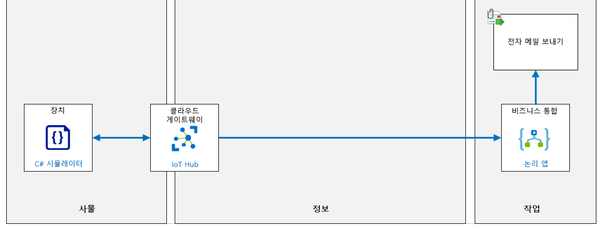

---
lab:
    title: '랩 09: IoT Hub를 Event Grid와 통합'
    module: '모듈 5: 인사이트 및 비즈니스 통합'
---

# Event Grid와 IoT Hub 통합

## 랩 시나리오

Contoso는 Azure IoT 서비스를 사용하여 당신이 만든 프로토타입 솔루션에 깊게 감명 받았으며 이미 시연했던 기능에 추가 예산을 할당하는 것을 긍정적으로 생각합니다. 이제는 특정 운영 지원 기능의 통합을 살펴보도록 요청하고 있습니다. 특히 Azure 도구가 특정 작업 영역을 담당하는 관리자에게 경고 알림을 보내는 것을 지원하는 방법을 확인하고 싶어합니다. 경고 기준은 비즈니스 영역 관리자에 의해 정의됩니다. IoT Hub에 도착하는 원격 분석 데이터를 평가하여 알림을 생성합니다.

이전에 함께 성공적으로 작업했던 비즈니스 관리자인 Nancy를 식별했습니다. 솔루션의 초기 단계에서 그녀와 함께 작업하게 될 것입니다.

Nancy는 시설 기술자 팀이 여러 치즈 동굴의 온도를 모니터링하는 데 사용할 새로운 연결된 온도 조절 장치를 설치할 책임이 있음을 알려줍니다. 온도 조절 디바이스는 IoT Hub에 연결할 수 있는 IoT 디바이스의 기능을 합니다. 프로젝트를 시작하려면 새 디바이스가 구현될 때 알림을 생성하는데 동의합니다.

경고를 생성하려면 IoT Hub에서 새 온도 조절 디바이스가 생성될 때 디바이스 생성 이벤트 유형을 Event Grid로 푸시합니다. Event Grid에서 이 이벤트에 반응하는 논리 앱 인스턴스를 만들어 새 디바이스가 생성되면 시설로 장치 ID 및 연결 상태를 명시하는 알림 전자 메일을 보냅니다.

다음의 리소스가 만들어집니다.



## 이 랩에서

이 랩에서는 다음 활동을 완료할 예정입니다.

* 랩 필수 구성 요소가 충족되는지 확인(필요한 Azure 리소스가 있음)
* 전자 메일을 보내는 논리 앱 만들기
* Azure IoT Hub 이벤트 구독 구성
* 논리 앱을 트리거하는 새 디바이스 만들기

### 연습 1: 랩 필수 구성 요소 확인

이 랩에서는 다음과 같은 Azure 리소스를 사용할 수 있다고 가정합니다.

| 리소스 종류  | 리소스 이름          |
|----------------|------------------------|
| 리소스 그룹 | AZ-220-RG              |
| IoT Hub        | AZ-220-HUB-_{YOUR-ID}_ |

이러한 리소스를 사용할 수 없는 경우 연습 2로 넘어가기 전에 아래 설명에 따라 **lab09-setup.azcli** 스크립트를 실행해야 합니다. 스크립트 파일은 개발자 환경 구성(랩 3)의 일부로 로컬로 복제한 GitHub 리포지토리에 포함됩니다.

**lab09-setup.azcli** 스크립트는 **bash** 셸 환경에서 실행되도록 작성되었습니다. Azure Cloud Shell에서 실행하는 것이 가장 쉽습니다.

1. 브라우저를 사용하여 [Azure Shell](https://shell.azure.com/)을 열고 이 과정에 사용 중인 Azure 구독으로 로그인합니다.

1. Azure Cloud Shell에서 **Bash**를 사용하고 있는지 확인합니다.

    Azure Cloud Shell 페이지의 왼쪽 상단에 있는 드롭다운으로 환경을 선택할 수 있습니다. 선택한 드롭다운 값이 **Bash**인지 확인합니다.

1. Azure Shell 도구 모음에서 설치 스크립트를 업로드하려면 **파일 업로드/다운로드**(오른쪽에서 네 번째 단추)를 클릭합니다.

1. Azure Shell 도구 모음에서 **파일 업로드/다운로드**(오른쪽에서 네 번째 단추)를 클릭합니다.

1. 드롭다운에서 **업로드**를 클릭합니다.

1. 파일 선택 대화 상자에서 개발 환경을 구성할 때 다운로드한 GitHub 랩 파일의 폴더 위치로 이동합니다.

    _랩 3: 개발 환경 설정_, ZIP 파일을 다운로드하고 콘텐츠를 로컬로 추출하여 랩 리소스를 포함하는 GitHub 리포지토리를 복제했습니다. 추출된 폴더 구조는 다음 폴더 경로를 포함합니다.

    * Allfiles
        * 랩
            * 랩 09: Event Grid와 IoT Hub 통합
                * 설정

    lab09-setup.azcli 스크립트 파일은 랩 9의 설치 폴더에 있습니다.

1. **lab09-setup.azcli** 파일을 선택한 다음 **열기**를 클릭합니다.

    파일 업로드가 완료되면 알림이 나타납니다.

1. Azure Cloud Shell에 올바른 파일이 업로드되었는지 확인하려면 다음 명령을 입력합니다.

    ```bash
    ls
    ```

    `ls` 명령으로 현재 디렉터리의 내용을 나열합니다. lab09-setup.azcli 파일이 나열되어 있어야 합니다.

1. 설치 스크립트가 포함된 이 랩에 대한 디렉터리를 만든 다음 해당 디렉터리로 이동하려면 다음 Bash 명령을 입력합니다.

    ```bash
    mkdir lab9
    mv lab09-setup.azcli lab9
    cd lab9
    ```

1. **lab09-setup.azcli**가 실행 권한이 있는지 확인하려면 다음 명령을 입력합니다.

    ```bash
    chmod +x lab09-setup.azcli
    ```

1. Cloud Shell 도구 모음에서 lab09-setup.azcli 파일을 편집하려면 **편집기 열기**(오른쪽에서 두 번째 단추 - **{ }**)를 클릭합니다.

1. **Files** 목록에서 lab9 폴더를 확장하고 스크립트 파일을 열려면 **lab9**을 클릭한 다음 **lab09-setup.azcli**를 클릭합니다.

    이제 편집기가 **lab09-setup.azcli** 파일의 내용을 표시합니다.

1. 편집기에서 `{YOUR-ID}` 및 `{YOUR-LOCATION}`의 할당된 값을 업데이트합니다.

    아래 샘플을 예로 들어, `{YOUR-ID}`를 이 과정을 시작할 때 만든 고유 ID(예: **CAH191211**)로 설정하고 `{YOUR-LOCATION}`를 리소스에 적합한 위치로 설정해야 합니다.

    ```bash
    #!/bin/bash

    YourID="{YOUR-ID}"
    RGName="AZ-220-RG"
    IoTHubName="AZ-220-HUB-$YourID"

    Location="{YOUR-LOCATION}"
    ```

    > **참고**:  `Location` 변수는 위치에 대해 짧은 이름으로 설정해야 합니다. 이 명령을 입력하면 사용 가능한 위치 및 짧은 이름(**이름** 열)의 목록을 볼 수 있습니다.
    >
    > ```bash
    > az account list-locations -o Table
    > ```
    >
    > ```text
    > 표시이름           위도    경도    이름
    > --------------------  ----------  -----------  ------------------
    > 동아시아             22.267      114.188      eastasia
    > 동남 아시아        1.283       103.833      southeastasia
    > 미국 중부            41.5908     -93.6208     centralus
    > 미국 동부               37.3719     -79.8164     eastus
    > 미국 동부 2             36.6681     -78.3889     eastus2
    > ```

1. 파일의 변경 내용을 저장하고 편집기를 닫으려면 편집기 창의 오른쪽 상단에서 ...를 클릭한 다음 **편집기 닫기**를 클릭합니다.

    저장하라는 메시지가 표시된 경우 **저장**을 클릭하면 편집기가 닫힙니다.

    > **참고**:  **CTRL+S**를 사용하여 언제든지 저장할 수 있으며 **CTRL+Q**를 사용하여 편집기를 닫을 수 있습니다.

1. **AZ-220-RG**라는 리소스 그룹을 만들고 **AZ-220-HUB-{YourID}** 라는 IoT Hub를 만들려면 다음 명령을 입력합니다.

    ```bash
    ./lab09-setup.azcli
    ```

    이 작업을 실행하려면 몇 분 정도 걸립니다. 각 단계가 완료되면 JSON 출력이 표시됩니다.

### 연습 2: 전자 메일을 보내는 HTTP 웹 후크 논리 앱 만들기

Azure Logic Apps는 기업 또는 조직 간에 애플리케이션, 데이터, 시스템 및 서비스를 통합해야 할 때 작업, 비즈니스 프로세스 및 작업 흐름을 자동화하고 오케스트레이션하는 데 도움이 되는 클라우드 서비스입니다.

이 연습에서는 HTTP 웹 후크를 통해 트리거되는 새 Azure 논리 앱을 만든 다음 Outlook.com 이메일 주소를 사용하여 이메일을 보냅니다.

#### 작업 1: Azure Portal에서 논리 앱 리소스 만들기

1. 필요한 경우 이 과정에서 사용 중인 Azure 계정 자격 증명을 사용하여 [Azure Portal](https://portal.azure.com)에 로그인합니다.

    둘 이상의 Azure 계정이 있는 경우에는 이 과정에 사용할 구독에 연결된 계정으로 로그인해야 합니다.

1. Azure Portal 메뉴에서 **리소스 만들기**를 클릭합니다.

1. **신규** 블레이드에 있는 **마켓플레이스 검색** 상자에서 **논리 앱**을 입력합니다.

1. 검색 결과에서 **논리 앱**을 클릭합니다.

1. **논리 앱** 블레이드에서 **만들기**를 클릭합니다.

1. **기본** 탭의 **프로젝트 세부 정보**에서 이 과정에서 사용 중인 **구독**을 선택합니다.

1. **리소스 그룹** 드롭다운의 **기존 항목 선택**에서 **AZ-220-RG**를 클릭합니다.

1. **인스턴스 세부 정보**의 **이름** 필드에 **AZ-220-LogicApp-_{YOUR-ID}_** 를 입력합니다.

    예: **AZ-220-LogicApp-CP191218**

    Azure 논리 앱의 이름은 IP로 연결된 디바이스에서 액세스가 가능하고 공개적으로 액세스할 수 있는 리소스이므로 전역적으로 고유해야 합니다.

1. **위치** 드롭다운에서 리소스 그룹에 사용된 것과 동일한 Azure 지역을 선택합니다.

1. **Log Analytics**를 **끄기**로 설정합니다.

1. **검토 + 만들기**를 클릭합니다.

1. **검토 + 만들기** 탭에서 **만들기**를 클릭합니다.

    > **참고**:  논리 앱 배포를 완료하는 데 1~2분 정도 걸릴 수 있습니다.

1. Azure Portal 대시보드로 돌아갑니다.

#### 작업 2: 논리 앱을 구성합니다. 

1. 리소스 그룹 타일에서 방금 배포된 논리 앱 리소스에 대한 링크를 클릭합니다.

    **AZ-220-LogicApp-_{YOUR-ID}_** 논리 앱이 표시되지 않으면 리소스 그룹 타일을 새로 고칩니다.

    > **참고**: 처음 **논리 앱**을 탐색할 때 **논리 앱 디자이너** 창이 표시됩니다. 이 페이지가 자동으로 나타나지 않으면 **논리 앱** 블레이드의 **개발 도구** 섹션에서 **논리 앱 디자이너**를 클릭합니다.

1. **공통 트리거로 시작** 섹션에서 **HTTP 요청을 수신하는 경우**를 클릭합니다.

    일반적으로 사용되는 트리거 중 하나로 시작하는 것이 논리 앱에서 시작하는 편리한 방법입니다.

1. **HTTP 요청을 수신하는 경우** 트리거가 선택되면서 비주얼 디자이너가 열립니다.

1. **HTTP 요청을 수신하는 경우** 트리거의 **요청 본문 JSON 스키마** 텍스트 상자에서 **샘플 페이로드를 사용하여 스키마 생성** 링크를 클릭합니다.

    > **참고**: 다음 단계에서 요청 본문 JSON 스키마 텍스트 상자에 **DeviceCreated** 샘플 이벤트 스키마를 추가합니다. 이 샘플은 자세한 내용을 배우려는 사람들을 위해 다음 링크에서 몇 가지 다른 이벤트 스키마 샘플 및 일부 관련 설명서와 함께 나와 있습니다. [IoT Hub용 Azure Event Grid 이벤트 스키마](https://docs.microsoft.com/ko-kr/azure/event-grid/event-schema-iot-hub).

1. 복사 및 붙여넣기 작업으로 다음 샘플 JSON을 요청 본문 JSON 스키마 텍스트 상자에 추가한 다음 **완료**를 클릭합니다.

    ```json
    [{
      "id": "56afc886-767b-d359-d59e-0da7877166b2",
      "topic": "/SUBSCRIPTIONS/<subscription ID>/RESOURCEGROUPS/<resource group name>/PROVIDERS/MICROSOFT.DEVICES/IOTHUBS/<hub name>",
      "subject": "devices/LogicAppTestDevice",
      "eventType": "Microsoft.Devices.DeviceCreated",
      "eventTime": "2018-01-02T19:17:44.4383997Z",
      "data": {
        "twin": {
          "deviceId": "LogicAppTestDevice",
          "etag": "AAAAAAAAAAE=",
          "deviceEtag": "null",
          "status": "enabled",
          "statusUpdateTime": "0001-01-01T00:00:00",
          "connectionState": "Disconnected",
          "lastActivityTime": "0001-01-01T00:00:00",
          "cloudToDeviceMessageCount": 0,
          "authenticationType": "sas",
          "x509Thumbprint": {
            "primaryThumbprint": null,
            "secondaryThumbprint": null
          },
          "version": 2,
          "properties": {
            "desired": {
              "$metadata": {
                "$lastUpdated": "2018-01-02T19:17:44.4383997Z"
              },
              "$version": 1
            },
            "reported": {
              "$metadata": {
                "$lastUpdated": "2018-01-02T19:17:44.4383997Z"
              },
              "$version": 1
            }
          }
        },
        "hubName": "egtesthub1",
        "deviceId": "LogicAppTestDevice"
      },
      "dataVersion": "1",
      "metadataVersion": "1"
    }]
    ```

    이 샘플 JSON은 만들어진 Event Grid가 논리 앱의 웹 후크 엔드포인트에 게시하는 JSON의 예입니다. 이 샘플에는 원격 분석 메시지를 보내는 IoT 디바이스에 대한 IoT Hub 메시지 원격 분석 속성이 포함되어 있습니다.

1. 이제 **요청 본문 JSON 스키마** 텍스트 상자가 사용자가 제공한 샘플 JSON에 따라 자동으로 생성된 JSON 스키마로 채워집니다.

1. **HTTP 요청을 수신하는 경우** 트리거 아래에서 **새 단계**를 클릭합니다.

1. **작업 선택** 아래 검색 텍스트 상자에 **Outlook.com**을 입력합니다.

1. 작업 목록을 아래로 스크롤하여 보내기 옵션으로 이동한 다음 **이메일 보내기(V2)** 를 클릭합니다.

    > **참고**:  이 지침은 **Outlook.com** 이메일 주소를 사용하여 이메일을 보낼 논리 앱을 구성하는 방법을 보여줍니다. 논리 앱은 Office 365 Outlook 또는 Gmail 커넥터를 사용하여 이메일을 보내도록 구성할 수도 있습니다.

1. **Outlook.com** 커넥터에서 **로그인**을 클릭한 다음 메시지에 따라 기존 Outlook.com 계정으로 인증합니다.

1. **이 앱이 정보에 액세스할 수 있도록 허용하시겠습니까**라는 메시지가 나타나면 **예**를 클릭합니다.

1. **이메일 보내기(V2)** 작업에서 **받는 사람** 필드에 이메일 주소를 입력하여 이메일 메시지를 보냅니다.

    이 랩에서 사용자는 전자 메일 알림을 받을 수 있는 전자 메일 주소를 제공합니다. 이 커넥터에 사용된 Outlook.com 계정 또는 쉽게 액세스할 수 있는 다른 전자 메일 계정을 입력할 수 있습니다.

    위 단계에서 인증된 Outlook.com 계정은 전자 메일을 보내는 데 사용됩니다.

1. **제목** 필드에 **IoT Hub 경고**를 입력합니다.

1. **본문** 필드에 다음 메시지 내용을 입력합니다.

    ```
    다음 사항을 알려주는 자동 전자 메일입니다.

    {eventTime}에 {eventType} 발생

    IoT Hub: {hubName}
    장치 ID: {deviceID}
    연결 상태: {connectionState}
    ```

1. 방금 입력한 메시지 본문을 잠시 살펴봅니다.

    중괄호 항목은 동적 콘텐츠를 나타내기 위한 것임을 알 수 있습니다. 이러한 자리 표시자 항목을 실제 동적 콘텐츠 값으로 바꿔야 합니다.

    > **참고**: 동적 콘텐츠 추가 도구가 커넥터 오른쪽에 표시되지 않으면 **본문** 텍스트 상자 바로 아래에 있는 **동적 콘텐츠 추가** 하이퍼링크를 클릭합니다. 필요한 필드가 나열되지 않은 경우 동적 콘텐츠 창에서 **자세히 보기**를 클릭하여 입력한 메시지 본문에 포함된 필드를 포함합니다.

    다음 단계에서는 각 자리 표시자 값을 해당 동적 콘텐츠 값으로 바꿉니다.

1. 각 동적 콘텐츠 자리 표시자에 대해 항목을 삭제한 다음 해당 동적 콘텐츠 필드로 바꿉니다.

    첫 번째 동적 콘텐츠 값을 추가할 때 입력 데이터 스키마는 배열용이므로, Logic Apps 디자이너는 **각** 작업의 내부에 중첩될 이메일 작업을 자동으로 변경합니다. 이 경우 **이메일 보내기(V2)** 작업이 축소됩니다. 이메일 메시지를 다시 열려면 **이메일 보내기(V2)** 를 클릭한 다음 메시지 본문을 계속 편집합니다.

    이 단계를 완료하면 다음과 유사한 메시지 본문이 표시됩니다.


1. 논리 앱 워크플로에 대한 모든 변경 내용을 저장하려면 디자이너의 맨 위에서 **저장**을 클릭합니다.

1. _HTTP 요청을 수신하는 경우_ 트리거를 확장하려면 **HTTP 요청을 수신하는 경우**를 클릭합니다.

1. 표시된 **HTTP POST URL**의 값을 복사합니다.

    **HTTP POST URL**은 다음과 유사합니다.

    ```text
    https://prod-87.eastus.logic.azure.com:443/workflows/b16b5556cbc54c97b063479ed55b2669/triggers/manual/paths/invoke?api-version=2016-10-01&sp=%2Ftriggers%2Fmanual%2Frun&sv=1.0&sig=ZGqYl-R5JKTugLG3GR5Ir1FuM0zIpCrMw4Q2WycJRiM
    ```

    이 URL은 HTTPS를 통해 논리 앱 트리거를 호출하는 데 사용되는 웹 후크 엔드포인트입니다. **sig** 쿼리 문자열 매개 변수와 그 값을 참조합니다. **sig** 매개 변수에는 웹 후크 엔드포인트에 대한 요청을 인증하는 데 사용되는 공유 액세스 키가 포함되어 있습니다.

1. 나중에 참조할 수 있도록 URL을 저장합니다.

### 연습 3: Azure IoT Hub 이벤트 구독 구성

Azure IoT Hub는 Azure Event Grid와 통합되므로 다른 서비스에 이벤트 알림을 보내고 다운스트림 프로세스를 트리거할 수 있습니다. 비즈니스 애플리케이션을 구성하여 IoT Hub 이벤트를 수신 대기할 수 있으므로 중요한 이벤트에 안정적이고 확장 가능하며 안전한 방법으로 대응할 수 있습니다. 예를 들어, 데이터베이스를 업데이트하고, 작업 티켓을 만들고, 새 IoT 디바이스가 IoT Hub에 등록될 때마다 전자 메일 알림을 제공하는 애플리케이션을 빌드합니다.

이 연습에서는 Azure IoT Hub에서 이벤트 구독을 만들어 경고 이메일을 보내는 논리 앱을 트리거하는 Event Grid 통합을 설정합니다.

1. Azure Portal 대시보드로 돌아갑니다.

1. 리소스 그룹 타일에서 IoT Hub로 이동하려면 **AZ-220-HUB-_{YOUR-ID}_** 를 클릭합니다.

1. **IoT Hub** 블레이드의 왼쪽 탐색 메뉴에서 **이벤트**를 클릭합니다.

1. **이벤트** 창 상단의 **이벤트 구독**을 클릭합니다.

1. 이벤트 구독 만들기 블레이드의 **이름** 필드에 **MyDeviceCreateEvent**를 입력합니다.

1. 제출된 **EventSchema**가 **Event Grid 스키마**로 설정되어 있는지 확인합니다.

1. **주제 세부 정보** 섹션은 변경하지 않습니다.

    이 섹션은 정보 및 읽기 전용입니다.

1. **이벤트 유형**에서 **이벤트 유형으로 필터링** 드롭다운을 연 다음 **만든 디바이스**를 제외한 모든 선택 사항을 선택 취소합니다.

1. **엔드포인트 세부 정보**에서 **엔드포인트 유형** 드롭다운을 연 다음 **웹 후크**를 클릭합니다.

1. **엔드포인트 세부 정보**에서 **엔드포인트 선택**을 클릭합니다.

1. **웹 후크 선택** 창의 **구독자 엔드포인트**에 논리 앱에서 복사한 URL을 붙여넣은 다음 **선택 확인**을 클릭합니다.
  
    > **중요**: 만들기를 클릭하지 마세요!

    여기에서 이벤트 구독을 저장하고 IoT Hub에서 만든 모든 디바이스에 대한 알림을 받을 수 있습니다. 그러나 이 랩에서는 선택 필드를 사용하여 특정 디바이스를 필터링합니다. 

1. 창 상단에서 **필터**를 클릭합니다.

    필터를 사용하여 특정 디바이스를 필터링합니다.

1. **고급 필터**에서 **새 필터 추가**를 클릭하고 다음 값으로 필드를 채웁니다.

    * **키**: `Subject`를 입력합니다.

    * **연산자**: `다음으로 시작하는 문자열` 선택

    * **값**:  `devices/CheeseCave1_` 입력

    이 값을 사용하여 치즈 동굴 1 위치(CheeseCave1)와 관련된 디바이스 이벤트를 필터링합니다.

1. 두 번째 필터를 만들려면 **새 필터 추가**를 클릭한 다음 필드를 다음 값으로 채웁니다.

    * **키**: `Subject`를 입력합니다.

    * **연산자**: `문자열 끝` 선택

    * **값**: `_Thermostat`를 입력합니다.

    이 값을 사용하여 온도와 관련된 디바이스 이벤트를 필터링합니다.

1. 이벤트 구독을 저장하려면 **만들기**를 클릭합니다.

### 연습 4: 새 디바이스로 논리 앱 테스트

이벤트 알림 전자 메일을 트리거하는 새 디바이스를 만들어 논리 앱을 테스트합니다.

1. 필요한 경우 Azure Portal에서 IoT Hub 블레이드로 이동합니다.

1. 탐색 메뉴 왼쪽의 **탐색기**에서 **IoT 디바이스**를 클릭합니다.

1. IoT 디바이스 블레이드 상단에서 **신규**를 선택합니다.

1. **장치 ID** 필드에 **CheeseCave1_Building1_Thermostat**를 입력합니다.

1. 다른 필드는 모두 기본값으로 두고 **저장**을 클릭합니다.

1. 이벤트 구독 필터를 테스트하려면 다음 디바이스 ID를 사용하여 추가 디바이스를 만듭니다.

    * `CheeseCave1_Building1_Light`
    * `CheeseCave2_Building1_Thermostat`
    * `CheeseCave2_Building2_Light`

    총 네 가지 예를 추가한 경우 IoT 디바이스 목록은 다음 이미지와 같아야 합니다.


1. IoT Hub에 디바이스를 몇 개 추가한 후 전자 메일을 확인하여 논리 앱을 트리거한 다비이스를 확인합니다.
