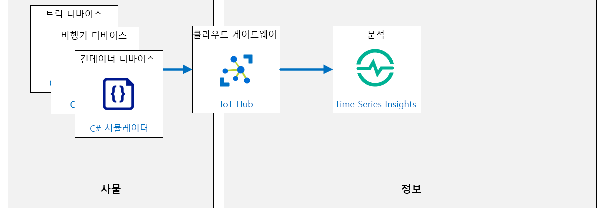

---
lab:
    title: '랩 10: Time Series Insights로 시간이 기록된 데이터 탐색 및 분석'
    module: '모듈 5: 인사이트 및 비즈니스 통합'
---

# Time Series Insights로 시간이 기록된 데이터 탐색 및 분석

## 랩 시나리오

Azure IoT 서비스 및 도구를 구현하는 노력이 성과를 보습니다. Contoso는 운송 중 치즈 컨테이너의 환경 조건을 모니터링하는 "자산 상태 추적 시스템"을 출시했습니다.

새로운 시스템을 출시한 지 2주 만에 특정 발송물에서 온도 급증이 나타났습니다. 배송 중인 치즈 중 일부는 상해버렸지만, 새로운 시스템 덕분에 그런 영향을 받은 치즈는 고객에게 배달되지 않았습니다. 모니터링 시스템의 Azure IoT 측면을 누구보다 잘 알고 있으므로, 이 조사를 이끌 것입니다.

경영진은 향후 제품의 손실이 줄어드는 것을 기대해도 될 만큼 시스템이 개선될 수 있는지 여부를 결정하도록 당신에게 요청했습니다. 배송 중에 사용된 트럭과 비행기에서 가져온 IoT 디바이스의 센서 데이터의 상관 관계를 지정했습니다. 한 트럭의 온도가 차량의 특정 영역에서 예기치 않게 상승했고, 온도 및 습도를 모니터링하던 IoT 디바이스가 설치된 운송 컨테이너 중 하나에 뜨거운 열을 생성한 것으로 보입니다.

팀에서는 모니터링 시스템의 추가 개선을 위해서 거의 실시간에 가까운 데이터 탐색 및 근본 원인 분석이 필요하다고 결정했습니다.

Azure IoT 솔루션에 Time Series Insights를 추가하는 것을 제안합니다. 이를 통해 Contoso는 트럭, 비행기 및 컨테이너의 IoT 디바이스에서 생성된 대량의 시계열 데이터를 신속하게 저장, 시각화 및 쿼리하고 시간에 따른 변화를 시각화할 수 있습니다. 

다음 리소스가 만들어집니다.



## 랩 내용

이 랩에서는 다음 활동을 완료할 예정입니다.

* 랩 필수 구성 요소가 충족되는지 확인(필요한 Azure 리소스가 있음)

    * 필요한 경우 스크립트를 실행하여 IoT Hub 만들기
    * 스크립트를 실행하여 이 랩용 새 디바이스 ID 3개 만들기

* Azure TSI(Time Series Insights) 환경 만들기
* TSI(Time Series Insights)로 IoT Hub에 연결
* TSI(Time Series Insights) 탐색기를 사용하여 시계열 데이터 확인

## 랩 지침

### 연습 1: 랩 필수 구성 요소 확인

이 랩에서는 다음과 같은 Azure 리소스를 사용할 수 있다고 가정합니다.

| 리소스 유형 | 리소스 이름 |
| :-- | :-- |
| 리소스 그룹 | `rg-az220` |
| IoT Hub | `iot-az220-training-{your-id}` |
| 디바이스 ID | `sensor-th-truck0001` |
| 디바이스 ID | `sensor-th-airplane0001` |
| 디바이스 ID | `sensor-th-container0001` |

> **중요**: 설정 스크립트를 실행하여 필요한 디바이스를 만드세요.

누락된 리소스와 새 디바이스를 만들려면 연습 2를 진행하기 전에 아래 설명에 따라 **lab10-setup.azcli** 스크립트를 실행해야 합니다. 스크립트 파일은 개발자 환경 구성(랩 3)의 일부로 로컬로 복제한 GitHub 리포지토리에 포함됩니다.

**lab10-setup.azcli** 스크립트는 **bash** 셸 환경에서 실행되도록 작성됩니다. 이는 Azure Cloud Shell에서 실행할 수 있는 가장 쉬운 방법입니다.

1. 브라우저를 사용하여 [Azure Cloud Shell](https://shell.azure.com/)을 열고 이 과정에 사용 중인 Azure 구독으로 로그인합니다.

1. Cloud Shell에서 **Bash**를 사용하고 있는지 확인합니다.

    Azure Cloud Shell 페이지의 왼쪽 상단에 있는 드롭다운은 환경을 선택하는 데 사용됩니다. 선택한 드롭다운 값이 **Bash**인지 확인합니다.

1. Cloud Shell 도구 모음에서 **파일 업로드/다운로드**(오른쪽의 네 번째 단추)를 클릭합니다.

1. 드롭다운에서 **업로드**를 클릭합니다.

1. 파일 선택 대화 상자에서 개발 환경을 구성할 때 다운로드한 GitHub 랩 파일의 폴더 위치로 이동합니다.

    _랩 3: 개발 환경 설정_, ZIP 파일을 다운로드하고 콘텐츠를 로컬로 추출하여 랩 리소스를 포함하는 GitHub 리포지토리를 복제했습니다. 추출된 폴더 구조에는 다음 폴더 경로가 포함됩니다.

    * 모든 파일
      * 랩
          * 10-Time Series Insights로 타임스탬프 데이터 탐색 및 분석
            * Setup

    lab10-setup.azcli 스크립트 파일은 랩 10의 Setup 폴더에 있습니다.

1. **lab10-setup.azcli** 파일을 선택한 다음 **열기**를 클릭합니다.

    파일 업로드가 완료되면 알림이 표시됩니다.

1. Azure Cloud Shell에 올바른 파일이 업로드되었는지 확인하려면 다음 명령을 입력합니다.

    ```bash
    ls
    ```

    `ls` 명령으로 현재 디렉터리의 내용을 나열합니다. lab10-setup.azcli 파일이 나열됩니다.

1. 설치 스크립트가 포함된 이 랩에 대한 디렉터리를 만든 다음 해당 디렉터리로 이동하려면 다음 Bash 명령을 입력합니다.

    ```bash
    mkdir lab10
    mv lab10-setup.azcli lab10
    cd lab10
    ```

1. **lab10-setup.azcli**에 실행 권한이 있는지 확인하려면 다음 명령을 입력합니다.

    ```bash
    chmod +x lab10-setup.azcli
    ```

1. Cloud Shell 도구 모음에서 lab10-setup.azcli 파일에 액세스할 수 있도록 설정하려면 **편집기 열기 **(오른쪽에서 두 번째 단추 - **{}**) 를 클릭합니다.

1. lab10 폴더를 펼치고 스크립트 파일을 열려면 **파일** 목록에서 **lab10**을 클릭한 다음 **lab10-setup.azcli**를 클릭합니다.

    이제 편집기에서 **lab10-setup.azcli** 파일의 내용을 표시합니다.

1. 편집기에서 `{your-id}` 및 `{your-location}`에 할당된 값을 업데이트합니다.

    아래 샘플을 예로 들어 보면, `{your-id}`는 이 과정을 시작할 때 만든 고유 ID(예: **cah191211**)로 설정하고 `{your-location}`는 리소스에 적합한 위치로 설정해야 합니다.

    ```bash
    #!/bin/bash

    # 아래 값을 변경하세요!
    YourID="{your-id}"
    Location="{your-location}"
    ```

    > **참고**:  `{your-location}` 변수는 모든 리소스를 배포하는 지역의 짧은 이름으로 설정해야 합니다. 이 명령을 입력하면 사용 가능한 위치 및 짧은 이름(**이름** 열)의 목록을 볼 수 있습니다.

    ```bash
    az account list-locations -o Table

    DisplayName           Latitude    Longitude    Name
    --------------------  ----------  -----------  ------------------
    East Asia             22.267      114.188      eastasia
    Southeast Asia        1.283       103.833      southeastasia
    Central US            41.5908     -93.6208     centralus
    East US               37.3719     -79.8164     eastus
    East US 2             36.6681     -78.3889     eastus2
    ```

1. 파일의 변경 내용을 저장하고 편집기를 닫으려면 편집기 창 오른쪽 위의 **...** 를 클릭한 다음 **편집기 닫기**를 클릭합니다.

    저장하라는 메시지가 표시된 경우 **저장**을 클릭하면 편집기가 닫힙니다.

    > **참고**:  **CTRL+S**를 사용하여 언제든지 저장할 수 있으며 **CTRL+Q**를 사용하여 편집기를 닫을 수 있습니다.

1. 이 랩에 필요한 리소스를 만들려면 다음 명령을 입력합니다.

    ```bash
    ./lab10-setup.azcli
    ```

    이 스크립트를 실행하는 데 몇 분이 걸릴 수 있습니다. 각 단계가 완료될 때 출력이 표시됩니다.

    이 스크립트는 먼저 **rg-az220** 리소스 그룹과 **iot-az220-training-{your-id}** IoT Hub를 만듭니다. 이미 있는 경우 해당 메시지가 표시됩니다. 그런 다음 스크립트는 IoT Hub에 세 개의 디바이스를 추가하고 디바이스 연결 문자열을 표시합니다. 디바이스 ID는 **sensor-th-truck0001**, **sensor-th-airplane0001** 및 **sensor-th-container0001**입니다.

1. 스크립트가 완료되면 각 디바이스의 연결 문자열이 표시됩니다.

    연결 문자열은 "HostName="으로 시작합니다.

1. 각 디바이스의 연결 문자열을 텍스트 문서에 복사합니다.

    연결 문자열을 쉽게 찾을 수 있는 위치에 저장하면 랩을 계속할 준비가 됩니다. 연결 문자열은 연결된 디바이스의 장치 ID를 지정합니다.

### 연습 2: Time Series Insights 설정

Azure TSI(Time Series Insights)는 IoT 솔루션에서 규모에 맞게 데이터를 수집, 처리, 저장, 분석 및 쿼리하는 데 사용되는 종단 간 PaaS(Platform-as-a-Service) 제품입니다. TSI는 맥락을 매우 고려하고 시계열에 최적화된 데이터의 운영 분석과 임시 데이터 탐색을 위해 설계되었습니다.

이 연습에서는 Time Series Insights와 Azure IoT Hub의 통합을 설정합니다.

1. Azure 계정 자격 증명을 사용하여 [portal.azure.com](https://portal.azure.com)에 로그인합니다.

    Azure 계정이 두 개 이상인 경우 이 과정에 사용할 구독에 연결된 계정으로 로그인해야 합니다.

1. Azure Portal 메뉴에서 **+ 리소스 만들기**를 클릭합니다.

1. **새로 만들기** 블레이드에서 **마켓플레이스 검색** 텍스트 상자에 **Time Series Insights**를 입력합니다.

1. 검색 결과에서 **Time Series Insights**를 클릭합니다.

1. **Time Series Insights** 블레이드에서 **만들기**를 클릭합니다.

1. **Time Series Insights 환경 만들기** 블레이드에서 **환경 이름** 필드에 **tsi-az220-training**을 입력합니다.

1. **구독** 드롭다운에서 이 과정에서 사용할 구독을 선택합니다.

1. **리소스 그룹** 드롭다운에서 **rg-az220**을 클릭합니다.

1. **위치** 드롭다운에서 리소스 그룹에서 사용하는 Azure 지역을 선택합니다.

1. **계층** 필드에서 **Gen1(S1)** 가격 책정 계층이 선택되어 있으며 **용량**이 **1**로 설정되어 있는지 확인합니다.

1. 블레이드 하단에서 **다음: 이벤트 원본**을 클릭합니다.

1. **이벤트 원본 세부 정보** 섹션에서 **이벤트 소스를 만드시겠습니까?** 가 **예**로 설정되어 있는지 확인합니다.

1. **이름** 필드에 **iot-az220-training-{your-id}** 를 입력하여 이 이벤트 원본의 고유한 이름을 지정합니다.

1. **소스 유형** 드롭다운에서 **IoT Hub**가 선택되어 있는지 확인합니다.

1. **허브 선택** 드롭다운에서 **기존 선택**을 선택해야 합니다.

    이렇게 하면 이미 프로비전된 기존 IoT Hub를 선택할 수 있습니다.

1. **구독** 드롭다운에서 이 과정에서 사용할 구독을 선택합니다.

1. **IoT Hub 이름** 드롭다운에서 이미 프로비전된 **iot-az220-training-{your-id}** Azure IoT Hub 서비스를 선택합니다.

1. **IoT Hub 액세스 정책 이름** 드롭다운에서 **iothubowner**를 클릭합니다.

    프로덕션 환경에서는 TSI(Time Series Insights) 액세스를 구성하는 데 사용할 Azure IoT Hub에 새 _액세스 정책_을 만드는 것이 좋습니다. 이렇게 하면 동일한 Azure IoT Hub에 연결된 다른 서비스와 독립적으로 TSI의 보안을 관리할 수 있습니다.  편의를 위해 여기서는 이 작업을 수행하지 않습니다.

1. **소비자 그룹** 섹션에서 **IoT Hub 소비자 그룹** 드롭다운 옆에 있는 **새로 만들기**를 클릭합니다.

1. **IoT Hub 소비자 그룹** 상자에 **tsievents**를 입력한 다음 **추가**를 클릭합니다.

    이렇게 하면 이 이벤트 원본에 사용할 새 _소비자 그룹_이 추가됩니다. 한 번에 지정된 소비자 그룹에서 활성 판독기가 하나만 있을 수 있기 때문에 소비자 그룹은 이 이벤트 원본에만 사용해야 합니다.

1. **타임스탬프** 섹션에서 **속성 이름**을 비워 둡니다.

1. 블레이드 하단의 **검토 + 생성**을 클릭하세요.

    > **참고**: *이벤트 원본* 창으로 바로 돌아갈 경우, **IoT Hub 소비자 그룹** 필드의 오른쪽에 있는 **추가**를 클릭했는지 다시 한 번 확인합니다. 소비자 그룹을 만들 때까지 TSI 리소스를 만들 수 없습니다.

1. 블레이드 하단의 **만들기**를 클릭합니다.

    > **참고**:  TSI(Time Series Insights) 배포를 완료하는 데 몇 분 정도 걸릴 수 있습니다.

1. Time Series Insights 배포가 완료되면 대시보드로 다시 이동합니다.

1. 리소스 그룹 타일을 새로 고친 다음 **tsi-az220-training**을 클릭합니다.

    모든 리소스를 보기 위해 대시보드 크기를 조정해야 할 수 있습니다.

    > **참고**: **Time Series Insights 환경** 리소스의 이름을 **tsi-az220-training**으로 지정했습니다. 만든 *Time Series Insights 이벤트 원본*도 표시되지만, 현재로서는 TSI 환경을 열려고 합니다.  
 
1. **Time Series Insights 환경** 블레이드의 왼쪽 메뉴에서 **설정** 아래에 있는 **이벤트 원본**을 클릭합니다.

1. **이벤트 원본** 창의 목록에서 **iot-az220-training-{your-id}** 이벤트 원본을 확인합니다.

    이 항목이 TSI 리소스를 만들 때 구성한 이벤트 원본입니다.

1. 이벤트 원본 세부 정보를 보려면 **iot-az220-training-{your-id}** 를 클릭합니다.

    이벤트 원본의 구성은 Time Series Insights 리소스가 생성될 때 설정된 구성과 일치합니다.

### 연습 3: 시뮬레이션된 IoT 디바이스 실행

이 연습에서는 시뮬레이션된 디바이스를 실행하여 Azure IoT Hub로 원격 분석 이벤트를 보냅니다.

1. **Visual Studio Code**를 엽니다.

1. **파일** 메뉴에서 **폴더 열기**를 클릭합니다.

1. **폴더 열기** 대화 상자에서 랩 10 Starter 폴더로 이동합니다.

    _랩 3: 개발 환경 설정_, ZIP 파일을 다운로드하고 콘텐츠를 로컬로 추출하여 랩 리소스를 포함하는 GitHub 리포지토리를 복제했습니다. 추출된 폴더 구조에는 다음 폴더 경로가 포함됩니다.

    * 모든 파일
      * 랩
          * 10-Time Series Insights로 타임스탬프 데이터 탐색 및 분석
            * Starter

1. **폴더 열기** 대화 상자에서 **ContainerSimulation**을 클릭한 다음 **폴더 선택**을 클릭합니다.

    메시지가 표시되면 C# 확장을 로드 및/혹은 복원합니다.
 
1. 탐색기 창에서 Program.cs 파일을 열려면 **Program.cs**를 클릭합니다.

1. 연결 문자열을 할당할 때 사용한 변수를 찾습니다.

    ```csharp
    private readonly static string connectionStringTruck = "{Your Truck device connection string here}";
    private readonly static string connectionStringAirplane = "{Your Airplane device connection string here}";
    private readonly static string connectionStringContainer = "{Your Container device connection string here}";
    ```

1. 랩의 앞부분에서 저장한 연결 문자열로 변수 할당을 업데이트합니다. 

    자리 표시자 값은 해당 IoT 디바이스의 연결 문자열로 바꿔야 합니다.

1. **파일** 메뉴에서 **저장**을 클릭합니다.

1. **보기** 메뉴에서 **터미널**을 클릭합니다.

1. **터미널** 창에서 명령 프롬프트에 랩 10 `/Starter/ContainerSimulation` 디렉터리 경로가 지정되어 있는지 확인합니다.

1. 명령 프롬프트에서 **ContainerSimulation** 앱을 빌드하고 실행하려면 다음 명령을 입력합니다.

    ```cmd/sh
    dotnet run
    ```

1. 터미널 창에 표시되는 메시지를 확인합니다.

    **ContainerSimulation** 앱이 실행되면 터미널에 원격 분석 데이터를 출력하기 시작합니다. Azure IoT Hub로 보내는 원격 분석 데이터입니다.

    **ContainerSimulation** 앱이 실행 중일 때 **터미널** 출력은 다음과 유사합니다.

    ```text
    12/27/2019 8:51:30 PM > Sending TRUCK message: {"temperature":35.15660452608195,"humidity":48.422323938240865}
    12/27/2019 8:51:31 PM > Sending AIRPLANE message: {"temperature":17.126545186374237,"humidity":36.46941012936869}
    12/27/2019 8:51:31 PM > Sending CONTAINER message: {"temperature":21.986403302500637,"humidity":47.847680384455096}
    12/27/2019 8:51:32 PM > Sending TRUCK message: {"temperature":36.10474464823629,"humidity":48.82029906486022}
    12/27/2019 8:51:32 PM > Sending AIRPLANE message: {"temperature":16.55005930170971,"humidity":36.49988437459935}
    12/27/2019 8:51:32 PM > Sending CONTAINER message: {"temperature":21.811727088543286,"humidity":50.0}
    ```

1. 이 랩의 뒷부분을 진행하는 동안 **ContainerSimulation** 앱을 실행 상태로 유지합니다.

    이렇게 하면 세 디바이스(컨테이너, 트럭, 비행기)의 디바이스 원격 분석이 Azure IoT Hub로 전송됩니다.

1. **ContainerSimulation** 앱이 30초 동안 실행되고 나면 **Container** 디바이스가 운송 방법을 변경하고 있음을 알리는 메시지가 표시됩니다.

    운송 방법은 30초마다 **트럭**과 **비행기** 간에 서로 변경됩니다. **터미널** 출력은 다음과 같습니다.

    ```text
    12/27/2019 8:51:40 PM > CONTAINER transport changed to: TRUCK
    ```

    > **참고**:  프로덕션에서 배송 컨테이너는 정상적인 운송 과정에서 운송 방법만 변경합니다. 이 랩의 시뮬레이션된 시나리오의 경우, 이 랩의 단계를 수행하는 과정 동안 적합한 짧은 데이터 지속 시간을 제공하기 위해 30초마다 수행됩니다.

### 연습 4: Time Series Insights 탐색기 보기

이 연습에서는 TSI(Time Series Insights) 탐색기를 사용하여 시계열 데이터로 작업하는 방법을 소개합니다.

1. 필요한 경우 Azure 계정 자격 증명을 사용하여 [portal.azure.com](https://portal.azure.com)에 로그인합니다.

    Azure 계정이 두 개 이상인 경우 이 과정에 사용할 구독에 연결된 계정으로 로그인해야 합니다.

1. 리소스 그룹 타일에서 **tsi-az220-training**을 클릭합니다.

1. **Time Series Insights 환경** 블레이드의 **개요** 창 상단에서 **TSI 탐색기로 이동**을 클릭합니다.

    그러면 새 브라우저 탭에서 **Time Series Insights 탐색기**가 열립니다.

1. 왼쪽 메뉴에서 **분석**이 선택되어 있는지 확인합니다.

    탐색 메뉴를 펼쳐서 단추 이름을 표시할 수 있습니다. 두 가지 옵션은 "분석"과 "모델"입니다. 분석을 선택합니다.

    탐색 메뉴를 축소하여 페이지 왼쪽에 있는 쿼리 편집 영역을 볼 수 있도록 합니다.

1. 쿼리 편집을 시작하려면 **새 쿼리 추가**를 클릭합니다.

1. 쿼리 편집기에서 **쿼리 1** 아래의 **측정** 드롭다운을 열고 **온도**를 클릭합니다.

1. **분할 기준** 드롭다운을 열고 **iothub-connection-device-id**를 클릭합니다.

    쿼리를 실행하면 그래프를 분할하여 각 IoT 디바이스의 원격 분석을 그래프에 별도로 표시합니다.

1. 디스플레이를 자동으로 새로 고치려면 페이지 상단에서 **자동 새로 고침**을 클릭합니다.

    **자동 새로 고침**을 사용하도록 설정하면 디스플레이가 _30초_마다 업데이트되어 최신 데이터가 표시됩니다. 사용 가능한 데이터의 마지막 1시간에만 적용됩니다.

1. 이제 그래프에 Azure IoT Hub의 IoT 디바이스에서 생성한 **온도** 센서 이벤트 데이터가 _꺾은선형 차트_로 표시됩니다.

1. 그래프 왼쪽에 있는 **장치 ID** 목록을 확인합니다. 

    특정 장치 ID 위에 마우스를 가져가면 그래프 디스플레이의 데이터가 강조 표시됩니다.

1. 시뮬레이션된 세 개의 디바이스에서 시스템으로 스트리밍되는 원격 분석의 온도 데이터(그래프)를 잠시 살펴봅니다.

1. **sensor-th-container0001**의 **온도** 급상승은 **sensor-th-truck0001** 또는 **sensor-th-airplane0001** 중 하나의 온도 급상승과 연관이 있습니다.

    이것은 sensor-th-container0001이 그 시간에 트럭이나 비행기에 의해 수송되고 있음을 표시합니다.

1. 디스플레이에 두 번째 쿼리를 추가하려면 **새 쿼리 추가**를 클릭합니다.

1. **쿼리 2**에서 **측정** 드롭다운을 **습도**로 설정하고 **분할 기준** 드롭다운을 **iothub-connection-device-id**로 설정한 다음 **추가**를 클릭합니다.

    이제 두 개의 그래프가 표시됩니다. 위에 있는 그래프는 **온도**를 나타내고, 아래에 있는 그래프는 **습도**를 나타내며, 둘 다 각각의 Y축 척도를 사용하고 있습니다.

1. 마우스 포인터를 그래프 선 중 하나에 놓습니다.

    마우스 커서를 그래프 위에 두면 그래프 요소에 대한 세부 정보가 팝업으로 나타납니다. 팝업에는 그래프에서 해당 데이터 요소의 최소치(**min**), 평균치(**avg**), 최대치(**max**) 값이 표시됩니다(해당 요소가 나타나는 짧은 시간 동안). 선택한 데이터 요소와 연결된 시간 범위가 디스플레이 하단의 시간 축을 따라 표시됩니다.

1. 세로 축 선 위에 있는 그래프 설정 제어용 옵션을 확인합니다.

1. 간격 설정을 15초로 변경합니다.

    간격을 늘릴 때 데이터 모양이 어떻게 변하지 확인합니다.

데이터를 살펴본 후에는 터미널에서 **Ctrl+C**를 눌러 컨테이너 시뮬레이터 앱을 중지하세요.
