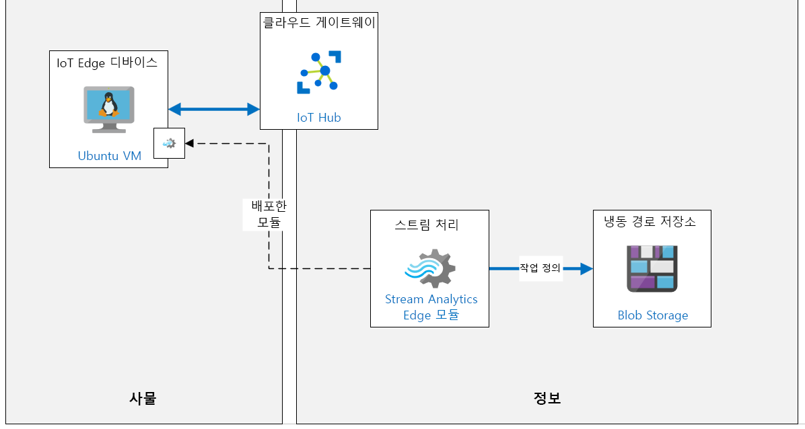

---
lab:
    title: '랩 11: Azure IoT Edge 소개'
    module: '모듈 6: Azure IoT Edge 배포 프로세스'
---

# Azure IoT Edge 소개

## 랩 시나리오

Contoso는 글로벌 시장 내 지역 소비자들을 장려하기 위해 현지 장인들과 협력하여 전 세계의 새로운 지역에서 치즈를 생산합니다. 

각 위치에서는 토종 치즈를 만드는 데 사용되는 혼합 및 가공 기계를 갖춘 다중 생산 라인을 지원합니다. 현재 이러한 시설에는 각 기계에 연결된 IoT 디바이스가 있습니다. 이러한 디바이스는 센서 데이터를 Azure로 스트림하며 모든 데이터는 클라우드에서 처리됩니다. 

데이터가 다량으로 수집되고 일부 컴퓨터에서는 응답 시간이 촉박하므로 Contoso는 IoT Edge 게이트웨이 디바이스를 사용하여 일부 인텔리전스를 Edge로 가져와 즉시 처리하고자 합니다. 일부 데이터는 계속 클라우드로 전송됩니다. 또한 데이터 인텔리전스를 IoT Edge에 도입하여 로컬 네트워크가 불량하더라도 데이터를 처리하고 빠르게 대응할 수 있습니다.

Azure IoT Edge 솔루션의 프로토타입 생성 작업을 맡았습니다. 먼저 온도를 모니터링하는 IoT Edge 디바이스를 설정합니다(치즈 가공 기계 중 하나에 연결된 디바이스 시뮬레이션). 그런 다음 평균 온도를 계산하고 프로세스 제어 값 초과 시 경고 알림을 생성하는데 사용되는 디바이스에 Stream Analytics 모듈을 배포합니다.

다음의 리소스가 만들어집니다.



## 이 랩에서

이 랩에서는 다음 활동을 완료할 예정입니다.

* 랩 필수 구성 요소 확인
* Azure IoT Edge 사용 Linux VM 배포
* Azure CLI를 사용하여 IoT Hub에서 IoT Edge 디바이스 ID 만들기
* IoT Hub에 IoT Edge 디바이스 연결
* Edge 디바이스에 Edge 모듈 추가
* Azure Stream Analytics를 IoT Edge 모듈로 배포

## 랩 지침

### 연습 1: 랩 필수 구성 요소 확인

이 랩은 다음 Azure 리소스를 사용할 수 있다고 가정합니다.

| 리소스 종류 | 리소스 이름 |
| :-- | :-- |
| 리소스 그룹 | AZ-220-RG |
| IoT Hub | AZ-220-HUB-_{YOUR-ID}_ |

이러한 리소스를 사용할 수 없는 경우 연습 2로 이동하기 전에 아래 설명에 따라 **lab11-setup.azcli** 스크립트를 실행해야 합니다. 스크립트 파일은 개발자 환경 구성(랩 3)의 일부로 로컬로 복제한 GitHub 리포지토리에 포함됩니다.

> **참고**:  **lab11-setup.azcli** 스크립트는 Azure Cloud Shell에서 실행하기 가장 쉬운 방식인 **bash** 셸 환경에서 실행하도록 작성됩니다.

1. 브라우저를 사용하여 [Azure Cloud Shell](https://shell.azure.com/)을 열고 이 과정에 사용 중인 Azure 구독으로 로그인합니다.

1. Cloud Shell에 대한 저장소 설정 관련 메시지가 표시되면 기본값을 수락합니다.

1. Azure Shell에서 **Bash**를 사용 중인지 확인합니다.

    Azure Cloud Shell 페이지의 왼쪽 상단에 있는 드롭다운으로 환경을 선택할 수 있습니다. 선택한 드롭다운 값이 **Bash**인지 확인합니다.

1. Azure Shell 도구 모음에서 **파일 업로드/다운로드**(오른쪽에서 네 번째 단추)를 클릭합니다.

1. 드롭다운에서 **업로드**를 클릭합니다.

1. 파일 선택 대화 상자에서 개발 환경을 구성할 때 다운로드한 GitHub 랩 파일의 폴더 위치로 이동합니다.

    이 과정의 랩 3 "개발 환경 설정"에서 ZIP 파일을 다운로드하고 그 내용물을 로컬에서 추출하여 랩 리소스를 포함하는 GitHub 리포지토리를 복제했습니다. 추출된 폴더 구조는 다음 폴더 경로를 포함합니다.

    * Allfiles
      * 랩
          * 11-Azure IoT Edge 소개
            * 설정

    lab11-setup.azcli 스크립트 파일은 랩 11의 설치 폴더에 있습니다.

1.  **lab11-setup.azcli** 파일을 선택한 다음 **열기**를 클릭합니다.

    파일 업로드가 완료되면 알림이 나타납니다.

1. 올바른 파일을 업로드했는지 확인하려면 다음 명령을 입력합니다.

    ```bash
    ls
    ```

    `ls` 명령으로 현재 디렉터리의 내용을 나열합니다. 나열된 lab11-setup.azcli 파일이 보입니다.

1. 설치 스크립트가 포함된 이 랩에 대한 디렉터리를 만든 다음 해당 디렉터리로 이동하려면 다음 Bash 명령을 입력합니다.

    ```bash
    mkdir lab11
    mv lab11-setup.azcli lab11
    cd lab11
    ```

    이러한 명령은 이 랩에 대한 디렉터리를 만들고 **lab11-setup.azcli** 파일을 이 디렉터리로 이동한 다음, 디렉터리를 변경하여 새 디렉터리를 현재 작업 중인 디렉터리로 만듭니다.

1. **lab11-setup.azcli**에 실행 권한이 있는지 확인하려면 다음 명령을 입력합니다.

    ```bash
    chmod +x lab11-setup.azcli
    ```

1. Cloud Shell 도구 모음에서 **lab11-setup.azcli** 파일을 편집하려면 **편집기 열기**(오른쪽에서 두 번째 단추 - **{ }**)를 클릭합니다.

1. **파일** 목록에서 lab4 폴더를 확장하려면 **lab11**을 클릭한 다음 **lab11-setup.azcli**를 클릭합니다.

    이제 편집기에 **lab11-setup.azcli** 파일의 내용이 표시됩니다.

1. 편집기에서 `{YOUR-ID}` 및 `{YOUR-LOCATION}` 변수의 값을 업데이트하세요.

    아래 샘플을 예로 들면, `{YOUR-ID}`를 이 과정의 시작 시 만든 고유 ID(예: **CAH191211**)로 설정하고 리소스 그룹과 일치하는 위치로 `{YOUR-LOCATION}`을 설정해야 합니다.

    ```bash
    #!/bin/bash

    RGName="AZ-220-RG"
    IoTHubName="AZ-220-HUB-{YOUR-ID}"

    Location="{YOUR-LOCATION}"
    ```

    > **참고**:  `{YOUR-LOCATION}` 변수는 모든 리소스를 배포하는 지역의 짧은 이름으로 설정되어야 합니다. 이 명령을 입력하면 사용 가능한 위치 및 짧은 이름(**이름** 열)의 목록을 볼 수 있습니다.
    >
    > ```bash
    > az account list-locations -o Table
    >
    > 표시이름           위도    경도    이름
    > --------------------  ----------  -----------  ------------------
    > 동아시아             22.267      114.188      eastasia
    > 동남 아시아        1.283       103.833      southeastasia
    > 미국 중부            41.5908     -93.6208     centralus
    > 미국 동부               37.3719     -79.8164     eastus
    > 미국 동부 2             36.6681     -78.3889     eastus2
    > ```

1. 파일의 변경 내용을 저장하고 편집기를 닫으려면 편집기 창의 오른쪽 상단에서 ...를 클릭한 다음 **편집기 닫기**를 클릭합니다.

    저장하라는 메시지가 표시된 경우 **저장**을 클릭하면 편집기가 닫힙니다.

    > **참고**:  **CTRL+S**를 사용하여 언제든지 저장할 수 있으며 **CTRL+Q**를 사용하여 편집기를 닫을 수 있습니다.

1. 이 랩에 필요한 리소스를 만들려면 다음 명령을 입력합니다.

    ```bash
    ./lab11-setup.azcli
    ```

    이 작업을 실행하려면 몇 분 정도 걸립니다. 각 단계가 완료되면 JSON 출력이 표시됩니다.

스크립트가 완료되면 랩으로 계속할 준비가 끝납니다.

### 연습 2: Azure IoT Edge 사용 Linux VM 배포

이 연습에서는 Azure Marketplace에서 Azure IoT Edge 런타임 지원 Ubuntu Server VM을 배포합니다.

1. 필요한 경우 Azure 계정 자격 증명을 사용하여 Azure Portal에 로그인합니다.

    둘 이상의 Azure 계정이 있는 경우에는 이 과정에 사용할 구독에 연결된 계정으로 로그인해야 합니다.

1. Azure Portal 메뉴에서 **리소스 만들기**를 클릭합니다.

1. **새** 블레이드의 **마켓플레이스 검색** 상자에 **Azure IoT Edge on**을 입력한 다음 **Ubuntu에서 Azure IoT Edge**를 클릭합니다. 

1. **Ubuntu에서 Azure IoT Edge** 블레이드에서 **만들기**를 클릭합니다.

1. **가상 컴퓨터 만들기** 블레이드의 **구독** 드롭다운에서 이 과정에 사용 중인 Azure 구독을 선택합니다.

1. **리소스 그룹**의 오른쪽에 있는 **새로 만들기**를 클릭합니다.

    VM을 위한 새 리소스 그룹을 만들 예정이며, 이 리소스 그룹은 작업 완료 후 정리에 도움이 됩니다.

1. 새 리소스 그룹 팝업에서 **이름** 아래 **AZ-220-VM-RG**를 입력하고 **확인**을 클릭합니다.

1. **가상 머신 이름** 텍스트 상자에 **AZ-220-VM-EDGE**를 입력합니다.

1. **지역** 드롭다운에서 Azure IoT Hub가 프로비전된 지역을 선택합니다.

1. **가용성 옵션**은 **인프라 중복성 필요 없음**으로 남겨 둡니다.

1. **이미지** 필드는 **Ubuntu Server 16.04 LTS + Azure IoT Edge 런타임** 이미지를 사용하도록 구성되어 있는 것을 알 수 있습니다.

1. **Azure 스폿 인스턴스**를 **아니요**로 설정합니다.

1. **크기**의 오른쪽에서 **크기 변경**을 클릭합니다.

1. **VM 크기 선택** 블레이드의 **VM 크기**에서 **DS1_v2**를 클릭한 다음 **선택**을 클릭합니다.

    DS1_v2가 표시되지 않으면 **모든 필터 지우기** 링크를 사용하여 이 크기가 목록에서 사용 가능하게 해야 할 수도 있습니다.

    > **참고**:  몇몇 VM 크기는 일부 지역에서 사용할 수 없습니다. 이후 단계에서 VM 크기를 선택할 수 없는 경우 다른 지역을 시도해 보세요. 예를 들어 **미국 서부**에 사용 가능한 크기가 없는 경우 **미국 서부 2**를 사용해 보세요.

1. **관리자 계정**에서 **인증 유형**의 오른쪽에 있는 **암호**를 클릭합니다.

1. VM 관리자 계정은 **사용자 이름**, **암호** 및 **암호 확인** 필드에 값을 입력하세요.

    > **중요:** 이러한 값 없이는 VM에 연결할 수 없으니 잊어버리지 마세요.

1. **인바운드 포트 규칙**은 VM에 대한 인바운드 **SSH** 액세스를 사용하도록 구성됩니다.

    이 규칙은 VM을 원격으로 구성 및 관리하는 데 사용됩니다.

1. **검토 + 만들기**를 클릭합니다.

1. **유효성 검사 통과** 메시지가 블레이드 상단에 표시될 때까지 기다린 다음 **만들기**를 클릭합니다.

    > **참고**:  배포가 완료되기까지 최대 5분이 걸릴 수 있습니다. 배포 중에 다음 연습을 할 수 있습니다.

### 연습 3: Azure CLI를 사용하여 IoT Hub에서 IoT Edge 디바이스 ID 만들기

이 연습에서는 Azure CLI를 사용하여 Azure IoT Hub에 새 IoT Edge 디바이스 ID를 만듭니다.

1. 필요한 경우 Azure 계정 자격 증명을 사용하여 Azure Portal에 로그인합니다.

    둘 이상의 Azure 계정이 있는 경우에는 이 과정에 사용할 구독에 연결된 계정으로 로그인해야 합니다.

1. Azure Portal 도구 모음에서 Azure Cloud Shell을 열려면 **Cloud Shell**을 클릭합니다.

    왼쪽 탐색 메뉴가 아니라 Azure Portal 도구 모음의 Cloud Shell 단추에 명령 프롬프트와 유사한 모양의 아이콘이 있습니다.

1. **Bash** 환경 옵션을 사용 중인지 확인합니다.

    Cloud Shell의 좌측 상단 모서리에 있는 환경 드롭다운에서 Bash를 선택해야 합니다.

1. 명령 프롬프트의 IoT Hub에서 IoT Edge 디바이스 ID를 만들려면 다음 명령을 입력합니다.

    ```cmd/sh
    az iot hub device-identity create --hub-name AZ-220-HUB-{YOUR-ID} --device-id myEdgeDevice --edge-enabled
    ```

    `{YOUR-ID}` 자리 표시자를 이 과정을 시작할 때 만든 YOUR-ID 값으로 교체해야 합니다.

    > **참고**: Azure Portal에서 IoT Hub를 사용하여 이 IoT Edge 디바이스를 만들 수도 있습니다. **IoT Hub** -> **IoT Edge** -> **IoT Edge 디바이스 추가**.

1. 명령으로 만든 출력을 리뷰합니다. 

    출력에는 IoT Edge 디바이스에 대해 만든 **디바이스 ID**의 정보가 포함되어 있습니다. 예를 들어 자동 생성된 키를 포함하는 `symmetricKey` 인증이 기본값이며, `iotEdge` 기능은 지정된 `--edge-enabled` 매개 변수가 표시하는 것처럼 `true`로 설정된 것을 확인할 수 있습니다.

    ```json
    {
        "authentication": {
            "symmetricKey": {
                "primaryKey": "jftBfeefPsXgrd87UcotVKJ88kBl5Zjk1oWmMwwxlME=",
                "secondaryKey": "vbegAag/mTJReQjNvuEM9HEe1zpGPnGI2j6DJ7nECxo="
            },
            "type": "sas",
            "x509Thumbprint": {
                "primaryThumbprint": null,
                "secondaryThumbprint": null
            }
        },
        "capabilities": {
            "iotEdge": true
        },
        "cloudToDeviceMessageCount": 0,
        "connectionState": "Disconnected",
        "connectionStateUpdatedTime": "0001-01-01T00:00:00",
        "deviceId": "myEdgeDevice",
        "deviceScope": "ms-azure-iot-edge://myEdgeDevice-637093398936580016",
        "etag": "OTg0MjI1NzE1",
        "generationId": "637093398936580016",
        "lastActivityTime": "0001-01-01T00:00:00",
        "status": "enabled",
        "statusReason": null,
        "statusUpdatedTime": "0001-01-01T00:00:00"
    }
    ```

1. IoT Edge 디바이스의 **연결 문자열**을 표시하려면 다음 명령어를 입력하세요.

    ```cmd/sh
    az iot hub device-identity show-connection-string --device-id myEdgeDevice --hub-name AZ-220-HUB-_{YOUR-ID}_
    ```

    `{YOUR-ID}` 자리 표시자를 이 과정을 시작할 때 만든 YOUR-ID 값으로 교체해야 합니다.

1. 명령의 JSON 출력에서 `connectionString`의 값을 복사한 다음 나중에 참조할 수 있도록 저장해두세요.

    이 연결 문자열은 IoT Edge 디바이스를 IoT Hub에 연결하도록 구성하는 데 사용합니다.

    ```json
        {
          "connectionString": "HostName={IoTHubName}.azure-devices.net;DeviceId=myEdgeDevice;SharedAccessKey=jftBfeefPsXgrd87UcotVKJ88kBl5Zjk1oWmMwwxlME="
        }
    ```

    > **참고**:  IoT Edge 디바이스 연결 문자열은 **IoT Hub** -> **IoT Edge** -> **Edge 디바이스** -> **연결 문자열(기본 키)**로 이동하여 Azure Portal에서 액세스할 수도 있습니다.

### 연습 4: IoT Hub에 IoT Edge 디바이스 연결

이 연습에서는 IoT Edge 디바이스를 Azure IoT Hub에 연결합니다.

1. IoT Edge 가상 머신이 성공적으로 배포되었는지 확인합니다.

    Azure Portal에서 알림 창을 확인할 수 있습니다.

1. Azure Portal 메뉴에서 **리소스 그룹**을 클릭합니다.

1. **리소스 그룹** 블레이드에서 AZ-220-VM-RG 리소스 그룹을 나타내는 항목을 찾습니다.

1. 블레이드의 오른쪽, **AZ-220-VM-RG**의 건너편에 있는 **상황에 맞는 메뉴를 열려면 클릭**을 클릭하세요 (말줄임표 - ...)

1. 상황에 맞는 메뉴에서 **대시보드에 고정**을 클릭한 후 다시 대시보드로 돌아가세요.

    만약 리소스에 쉽게 액세스 하는데 도움이 된다면 대시보드를 **편집**하여 타일을 다시 정렬해도 됩니다.
 
1. **AZ-220-VM-RG** 리소스 그룹 타일에서 IoT Edge 가상 머신을 열려면 **AZ-220-VM-EDGE**를 클릭하세요.

1. **개요** 창 상단에서 **연결**을 클릭한 다음 **SSH**를 클릭합니다.

1. **연결** 창에서 **4. 아래의 예제 명령을 실행하여 VM에 연결**의 예제 명령을 복사합니다.

    이 명령은 VM 및 관리자 사용자 이름의 IP 주소가 포함된 가상 머신에 연결하는 데 사용할 수 있는 샘플 SSH 명령입니다. 명령의 서식은 `ssh username@52.170.205.79`와 유사하게 지정되어야 합니다.

    > **참고**: 샘플 명령에 `-i <private key path>`가 포함된 경우 텍스트 편집기를 사용하여 명령의 해당 부분을 삭제한 다음 업데이트된 명령을 클립보드에 복사합니다.

1. Cloud Shell이 아직 열려 있지 않으면 **Cloud Shell**을 클릭합니다.

1. Cloud Shell 명령 프롬프트에서 텍스트 편집기에 업데이트한 `ssh` 명령을 붙여넣은 다음 **Enter 키**를 누릅니다.

1. **계속 연결하시겠습니까?**라는 메시지가 표시되면 `예`를 입력한 다음 **Enter 키**를 누릅니다.

    VM에 대한 연결을 보호하는 데 사용되는 인증서는 자체 서명되므로, 이 메시지는 보안 확인입니다. 이 메시지에 대한 답변은 나중에 연결할 수 있도록 기억되며 첫 번째 연결에서만 메시지가 표시됩니다.

1. 암호를 입력하라는 메시지가 표시되면 VM이 프로비전될 때 만든 관리자 암호를 입력합니다.

1. 연결이 끝나면 다음과 유사한 Linux VM 이름을 표시하도록 터미널 명령 프롬프트가 변경됩니다.

    ```cmd/sh
    username@AZ-220-VM-EDGE:~$
    ```

    이는 어떤 VM에 연결되었는지 알려줍니다.

    > **중요:** 연결하면 아마도 뛰어난 Edge VM OS 업데이트가 있다는 안내를 받을 것입니다.  랩 목적상 이것을 무시하고 있지만 생산 중에는 항상 Edge 디바이스를 최신 상태로 유지해야 합니다.

1. Azure IoT Edge 런타임이 VM에 설치되어 있는지 확인하려면 다음 명령을 실행합니다.

    ```cmd/sh
    iotedge version
    ```

    이 명령은 현재 가상 머신에 설치된 Azure IoT Edge 런타임 버전을 출력합니다.

1. Edge 디바이스를 Azure IoT Hub의 디바이스 연결 문자열로 구성하려면 다음 명령을 입력합니다.

    ```cmd/sh
    sudo /etc/iotedge/configedge.sh "{iot-edge-device-connection-string}"
    ```

    위의 `{iot-edge-device-connection-string}` 자리 표시자를 IoT Edge 디바이스를 만들 때 기록한 연결 문자열 값으로 바꿔야 합니다. 그리고 명령줄에 따옴표를 포함해야 합니다.

    `/etc/iotedge/configedge.sh` 스크립트는 Azure IoT Hub에 연결하는 데 필요한 연결 문자열로 Edge 디바이스를 구성하는 데 사용됩니다. 이 스크립트는 Azure IoT Edge 런타임의 일부로 설치됩니다.

1. 연결 문자열이 설정되었는지 확인합니다.

    이 명령이 완료되면 입력된 연결 문자열을 사용하여 Azure IoT Hub에 연결하도록 IoT Edge 디바이스가 구성됩니다. 명령은 설정된 연결 문자열을 포함하는 `...로 연결 문자열을 설정` 메시지를 출력합니다.

### 연습 5: Edge 디바이스에 Edge 모듈 추가

이 연습에서는 시뮬레이션된 온도 센서를 사용자 지정 IoT Edge 모듈로 추가하고 이를 배포하여 IoT Edge 디바이스에서 실행합니다.

1. 필요한 경우 Azure 계정 자격 증명을 사용하여 Azure Portal에 로그인합니다.

    둘 이상의 Azure 계정이 있는 경우에는 이 과정에 사용할 구독에 연결된 계정으로 로그인해야 합니다.

1. 리소스 그룹 타일에서 IoT Hub를 열려면 **AZ-220-HUB-_{YOUR-ID}_**를 클릭합니다.

1. **IoT Hub** 블레이드 왼쪽의 **자동 장치 관리**에서 **IoT Edge**를 클릭합니다.

1. IoT Edge 디바이스 목록에서 **myEdgeDevice**를 클릭합니다.

1. **myEdgeDevice** 블레이드의 **모듈** 탭에 현재 디바이스용으로 구성된 모듈 목록이 표시되는 것을 알 수 있습니다.

    현재 IoT Edge 디바이스는 IoT Edge 런타임의 일부인 Edge Agent(`$edgeAgent`) 및 Edge Hub(`$edgeHub`) 모듈로만 구성됩니다.

1. **myEdgeDevice** 블레이드 상단에서 **모듈 설정**을 클릭합니다.

1. **디바이스에 모듈 설정: myEdgeDevice** 블레이드에서 **IoT Edge 모듈** 섹션을 찾습니다.

1. **IoT Edge 모듈**에서 **추가**를 클릭한 다음 **IoT Edge 모듈**을 클릭합니다.

1. **IoT Edge 모듈 추가** 창의 **IoT Edge 모듈 이름**에 **tempsensor**를 입력합니다.

    사용자 정의 모듈의 이름을 "tempsensor"로 지정할 것입니다.

1. **이미지 URI**에 **asaedgedockerhubtest/asa-edge-test-module:simulated-temperature-sensor**를 입력합니다.

    > **참고**: 이 이미지는 이 테스트 시나리오를 지원하기 위해 제품 그룹에서 제공하는 Docker Hub에 게시된 이미지입니다.

1. 선택한 탭을 변경하려면 **모듈 쌍 설정**을 클릭합니다.

1. 모듈 쌍에 원하는 속성을 지정하려면 다음 JSON을 입력하세요.

    ```json
    {
        "EnableProtobufSerializer": false,
        "EventGeneratingSettings": {
            "IntervalMilliSec": 500,
            "PercentageChange": 2,
            "SpikeFactor": 2,
            "StartValue": 20,
            "SpikeFrequency": 20
        }
    }
    ```

    이 JSON은 모듈 쌍을 원하는 속성으로 설정하여 Edge 모듈을 구성합니다.

1. 블레이드 하단의 **추가**를 클릭하세요.

1. **디바이스에 모듈 설정: myEdgeDevice** 블레이드의 하단의 **다음**을 클릭합니다.** 라우팅 >**.

1. 기본 라우팅이 이미 구성되어 있는 것을 알 수 있습니다.

    * 이름: **라우팅**
    * 값: `FROM /messages/* INTO $upstream`

    이 라우팅은 IoT Edge 디바이스의 모든 모듈에서 IoT Hub로 모든 메시지를 전송합니다.

1. **검토 + 만들기**를 클릭합니다.

1. 잠시 시간을 내어 **배포**에서 표시되는 배포 매니페스트를 검토합니다. 

    보시다시피 IoT Edge 디바이스의 배포 매니페스트는 JSON으로 서식이 지정되어 있어 읽기가 매우 쉽습니다.

    `properties.desired` 섹션에는 IoT Edge 디바이스에 배포될 IoT Edge 모듈을 선언하는 `modules` 섹션이 있습니다. 여기에는 Container Registry 자격 증명을 포함한 모든 모듈의 이미지 URI가 포함됩니다.

    ```json
    {
        "modulesContent": {
            "$edgeAgent": {
                "properties.desired": {
                    "modules": {
                        "tempsensor": {
                            "settings": {
                                "image": "asaedgedockerhubtest/asa-edge-test-module:simulated-temperature-sensor",
                                "createOptions": ""
                            },
                            "type": "docker",
                            "version": "1.0",
                            "status": "running",
                            "restartPolicy": "always"
                        },
    ```

    JSON의 아래쪽에는 Edge 허브의 원하는 속성이 포함된 **$edgeHub** 섹션이 있습니다. 이 섹션에는 모듈 간 및 IoT Hub로 이벤트를 라우팅하기 위한 라우팅 구성도 포함되어 있습니다.

    ```json
        "$edgeHub": {
            "properties.desired": {
                "routes": {
                  "route": "FROM /messages/* INTO $upstream"
                },
                "schemaVersion": "1.0",
                "storeAndForwardConfiguration": {
                    "timeToLiveSecs": 7200
                }
            }
        },
    ```

    JSON의 하단은 **tempsensor** 모듈 섹션으로, `properties.desired` 섹션에 원하는 Edge 모듈 구성의 속성이 포함되어 있습니다.

    ```json
                },
                "tempsensor": {
                    "properties.desired": {
                        "EnableProtobufSerializer": false,
                        "EventGeneratingSettings": {
                            "IntervalMilliSec": 500,
                            "PercentageChange": 2,
                            "SpikeFactor": 2,
                            "StartValue": 20,
                            "SpikeFrequency": 20
                        }
                    }
                }
            }
        }
    ```

1. 블레이드 하단에서 디바이스 모듈 설정을 완료하려면 **만들기**를 클릭합니다.

1. **myEdgeDevice** 블레이드의 **모듈**에서 **tempsensor** 센서가 나열되어 있음을 알 수 있습니다.

    > **참고**: 처음으로 나열된 모듈을 확인하려면 **새로 고침**을 클릭해야 할 수도 있습니다.

    **tempsensor**의 런타임 상태가 보고되지 않는 것을 알 수 있습니다.

1. 블레이드 상단의 **새로 고침**을 클릭합니다.

1. **tempsensor** 모듈의 **런타임 상태**가 이제 **실행 중**으로 설정된 것을 알 수 있습니다.

    값이 아직 보고되지 않으면 잠시 기다렸다가 블레이드를 다시 새로 고칩니다.
 
1. Cloud Shell 세션을 엽니다(아직 열려 있지 않은 경우).

    `AZ-220-VM-EDGE` 가상 머신에 더 이상 연결되어 있지 않은 경우 이전과 같이 **SSH**를 사용하여 연결합니다.

1. Cloud Shell 명령 프롬프트에서 현재 IoT Edge 디바이스에서 실행 중인 모듈을 나열하려면 다음 명령을 입력합니다.

    ```cmd/sh
    iotedge list
    ```

1. 명령의 출력은 다음과 유사합니다. 

    ```cmd/sh
    demouser@AZ-220-VM-EDGE:~$ iotedge list
    NAME             STATUS           DESCRIPTION      CONFIG
    edgeHub          running          Up a minute      mcr.microsoft.com/azureiotedge-hub:1.0
    edgeAgent        running          Up 26 minutes    mcr.microsoft.com/azureiotedge-agent:1.0
    tempsensor       running          Up 34 seconds    asaedgedockerhubtest/asa-edge-test-module:simulated-temperature-sensor
    ```

    `tempsensor`가 실행 중인 모듈 중 하나로 나열된 것을 알 수 있습니다.

1. 모듈 로그를 보려면 다음 명령을 입력하세요.

    ```cmd/sh
    iotedge logs tempsensor
    ```

    해당 명령 출력 시 다음과 비슷합니다.

    ```cmd/sh
    demouser@AZ-220-VM-EDGE:~$ iotedge logs tempsensor
    11/14/2019 18:05:02 - Send Json Event : {"machine":{"temperature":41.199999999999925,"pressure":1.0182182583425192},"ambient":{"temperature":21.460937846433808,"humidity":25},"timeCreated":"2019-11-14T18:05:02.8765526Z"}
    11/14/2019 18:05:03 - Send Json Event : {"machine":{"temperature":41.599999999999923,"pressure":1.0185790159334602},"ambient":{"temperature":20.51992724976499,"humidity":26},"timeCreated":"2019-11-14T18:05:03.3789786Z"}
    11/14/2019 18:05:03 - Send Json Event : {"machine":{"temperature":41.999999999999922,"pressure":1.0189397735244012},"ambient":{"temperature":20.715225311096397,"humidity":26},"timeCreated":"2019-11-14T18:05:03.8811372Z"}
    ```

    `iotedge logs` 명령을 사용하여 모든 Edge 모듈의 모듈 로그를 볼 수 있습니다.

1. 시뮬레이션된 온도 센서 모듈은 500개의 메시지를 보낸 후 중지됩니다. 다음 명령을 실행하여 재시작할 수 있습니다.

    ```cmd/sh
    iotedge restart tempsensor
    ```

    지금 모듈을 재시작할 필요는 없지만 만일 나중에 원격 분석 전송이 중지된다면 Cloud Shell로 돌아가고 Edge VM으로 SSH한 뒤 이 명령을 실행하여 재설정합니다. 재설정되면 모듈이 원격 분석을 다시 전송하기 시작합니다.

### 연습 6: Azure Stream Analytics를 IoT Edge 모듈로 배포

이제 tempSensor 모듈이 IoT Edge 디바이스에서 배포되어 실행되고 있으므로 IoT Edge 디바이스에서 메시지를 처리할 수 있는 Stream Analytics 모듈을 추가하여 IoT Hub로 전송할 수 있습니다.

#### 작업 1: Azure 스토리지 계정 만들기

1. 필요한 경우 Azure 계정 자격 증명을 사용하여 Azure Portal에 로그인합니다.

    둘 이상의 Azure 계정이 있는 경우에는 이 과정에 사용할 구독에 연결된 계정으로 로그인해야 합니다.

1. Azure Portal 메뉴에서 **리소스 만들기**를 클릭합니다.

1. **새** 블레이드의 검색 텍스트 상자에 **저장소**를 입력하고 **Enter 키**를 누릅니다.

1. **Marketplace**블레이드에서 **스토리지 계정 - BLOB, 파일, 테이블, 큐**를 클릭합니다.

1. **스토리지 계정 - BLOB, 파일, 테이블, 큐** 블레이드에서 **만들기**를 클릭합니다.

1. **스토리지 계정 만들기** 블레이드의 구독 드롭다운에 이 과정에 사용 중인 구독이 표시되는지 확인합니다.

1. **리소스 그룹** 드롭다운에서 **AZ-220-RG**를 클릭합니다.

1. **스토리지 계정 이름** 텍스트 상자에 **az220store{YOUR-ID}**를 입력합니다.

    > **참고**: 이 필드의 경우 {YOUR-ID}를 소문자로 입력해야 하며 하이픈 또는 밑줄은 허용되지 않습니다.

1. **위치** 필드를 Azure IoT Hub에 사용되는 것과 동일한 Azure 지역으로 설정합니다.

1. **복제** 필드를 **LRS(로컬 중복 저장소)**로 설정합니다.

1. 다른 모든 설정은 그대로 둡니다.

1. 블레이드 하단의 **검토 + 생성**을 클릭하세요.

1. **유효성 검사 통과** 메시지가 표시될 때까지 기다린 다음 **만들기**를 클릭합니다.

    배포를 완료하는 데 몇 분 정도 걸릴 수 있으며, 생성되는 동안 계속 Stream Analytics 리소스를 만들 수 있습니다.

#### 작업 2: Azure Stream Analytics 만들기

1. Azure Portal 메뉴에서 **리소스 만들기**를 클릭합니다.

1. **신규** 블레이드의 **Azure Marketplace**에서 **사물 인터넷**을 클릭한 다음 **Stream Analytics 작업**을 클릭합니다.

1. **새 Stream Analytics 작업** 블레이드의 **작업 이름** 필드에 **AZ-220-ASA-_{YOUR-ID}_**를 입력합니다.

1. **리소스 그룹** 드롭다운에서 **AZ-220-RG**를 클릭합니다.

1. **위치** 드롭다운에서 스토리지 계정 및 Azure IoT Hub에 사용되는 것과 동일한 Azure 지역을 선택합니다.

1. **호스팅 환경** 필드를 **Edge**로 설정합니다.

    이렇게 하면 Stream Analytics 작업이 온-프레미스 IoT 게이트웨이 Edge 디바이스에 배포됩니다.

1. 블레이드 하단의 **만들기**를 클릭합니다.

    이 리소스를 배포하려면 몇 분 정도 걸립니다.

#### 작업 3: Azure Stream Analytics 작업 구성

1. **배포가 완료되었습니다**라는 메시지가 표시되면 **리소스로 이동**을 클릭합니다.

    이제 새 Stream Analytics 작업의 개요 창에 있어야 합니다.
 
1. 왼쪽 탐색 메뉴의 **작업 토폴로지**에서 **입력**을 클릭합니다.

1. **입력** 창에서 **스트림 입력 추가**를 클릭한 다음 **Edge 허브**를 클릭합니다.

1. **Edge 허브** 창에서 **입력 별칭** 필드에 **온도**를 입력합니다.

1. **이벤트 serialization 형식** 드롭다운에서 **JSON**이 선택되어 있는지 확인합니다. 

    Stream Analytics가 메시지 형식을 이해해야 합니다. JSON은 표준 형식입니다.

1. **인코딩** 드롭다운에서 **UTF-8**이 선택되어 있는지 확인합니다.

    > **참고**:  UTF-8은 이 문서가 작성되는 시점에서 유일하게 지원되는 JSON 인코딩입니다.

1. **이벤트 압축 형식** 드롭다운에서 **없음**을 선택했는지 확인합니다.

    이 랩에서는 압축을 사용하지 않습니다. GZip 및 Deflate 형식도 서비스에서 지원됩니다.

1. 창 하단에서 **저장**을 클릭합니다.

1. 왼쪽 탐색 메뉴의 **작업 토폴로지**에서 **출력**을 클릭합니다.

1. **출력** 창에서 **추가**를 클릭한 다음 **Edge 허브**를 클릭합니다.

1. **Edge 허브** 창의 **출력 별칭** 필드에 **경고**를 입력합니다.

1. **이벤트 serialization 형식** 드롭다운에서 **JSON**이 선택되어 있는지 확인합니다.

    Stream Analytics가 메시지 형식을 이해해야 합니다. JSON이 표준 형식이지만 CSV 또한 서비스에서 지원됩니다.

1. **형식** 드롭다운에서 **줄로 구분됨**이 선택되어 있는지 확인합니다.

1. **인코딩** 드롭다운에서 **UTF-8**이 선택되어 있는지 확인합니다.

    > **참고**:  UTF-8은 이 문서가 작성되는 시점에서 유일하게 지원되는 JSON 인코딩입니다.

1. 창 하단에서 **저장**을 클릭합니다.

1. 왼쪽 탐색 메뉴의 **작업 토폴로지**에서 **쿼리**를 클릭합니다.

1. **쿼리** 창에서 기본 쿼리를 다음으로 바꿉니다.

    ```sql
    SELECT  
        'reset' AS command
    INTO
        alert
    FROM
        temperature TIMESTAMP BY timeCreated
    GROUP BY TumblingWindow(second,15)
    HAVING Avg(machine.temperature) > 25
    ```

    이 쿼리는 `온도` 입력으로 들어오는 이벤트를 살펴보고 15초의 Tumbling Windows별로 그룹화한 다음 해당 그룹내의 평균 온도 값이 25보다 큰지 확인합니다. 평균이 25보다 크면 이벤트와 함께 `경고` 출력에 `재설정` 값으로 설정된 `명령` 속성을 보냅니다.

    `TumblingWindow` 함수에 대한 자세한 내용은 다음 링크를 참조하세요. [https://docs.microsoft.com/ko-kr/stream-analytics-query/tumbling-window-azure-stream-analytics](https://docs.microsoft.com/ko-kr/stream-analytics-query/tumbling-window-azure-stream-analytics)

1. 쿼리 편집기 상단의 **쿼리 저장**을 클릭합니다.

#### 작업 4: 스토리지 계정 설정 구성

IoT Edge 디바이스에 배포할 Stream Analytics 작업을 준비하려면 Azure Blob Storage 컨테이너와 연결해야 합니다. 작업이 배포되면 작업 정의가 저장소 컨테이너로 내보내 집니다.

1. **Stream Analytics 작업** 블레이드에서 **구성 **의 왼쪽 탐색 메뉴에서 **스토리지 계정 설정**을 클릭합니다.

1. **스토리지 계정 설정** 창에서 **저장소 계정 추가**를 클릭합니다.

1. **스토리지 계정 설정**에서 **구독에서 저장소 계정 선택**이 선택되어 있는지 확인하세요.

1. **스토리지 계정** 드롭다운에서 **az220store{your-id}** 스토리지 계정이 선택되어 있는지 확인합니다.

1. **컨테이너**에서 **새로 만들기**를 클릭한 다음 컨테이너의 이름을 **jobdefinition**으로 입력합니다.

1. 창 상단의 **저장**을 클릭합니다.

    변경 내용을 저장한다는 메시지가 표시되면 **예**를 클릭합니다.

#### 작업 5: Stream Analytics 작업 배포

1. Azure Portal에서 **AZ-220-HUB-_{YOUR-ID}_** IoT Hub 리소스로 이동합니다.

1. 왼쪽 탐색 메뉴의 **자동 장치 관리**에서 **IoT Edge**를 클릭합니다.

1. **디바이스 ID**에서 **myEdgeDevice**를 클릭합니다.

1. **myEdgeDevice** 창 상단에서 **모듈 설정**을 클릭합니다.

1. **디바이스에서 모듈 설정: myEdgeDevice** 창에서 **IoT Edge 모듈** 섹션을 찾습니다.

1. **IoT Edge 모듈**에서 **추가**를 클릭한 다음 **Azure Stream Analytics 모듈**을 클릭합니다.

1. **Edge 배포** 창의 **구독**에서 이 과정에 사용 중인 구독이 선택되어 있는지 확인합니다.

1. **Edge 작업** 드롭다운에서 **AZ-220-ASA-_{YOUR-ID}_** Steam Analytics 작업이 선택되었는지 확인합니다.

    > **참고**:  작업은 이미 선택되어 있지만 **저장** 단추는 비활성화되어 있습니다. **Edge 작업** 드롭다운을 다시 열고 **AZ-220-ASA-_{YOUR-ID}_** 작업을 다시 선택합니다. 그러면 **저장** 단추가 활성화됩니다.

1. 창 하단에서 **저장**을 클릭합니다.

    배포하는데 몇 분 정도 걸릴 수 있습니다.

1. Edge 패키지가 성공적으로 게시되면 새 ASA 모듈이 **IoT Edge 모듈** 섹션 아래에 나열됩니다.

1. **IoT Edge 모듈**에서 **AZ-220-ASA-_{YOUR-ID}_**를 클릭합니다. 

    방금 Edge 디바이스에 추가 된 Steam Analytics 모듈입니다.

1. **IoT Edge 모듈 업데이트** 창에서 **이미지 URI**는 표준 Azure Stream Analytics 이미지를 가리킨다는 점을 알 수 있습니다.

    ```text
    mcr.microsoft.com/azure-stream-analytics/azureiotedge:1.0.6
    ```

    IoT Edge 디바이스에 배포되는 모든 ASA 작업에 사용되는 것과 동일한 이미지입니다.

    > **참고**:  구성된 **이미지 URI** 끝에 있는 버전 번호는 Stream Analytics 모듈을 만들었을 때의 최신 버전을 반영합니다. 이 단원을 작성할 당시 버전은 `1.0.6`이었습니다.

1. 모든 값을 기본값으로 두고 **IoT Edge 사용자 지정 모듈** 창을 닫습니다.

1. **디바이스 모듈 설정: myEdgeDevice** 창에서 **다음**을 클릭합니다.** 라우팅 >**.

    기존 라우팅이 표시되는 것을 알 수 있습니다.

1. 기본 라우팅을 정의된 다음 세 라우팅으로 바꾸세요.

    * Route 1
        * NAME: **telemetryToCloud**
        * VALUE: `FROM /messages/modules/tempsensor/* INTO $upstream`
    * Route 2
        * 이름: **alertsToReset**
        * VALUE: `FROM /messages/modules/AZ-220-ASA-{YOUR-ID}/* INTO BrokeredEndpoint("/modules/tempsensor/inputs/control")`
    * Route 3
        * 이름: **telemetryToAsa**
        * VALUE: `FROM /messages/modules/tempsensor/* INTO BrokeredEndpoint("/modules/AZ-220-ASA-{YOUR-ID}/inputs/temperature")`

    > **참고**: `AZ-220-ASA-{YOUR-ID}` 자리 표시자를 Azure Stream Analytics 작업 모듈의 이름으로 바꿔야 합니다. **이전**을 클릭하여 모듈 목록과 이름을 본 다음 **다음**을 클릭하여 이 단계로 돌아올 수 있습니다.

    정의되는 경로는 다음과 같습니다.

    * **telemetryToCloud** 경로는 `tempsensor` 모듈 출력에서 Azure IoT Hub로 모든 메시지를 보냅니다.
    * **alertsToReset** 경로는 Stream Analytics 모듈 출력에서 **tempsensor** 모듈의 입력으로 모든 경고 메시지를 보냅니다.
    * **telemetryToAsa** 경로는 `tempsensor` 모듈 출력에서 Stream Analytics 모듈 입력으로 모든 메시지를 보냅니다.

1. **디바이스 모듈 설정: myEdgeDevice** 블레이드 하단에서 **검토 + 만들기** 클릭.

1. **검토 + 만들기** 탭에서 **배포 매니페스트** JSON이 이제 Stream Analytics 모듈 및 방금 구성된 라우팅 정의로 업데이트된 것을 알 수 있습니다.

1. `tempsensor` 시뮬레이션된 온도 센서 모듈에 대한 JSON 구성을 확인합니다.

    ```json
    "tempsensor": {
        "settings": {
            "image": "asaedgedockerhubtest/asa-edge-test-module:simulated-temperature-sensor",
            "createOptions": ""
        },
        "type": "docker",
        "version": "1.0",
        "status": "running",
        "restartPolicy": "always"
    },
    ```

1. 이전에 구성된 라우팅의 JSON 구성과 JSON 배포 정의의 구성을 확인하세요.

    ```json
    "$edgeHub": {
        "properties.desired": {
            "routes": {
                "telemetryToCloud": "FROM /messages/modules/tempsensor/* INTO $upstream",
                "alertsToReset": "FROM /messages/modules/AZ-220-ASA-CP122619/* INTO BrokeredEndpoint(\\\"/modules/tempsensor/inputs/control\\\")",
                "telemetryToAsa": "FROM /messages/modules/tempsensor/* INTO BrokeredEndpoint(\\\"/modules/AZ-220-ASA-CP122619/inputs/temperature\\\")"
            },
            "schemaVersion": "1.0",
            "storeAndForwardConfiguration": {
                "timeToLiveSecs": 7200
            }
        }
    },
    ```

1. 블레이드 하단의 **만들기**를 클릭합니다.

#### 작업 6: 데이터 보기

1. **SSH**를 통해 **IoT Edge 디바이스**로 연결했던 **Cloud Shell** 세션으로 돌아갑니다.  

    닫히거나 시간이 만료된 경우 다시 연결합니다. `SSH` 명령을 실행하고 이전과 같이 로그인합니다.

1. 명령 프롬프트에서 디바이스에 배포된 모듈 목록을 보려면 다음 명령을 입력합니다.

    ```cmd/sh
    iotedge list
    ```

    새로운 Stream Analytics 모듈을 IoT Edge 디바이스에 배포하는 데 1분 정도 걸릴 수 있습니다. 배포가 된 이후에는, 이 명령을 통해 출력된 목록에 표시됩니다.

    ```cmd/sh
    demouser@AZ-220-VM-EDGE:~$ iotedge list
    NAME               STATUS           DESCRIPTION      CONFIG
    AZ-220-ASA-CP1119  running          Up a minute      mcr.microsoft.com/azure-stream-analytics/azureiotedge:1.0.5
    edgeAgent          running          Up 6 hours       mcr.microsoft.com/azureiotedge-agent:1.0
    edgeHub            running          Up 4 hours       mcr.microsoft.com/azureiotedge-hub:1.0
    tempsensor         running          Up 4 hours       asaedgedockerhubtest/asa-edge-test-module:simulated-temperature-sensor
    ```

    > **참고**:  Stream Analytics 모듈이 목록에 나타나지 않으면 1~2분 정도 기다린 후 다시 시도하세요. IoT Edge 디바이스에서 모듈 배포를 업데이트하는 데 1분 정도 걸릴 수 있습니다.

1. 명령 프롬프트에서 `tempsensor` 모듈로 인해 Edge 디바이스에서 전송되는 원격 분석을 보려면 다음 명령을 입력하세요.

    ```cmd/sh
    iotedge logs tempsensor
    ```

1. 잠시 시간을 내어 출력을 관찰하세요.

    **tempsensor**에서 전송되는 온도 원격 분석을 보면서 `machine.temperature`가 평균 `25`가 넘는 온도에 도달하면 Stream Analytics 작업에서 **재설정** 명령이 전송되는 것을 확인하세요. 이 작업은 Stream Analytics 작업 쿼리에서 구성된 작업입니다.

    이 이벤트의 출력은 다음과 유사합니다.

    ```cmd/sh
    11/14/2019 22:26:44 - Send Json Event : {"machine":{"temperature":231.599999999999959,"pressure":1.0095600761599359},"ambient":{"temperature":21.430643635304012,"humidity":24},"timeCreated":"2019-11-14T22:26:44.7904425Z"}
    11/14/2019 22:26:45 - Send Json Event : {"machine":{"temperature":531.999999999999957,"pressure":1.0099208337508767},"ambient":{"temperature":20.569532965342297,"humidity":25},"timeCreated":"2019-11-14T22:26:45.2901801Z"}
    수신된 메시지
    수신된 메시지 본문: [{"command":"reset"}]
    수신된 메시지 메타데이터: {"MessageId":null,"To":null,"ExpiryTimeUtc":"0001-01-01T00:00:00","CorrelationId":null,"SequenceNumber":0,"LockToken":"e0e778b5-60ff-4e5d-93a4-ba5295b995941","EnqueuedTimeUtc":"0001-01-01T00:00:00","DeliveryCount":0,"UserId":null,"MessageSchema":null,"CreationTimeUtc":"0001-01-01T00:00:00","ContentType":"application/json","InputName":"control","ConnectionDeviceId":"myEdgeDevice","ConnectionModuleId":"AZ-220-ASA-CP1119","ContentEncoding":"utf-8","Properties":{},"BodyStream":{"CanRead":true,"CanSeek":false,"CanWrite":false,"CanTimeout":false}}
    온도 센서를 재설정합니다.
    11/14/2019 22:26:45 - Send Json Event : {"machine":{"temperature":320.4,"pressure":0.99945886361358849},"ambient":{"temperature":20.940019742324957,"humidity":26},"timeCreated":"2019-11-14T22:26:45.7931201Z"}
    ```

이 랩을 완료한 후에도 리소스를 계속 유지하세요. 다음 랩에서 리소스가 필요합니다.
