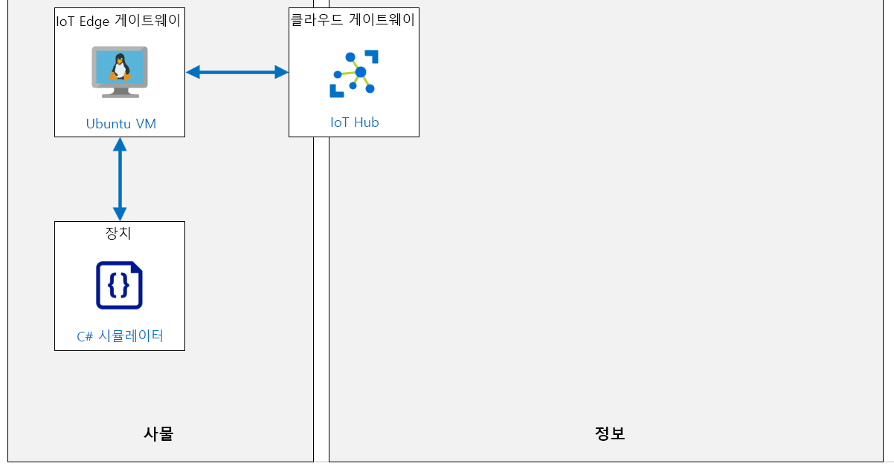

---
lab:
    title: '랩 12: IoT Edge 게이트웨이 설정'
    module: '모듈 6: Azure IoT Edge 배포 프로세스'
---

# IoT Edge 게이트웨이 설정

## 랩 시나리오

이 랩에서는 이론적이며 IoT Edge 디바이스를 게이트웨이로 사용할 수 있는 방법을 알려줍니다.

IoT Edge 디바이스를 게이트웨이로 사용하기 위한 세 가지 패턴은 투명, 프로토콜 번역 및 ID 번역입니다.

**투명** – 이론적으로 IoT Hub에 연결할 수 있는 디바이스는 게이트웨이 디바이스에 대신 연결할 수 있습니다. 다운스트림 디바이스에는 자체 IoT Hub ID가 있으며 MQTT, AMQP 또는 HTTP 프로토콜을 사용하고 있습니다. 게이트웨이는 단순히 디바이스와 IoT Hub 간 통신을 전달합니다. 디바이스는 게이트웨이를 통해 클라우드와 통신하고 있다는 것을 인식하지 못하며, IoT Hub의 디바이스와 상호 작용하는 사용자는 중간 게이트웨이 디바이스를 인식하지 못합니다. 따라서, 게이트웨이는 투명합니다. IoT Edge 디바이스를 투명 게이트웨이로 사용하는 방법에 대한 자세한 내용은 투명 게이트웨이 만들기를 참조하세요.

**프로토콜 번역** – 불투명 게이트웨이 패턴이라고도 하며 MQTT, AMQP 또는 HTTP를 지원하지 않는 디바이스는 이를 대신하여 게이트웨이 디바이스를 통해 데이터를 IoT Hub로 전송할 수 있습니다. 게이트웨이는 다운스트림 디바이스에서 사용하는 프로토콜을 이해하며, IoT Hub에 ID가 있는 유일한 디바이스입니다. 모든 정보는 하나의 디바이스인 게이트웨이에서 오는 것처럼 보입니다. 클라우드 애플리케이션이 디바이스별로 데이터를 분석하려는 경우 다운스트림 디바이스는 메시지에 추가 식별 정보를 포함해야 합니다. 또한, 쌍 및 메서드와 같은 IoT Hub 기본 형식은 다운스트림 디바이스가 아닌 게이트웨이 디바이스에서만 사용할 수 있습니다.

**ID 번역** - IoT Hub에 연결할 수 없는 디바이스는 게이트웨이 디바이스에 대신 연결할 수 있습니다. 게이트웨이는 다운스트림 디바이스는를 대신하여 IoT Hub ID 및 프로토콜 번역을 제공합니다. 게이트웨이는 다운스트림 디바이스에서 사용하는 프로토콜을 이해하고, ID를 제공하고, IoT Hub 기본 형식을 번역할 수 있을 만큼 똑똑합니다. 다운스트림 디바이스는 IoT Hub에 쌍과 메서드가 있는 최상위 디바이스로 표시됩니다. 사용자는 IoT Hub의 디바이스와 상호 작용할 수 있으며 중간 게이트웨이 디바이스를 인식하지 못합니다.

다음의 리소스가 만들어집니다.



## 이 랩에서

이 랩에서는 다음 활동을 완료할 예정입니다.

* 랩 필수 구성 요소 확인
* Azure IoT Edge 사용 Linux VM을 IoT Edge 디바이스로 배포
* IoT Edge 디바이스 CA 인증서 생성 및 구성
* Azure Portal을 사용하여 IoT Hub에서 IoT Edge 디바이스 ID 만들기
* IoT Edge 게이트웨이 호스트 이름 설정
* IoT Edge 게이트웨이 디바이스를 IoT Hub에 연결
* 통신용 IoT Edge 게이트웨이 디바이스 포트 열기
* IoT Hub에서 다운스트림 디바이스 ID 만들기
* 다운스트림 디바이스를 IoT Edge 게이트웨이에 연결
* 이벤트 흐름 확인

## 랩 지침

### 연습 1: 랩 필수 구성 요소 확인

이 랩은 다음 Azure 리소스를 사용할 수 있다고 가정합니다.

| 리소스 종류 | 리소스 이름 |
| :-- | :-- |
| 리소스 그룹 | AZ-220-RG |
| IoT Hub | AZ-220-HUB-_{YOUR-ID}_ |

이러한 리소스를 사용할 수 없는 경우 연습 2로 이동하기 전에 아래 설명에 따라 **lab12-setup.azcli** 스크립트를 실행해야 합니다. 스크립트 파일은 개발자 환경 구성(랩 3)의 일부로 로컬로 복제한 GitHub 리포지토리에 포함됩니다.

> **참고**:  **lab12-setup.azcli** 스크립트는 **bash** 셸 환경에서 실행되도록 작성됩니다. 이를 실행하는 가장 쉬운 방법은 Azure Cloud Shell에서 실행하는 것입니다.

1. 브라우저를 사용하여 [Azure Cloud Shell](https://shell.azure.com/)을 열고 이 과정에 사용 중인 Azure 구독으로 로그인합니다.

1. Cloud Shell에 대한 저장소 설정 관련 메시지가 표시되면 기본값을 수락합니다.

1. Azure Shell에서 **Bash**를 사용 중인지 확인합니다.

    Azure Cloud Shell 페이지의 왼쪽 상단에 있는 드롭다운으로 환경을 선택할 수 있습니다. 선택한 드롭다운 값이 **Bash**인지 확인합니다.

1. Azure Shell 도구 모음에서 **파일 업로드/다운로드**(오른쪽에서 네 번째 단추)를 클릭합니다.

1. 드롭다운에서 **업로드**를 클릭합니다.

1. 파일 선택 대화 상자에서 개발 환경을 구성할 때 다운로드한 GitHub 랩 파일의 폴더 위치로 이동합니다.

    이 과정의 랩 3 "개발 환경 설정"에서 ZIP 파일을 다운로드하고 그 내용물을 로컬에서 추출하여 랩 리소스를 포함하는 GitHub 리포지토리를 복제했습니다. 추출된 폴더 구조는 다음 폴더 경로를 포함합니다.

    * Allfiles
      * 랩
          * 12-IoT Edge 게이트웨이 설정
            * 설정

    lab12-setup.azcli 스크립트 파일은 랩 12 Setup 폴더에 있습니다.

1. **lab12-setup.azcli** 파일을 선택한 다음 **열기**를 클릭합니다.

    파일 업로드가 완료되면 알림이 나타납니다.

1. 올바른 파일을 업로드했는지 확인하려면 다음 명령을 입력합니다.

    ```bash
    ls
    ```

    `ls` 명령으로 현재 디렉터리의 내용을 나열합니다. lab12-setup.azcli 파일이 나열됩니다.

1. 설치 스크립트가 포함된 이 랩에 대한 디렉터리를 만든 다음 해당 디렉터리로 이동하려면 다음 Bash 명령을 입력합니다.

    ```bash
    mkdir lab12
    mv lab12-setup.azcli lab12
    cd lab12
    ```

    이러한 명령은 이 랩에 대한 디렉터리를 만들고 **lab12-setup.azcli** 파일을 해당 디렉터리로 이동한 다음 디렉터리를 변경하여 새 디렉터리를 현재 작업 디렉토리로 만듭니다.

1. **lab12-setup.azcli**에 실행 권한이 있는지 확인하려면 다음 명령을 입력합니다.

    ```bash
    chmod +x lab12-setup.azcli
    ```

1. Cloud Shell 도구 모음에서 **lab12-setup.azcli** 파일을 편집하려면 **편집기 열기**를 클릭합니다(오른쪽에서 두 번째 - { }).

1. **파일** 목록에서 lab4 폴더를 확장하려면 **lab12**를 클릭한 다음 **lab12-setup.azcli**를 클릭합니다.

    이제 편집기에서 **lab12-setup.azcli** 파일의 내용을 표시합니다.

1. 편집기에서 `{YOUR-ID}` 및 `{YOUR-LOCATION}` 변수의 값을 업데이트하세요.

    아래 샘플을 예로 들, `{YOUR-ID}`를 이 과정의 시작 시 만든 고유 ID(예: **CAH191211**)로 설정하고 리소스 그룹과 일치하는 위치로 `{YOUR-LOCATION}`을 설정해야 합니다.

    ```bash
    #!/bin/bash

    RGName="AZ-220-RG"
    IoTHubName="AZ-220-HUB-{YOUR-ID}"

    Location="{YOUR-LOCATION}"
    ```

    > **참고**:  `{YOUR-LOCATION}` 변수는 모든 리소스를 배포하는 지역의 짧은 이름으로 설정되어야 합니다. 이 명령을 입력하면 사용 가능한 위치 및 짧은 이름(**이름** 열)의 목록을 볼 수 있습니다.
    >
    > ```bash
    > az account list-locations -o Table
    >
    > 표시이름           위도    경도    이름
    > --------------------  ----------  -----------  ------------------
    > 동아시아             22.267      114.188      eastasia
    > 동남 아시아        1.283       103.833      southeastasia
    > 미국 중부            41.5908     -93.6208     centralus
    > 미국 동부               37.3719     -79.8164     eastus
    > 미국 동부 2             36.6681     -78.3889     eastus2
    > ```

1. 파일의 변경 내용을 저장하고 편집기를 닫으려면 편집기 창의 오른쪽 상단에서 ...를 클릭한 다음 **편집기 닫기**를 클릭합니다.

    저장하라는 메시지가 표시된 경우 **저장**을 클릭하면 편집기가 닫힙니다.

    > **참고**:  **CTRL+S**를 사용하여 언제든지 저장할 수 있으며 **CTRL+Q**를 사용하여 편집기를 닫을 수 있습니다.

1. 이 랩에 필요한 리소스를 만들려면 다음 명령을 입력합니다.

    ```bash
    ./lab12-setup.azcli
    ```

    이 작업을 실행하려면 몇 분 정도 걸립니다. 각 단계가 완료되면 JSON 출력이 표시됩니다.

스크립트가 완료되면 랩으로 계속할 준비가 끝납니다.

### 연습 2: Azure IoT Edge 사용 Linux VM 배포

이 연습에서는 Azure Marketplace에서 Azure IoT Edge 런타임 지원 Ubuntu Server VM을 배포합니다. Edge 게이트웨이로 사용하기 위해 이 시뮬레이션된 IoT Edge 디바이스를 구성합니다.

1. 필요한 경우 Azure 계정 자격 증명을 사용하여 Azure Portal에 로그인합니다.

    둘 이상의 Azure 계정이 있는 경우에는 이 과정에 사용할 구독에 연결된 계정으로 로그인해야 합니다.

1. Azure Portal 메뉴에서 **리소스 만들기**를 클릭합니다.

1. **새로 만들기** 블레이드의 **Marketplace 검색** 상자에서 **Azure IoT Edge **을 입력한 다음 **Azure IoT Edge on Ubuntu**를 클릭합니다.

1. **Ubuntu에서 Azure IoT Edge** 블레이드에서 **만들기**를 클릭합니다.

1. **가상 머신 만들기** 블레이드의 **구독** 드롭다운에서 이 과정에 사용 중인 구독이 선택되었는지 확인합니다.

1. **리소스 그룹** 드롭다운 아래에서 **새로 만들기**를 클릭합니다.

1. 리소스 그룹 이름 팝업에서 **이름**에 **AZ-220-GWVM-RG**를 입력한 다음 **확인**을 클릭합니다.

1. **인스턴스 세부 정보**의 **가상 머신 이름** 텍스트 상자에 **AZ-220-VM-EDGEGW-{YOUR-ID}**를 입력합니다.

1. **지역** 드롭다운에서 Azure IoT Hub가 프로비전된 지역을 선택합니다.

1. **가용성 옵션** 필드를 **인프라 중복 필요 없음**으로 설정된 상태로 둡니다.

1. **이미지** 드롭다운에는 **Ubuntu Server 16.04 LTS + Azure IoT Edge 런타임** 이미지가 선택되어 있습니다.

1. **Azure Spot 인스턴스** 필드를 **아니요**로 설정된 상태로 둡니다.

1. **크기**에서 **크기 변경**을 클릭합니다.

1. **VM 크기 선택** 블레이드에서 **DS1_v2**를 클릭한 다음 **선택**을 클릭합니다.

    목록에서 이 크기를 사용할 수 있게 하려면 **모든 필터 지우기** 링크를 사용해야 합니다.

    > **참고**: 몇몇 VM 크기는 일부 지역에서 사용할 수 없습니다. 이후 단계에서 VM 크기를 선택할 수 없는 경우 다른 지역을 시도해 보세요. 예를 들어 **미국 서부**에 사용 가능한 크기가 없는 경우 **미국 서부 2**를 사용해 보세요.

1. **관리자 계정**에서 **인증 유형**의 오른쪽에 있는 **암호**를 클릭합니다.

1. VM 관리자 계정은 **사용자 이름**, **암호** 및 **암호 확인** 필드에 값을 입력하세요.

    > **중요:** 이러한 값 없이는 VM에 연결할 수 없으니 잊어버리지 마세요.

1. **인바운드 포트 규칙**은 VM에 대한 인바운드 **SSH** 액세스를 사용하도록 구성됩니다.

    이 규칙은 VM을 원격으로 구성 및 관리하는 데 사용됩니다.

1. **검토 + 만들기**를 클릭합니다.

1. **유효성 검사 통과** 메시지가 블레이드 상단에 표시될 때까지 기다린 다음 **만들기**를 클릭합니다.

    > **참고**:  배포가 완료되기까지 최대 5분이 걸릴 수 있습니다. 배포 중에 다음 연습을 할 수 있습니다.

### 연습 3: IoT Edge 디바이스 CA 인증서 생성 및 구성

이 연습에서는 Linux를 사용하여 테스트 인증서를 생성합니다. 이 과정의 랩 3에서 만든 이 랩의 "Starter" 폴더에 포함된 도우미 스크립트를 사용하여 `AZ-220-VM-EDGEGW-{YOUR-ID}` 가상 머신에서 이 작업을 합니다.

1. IoT Edge 가상 머신이 성공적으로 배포되었는지 확인합니다.

    Azure Portal에서 알림 창을 확인할 수 있습니다.

1. Azure Portal 메뉴에서 **리소스 그룹**을 클릭합니다.

1. **리소스 그룹** 블레이드에서 AZ-220-GWVM-RG 리소스 그룹을 찾습니다.

1. 블레이드의 오른쪽에 있는 **AZ-220-GWVM-RG**에서 **클릭하여 상황에 맞는 메뉴 열기**(타원 아이콘 - ...)를 클릭합니다.

1. 상황에 맞는 메뉴에서 **대시보드에 고정**을 클릭한 후 다시 대시보드로 돌아가세요.

    만약 리소스에 쉽게 액세스 하는데 도움이 된다면 대시보드를 **편집**하여 타일을 다시 정렬해도 됩니다.
 
1. **AZ-220-GWVM-RG** 리소스 그룹 타일에서 Edge 게이트웨이 가상 머신을 열려면 **AZ-220-GWVM-EDGE-{YOUR-ID}**를 클릭합니다.

    > **참고**: 리소스 이름이 길고 일부는 유사하므로 디스크, 공용 IP 주소 또는 네트워크 보안 그룹이 아닌 VM을 선택해야 합니다.  

1. **AZ-220-GWVM-EDGE-{YOUR-ID}** 블레이드 상단에서 **연결**을 클릭한 다음 **SSH**를 클릭합니다.

1. **연결** 창에서 **4. 아래의 예제 명령을 실행하여 VM에 연결**의 예제 명령을 복사합니다.

    이 명령은 VM 및 관리자 사용자 이름의 IP 주소가 포함된 가상 머신에 연결하는 데 사용할 수 있는 샘플 SSH 명령입니다. 명령의 서식은 `ssh username@52.170.205.79`와 유사하게 지정되어야 합니다.

    > **참고**: 샘플 명령에 `-i <private key path>`가 포함된 경우 텍스트 편집기를 사용하여 명령의 해당 부분을 삭제한 다음 업데이트된 명령을 클립보드에 복사합니다.

1. Azure Portal 도구 모음에서 **Cloud Shell**을 클릭합니다.

1. Cloud Shell 명령 프롬프트에서 텍스트 편집기에 업데이트한 `ssh` 명령을 붙여넣은 다음 **Enter 키**를 누릅니다.

1. **계속 연결하시겠습니까?**라는 메시지가 표시되면 `예`를 입력한 다음 **Enter 키**를 누릅니다.

    VM에 대한 연결을 보호하는 데 사용되는 인증서는 자체 서명되므로, 이 메시지는 보안 확인입니다. 이 메시지에 대한 답변은 나중에 연결할 수 있도록 기억되며 첫 번째 연결에서만 메시지가 표시됩니다.

1. 암호를 입력하라는 메시지가 표시되면 Edge 게이트웨이 VM이 프로비전될 때 만든 관리자 암호를 입력합니다.

1. 연결되면 터미널은 다음과 유사한 Linux VM 이름을 표시하도록 변경됩니다. 이는 어떤 VM에 연결되었는지 알려줍니다.

    ``` bash
    username@AZ-220-VM-EDGEGW-{YOUR-ID}:~$
    ```

    > **중요**: 연결하면 아마도 뛰어난 Edge VM OS 업데이트가 있다는 안내를 받을 것입니다.  랩 목적상 이것을 무시하고 있지만 생산 중에는 항상 Edge 디바이스를 최신 상태로 유지해야 합니다.

1. 일부 Azure IoT Edge 도우미 스크립트를 다운로드하고 구성하려면 다음 명령을 입력합니다.

    ```bash
    git clone https://github.com/Azure/iotedge.git
    ```

    `Azure/IoTEdge` GitHub 프로젝트에는 **비프로덕션** 인증서를 생성하는 스크립트가 포함되어 있습니다. 이 스크립트는 Transparent IoT Edge 게이트웨이 설정에 필요한 스크립트를 작성하는 데 도움이 됩니다.

    > **참고**:  [Azure/iotedge](https://github.com/Azure/iotedge) 오픈 소스 프로젝트는 Azure IoT Edge의 공식 오픈 소스 프로젝트입니다. 이 프로젝트에는 이 단위에서 사용되는 도우미 스크립트 외에 Edge 에이전트, Edge 허브 및 IoT Edge 보안 디먼에 대한 소스 코드가 포함되어 있습니다.

1. "lab12"라는 작업 디렉터리를 만든 다음 해당 디렉터리로 이동하려면 다음 명령을 입력합니다.

    ```bash
    mkdir lab12
    cd lab12
    ```

    > **참고**: 게이트웨이 VM에서 인증서를 생성하기 위해 "lab12" 디렉터리를 사용합니다. 인증서를 생성하려면 도우미 스크립트를 작업 디렉터리로 복사해야 합니다.

1.  도우미 스크립트를 lab12 디렉터리로 복사하려면 다음 명령을 입력합니다.

    ```bash
    cp ../iotedge/tools/CACertificates/*.cnf .
    cp ../iotedge/tools/CACertificates/certGen.sh .
    ```

    이러한 명령은 테스트 CA 인증서 생성을 위한 도우미 스크립트를 실행하는 데 필요한 파일만 복사합니다. 이 랩에는 Azure/iotedge 리포지토리 내의 나머지 원본 파일이 필요하지 않습니다.

1. 도우미 스크립트 파일이 올바르게 복사되었는지 확인하려면 다음 명령을 입력합니다.

    ```bash
    ls
    ```

    이 명령은 디렉터리 내에 2개의 파일이 있음을 보여주는 파일 목록을 출력해야 합니다. `certGen.sh`는 도우미 bash 스크립트이며 `openssl_root_ca.cnf` 파일은 OpenSSL을 사용하여 도우미 스크립트로 인증서를 생성하는 데 필요한 구성 파일입니다.

    명령 프롬프트에 `~/lab12`가 포함되어 있는지 확인합니다. 이는 올바른 위치에서 명령을 실행하고 있음을 나타냅니다. 이것은 `/home/<username>/lab12` 디렉터리에 매핑됩니다. 여기서 `<username>`은 SSH에 로그인한 사용자입니다. 생성된 인증서를 사용하도록 나중에 Azure IoT Edge를 구성할 때 이 디렉터리 위치를 사용해야 합니다.

1. 루트 CA 인증서와 하나의 중간 인증서를 만들려면 다음 명령을 입력합니다.

    ```bash
    ./certGen.sh create_root_and_intermediate
    ```

    `certGen.sh` 도우미 스크립트는 `create_root_and_intermediate` 매개 변수를 사용하여 루트 CA 인증서와 하나의 중간 인증서를 생성합니다. 스크립트에서 여러 인증서 및 키 파일을 만들 것입니다. 나중에 참조할 다음 **루트 CA 인증서 파일**을 기록해 둡니다.

    ```text
    # 루트 CA 인증서
    ~/lab12/certs/azure-iot-test-only.root.ca.cert.pem
    ```

    루트 CA가 만들어졌으므로 IoT Edge 디바이스 CA 인증서와 개인 키를 만들어야 합니다. 

1. IoT Edge 디바이스 CA 인증서를 생성하려면 다음 명령을 입력합니다.

    ```bash
    ./certGen.sh create_edge_device_ca_certificate "MyEdgeDeviceCA"
    ```

    생성된 인증서는 이 명령에 지정된 이름으로 만들어집니다. `MyEdgeDeviceCA` 이외의 이름을 사용하는 경우 생성된 인증서에 해당 이름이 반영됩니다.

    이 스크립트에서 여러 인증서와 키 파일을 만들었습니다. 나중에 참조할 다음 파일을 기록해 두십시오.

    ```text
    # 디바이스 CA 인증서
    ~/lab12/certs/iot-edge-device-ca-MyEdgeDeviceCA-full-chain.cert.pem
    # 디바이스 CA 프라이빗 키
    ~/lab12/private/iot-edge-device-ca-MyEdgeDeviceCA.key.pem
    ```

    > **참고**: 이제 IoT Edge 디바이스 CA 인증서가 생성되었으므로 루트 CA 인증서를 생성하는 이전 명령을 다시 실행하지 마세요. 이렇게 하면 방금 생성된 `MyEdgeDeviceCA` IoT Edge 디바이스 CA 인증서와 더 이상 일치하지 않는 새 인증서로 기존 인증서를 덮어씁니다.

1. Azure IoT Edge 런타임이 VM에 설치되어 있는지 확인하려면 다음 명령을 입력합니다.

    ```bash
    iotedge version
    ```

    이 명령은 현재 가상 머신에 설치된 Azure IoT Edge 런타임 버전을 출력합니다.

    이 버전의 출력은 다음과 유사합니다.

    ```bash
    username@AZ-220-VM-EDGEGW:~/lab12$ iotedge version
    iotedge 1.0.8 (208b2204fd30e856d00b280112422130c104b9f0)
    ```

1. Azure IoT Edge를 구성할 수 있도록 하려면 다음 명령을 입력합니다.

    ```bash
    sudo chmod a+w /etc/iotedge/config.yaml
    ```

    Azure IoT Edge를 구성하려면 IoT Edge 디바이스에서 인증서 및 키 파일에 대한 전체 경로를 포함하도록 `/etc/iotedge/config.yaml` 구성 파일을 수정해야 합니다. 파일을 편집하기 전에 `config.yaml` 파일이 읽기 전용이 아닌지 확인해야 합니다. 위의 명령은 `config.yaml` 파일을 쓰기 가능으로 설정합니다.

1. vi/vim 편집기 내에서 `config.yaml` 파일을 열려면 다음 명령을 입력합니다.

    ```bash
    sudo vi /etc/iotedge/config.yaml
    ```

    > **참고**: `code`, `nano` 또는 `emacs`와 같은 다른 편집기를 사용하셔도 괜찮습니다.

1. vi/vim 편집기에서 **인증서 설정** 섹션을 찾을 때까지 파일 내에서 아래로 스크롤합니다.

    > **참고**:  다음은 `config.yaml` 파일을 편집할 때 **vi**를 사용하기 위한 몇 가지 팁입니다.
    > * `i` 키를 눌러 편집기를 삽입 모드로 전환하면 변경할 수 있습니다.
    > * `Esc 키`를 누르면 삽입 모드를 중지하고 일반 모드로 돌아갑니다.
    > * 저장하고 종료하려면 `:x`를 입력하고 `Enter 키`를 누릅니다.
    > * 파일을 저장하고 `:w`를 입력한 다음 `Enter` 키를 누릅니다.
    > * vi를 종료하려면 `:quit`을 입력하고 `Enter` 키를 누릅니다.
    >
    > 저장하거나 종료하기 전에 반드시 삽입 모드를 중지해야 합니다.

1. `certificates` 코드 줄을 업데이트하려면 앞에 있는 `# ` 문자를 제거하고 아래와 같이 인증서 경로를 입력합니다.

    ```yaml
    certificates:
        device_ca_cert: "/home/<username>/lab12/certs/iot-edge-device-ca-MyEdgeDeviceCA-full-chain.cert.pem"
        device_ca_pk: "/home/<username>/lab12/private/iot-edge-device-ca-MyEdgeDeviceCA.key.pem"
        trusted_ca_certs: "/home/<username>/lab12/certs/azure-iot-test-only.root.ca.cert.pem"
    ```

    > **참고**: 위의 파일 경로 사양 내 `<username>` 자리 표시자를 바꿔야 합니다. SSH에 연결된 사용자(VM을 만들 때 지정한 관리 사용자)의 **사용자 이름**을 지정해야 합니다. 

    > **중요**: YAML은 공백을 중요한 문자로 처리합니다. 즉, 위에 입력된 줄에서 `certificates:` 앞에는 선행 공백이 없어야 하며 `device_ca_cert:`, `device_ca_pk:`, `trusted_ca_certs:` 앞에는 두 개의 선행 공백이 있어야 합니다.

    이 섹션에서 구성된 X.509 인증서는 다음과 같은 목적으로 사용됩니다.

    | 설정 | 목적 |
    | :--- | :--- |
    | `device_ca_cert` | IoT Edge 디바이스에 대한 디바이스 CA 인증서입니다. |
    | `device_ca_pk` | IoT Edge 디바이스의 디바이스 CA 프라이빗 키입니다. |
    | `trusted_ca_certs` | 루트 CA 인증서입니다. 이 인증서에는 Edge 모듈 통신에 필요한 신뢰할 수 있는 CA 인증서가 모두 포함되어야 합니다.|

1. 변경 내용을 저장하고 편집기를 종료하려면 **x**를 입력한 다음 **Enter** 키를 누릅니다.

    vi/vim 편집기를 저장하거나 종료하기 전에 "삽입" 모드를 중지해야 한다는 것을 기억하세요.

1. SSH 세션을 종료하려면 Cloud Shell 명령 프롬프트에서 다음 명령을 입력합니다.

    ```sh
    exit
    ```

    다음으로 Azure IoT Hub Device Provisioning Service 내에서 IoT Edge 디바이스 등록을 구성하는 데 사용할 수 있도록 `AZ-220-VM-EDGEGW` 가상 머신에서 `MyEdgeDeviceCA` 인증서를 "다운로드"해야 합니다.

1. **AZ-220-VM-EDGEGW** 가상 머신에서 **Cloud Shell** 스토리지로 `~/lab12` 디렉터리를 다운로드하려면 Cloud Shell 명령 프롬프트에서 다음 명령을 입력합니다.

    ```bash
    mkdir lab12
    scp -r -p <username>@<ipaddress>:~/lab12 .
    ```

    > **참고**: `<username>` 자리 표시자를 VM의 관리 사용자의 사용자 이름으로 바꾸고`<ipaddress>` 자리 표시자를 VM의 IP 주소로 바꿉니다. 필요한 경우 SSH 세션을 여는 데 사용한 명령을 참조하세요.

    `scp` 명령을 입력한 후 암호를 물어보면 VM의 관리자 암호를 입력합니다.

    명령이 실행되면 SSH를 통해 인증서 및 키 파일이 있는 `~/lab12` 디렉터리의 복사본이 Cloud Shell 스토리지에 다운로드됩니다. 
    
1. 파일이 다운로드되었는지 확인하려면 다음 명령을 입력합니다.

    ```bash
    cd lab12
    ls
    ```

    다음 파일이 나열됩니다.

    ```bash
    certGen.sh  csr        index.txt.attr      index.txt.old  openssl_root_ca.cnf  serial
    certs       index.txt  index.txt.attr.old  newcerts       private              serial.old
    ```

    `AZ-220-VM-EDGEGW` 가상 머신에서 파일을 Cloud Shell 스토리지로 복사하면 필요에 따라 IoT Edge 디바이스 인증서 및 키 파일을 로컬 컴퓨터에 쉽게 다운로드할 수 있습니다. `download <filename>` 명령을 사용하여 Cloud Shell에서 파일을 다운로드할 수 있습니다.  나중에 랩에서 다룰 예정입니다.

### 연습 4: Azure Portal을 사용하여 IoT Hub에서 IoT Edge 디바이스 ID 만들기

이 연습에서는 Azure IoT Hub를 사용하여 IoT Edge 투명 게이트웨이용 새 IoT Edge 디바이스 ID를 만듭니다.

1. 필요한 경우 Azure 계정 자격 증명을 사용하여 Azure Portal에 로그인합니다.

    둘 이상의 Azure 계정이 있는 경우에는 이 과정에 사용할 구독에 연결된 계정으로 로그인해야 합니다.

1. **AZ-220-RG** 타일에서 IoT Hub를 열려면 **AZ-220-HUB-{YOUR-ID}**를 클릭합니다.

1. **AZ-220-HUB-{YOUR-ID}** 블레이드, **자동 디바이스 관리** 아래의 왼쪽 탐색 메뉴에서 **IoT Edge**를 클릭합니다.

    IoT Edge 창을 사용하면 IoT Hub에 연결된 IoT Edge 디바이스를 관리할 수 있습니다.

1. 창 상단에서 **IoT Edge 디바이스 추가**를 클릭합니다.

1. **디바이스 만들기** 블레이드의 **디바이스 ID** 필드에 **AZ-220-VM-EDGEGW-{YOUR-ID}**를 입력합니다.

    {YOUR-ID}를 과정 시작 부분에서 만든 값으로 바꿉니다. 인증 및 액세스 제어에 사용되는 디바이스 ID입니다.

1. **인증 형식**에서 **대칭 키**가 선택되어 있는지 확인하고 **키 자동 생성** 확인란을 선택된 상태로 둡니다.

    이렇게 하면 IoT Hub가 디바이스를 인증하기 위한 대칭 키를 자동으로 생성합니다.

1. 다른 설정을 기본값으로 두고 **저장**을 클릭합니다.

    잠시 후 새로운 IoT Edge 디바이스가 IoT Edge 디바이스 목록에 추가됩니다.

1. **디바이스 ID**에서 **AZ-220-VM-EDGEGW-{YOUR-ID}**를 클릭합니다.

1. **AZ-220-VM-EDGEGW-{YOUR-ID}** 블레이드에서 **기본 연결 문자열**을 복사합니다.

    복사 단추가 값 오른쪽에 표시됩니다.

1. **기본 연결 문자열**의 값을 파일에 저장하여 연결된 디바이스에 대한 메모를 작성합니다.

1. **AZ-220-VM-EDGEGW-{YOUR-ID}** 블레이드에서 **모듈** 목록은 **\$edgeAgent**와 **\$edgeHub**로 제한됩니다.

    IoT Edge 에이전트(`$edgeAgent`) 및 IoT Edge 허브(`$edgeHub`) 모듈은 IoT Edge 런타임의 일부입니다. Edge 허브는 통신을 담당하며 Edge 에이전트는 디바이스에서 모듈을 배포하고 모니터링합니다.

1. 블레이드 상단에서 **모듈 설정**을 클릭합니다.

    **디바이스에서 모듈 설정** 블레이드를 사용하여 IoT Edge 디바이스에 추가 모듈을 추가할 수 있습니다. 지금은 이 블레이드를 사용하여 IoT Edge 게이트웨이 디바이스에 대해 메시지 라우팅이 올바르게 구성되었는지 확인합니다.

1. **디바이스에서 모듈 설정** 블레이드에서 **경로**를 클릭합니다.

    **경로**에서 편집기는 IoT Edge 디바이스에 대해 구성된 기본 경로를 표시합니다. 이때 모든 모듈의 모든 메시지를 Azure IoT Hub로 보내는 경로로 구성해야 합니다. 경로 구성이 이 경로와 일치하지 않으면 다음 경로와 일치하도록 업데이트합니다.

    * **NAME**: `route`
    * **VALUE**: `FROM /* INTO $upstream`

    메시지 경로의 `FROM /*` 부분은 모든 모듈 또는 리프 디바이스의 모든 디바이스-클라우드 메시지 또는 쌍 변경 알림과 일치합니다. 그런 다음 `INTO $upstream`은 이러한 메시지를 Azure IoT Hub로 보내는 경로를 알려줍니다.

    > **참고**:  Azure IoT Edge 내에서 메시지 라우팅을 구성하는 방법에 대한 자세한 내용은 [IoT Edge에서 모듈을 배포하고 경로를 설정하는 방법 알아보기](https://docs.microsoft.com/azure/iot-edge/module-composition#declare-routes#declare-routes) 문서를 참조하세요.

1. 블레이드 상단에서 **검토 + 만들기**를 클릭합니다.

    **디바이스에서 모듈 설정** 블레이드의 이 탭에는 Edge 디바이스에 대한 배포 매니페스트가 표시됩니다. 블레이드 상단에 "유효성 검사 통과"를 나타내는 메시지가 표시됩니다.

1. 잠시 배포 매니페스트를 검토합니다.

1. 블레이드 하단의 **만들기**를 클릭합니다.

### 연습 5: IoT Edge 게이트웨이 호스트 이름 설정

이 연습에서는 **AZ-220-VM-EDGEGW-_{YOUR-ID}_** 시뮬레이션 된 Edge 디바이스의 공용 IP 주소에 대한 DNS 이름을 구성하고 해당 DNS 이름을 IoT Edge 게이트웨이 디바이스의 `hostname`으로 구성합니다.

1. 필요한 경우 Azure 계정 자격 증명을 사용하여 Azure Portal에 로그인합니다.

    둘 이상의 Azure 계정이 있는 경우에는 이 과정에 사용할 구독에 연결된 계정으로 로그인해야 합니다.

1. 대시보드 페이지에서 IoT Edge 가상 머신을 열려면 **AZ-220-VM-EDGEGW-_{YOUR-ID}_**를 클릭합니다.

1. **AZ-220-VM-EDGEGW-_{YOUR-ID}_** 블레이드의 위쪽 섹션에서 **DNS 이름** 필드를 찾습니다.

    개요 블레이드 상단의 "필수" 섹션이 축소된 경우 확장하려면 **필수**를 클릭합니다.

1. **DNS 이름** 필드의 오른쪽에서 **구성**을 클릭합니다.

1. **AZ-220-VM-EDGEGW-_{YOUR-ID}_-ip - Configuration** 블레이드에서 **DNS 이름 레이블** 필드에 **az-220-vm-edgegw-{your-id}**를 입력합니다.

    이 레이블은 전역적으로 고유해야 하며 소문자, 숫자, 하이픈만 사용해야 합니다.

1. 블레이드 상단에서 **저장**을 클릭합니다.

1. **DNS 이름 레이블** 필드의 아래와 오른쪽에 있는 문자를 확인합니다.

    다음과 유사하게 나타납니다. `.westus2.cloudapp.azure.com`. 그러나 사용자에게는 다른 지역이 나열될 가능성이 큽니다.

    전체 DNS 이름은 **DNS 이름 레이블** 필드 아래에 있는 이 텍스트에 의해 접미사가 붙은 `AZ-220-VM-EDGEGW-{YOUR-ID}` 값으로 구성됩니다.

    예를 들어 전체 DNS 이름은 다음과 같을 수 있습니다.

    ```text
    az-220-vm-edgegw-cah191230.westus2.cloudapp.azure.com
    ```

    표준 Azure 상용 클라우드의 모든 공용 IP 주소 DNS 이름은 **cloudapp.azure.com** 도메인 이름에 있습니다.  이 예제는 **westus2** Azure 지역에서 호스팅되는 VM에 대한 예제입니다. DNS 이름의 이 부분은 VM이 호스팅되는 Azure 지역에 따라 달라집니다.

     **AZ-220-VM-EDGEGW** 가상 머신의 공용 IP 주소에 대한 DNS 이름을 설정하면 다운스트림 장치가 이 가상 머신에 연결하기 위해 `GatewayHostName`으로 사용하는 FQDN(정규화된 도메인 이름)이 제공됩니다. 이 경우 VM은 인터넷을 통해 액세스할 수 있으므로 인터넷 DNS 이름이 필요합니다. Azure IoT Edge 게이트웨이가 개인 또는 하이브리드 네트워크에서 호스팅된 경우 컴퓨터 이름은 온-프레미스 다운스트림 장치를 연결하기 위한 `GatewayHostName` 요구 사항을 충족합니다.

1. **AZ-220-VM-EDGEGW-{YOUR-ID}** 가상 머신에  대한 전체 DNS 이름을 기록하고 나중에 참조할 수 있도록 저장합니다.

1. 다시 **AZ-220-VM-EDGEGW-{YOUR-ID}** 블레이드로 이동한 다음 **새로 고침**을 클릭합니다. 

    > **참고**: IP 구성 블레이드에 남아 있는 경우 페이지 상단의 이동 경로 추적을 사용하여 VM으로 빠르게 돌아갈 수 있습니다.  이 경우 **개요** 창 상단의 새로 고침 단추를 사용하여 디스플레이에서 DNS 이름을 업데이트합니다.

1. 블레이드 상단에서 **연결**을 클릭한 다음 **SSH**를 클릭하세요.

1. 이전처럼 **4. 아래 예제 명령을 실행하여 VM에 연결,** 값을 찾습니다.

1. 이제 예제 명령에 이전에 포함된 IP 주소가 아닌 새 DNS 이름이 포함됩니다.

1. **4. 아래 예제 명령을 실행하여 VM에 연결하세요.**에서 명령을 복사하려면 **클립보드에 복사**를 클릭합니다.

    이 샘플 SSH 명령을 사용하여 VM 및 관리자 사용자 이름에 대한 IP 주소가 포함된 가상 머신에 연결할 수 있습니다. 이제 DNS 이름 레이블이 구성되었으므로 명령이 다음과 같이 표시됩니다. `ssh demouser@AZ-220-VM-EDGEGW.eastus.cloudapp.azure.com`

    > **참고**: 샘플 명령에 `-i <private key path>`가 포함된 경우 텍스트 편집기를 사용하여 명령의 해당 부분을 삭제한 다음 업데이트된 명령을 클립보드에 복사합니다.
 
1. Azure Portal 도구 모음에서 **Cloud Shell**을 클릭합니다.

    Cloud Shell 환경이 **Bash**를 사용하도록 설정되어 있는지 확인합니다.

1. Cloud Shell 명령 프롬프트에서 위에서 `ssh` 명령을 입력한 다음 **입력** 키를 누릅니다.

    계속할 것인지 묻는 경고가 표시되면 **예**를 입력합니다.

1. 암호를 입력하라는 메시지가 표시되면 VM이 프로비전될 때 지정한 관리자 암호를 입력합니다.

1. vi/vim 편집기 내에서 `config.yaml` 파일을 열려면 다음 명령을 입력합니다.

    ```bash
    sudo vi /etc/iotedge/config.yaml
    ```

    > **참고**: 다시 알려드리지만, 원하시면 다른 편집기를 사용할 수 있습니다.

1. 파일 내에서 아래로 스크롤하여 **Edge 디바이스 호스트 이름** 섹션을 찾습니다. 

1. **호스트 이름** 값을 이전에 저장한 **전체 DNS 이름** 값으로 설정합니다.

    이것은 **AZ-220-VM-EDGEGW-_{YOUR-ID}_** 가상 머신의 **DNS의 전체 이름**입니다.

    > **참고**: 이름을 저장하지 않은 경우 가상 머신의 **개요** 창에서 이름을 찾을 수 있습니다.  거기에서 복사하여 Cloud Shell 창에 붙여넣을 수도 있습니다.

    결과 값은 다음과 유사합니다.

    ```yaml
    hostname: "az-220-vm-edgegw-{YOUR-ID}.eastus.cloudapp.azure.com"
    ```

    `hostname` 설정은 Edge Hub 서버 호스트 이름을 구성합니다. 이 설정에 사용되는 대/소문자 값에 관계 없이 Edge Hub 서버를 구성하는 데에는 소문자 값이 사용됩니다. 이는 암호화된 통신이 제대로 작동할 수 있도록 IoT Edge 게이트웨이에 연결할 때 다운스트림 IoT 디바이스가 사용해야 하는 호스트 이름이기도 합니다.

    > **참고**:  다음은 `config.yaml` 파일을 편집할 때 **vi**를 사용하기 위한 몇 가지 팁입니다.
    > * `Esc`를 누르고 `/` 다음에 검색 문자열을 입력한 다음 Enter 키를 눌러 검색합니다.
    > * `n`을 누르면 일치 값을 순환합니다.
    > * `i` 키를 눌러 편집기를 삽입 모드로 전환하면 변경할 수 있습니다.
    > * `Esc 키`를 누르면 삽입 모드를 중지하고 일반 모드로 돌아갑니다.
    > * 저장하고 종료하려면 `:x`를 입력하고 `Enter 키`를 누릅니다.
    > * 파일을 저장하고 `:w`를 입력한 다음 `Enter` 키를 누릅니다.
    > * vi를 종료하려면 `:quit`을 입력하고 `Enter` 키를 누릅니다.

1. 파일을 저장하고 vi/vim을 종료합니다.

### 연습 6: IoT Edge 게이트웨이 디바이스를 IoT Hub에 연결

이 연습에서는 IoT Edge 디바이스를 Azure IoT Hub에 연결합니다.

1. Azure Portal에서 Cloud Shell SSH 세션이 더 이상 열려 있지 않으면 다시 연결합니다.

1. Azure IoT Hub에 대한 연결 문자열로 Edge 디바이스를 구성하려면 다음 명령을 실행합니다.

    ```bash
    sudo /etc/iotedge/configedge.sh "{iot-edge-device-connection-string}"
    ```

    `{iot-edge-device-connection-string}` 자리 표시자를 이전에 IoT Edge 디바이스에 대해 복사한 연결 문자열로 바꿔야 합니다.

    `/etc/iotedge/configedge.sh` 스크립트는 Azure IoT Edge 런타임의 일부로 설치됩니다. Azure IoT Hub에 연결하는 데 필요한 연결 문자열과 함께 Edge 디바이스를 구성하는 데 사용할 수 있습니다.

    이 명령이 완료되면 IoT Edge 디바이스는 입력된 연결 문자열을 사용하여 Azure IoT Hub에 연결하도록 구성됩니다.

1. 잠시 기다립니다.

1. 현재 IoT Edge 디바이스에서 실행 중인 모든 **IoT Edge 모듈**을 나열하려면 다음 명령을 입력합니다.

    ```sh
    iotedge list
    ```

    잠시 후 이 명령은 `edgeAgent` 및 `edgeHub` 모듈이 실행 중인 것을 나타냅니다. 출력은 다음과 유사합니다.

    ```text
    root@AZ-220-VM-EDGEGW:~# iotedge list
    NAME             STATUS           DESCRIPTION      CONFIG
    edgeHub          running          Up 15 seconds    mcr.microsoft.com/azureiotedge-hub:1.0
    edgeAgent        running          Up 18 seconds    mcr.microsoft.com/azureiotedge-agent:1.0
    ```

    오류가 보고되면 구성이 올바르게 설정되어 있는지 다시 확인해야 합니다. 문제 해결을 위해 `iotedge check --verbose` 명령을 실행하여 오류가 있는지 확인할 수 있습니다.

### 연습 7: 통신용 IoT Edge 게이트웨이 디바이스 포트 열기

이 연습에서는 인터넷에서 Azure IoT Edge 게이트웨이 액세스를 보호하는 NSG(네트워크 보안 그룹)를 구성합니다. 다운스트림 IoT 디바이스가 게이트웨이와 통신할 수 있도록 MQTT, AMQP 및 HTTPS 통신에 필요한 포트를 열어야 합니다.

Azure IoT Edge 게이트웨이가 작동하려면 다운스트림 디바이스에서 인바운드 트래픽에 대해 IoT Edge 허브에서 지원되는 프로토콜 중 하나 이상을 열어야 합니다. 지원되는 프로토콜은 MQTT, AMQP 및 HTTPS입니다.

Azure IoT Edge에서 지원하는 IoT 통신 프로토콜에는 다음과 같은 포트 매핑이 있습니다.

| 프로토콜 | 포트 번호 |
| --- | --- |
| MQTT | 8883 |
| AMQP | 5671 |
| HTTPS<br/>MQTT + WS (Websocket)<br/>AMQP + WS (Websocket) | 443 |

디바이스에 선택한 IoT 통신 프로토콜은 IoT Edge 게이트웨이 디바이스를 보호하는 방화벽에 대해 해당 포트를 열어야 합니다. 이 랩의 경우 Azure NSG(네트워크 보안 그룹)이 IoT Edge 게이트웨이를 보호하는 데 사용되므로 이러한 포트에서 NSG에 대한 인바운드 보안 규칙이 열립니다.

프로덕션 시나리오에서는 디바이스가 통신할 수 있는 최소 포트 수만 열고 싶을 수 있습니다. MQTT를 사용하는 경우 인바운드 통신에 대해서만 포트 8883을 엽니다. 추가 포트를 열면 공격자가 악용할 수 있는 추가 보안 공격 벡터가 생깁니다. 솔루션에 필요한 최소 포트 수만 여는 것이 보안 모범 사례입니다.

1. 필요한 경우 Azure 계정 자격 증명을 사용하여 Azure Portal에 로그인합니다.

    둘 이상의 Azure 계정이 있는 경우에는 이 과정에 사용할 구독에 연결된 계정으로 로그인해야 합니다.

1. Azure 대시보드에서 **AZ-220-VM-EDGEGW-{YOUR-ID}** VM이 포함된 리소스 타일을 찾습니다.

    이 리소스 그룹 타일에는 연결된 네트워크 보안 그룹에 대한 링크도 포함되어 있습니다.
  
1. 리소스 타일에서 **AZ-220-VM-EDGEGW-_{YOUR-ID}_-nsg**를 클릭합니다.

1. **네트워크 보안 그룹** 블레이드 **설정** 아래의 왼쪽 탐색 메뉴에서 **인바운드 보안 규칙**을 클릭합니다.

1. **인바운드 보안 규칙** 창 상단에서 **추가**를 클릭합니다.

1. **인바운드 보안 규칙 추가** 창의 **대상 포트 범위**에서 값을 **8883**으로 변경합니다.

1. **프로토콜**에서 **TCP**를 클릭합니다.

1. **이름**에서 값을 **MQTT**로 변경합니다.

1. 다른 설정을 기본값으로 둔 다음 **추가**를 클릭합니다.

    이렇게 하면 MQTT 프로토콜을 IoT Edge 게이트웨이로 통신할 수 있는 인바운드 보안 규칙이 정의됩니다.

1. MQTT 규칙이 추가된 후 **AMQP** 및 **HTTPS** 통신 프로토콜에 대한 포트를 열려면 다음 값으로 두 개의 규칙을 추가합니다.

    | 대상 포트 범위 | 프로토콜 | 이름 |
    | :--- | :--- | :--- |
    | 5671 | TCP | AMQP |
    | 443 | TCP | HTTPS |

   > **참고**: 창 상단의 도구 모음에서 **새로 고침** 단추를 사용하여 새 규칙이 표시되는지 확인해야 할 수 있습니다.

1. 이 세 개의 포트가 NSG(네트워크 보안 그룹)에서 열리면 다운스트림 디바이스는 MQTT, AMQP 또는 HTTPS 프로토콜을 사용하여 IoT Edge 게이트웨이에 연결할 수 있습니다.

### 연습 8: IoT Hub에서 다운스트림 디바이스 ID 만들기

이 연습에서는 다운스트림 IoT 디바이스용 Azure IoT Hub에서 새 IoT 디바이스 ID를 만듭니다. 이 디바이스 ID는 Azure IoT Edge 게이트웨이가 이 다운스트림 디바이스의 상위 디바이스가 되도록 구성됩니다.

1. 필요한 경우 Azure 계정 자격 증명을 사용하여 Azure Portal에 로그인합니다.

    둘 이상의 Azure 계정이 있는 경우에는 이 과정에 사용할 구독에 연결된 계정으로 로그인해야 합니다.

1. IoT Hub를 열려면 Azure 대시보드에서 **AZ-220-HUB-_{YOUR-ID}_**를 클릭합니다.

1. **AZ-220-HUB-_{YOUR-ID}_** 블레이드에서 **탐색기** 아래의 왼쪽 탐색 메뉴에 있는 **IoT 디바이스**를 클릭합니다.

    이 IoT Hub 블레이드 창을 사용하면 IoT Hub에 연결된 IoT 디바이스를 관리할 수 있습니다.

1. 창 상단에서 새 IoT 디바이스 구성을 시작하려면 **새로 만들기**를 클릭합니다.

1. **디바이스 만들기** 블레이드에서 **디바이스 ID**아래에 **DownstreamDevice1**을 입력합니다.

    인증 및 액세스 제어에 사용되는 디바이스 ID입니다.

1. **인증 유형**에 **대칭 키**가 선택되어 있는지 확인합니다.

1. **키 자동 생성**에서 확인란을 선택된 상태로 둡니다.

    이렇게 하면 IoT Hub가 디바이스를 인증하기 위한 대칭 키를 자동으로 생성합니다.

1. **부모 디바이스**에서 **부모 디바이스 설정**을 클릭합니다.

    이 랩의 앞에서 만든 IoT Edge 게이트웨이 디바이스를 통해 IoT Hub와 통신하도록 이 다운스트림 디바이스를 구성합니다.

1. **Edge 디바이스를 상위 디바이스로 설정** 블레이드의 **디바이스 ID**에서 **AZ-220-VM-EDGEGW-_{YOUR-ID}_**를 클릭한 다음 **확인**을 클릭합니다.

1. **디바이스 만들기** 블레이드에서 다운스트림 디바이스에 대한 IoT 디바이스 ID를 만들려면 **저장**을 클릭합니다.

1. **IoT 디바이스** 창에서 창 상단의 **새로 고침**을 클릭합니다.

1. **디바이스 ID**에서 **DownstreamDevice1**을 클릭합니다. 

    그러면 이 디바이스에 대한 세부 정보 보기가 열립니다.

1. IoT 디바이스 요약 창에서 **기본 연결 문자열** 필드의 오른쪽에 있는 **복사**를 클릭합니다.

1. 나중에 참조할 수 있도록 연결 문자열을 저장합니다.

    이 연결 문자열은 DownstreamDevice1에 대한 것입니다.

### 연습 9: 다운스트림 디바이스를 IoT Edge 게이트웨이에 연결

이 연습에서는 IoT Edge 게이트웨이에 연결하도록 미리 빌드된 다운스트림 디바이스를 구성합니다.

1. 필요한 경우 Azure 계정 자격 증명을 사용하여 Azure Portal에 로그인합니다.

    둘 이상의 Azure 계정이 있는 경우에는 이 과정에 사용할 구독에 연결된 계정으로 로그인해야 합니다.

1. Cloud Shell이 열려 있지 않으면 Azure Portal 도구 모음에서 **Cloud Shell**을 클릭합니다.

    환경이 **Bash**로 설정되어 있는지 확인합니다.

    > **참고**: Cloud Shell이 이미 열려 있고 Edge 디바이스에 계속 연결되어 있는 경우 `exit` 명령을 사용하여 SSH 세션을 닫습니다.

1. IoT Edge 게이트웨이 가상 머신에 대한 루트 CA X.509 인증서를 다운로드하려면 Cloud Shell 명령 프롬프트에서 다음 명령을 입력합니다.

    ```bash
    download lab12/certs/azure-iot-test-only.root.ca.cert.pem
    ```

    Azure IoT Edge 게이트웨이는 게이트웨이에 연결된 다운스트림 디바이스와의 통신을 암호화하기 위해 이 루트 CA X.509 인증서를 사용하도록 이전에 `/etc/iotedge/config.yaml` 파일에서 구성되었습니다. 이 X.509 인증서는 게이트웨이와의 통신을 암호화하는 데 사용할 수 있도록 다운스트림 디바이스에 복사해야 합니다.

1. `azure-iot-test-only.root.ca.cert.pem` X.509 인증서 파일을 다운스트림 IoT 디바이스의 소스 코드가 있는 `/Starter/DownstreamDevice` 디렉터리에 복사합니다.

    > **중요**: 파일에 정확한 이름이 있는지 확인합니다.  이전 랩과 이름이 다를 수 있으므로(예: `(1)` 추가 등) 필요한 경우 복사한 후 이름을 바꿉니다.

1. Visual Studio Code를 엽니다.

1. **파일** 메뉴에서 **폴더 열기**를 클릭합니다.

1. **폴더 열기** 대화 상자에서 랩 12의 Starter 폴더로 이동하고 **DownstreamDevice**를 클릭한 다음 **폴더 선택**을 클릭합니다.

    SimulatedDevice.cs 파일과 함께 탐색기 창에 azure-iot-test-only.root.ca.cert.pem 파일이 나열됩니다.

    > **참고**: dotnet을 복원하거나 C# 확장을 로드하는 메시지가 표시되면 설치를 완료합니다.

1. 탐색기 창에서 **SimulatedDevice.cs**를 클릭합니다.

1. `s_connectionString` 변수에 대한 선언을 찾은 다음 자리 표시자 값을 `DownstreamDevice1` IoT 디바이스의 IoT Hub 연결 문자열로 바꿉니다.

1. `GatewayHostName` 속성을 포함하도록 `s_connectionString` 값을 수정하고 GatewayHostName 값을 IoT Edge 게이트웨이 디바이스에 대한 전체 DNS 이름으로 설정합니다(`AZ-220-VM-EDGEGW`).

    연결 문자열은 다음 형식과 일치합니다.

    ```text
    HostName=<IoT-Hub-Name>.azure-devices.net;DeviceId=DownstreamDevice1;SharedAccessKey=<IoT-Device-Primary-Key>;GatewayHostName=<IoT-Edge-Device-DNS-Name>
    ```

    위에 표시된 자리 표시자를 적절한 값으로 바꾸세요.

    * `<IoT-Hub-Name>`: Azure IoT Hub의 이름입니다.
    * `<IoT-Device-Primary-Key>`: Azure IoT Hub의 **DownstreamDevice1** IoT 디바이스에 대한 기본 키입니다.
    * `<IoT-Edge-DNS-Name>`: **AZ-220-VM-EDGEGW**에 대한 DNS 이름 집합입니다.

    연결 문자열 값이 있는 `s_connectionString` 변수는 다음과 유사합니다.

    ```csharp
    private readonly static string s_connectionString = "HostName=AZ-220-HUB-1119.azure-devices.net;DeviceId=DownstreamDevice1;SharedAccessKey=ygNT/WqWs2d8AbVD9NAlxcoSS2rr628fI7YLPzmBdgE=;GatewayHostName=AZ-220-VM-EDGEGW.eastus.cloudapp.azure.com";
    ```

1. **파일** 메뉴에서 **저장**을 클릭합니다.   

1. 아래로 스크롤하여 **Main** 메서드를 찾은 다음 잠시 코드를 검토합니다.

    이 메서드에는 구성된 연결 문자열을 사용하여 `DeviceClient`를 인스턴스화하고 `MQTT`를 Azure IoT Edge 게이트웨이와 통신하는 데 사용할 전송 프로토콜로 지정하는 코드가 포함되어 있습니다.

    ```csharp
    s_deviceClient = DeviceClient.CreateFromConnectionString(s_connectionString, TransportType.Mqtt);
    SendDeviceToCloudMessagesAsync().GetAwaiter().GetResult();;
    ```

    이 메서드는 또한 **InstallCACert** 메서드를 실행합니다. 여기에는 자동으로 로컬 컴퓨터에 루트 CA X.509 인증서를 설치하는 몇 가지 코드가 있습니다. 또한 시뮬레이션된 디바이스에서 이벤트 원격 분석을 전송하는 **SendDeviceToCloudMessagesAsync** 메서드를 실행합니다.

    > **참고**: `GetAwaiter().GetResult()` 호출은 신경쓰지 마세요. C# 7.1 이전 버전에서 C#이 `Main` 메서드에서 비동기 호출을 처리한 방식의 아티팩트입니다.  랩에서는 해당 수준의 지원을 가정하지 않으므로 약간의 해결 방법을 사용합니다.

1. **SendDeviceToCloudMessagesAsync** 메서드를 찾은 다음 잠시 시간을 내어 코드를 검토합니다.

    이 메서드에는 시뮬레이션된 디바이스 원격 분석을 생성하고 이벤트를 IoT Edge 게이트웨이로 보내는 코드가 포함되어 있습니다.

1. **InstallCACert**를 찾아 루트 CA X.509 인증서를 로컬 컴퓨터 인증서 저장소에 설치하는 코드를 찾습니다.

1. `SimulatedDevice.cs` 파일이 여전히 열려 있는 Visual Studio Code에서 **터미널** 메뉴의 **새 터미널**을 선택합니다.

1. Visual Studio Code 하단의 **터미널** 창에서 다음 명령을 실행합니다.

    ```bash
    dotnet run
    ```

    이 명령은 **DownstreamDevice1** 시뮬레이션된 디바이스에 대한 코드를 빌드하고 실행합니다. 이를 통해 디바이스 원격 분석을 전송합니다.

    > **참고**: (IoT Edge 게이트웨이로 인증하는 데 사용하기 위해) 앱이 로컬 컴퓨터에 X.509 인증서를 설치하려고 하면 인증서 설치에 대한 보안 경고가 표시될 수 있습니다. 앱을 계속 사용하려면 **예**를 클릭해야 합니다.

1. 인증서를 설치할지 묻는 메시지가 표시되면 **예**를 클릭합니다.

1. 시뮬레이션된 디바이스가 실행되면 콘솔 출력에 Azure IoT Edge 게이트웨이로 전송되는 이벤트가 표시됩니다.

    터미널 출력은 다음과 유사합니다.

    ```bash
    IoT Hub Quickstarts #1 - Simulated device. Ctrl-C to exit.

    User configured CA certificate path: azure-iot-test-only.root.ca.cert.pem
    Attempting to install CA certificate: azure-iot-test-only.root.ca.cert.pem
    Successfully added certificate: azure-iot-test-only.root.ca.cert.pem
    11/27/2019 4:18:26 AM > Sending message: {"temperature":21.768769073192388,"humidity":79.89793652663843}
    11/27/2019 4:18:27 AM > Sending message: {"temperature":28.317862208149332,"humidity":73.60970909409677}
    11/27/2019 4:18:28 AM > Sending message: {"temperature":25.552859350830715,"humidity":72.7897707153064}
    11/27/2019 4:18:29 AM > Sending message: {"temperature":32.81164186439088,"humidity":72.6606041624493}
    ```

    > **참고**: 디바이스 전송이 첫 번째 전송에서 1초 이상 일시 중지되는 것처럼 보이는 경우, 이전에 NSG 수신 규칙을 올바르게 추가하지 않았으므로 MQTT 트래픽이 차단된 것입니다.  NSG 구성을 확인합니다.

1. 다음 연습으로 이동하는 동안 시뮬레이션된 디바이스를 실행 상태로 둡니다.

### 연습 10: 이벤트 흐름 확인

이 연습에서는 Azure CLI를 사용하여 IoT Edge 게이트웨이를 통해 다운스트림 IoT 디바이스에서 Azure IoT Hub로 전송되는 이벤트를 모니터링합니다. 이렇게 하면 모든 것이 올바르게 작동하는지 확인합니다.

1. 필요한 경우 Azure 계정 자격 증명을 사용하여 Azure Portal에 로그인합니다.

    둘 이상의 Azure 계정이 있는 경우에는 이 과정에 사용할 구독에 연결된 계정으로 로그인해야 합니다.

1. Cloud Shell이 실행되지 않는 경우 Azure Portal 도구 모음에서 **Cloud Shell**을 클릭합니다.

1. Cloud Shell의 SSH 연결을 사용하여 Edge 디바이스에 계속 연결되어 있으면 해당 연결을 종료합니다.

1. Azure IoT Hub로 이동하는 이벤트 스트림을 모니터링하려면 Cloud Shell 명령 프롬프트에서 다음 명령을 실행합니다.

    ```bash
    az iot hub monitor-events -n AZ-220-HUB-{YOUR-ID}
    ```

    `-n` 매개 변수의 `{YOUR-ID}` 자리 표시자를 Azure IoT Hub의 이름으로 바꿔야 합니다.

    `az iot hub monitor-events` 명령을 사용하면 Azure IoT Hub로 전송된 디바이스 원격 분석 및 메시지를 모니터링할 수 있습니다. 이렇게 하면 IoT Edge 게이트웨이로 전송되는 시뮬레이션된 디바이스의 이벤트가 Azure IoT Hub에서 수신되는지 확인합니다.

1. 모든 것이 올바르게 작동하면 `az iot hub monitor-events` 명령의 출력은 다음과 유사합니다.

    ```bash
    chris@Azure:~$ az iot hub monitor-events -n AZ-220-HUB-1119
    Starting event monitor, use ctrl-c to stop...
    {
        "event": {
            "origin": "DownstreamDevice1",
            "payload": "{\"temperature\":30.931512529929872,\"humidity\":78.70672198883571}"
        }
    }
    {
        "event": {
            "origin": "DownstreamDevice1",
            "payload": "{\"temperature\":30.699204018199445,\"humidity\":78.04910910224966}"
        }
    }
    ```

이 랩을 완료하고 이벤트 흐름을 확인한 후에는 **CTRL+C**를 눌러 콘솔 애플리케이션을 종료합니다.
