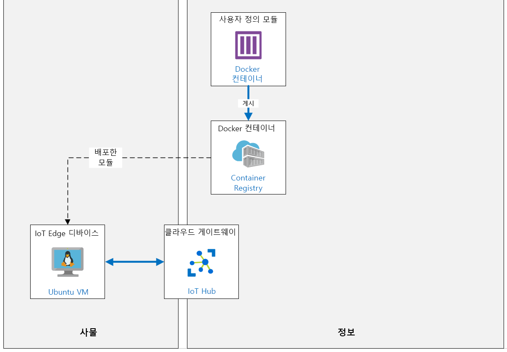

---
lab:
    title: '랩 13: VS 코드로 Azure IoT Edge에서 사용자 지정 모듈 개발, 배포 및 디버깅'
    module: '모듈 7: Azure IoT Edge 모듈'
---

# VS 코드로 Azure IoT Edge에서 사용자 지정 모듈 개발, 배포 및 디버깅

## 랩 시나리오

소비자 수요의 변동을 관리하기 위해 Contoso는 각 치즈 제조 시설의 창고에 소량의 숙성 치즈 휠 재고를 유지합니다. 이 숙성 휠은 왁스로 밀봉되고 저장 환경은 치즈가 완벽한 상태로 유지되도록 신중하게 통제됩니다. Contoso는 컨베이어 시스템을 사용하여 대형 왁스 밀봉 치즈 휠을 창고에서 포장 시설로 이동합니다.

과거에 Contoso는 시스템에 배치된 모든 치즈를 최대 용량으로 가공하여 포장 프로세스를 실행했습니다. 포장된 치즈의 초과량은 프로모션 제품용으로 사용될 수 있고 필요에 따라 추가 치즈를 재고에서 꺼낼 수 있었으므로 문제가 되지 않았습니다. 그러나 Contoso가 경험하고 있는 상당한 성장과 전 세계 수요로 인해 변동이 증가함에 따라 이 회사는 포장되는 치즈의 양을 관리하는 데 도움이 되는 방식으로 시스템을 자동화해야 합니다.

포장 및 운송 영역에서 컨베이어 벨트 시스템을 모니터링하는 IoT 솔루션을 이미 구현했기 때문에 포장량을 관리/제어하는 데 도움이 되는 솔루션을 개발하는 임무를 맡았습니다.

올바른 수의 패키지가 처리되었는지 확인하기 위해 컨베이어 벨트 시스템에서 감지된 패키지 수를 계산하는 간단한 모듈을 만들고 IoT Edge 디바이스에 배포하기로 결정합니다. 이미 패키지를 검색하는 데 사용할 수 있는 다른 모듈이 있습니다(두 모듈 모두 동일한 IoT Edge 디바이스에 배포됨).

다른 모듈에서 검색한 패키지 수를 계산하는 사용자 지정 IoT Edge 모듈을 만들고 배포해야 합니다.

이 랩에는 개발 컴퓨터(랩 호스트 환경 - VM 또는 PC)에 대한 다음과 같은 전제 조건이 있습니다.

* 다음의 확장 프로그램이 설치된 Visual Studio Code:
  * Microsoft의 [Azure IoT Tools](https://marketplace.visualstudio.com/items?itemName=vsciot-vscode.azure-iot-tools)
  * Microsoft [C#](https://marketplace.visualstudio.com/items?itemName=ms-vscode.csharp)
  * [Docker](https://marketplace.visualstudio.com/items?itemName=ms-azuretools.vscode-docker)
* Docker Client 버전 18.03.0 이상으로 개발 컴퓨터에 설치된 Docker Community Edition
  * [Mac 및 Windows용 Docker 데스크톱 다운로드](https://www.docker.com/products/docker-desktop)

    > **중요**: TLS 버전 1.2 이전에 모든 TLS 버전에 대한 Azure Container Registry 지원이 2020년 1월 13일 제거되어 Docker 클라이언트 18.03.0 이상을 실행해야 합니다.

다음 리소스가 만들어집니다.



## 랩 내용

이 랩에서는 다음 활동을 완료할 예정입니다.

* 랩 필수 구성 요소가 충족되는지 확인(필요한 Azure 리소스가 있음)
* Container Registry 만들기
* Edge 모듈 생성 및 사용자 지정
* Edge 디바이스에 모듈 배포

## 랩 지침

### 연습 1: 랩 필수 구성 요소 확인

이 랩은 다음 Azure 리소스를 사용할 수 있다고 가정합니다.

| 리소스 유형 | 리소스 이름 |
| :-- | :-- |
| 리소스 그룹 | rg-az220 |
| IoT Hub | iot-az220-training-{your-id} |

이러한 리소스를 사용할 수 없는 경우 연습 2로 이동하기 전에 아래 설명에 따라 **lab13-setup.azcli** 스크립트를 실행해야 합니다. 스크립트 파일은 개발자 환경 구성(랩 3)의 일부로 로컬로 복제한 GitHub 리포지토리에 포함됩니다.

> **참고**:  **lab13-setup.azcli** 스크립트는 **bash** 셸 환경에서 실행되도록 작성됩니다. 이는 Azure Cloud Shell에서 실행할 수 있는 가장 쉬운 방법입니다.

1. 브라우저를 사용하여 [Azure Cloud Shell](https://shell.azure.com/)을 열고 이 과정에 사용 중인 Azure 구독으로 로그인합니다.

1. Cloud Shell에 대한 스토리지 설정 관련 메시지가 표시되면 기본값을 수락합니다.

1. Cloud Shell에서 **Bash**를 사용하고 있는지 확인합니다.

    Azure Cloud Shell 페이지의 왼쪽 상단에 있는 드롭다운은 환경을 선택하는 데 사용됩니다. 선택한 드롭다운 값이 **Bash**인지 확인합니다.

1. Cloud Shell 도구 모음에서 **파일 업로드/다운로드**(오른쪽의 네 번째 단추)를 클릭합니다.

1. 드롭다운에서 **업로드**를 클릭합니다.

1. 파일 선택 대화 상자에서 개발 환경을 구성할 때 다운로드한 GitHub 랩 파일의 폴더 위치로 이동합니다.

    이 과정의 랩 3 "개발 환경 설정"에서 ZIP 파일을 다운로드하고 내용을 로컬로 추출하여 랩 리소스를 포함하는 GitHub 리포지토리를 복제했습니다. 추출된 폴더 구조에는 다음 폴더 경로가 포함됩니다.

    * 모든 파일
      * 랩
          * 13-VS 코드로 Azure IoT Edge에서 사용자 지정 모듈 개발, 배포 및 디버깅
            * Setup

    lab13-setup.azcli 스크립트 파일은 랩 13의 Setup 폴더에 있습니다.

1. **lab13-setup.azcli** 파일을 선택한 다음 **열기**를 클릭합니다.

    파일 업로드가 완료되면 알림이 표시됩니다.

1. 올바른 파일을 업로드했는지 확인하려면 다음 명령을 입력합니다.

    ```bash
    ls
    ```

    `ls` 명령으로 현재 디렉터리의 내용을 나열합니다. lab13-setup.azcli 파일이 나열됩니다.

1. 설치 스크립트가 포함된 이 랩에 대한 디렉터리를 만든 다음 해당 디렉터리로 이동하려면 다음 Bash 명령을 입력합니다.

    ```bash
    mkdir lab13
    mv lab13-setup.azcli lab13
    cd lab13
    ```

    이러한 명령은 이 랩의디렉터리를 만들고 **lab13-setup.azcli** 파일을 해당 디렉터리로 이동한 다음 디렉터리를 변경하여 새 디렉터리를 현재 작업 디렉터리로 만듭니다.

1. **lab13-setup.azcli**에 실행 권한이 있는지 확인하려면 다음 명령을 입력합니다.

    ```bash
    chmod +x lab13-setup.azcli
    ```

1. Cloud Shell 도구 모음에서 lab13-setup.azcli 파일에 액세스할 수 있도록 설정하려면 **편집기 열기**(오른쪽에서 두 번째 단추 - **{}**)를 클릭합니다.

1. **파일** 목록에서 lab13 폴더를 확장하고 스크립트 파일을 열려면 **lab13**를 클릭한 다음 **lab13-setup.azcli**를 클릭합니다.

    이제 편집기에서 **lab13-setup.azcli** 파일의 내용을 표시합니다.

1. 편집기에서 `{your-id}` 및 `{your-location}` 변수의 값을 업데이트합니다.

    아래 샘플을 예로 들면 `{your-id}`는 이 과정을 시작할 때 만든 고유 ID(**cah191211**)로 설정해야 하며 `{your-location}`는 리소스 그룹과 일치하는 위치로 설정해야 합니다.

    ```bash
    #!/bin/bash

    # 아래 값을 변경하세요!
    YourID="{your-id}"
    Location="{your-location}"
    ```

    > **참고**:  `{your-location}` 변수는 모든 리소스를 배포하는 지역의 짧은 이름으로 설정해야 합니다. 이 명령을 입력하면 사용 가능한 위치 및 짧은 이름(**이름** 열)의 목록을 볼 수 있습니다.

    ```bash
    az account list-locations -o Table

    DisplayName           Latitude    Longitude    Name
    --------------------  ----------  -----------  ------------------
    East Asia             22.267      114.188      eastasia
    Southeast Asia        1.283       103.833      southeastasia
    Central US            41.5908     -93.6208     centralus
    East US               37.3719     -79.8164     eastus
    East US 2             36.6681     -78.3889     eastus2
    ```

1. 파일의 변경 내용을 저장하고 편집기를 닫으려면 편집기 창 오른쪽 위의 **...** 를 클릭한 다음 **편집기 닫기**를 클릭합니다.

    저장하라는 메시지가 표시된 경우 **저장**을 클릭하면 편집기가 닫힙니다.

    > **참고**:  **CTRL+S**를 사용하여 언제든지 저장할 수 있으며 **CTRL+Q**를 사용하여 편집기를 닫을 수 있습니다.

1. 이 랩에 필요한 리소스를 만들려면 다음 명령을 입력합니다.

    ```bash
    ./lab13-setup.azcli
    ```

    이 작업을 실행하려면 몇 분 정도 걸립니다. 각 단계가 완료될 때 출력이 표시됩니다.

스크립트가 완료되면 랩으로 계속할 준비가 끝납니다.

### 연습 2: Azure IoT EdgeHub 개발 도구 설치

이 연습에서는 Azure IoT EdgeHub 개발 도구를 설치합니다.

1. 개발 환경에 Python 3.8이 설치되어 있는지 확인합니다.

    이 과정의 랩 3에서는 Python 3.8 설치를 비롯한 랩 환경을 준비합니다. Python이 설치되어 있지 않은 경우 랩 3의 지침을 다시 참조하세요.

1. Python이 설치되면 Windows 명령 프롬프트를 엽니다.

1. 명령 프롬프트에서 Python(Pip)에 대한 패키지 관리자를 설치하려면 다음 명령을 입력하세요.

    ```cmd/sh
    curl https://bootstrap.pypa.io/get-pip.py -o get-pip.py
    python get-pip.py
    ```

    Pip는 개발 컴퓨터에 Azure IoT EdgeHub 개발자 도구를 설치해야 합니다.

    > **중요**: 이와 같은 코드를 다운로드할 때는 코드를 실행하기 전에 검토하는 것이 좋습니다.

    Pip 설치에 문제가 있는 경우 공식 Pip [설치 지침](https://pip.pypa.io/en/stable/installing/)을 참조하세요.

    > **참고**: Windows에서 Python 및/또는 Pip은 때때로 설치되지만 `PATH`에는 없습니다. Python이 설치되어 있지만 사용할 수 없는 경우 강사에게 확인하십시오.

1. Azure IoT EdgeHub 개발자 도구를 설치하려면 다음 명령을 입력합니다.

    ```cmd/sh
    pip install iotedgehubdev --user
    ```

    > **참고**:  사전 설치된 Python 2.7 (예: Ubuntu 또는 macOS)을 포함하여 개발 환경에 여러 버전의 Python이 설치된 경우 올바른 `pip` 또는 `pip3`를 사용하여 `iotedgehubdev`를 설치해야 합니다.

    Azure IoT EdgeHub 개발 도구에 대한 자세한 내용은 여기에서 확인할 수 있습니다. [Azure IoT EdgeHub 개발 도구](https://pypi.org/project/iotedgehubdev/)

이제 Python 환경을 구성하고 이러한 도구를 설치했기 때문에 사용자 지정 IoT Edge 모듈을 저장하는 데 사용할 Azure Container Registry를 만들 준비가 되었습니다.

### 연습 3: Azure Container Registry 만들기

Azure Container Registry는 컨테이너 배포를 위해 비공개 Docker 이미지 스토리지를 제공합니다. 서비스는 오픈 소스 Docker Registry 2.0을 기반으로 하는 관리형 비공개 Docker 레지스트리 서비스입니다. Azure Container Registry는 비공개 Docker 컨테이너 이미지를 저장하고 관리하는 데 사용됩니다.

이 연습에서는 Azure Portal을 사용하여 새 Azure Container Registry 리소스를 만듭니다.

#### 작업 1: 컨테이너 레지스트리 만들기

1. 필요한 경우 Azure 계정 자격 증명을 사용하여 Azure Portal에 로그인합니다.

    Azure 계정이 두 개 이상인 경우 이 과정에 사용할 구독에 연결된 계정으로 로그인해야 합니다.

1. Azure Portal 메뉴에서 **+ 리소스 만들기**를 클릭합니다.

1. **새** 블레이드에 있는 **Marketplace 검색** 상자에서 **container registry**를 입력한 다음 **Enter** 키를 누릅니다.

1. **Marketplace** 블레이드에서 **Container Registry**를 클릭합니다.

1. **Container Registry** 블레이드에서 **만들기**를 선택합니다.

1. **컨테이너 레지스트리 만들기** 블레이드의 **구독**에서 이 과정에 사용 중인 구독이 선택되어 있는지 확인합니다.

1. **리소스 그룹** 드롭다운에서 **rg-az220**을 클릭합니다.

1. **컨테이너 레지스트리 만들기** 블레이드에서 **레지스트리 이름**아래에 전역고유의 이름을 입력합니다.

    전역적으로 고유한 이름을 입력하려면 **acraz220training{your-id}** 를 입력합니다.

    예를 들어 **acraz220trainingcah191204**과 같이 입력할 수 있습니다.

    Azure Container Registry의 이름은 전역적으로 고유해야 합니다. IP에 연결된 모든 디바이스에서 액세스할 수 있어야 하는 공개적으로 액세스할 수 있는 리소스이기 때문입니다.

    새 Azure Container Registry에 고유한 이름을 지정할 때 다음을 고려하세요.

    * 위에서 언급했듯이 레지스트리 이름은 모든 Azure에서 고유해야 합니다. 이름에 할당된 값이 서비스에 할당된 도메인 이름에 사용되기 때문에 이는 마찬가지입니다. Azure를 사용하면 전 세계 어디서나 레지스트리에 연결할 수 있으므로 결과 도메인 이름을 사용하여 인터넷에서 모든 컨테이너 레지스트리에 액세스할 수 있어야 합니다.

    * Azure Container Registry를 만든 후에는 레지스트리 이름을 변경할 수 없습니다. 이름을 변경해야 하는 경우 새 Container Registry를 만들고, 컨테이너 이미지를 다시 배포하고, 이전 Container Registry를 삭제해야 합니다.

    > **참고**:  Azure는 입력한 이름이 고유한지 확인합니다. 입력한 이름이 고유하지 않은 경우 Azure는 이름 필드의 끝에 별표를 경고로 표시합니다. 전역적으로 고유한 이름을 얻으려면 필요에 따라 위에서 제안한 이름을 `01` 또는 `02`로 추가할 수 있습니다.

1. **위치** 드롭다운에서 리소스 그룹에 사용된 것과 동일한 Azure 지역을 선택합니다.

1. **가용성 영역** 아래의 체크박스는 **선택하지 않은** 상태로 유지합니다.

    가용성 영역은 특정 지역의 컨테이너 레지스트리에 복원력과 고가용성을 제공하는 고가용성 기능입니다.

1. **SKU** 드롭다운에서 **표준**이 선택되어 있는지 확인합니다.

    Azure Container Registry는 SKU라고 하는 여러 서비스 계층에서 사용할 수 있습니다. 이러한 SKU는 예측 가능한 가격 책정과 Azure에서 프라이빗 Docker 레지스트리의 용량 및 사용량 패턴에 맞추기 위한 여러 옵션을 제공합니다.

1. 블레이드 하단의 **검토 + 생성**을 클릭하세요.

    입력한 설정의 유효성이 검사됩니다.

1. Container Registry 작성을 완료하려면 블레이드 하단에서 **만들기**를 클릭합니다.

#### 작업 2: 컨테이너 레지스트리에 Docker 연결

1. 대시보드에서 리소스 타일을 새로 고친 다음 **acraz220training{your-id}** 를 클릭합니다.

1. 왼쪽 탐색 메뉴에서 **설정**에서 **액세스 키**를 클릭합니다.

1. **관리 사용자**에서 **사용**을 클릭합니다.

    이 옵션을 사용하면 레지스트리 이름을 사용자 이름으로 및 관리 사용자 액세스 키를 암호로 사용하여  Azure Container Registry 서비스에 Docker 로그인할 수 있습니다.

1. 다음 값을 기록합니다.

    * **로그인 서버**
    * **사용자 이름**
    * **password**

    기본적으로 관리자 사용자 이름은 ACR 이름과 일치하는 **acraz220training{your-id}** 입니다.

    이 정보를 통해 다음 단계에서 Docker 작업을 수행하는 데 필요한 새 레지스트리에 인증할 수 있습니다.

1. 명령 프롬프트를 열고 다음 명령을 입력합니다.

    ```cmd/sh
    docker login <로그인 서버>
    ```

    `<loginserver>`는 기록해 둔 이름으로 바꾸고, 메시지가 표시되면 기록해 둔 사용자 이름과 암호를 입력합니다.  예를 들어 다음과 같이 입력할 수 있습니다.

    ```cmd/sh
    docker login az220acrcah191204.azurecr.io
    ```

    이 명령은 Docker 도구 집합에서 나중에 사용할 수 있도록 로컬 Docker 클라이언트 구성 파일(`$HOME/.docker/config.json`) 또는 운영 체제의 보안 자격 증명 저장소 메커니즘(Docker 구성에 따라 다름)에 자격 증명을 기록합니다.

Azure Container Registry를 만들고 로컬 컴퓨터를 인증한 이제 레지스트리에 저장될 사용자 지정 IoT Edge 모듈 컨테이너를 만들 수 있습니다.

### 연습 4: C\#으로 사용자 지정 Edge 모듈 만들기

이 연습에서는 C#으로 작성된 사용자 지정 Azure IoT Edge 모듈이 포함된 Azure IoT Edge 솔루션을 만듭니다.

#### 작업 1: 솔루션 만들기

1. Visual Studio Code를 엽니다.

1. **보기** 메뉴에서 Visual Studio 명령 팔레트를 열려면 **명령 팔레트**를 클릭합니다.

1. 명령 프롬프트에서 **Azure IoT Edge: **를 입력합니다. **새로 만들기**에서 **Azure IoT Edge:** 를 클릭합니다.**새로운 IoT Edge 솔루션**.

1. 새 솔루션을 만들 폴더를 탐색한 다음 **폴더 선택**을 클릭합니다.

1. 솔루션 이름을 묻는 메시지가 표시되면 **EdgeSolution**을 입력합니다.

    이 이름은 생성될 새 **IoT Edge 솔루션**의 디렉터리 이름으로 사용됩니다.

1. 모듈 템플릿을 선택하라는 메시지가 표시되면 **C# 모듈**을 클릭합니다.

    이렇게 하면 `C#`이 솔루션에 추가된 사용자 지정 IoT Edge 모듈의 개발 언어로 정의됩니다.

1. 사용자 지정 IoT Edge 모듈의 이름을 묻는 메시지가 표시되면 **ObjectCountingModule**을 입력합니다.

    이 이름은 생성되는 새로운 IoT Edge 모듈의 이름입니다.

1. 모듈에 대한 Docker 이미지 리포지토리 이름을 묻는 메시지가 표시되면 다음과 같이 자리 표시자 값을 업데이트합니다.

    기본 `localhost:5000/objectcountingmodule` 리포지토리 위치의 `localhost:5000` 부분을 `acraz220training{your-id}.azurecr.io`와 같은 Azure Container Registry 서버의 이름으로 바꿉니다.

    IoT Edge 모듈 docker 이미지가 게시되는 Docker 리포지토리입니다.

    Docker 이미지 리포지토리 위치는 아래 와 같은 형식을 따릅니다.

    ```text
    <acr-name>.azurecr.io/<module-name>
    ```

    자리 표시자를 적절한 값으로 바꾸어야 합니다.

    * `<acr-name>`: Azure Container Registry 서비스의 이름으로 바꿉니다.
    * `<module-name>`: 생성중인 사용자 지정 Azure IoT Edge 모듈의 이름으로 바꿉니다.

    > **참고**:  Visual Studio Code의 기본 Docker 이미지 리포지토리는 `localhost:5000/<your module name>`로 설정됩니다. 테스트를 위해 로컬 Docker 레지스트리를 사용하려는 경우 **localhost**는 괜찮습니다.

    > **중요**: ACR 참조에서 포트 `5000`에 대한 참조를 제거하세요!  해당 포트는 로컬 Docker 리포지토리에 사용되지만 ACR 사례에서는 사용되지 않습니다.

1. Visual Studio Code가 솔루션을 만들 때까지 기다립니다.

    새로운 **IoT Edge Solution**이 만들어지면 Visual Studio Code가 솔루션을 엽니다.

    > **참고**: Visual Studio Code에서 필요한 리소스 또는 C# 확장을 로드하라는 메시지가 표시되면 **예**를 클릭합니다.

    > **참고**: Visual Studio Code에서 **env** 파일을 구성하라는 메시지가 표시되면 **예**를 선택하여 아래의 작업 2를 진행합니다.

#### 작업 2: 솔루션 구성

1. 잠시 **Explorer**창의 내용을 검토합니다.

    새로운 IoT Edge Solution의 일부로 만들어진 파일 및 디렉터리를 확인합니다.

1. **Explorer** 창에서 `.env` 파일을 열려면 **env**를 클릭합니다.

    .env 파일은 IoT Edge 솔루션의 루트 디렉터리에 있습니다. 여기서 사용자 이름과 암호가 Docker 레지스트리에 액세스하도록 구성됩니다.

    > **참고:** Visual Studio Code에서 이 파일이 이미 열려 있을 수도 있습니다.

    사용자 이름과 암호는 다음 형식을 사용하여 이 파일에 저장됩니다.

    ```text
    CONTAINER_REGISTRY_USERNAME_<registry-name>=<registry-username>
    CONTAINER_REGISTRY_PASSWORD_<registry-name>=<registry-password>
    ```

    자리 표시자는 다음과 같이 정의됩니다.

    * `<registry-name>`: Docker 레지스트리의 이름.
    * `<registry-username>`: Docker 레지스트리에 액세스하는 데 사용할 사용자 이름입니다.
    * `<registry-password>`: Docker 레지스트리에 액세스하는 데 사용할 암호입니다.

    `.env` 파일 버전 내에서`<registry-name>`가 구성 값에 이미 추가되었음을 확인합니다. 추가된 값은 IoT Edge Solution을 만들 때 지정한 Docker 레지스트리의 이름과 일치해야 합니다.

    > **참고**: 여기에서 동일한 자격 증명을 제공할 때 `docker login`을 실행한 이유가 궁금할 수 있습니다.  이 랩을 작성할 때 Visual Studio Code 도구는 이러한 자격 증명을 사용하여 `docker login` 단계를 자동으로 수행하지 않습니다. 나중에 배포 템플릿의 일부로 Edge 에이전트에 자격 증명을 제공하는 데만 사용됩니다.

1. `.env` 파일 내에서 자리 표시자 값을 이전에 저장한 사용자 이름 및 암호 값으로 바꿉니다.

    `<registry-username>` 자리 표시자를 이전에 만든 Azure Container Registry의 **레지스트리 이름**(_aka Username_)으로 바꿉니다
    `<registry-password>`자리 표시자를 Azure Container Registry **암호**로 바꿉니다.

    > **참고**:  Azure Container Registry **사용자 이름** 및 **암호** 값은 Azure Portal 내 **Azure Container Registry** 서비스에 대한 **액세스 키** 창에 액세스하여 이전에 기록하지 않은 경우 찾을 수 있습니다.

1. 업데이트된 **env** 파일을 저장합니다.

1. **Explorer** 창에서 `deployment.template.json` 파일을 열려면 **deployment.template.json**을 클릭합니다.

    `deployment.template.json` 파일은 루트 IoT Edge Solution 디렉터리에 있습니다. 이 파일은 IoT Edge Solution의 _배포 매니페스트_입니다. 배포 매니페스트는 설치할 모듈과 구성 방법을 IoT Edge 다비이스 (또는 디바이스 그룹)에 알려줍니다. 배포 매니페스트에는 각 모듈 쌍에 _원하는 속성_이 포함됩니다. IoT dge 디바이스는 각 모듈에 대해 _보고된 속성_을 다시 보고합니다.

    모든 배포 매니페스트에는 두 개의 모듈이 필요합니다. `$edgeAgent`과 `$edgeHub`. 이러한 모듈은 IoT Edge 디바이스와 실행 중인 모듈을 관리하는 IoT Edge 런타임의 일부입니다.

1. `deploy.template.json` 배포 매니페스트 파일을 스크롤하여 `$edgeAgent` 요소의 `properties.desired` 섹션 내에서 다음 사항을 확인합니다.

    * `systemModules` - IoT Edge 런타임의 일부인 `$edgeAgent` 및 `$edgeHub` 시스템 모듈에 사용할 Docker 이미지를 정의합니다.

    * `modules` - IoT Edge 디바이스 (또는 디바이스 그룹)에서 배포및 실행되는 다양한 모듈을 정의합니다.

1. `$edgeAgent`에 대한 `modules` 섹션에는 두 개의 모듈이 정의되어 있습니다.

    * `ObjectCountingModule`: 이 새로운  IoT Edge Solution의 일부로 만들어지는 사용자 지정 IoT Edge Module입니다.

    * `SimulatedTemperatureSensor`: IoT Edge 디바이스에 배포할 시뮬레이션된 온도 센서 모듈을 정의합니다.

1. 배포 매니페스트의 `$edgeHub` 섹션을 확인합니다.

    이 섹션에서는 IoT Edge 모듈 간에 메시지를 전달하고 마지막으로 Azure IoT Hub 서비스에 메시지를 전달하기 위한 메시지 경로를 포함하는 `properties.desired` 요소를 통해 원하는 속성을 정의합니다.

    ```json
        "$edgeHub": {
          "properties.desired": {
            "schemaVersion": "1.0",
            "routes": {
              "ObjectCountingModuleToIoTHub": "FROM /messages/modules/ObjectCountingModule/outputs/* INTO $upstream",
              "sensorToObjectCountingModule": "FROM /messages/modules/SimulatedTemperatureSensor/outputs/temperatureOutput INTO BrokeredEndpoint(\"/modules/ObjectCountingModule/inputs/input1\")"
            },
            ...
          }
        }
    ```

    `ensorToObjectCountingModule` 경로는 `SimulatedTemperatureSensor` 모듈에서(`or/outputs/temperatureOutput`을 통해) 사용자 지정 `ObjectCountingModule` 모듈로(`BrokeredEndpoint(\"/modules/ObjectCountingModule/inputs/input1\")"` 을 통해) 메시지를 라우팅하도록 구성됩니다.

    `ObjectCountingModuleToIoTHub` 경로는 사용자 지정 `ObjectCountingModule` 모듈에서(`/messages/modules/SimulatedTemperatureSensor/outputs/temperatureOutput`을 통해) 전송되는 메시지를 Azure IoT Hub 서비스(`$upstream`를 통해)로 라우팅하도록 구성됩니다

1. **보기** 메뉴의 Visual Studio Code에서 **명령 팔레트**를 클릭합니다.

1. 명령 프롬프트에서 **Azure IoT Edge:** 를 입력합니다. **기본값을 설정한** 다음 **Azure IoT Edge:** 를 클릭합니다. **Edge 솔루션에 대한 기본 대상 플랫폼 설정**.

1. 대상 플랫폼을 선택하려면 **amd64**를 클릭합니다.

    이 대상 플랫폼은 IoT Edge 디바이스의 하드웨어 플랫폼 아키텍처로 설정해야 합니다.

    > **참고**: **Ubuntu IoT Edge** 리눅스 VM을 사용하기 때문에, `amd64` 옵션이 적절한 선택입니다. Windows VM의 경우 `windows-amd64`를 사용하고 ARM CPU 아키텍처에서 실행중인 모듈의 경우 `arm32v7` 옵션을 선택합니다.

#### 작업 3: 모듈 코드 검토

1. **탐색기** 창에서 `/modules/ObjectCountingModule` 디렉토리를 확장하려면 **모듈**을 클릭합니다.

    이 디렉터리에는 개발 중인 새로운 IoT Edge 모듈의 소스 코드 파일이 포함되어 있습니다.

1. **탐색기** 창에서 `/modules/ObjectCountingModule/Program.cs` 파일을 열려면 **Program.cs**을 클릭합니다.

    이 파일에는 새로 생성된 사용자 지정 IoT Edge 모듈에 대한 템플릿 소스 코드가 포함되어 있습니다. 이 코드는 사용자 지정 IoT Edge 모듈을 만들기 위한 시작점을 제공합니다.

1. Program.cs 파일에서 `static async Task Init()` 메서드를 찾은 다음 잠시 코드를 검토합니다.

    이 메서드는 모듈에 전송된 메시지를 처리하기 위한 `ModuleClient`를 초기화하고 메시지를 수신하도록 콜백을 설정합니다. 이 메서드에 대한 코드 내에서 코드 주석을 읽고 코드의 각 섹션이 무엇을 하는지 확인합니다.

1. `static async Task<MessageResponse> PipeMessage(` 메서드를 찾은 다음 잠깐동안 코드를 리뷰합니다.

    이 메서드는 모듈이 EdgeHub에서 메시지를 보낼 때마다 호출됩니다. 이 메서드 내의 소스 코드의 현재 상태는 이 모듈로 전송된 메시지를 수신하고 변경 없이 모듈 출력으로 파이프합니다. 이 메서드 내의 코드를 읽고 코드가 수행하는 작업을 확인합니다.

    또한 `PipeMessage` 메서드 내에서 다음과 같은 코드 줄과 수행하는 작업을 확인할 수 있습니다.

    메서드 내의 다음 코드 줄은 모듈로 전송된 메시지 수를 계산하는 카운터를 증분합니다.

    ```csharp
    int counterValue = Interlocked.Increment(ref counter);
    ```

    메서드 내의 다음 코드 줄은 모듈의 `Console`에 현재 메시지의 본문을 JSON 그리고 모듈에서 받은 총 메시지 수를 포함하는 메시지를 작성합니다.

    ```csharp
    byte[] messageBytes = message.GetBytes();
    string messageString = Encoding.UTF8.GetString(messageBytes);
    Console.WriteLine($"Received message: {counterValue}, Body: [{messageString}]");
    ```

이제 샘플 사용자 지정 모듈을 만들고 구성했습니다. 다음으로 IoT Edge 시뮬레이터에서 이것을 디버깅할 것입니다.

### 연습 5: IoT Edge 시뮬레이터를 통해 연결 모드에서 디버그

이 연습에서는 Visual Studio Code에서 IoT Edge 시뮬레이터를 사용하여 사용자 지정 IoT Edge 모듈 솔루션을 빌드하고 실행합니다.

#### 작업 1: 테스트 IoT Edge 디바이스 만들기

1. 필요한 경우 Azure 계정 자격 증명을 사용하여 Azure Portal에 로그인합니다.

    Azure 계정이 두 개 이상인 경우 이 과정에 사용할 구독에 연결된 계정으로 로그인해야 합니다.

1. 리소스 그룹 타일에서 **iot-az220-training-{your-id}** 를 클릭합니다.

1. 왼쪽 탐색 메뉴의 **설정** 아래에서 **공유 액세스 정책**을 클릭하세요.

1. 정책 목록에서 **iothubowner**를 클릭하세요.

    > **중요**: Edge 시뮬레이터에는 구성에 대해 권한 있는 역할이 필요합니다. 일반적인 사용 사례에는 이러한 권한 있는 역할을 사용하지 않습니다.

1. **iothubowner** 창에서 **연결 문자열-기본 키**에 대한 값을 복사하세요.

    아래에서 필요하므로 이 값을 기록하세요.

1. 왼쪽 탐색 메뉴의 **자동 디바이스 관리** 아래에서 **IoT Edge**를 클릭하세요.

    이 창을 사용하면 IoT Hub에 연결된 IoT Edge 디바이스를 관리할 수 있습니다.

1. 창 상단에서 **IoT Edge 디바이스 추가**를 클릭합니다.

1. **디바이스 만들기** 블레이드에서 **장치 ID** 아래에 **SimulatedDevice** 입력하기

    인증 및 액세스 제어에 사용되는 디바이스 ID입니다.

1. **인증 유형**에 **대칭 키**가 선택되어 있는지 확인합니다.

1. **자동 생성 키** 상자를 선택한 상태로 두세요.

    이렇게 하면 IoT Hub가 디바이스를 인증하기 위한 대칭 키를 자동으로 생성합니다.

1. 다른 설정을 기본값으로 두고 **저장**을 클릭하세요.

#### 작업 2: 테스트 모듈 구성

1. IoT Edge 솔루션을 포함하는 **Visual Studio Code** 인스턴스로 전환하세요.

1. **탐색기** 창에서**deployment.debug.template.json**을 마우스 오른쪽 클릭을 한 다음 **시뮬레이터에서 IoT Edge 솔루션 빌드 및 실행**을 클릭하세요.

    이 파일은 디버깅 배포 매니페스트 파일입니다. IoT Edge 솔루션의 루트 디렉터리에 있습니다.

    프로세스가 시작되면 창의 오른쪽 하단 모서리에 열려있는 **시뮬레이터를 시작하기 전에 iotedgehubdev를 설정하세요**라는 대화 상자를 볼 수 있습니다.

1. **iotedgehubdev 설치하기** 창이 나타나면 **설치**를 클릭하세요.

1. **IoT Hub 연결 문자열** 창이 나타나면 앞서 확인한 **연결 문자열-기본 키**를 입력하세요.

1. **IoT Edge 디바이스 선택하기**을 창이 나타나면 **SimulatedDevice**를 클릭하세요.

    > **참고**: 오른쪽 아래 모서리에 **권한 없음** 오류가 표시되면 명령 팔레트에서 `Azure IoT Hub: Set IoT Hub Connection String` 명령을 실행하여 시뮬레이터 연결 문자열을 다시 구성한 후에 명령 팔레트에서 `Azure IoT Edge: Setup IoT Edge Simulator`을 실행하고 디바이스를 다시 선택해 보세요.

    > **참고**: 로컬 컴퓨터 (Visual Studio Code **터미널**창)에서 특히 Linux 또는 macOS에서  관리자 암호를 입력하라는 메시지가 표시될 수 있습니다. 프롬프트에 암호를 입력하고 **Enter 키**를 누릅니다. 암호를 요청할 수 있는 이유는 `iotedgehubdev`에 대한 설치 명령이 높은 권한이 필요하기 때문에 `sudo`를 사용하여 실행되기 때문입니다.

    IoT Edge 시뮬레이터가 성공적으로 설정되면 **IoT Edge 시뮬레이터 설치 성공** 메시지가 Visual Studio Code 터미널에 표시됩니다.

    이제 IoT Edge 시뮬레이터에서 모듈을 빌드하고 실행하면 예상대로 실행됩니다.

#### 작업 3: 모듈 빌드 및 실행

1. **탐색기** 창에서**deployment.debug.template.json**을 마우스 오른쪽 클릭을 한 다음 **시뮬레이터에서 IoT Edge 솔루션 빌드 및 실행**을 클릭하세요.

    > **참고**: Windows의 터미널에서 `open //./pipe/docker_engine: The system cannot find the file specified.`라는 내용이 포함된 메시지가 표시되는 경우 Docker가 시작되지 않았거나 정상적으로 실행되고 있지 않을 가능성이 높습니다.  Docker를 다시 시작하거나 전체 컴퓨터를 다시 시작해야 할 수도 있습니다.

    > **참고**: 이 플랫폼에서 '이미지 운영 체제 "linux"를 사용할 수 없다는 메시지가 표시되면 Docker 구성을 변경하여 Linux 컨테이너를 지원합니다.  (필요한 경우 강사에게 도움을 요청하십시오.)

    > **참고**: 빌드는 컴퓨터에 이미 있는 Docker 이미지와 인터넷 연결 속도에 따라 다소 시간이 걸릴 수 있습니다.  빌드에는 존재하지 않는 경우 Docker 이미지를 다운로드하고 필요한 경우 컨테이너 인스턴스를 업데이트하는 것이 포함됩니다.

1. 터미널 창에서 빌드 프로세스 보고를 관찰합니다.

    IoT Edge 디바이스를 시뮬레이션하고 모듈을 실행하는 데 필요한 모든 것을 다운로드하고 빌드하는 데 몇 분 정도 걸릴 수 있으므로 인내심을 가져야 합니다.

    **IoT Edge 시뮬레이터**가 실행되면 빌드한 모듈이 터미널 창에 보고되는 메시지 출력을 보내기 시작합니다.

    ```text
    SimulatedTemperatureSensor    |         12/09/2019 15:05:08> Sending message: 4, Body: [{"machine":{"temperature":23.023276334173641,"pressure":1.2304998355387693},"ambient":{"temperature":20.56235126408858,"humidity":24},"timeCreated":"2019-12-09T15:05:08.4596891Z"}]
    ObjectCountingModule           | Received message: 4, Body: [{"machine":{"temperature":23.023276334173641,"pressure":1.2304998355387693},"ambient":{"temperature":20.56235126408858,"humidity":24},"timeCreated":"2019-12-09T15:05:08.4596891Z"}]
    ObjectCountingModule           | Received message sent
    SimulatedTemperatureSensor    |         12/09/2019 15:05:13> Sending message: 5, Body: [{"machine":{"temperature":23.925331861560853,"pressure":1.3332656551145274},"ambient":{"temperature":20.69443827876562,"humidity":24},"timeCreated":"2019-12-09T15:05:13.4856557Z"}]
    ObjectCountingModule           | Received message: 5, Body: [{"machine":{"temperature":23.925331861560853,"pressure":1.3332656551145274},"ambient":{"temperature":20.69443827876562,"humidity":24},"timeCreated":"2019-12-09T15:05:13.4856557Z"}]
    ObjectCountingModule           | Received message sent
    ```

    **ObjectCountingModule의** 출력에는 `Received message: #`라는 문자가 포함되어 있습니다. 여기서 `#`은 생성된 사용자 지정 **ObjectCountingModule** IoT Edge 모듈에서 받은 총 메시지 수입니다.

1. IoT Edge 시뮬레이터가 계속 실행 중인 경우 Azure Portal을 열고 Cloud Shell을 엽니다.

1. 로컬 컴퓨터의 IoT Edge 시뮬레이터에서 실행되는 `SimulatedDevice`에서 Azure IoT Hub로 전송되는 메시지를 모니터링하려면 Cloud Shell 명령 프롬프트에서 다음 명령을 입력합니다.

    ```cmd/sh
    az iot hub monitor-events --hub-name "iot-az220-training-{your-id}"
    ```

    위의 명령에서 `iot-az220-training-{your-id}` 값은 Azure IoT Hub 서비스의 이름으로 바꿔야 합니다.

1. Cloud Shell에 표시된 출력을 관찰합니다.

    모든 것이 계속 실행중이면 Cloud Shell의 이전 명령 출력에 Azure IoT Hub에서 수신되는 메시지의 JSON 표현이 표시됩니다.

    출력은 다음과 비슷한 모양입니다.

    ```json
    {
        "event": {
            "origin": "SimulatedDevice",
            "payload": "{\"machine\":{\"temperature\":88.003809452058647,\"pressure\":8.6333453806142764},\"ambient\":{\"temperature\":21.090260561364826,\"humidity\":24},\"timeCreated\":\"2019-12-09T15:16:32.402965Z\"}"
        }
    }
    {
        "event": {
            "origin": "SimulatedDevice",
            "payload": "{\"machine\":{\"temperature\":88.564600328362815,\"pressure\":8.6972329488008278},\"ambient\":{\"temperature\":20.942187817041848,\"humidity\":25},\"timeCreated\":\"2019-12-09T15:16:37.4355705Z\"}"
        }
    }
    ```

1. Visual Studio Code TERMINAL의 출력과 Cloud Shell의 출력을 비교합니다.

    메시지를 생성하는 IoT Edge 디바이스에서 실행 중인 IoT Edge 모듈이 2개 있지만 Azure IoT Hub로 전송되는 각 메시지의 복사본은 하나만 남아 있습니다. IoT Edge 디바이스에는 `SimulatedTemperatureSensor`의 메시지가 `ObjectCountingModule`에 파이프되는 위치가 정의된 메시지 파이프라인이 있으며, 이 파이프라인은 Azure IoT Hub로 메시지를 전송합니다.

1. Azure IoT Hub 이벤트 모니터링을 중지하려면 Azure Cloud Shell 내에서 **Ctrl + C**를 누릅니다.

#### 작업 4: 모듈 디버그

1. Visual Studio Code 창으로 전환합니다.

1. 왼쪽 도구 모음에서 Visual Studio Code 디버거 보기를 열려면 **실행**을 클릭합니다.

    실행 단추는 상단에서 아래로 네 번째 단추이며 아이콘에 버그 셰이프가 포함되어 있습니다.

1. **실행** 창 상단의 드롭다운에서 **ObjectCountingModule 원격 디버그(.NET Core)** 를 선택했는지 확인하세요.

1. 드롭다운 왼쪽에서 **디버깅 시작하기**를 클릭하세요.

    **F5 키**를 눌러 디버깅을 시작할 수도 있습니다.

1. **연결할프로세스 선택하기**라는 창이 나타나면 **dotnet ObjectCountingModule.dll**을 클릭하세요.

1. 파일 탐색기 보기로 변경하려면 왼쪽 도구 모음에서 **탐색기**를 클릭하세요.

1. 탐색기 창에서 `/modules/ObjectCountingModule/Program.cs` 소스 코드 파일을 열려면 **Program.cs**를 클릭하세요.

1. 코드 편집기에서 `static async Task<MessageResponse> PipeMessage(` 매서드를 찾으세요.

1. `정적 비동기 작업<MessageResponse> PipeMessage(` 코드 라인을 선택한 다음 중단점을 설정하려면 **F9**를 누르세요.

    Visual Studio Code를 사용하면 줄을 클릭하고 **F9** 키를 눌러 코드 내 중단점을 설정할 수 있습니다.

1. 설정된 중단점에서 실행이 중지되고 편집기는 특정 코드 줄을 강조 표시됩니다.

1. Visual Studio Code 디버거 보기를 열려면 왼쪽 도구 모음에서 **실행**을 클릭합니다.

1. 왼쪽 패널에 나열된 변수를 확인합니다.

1. 계속 실행하려면 **계속**을 클릭하세요.

    **F5**를 눌러 계속할 수도 있습니다.

1. 중단점이 충돌할 때마다 실행이 중지됩니다.

1. 디버깅을 중지하려면 **연결 끊기** 단추를 클릭하거나 **Shift + F5**를 누르세요.

1. IoT Edge 시뮬레이터를 중지하려면 **명령 팔레트**를 연 다음 **Azure IoT Edg:** 를 선택하세요. **IoT Edge 시뮬레이터 옵션을 중지하세요**.

이제 IoT Edge 시뮬레이터에서 모듈을 만들고 테스트하였으므로, 클라우드에 배포할 차례입니다.

### 연습 6: IoT Edge 솔루션 배포

이 연습에서는 사용자 지정 IoT Edge 모듈을 빌드하고 ACR(Azure Container Registry) 서비스에 게시합니다. ACR에 게시되면 사용자 지정 모듈을 모든 IoT Edge 디바이스에 배포할 수 있습니다.

#### 작업 1:  Azure Container Registry에 모듈 게시

1. EdgeSolution 프로젝트가 포함된 Visual Studio Code 창을 여세요.

1. **탐색기** 보기에서 `.env` 파일을 열려면 **env**를 클릭합니다.

    `.env` 파일은 IoT Edge 솔루션의 루트 디렉터리에 있습니다.

1. Azure Container Registry에 대한 자격 증명이 설정되었는지 확인합니다.

    올바르게 설정하면 `CONTAINER_REGISTRY_USERNAME_<acr-name>` 키에는 Azure Container Registry 서비스 이름으로 값이 설정되고 `CONTAINER_REGISTRY_PASSWORD_<acr-name>` 키는 Azure Container Registry 서비스의 **암호**로 설정된 값을 갖습니다. IoT Edge 솔루션을 만들 때 키의 `<acr-name>` 자리 표시자가 ACR 서비스 이름(모두 소문자)으로 자동으로 설정됩니다.

    결과 `.env` 파일 내용은 다음과 비슷합니다.

    ```text
    CONTAINER_REGISTRY_USERNAME_acraz220trainingcah191204=acraz220trainingcah191204
    CONTAINER_REGISTRY_PASSWORD_acraz220trainingcah191204=Q8YErJFCtqSe9C7BWdHOKEXk+C6uKSuK
    ```

1. **Explorer** 보기에서 **deploy.template.json**을 마우스 오른쪽 단추로 클릭한 다음 **IoT Edge 솔루션 빌드 및 푸시**를 클릭합니다.

    IoT Edge 솔루션 빌드 및 푸시 작업의 상태는 Visual Studio Code **터미널**창내에 표시됩니다. 프로세스가 완료되면 사용자 지정 `ObjectCountingModule` IoT Edge 모듈이 빌드된 다음 IoT Edge 모듈에 대한 Docker 이미지가 Azure Container Registry 서비스에 게시됩니다.

1. Azure Portal 창으로 전환합니다.

    필요한 경우 Azure 계정 자격 증명을 사용하여 Azure Portal에 로그인합니다.

    Azure 계정이 두 개 이상인 경우 이 과정에 사용할 구독에 연결된 계정으로 로그인해야 합니다.

1. ACR(Azure Container Registry) 서비스를 열려면 리소스 그룹 타일에서 **acraz220training{your-id}** 를 클릭합니다.

1. 왼쪽 탐색 메뉴에서 **서비스**에서 **리포지토리**를 클릭합니다.

1. **리포지토리** 창에서 이제 `objectcountingmodule` 리포지토리가 ACR 서비스 내에 있는 것을 확인합니다.

    이것은 사용자 지정 `ObjectCountingModule` IoT Edge 모듈이 Visual Studio Code 내에서 게시되었을 때 만들어졌습니다.

    > **참고**: 리포지토리가 없는 경우 푸시 작업의 출력을 검토하고 ACR 참조와 함께 `:5000` 포트 번호에 대한 참조를 남기지 않았는지 확인합니다. **편집** ,**파일 찾기**를 수행하여 이를 확인할 수 있습니다.  또한 `.env` 파일에서 자격 증명의 유효성을 검사하고 랩의 앞에서 `docker login` 단계를 수행한 것이 있는지 확인해야 합니다.

1. **리포지토리**에서 **objectcountingmodule**을 클릭합니다.

1. 개체 **objectcountingmodule** 블레이드에서 **태그** 아래에 **0.0.1-amd64**라는 태그가 있습니다.

1. 이 태그에 대한 세부 정보 창을 열려면 **0.0.1-amd64**를 클릭합니다.

    _리포지토리_, _태그_, _태그 생성 날짜_, _태그 마지막 업데이트 날짜_ 및 태그에 대한 정보를 표시하는 기타 속성을 포함하여 나열된 속성을 확인합니다.

1. **리포지토리** 및 **태그** 속성에 대한 값의 복사본을 저장합니다.

    값을 복사하려면 표시된 값의 오른쪽에 있는 **클립보드로 복사** 단추를 클릭할 수 있습니다.

    IoT Edge 디바이스에서 실행하려면 사용자 지정 IoT Edge 모듈에 대한 이 특정 버전의 Docker 이미지를 끌어내기 위해 리포지토리 및 태그 이름이 필요합니다.

    Docker 이미지 리포지토리 및 태그 이름의 형식이 결합된 형식은 다음과 같습니다.

    ```text
    <repository-name>:<tag>
    ```

    다음은 `objectcountingmodule` IoT Edge 모듈에 대한 전체 Docker 이미지 이름의 예입니다.

    ```text
    objectcountingmodule:0.0.1-amd64
    ```

#### 작업 2: 모듈을 사용하도록 IoT Edge 디바이스 구성

1. Azure IoT Hub 리소스로 이동합니다.

    사용자 지정 `objectcountingmodule` IoT Edge 모듈을 ACR(Azure Container Registry)에 게시하면 다음 단계는 IoT Hub 내에서 새 IoT Edge 디바이스를 만들고 새 사용자 지정 IoT Edge 모듈을 실행하도록 구성하는 것입니다.

1. **iot-az220-training-{your-id}** 블레이드 왼쪽 탐색 메뉴의 **자동 디바이스 관리** 아래에서 **IoT Edge**를 클릭합니다.

1. **IoT Edge** 창 상단에서 **IoT Edge 디바이스 추가**를 클릭합니다.

1. **디바이스 만들기** 블레이드에서 **디바이스 ID** 아래에 **objectcountingdevice**를 입력합니다.

1. **인증 유형**에서 **대칭 키**가 선택되었는지 확인하고 **자동 생성 키** 체크박스가 선택되어 있는지 확인합니다.

    이 장치의 경우 _대칭 키_ 인증을 선택하여 IoT Edge 모듈 등록을 간단하게 유지합니다. _키 자동 생성_ 옵션을 선택하면 IoT Hub에서 이 디바이스에 대한 인증 키가 자동으로 생성됩니다.

1. 블레이드 하단에서 **저장**을 선택하세요.

1. **IoT Edge** 창의 **디바이스 ID** 아래에서 **objectcountingdevice**를 클릭합니다.

1. **objectcountingdevice** 블레이드 상단에서 **모듈 설정**을 클릭합니다.

1. **디바이스의 모듈 설정: objectcountingdevice** 블레이드의 **Container Registry 설정**에서 다음 값을 입력합니다.

    * **이름**: Azure Container Registry의 **레지스트리 이름**을 입력합니다(예: `acraz220trainingcah191204`)
    * **Address(주소)**: Azure Container Registry 서비스의 **로그인 서버**(또는 DNS 이름)를 입력합니다(예: `acraz220trainingcah191204.azurecr.io`)
    * **User Name(사용자 이름)**: Azure Container Registry 서비스에 대한 **사용자 이름**입력
    * **암호**: Azure Container Registry 서비스에 대한 **암호**를 입력합니다.

    > **참고**: ACR(Azure Container Registry) 서비스 _레지스트리 이름_, _로그인 서버_, _사용자 이름_ 및 _암호_는 서비스의 **액세스 키** 창에서 찾을 수 있습니다.

1. 디바이스의 **설정 모듈: objectcountingdevice** 블레이드에서 **IoT Edge 모듈**아래에서 **추가**를 클릭한 다음 **IoT Edge 모듈**을 클릭합니다.

1. **IoT Edge 모듈 추가** 창에서 **IoT Edge 모듈 이름** 아래에 **objectcountingmodule**을 입력합니다.

1. 사용자 지정 IoT Edge 모듈에 대한 Docker 이미지의 전체 URI 및 태그가 지정된 이름을 입력하려면 **모듈 설정**에서 다음 형식을 사용합니다.

    ```text
    <container-registry-login-server>/<repository-name>:<tag>
    ```

    위의 **이미지 URI** 형식 내의 자리 표시자를 적절한 값으로 바꿔야 합니다.

    * `<container-registry-login-server>` *Azure Container Registry 서비스에 대한 **로그인 서버** 또는 DNS 이름.
    * `<repository-name>` * 이전에 복사된 사용자 지정 IoT Edge 모듈의 Docker 이미지에 대한 **리포지토리 이름**입니다.
    * `<tag>` * 이전에 복사된 사용자 지정 IoT Edge 모듈의 Docker 이미지에 대한 **태그**입니다.

    필드에 입력할 결과 **이미지 URI**는 다음과 유사합니다.

    ```text
    acraz220trainingcah191204.azurecr.io/objectcountingmodule:0.0.1-amd64
    ```

1. 나머지 설정은 기본값으로 남겨두고 **추가**를 클릭하세요.

1. **디바이스의 설정 모듈: objectcountingdevice** 블레이드의 하단에서 **다음: 경로 >** 를 클릭합니다.

1. **경로** 탭에서 기본 경로 설정을 리뷰하세요.

    편집기는 IoT Edge 디바이스에 대해 구성한 기본 경로를 표시합니다. 이 때 모든 모듈의 모든 메시지를 Azure IoT Hub로 보내는 경로로 구성해야 합니다.

    * 이름: **라우팅**
    * 값: `FROM /messages/* INTO $upstream`

1. 기본 경로의 오른쪽에서 **경로 제거하기**를 클릭하세요.

1. 다음 두 경로 추가하기:

    | 이름 | 값 |
    | --- | --- |
    | `AllMessagesToObjectCountingModule` | `FROM /* INTO BrokeredEndpoint("/modules/objectcountingmodule/inputs/input1")` |
    | `ObjectCountingModuleToIoTHub` | `FROM /messages/modules/objectcountingmodule/outputs/* INTO $upstream` |

1. **AllMessagesToObjectCountingModule** 경로에 할당된 값을 검토합니다.

    이 경로는 `/*` 의 **소스** 값을 지정합니다. 이렇게 하면 모든 디바이스-클라우드 메시지 또는 모든 모듈이나 리프 디바이스의 쌍 변경 알림에 대한 경로가 적용됩니다.

    이 경로는 BrokeredEndpoint("/모듈/개체 계산 모듈/입력/입력1")의 **대상**'값을 지정합니다. 이렇게 하면 이 경로의 소스에서 `objectcountingmodule` IoT Edge 모듈의 입력으로 모든 메시지를 보냅니다.

1. **ObjectCountingModuleToIoTHu** 경로에 할당된 값을 검토합니다.

    이 경로는`/messages/modules/objectcountingmodule/outputs/*` 의 **소** 값을 지정합니다. 이것은 `objectcountingmodule` IoT Edge 모듈에서 출력된 모든 메시지에 대한 경로를 적용합니다.

    이 경로는 `$upstream`의 **대상** 값을 지정합니다. 이렇게 하면 이 경로의 소스에서 Microsoft Azure 내의 Azure IoT Hub 서비스로 모든 메시지가 전송됩니다.

    > **참고**:  Azure IoT Hub 및 IoT Edge 모듈을 사용한 메시지 라우팅 구성에 대한 자세한 내용은 다음 링크를 참조하십시오.
    > * [IoT Edge에서 모듈을 배포하고 경로를 설정하는 방법 알아보기](https://docs.microsoft.com/ko-kr/azure/iot-edge/module-composition)
    > * [IoT Hub 메시지 라우팅 쿼리 구문](https://docs.microsoft.com/ko-kr/azure/iot-hub/iot-hub-devguide-routing-query-syntax)

1. 블레이드 하단에서 **다음: 검토 + 만들기 >** 를 클릭합니다.

1. 디바이스에 대한 배포 매니페스트를 검토한 다음 **만들기**를 클릭합니다.

이를 통해 `objectcountingmodule` 맞춤형 IoT Edge 모듈의 개발이 완료되었습니다. 이제 IoT Edge 디바이스가 등록되고 모듈이 지정되고 경로가 구성되었으므로 이전 랩과 같이 연결된 IoT Edge 디바이스가 Azure IoT Hub에 연결되면 `objectcountingmodule`을 배포할 준비가 됩니다.
