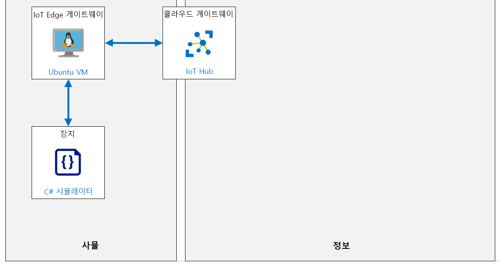
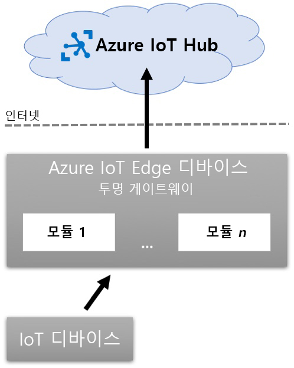

---
lab:
    title: '랩 14: 제한된 네트워크 및 오프라인에서 IoT Edge 디바이스 실행'
    module: '모듈 7: Azure IoT Edge 모듈'
---

# 제한된 네트워크 및 오프라인에서 IoT Edge 디바이스 실행

## 랩 시나리오

Contoso의 치즈 포장 및 운송 시설에서 구현한 컨베이어 벨트 모니터링 시스템이 성과를 거두고 있습니다. 이제 시스템은 벨트의 진동 수준을 관리하는 작업을 지원하는 Azure IoT Hub로 원격 분석 데이터를 전송하고 있으며, 새로운 IoT Edge 디바이스는 시스템을 통과하는 치즈 패키지 수를 추적하여 인벤토리를 관리하는 데 도움을 줍니다.

관리자는 시스템이 네트워크 중단에 탄력적이기를 원하며, 네트워크 중단은 치즈 처리 시설의 일부 영역에서 가끔씩 발생합니다. 또한, IT 부서는 네트워크의 부하를 분산하기 위해 하루 중 특정 시간에 중요하지 않은 원격 분석 데이터를 일괄 업로드하도록 시스템을 최적화할 것을 요청했습니다.

이에 따라 네트워크 중단될 경우 오프라인 시나리오를 지원하도록 IoT Edge를 구성하는 것을 제안하고, 센서의 원격 분석을 로컬(디바이스에서)로 저장하고, Edge 디바이스가 지정된 시간에 정기적으로 동기화하도록 구성하려 합니다.

다음 리소스가 만들어집니다.



## 랩 내용

이 랩에서는 다음 활동을 완료할 예정입니다.

* 랩 필수 구성 요소가 충족되는지 확인(필요한 Azure 리소스가 있음)

  * 필요한 경우 스크립트를 실행하여 IoT Hub 만들기
  * 스크립트를 실행하여 이 랩에 필요한 새 디바이스 ID 만들기

* Azure IoT Edge 사용 Linux VM 배포
* 하위 IoT 디바이스가 있는 IoT Edge 상위 디바이스 설정
* IoT Edge 디바이스를 게이트웨이로 구성
* Azure CLI를 사용하여 IoT Edge 게이트웨이 디바이스 인바운드 포트 열기
* IoT Edge 게이트웨이 디바이스 TTL(Time to Live) 및 메시지 저장소 구성
* IoT Edge 게이트웨이에 하위 IoT 디바이스 연결
* 디바이스 연결 및 오프라인 지원 테스트

## 랩 지침

### 연습 1: 랩 필수 구성 요소 확인

이 랩에서는 다음과 같은 Azure 리소스를 사용할 수 있다고 가정합니다.

| 리소스 유형 | 리소스 이름 |
| :-- | :-- |
| 리소스 그룹 | rg-az220 |
| IoT Hub | iot-az220-training-{your-id} |
| IoT 디바이스 | sensor-th-0050 |

> **중요**: 설정 스크립트를 실행하여 필요한 디바이스를 만드세요.

누락된 리소스와 새 디바이스를 만들려면 연습 2를 진행하기 전에 아래 설명에 따라 **lab14-setup.azcli** 스크립트를 실행해야 합니다. 스크립트 파일은 개발자 환경 구성(랩 3)의 일부로 로컬로 복제한 GitHub 리포지토리에 포함됩니다.

**lab14-setup.azcli** 스크립트는 **bash** 셸 환경에서 실행되도록 작성됩니다. 이는 Azure Cloud Shell에서 실행할 수 있는 가장 쉬운 방법입니다.

>**참고:** **sensor-th-0050** 디바이스용 연결 문자열이 필요합니다. 이 디바이스가 Azure IoT Hub에 이미 등록된 경우, Azure Cloud Shell에서 다음 명령을 실행하여 연결 문자열을 가져올 수 있습니다.

```bash
az iot hub device-identity connection-string show --hub-name iot-az220-training-{your-id} --device-id sensor-th-0050 -o tsv
```

#### 작업 1: 설치 스크립트 실행

1. 브라우저를 사용하여 [Azure Cloud Shell](https://shell.azure.com/)을 열고 이 과정에 사용 중인 Azure 구독으로 로그인합니다.

    Cloud Shell에 대한 스토리지 설정 관련 메시지가 표시되면 기본값을 수락합니다.

1. Cloud Shell에서 **Bash**를 사용하고 있는지 확인합니다.

    Azure Cloud Shell 페이지의 왼쪽 상단에 있는 드롭다운은 환경을 선택하는 데 사용됩니다. 선택한 드롭다운 값이 **Bash**인지 확인합니다.

1. Cloud Shell 도구 모음에서 **파일 업로드/다운로드**(오른쪽의 네 번째 단추)를 클릭합니다.

1. 드롭다운에서 **업로드**를 클릭합니다.

1. 파일 선택 대화 상자에서 개발 환경을 구성할 때 다운로드한 GitHub 랩 파일의 폴더 위치로 이동합니다.

    _랩 3: 개발 환경 설정_, ZIP 파일을 다운로드하고 콘텐츠를 로컬로 추출하여 랩 리소스를 포함하는 GitHub 리포지토리를 복제했습니다. 추출된 폴더 구조에는 다음 폴더 경로가 포함됩니다.

    * 모든 파일
      * 랩
          * 14-제한된 네트워크 및 오프라인에서 IoT Edge 디바이스 실행
            * Setup

    lab14-setup.azcli 스크립트 파일은 랩 14의 Setup 폴더에 있습니다.

1. **lab14-setup.azcli** 파일을 선택한 다음 **열기**를 클릭합니다.

    파일 업로드가 완료되면 알림이 표시됩니다.

1. Azure Cloud Shell에 올바른 파일이 업로드되었는지 확인하려면 다음 명령을 입력합니다.

    ```bash
    ls
    ```

    `ls` 명령으로 현재 디렉터리의 내용을 나열합니다. lab14-setup.azcli 파일이 나열됩니다.

1. 설치 스크립트가 포함된 이 랩에 대한 디렉터리를 만든 다음 해당 디렉터리로 이동하려면 다음 Bash 명령을 입력합니다.

    ```bash
    mkdir lab14
    mv lab14-setup.azcli lab14
    cd lab14
    ```

1. **lab14-setup.azcli**에 실행 권한이 있는지 확인하려면 다음 명령을 입력합니다.

    ```bash
    chmod +x lab14-setup.azcli
    ```

1. Cloud Shell 도구 모음에서 lab14-setup.azcli 파일에 액세스할 수 있도록 설정하려면 **편집기 열기**(오른쪽에서 두 번째 단추 - **{}**)를 클릭합니다.

1. lab14 폴더를 펼치고 스크립트 파일을 열려면 **파일** 목록에서 **lab14**을 클릭한 다음 **lab14-setup.azcli**를 클릭합니다.

    이제 편집기에서 **lab14-setup.azcli** 파일의 내용을 표시합니다.

1. 편집기에서 `{your-id}` 및 `{your-location}`에 할당된 값을 업데이트합니다.

    아래 샘플을 예로 들어 보면, `{your-id}`는 이 과정을 시작할 때 만든 고유 ID(예: **cah191211**)로 설정하고 `{your-location}`는 리소스에 적합한 위치로 설정해야 합니다.

    ```bash
    #!/bin/bash

    # 아래 값을 변경하세요!
    YourID="{your-id}"
    Location="{your-location}"
    ```

    > **참고**:  `{your-location}` 변수는 모든 리소스를 배포하는 지역의 짧은 이름으로 설정해야 합니다. 이 명령을 입력하면 사용 가능한 위치 및 짧은 이름(**이름** 열)의 목록을 볼 수 있습니다.

    ```bash
    az account list-locations -o Table

    표시이름           위도    경도    이름
    --------------------  ----------  -----------  ------------------
    동아시아             22.267      114.188      eastasia
    동남 아시아        1.283       103.833      southeastasia
    미국 중부            41.5908     -93.6208     centralus
    미국 동부               37.3719     -79.8164     eastus
    미국 동부 2             36.6681     -78.3889     eastus2
    ```

1. 파일의 변경 내용을 저장하고 편집기를 닫으려면 편집기 창 오른쪽 위의 [...]를 클릭한 다음 **편집기 닫기**를 클릭합니다.

    저장하라는 메시지가 표시된 경우 **저장**을 클릭하면 편집기가 닫힙니다.

    > **참고**:  **CTRL+S**를 사용하여 언제든지 저장할 수 있으며 **CTRL+Q**를 사용하여 편집기를 닫을 수 있습니다.

1. 이 랩에 필요한 리소스를 만들려면 다음 명령을 입력합니다.

    ```bash
    ./lab14-setup.azcli
    ```

    이 스크립트를 실행하는 데 몇 분이 걸릴 수 있습니다. 각 단계가 완료될 때 출력이 표시됩니다.

    이 스크립트는 먼저 **rg-az220** 리소스 그룹과 **iot-az220-training-{your-id}** IoT Hub를 만듭니다. 이미 있는 경우 해당 메시지가 표시됩니다. 그런 다음 스크립트는 ID가 **sensor-th-0050**인 디바이스를 IoT Hub에 추가하고 디바이스 연결 문자열을 표시합니다.

1. 스크립트가 완료되면 디바이스의 연결 문자열이 표시됩니다.

    연결 문자열은 "HostName="으로 시작합니다.

1. 연결 문자열을 텍스트 문서에 복사하고 **sensor-th-0050** 디바이스용 연결 문자열임을 기록해 둡니다.

    연결 문자열을 쉽게 찾을 수 있는 위치에 저장하셨다면, 랩을 계속할 준비가 되었습니다.

### 연습 2: Azure IoT Edge 사용 Linux VM 배포

이 연습에서는 Azure CLI를 사용하여 Azure IoT Edge 런타임을 지원하는 Ubuntu Server VM을 만듭니다.

#### 작업 1: VM 만들기

1. 필요한 경우 Azure 계정 자격 증명을 사용하여 Azure Portal에 로그인합니다.

    Azure 계정이 두 개 이상인 경우 이 과정에 사용할 구독에 연결된 계정으로 로그인해야 합니다.

1. **rg-az220vm** 리소스 그룹 타일을 Azure 대시보드에 이미 고정했는지 잠시 확인합니다.

    > **참고**: **rg-az220vm** 리소스 그룹은 이전 랩에서 만든 그룹이며 대시보드에 고정되어 있어야 합니다. 이 그룹이 대시보드에 아직 고정되어 있지 않으면 VM을 만들기 전에 CLI 명령을 사용하여 다음과 같이 해당 그룹을 만듭니다.

1. Azure Portal 도구 모음에서 **Cloud Shell**을 클릭합니다.

    환경이 셸에서 **Bash**로 설정되어 있는지 확인합니다.

1. **rg-az220vm** 리소스 그룹을 만들어야 하는 경우 다음 지침을 따릅니다.

    Azure IoT Edge 사용 VM에 대한 리소스 그룹을 만들려면 다음 명령을 입력합니다.

    ```bash
    az group create --name rg-az220vm --location {your-location}
    ```

    > **Note**: 위의 명령에서 `{your-location}`는 현재 위치와 가까운 지역으로 바꿔야 합니다.

    대시보드에 새 리소스 그룹을 고정하려면 Azure 대시보드로 이동하여 다음 작업을 완료합니다.

    * Azure Portal 메뉴에서 **리소스 그룹**을 클릭합니다.
    * **리소스 그룹** 블레이드의 **이름**에서 **rg-az220vm** 리소스 그룹을 찾습니다.
    * **rg-az220vm** 행에서 블레이드의 오른쪽에 있는 [...]를 클릭하고 **대시보드에 고정**을 클릭합니다.

    RG 타일과 목록의 리소스에 더 쉽게 액세스할 수 있도록 대시보드를 편집할 수 있습니다.

1. Cloud Shell 명령 프롬프트에서 Linux VM을 만들려면 다음의 두 명령을 입력합니다.

    ```bash
    az vm create --resource-group rg-az220vm --name vm-az220-training-gw0002-{your-id} --image Canonical:UbuntuServer:18.04-LTS:latest --admin-username vmadmin --admin-password {YOUR-PASSWORD-HERE} --authentication-type password
    ```

    > **참고**: 반드시 두 번째 명령에 있는 자리 표시자를 바꿔야 합니다.

    이 명령은 위에 지정된 리소스 그룹 내에서 VM을 만듭니다. **vm-az220-training-gw0002-{your-id}**는 고유 ID를 입력하여 업데이트하고, `{암호 입력}`은 적절한 보안 수준의 암호로 바꿔야 합니다.

    > **참고**: 프로덕션 환경에서는 사용자 이름/암호 접근 방법을 사용하는 대신 SSH 키를 생성하도록 선택할 수 있습니다. Linux VM 및 SSH에 대한 자세한 내용은 여기를 참조하세요. [https://docs.microsoft.com/ko-kr/azure/virtual-machines/linux/create-ssh-keys-detailed](https://docs.microsoft.com/ko-kr/azure/virtual-machines/linux/create-ssh-keys-detailed).
    >
    > **참고**:  배포를 완료하는 데 약 5분이 걸립니다. 배포하는 동안 다음 단원을 계속 진행할 수 있습니다.

### 연습 3: 하위 IoT 디바이스가 있는 IoT Edge 상위 디바이스 설정

IoT Edge 게이트웨이(부모) 및 기타 IoT 디바이스(자식 또는 리프 디바이스)를 포함하는 부모/자식 관계를 이용하면 Azure IoT 솔루션 내에서 오프라인 기능을 구현할 수 있습니다. IoT Edge 디바이스가 IoT Hub에 연결할 수 있는 기회가 한 번 있다면 해당 디바이스와 모든 자식 디바이스는 간헐적으로 또는 인터넷 연결이 없이 작동을 계속할 수 있습니다.

다음 다이어그램은 IoT Edge 디바이스 부모와 자식 디바이스 간의 관계를 보여줍니다.



이 다이어그램에서 자식 디바이스는 부모 IoT Edge 디바이스에 연결하고 인증합니다. 자식 디바이스는 인증 시 Azure IoT Hub 자격 증명을 사용합니다. 인증이 되면 자식 IoT 디바이스는 IoT Edge 디바이스의 Edge 허브(`$edgeHub`)로 메시지를 보냅니다. 메시지가 부모 IoT Edge 디바이스에 도달하면 연결될 때 Azure IoT Hub에 메시지를 보내는 것을 포함하여 IoT Edge 모듈 및 라우팅이 구성에 따라 메시지를 처리합니다.

부모 IoT Edge 디바이스의 연결이 끊어지거나 Azure IoT Hub에 연결되지 않을 경우 모든 디바이스 메시지가 IoT Edge 디바이스에 자동으로 저장됩니다. 연결이 복원되면 IoT Edge 디바이스는 연결을 다시 시작하고 저장된 메시지를 Azure IoT Hub로 보냅니다. IoT Edge 디바이스에 저장된 메시지는 디바이스의 TTL(Time-to-Live) 구성에 따라 만료될 수 있습니다(기본적으로 메시지를 최대 `7200`초(2시간)까지 저장하도록 설정되어 있음).

이 연습에서는 Azure IoT Hub에 IoT Edge 디바이스를 등록한 후 IoT 디바이스를 만들고 이를 IoT Edge 디바이스의 자식으로 구성합니다. 이렇게 하면 위에서 설명한 시나리오를 사용할 수 있습니다. 해당 시나리오에서는 자식 IoT 디바이스는 클라우드의 Azure IoT Hub로 통신을 보내기 전에 부모 IoT Edge 게이트웨이 디바이스를 통해 메시지를 보냅니다. Edge 게이트웨이 디바이스와 IoT Hub 간의 연결이 끊어지면 연결이 복원될 때까지 Edge 게이트웨이 디바이스가 (지정된 제한 내에서) 메시지를 저장합니다.

1. 필요한 경우 Azure 계정 자격 증명을 사용하여 Azure Portal에 로그인합니다.

    Azure 계정이 두 개 이상인 경우 이 과정에 사용할 구독에 연결된 계정으로 로그인해야 합니다.

1. Azure Portal 도구 모음에서 **Cloud Shell**을 클릭합니다.

    환경이 **Bash**를 사용하고 있는지 확인합니다.

1. Azure IoT Hub 내에서 새 **IoT Edge 디바이스 ID**를 만들려면 다음 명령을 입력합니다.

    ```sh
    az iot hub device-identity create --edge-enabled --hub-name iot-az220-training-{your-id} --auth-method shared_private_key --device-id vm-az220-training-gw0002-{your-id}
    ```

    > **참고**:  **iot-az220-training-{your-id}** IoT Hub 이름은 사용자의 Azure IoT Hub 이름으로 바꿔야 합니다.

    다음 매개 변수는 `az iot hub device-identity create` 명령에 포함됩니다.

    * `--hub-name`: 이 필수 매개 변수는 새 디바이스를 추가하는 **Azure IoT Hub**의 이름을 지정하는 데 사용됩니다.

    * `--device-id`: 이 필수 매개 변수는 생성 중인 IoT 디바이스의 **장치 ID**를 지정하는 데 사용됩니다.

    * `--edge-enabled`: 이는 생성 중인 IoT 디바이스가 **IoT Edge 디바이스**이며 IoT Edge에서 사용할 수 있음을 명시합니다.

    * `--auth-method`: 이것은 IoT 디바이스에 사용되는 인증 방법을 지정합니다. `shared_private_key` 값은 대칭 키 암호화를 사용하도록 지정합니다. 다른 옵션은 `x509_ca`과 `x509_thumbprint`입니다.

1. 잠시 시간을 내어 명령으로 생성된 JSON 출력을 리뷰합니다.

    명령이 완료되면 터미널로 반환된 JSON의 블로그가 있는 것을 확인하세요. 이 JSON에는 방금 만든 **IoT Edge 디바이스**의 구성에 대한 몇 가지 세부 정보가 포함되어 있습니다. 디바이스 세부 정보 중에는 디바이스용 서비스가 자동 생성한 **대칭 키**가 있습니다.

    ```json
        {
          "authentication": {
            "symmetricKey": {
              "primaryKey": "gOAYooDeRrinZzyo0yWZNEkvc0wZaF9/4qaXv7s7olw=",
              "secondaryKey": "MzE5VtKJzOO6HGnNkI4kyn+MCziUYXZ/MSJCKxHIHa0="
            },
            "type": "sas",
            "x509Thumbprint": {
              "primaryThumbprint": null,
              "secondaryThumbprint": null
            }
          },
          "capabilities": {
            "iotEdge": true
          },
          "cloudToDeviceMessageCount": 0,
          "connectionState": "Disconnected",
          "connectionStateUpdatedTime": "0001-01-01T00:00:00",
          "deviceId": "vm-az220-training-gw0002-{your-id}",
          "deviceScope": "ms-azure-iot-edge://vm-az220-training-gw0002-{your-id}-637121074930370650",
          "etag": "Nzk1MjE0NjM2",
          "generationId": "637121074930370650",
          "lastActivityTime": "0001-01-01T00:00:00",
          "status": "enabled",
          "statusReason": null,
          "statusUpdatedTime": "0001-01-01T00:00:00"
        }
    ```

1. IoT Hub에서 **vm-az220-training-gw0002-{your-id}** 디바이스의 **연결 문자열**을 검색하려면 다음 명령을 입력합니다.

    ```cmd/sh
    az iot hub device-identity connection-string show --hub-name iot-az220-training-{your-id} --device-id vm-az220-training-gw0002-{your-id} -o tsv
    ```

    > **참고**:  **iot-az220-training-{your-id}** IoT Hub 이름은 사용자의 Azure IoT Hub 이름으로 바꿔야 합니다.

    다음과 같은 여러 매개변수를 전달하여 `az iot hub device-identity connection-string show` 명령을 호출합니다.

    * `--hub-name`: 이 필수 매개 변수는 새 디바이스를 추가하는 **Azure IoT Hub**의 이름을 지정하는 데 사용됩니다.

    * `--device-id`: 이 필수 매개 변수는 생성 중인 IoT 디바이스의 **장치 ID**를 지정하는 데 사용됩니다.

    **vm-az220-training-gw0002-{your-id}** 디바이스의 IoT Hub 연결 문자열 출력은 다음과 같은 형식으로 표시됩니다.

    ```text
    HostName={iot-hub-name}.azure-devices.net;DeviceId=vm-az220-training-gw0002-{your-id};SharedAccessKey={shared-access-key}
    ```

1. 이 랩의 후반부에 참조할 수 있도록 연결 문자열 값의 복사본을 저장합니다.

    다음 단계는 IoT Hub와의 통신을 위해 부모 IoT Edge 게이트웨이 디바이스에 직접 연결되는 자식 IoT 디바이스를 만드는 것입니다.

1. IoT 디바이스를 만들고 IoT Edge 디바이스의 자식으로 구성하려면 다음 명령을 실행합니다.

    ```sh
    az iot hub device-identity create -n iot-az220-training-{your-id} --device-id sensor-th-0084 --pd vm-az220-training-gw0002-{your-id}
    ```

    > **참고**:  **iot-az220-training-{your-id}** IoT Hub 이름은 사용자의 Azure IoT Hub 이름으로 바꿔야 합니다.

    이 명령에는 다음 매개 변수가 전달됩니다.

    * `-n`: 이 필수 매개 변수는 `--hub-name`의 약자이며 새 디바이스를 추가하는 **Azure IoT Hub**의 이름을 지정하는 데 사용됩니다.

    * `--device-id`: 이 필수 매개 변수는 생성 중인 IoT 디바이스의 **장치 ID**를 지정하는 데 사용됩니다.

    * `--pd`: 이 매개 변수는 생성 중인 IoT 디바이스의 **부모 디바이스**를 지정합니다. 전달된 값은 이 **자식 디바이스**를 할당할 **부모 디바이스**의 **장치 ID**여야 합니다.

    이 명령은 `--auth-method`에서 전달되지 않습니다. 이 매개 변수를 생략하면 `shared_private_key`의 기본값이 사용됩니다.

1. 잠시 시간을 내어 이 명령의 JSON 출력을 검토합니다.

    명령이 완료되면 터미널에 반환된 JSON의 블로그가 있습니다. 이 JSON에는 방금 만든 **IoT 디바이스**의 구성에 대한 몇 가지 세부 정보가 포함되어 있습니다. Azure IoT Hub로 디바이스를 인증하거나 자식 디바이스가 부모 IoT Edge 게이트웨이에 연결될 때 사용할 수 있는 대칭 키가 포함된 `symmetricKey` 노드를 확인합니다.

    나중에 사용할 수 있도록 이 IoT 디바이스의 **primaryKey**가 필요합니다.

    ```json
        {
          "authentication": {
            "symmetricKey": {
              "primaryKey": "uMhYoXK/WRoXrIATh25aijyEbA401PKDxy4KCS488U4=",
              "secondaryKey": "9tOPmSkmoqRd2KEP1JFyQQ6y2JdA5HPO7qnckFrBVm4="
            },
            "type": "sas",
            "x509Thumbprint": {
              "primaryThumbprint": null,
              "secondaryThumbprint": null
            }
          },
          "capabilities": {
            "iotEdge": false
          },
          "cloudToDeviceMessageCount": 0,
          "connectionState": "Disconnected",
          "connectionStateUpdatedTime": "0001-01-01T00:00:00",
          "deviceId": "sensor-th-0084",
          "deviceScope": "ms-azure-iot-edge://vm-az220-training-gw0002-{your-id}-637121074930370650",
          "etag": "MTgxNjg1MjE0",
          "generationId": "637121169262975883",
          "lastActivityTime": "0001-01-01T00:00:00",
          "status": "enabled",
          "statusReason": null,
          "statusUpdatedTime": "0001-01-01T00:00:00"
        }
    ```

1. 이 랩의 후반부에서 참조할 수 있도록 `primaryKey` 값의 복사본을 저장합니다.

1. IoT Hub에서 **sensor-th-0084** 디바이스의 **연결 문자열**을 검색하려면 다음 명령을 입력합니다.

    ```cmd/sh
    az iot hub device-identity connection-string show --hub-name iot-az220-training-{your-id} --device-id sensor-th-0084 -o tsv
    ```

    > **참고**:  **iot-az220-training-{your-id}** IoT Hub 이름은 사용자의 Azure IoT Hub 이름으로 바꿔야 합니다.

1. 이 랩의 후반부에 참조할 수 있도록 연결 문자열 값의 복사본을 저장합니다.

1. 방금 완료한 작업의 결과를 생각해봅니다.

    이제 Azure IoT Hub에 등록된 IoT Edge 디바이스와 자식 IoT 디바이스가 있습니다. **IoT 디바이스**는 **IoT Edge 디바이스**를 부모로 구성합니다.

    이 구성을 사용하면 자식 IoT 디바이스에서 Azure IoT Hub를 사용하여 직접 연결하는 대신 부모 IoT Edge 디바이스와 연결하고 통신할 수 있습니다. 이러한 방식으로 IoT 디바이스 토폴로지를 구성하면 Azure IoT Hub의 연결이 끊어진 경우에도 IoT 디바이스와 IoT Edge 디바이스가 계속 작동할 수 있는 오프라인 지원 시나리오를 사용할 수 있습니다.

### 연습 4: IoT Edge 디바이스를 게이트웨이로 구성

다운스트림 디바이스가 자체 IoT Hub ID를 사용하도록 하고, 이론적으로는 IoT Hub에 직접 연결할 수 있도록 하려는 경우에는 IoT Edge Transparent Gateway를 사용해야 합니다. 게이트웨이는 디바이스와 IoT Hub 간에 통신을 전달하기만 하면 됩니다. 네트워크 연결이 끊어지면 발생하는 오프라인 시나리오를 지원하려는 경우 게이트웨이 디바이스를 구현합니다.

이 연습에서는 (이전에 만들었던) Ubuntu 가상 머신의 Azure IoT Edge를 IoT Edge 투명 게이트웨이 디바이스로 구성합니다.

> **참고**: 도우미 스크립트를 사용하여 IoT Edge 디바이스를 투명 게이트웨이로 구성할 것입니다. 이렇게 하면 프로세스를 더 빨리 완료할 수 있습니다.

#### 작업 1 - VM이 실행되고 있는지 확인

1. 필요한 경우 Azure Portal 도구 모음에서 **Cloud Shell**을 클릭합니다.

    환경이 **Bash**를 사용하고 있는지 확인합니다.

1. **rg-az220vm** 그룹의 VM 상태를 확인하려면 다음 명령을 입력합니다.

    ```bash
    az vm list --show-details --resource-group rg-az220vm -o table
    ```

    그러면 **rg-az220vm** 내의 VM 목록이 표시됩니다. **vm-az220-training-gw0002-{your-id}** VM의 행을 찾은 다음 **PowerState** 열의 값을 검토합니다. **PowerState**가 **VM running**이면 **PublicIps** 값을 적어 둡니다.

1. VM **PowerState**가 **VM running**이 아닌 경우 VM을 시작하려면 다음 명령을 입력합니다.

    ```bash
    az vm start --name vm-az220-training-gw0002-{your-id} --resource-group rg-az220vm
    ```

    이 명령의 실행이 완료되려면 몇 분 정도 걸립니다.

1. **vm-az220-training-gw0002-{your-id}** VM의 **공용 IP**를 가져오려면 다음 명령을 다시 입력합니다.

    ```bash
    az vm list --show-details --resource-group rg-az220vm -o table
    ```

    **PowerState**가 **VM running**인지 확인하고 **PublicIps** 값을 적어 둡니다.

#### 작업 2: 패키지 관리자에 Microsoft 설치 패키지 추가

1. 필요한 경우 Azure 계정 자격 증명을 사용하여 Azure Portal에 로그인합니다.

1. Azure Portal 도구 모음에서 **Cloud Shell**을 클릭합니다.

    환경이 **Bash**를 사용하도록 설정되어 있는지 확인합니다.

1. Cloud Shell 명령 프롬프트에서 Edge VM으로의 SSH 연결을 설정하려면 다음 명령을 입력합니다.

    ```bash
    ssh {username}@{Public-IP-Address}
    ```

    사용자 이름과 **공용 IP 주소**의 자리 표시자 값을 실제 값으로 바꿔야 합니다. 예를 들어 다음과 같이 입력할 수 있습니다. `ssh vmadmin@52.170.205.37`

1. **Are you sure you want to continue connecting (yes/no)?** 프롬프트가 표시되면 **yes**를 입력합니다.

1. Microsoft 설치 패키지에 액세스하도록 VM을 구성하려면 다음 명령을 실행합니다.

    ```bash
    curl https://packages.microsoft.com/config/ubuntu/18.04/multiarch/prod.list > ./microsoft-prod.list
    ```

1. 다운로드한 패키지 목록을 패키지 관리자에 추가하려면 다음 명령을 실행합니다.

    ```bash
    sudo cp ./microsoft-prod.list /etc/apt/sources.list.d/
    ```

1. 패키지를 설치하려면 Microsoft GPG 공개 키를 설치해야 합니다. 다음 명령을 실행합니다.

    ```bash
    curl https://packages.microsoft.com/keys/microsoft.asc | gpg --dearmor > microsoft.gpg
    sudo cp ./microsoft.gpg /etc/apt/trusted.gpg.d/
    ```

    > **중요**: Azure IoT Edge 소프트웨어 패키지에는 각 패키지 **(usr/share/doc/{패키지 이름}** 또는 **LICENSE** 디렉터리)에 포함되어 있는 사용 조건이 적용됩니다. 패키지를 사용하기 전에 사용 조건을 읽어보세요. 패키지를 설치 및 사용하면 이러한 사용 조건에 동의하게 됩니다. 사용 조건에 동의하지 않는 경우 해당 패키지를 사용하지 마세요.

#### 작업 3: 컨테이너 엔진 설치

Azure IoT Edge는 OCI 호환 컨테이너 런타임을 사용합니다. 프로덕션 시나리오에서는 Moby 엔진을 사용하는 것이 좋습니다. Azure IoT Edge에서 공식적으로 지원되는 컨테이너 엔진은 Moby 엔진뿐입니다. Docker CE/EE 컨테이너 이미지는 Moby 런타임과 호환 가능합니다.

1. 디바이스에서 패키지 목록을 업데이트하려면 다음 명령을 실행합니다.

    ```bash
    sudo apt-get update
    ```

    이 명령을 실행하려면 몇 분 정도 걸립니다.

1. **Moby** 엔진을 설치하려면 다음 명령을 실행합니다.

    ```bash
    sudo apt-get install moby-engine
    ```

    계속 진행할지를 묻는 프롬프트가 표시되면 **Y**를 입력합니다. 설치는 몇 분 정도 걸릴 수 있습니다.

#### 작업 4: IoT Edge 설치

IoT Edge 보안 디먼은 IoT Edge 디바이스에서 보안 표준을 제공하고 유지 관리합니다. 디먼은 부팅할 때마다 시작되며, 나머지 IoT Edge 런타임을 시작하여 디바이스를 부트스트랩합니다.

1. 일반적으로는 새 패키지를 설치하기 전에 패키지 목록을 업데이트하는 것이 좋습니다. 그러나 이 연습에서는 이전 작업에서 패키지를 업데이트했습니다. 디바이스에서 패키지 목록을 업데이트하려면 다음 명령을 실행합니다.

    ```bash
    sudo apt-get update
    ```

1. 사용 가능한 **IoT Edge 런타임** 버전의 목록을 표시하려면 다음 명령을 실행합니다.

    ```bash
    apt list -a iotedge
    ```

    > **팁**: 이전 버전 런타임을 설치해야 하는 경우 이 명령을 실행하면 유용합니다.

1. 최신 버전의 IoT Edge 런타임을 설치하려면 다음 명령을 실행합니다.

    ```bash
    sudo apt-get install iotedge
    ```

    계속 진행할지를 묻는 프롬프트가 표시되면 **Y**를 입력합니다. 설치는 몇 분 정도 걸릴 수 있습니다.

    > **팁**: `apt list -a iotedge` 명령 출력에 표시되었던 **1.0.9-1** 등의 이전 버전을 설치하려는 경우에는 다음 명령을 사용합니다.
    > ```bash
    > sudo apt-get install iotedge=1.0.9-1 libiothsm-std=1.0.9-1
    > ```

1. Azure IoT Edge 런타임이 VM에 설치되어 있는지 확인하려면 다음 명령을 실행합니다.

    ```bash
    iotedge version
    ```

    이 명령은 현재 가상 머신에 설치된 Azure IoT Edge 런타임 버전을 출력합니다.

    이 버전의 출력은 다음과 유사합니다.

    ```bash
    vmadmin@vm-az220-training-gw0002-dm200420:~$ iotedge --version
    iotedge 1.1.1
    ```

1. Cloud Shell 명령 프롬프트에서 SSH 세션을 닫으려면 **exit**를 입력하고 **Enter** 키를 누릅니다.

#### 작업 5: 도우미 스크립트 구성

1. Visual Studio Code의 새 인스턴스를 엽니다.

1. Visual Studio Code **파일** 메뉴에서 **폴더 열기**를 클릭합니다.

1. 폴더 열기 대화 상자에서 랩 14 Setup 폴더로 이동합니다.

    _랩 3: 개발 환경 설정_, ZIP 파일을 다운로드하고 콘텐츠를 로컬로 추출하여 랩 리소스를 포함하는 GitHub 리포지토리를 복제했습니다. 추출된 폴더 구조에는 다음 폴더 경로가 포함됩니다.

    * 모든 파일
      * 랩
          * 14-제한된 네트워크 및 오프라인에서 IoT Edge 디바이스 실행
            * Setup

1. **설정**을 클릭한 다음 **폴더 선택**을 클릭합니다.

1. **Explorer** 창에서 **setup-iot-edge-gateway.sh**를 클릭합니다.

1. 코드 편집기에서 자리 표시자 값을 다음과 같이 바꿉니다.

    업데이트해야 하는 변수는 `setup-iot-edg-gateway.sh` 스크립트의 맨 위 근처에 있으며, 자리 표시자를 대체하기 전에 다음과 유사합니다.

    ```sh
    connectionstring="{iot-edge-device-connection-string}"
    hostname="{iot-edge-device-hostname}"
    ```

    자리 표시자 값에 대한 지침:

    | 자리 표시자 | 바꿀 값 |
    | :--- | :--- |
    | `{iot-edge-device-connection-string}` | Azure IoT Hub에서 작성된 **vm-az220-training-gw0002-{your-id}** IoT Edge 디바이스용 **연결 문자열**을 붙여넣습니다.
    | `{iot-edge-device-hostname}` | 위에서 만든 Ubuntu VM에서 **vm-az220-training-gw0002-{your-id}** IoT Edge의 **공용 IP 주소**를 붙여넣습니다. 공용 IP 주소는 자식 IoT 디바이스에서 IoT Edge 투명 게이트웨이에 연결하는 데 필요한 DNS 호스트 이름으로 사용됩니다. Azure Portal에서 **vm-az220-training-gw0002-{your-id}** 가상 머신의 개요 창에 나열된 공용 IP 주소를 찾을 수 있습니다.

1. **파일** 메뉴에서 **저장**을 클릭합니다.

1. **탐색기** 창에서 **setup-remote-iot-edge-gateway.sh**를 클릭합니다.

1. 코드 편집기에서 자리 표시자 값을 다음과 같이 바꿉니다.

    업데이트해야 하는 변수는 `setup-remote-iot-edg-gateway.sh` 스크립트의 맨 위에 있으며, 자리 표시자를 교체하기 전에 다음과 유사합니다.

    ```sh
    username="{iot-edge-username}"
    ipaddress="{iot-edge-ipaddress}"
    ```

    자리 표시자 값에 대한 지침:

    | 자리 표시자 | 바꿀 값 |
    | :--- | :--- |
    | `{iot-edge-username}` | Ubuntu VM에서 **vm-az220-training-gw0002-{your-id}** IoT Edge에 연결하는 데 사용할 관리자 **사용자 이름**을 입력합니다. 이 사용자 이름은 SSH를 통해 VM에 연결하는 데 사용합니다. 이 사용자 이름은 이 랩의 앞부분에서 (VM을 만들기 위해) 제공한 Azure CLI 명령에서 **vmadmin**으로 지정되어 있습니다.
    | `{iot-edge-ipaddress}` | Ubuntu VM에서 **vm-az220-training-gw0002-{your-id}** IoT Edge의 **공용 IP 주소**를 입력합니다. 이 IP 주소는 SSH를 통해 VM에 연결하는 데 사용됩니다.

1. **파일** 메뉴에서 **저장**을 클릭합니다.

#### 작업 6: 도우미 스크립트 실행

1. Azure Cloud Shell 도구 모음에서 **파일 업로드/다운로드**(오른쪽의 네 번째 단추)를 클릭합니다.

1. 드롭다운에서 **업로드**를 클릭합니다.

1. 파일 선택 대화 상자에서 랩 14 Setup 폴더로 이동합니다.

    setup-iot-edge-gateway.sh 및 setup-remote-iot-edge-gateway.sh 스크립트 파일은 랩 14의 설치 폴더에 있습니다. 이 폴더 위치는 앞에서 스크립트 파일을 업데이트할 때 Visual Studio Code에서 열었던 위치와 같습니다.

    * 모든 파일
      * 랩
          * 14-제한된 네트워크 및 오프라인에서 IoT Edge 디바이스 실행
            * Setup

1. **setup-iot-edge-gateway.sh** 및 **setup-remote-iot-edge-gateway.sh** 스크립트 파일을 선택하고 **열기**를 클릭합니다.

    업로드가 완료되면 알림이 표시됩니다.

    > **참고**:  이 두 도우미 스크립트는 Ubuntu VM에서 Azure IoT Edge를 투명 게이트웨이 디바이스로 설정하는 데 도움이 됩니다. 이러한 스크립트는 이 랩에서 개발 목적으로 사용되며 프로덕션 용도로는 사용되지 않습니다.

1. 두 파일이 모두 업로드되었는지 확인하려면 다음 명령을 입력합니다.

    ```bash
    ls
    ```

    `ls` 명령으로 현재 디렉터리의 내용을 나열합니다. 계속하기 전에 두 파일이 모두 있는지 확인합니다.

1. DOS 및 UNIX 줄의 끝 문자 문제를 해결하려면 다음 명령을 실행합니다.

    ```sh
    dos2unix setup-remote-iot-edge-gateway.sh
    dos2unix setup-iot-edge-gateway.sh
    ```

1. **setup-remote-iot-edge-gateway.sh**에 읽기/쓰기/실행 권한이 있는지 확인하려면 다음 명령을 입력합니다.

    ```sh
    chmod 700 setup-remote-iot-edge-gateway.sh
    ```

1. Ubuntu VM에서 IoT Edge를 IoT Edge 투명 게이트웨이로 설정하려면 다음 명령을 입력합니다.

    ```sh
    ./setup-remote-iot-edge-gateway.sh
    ```

    호스트의 신뢰성을 설정할 수 없다는 메시지가 표시되고 계속 연결할 것인지 묻는 메시지가 표시되면 **예**를 입력합니다.

1. 메시지가 표시되면 Ubuntu VM에서 IoT Edge에 대한 암호를 입력합니다.

    암호를 입력하라는 메시지가 총 3개 표시됩니다. 이 프롬프트가 표시되는 이유는 `setup-iot-edge-gateway.sh` 도우미 스크립트를 VM에 업로드하고 스크립트를 실행한 다음 나중에 사용할 X.509 인증서를 다운로드하여 자식 IoT 디바이스를 IoT Edge 투명 게이트웨이에 인증하는 데 사용되는 `ssh`와 `scp` 명령 때문입니다.

    도우미 스크립트가 Ubuntu VM의 IoT Edge를 IoT Edge 투명 게이트웨이로 구성하면 Cloud Shell은 `azure-iot-test-only.root.ca.cert.pem` X.509 인증서를 다운로드합니다.

1. 메시지가 표시되면 X.509 인증서를 다운로드 폴더에 저장합니다.

    이 인증서는 자식 IoT 디바이스 인증을 구성하는 데 사용됩니다.

    > **참고**: X.509 인증서가 웹 브라우저에서 자동으로 다운로드되지 않으면 Cloud Shell 명령 프롬프트를 열고 다음 명령을 실행합니다.

    ```sh
    download azure-iot-test-only.root.ca.cert.pem
    ```

    이 연습에서는 도우미 스크립트를 사용하여 Ubuntu VM의 IoT Edge를 IoT Edge 투명 게이트웨이 디바이스로 설정하고 구성했습니다. 스크립트 파일을 사용하면 랩 활동 시 Azure IoT Edge의 제한된 네트워크 및 오프라인 기능을 이해하는 더 큰 시나리오에 중점을 둘 수 있습니다. Ubuntu VM에서 IoT Edge를 IoT Edge 투명 게이트웨이로 설정하는 방법에 대한 단계별 지침은 이 과정의 랩 12를 참조하세요.

### 연습 5: Azure CLI를 사용하여 IoT Edge 게이트웨이 디바이스 인바운드 포트 열기

Azure IoT Edge 게이트웨이가 자식 IoT 디바이스와 통신하려면 **인바운드** 통신에 대해 디바이스 프로토콜용 TCP/IP 포트가 열려 있어야 합니다. 디바이스는 지원되는 세 가지 프로토콜 중 하나를 사용하여 IoT 게이트웨이와 통신할 수 있습니다.

지원되는 프로토콜에 대한 TCP/IP 포트 번호는 다음과 같습니다.

| 프로토콜 | 포트 번호 |
| --- | --- |
| MQTT | 8883 |
| AMQP | 5671 |
| HTTPS<br/>MQTT + WS (Websocket)<br/>AMQP + WS (Websocket) | 443 |

이 단원에서는 Azure CLI를 사용하여 인터넷에서 Azure IoT Edge 게이트웨이에 대한 액세스를 보호하는 NSG(네트워크 보안 그룹)를 구성합니다. 다운스트림 IoT 디바이스가 게이트웨이와 통신할 수 있도록 MQTT, AMQP 및 HTTPS 통신에 필요한 포트를 열어야 합니다.

1. 필요한 경우 Azure 계정 자격 증명을 사용하여 Azure Portal에 로그인합니다.

    Azure 계정이 두 개 이상인 경우 이 과정에 사용할 구독에 연결된 계정으로 로그인해야 합니다.

1. 대시보드에서 **vm-az220-training-gw0001-{your-id}**가상 머신을 포함하는 리소스 그룹 타일을 찾습니다.

1. 이 리소스 그룹에는 **vm-az220-training-gw0002-{your-id}** 가상 머신용으로 만든 **vm-az220-training-gw0002-{your-id}NSG** NSG(네트워크 보안 그룹)도 포함되어 있습니다.

1. Azure Portal 도구 모음에서 **Cloud Shell**을 클릭합니다.

    환경이 **Bash**를 사용하도록 설정되어 있는지 확인합니다.

1. Azure IoT Edge 게이트웨이 VM에서 사용 중인 NSG(네트워크 보안 그룹)의 이름을 나열하려면 Cloud Shell 명령 프롬프트에서 다음 명령을 입력합니다.

    ```bash
    az network nsg list --resource-group rg-az220vm -o table
    ```

    다음과 같은 출력이 표시되어야 합니다.

    ```text
    Location    Name                                    ProvisioningState    ResourceGroup    ResourceGuid
    ----------  --------------------------------------  -------------------  ---------------  ------------------------------------
    westus2     vm-az220-training-gw0001-{your-id}-nsg  Succeeded            rg-az220vm       <GUID>
    westus2     vm-az220-training-gw0002-{your-id}NSG   Succeeded            rg-az220vm       <GUID>
    ```

1. Cloud Shell 명령 프롬프트에서 MQTT, AMQP 및 HTTPS 통신 프로토콜용 NSG에 **인바운드 규칙**을 추가하려면 다음 명령을 입력합니다.

    ```cmd/sh
    az network nsg rule create --name MQTT --nsg-name vm-az220-training-gw0002-{your-id}NSG --resource-group rg-az220vm --destination-port-ranges 8883 --priority 101
    az network nsg rule create --name AMQP --nsg-name vm-az220-training-gw0002-{your-id}NSG --resource-group rg-az220vm --destination-port-ranges 5671 --priority 102
    az network nsg rule create --name HTTPS --nsg-name vm-az220-training-gw0002-{your-id}NSG --resource-group rg-az220vm --destination-port-ranges 443 --priority 103
    ```

    명령을 실행하기 전에 위의 **{your-id}** 자리 표시자를 적절한 값으로 바꿔야 합니다.

    > **참고**:  프로덕션 환경에서는 IoT 디바이스에서 사용 중인 통신 프로토콜에 대해서만 인바운드 통신을 여는 것이 좋습니다. 디바이스에서 MQTT만 사용하는 경우 해당 포트에 대한 인바운드 통신만 엽니다. 이렇게 하면 악용될 수 있는 열린 포트의 표면 공격 영역을 제한하는 데 도움이 됩니다.

    **NSG(네트워크 보안 그룹)**에 **인바운드 규칙**이 추가되면 자식 IoT 디바이스가 IoT Edge 게이트웨이 가상 머신과 통신할 수 있습니다.

### 연습 6: IoT Edge 디바이스 TTL(Time-to-Live) 및 메시지 스토리지 구성

확장 오프라인 시나리오용으로 IoT Edge 디바이스를 구성할 때는 오프라인 상태를 유지할 수 있는 기간과 로컬 스토리지 설정을 지정합니다. 오프라인 상태를 유지할 수 있는 기간은 대개 TTL(Time to Live)라고 합니다.

TTL(Time to Live)의 기본값은 `7200`(7200초, 2시간)입니다. 이 기본값은 디바이스 사용을 잠시 중단하기에는 충분한 시간입니다. 하지만 장시간 오프라인 모드에서 작동해야 하는 디바이스나 솔루션에는 2시간이 충분하지 않을 수도 있습니다. 장시간 연결이 끊긴 상태에서 원격 분석 데이터 손실 없이 작동하는 솔루션의 경우 IoT Edge 허브 모듈의 TTL 속성을 최대 1,209,600초(2주 TTL 기간)로 구성할 수 있습니다.

IoT Edge 허브 모듈(`$edgeHub`)은 게이트웨이 디바이스에서 실행되는 IoT Edge 허브와 Azure IoT Hub 서비스 간의 통신을 조정하는 데 사용됩니다. 모듈 쌍의 원하는 속성에서 `storeAndForwardConfiguration.timeToLiveSecs` 속성은 Azure IoT Hub 서비스와 같은 라우팅 엔드포인트에서 연결이 끊어진 상태로 IoT Edge 허브가 메시지를 유지하는 시간을 초 단위로 지정합니다. Edge 허브에 대한 `timeToLiveSecs` 속성은 단일 디바이스 또는 대규모 배포의 일부로 특정 디바이스의 배포 매니페스트에 지정할 수 있습니다.

IoT Edge 디바이스는 연결이 끊어졌거나 오프라인 된 상태에서 메시지를 자동으로 저장합니다. 저장소 위치는 `HostConfig` 개체를 사용하여 구성할 수 있습니다.

이 연습에서는 Azure IoT Hub용 Azure Portal 사용자 인터페이스를 사용하여 단일 IoT Edge 게이트웨이 디바이스에서 Edge 허브(`$edgeHub`) 모듈에 대한 `timeToLiveSecs` 속성을 수정합니다. 또한 메시지를 저장할 IoT Edge 디바이스에서 스토리지 위치를 구성합니다.

#### 작업 1: $edgeHub 모듈 쌍 구성

1. 필요한 경우 Azure 계정 자격 증명을 사용하여 Azure Portal에 로그인합니다.

    Azure 계정이 두 개 이상인 경우 이 과정에 사용할 구독에 연결된 계정으로 로그인해야 합니다.

1. **rg-az220** 리소스 그룹 타일에서 **iot-az220-training-{your-id}**를 클릭합니다.

1. IoT Hub 블레이드 왼쪽 메뉴의 **자동 디바이스 관리**에서 **IoT Edge**를 클릭합니다.

    이 창을 사용하면 IoT Hub에 연결된 IoT Edge 디바이스를 관리할 수 있습니다.

1. **디바이스 ID**에서 **vm-az220-training-gw0002-{your-id}**를 클릭합니다.

1. **모듈**에서 **$edgeHub**를 클릭합니다.

    **Edge 허브** 모듈의 모듈 ID 세부 정보 블레이드는 IoT Edge 디바이스의 모듈 ID 쌍 및 기타 리소스에 대한 액세스를 제공합니다.

1. **모듈 ID 세부 정보** 블레이드에서 **모듈 ID 쌍**을 클릭합니다.

    이 블레이드에는 편집기 창에 JSON으로 표시되는 `vm-az220-training-gw0002-{your-id}/$edgeHub`의 모듈 ID 쌍이 포함되어 있습니다.

1. 잠시 $edgeHub 모듈 ID 쌍의 내용을 살펴봅니다.

    새 디바이스이기 때문에 필요한 속성은 기본적으로 비어 있습니다.

1. **모듈 ID 쌍** 블레이드를 닫습니다.

1. **vm-az220-training-gw0002-{your-id} **블레이드로 다시 이동합니다.

1. 블레이드 상단에서 **모듈 설정**을 클릭합니다.

    **디바이스에서 모듈 설정** 블레이드를 사용하면 이 IoT Edge 디바이스에 배포된 IoT Edge 모듈을 만들고 구성할 수 있습니다.

1. **모듈 설정** 블레이드의 **IoT Edge 모듈**에서 **런타임 설정**을 클릭합니다.

1. **런타임 설정** 창에서 **저장소 및 전달 구성 - TTL(Time to Live)(초)** 필드를 찾습니다.

1. **저장소 및 전달 구성 - TTL(Time to Live)(초)** 텍스트 상자에 **1209600**을 입력합니다.

    이렇게 하면 IoT Edge 디바이스에 2주(최대 시간)의 메시지 TTL(Time to Live) 값이 지정됩니다.

    > **참고**:  Edge 허브(`$edgeHub`) 모듈에 **메시지 TTL**(Time to Live)을 구성할 때 고려해야 할 것이 몇 가지 있습니다. IoT Edge 디바이스의 연결이 끊어지면 메시지가 로컬 디바이스에 저장됩니다. TTL 기간 동안 저장되는 데이터의 양을 계산하고 해당하는 데이터에 대한 충분한 스토리지 공간이 디바이스에 있는지 확인해야 합니다. 중요한 데이터의 손실을 방지하려면 구성된 저장소와 TTL 양이 솔루션 요구 사항을 충족해야 합니다.
    >
    > 디바이스에 충분한 스토리지가 없으면 더 짧은 TTL을 구성해야 합니다. 메시지 보존 기간이 TTL 시간 제한에 도달하면 아직 Azure IoT Hub으로 전송되지 않은 경우 삭제됩니다.

    IoT Edge 디바이스는 연결이 끊어졌거나 오프라인 된 상태에서 메시지를 자동으로 저장합니다. 저장소 위치는 `HostConfig` 개체를 사용하여 구성할 수 있습니다.

1. **만들기 옵션** 필드를 찾습니다.

    이 필드에는 구성할 수 있는 `HostConfig` JSON 개체가 포함되어 있습니다. 여기서는 `HosgConfig` 속성과 환경 변수를 만들어 Edge 디바이스용 스토리지 위치를 구성합니다.

1. `HostConfig` 개체의 `PortBindings` 속성 닫는 괄호 아래에 다음 `Binds` 속성을 추가합니다.

    ```json
    "Binds": [
        "/etc/iotedge/storage/:/iotedge/storage/"
    ]
    ```

    > **참고**: `PortBindings` 속성과 `Binds` 속성을 쉼표로 분리해야 합니다.

    **옵션 만들기** 텍스트 상자의 결과 JSON은 다음과 유사해야 합니다.

    ```json
    {
        "HostConfig": {
            "PortBindings": {
                "443/tcp": [
                {
                    "HostPort": "443"
                }
                ],
                "5671/tcp": [
                {
                    "HostPort": "5671"
                }
                ],
                "8883/tcp": [
                {
                    "HostPort": "8883"
                }
                ]
            },
            "Binds": [
                "/etc/iotedge/storage/:/iotedge/storage/"
            ]
        }
    }
    ```

    이 `Binds` 값은 물리적 IoT Edge 디바이스의 `/etc/iotedge/storage/` 호스트 시스템 디렉터리에 매핑될 Edge 허브 모듈의 Docker 컨테이너에 `/iotedge/storage/` 디렉터리를 구성합니다.

    값은 `<HostStoragePath>:<ModuleStoragePath>` 형식입니다. `<HostStoragePath>` 값은 IoT Edge 디바이스의 호스트 디렉터리 위치입니다. `<ModuleStoragePath>`는 컨테이너에서 사용할 수 있는 모듈 스토리지 경로입니다. 이러한 두 값은 모두 절대 경로로 지정해야 합니다.

1. **환경 변수** 필드를 찾습니다.

    메시지 스토리지 위치 구성을 완료하려면 새 환경 변수를 추가해야 합니다.

1. **환경 변수**의 **이름** 텍스트 상자에 **storageFolder**를 입력합니다.

1. **환경 변수**의 **값** 텍스트 상자에 **/iotedge/storage/**를 입력합니다.

1. **런타임 설정** 창 아래쪽에서 **저장**을 클릭합니다.

1. **디바이스에서 모듈 설정** 블레이드에서 **검토 + 만들기**를 클릭합니다.

1. 잠시 배포 매니페스트의 내용을 살펴봅니다.

    배포 매니페스트에서 업데이트를 찾습니다. `$edgeAgent`와 `$edgeHub`에서 찾아야 합니다.

1. 블레이드 하단의 **만들기**를 클릭합니다.

    변경 내용이 저장되면 **IoT Edge 디바이스**에 모듈 구성 변경에 대한 알림이 전달되고 그에 따라 새 설정이 디바이스에 다시 구성됩니다.

    변경 내용이 Azure IoT Edge 디바이스에 전달되면 새 구성으로 **edgeHub** 모듈이 다시 시작됩니다.

#### 작업 2: 디렉터리 권한 업데이트

계속하기 전에 IoT Edge Hub 모듈의 사용자 프로필에 **/etc/iotedge/storage/** 디렉터리에 대한 읽기, 쓰기 및 실행 권한이 있는지 확인해야 합니다.

1. Azure Portal 대시보드에서 **vm-az220-training-gw0002-{your-id}**를 클릭합니다.

    이렇게 하면 IoT Edge 가상 머신에 대한 블레이드가 열리고 개요 창이 선택됩니다.

1. **vm-az220-training-gw0002-{your-id}** 블레이드 상단에서 **연결**을 클릭한 다음 **SSH**를 클릭합니다.

1. **클라이언트로 SSH를 통해 연결**에서 **4. 아래 예제 명령을 실행하여 VM을 연결합니다.** 필드를 찾습니다.

    SSH 명령을 사용하여 가상 머신에 연결합니다. 그러려면 `ssh username@52.170.205.79`와 같은 서식이 지정된 명령을 사용해야 합니다.

1. **4. 아래 예제 명령을 실행하여 VM에 연결합니다.** 필드 오른쪽 아래의 **클립보드에 복사**를 클릭합니다.

1. 값을 메모장(또는 다른 텍스트 편집기)에 붙여넣습니다.

    > **참고**: 샘플 명령에`-i <프라이빗 키 경로>`가 포함된 경우 명령의 해당 부분을 제거해야 합니다. 그러려면 `ssh username@52.170.205.79`와 같은 서식이 지정된 명령을 사용해야 합니다.

1. Azure Portal 도구 모음에서 **Cloud Shell**을 클릭합니다.

    환경이 **Bash**로 설정되어 있는지 확인합니다.

1. Cloud Shell 명령 프롬프트에서 클립보드에서 `ssh` 명령을 붙여넣은 다음 **Enter** 키를 누릅니다.

1. **Are you sure you want to continue connecting?** 메시지가 표시되면 `yes`를 입력하고 Enter 키를 누릅니다.

    해당 메시지는 VM에 대한 연결 보안에 사용된 인증서가 자체 서명된 인증서이므로 보안 확인입니다. 이 메시지에 대한 대답은 이후 연결을 위해 기억되며, 이 메시지는 첫 번째 연결에서만 표시됩니다.

1. 암호를 입력하라는 메시지가 표시되면 VM을 프로비저닝할 때 입력한 관리자 암호를 입력합니다.

    연결되면 연결된 Linux VM의 이름을 표시하도록 터미널 프롬프트가 업데이트됩니다. 예를 들어 다음과 같이 입력할 수 있습니다.

    ```cmd/sh
    username@vm-az220-training-gw0002-{your-id}:~$
    ```

1. 실행 중인 IoT Edge 모듈을 보려면 다음 명령을 입력합니다.

    ```bash
    iotedge list
    ```

1. 잠시 `iotedge list` 명령의 출력을 살펴봅니다.

    *edgeHub*가 시작되지 않은 것을 볼 수 있습니다.

    ```text
    NAME             STATUS           DESCRIPTION                 CONFIG
    edgeAgent        running          Up 4 seconds                mcr.microsoft.com/azureiotedge-agent:1.0
    edgeHub          failed           Failed (139) 0 seconds ago  mcr.microsoft.com/azureiotedge-hub:1.0
    ```

    이것은 *edgeHub* 프로세스에 **/etc/iotedge/storage/** 디렉터리에 대한 쓰기 권한이 없기 때문입니다.

1. 디렉터리 사용 권한에 문제가 있는지 확인하려면 다음 명령을 입력합니다.

    ```bash
    iotedge logs edgeHub
    ```

    터미널에서 현재 로그가 출력됩니다. 로그를 스크롤하면 다음과 같은 관련 항목이 표시됩니다.

    ```text
    처리되지 않은 예외: System.AggregateException: 하나 이상의 오류가 발생했습니다. ('/iotedge/storage/edgeHub' 경로에 대한 액세스가 거부되었습니다.) ---> System.UnauthorizedAccessException: '/iotedge/storage/edgeHub' 경로에 대한 액세스가 거부되었습니다. ---> System.IO.IOException: 권한이 거부됨
    ```

1. 디렉터리 사용 권한을 업데이트하려면 다음 명령을 입력합니다.

    ```sh
    sudo chown $( whoami ):iotedge /etc/iotedge/storage/
    sudo chmod 775 /etc/iotedge/storage/
    ```

    첫 번째 명령은 디렉터리 소유자를 현재 사용자로, 소유한 사용자 그룹을 **iotedge**로 설정합니다. 두 번째 명령은 **iotedge** 그룹의 현재 사용자와 구성원 모두에 대한 모든 권한을 부여합니다. 이렇게 하면 *edgeHub* 모듈이 **/etc/iotedge/storage/** 디렉터리 내에 디렉터리와 파일을 만들 수 있습니다.

    > **참고**: **chown: cannot access '/etc/iotedge/storage/': No such file or directory** 오류가 표시되면 다음 명령을 사용하여 디렉터리를 만들고 위의 명령을 다시 실행합니다.

    ```sh
    sudo mkdir /etc/iotedge/storage
    ```

1. *edgeHub* 모듈을 다시 시작한 후 시작되었는지 확인하려면 다음 명령을 입력합니다.

    ```bash
    iotedge restart edgeHub
    iotedge list
    ```

    *edgeHub* 모듈이 실행 중임을 알 수 있습니다.

    ```text
    NAME             STATUS           DESCRIPTION      CONFIG
    edgeAgent        running          Up 13 minutes    mcr.microsoft.com/azureiotedge-agent:1.0
    edgeHub          running          Up 6 seconds     mcr.microsoft.com/azureiotedge-hub:1.0
    ```

이제 이 IoT Edge 게이트웨이 디바이스에 IoT 디바이스(하위 디바이스/리프)를 연결할 준비가 되었습니다.

### 연습 7: IoT Edge 게이트웨이에 자식 IoT 디바이스 연결

대칭 키를 사용하여 IoT Hub에 대한 일반 IoT 디바이스를 인증하기 위한 프로세스는 다운스트림(또는 자식/리프) 디바이스에도 적용됩니다. 유일한 차이점은 연결을 라우팅하기 위해 게이트웨이 디바이스에 포인터를 추가하거나 오프라인 시나리오에서 IoT Hub를 대신하여 인증을 처리해야 한다는 것입니다.

> **참고**: 여기서는 랩의 앞부분에서 저장한 **sensor-th-0084**의 연결 문자열 값을 사용합니다. 연결 문자열의 새 복사본이 필요한 경우 Azure Portal의 Azure IoT Hub에서 액세스할 수 있습니다. IoT Hub의 **IoT 디바이스** 창을 열고 **sensor-th-0084**를 클릭한 후 **기본 연결 문자열**을 복사한 다음 텍스트 파일에 저장합니다.

이 연습에서는 대칭 키를 사용하여 IoT Hub에 연결하도록 다운스트림 IoT 디바이스(하위 또는 리프 디바이스)를 구성합니다. 디바이스는 대칭 키(부모 IoT Edge 디바이스의 게이트웨이 호스트 이름 외에)가 포함된 연결 문자열을 사용하여 IoT Hub 및 부모 IoT Edge 디바이스에 연결하도록 구성됩니다.

1. Windows **파일 탐색기** 앱을 연 다음 **다운로드** 폴더로 이동합니다.

    다운로드 폴더에는 IoT Edge 게이트웨이를 구성할 때 다운로드한 X.509 인증서 파일이 있어야 합니다. IoT 디바이스 앱의 루트 디렉터리에 이 인증서 파일을 복사해야 합니다.

1. **다운로드** 폴더에서 **azure-iot-test-only.root.ca.cert.pem**을 마우스 오른쪽 단추로 클릭한 다음 **복사**를 클릭합니다.

    > **참고**: Downloads 폴더에 azure-iot-test-only.root.ca.cert.pem 파일이 이미 있었다면 여기서 필요한 파일의 이름이 azure-iot-test-only.root.ca.cert (1).pem일 수 있습니다. 그러면 대상 폴더에 해당 파일을 추가한 후 이름을 azure-iot-test-only.root.ca.cert.pem으로 바꿔야 합니다.

    이 파일은 다운로드한 X.509 인증서 파일이며 랩 14 /Starter/ChildIoTDevice 디렉터리(하위 IoT 디바이스의 소스 코드가 있는 위치)에 추가됩니다.

1. 랩 14 Starter 폴더로 이동하여 복사한 파일을 **ChildIoTDevice** 폴더에 붙여넣습니다.

1. 복사한 인증서 파일의 이름이 **azure-iot-test-only.root.ca.cert.pem**인지 확인합니다.

    Downloads 폴더에 azure-iot-test-only.root.ca.cert.pem 파일이 이미 있었다면 파일의 이름이 azure-iot-test-only.root.ca.cert (1).pem으로 지정되었을 수 있습니다.

1. Visual Studio Code의 새 인스턴스를 엽니다.

1. **파일** 메뉴에서 **폴더 열기**를 클릭합니다.

1. **폴더 열기** 대화 상자에서 랩 14 **Starter** 폴더로 이동하고 **ChildIoTDevice**를 클릭한 다음 **폴더 선택**을 클릭합니다.

    이제 탐색기 창에 프로젝트 파일이 표시됩니다.

1. Visual Studio Code **탐색기 **창에서 **Program.cs**를 클릭합니다.

1. **Program.cs** 파일에서 **connectionString** 변수의 선언을 찾습니다.

1. 자리 표시자 값을 **sensor-th-0084** IoT 디바이스의 기본 연결 문자열로 바꿉니다.

1. 다음과 같이 **GatewayHostName** 속성을 포함하도록 연결 문자열 값을 수정합니다.

    **GatewayHostName** 속성은 IoT Edge 게이트웨이 가상 머신의 공용 IP 주소 값으로 설정해야 합니다.

    업데이트된 연결 문자열은 다음 형식과 일치합니다.

    ```text
    HostName=<IoT 허브 이름>.azure-devices.net;DeviceId=DownstreamDevice1;SharedAccessKey=<IoT 디바이스 키>;GatewayHostName=<IoT Edge 게이트웨이 호스트 이름>
    ```

    위에 표시된 자리 표시자를 적절한 값으로 바꾸세요.

    * **\<IoT Hub 이름\>**: Azure IoT Hub 이름입니다.
    * **\<IoT 디바이스 기본 키\>**: Azure IoT Hub의 sensor-th-0084 IoT 디바이스용 기본 키입니다.
    * **\<IoT Edge 게이트웨이 호스트 이름\>**: **vm-az220-training-gw0002-{your-id}** 가상 머신(Edge 게이트웨이)의 공용 IP 주소입니다.

    **connectionString** 변수 할당 코드는 다음과 같습니다.

    ```csharp
    private readonly static string connectionString = "HostName=iot-az220-training-1119.azure-devices.net;DeviceId=sensor-th-0084;SharedAccessKey=ygNT/WqWs2d8AbVD9NAlxcoSS2rr628fI7YLPzmBdgE=;GatewayHostName=40.124.67.13";
    ```

1. **파일** 메뉴에서 **저장**을 클릭합니다.

1. **보기** 메뉴에서 **터미널**을 클릭합니다.

    **터미널** 명령 프롬프트에 `/Starter/ChildIoTDevice` 디렉터리가 나열되어 있는지 확인합니다.

1. **ChildIoTDevice** 시뮬레이션된 디바이스를 만들고 실행하려면 다음 명령을 입력합니다.

    ```cmd/sh
    dotnet run
    ```

    > **참고**: 앱이 로컬 컴퓨터에 **X.509 인증서**를 설치하면(IoT Edge 게이트웨이로 인증할 때 사용할 수 있음) 인증서를 설치할지 묻는 팝업 창이 표시될 수 있습니다. 앱이 인증서를 설치하도록 허용하려면 **예**를 클릭합니다.

1. 터미널에 표시된 출력을 확인합니다.

    시뮬레이션된 디바이스가 실행되면 콘솔 출력에 Azure IoT Edge 게이트웨이로 전송되는 이벤트가 표시됩니다.

    터미널 출력은 다음과 유사합니다.

    ```cmd/sh
    IoT Hub C# Simulated Cave Device. Ctrl-C to exit.

    User configured CA certificate path: azure-iot-test-only.root.ca.cert.pem
    Attempting to install CA certificate: azure-iot-test-only.root.ca.cert.pem
    Successfully added certificate: azure-iot-test-only.root.ca.cert.pem
    11/27/2019 4:18:26 AM > Sending message: {"temperature":21.768769073192388,"humidity":79.89793652663843}
    11/27/2019 4:18:27 AM > Sending message: {"temperature":28.317862208149332,"humidity":73.60970909409677}
    11/27/2019 4:18:28 AM > Sending message: {"temperature":25.552859350830715,"humidity":72.7897707153064}
    11/27/2019 4:18:29 AM > Sending message: {"temperature":32.81164186439088,"humidity":72.6606041624493}
    ```

1. 다음 연습으로 이동하는 동안 시뮬레이션된 디바이스를 실행 상태로 둡니다.

### 연습 8: 디바이스 연결 및 오프라인 지원 테스트

이 연습에서는 **vm-az220-training-gw0002-{your-id}** IoT Edge Transparent Gateway를 통해 Azure IoT Hub로 전송되는 **sensor-th-0084**의 이벤트를 모니터링합니다. 그런 다음 **vm-az220-training-gw0002-{your-id}**와 Azure IoT Hub 간 연결을 중단하여 원격 분석이 하위 IoT 디바이스에서 IoT Edge 게이트웨이로 계속 전송되는지 확인합니다. 그런 다음, Azure IoT Hub에 다시 연결하고 IoT Edge 게이트웨이가 Azure IoT Hub로 원격 분석을 다시 전송하는지 모니터링합니다.

1. 필요한 경우 Azure 계정 자격 증명을 사용하여 Azure Portal에 로그인합니다.

    Azure 계정이 두 개 이상인 경우 이 과정에 사용할 구독에 연결된 계정으로 로그인해야 합니다.

1. Azure Portal 도구 모음에서 **Cloud Shell**을 클릭합니다.

    환경 드롭다운이 **Bash**로 설정되어 있는지 확인합니다.

1. Cloud Shell 명령 프롬프트에서 Azure IoT Hub에서 수신되는 이벤트 모니터링을 시작하려면 다음 명령을 입력합니다.

    ```cmd/sh
    az iot hub monitor-events --hub-name iot-az220-training-{your-id}
    ```

    `{your-id}` 자리 표시자는 Azure IoT Hub 인스턴스의 고유 접미사로 바꿔야 합니다.

1. Azure IoT Hub로 전송되는 **sensor-th-0084**의 원격 분석을 확인합니다.

    **sensor-th-0084** 시뮬레이션된 디바이스 애플리케이션은 **vm-az220-training-gw0002-{your-id}** IoT Edge Transparent Gateway 가상 머신으로 원격 분석을 보내도록 구성되었으며, 이후에 Azure IoT Hub로 원격 분석을 전송합니다.

    Cloud Shell은 다음과 유사한 이벤트 메시지를 표시하기 시작합니다.

    ```text
    Starting event monitor, use ctrl-c to stop...
    {
        "event": {
            "origin": "sensor-th-0084",
            "payload": "{\"temperature\":20.30307372114764,\"humidity\":72.6844747889249}"
        }
    }
    {
        "event": {
            "origin": "sensor-th-0084",
            "payload": "{\"temperature\":31.73955729079412,\"humidity\":78.56052768349673}"
        }
    }
    ```

    > **참고**: 다음으로, **오프라인** 기능을 테스트해야 합니다. 이렇게 하려면 **vm-az220-training-gw0002-{your-id}** 디바이스를 오프라인 상태로 설정해야 합니다. Azure에서 실행 중인 가상 머신이므로 VM의 **네트워크 보안 그룹**에 **아웃바운드 규칙**을 추가하여 시뮬레이션할 수 있습니다.

1. **Azure Portal**에서 대시보드로 이동한 다음 **rg-az220vm** 리소스 그룹 타일을 찾습니다.

1. **vm-az220-training-gw0002-{your-id}** 가상 머신의 **네트워크 보안 그룹**을 열려면 리소스 목록에서 **vm-az220-training-gw0002-{your-id}NSG**를 클릭합니다.

1. **네트워크 보안 그룹** 블레이드에서 **설정** 아래의 왼쪽 탐색 창에서 **아웃바운드 보안 규칙**을 클릭합니다.

1. 블레이드 상단에서 **+추가**를 선택합니다.

1. **아웃바운드 보안 규칙 추가** 창에서 다음 필드 값을 설정합니다.

    * 대상 포트 범위: **\***
    * 작업: **거부**
    * 이름: **DenyAll**

    "**\***"의 **대상 포트 범위**는 모든 포트에 규칙을 적용합니다.

1. 블레이드 하단의 **추가**를 클릭하세요.

1. Azure Portal에서 **Cloud Shell**로 다시 돌아갑니다.

1. `az iot hub monitor-events` 명령이 계속 실행 중이면 **Ctrl+C**를 눌러 종료합니다.

1. `ssh`를 사용하여 **vm-az220-training-gw0002-{your-id}** VM에 연결하려면 Cloud Shell 명령 프롬프트에서 다음 명령을 입력합니다.

    ```sh
    ssh <사용자 이름>@<IP 주소>
    ```

    자리 표시자는 `ssh` 명령에 필요한 값으로 바꿔야 합니다.

    | 자리 표시자 | 바꿀 값 |
    | :--- | :--- |
    | `<사용자 이름>` | **IoTEdgeGateaway** 가상 머신에 대한 관리자의 **사용자 이름**. **vmadmin**이어야 합니다.
    | `<IP 주소>` | **vm-az220-training-gw0002-{your-id}** 가상 머신의 공용 IP 주소

1. 메시지가 표시되면 **vm-az220-training-gw0002-{your-id}**의 관리자 **암호**를 입력합니다.

    `ssh`를 통해 **vm-az220-training-gw0002-{your-id}** VM에 연결되면 명령 프롬프트가 업데이트됩니다.

1. IoT Edge 런타임을 다시 설정하려면 다음 명령을 입력합니다.

    ```sh
    sudo systemctl restart iotedge
    ```

    이렇게 하면 IoT Edge 런타임이 Azure IoT Hub 서비스와의 연결을 끊은 다음 다시 연결합니다.

1. *edgeHub* 모듈이 올바르게 다시 시작되었는지 확인하려면 다음 명령을 입력합니다.

    ```bash
    iotedge list
    ```

    *edgeHub* 모듈이 성공적으로 다시 시작되지 못한 경우 다음 명령을 입력하여 다시 시작합니다.

    ```bash
    iotedge restart edgeHub
    iotedge list
    ```

1. **vm-az220-training-gw0002-{your-id}**와의 `ssh` 세션을 종료하려면 다음 명령을 입력합니다.

    ```cmd/sh
    exit
    ```

1. Azure IoT Hub가 수신하는 이벤트를 모니터링하려면 Cloud Shell 명령 프롬프트에서 다음 명령을 입력합니다.

    ```cmd/sh
    az iot hub monitor-events --hub-name iot-az220-training-{your-id}
    ```

    `{your-id}` 자리 표시자는 Azure IoT Hub 인스턴스의 고유 접미사로 바꿔야 합니다.

1. **Azure IoT Hub**에서 수신되는 이벤트가 더 이상 없습니다.

1. Visual Studio Code 창으로 전환합니다.

1. **sensor-th-0084** 시뮬레이션된 디바이스 애플리케이션이 실행 중인 **터미널**을 엽니다. 그러면 애플리케이션이 **vm-az220-training-gw0002-{your-id}**로 디바이스 원격 분석을 계속 전송 중임을 확인할 수 있습니다.

    이때 **vm-az220-training-gw0002-{your-id}**와 Azure IoT Hub의 연결이 끊어집니다. **sensor-th-0084**에 의한 연결을 계속 인증하고, 자식 디바이스에서 디바이스 원격 분석을 수신합니다. 이 시간 동안 IoT Edge 게이트웨이에서는 구성에 따라 IoT Edge 게이트웨이 디바이스 스토리지에 자식 디바이스의 이벤트 원격 분석을 저장합니다.

1. **Azure Portal** 창으로 전환합니다.

1. **vm-az220-training-gw0002-{your-id}**의 **네트워크 보안 그룹** 블레이드로 다시 이동합니다.

1. 왼쪽 탐색 메뉴의 **설정**에서 **아웃바운드 보안 규칙**을 클릭합니다.

1. **아웃바운드 보안 규칙** 창에서 **DenyAll**을 클릭합니다.

1. **DenyAll** 창에서 이 거부 규칙을 NSG에서 제거하려면 **삭제**를 클릭합니다.

1. **보안 규칙 삭제** 프롬프트에서 **예**를 클릭합니다.

    **vm-az220-training-gw0002-{your-id}** IoT Edge Transparent Gateway가 Azure IoT Hub와 다시 연결되면 연결된 모든 자식 디바이스에서 이벤트 원격 분석을 동기화합니다. 여기에는 연결이 끊어진 동안 전송할 수 없는 저장된 원격 분석과 게이트웨이로 전송되는 모든 원격 분석이 포함됩니다.

    > **참고**:  IoT Edge 게이트웨이 디바이스는 Azure IoT Hub에 다시 연결하고 원격 분석 전송을 다시 시작하는 데 몇 분 정도 걸립니다. 몇 분 정도 기다리면 `az iot hub monitor-events` 명령 출력에서 이벤트가 다시 표시됩니다.

이 랩에서는 Azure IoT Edge Gateway가 로컬 저장소를 사용하여 IoT Hub 연결 중단으로 인해 보낼 수 없는 메시지를 보존할 수 있다는 것을 입증했습니다. 다시 연결된 후 메시지가 전송된다는 것을 확인했습니다.

> **참고**:  랩을 완료한 후에는 터미널에서 **CTRL+C**를 눌러 디바이스 시뮬레이션 애플리케이션을 종료해야 합니다.
