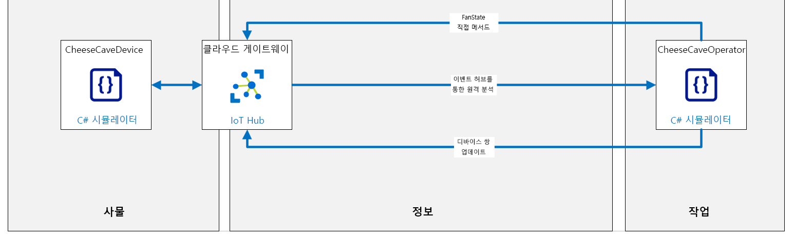

---
lab:
    title: '랩 15: Azure IoT Hub를 사용하여 원격으로 디바이스 모니터링 및 제어'
    module: '모듈 8: 디바이스 관리'
---

# Azure IoT Hub를 사용하여 원격으로 디바이스 모니터링 및 제어

## 랩 시나리오

Contoso는 수상 경력에 빛나는 치즈를 자랑스럽게 생각하며 전체 제조 공정에서 완벽한 온도와 습도를 유지하기 위해 주의를 기울이고 있지만 숙성 과정에서의 조건은 항상 특별한 주의를 기울였습니다.

최근 몇 년 동안 Contoso는 환경 센서를 사용하여 숙성이 진행되는 천연 치즈 동굴 내의 상태를 기록하고 이 데이터를 사용하여 거의 완벽한 환경을 식별했습니다. 가장 성공적인(일명 수상 생산) 위치의 데이터는 숙성 치즈에 대한 이상적인 온도는 약 50도 화씨 +/- 5도(10도 섭씨 +/- 2.8도)임을 나타냅니다. 최대 포화율로 측정되는 이상적인 습도 값은 약 85% +/- 10%입니다.

이러한 이상적인 온도 및 습도 값은 대부분의 치즈 유형에 적합합니다. 그러나 특히 딱딱하거나 특히 부드러운 치즈에는 사소한 변형이 필요합니다. 또한 원하는 치즈 껍질 상태와 같은 특정 결과를 얻기 위해 숙성 공정 내의 중요한 시기/단계에서 환경을 조정해야 합니다.

Contoso는 운 좋게도 거의 일년 내내 자연적으로 이상적인 상태를 유지하는 치즈 동굴(특정한 지리적 지역)을 운영할 수 있습니다. 그러나 이러한 위치에서도 숙성 과정 중에 환경을 관리하는 것이 중요합니다. 또한, 자연 동굴은 종종 여러 개의 다른 방을 가지고 있으며 각각의 방은 약간 다른 환경일 수 있습니다. 치즈 품종은 특정 요구 사항에 맞는 방(영역)에 배치됩니다. Contoso는 환경 조건을 원하는 한계 내에서 유지하기 위해 온도와 습도를 모두 제어하는 공기 처리/조절 시스템을 사용합니다.

현재 작업자는 동굴 시설의 각 영역 내의 환경 조건을 모니터링하고 원하는 온도와 습도를 유지하기 위해 필요한 경우 공기 처리 시스템 설정을 조정합니다. 작업자는 각 영역을 방문하여 4시간마다 환경 조건을 확인할 수 있습니다. 낮 최고 기온과 야간 최저 기온 사이에 기온이 급격히 변하는 지역에서는 조건이 원하는 한도를 벗어날 수 있습니다.

Contoso는 동굴 환경을 제어 한도 내에서 유지하는 자동화된 시스템을 구현하는 임무를 맡았습니다.

이 랩에서는 IoT 디바이스를 구현하는 치즈 동굴 모니터링 시스템을 프로토타이핑합니다. 각 디바이스에는 온도 및 습도 센서가 장착되어 있으며 디바이스가 있는 영역의 온도와 습도를 제어하는 공기 처리 시스템에 연결됩니다.

### 간소화된 랩 조건

원격 분석 출력의 빈도는 프로덕션 솔루션에서 중요한 고려 사항입니다. 냉장 장치의 온도 센서는 1분에 한 번만 보고해야 하는 반면 항공기의 가속도 센서는 초당 10회 보고해야 할 수 있습니다. 경우에 따라 원격 분석을 전송해야 하는 빈도는 현재 조건에 따라 다릅니다. 예를 들어, 치즈 동굴 시나리오의 기온이 야간에 빠르게 떨어지는 경향이 있는 경우, 일몰 2시간 전부터 센서 판독이 더 자주 발생하는 것이 도움이 될 수 있습니다. 물론 원격 분석 빈도를 변경해야 하는 요구 사항은 예측 가능한 패턴의 일부가 될 필요는 없으며, IoT 디바이스 설정을 변경해야 하는 이벤트는 예측할 수 없습니다.

이 랩에서는 간단하게 다음과 같은 가정을 합니다.

* 이 디바이스는 몇 초마다 원격 분석(온도 및 습도 값)을 IoT Hub로 전송합니다. 이러한 빈도는 치즈 창고에서는 실행하기 어렵지만, 15분 주기가 아니라 수시로 변경 사항을 확인해야 하는 랩 환경에 적합합니다.
* 공기 처리 시스템은 다음 세 가지 상태 중 하나에 해당하는 팬입니다. 켜기, 끄기 또는 실패.
  * 팬이 꺼져 있는 상태로 초기화됩니다.
  * IoT 디바이스에서 직접 메서드를 사용하여 팬에 대한 전력을 제어합니다(켜기/끄기).
  * 디바이스 쌍이 원하는 속성 값은 원하는 팬의 상태를 설정하는 데 사용됩니다. 원하는 속성 값은 팬/디바이스에 대한 기본 설정을 재정의합니다.
  * 팬을 켜기/끄기로 온도를 제어할 수 있습니다(팬을 켜면 온도가 낮아집니다).

이 랩의 코딩은 원격 분석 송수신, 직접 메서드 호출 및 실행, 디바이스 쌍 속성 설정 및 읽기의 세 부분으로 나뉩니다.

먼저 원격 분석을 전송하는 디바이스용 앱과 원격 분석을 수신하기 위해 클라우드에서 실행되는 백 엔드 서비스용 앱을 작성합니다.

다음의 리소스가 만들어집니다.



## 이 랩에서는

이 랩에서는 다음 활동을 완료할 예정입니다.

* 랩 필수 구성 요소 확인
* IoT Hub 포털을 사용하여 사용자 지정 Azure IoT Hub 만들기
* IoT Hub 포털을 사용하여 IoT Hub 디바이스 ID 만들기
* 사용자 지정 IoT Hub로 디바이스 원격 분석을 보낼 앱을 만듭니다.
* 원격 분석을 수신하는 백 엔드 서비스 앱 만들기
* 원격 디바이스에 설정을 전달하기 위한 직접 메서드 구현
* 원격 디바이스 속성을 유지하기 위해 디바이스 쌍 구현

## 랩 지침

### 연습 1: 랩 필수 구성 요소 확인

이 랩에서는 다음과 같은 Azure 리소스를 사용할 수 있다고 가정합니다.

| 리소스 종류 | 리소스 이름 |
| :-- | :-- |
| 리소스 그룹 | AZ-220-RG |
| IoT Hub | AZ-220-HUB-_{YOUR-ID}_ |
| IoT 디바이스 | CheeseCaveID |

이러한 리소스를 사용할 수 없는 경우, 연습 2로 이동하기 전에 아래의 설명에 따라 **lab15-setup.azcli** 스크립트를 실행해야 합니다. 스크립트 파일은 개발자 환경 구성(랩 3)의 일부로 로컬로 복제한 GitHub 리포지토리에 포함됩니다.

**lab15-setup.azcli** 스크립트는 **bash** 셸 환경에서 실행되도록 작성되었으며, 이를 실행하는 가장 쉬운 방법은 Azure Cloud Shell입니다.

>**참고:** **CheeseCaveID** 디바이스에 대한 연결 문자열이 필요합니다. 이 디바이스가 Azure IoT Hub에 이미 등록된 경우, Azure Cloud Shell에서 다음 명령을 실행하여 연결 문자열을 가져올 수 있습니다."
>
> ```bash
> az iot hub device-identity show-connection-string --hub-name AZ-220-HUB-{YOUR-ID} --device-id CheeseCaveID -o tsv
> ```

1. 브라우저를 사용하여 [Azure Shell](https://shell.azure.com/)을 열고 이 과정에 사용 중인 Azure 구독으로 로그인합니다.

    Cloud Shell에 대한 저장소 설정 관련 메시지가 표시되면 기본값을 수락합니다.

1. Azure Cloud Shell에서 **Bash**를 사용하고 있는지 확인합니다.

    Azure Cloud Shell 페이지의 왼쪽 상단에 있는 드롭다운으로 환경을 선택할 수 있습니다. 선택한 드롭다운 값이 **Bash**인지 확인합니다.

1. Azure Shell 도구 모음에서 **파일 업로드/다운로드**(오른쪽에서 네 번째 단추)를 클릭합니다.

1. 드롭다운에서 **업로드**를 클릭합니다.

1. 파일 선택 대화 상자에서 개발 환경을 구성할 때 다운로드한 GitHub 랩 파일의 폴더 위치로 이동합니다.

    _랩 3: 개발 환경 설정_, ZIP 파일을 다운로드하고 콘텐츠를 로컬로 추출하여 랩 리소스를 포함하는 GitHub 리포지토리를 복제했습니다. 추출된 폴더 구조는 다음 폴더 경로를 포함합니다.

    * Allfiles
      * 랩
          * 15-Azure IoT Hub를 사용하여 원격으로 디바이스 모니터링 및 제어
            * 설정

    lab15-setup.azcli 스크립트 파일은 랩 15의 설정 폴더에 있습니다.

1. **lab15-setup.azcli** 파일을 선택한 다음 **열기**를 클릭합니다.

    파일 업로드가 완료되면 알림이 나타납니다.

1. Azure Cloud Shell에 올바른 파일이 업로드되었는지 확인하려면 다음 명령을 입력합니다.

    ```bash
    ls
    ```

    `ls` 명령으로 현재 디렉터리의 내용을 나열합니다. lab15-setup.azcli 파일이 나열되어 야 합니다.

1. 설치 스크립트가 포함된 이 랩에 대한 디렉터리를 만든 다음 해당 디렉터리로 이동하려면 다음 Bash 명령을 입력합니다.

    ```bash
    mkdir lab15
    mv lab15-setup.azcli lab15
    cd lab15
    ```

1. **lab15-setup.azcli**에 실행 권한이 있는지 확인하려면 다음 명령을 입력합니다.

    ```bash
    chmod +x lab15-setup.azcli
    ```

1. Cloud Shell 도구 모음에서 lab15-setup.azcli 파일을 편집하려면 **편집기 열기**(오른쪽에서 두 번째 단추 - **{ }**)를 클릭합니다.

1. **파일** 목록에서 lab15 폴더를 펼치고 스크립트 파일을 열려면 **lab15**를 클릭한 다음 **lab15-setup.azcli**를 클릭합니다.

    이제 편집기에서 **lab15-setup.azcli** 파일의 내용이 표시됩니다.

1. 편집기에서 `{YOUR-ID}` 및 `SETLOCATION` 할당 값을 업데이트합니다.

    아래 샘플을 예로 들면, `{YOUR-ID}`를 이 과정의 시작 시 만든 고유 ID(예: **CAH191211**)로 설정하고 `SETLOCATION`을 리소스에 적합한 위치로 설정해야 합니다.

    ```bash
    #!/bin/bash

    YourID="{YOUR-ID}"
    RGName="AZ-220-RG"
    IoTHubName="AZ-220-HUB-$YourID"
    DeviceID="CheeseCaveID"

    Location="SETLOCATION"
    ```

    > **참고**:  `Location` 변수는 위치에 대해 짧은 이름으로 설정해야 합니다. 이 명령을 입력하면 사용 가능한 위치 및 짧은 이름(**이름** 열)의 목록을 볼 수 있습니다.
    >
    > ```bash
    > az account list-locations -o Table
    > ```
    >
    > ```text
    > 표시이름           위도    경도    이름
    > --------------------  ----------  -----------  ------------------
    > 동아시아             22.267      114.188      eastasia
    > 동남 아시아        1.283       103.833      southeastasia
    > 미국 중부            41.5908     -93.6208     centralus
    > 미국 동부               37.3719     -79.8164     eastus
    > 미국 동부 2             36.6681     -78.3889     eastus2
    > ```

1. 파일의 변경 내용을 저장하고 편집기를 닫으려면 편집기 창의 오른쪽 상단에서 ...를 클릭한 다음 **편집기 닫기**를 클릭합니다.

    저장하라는 메시지가 표시된 경우 **저장**을 클릭하면 편집기가 닫힙니다.

    > **참고**:  **CTRL+S**를 사용하여 언제든지 저장할 수 있으며 **CTRL+Q**를 사용하여 편집기를 닫을 수 있습니다.

1. 이 랩에 필요한 리소스를 만들려면 다음 명령을 입력합니다.

    ```bash
    ./lab15-setup.azcli
    ```

    이 스크립트를 실행하는 데 몇 분이 걸릴 수 있습니다. 각 단계가 완료되면 JSON 출력이 표시됩니다.

    스크립트는 먼저 **AZ-220-RG**라는 리소스 그룹과 **AZ-220-HUB-{YourID}** 라는 IoT Hub를 만듭니다. 이미 있는 경우 해당 메시지가 표시됩니다. 그런 다음 스크립트는 **CheeseCaveID**의 ID가 있는 디바이스를 IoT Hub에 추가하고 디바이스 연결 문자열을 표시합니다.

1. 스크립트가 완료되면 IoT Hub 및 디바이스와 관련된 정보가 표시됩니다.

    스크립트는 다음과 유사한 정보를 표시합니다.

    ```text
    구성 데이터:
    ------------------------------------------------
    AZ-220-HUB-{YourID} 서비스 연결 문자열:
    HostName=AZ-220-HUB-{YourID}.azure-devices.net;SharedAccessKeyName=iothubowner;SharedAccessKey=nV9WdF3Xk0jYY2Da/pz2i63/3lSeu9tkW831J4aKV2o=

    CheeseCaveID 디바이스 연결 문자열:
    HostName=AZ-220-HUB-{YourID}.azure-devices.net;DeviceId=CheeseCaveID;SharedAccessKey=TzAzgTYbEkLW4nWo51jtgvlKK7CUaAV+YBrc0qj9rD8=

    AZ-220-HUB-{YourID} 이벤트 허브 엔드포인트:
    sb://iothub-ns-az-220-hub-2610348-5a463f1b56.servicebus.windows.net/

    AZ-220-HUB-{YourID} 이벤트 허브 경로:
    az-220-hub-{YourID}

    AZ-220-HUB-{YourID} 이벤트 허브 SaS 기본 키:
    tGEwDqI+kWoZroH6lKuIFOI7XqyetQHf7xmoSf1t+zQ=
    ```

1. 이 랩의 후반부에서 사용할 수 있도록 스크립트로 표시된 출력을 텍스트 문서에 복사합니다.

    쉽게 찾을 수 있는 위치에 정보를 저장하면 랩을 계속할 수 있습니다.

### 연습 2: 원격 분석을 보내고 받을 코드 작성

이 연습에서는 IoT Hub로 원격 분석을 보내는 시뮬레이션된 디바이스 앱(CheeseCaveID 디바이스용)을 만듭니다.

#### 작업 1: Visual Studio Code에서 콘솔 앱 만들기

1. Visual Studio Code를 엽니다.

1. **터미널** 메뉴에서 **새 터미널**을 클릭합니다.

1. "cheesecavedevice"라는 디렉터리를 만들고 현재 디렉터리를 해당 디렉터리로 변경하려면 터미널 명령 프롬프트에서 다음 명령을 입력합니다.

    ```bash
    mkdir cheesecavedevice
    cd cheesecavedevice
    ```

1. 새 .NET 콘솔 애플리케이션을 만들려면 다음 명령을 입력합니다.

    ```bash
    dotnet new console
    ```

    이 명령은 프로젝트 파일과 함께 폴더에 **Program.cs** 파일을 만듭니다.

1. 필요한 라이브러리를 설치하려면 다음 명령을 입력합니다.

    ```bash
    dotnet add package Microsoft.Azure.Devices.Client
    dotnet add package Microsoft.Azure.Devices.Shared
    dotnet add package Newtonsoft.Json
    ```

1. **파일** 메뉴에서 **폴더 열기**를 클릭합니다.

1. **폴더 열기** 대화 상자에서 터미널 창에 지정된 폴더 위치로 이동한 다음 **cheesecavedevice**를 클릭하고 **폴더 선택**을 클릭합니다.

    탐색기 창은 Visual Studio Code에서 열리고 `Program.cs` 및 `cheesecadedevice.csproj` 파일이 나열되어 있어야 합니다.

1. **탐색기** 창에서 **Program.cs**를 클릭합니다.

1. 코드 편집기 창에서 Program.cs 파일의 내용을 삭제합니다.

#### 작업 2: CheeseCaveID IoT 디바이스를 시뮬레이션하는 코드 추가

이 작업에서는 시뮬레이션된 디바이스에서 원격 분석을 보낼 코드를 추가합니다. 이 디바이스는 백 엔드 앱이 수신 대기 중인지 여부에 관계없이 온도(화씨도) 및 습도(백분율)를 전송합니다.

1. Visual Studio Code에서 **Program.cs** 파일을 열려 있는지 확인합니다.

    코드 편집기 창에는 빈 코드 파일이 표시되어야 합니다.

1. 다음 코드를 코드 편집기 창에 복사하여 붙여넣습니다.

    ```csharp
    // Copyright (c) Microsoft. All rights reserved.
    // MIT 라이선스에 따라 라이선스가 부여되었습니다. 전체 라이선스 정보는 프로젝트 루트의 LICENSE 파일을 참조하세요.

    using System;
    using Microsoft.Azure.Devices.Client;
    using Microsoft.Azure.Devices.Shared;
    using Newtonsoft.Json;
    using System.Text;
    using System.Threading.Tasks;
    using Newtonsoft.Json.Linq;

    namespace simulated_device
    {
        class SimulatedDevice
        {
        // 전역 상수입니다.
            const float ambientTemperature = 70;                    // 남쪽 동굴의 주변 온도(F)입니다.
            const double ambientHumidity = 99;                      // 공기 포화도에 대한 상대적 비율의 주변 습도.
            const double desiredTempLimit = 5;                      //  원하는 온도보다 높거나 낮은 허용 범위(F)입니다.
            const double desiredHumidityLimit = 10;                 // 원하는 습도보다 높거나 낮은 허용 범위(백분율)입니다.
            const int intervalInMilliseconds = 5000;                // 원격 분석이 클라우드로 전송되는 간격입니다.

            // 전역 변수입니다.
            private static DeviceClient s_deviceClient;
            private static stateEnum fanState = stateEnum.off;                      // 팬의 초기 설정입니다.
            private static double desiredTemperature = ambientTemperature - 10;     // 원하는 초기 온도(F)입니다.
            private static double desiredHumidity = ambientHumidity - 20;           // 원하는 초기 습도를 공기 포화도의 상대적 백분율로 표시.

            // 냉각/난방 및 가습/제습용 팬 상태에 대한 열거형입니다.
            enum stateEnum
            {
                off,
                on,
                failed
            }

            // IoT Hub를 사용하여 디바이스를 인증하는 디바이스 연결 문자열입니다.
            private readonly static string s_deviceConnectionString = "<your device connection string>";

            private static void colorMessage(string text, ConsoleColor clr)
            {
                Console.ForegroundColor = clr;
                Console.WriteLine(text);
                Console.ResetColor();
            }
            private static void greenMessage(string text)
            {
                colorMessage(text, ConsoleColor.Green);
            }

            private static void redMessage(string text)
            {
                colorMessage(text, ConsoleColor.Red);
            }

            // 시뮬레이션된 원격 분석을 보내는 비동기 메서드입니다.
            private static async void SendDeviceToCloudMessagesAsync()
            {
                double currentTemperature = ambientTemperature;         // 온도의 초기 설정입니다.
                double currentHumidity = ambientHumidity;               // 습도의 초기 설정입니다.

                Random rand = new Random();

                while (true)
                {
                    // 원격 분석을 시뮬레이션합니다.
                    double deltaTemperature = Math.Sign(desiredTemperature - currentTemperature);
                    double deltaHumidity = Math.Sign(desiredHumidity - currentHumidity);

                    if (fanState == stateEnum.on)
                    {
                        // 팬이 해당 온도에 있는 경우 습도는 대부분의 경우 원하는 값으로 이동됩니다.
                        currentTemperature += (deltaTemperature * rand.NextDouble()) + rand.NextDouble() - 0.5;
                        currentHumidity += (deltaHumidity * rand.NextDouble()) + rand.NextDouble() - 0.5;

                        // 팬을 임의로 고장냅니다.
                        if (rand.NextDouble() < 0.01)
                        {
                            fanState = stateEnum.failed;
                            redMessage("Fan has failed");
                        }
                    }
                    else
                    {
                        // 팬이 꺼져 있거나 고장이 난 경우 온도와 습도가 주변 값에 도달할 때까지 서서히 올라간 후 무작위로 변동됩니다.
                        if (currentTemperature < ambientTemperature - 1)
                        {
                            currentTemperature += rand.NextDouble() / 10;
                        }
                        else
                        {
                            currentTemperature += rand.NextDouble() - 0.5;
                        }
                        if (currentHumidity < ambientHumidity - 1)
                        {
                            currentHumidity += rand.NextDouble() / 10;
                        }
                        else
                        {
                            currentHumidity += rand.NextDouble() - 0.5;
                        }
                    }

                    // 확인: 습도는 100%를 초과할 수 없습니다.
                    currentHumidity = Math.Min(100, currentHumidity);

                    // JSON 메시지를 만듭니다.
                    var telemetryDataPoint = new
                    {
                        temperature = Math.Round(currentTemperature, 2),
                        humidity = Math.Round(currentHumidity, 2)
                    };
                    var messageString = JsonConvert.SerializeObject(telemetryDataPoint);
                    var message = new Message(Encoding.ASCII.GetBytes(messageString));

                    // 메시지에 사용자 지정 애플리케이션 속성을 추가합니다.
                    message.Properties.Add("sensorID", "S1");
                    message.Properties.Add("fanAlert", (fanState == stateEnum.failed) ? "true", "false");

                    // 온도 또는 습도 경고가 발생하는 경우에만 보냅니다.
                    if ((currentTemperature > desiredTemperature + desiredTempLimit) || (currentTemperature < desiredTemperature - desiredTempLimit))
                    {
                        message.Properties.Add("temperatureAlert", "true");
                    }
                    if ((currentHumidity > desiredHumidity + desiredHumidityLimit) || (currentHumidity < desiredHumidity - desiredHumidityLimit))
                    {
                        message.Properties.Add("humidityAlert", "true");
                    }

                    Console.WriteLine("Message data: {0}", messageString);

                    // 원격 분석 메시지를 보냅니다.
                    await s_deviceClient.SendEventAsync(message);
                    greenMessage("Message sent\n");

                    await Task.Delay(intervalInMilliseconds);
                }
            }
            private static void Main(string[] args)
            {
                colorMessage("Cheese Cave device app.\n", ConsoleColor.Yellow);

                // MQTT 프로토콜을 사용하여 IoT Hub에 연결합니다.
                s_deviceClient = DeviceClient.CreateFromConnectionString(s_deviceConnectionString, TransportType.Mqtt);

                SendDeviceToCloudMessagesAsync();
                Console.ReadLine();
            }
        }
    }
    ```

1. 코드를 검토하는 데 몇 분 정도 걸립니다.

    > **중요:** 코드의 주석을 읽으면서 치즈 동굴 시나리오의 온도 및 습도 설정이 코드에 어떻게 적용되었는지 주목합니다.

1. 디바이스 연결 문자열을 할당하는 데 사용되는 코드 줄 찾기

    ```csharp
    private readonly static string s_deviceConnectionString = "<your device connection string>";
    ```

1. `<your device connection string>`을 이전에 랩에서 저장한 CheeseCaveID 디바이스 연결 문자열로 바꿉니다.

    연습 1 중에 lab15-setup.azcli 설치 스크립트에서 생성된 출력을 저장해야 합니다.

    다른 코드 줄은 변경할 필요가 없습니다.

1. **파일** 메뉴에서 변경 내용을 Program.cs 파일에 저장하려면 **저장**을 클릭합니다.

#### 작업 3: 원격 분석 전송 코드 테스트

1. Visual Studio Code에서 터미널이 열려 있는지 확인합니다.

1. 시뮬레이션된 디바이스 앱을 실행하려면 터미널 명령 프롬프트에서 다음 명령을 입력합니다.

    ```bash
    dotnet run
    ```

   이 명령은 현재 폴더에서 **Program.cs** 파일을 실행합니다.

1. 터미널로 전송되는 출력을 확인합니다.

    다음과 유사한 콘솔 출력을 빠르게 확인해야 합니다.


    > **참고**:  녹색 텍스트는 정상 작동을, 빨간색 텍스트는 문제가 발생했음을 의미합니다. 이 이미지와 유사한 화면이 없는 경우 디바이스 연결 문자열을 확인하여 시작합니다.

1. 이 앱을 실행 상태로 둡니다.

    이 랩의 후반부에 IoT Hub로 원격 분석을 보내야 합니다.

### 연습 3: 원격 분석을 받을 두 번째 앱 만들기

이제 IoT Hub로 원격 분석을 보내는 시뮬레이션된 CheeseCaveID 디바이스가 있으므로 IoT Hub에 연결하고 해당 원격 분석을 "수신 대기"할 수 있는 백 엔드 앱을 만들어야 합니다. 결국 이 백 엔드 앱은 치즈 동굴의 온도를 자동으로 제어하는 데 사용됩니다.

#### 작업 1: 원격 분석을 수신할 앱 만들기

1. Visual Studio Code의 새 인스턴스를 엽니다.

    이미 열려 있는 Visual Studio Code 창에서 시뮬레이션된 디바이스 앱이 실행 중이므로 백 엔드 앱에 대한 Visual Studio Code의 새 인스턴스가 필요합니다.

1. **터미널** 메뉴에서 **새 터미널**을 클릭합니다.

1. 터미널 명령 프롬프트에서 "cheesecaveoperator"라는 디렉터리를 만들고 현재 디렉터리를 해당 디렉토리로 변경하려면 다음 명령을 입력합니다.

   ```bash
   mkdir cheesecaveoperator
   cd cheesecaveoperator
   ```

1. 새 .NET 콘솔 애플리케이션을 만들려면 다음 명령을 입력합니다.

    ```bash
    dotnet new console
    ```

    이 명령은 프로젝트 파일과 함께 폴더에 **Program.cs** 파일을 만듭니다.

1. 필요한 라이브러리를 설치하려면 다음 명령을 입력합니다.

    ```bash
    dotnet add package Microsoft.Azure.EventHubs
    dotnet add package Microsoft.Azure.Devices
    dotnet add package Newtonsoft.Json
    ```

1. **파일** 메뉴에서 **폴더 열기**를 클릭합니다.

1. **폴더 열기** 대화 상자에서 터미널 창에 지정된 폴더 위치로 이동한 다음 **cheesecaveoperator**를 클릭하고 **폴더 선택**을 클릭합니다.

    탐색기 창은 Visual Studio Code에서 열리고 `Program.cs` 및 `cheesecaveoperator.csproj` 파일이 나열되어 있어야 합니다.

1. **탐색기** 창에서 **Program.cs**를 클릭합니다.

1. 코드 편집기 창에서 Program.cs 파일의 콘텐츠를 삭제합니다.

#### 작업 2: 원격 분석을 수신하는 코드 추가

이 작업에서는 IoT Hub 이벤트 허브 엔드포인트에서 원격 분석을 수신하는 데 사용할 백 엔드 앱에 코드를 추가합니다.

1. Visual Studio Code에서 **Program.cs** 파일을 열려 있는지 확인합니다.

    코드 편집기 창에는 빈 코드 파일이 표시되어야 합니다.

1. 다음 코드를 코드 편집기 창에 복사하여 붙여넣습니다.

    ```csharp
    // Copyright (c) Microsoft. All rights reserved.
    // MIT 라이선스에 따라 라이선스가 부여되었습니다. 전체 라이선스 정보는 프로젝트 루트의 LICENSE 파일을 참조하세요.

    using System;
    using System.Threading.Tasks;
    using System.Text;
    using System.Collections.Generic;
    using System.Linq;

    using Microsoft.Azure.EventHubs;
    using Microsoft.Azure.Devices;
    using Newtonsoft.Json;

    namespace cheesecave_operator
    {
        class ReadDeviceToCloudMessages
        {
            // 전역 변수입니다.
            // Event Hub 호환 엔드포인트입니다.
            private readonly static string s_eventHubsCompatibleEndpoint = "<your event hub endpoint>";

            // Event Hub 호환 이름입니다.
            private readonly static string s_eventHubsCompatiblePath = "<your event hub path>";
            private readonly static string s_iotHubSasKey = "<your event hub Sas key>";
            private readonly static string s_iotHubSasKeyName = "service";
            private static EventHubClient s_eventHubClient;

            // IoT Hub의 연결 문자열입니다.
            private readonly static string s_serviceConnectionString = "<your service connection string>";

            // 비동기적으로 파티션에 대한 PartitionReceiver를 만든 다음 시뮬레이션된 클라이언트에서 보낸 메시지를 읽기 시작합니다.
            private static async Task ReceiveMessagesFromDeviceAsync(string partition)
            {
                // 기본 소비자 그룹을 사용하여 받는 사람을 만듭니다.
                var eventHubReceiver = s_eventHubClient.CreateReceiver("$Default", partition, EventPosition.FromEnqueuedTime(DateTime.Now));
                Console.WriteLine("Created receiver on partition: " + partition);

                while (true)
                {
                    // EventData 확인 - 검색할 항목이 없으면 이 메서드가 시간 초과됩니다.
                    var events = await eventHubReceiver.ReceiveAsync(100);

                    // 일괄 처리에 데이터가 있는 경우 처리합니다.
                    if (events == null) continue;

                    foreach (EventData eventData in events)
                    {
                        string data = Encoding.UTF8.GetString(eventData.Body.Array);

                        greenMessage("Telemetry received: " + data);

                        foreach (var prop in eventData.Properties)
                        {
                            if (prop.Value.ToString() == "true")
                            {
                                redMessage(prop.Key);
                            }
                        }
                        Console.WriteLine();
                    }
                }
            }

            public static void Main(string[] args)
            {
                colorMessage("Cheese Cave Operator\n", ConsoleColor.Yellow);

                // IoT Hub Event Hubs호환 엔드포인트에 연결하기 위해 EventHubClient 인스턴스를 만듭니다.
                var connectionString = new EventHubsConnectionStringBuilder(new Uri(s_eventHubsCompatibleEndpoint), s_eventHubsCompatiblePath, s_iotHubSasKeyName, s_iotHubSasKey);
                s_eventHubClient = EventHubClient.CreateFromConnectionString(connectionString.ToString());

                // 허브의 각 파티션에 대해 PartitionReceiver를 만듭니다.
                var runtimeInfo = s_eventHubClient.GetRuntimeInformationAsync().GetAwaiter().GetResult();
                var d2cPartitions = runtimeInfo.PartitionIds;

                // 메시지를 수신하는 수신기를 만듭니다.
                var tasks = new List<Task>();
                foreach (string partition in d2cPartitions)
                {
                    tasks.Add(ReceiveMessagesFromDeviceAsync(partition));
                }

                // 모든 PartitionReceivers가 완료될 때까지 기다립니다.
                Task.WaitAll(tasks.ToArray());
            }

            private static void colorMessage(string text, ConsoleColor clr)
            {
                Console.ForegroundColor = clr;
                Console.WriteLine(text);
                Console.ResetColor();
            }
            private static void greenMessage(string text)
            {
                colorMessage(text, ConsoleColor.Green);
            }

            private static void redMessage(string text)
            {
                colorMessage(text, ConsoleColor.Red);
            }
        }
    }
    ```

1. 코드를 검토하는 데 몇 분 정도 걸립니다.

    > **중요:** 코드의 주석을 읽습니다. 백 엔드 앱이 시작된 후에만 메시지를 읽도록 구현되었습니다. 이전에 전송된 모든 원격 분석은 처리되지 않습니다.

1. 서비스 연결 문자열을 할당하는 데 사용되는 코드 줄 찾기

    ```csharp
    private readonly static string s_serviceConnectionString = "<your service connection string>";
    ```

1. `<your service connection string>`을 이 랩의 앞 부분에서 저장한 IoT Hub **iothubowner** 공유 액세스 정책 기본 연결 문자열로 바꿉니다.

    연습 1 중에 lab15-setup.azcli 설치 스크립트에서 생성된 출력을 저장해야 합니다.

    > **참고**: **서비스** 공유 정책 대신 **iothubowner** 공유 정책을 사용하는 이유가 궁금할 수 있습니다. 대답은 각 정책에 할당된 IoT Hub 사용 권한과 관련이 있습니다. **서비스** 정책에는 **ServiceConnect** 권한이 있으며 일반적으로 백 엔드 클라우드 서비스에서 사용됩니다. 다음과 같은 권한을 부여합니다.
    >
    > * 클라우드 서비스 대면 통신 및 모니터링 엔드포인트에 대한 액세스 권한을 부여합니다.
    > * 디바이스-클라우드 메시지를 수신하고, 클라우드-디바이스 메시지를 전송하고, 해당 배달 승인을 검색할 수 있는 권한을 허용합니다.
    > * 파일 업로드에 대한 배달 승인을 검색할 수 있는 권한을 허용합니다.
    > * 쌍에 액세스하여 태그 및 원하는 속성을 업데이트하고 보고된 속성을 검색하며 쿼리를 실행할 수 있는 권한을 허용합니다.
    >
    > **serviceoperator** 애플리케이션이 팬 상태를 전환하는 직접 메서드를 호출하는 랩의 첫 번째 부분의 경우 **서비스** 정책에 충분한 권한이 있습니다. 그러나 랩의 후반부에서는 디바이스 레지스트리가 쿼리됩니다. 이는 `RegistryManager` 클래스를 통해 이루어집니다. `RegistryManager` 클래스를 사용하여 디바이스 레지스트리를 쿼리하려면 IoT Hub에 연결하는 데 사용되는 공유 액세스 정책에 **레지스트리 읽기** 권한이 있어야 하며, 이 권한은 다음과 같습니다.
    >
    > * ID 레지스트리에 대한 읽기 권한을 부여합니다.
    >
    > **iothubowner** 정책은 **레지스트리 쓰기** 권한이 허용되어 **레지스트리 읽기** 권한이 상속되었으므로 우리의 요구에 적합합니다.
    >
    > 프로덕션 시나리오에서 **서비스 연결** 및 **레지스트리 읽기** 권한만 있는 새 공유 액세스 정책을 추가하는 것이 좋습니다.

1. `<your event hub endpoint>`, `<your event hub path>` 및 `<your event hub Sas key>`를 이 랩의 앞 부분에서 저장한 값으로 바꿉니다.

1. **파일** 메뉴에서 변경 내용을 Program.cs 파일에 저장하려면 **저장**을 클릭합니다.

#### 작업 3: 원격 분석을 수신하도록 코드 테스트

이 테스트는 백 엔드 앱이 시뮬레이션된 디바이스에서 전송되는 원격 분석을 선택하는지 여부를 확인하는 것이 중요합니다. 디바이스 앱이 여전히 실행 중이며 원격 분석을 전송하고 있다는 것을 기억하세요.

1. 터미널에서 `cheesecaveoperator` 백 엔드 앱을 실행하려면 터미널 창을 열고 다음 명령을 입력합니다.

    ```bash
    dotnet run
    ```

   이 명령은 현재 폴더에서 **Program.cs** 파일을 실행합니다.

   > **참고**:  사용되지 않는 변수 `s_serviceConnectionString`에 대한 경고를 무시해도 되며 곧 해당 변수를 사용할 예정입니다.

1. 잠시 시간을 내어 터미널로 출력되는 것을 관찰합니다.

    콘솔 출력을 빠르게 볼 수 있으며 IoT Hub에 성공적으로 연결되면 앱에 원격 분석 메시지 데이터가 거의 즉시 표시됩니다.

    그렇지 않은 경우 IoT Hub 서비스 연결 문자열을 주의 깊게 확인합니다. 이 문자열은 다른 문자열이 아닌 서비스 연결 문자열이어야 합니다.


    > **참고**:  녹색 텍스트는 정상 작동을, 빨간색 텍스트는 문제가 발생했음을 의미합니다. 이 이미지와 유사한 화면이 없는 경우 디바이스 연결 문자열을 확인하여 시작합니다.

1. 이 앱을 잠시 더 실행 상태로 둡니다.

1. 두 앱을 모두 실행 중인 경우 수신되는 원격 분석과 전송되는 원격 분석을 시각적으로 비교합니다.

    * 정확한 데이터 일치가 있나요?
    * 데이터를 전송하는 시간과 수신되는 시간 사이에 많은 지연이 있나요?

    만족되면 실행 중인 앱을 중지한 다음 VS Code의 두 인스턴스 모두에서 터미널 창을 닫습니다. Visual Studio Code 창을 닫지 마세요.

    이제 디바이스에서 원격 분석을 보내는 앱과 데이터 수신을 확인하는 백 엔드 앱이 있습니다. 이 단원은 시나리오의 모니터링 측면을 다룹니다. 다음 단계에서는 제어 측면(데이터에 문제가 발생했을 때 수행할 작업)을 처리합니다. 분명히 문제가 있습니다, 온도와 습도 경고를 받고 있습니다!

### 연습 4: 직접 메서드를 호출하는 코드 작성

이 연습에서는 치즈 동굴에서 팬을 켜는 것을 시뮬레이션하는 직접 메서드에 대한 코드를 추가하여 디바이스 앱을 업데이트합니다. 그런 다음 백 엔드 서비스 앱에 코드를 추가하여 이 직접 메서드를 호출합니다.

직접 메서드를 호출하는 백 엔드 앱의 호출에는 페이로드의 일부로 여러 매개 변수가 포함될 수 있습니다. 직접 메서드는 일반적으로 디바이스의 기능을 끄고 켜거나 디바이스에 대한 설정을 지정하는 데 사용됩니다.

#### 오류 조건 처리

디바이스가 직접 메서드를 실행하기 위한 지침을 받을 때 확인해야 하는 몇 가지 오류 조건이 있습니다. 이러한 검사 중 하나는 팬이 실패한 상태에 있는 경우 오류로 응답하는 것입니다. 보고할 또 다른 오류 조건은 잘못된 매개 변수를 수신하는 경우입니다. 디바이스의 잠재적 원격성을 감안할 때 명확한 오류 보고가 중요합니다.

#### 직접 메서드 호출

직접 메서드는 백 엔드 앱에서 매개 변수를 준비한 다음 메서드를 호출하기 위해 단일 디바이스를 지정하는 호출을 수행해야 합니다. 그런 다음 백 엔드 앱은 응답을 기다렸다가 보고합니다.

디바이스 앱에는 직접 메서드에 대한 기능 코드가 포함되어 있습니다. 기능 이름은 디바이스의 IoT 클라이언트에 등록됩니다. 이 프로세스를 통해 클라이언트는 IoT Hub에서 호출될 때 실행할 함수를 알 수 있습니다(많은 직접 메서드가 있을 수 있음).

#### 작업 1: 디바이스 앱에서 직접 메서드를 정의하는 코드 추가

1. **cheesecavedevice** 앱을 실행하는 Visual Studio Code 인스턴스로 반환합니다.

    > **참고**: 앱이 계속 실행 중인 경우 터미널 창에 입력 포커스를 배치하고 **CTRL+C**를 눌러 앱을 종료합니다.

1. 코드 편집기에서 **Program.cs**가 열려 있는지 확인합니다.

1. 코드 편집기 창에서 **SimulatedDevice** 클래스의 아래쪽을 찾습니다.

1. 직접 메서드를 정의하려면 **SimulatedDevice** 클래스의 닫는 중괄호(`}`) 안에 다음 코드를 추가합니다.

    ```csharp
    // 직접 메서드 호출 처리
    private static Task<MethodResponse> SetFanState(MethodRequest methodRequest, object userContext)
    {
        if (fanState == stateEnum.failed)
        {
            // 400 오류 메시지가 있는 직접 메서드 호출을 승인합니다.
            string result = "{\"result\":\"Fan failed\"}";
            redMessage("Direct method failed: " + result);
            return Task.FromResult(new MethodResponse(Encoding.UTF8.GetBytes(result), 400));
        }
        else
        {
            try
            {
                var data = Encoding.UTF8.GetString(methodRequest.Data);

                // 데이터에서 따옴표를 제거합니다.
                data = data.Replace("\"", "");

                // 페이로드를 구문 분석하고 유효하지 않은 경우 예외를 트리거합니다.
                fanState = (stateEnum)Enum.Parse(typeof(stateEnum), data);
                greenMessage("Fan set to: " + data);

                // 200 성공 메시지와 함께 직접 메서드 호출을 승인합니다.
                string result = "{\"result\":\"Executed direct method: " + methodRequest.Name + "\"}";
                return Task.FromResult(new MethodResponse(Encoding.UTF8.GetBytes(result), 200));
            }
            catch
            {
                // 400 오류 메시지가 있는 직접 메서드 호출을 승인합니다.
                string result = "{\"result\":\"Invalid parameter\"}";
                redMessage("Direct method failed: " + result);
                return Task.FromResult(new MethodResponse(Encoding.UTF8.GetBytes(result), 400));
            }
        }
    }
    ```

    > **참고**:  이 코드는 직접 메서드의 구현을 정의하며 직접 메서드가 호출될 때 실행됩니다. 팬에는 세 가지 상태가 있습니다. *켜기*, *끄기* 및 *실패*입니다. 위의 방법은 팬을 *켜기* 또는 *끄기*로 설정합니다. 페이로드 텍스트가 이러한 두 설정 중 하나와 일치하지 않거나 팬이 실패한 상태인 경우 오류가 반환됩니다.

1. 코드 편집기 창에서 약간 위로 스크롤하여 **Main** 메서드를 찾습니다.

1. **Main** 메서드 내에서 디바이스 클라이언트를 만든 직후 빈 코드 줄에 커서를 둡니다.

1. 직접 메서드를 등록하려면 다음 코드를 추가합니다.

    ```csharp
    // 직접 메서드 호출에 대한 처리기 만들기
    s_deviceClient.SetMethodHandlerAsync("SetFanState", SetFanState, null).Wait();
    ```

    코드를 추가한 후 **Main** 메서드는 다음과 같습니다.

    ```csharp
    private static void Main(string[] args)
    {
        colorMessage("Cheese Cave device app.\n", ConsoleColor.Yellow);

        // MQTT 프로토콜을 사용하여 IoT Hub에 연결합니다.
        s_deviceClient = DeviceClient.CreateFromConnectionString(s_deviceConnectionString, TransportType.Mqtt);

        // 직접 메서드 호출에 대한 처리기 만들기
        s_deviceClient.SetMethodHandlerAsync("SetFanState", SetFanState, null).Wait();

        SendDeviceToCloudMessagesAsync();
        Console.ReadLine();
    }
    ```

1. **파일** 메뉴에서 Program.cs 파일을 저장하려면 **저장**을 클릭합니다.

이제 디바이스 측에서 필요한 코딩을 완료했습니다. 그런 다음 직접 메서드를 호출하는 백 엔드 서비스에 코드를 추가해야 합니다.

#### 작업 2: 직접 메서드를 호출하는 코드 추가

1. **cheesecaveoperator** 앱을 실행하는 Visual Studio Code 인스턴스로 돌아갑니다.

    > **참고**: 앱이 계속 실행 중인 경우 터미널 창에 입력 포커스를 배치하고 **CTRL+C**를 눌러 앱을 종료합니다.

1. 코드 편집기에서 **Program.cs**가 열려 있는지 확인합니다.

1.  **ReadDeviceToCloudMessages** 클래스의 맨 위에서 전역 변수 목록에 다음 코드를 추가합니다.

    ```csharp
    private static ServiceClient s_serviceClient;
    ```

1. **Main** 메서드를 찾으려면 아래로 스크롤합니다.

1. **Main** 메서드 아래의 빈 코드 줄에 다음 작업을 추가합니다.

    ```csharp
    // 직접 메서드를 호출하는 핸들입니다.
    private static async Task InvokeMethod()
    {
        시도
        {
            var methodInvocation = new CloudToDeviceMethod("SetFanState") { ResponseTimeout = TimeSpan.FromSeconds(30) };
            string payload = JsonConvert.SerializeObject("on");

            methodInvocation.SetPayloadJson(payload);

            // 직접 메서드를 비동기적으로 호출하고 시뮬레이션된 디바이스에서 응답을 가져옵니다.
            var response = await s_serviceClient.InvokeDeviceMethodAsync("CheeseCaveID", methodInvocation);

            if (response.Status == 200)
            {
                greenMessage("Direct method invoked: " + response.GetPayloadAsJson());
            }
            else
            {
                redMessage("Direct method failed: " + response.GetPayloadAsJson());
            }
        }
        catch
        {
            redMessage("Direct method failed: timed-out");
        }
    }
    ```

    > **참고**: 이 코드는 디바이스 앱에서 **SetFanState** 직접 메서드를 호출하는 데 사용됩니다.

1. **Main** 메서드 내에서 커서를 `Create receivers to listen for messages` 주석 바로 위의 빈 코드 줄에 둡니다.

1. 메시지를 수신 대기하기 위해 수신기를 만드는 코드 앞에 다음 코드를 추가합니다.

    ```csharp
    // ServiceClient를 만들어 허브의 서비스 연결 엔드포인트와 통신합니다.
    s_serviceClient = ServiceClient.CreateFromConnectionString(s_serviceConnectionString);
    InvokeMethod().GetAwaiter().GetResult();
    ```

    > **참고**: 이 코드는 IoT Hub에 연결하는 데 사용하는 ServiceClient 개체를 만듭니다. IoT Hub에 연결하면 디바이스에서 직접 메서드를 호출할 수 있습니다.

1. **파일** 메뉴에서 Program.cs 파일을 저장하려면 **저장**을 클릭합니다.

이제 **SetFanState** 직접 메서드를 지원하기 위해 코드를 변경했습니다.

#### 작업 3: 직접 메서드 테스트

직접 메서드를 테스트하려면 올바른 순서로 앱을 시작해야 합니다. 등록되지 않은 직접 메서드를 호출할 수 없습니다!

1. **cheesecavedevice** 디바이스 앱을 시작합니다.

    터미널에 쓰기가 시작되고 원격 분석이 나타납니다.

1. **cheesecaveoperator** 백 엔드 앱을 시작합니다.

    > **참고**:  `직접 메서드 실패: 시간 초과`라는 메시지가 표시되면 **cheesecavedevice**의 변경 내용을 저장하고 앱을 시작했는지 다시 한 번 확인합니다.

    cheesecaveoperator 백 엔드 앱은 즉시 직접 메서드를 호출합니다.

    다음과 유사한 출력을 확인합니다.


1. 이제 **cheesecavedevice** 디바이스 앱에 대한 콘솔 출력을 확인합니다. 팬은 켜져 있어야 합니다.


이제 원격 디바이스를 성공적으로 모니터링하고 제어할 수 있습니다. 클라우드에서 호출할 수 있는 디바이스에서 직접 메서드를 구현했습니다. 이 시나리오에서는 직접 메서드를 사용하여 팬을 켜고 동굴의 환경을 원하는 대로 설정합니다.

치즈 동굴 환경에 대해 원하는 설정을 원격으로 지정하려면 어떻게 해야 하나요? 아마도 숙성 과정의 특정 시점에 치즈 동굴에 대한 특정 목표 온도를 설정하고 싶을 것입니다. 직접 메서드를 사용하여 원하는 설정을 지정하거나(올바른 방법) 디바이스 쌍이라는 IoT Hub의 다른 기능을 사용할 수 있습니다. 다음 연습에서는 솔루션 내에서 디바이스 쌍 속성을 구현하는 작업을 수행합니다.

### 연습 5: 디바이스 쌍에 대한 코드 작성

이 연습에서는 디바이스 앱과 백 엔드 서비스 앱 모두에 일부 코드를 추가하여 디바이스 쌍 동기화가 작업 중인 것을 보여줍니다.

디바이스 쌍에는 다음 네 가지 유형의 정보가 포함되어 있습니다.

* **태그**: 디바이스에 표시되지 않는 디바이스의 정보입니다.
* **원하는 속성**: 백 엔드 앱에서 지정한 원하는 설정입니다.
* **보고된 속성**: 보고된 디바이스의 설정 값입니다.
* **디바이스 ID 속성**: 디바이스를 식별하는 읽기 전용 정보입니다.

IoT Hub를 통해 관리되는 디바이스 쌍은 쿼리용으로 설계되었으며 실제 IoT 디바이스와 동기화됩니다. 디바이스 쌍은 백 엔드 앱에서 언제든지 쿼리할 수 있습니다. 이 쿼리는 디바이스에 대한 현재 상태 정보를 반환할 수 있습니다. 디바이스와 쌍이 동기화되기 때문에 이 데이터를 가져오는 것은 디바이스에 대한 호출을 수반하지 않습니다. 디바이스 쌍의 대부분의 기능은 Azure IoT Hub에서 제공되므로 이를 사용하기 위해 많은 코드를 작성할 필요가 없습니다.

디바이스 쌍과 직접 메서드의 기능 사이에는 약간의 중복이 있습니다. 직접 메서드를 사용하여 디바이스 속성을 설정할 수 있는데 이는 직관적인 방식으로 보일 수 있습니다. 그러나 직접 메서드를 사용하려면 백 엔드 앱에 액세스해야 할 경우 해당 설정을 명시적으로 기록해야 합니다. 디바이스 쌍을 사용하면 이 정보는 기본적으로 저장되고 유지됩니다.

#### 작업 1: 디바이스 쌍을 사용하여 디바이스 속성을 동기화하는 코드 추가

1. **cheesecaveoperator** 백 엔드 앱을 실행하는 Visual Studio Code 인스턴스로 돌아갑니다.

1. 앱이 계속 실행 중인 경우 터미널에 입력 포커스를 배치하고 **CTRL+C**를 눌러 앱을 종료합니다.

1. **Program.cs**가 열려 있는지 확인합니다.

1. 코드 편집기 창에서 **ReadDeviceToCloudMessages** 클래스의 아래쪽을 찾습니다.

1. **ReadDeviceToCloudMessages** 클래스의 닫는 중괄호 바로 위에 다음 코드를 추가합니다.

    ```csharp
    // 디바이스 쌍 섹션입니다.
    private static RegistryManager registryManager;

    private static async Task SetTwinProperties()
    {
        var twin = await registryManager.GetTwinAsync("CheeseCaveID");
        var patch =
            @"{
                tags: {
                    customerID: 'Customer1',
                    cellar: 'Cellar1'
                },
                properties: {
                    desired: {
                        patchId: 'set values',
                        temperature: '50',
                        humidity: '85'
                    }
                }
        }";
        await registryManager.UpdateTwinAsync(twin.DeviceId, patch, twin.ETag);

        var query = registryManager.CreateQuery(
          "SELECT * FROM devices WHERE tags.cellar = 'Cellar1'", 100);
        var twinsInCellar1 = await query.GetNextAsTwinAsync();
        Console.WriteLine("Devices in Cellar1: {0}",
          string.Join(", ", twinsInCellar1.Select(t => t.DeviceId)));

    }
    ```

    > **참고**:  **SetTwinProperties** 메서드는 디바이스 쌍에 추가될 태그 및 속성을 정의한 다음 쌍이 업데이트되는 JSON 조각을 만듭니다. 메서드의 다음 부분에서는 **cellar** 태그가 "Cellar1"로 설정된 디바이스를 나열하기 위해 쿼리를 수행할 수 있는 방법을 보여줍니다. 이 쿼리는 연결에 **레지스트리 읽기** 권한이 있어야 합니다.

1. 코드 편집기 창에서 위로 스크롤하여 **Main** 메서드를 찾습니다.

1. **Main** 메서드에서 서비스 클라이언트를 만드는 코드 줄을 찾습니다.

1. 코드에서 서비스 클라이언트를 만들기 전에 다음 코드를 추가합니다.

    ```csharp
    // 레지스트리 관리자는 Digital Twins에 액세스하는 데 사용됩니다.
    registryManager = RegistryManager.CreateFromConnectionString(s_serviceConnectionString);
    SetTwinProperties().Wait();
    ```

    > **참고**: Main 메서드에 포함된 주석을 읽습니다.

1. **파일** 메뉴에서 Program.cs 파일을 저장하려면 **저장**을 클릭합니다.

#### 작업 2: 디바이스에 대한 디바이스 쌍 설정을 동기화하는 코드 추가

1. **cheesecavedevice** 앱을 실행하는 Visual Studio Code 인스턴스로 반환합니다.

1. 앱이 계속 실행 중인 경우 터미널에 입력 포커스를 배치하고 **CTRL+C**를 눌러 앱을 종료합니다.

1. 코드 편집기 창에서 **Program.cs** 파일이 열려 있는지 확인합니다.

1. 코드 편집기 창에서 아래로 스크롤하여 **SimulatedDevice** 클래스의 끝을 찾습니다.

1. **SimulatedDevice** 클래스의 닫는 구부러진 중괄호 안에 다음 코드를 추가합니다.

    ```csharp
    private static async Task OnDesiredPropertyChanged(TwinCollection desiredProperties, object userContext)
    {
        try
        {
            desiredHumidity = desiredProperties["humidity"];
            desiredTemperature = desiredProperties["temperature"];
            greenMessage("Setting desired humidity to " + desiredProperties["humidity"]);
            greenMessage("Setting desired temperature to " + desiredProperties["temperature"]);

            // 속성을 IoT Hub에 다시 보고합니다.
            var reportedProperties = new TwinCollection();
            reportedProperties["fanstate"] = fanState.ToString();
            reportedProperties["humidity"] = desiredHumidity;
            reportedProperties["temperature"] = desiredTemperature;
            await s_deviceClient.UpdateReportedPropertiesAsync(reportedProperties);

            greenMessage("\nTwin state reported: " + reportedProperties.ToJson());
        }
        catch
        {
            redMessage("Failed to update device twin");
        }
    }
    ```

    > **참고**: 이 코드는 디바이스 쌍에서 원하는 속성이 변경될 때 호출되는 처리기를 정의합니다. 그러면 새 값이 IoT Hub에 다시 보고되어 변경 사항을 확인합니다.

1. 코드 편집기 창에서 **Main** 메서드까지 위로 스크롤합니다.

1. **Main** 메서드 내에서 직접 메서드에 대한 처리기를 만드는 코드를 찾습니다.

1. 커서를 직접 메서드의 처리기 아래 빈 줄에 둡니다.

1. 원하는 속성 변경 처리기를 등록하려면 다음 코드를 추가합니다.

    ```csharp
    // 디바이스 쌍이 원하는 초기 속성을 보고하도록 가져옵니다.
    Twin deviceTwin = s_deviceClient.GetTwinAsync().GetAwaiter().GetResult();
    greenMessage("Initial twin desired properties: " + deviceTwin.Properties.Desired.ToJson());

    // 디바이스 쌍 업데이트 콜백을 설정합니다.
    s_deviceClient.SetDesiredPropertyUpdateCallbackAsync(OnDesiredPropertyChanged, null).Wait();
    ```

1. **파일** 메뉴에서 Program.cs 파일을 저장하려면 **저장**을 클릭합니다.

    > **참고**:  이제 앱에 디바이스 쌍에 대한 지원을 추가했으며 **desiredHumidity**와 같은 명시적 변수를 포함하는 것을 다시 고려할 수 있습니다. 대신 디바이스 쌍 개체의 변수를 사용할 수 있습니다.

#### 작업 3: 디바이스 쌍 테스트

메서드를 테스트하려면 앱을 올바른 순서로 시작합니다.

1. **cheesecavedevice** 디바이스 앱을 시작합니다. 터미널에 쓰기가 시작되고 원격 분석이 나타납니다.

1. **cheesecaveoperator** 백 엔드 앱을 시작합니다.

1. **cheesecavedevice** 디바이스 앱에 대한 콘솔 출력을 확인하고 디바이스 쌍이 올바르게 동기화되어 있는지 확인합니다.


    팬이 작동되도록 두려면 결국 빨간색 경고를 제거해야 합니다!


1. Visual Studio Code의 두 인스턴스 모두 앱을 중지한 다음 Visual Studio Code 창을 닫습니다.

이 모듈에 제공된 코드는 업계 품질이 아닙니다. 직접 메서드 및 디바이스 쌍을 사용하는 방법을 보여줍니다. 그러나 메시지는 백 엔드 서비스 앱이 처음 실행되는 경우에만 전송됩니다. 일반적으로 백 엔드 서비스 앱은 운영자가 직접 메서드를 보내거나 필요한 경우 디바이스 쌍 속성을 설정하기 위해 브라우저 인터페이스가 필요합니다.
