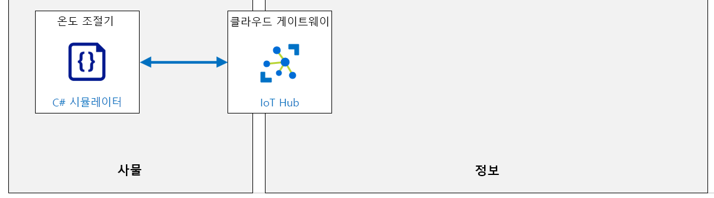

---
lab:
    title: '랩 16: Azure IoT Hub를 통한 IoT 장치 관리 자동화'
    module: '모듈 8: 디바이스 관리'
---

# Azure IoT Hub를 통한 IoT 장치 관리 자동화

IoT 디바이스는 종종 최적화된 운영 체제를 사용하거나 실제 운영 체제가 없어도 실리콘에서 직접 코드를 실행합니다. 이와 같은 디바이스에서 실행되는 소프트웨어를 업데이트하기 위해 가장 흔히 사용하는 방법은 OS와 OS에서 실행 중인 앱(펌웨어라고 함)을 포함하여 전체 소프트웨어 패키지의 새 버전을 플래시하는 것입니다.

각 디바이스에는 특정 목적이 있으므로 펌웨어도 디바이스의 목적뿐만 아니라 사용 가능한 제한된 리소스에 맞게 매우 구체적이고 최적화되어 있습니다.

펌웨어 업데이트 프로세스도 하드웨어와 하드웨어 제조업체가 보드를 만든 방식에 따라 다를 수 있습니다. 이는 펌웨어 업데이트 프로세스의 일부가 일반적이지 않으며 펌웨어 업데이트 프로세스의 세부 정보를 얻으려면 디바이스 제조업체와 협력해야 함을 의미합니다(단, 자체 하드웨어를 개발하는 경우, 즉 펌웨어 업데이트 프로세스를 알고 있는 경우는 예외).

예전에는 펌웨어 업데이트를 개별 디바이스에 수동으로 적용하였지만, 이 방법은 일반적인 IoT 솔루션에 사용되는 디바이스 수를 고려할 때 더 이상 적합하지 않습니다. 요즘에는 펌웨어 업데이트가 무선(OTA)으로 진행되는 경우가 많으며, 이 경우 클라우드에서 원격으로 신규 펌웨어의 배포가 관리됩니다.

IoT 디바이스의 OTA 펌웨어 업데이트에는 다음과 같은 공통점이 있습니다.

1. 펌웨어 버전이 고유하게 식별됩니다.
1. 펌웨어는 이진 파일 형식으로 제공되며, 디바이스는 온라인 원본에서 이진 파일을 가져와야 합니다.
1. 펌웨어는 로컬로 저장되며 이는 일종의 실제 저장소(ROM 메모리, 하드 드라이브 등)입니다.
1. 디바이스 제조업체는 펌웨어를 업데이트하기 위해 디바이스에서 필요한 작업에 대한 설명을 제공합니다.

Azure IoT Hub는 단일 디바이스와 디바이스 컬렉션에서 장치 관리 작업을 구현할 수 있는 고급 지원을 제공합니다. [자동 장치 관리](https://docs.microsoft.com/azure/iot-hub/iot-hub-auto-device-config) 기능을 사용하면 간단하게 일련의 작업을 구성하고 트리거한 다음 진행 상황을 모니터링할 수 있습니다.

## 랩 시나리오

Contoso의 치즈 동굴에서 구현한 자동 공기 처리 시스템은 회사를 고품질 전문점으로 만드는 데 도움이 되었습니다. 회사는 그 어느 때보다 많은 상을 수상한 치즈를 보유하고 있습니다.

기본 솔루션은 센서와 통합된 IoT 디바이스 및 방이 여러 개 있는 동굴 시스템의 온도와 습도를 실시간으로 제어하는 실내 온도 제어 시스템으로 구성됩니다. 또한 직접 메서드와 디바이스 쌍 속성을 모두 사용하여 디바이스를 관리하는 기능을 보여주는 간단한 백 엔드 앱을 개발했습니다.

Contoso는 운영자가 동굴 환경을 모니터링하고 원격으로 관리하는 데 사용할 수 있는 온라인 포털을 포함하도록 초기 솔루션에서 간단한 백 엔드 앱을 확장했습니다. 새로운 포털을 통해 작업자는 치즈 종류나 치즈 숙성 과정의 특정 단계에 따라 동굴의 온도와 습도를 사용자 정의할 수 있습니다. 동굴의 각 방이나 구역은 별도로 제어할 수 있습니다.

IT 부서는 운영자를 위해 개발한 백 엔드 포털을 유지 관리하지만, 관리자는 솔루션의 디바이스 쪽을 관리하기로 동의했습니다. 

여러분에게 이것은 다음 두 가지를 의미합니다. 

1. Contoso의 운영 팀은 항상 개선 방법을 찾고 있습니다. 이러한 개선은 종종 디바이스 소프트웨어의 새 기능에 대한 요청으로 이어집니다. 

1. 동굴 위치에 배포되는 IoT 디바이스에는 개인 정보를 보호하고 해커가 시스템을 제어하지 못하도록 막는 최신 보안 패치가 필요합니다. 시스템 보안을 유지하려면, 펌웨어를 원격으로 업데이트하여 디바이스를 최신 상태로 유지해야 합니다.

자동 디바이스 관리 및 대규모 디바이스 관리를 가능하게 하는 IoT Hub 기능을 구현할 예정입니다.

다음 리소스가 만들어집니다.



## 랩 내용

이 랩에서는 다음 활동을 완료할 예정입니다.

* 랩 필수 구성 요소가 충족되는지 확인(필요한 Azure 리소스가 있음)
* 펌웨어 업데이트를 구현할 시뮬레이션된 디바이스에 대한 코드 쓰기
* Azure IoT Hub 자동 디바이스 관리를 사용하여 단일 디바이스에서 펌웨어 업데이트 프로세스 테스트

## 랩 지침

### 연습 1: 랩 필수 구성 요소 확인

이 랩에서는 다음과 같은 Azure 리소스를 사용할 수 있다고 가정합니다.

| 리소스 유형 | 리소스 이름 |
| :-- | :-- |
| 리소스 그룹 | rg-az220 |
| IoT Hub | iot-az220-training-{your-id} |
| IoT 디바이스 | sensor-th-0155 |

> **중요**: 설정 스크립트를 실행하여 필요한 디바이스를 만드세요.

누락된 리소스와 새 디바이스를 만들려면 연습 2를 진행하기 전에 아래 설명에 따라 **lab16-setup.azcli** 스크립트를 실행해야 합니다. 스크립트 파일은 개발자 환경 구성(랩 3)의 일부로 로컬로 복제한 GitHub 리포지토리에 포함됩니다.

>**참고:** **sensor-th-0155** 디바이스용 연결 문자열이 필요합니다. 이 디바이스가 Azure IoT Hub에 이미 등록된 경우, Azure Cloud Shell에서 다음 명령을 실행하여 연결 문자열을 가져올 수 있습니다."
>
> ```bash
> az iot hub device-identity connection-string show --hub-name iot-az220-training-{your-id} --device-id sensor-th-0050 -o tsv
> ```

**lab16-setup.azcli** 스크립트는 **bash** 셸 환경에서 실행되도록 작성됩니다. 이는 Azure Cloud Shell에서 실행할 수 있는 가장 쉬운 방법입니다.

1. 브라우저를 사용하여 [Azure Cloud Shell](https://shell.azure.com/)을 열고 이 과정에 사용 중인 Azure 구독으로 로그인합니다.

    Cloud Shell에 대한 스토리지 설정 관련 메시지가 표시되면 기본값을 수락합니다.

1. Cloud Shell에서 **Bash**를 사용하고 있는지 확인합니다.

    Azure Cloud Shell 페이지의 왼쪽 상단에 있는 드롭다운은 환경을 선택하는 데 사용됩니다. 선택한 드롭다운 값이 **Bash**인지 확인합니다.

1. Cloud Shell 도구 모음에서 **파일 업로드/다운로드**(오른쪽의 네 번째 단추)를 클릭합니다.

1. 드롭다운에서 **업로드**를 클릭합니다.

1. 파일 선택 대화 상자에서 개발 환경을 구성할 때 다운로드한 GitHub 랩 파일의 폴더 위치로 이동합니다.

    _랩 3: 개발 환경 설정_, ZIP 파일을 다운로드하고 콘텐츠를 로컬로 추출하여 랩 리소스를 포함하는 GitHub 리포지토리를 복제했습니다. 추출된 폴더 구조에는 다음 폴더 경로가 포함됩니다.

    * 모든 파일
      * 랩
          * 16-Azure IoT Hub를 통한 IoT 장치 관리 자동화
            * Setup

    lab16-setup.azcli 스크립트 파일은 랩 16의 Setup 폴더에 있습니다.

1. **lab16-setup.azcli** 파일을 선택한 다음 **열기**를 클릭합니다.

    파일 업로드가 완료되면 알림이 표시됩니다.

1. Azure Cloud Shell에 올바른 파일이 업로드되었는지 확인하려면 다음 명령을 입력합니다.

    ```bash
    ls
    ```

    `ls` 명령으로 현재 디렉터리의 내용을 나열합니다. lab16-setup.azcli 파일이 나열됩니다.

1. 설치 스크립트가 포함된 이 랩에 대한 디렉터리를 만든 다음 해당 디렉터리로 이동하려면 다음 Bash 명령을 입력합니다.

    ```bash
    mkdir lab16
    mv lab16-setup.azcli lab16
    cd lab16
    ```

1. **lab16-setup.azcli**에 실행 권한이 있는지 확인하려면 다음 명령을 입력합니다.

    ```bash
    chmod +x lab16-setup.azcli
    ```

1. Cloud Shell 도구 모음에서 lab16-setup.azcli 파일에 액세스할 수 있도록 설정하려면 **편집기 열기**(오른쪽에서 두 번째 단추 - **{}**)를 클릭합니다.

1. lab16 폴더를 펼치고 스크립트 파일을 열려면 **파일** 목록에서 **lab16**을 클릭한 다음 **lab16-setup.azcli**를 클릭합니다.

    이제 편집기에서 **lab16-setup.azcli** 파일의 내용을 표시합니다.

1. 편집기에서 `{your-id}` 및 `{your-location}`에 할당된 값을 업데이트합니다.

    아래 참조 샘플의 경우 `{your-id}`는 이 과정을 시작할 때 만든 고유 ID(예: **cah191211**)로 설정하고 `{your-location}`는 리소스에 적합한 위치로 설정해야 합니다.

    ```bash
    #!/bin/bash

    # 아래 값을 변경하세요!
    YourID="{your-id}"
    Location="{your-location}"
    ```

    > **참고**:  `{your-location}` 변수는 모든 리소스를 배포하는 지역의 짧은 이름으로 설정해야 합니다. 이 명령을 입력하면 사용 가능한 위치 및 짧은 이름(**이름** 열)의 목록을 볼 수 있습니다.

    ```bash
    az account list-locations -o Table

    DisplayName           Latitude    Longitude    Name
    --------------------  ----------  -----------  ------------------
    East Asia             22.267      114.188      eastasia
    Southeast Asia        1.283       103.833      southeastasia
    Central US            41.5908     -93.6208     centralus
    East US               37.3719     -79.8164     eastus
    East US 2             36.6681     -78.3889     eastus2
    ```

1. 파일의 변경 내용을 저장하고 편집기를 닫으려면 편집기 창 오른쪽 위의 **...** 를 클릭한 다음 **편집기 닫기**를 클릭합니다.

    저장하라는 메시지가 표시된 경우 **저장**을 클릭하면 편집기가 닫힙니다.

    > **참고**:  **CTRL+S**를 사용하여 언제든지 저장할 수 있으며 **CTRL+Q**를 사용하여 편집기를 닫을 수 있습니다.

1. 이 랩에 필요한 리소스를 만들려면 다음 명령을 입력합니다.

    ```bash
    ./lab16-setup.azcli
    ```

    이 스크립트를 실행하는 데 몇 분이 걸릴 수 있습니다. 각 단계가 완료될 때 출력이 표시됩니다.

    이 스크립트는 먼저 **rg-az220** 리소스 그룹과 **iot-az220-training-{your-id}** IoT Hub를 만듭니다. 이미 있는 경우 해당 메시지가 표시됩니다. 그런 다음 스크립트는 ID가 **sensor-th-0155**인 디바이스를 IoT Hub에 추가하고 디바이스 연결 문자열을 표시합니다.

1. 스크립트가 완료되면 디바이스의 연결 문자열이 표시됩니다.

    연결 문자열은 "HostName="으로 시작합니다.

1. 연결 문자열을 텍스트 문서에 복사하고 **sensor-th-0155** 디바이스용 연결 문자열임을 기록해 둡니다.

    연결 문자열을 쉽게 찾을 수 있는 위치에 저장하셨다면, 랩을 계속할 준비가 되었습니다.

### 연습 2: 펌웨어 업데이트를 구현하는 시뮬레이션된 디바이스용 코드 작성

이 연습에서는 디바이스 쌍의 원하는 속성 변경을 관리하고 펌웨어 업데이트를 시뮬레이션하는 로컬 프로세스를 트리거할 시뮬레이션된 디바이스를 만듭니다. 펌웨어 업데이트 시작을 위해 구현하는 프로세스는 실제 디바이스에서 펌웨어 업데이트에 사용되는 프로세스와 비슷합니다. 여기서는 새 펌웨어 버전 다운로드, 펌웨어 업데이트 설치, 디바이스 다시 시작 프로세스를 시뮬레이트합니다.

또한 Azure Portal에서 디바이스 쌍 속성을 사용해 펌웨어 업데이트를 구성하고 실행합니다. 구체적으로는 구성 변경 요청을 디바이스로 전송하고 진행 상황을 모니터링하도록 디바이스 쌍 속성을 구성합니다.

#### 작업 1: 디바이스 시뮬레이터 앱 만들기

이 작업에서는 Visual Studio Code를 사용하여 새 콘솔 앱을 만듭니다.

1. Visual Studio Code를 엽니다.

    이 과정의 랩 3을 완료한 경우 [.NET Core](https://dotnet.microsoft.com/download) 및 [C# 확장](https://marketplace.visualstudio.com/items?itemName=ms-vscode.csharp)이 개발 환경에 설치되어 있어야 합니다.

1. **터미널** 메뉴에서 **새 터미널**을 클릭합니다.

1. 터미널 명령 프롬프트에서 다음 명령을 입력합니다.

    ```cmd/sh
    mkdir fwupdatedevice
    cd fwupdatedevice
    ```

    첫 번째 명령은 **fwupdatedevice**라는 폴더를 만듭니다. 두 번째 명령은 **fwupdatedevice** 폴더로 이동합니다.

1. 새 콘솔 앱을 만들려면 다음 명령을 입력합니다.

    ```cmd/sh
    dotnet new console
    ```

    > **참고**: 새 .NET 콘솔 앱이 만들어지면 `dotnet restore`이 사후 생성 프로세스로 실행되었어야 합니다. 터미널 창에 이 문제가 발생했음을 나타내는 메시지가 표시되지 않으면 앱에서 필수 .NET 패키지에 액세스하지 못할 수도 있습니다. 이를 처리하려면 다음 명령을 입력합니다. `dotnet restore`

1. 앱에 필요한 라이브러리를 설치하려면 다음 명령을 입력합니다.

    ```cmd/sh
    dotnet add package Microsoft.Azure.Devices.Client
    dotnet add package Microsoft.Azure.Devices.Shared
    dotnet add package Newtonsoft.Json
    ```

    터미널 창에서 메시지를 리뷰하고 세 개의 라이브러리를 모두 설치했는지 확인합니다.

1. **파일** 메뉴에서 **폴더 열기**를 클릭합니다.

1. **폴더 열기** 대화 상자에서 터미널 창에 지정된 폴더 위치로 이동한 다음 **fwupdatedevice**를 클릭한 후 **폴더 선택**을 클릭합니다.

    EXPLORER 창은 Visual Studio Code에서 열리고 `Program.cs` 및 `fwupdatedevice.csproj` 파일이 나열되어 있어야 합니다.

1. **탐색기** 창에서 **Program.cs**를 클릭합니다.

1. 코드 편집기 창에서 Program.cs 파일의 내용을 삭제합니다.

#### 작업 2: 앱에 코드 추가

이 작업에서는 IoT Hub가 생성한 요청에 대한 응답으로 디바이스에서 펌웨어 업데이트를 시뮬레이션하기 위한 코드를 입력합니다.

1. Visual Studio Code에서 **Program.cs** 파일을 열려 있는지 확인합니다.

    코드 편집기 창에는 빈 코드 파일이 표시되어야 합니다.

1. 다음 코드를 코드 편집기 창에 복사하여 붙여넣습니다.

    ```cs
    // Copyright (c) Microsoft. All rights reserved.
    // MIT 라이선스에 따라 라이선스가 부여되었습니다. 전체 라이선스 정보는 프로젝트 루트의 라이선스 파일을 참조하십시오.

    using Microsoft.Azure.Devices.Shared;
    using Microsoft.Azure.Devices.Client;
    using System;
    using System.Threading.Tasks;

    namespace fwupdatedevice
    {
        class SimulatedDevice
        {
            // IoT Hub를 사용하여 디바이스를 인증하는 디바이스 연결 문자열입니다.
            static string s_deviceConnectionString = "";

            // 장치 ID 변수
            static string DeviceID="unknown";

            // 펌웨어 버전 변수
            static string DeviceFWVersion = "1.0.0";

            // 간단한 콘솔 로그 함수
            static void LogToConsole(string text)
            {
                // 디바이스 ID로 로그를 접두사화합니다.
                Console.WriteLine(DeviceID + ": " + text);
            }

            // OS/HW에서 펌웨어 버전을 검색하는 기능
            static string GetFirmwareVersion()
            {
                // 여기서는 하드웨어에서 실제 펌웨어 버전을 얻을 수 있습니다. 시뮬레이션 프로세스를 위해 FWVersion 변수 값을 되돌려 보내겠습니다.
                return DeviceFWVersion;
            }

            // 현재 펌웨어(업데이트) 상태를 보고하도록 디바이스 쌍 reported 속성을 업데이트하는 함수
            // IoT Hub에서 펌웨어 업데이트 구성에 의한 "펌웨어" 업데이트 속성에서 예상되는 값입니다
            //  currentFwVersion: 현재 디바이스에서 실행 중인 펌웨어 버전.
            //  pendingFwVersion: 다음 업데이트 할 버전은
            //                    원하는 속성에 지정된 버전과 일치해야 합니다. 다음의 경우에는 비어 있습니다
            //                    보류 중인 업데이트가 없는 경우(fwUpdateStatus가 '현재').
            //  fwUpdateStatus:   업데이트 진행률이 다음과 같도록 정의합니다
            //                    요약 보기에서 분류. 다음 중 하나:
            //         - 현재:     보류 중인 펌웨어 업데이트가 없습니다. currentFwVersion는
            //                    fwVersion을 원하는 속성과 일치합니다.
            //         - 다운로드 중: 펌웨어 업데이트 이미지가 다운로드 중입니다.
            //         - verifying:   이미지 파일 체크섬 및 기타 유효성 검사 확인.
            //         - applying:    프로세스 중인 새 이미지 파일 업데이트.
            //         - 다시 부팅:   업데이트 프로세스의 일부로 디바이스가 다시 부팅되고 있습니다.
            //         - 오류:       업데이트 중 오류가 발생하였습니다. 추가 정보
            //                    fwUpdateSubstatus에서 지정되어야 합니다.
            //         - 롤백:  오류로 인해 업데이트가 이전 버전으로 롤백되었습니다.
            //  fwUpdateSubstatus: fwUpdateStatus에 대한 추가 세부 정보. 다음을 포함할 수 있습니다.
            //                     오류 또는 롤백 상태에 대한 이유 또는 다운로드 %.
            //
            // reported: {
            //       firmware: {
            //         currentFwVersion: '1.0.0',
            //         pendingFwVersion: '',
            //         fwUpdateStatus: 'current',
            //         fwUpdateSubstatus: '',
            //         lastFwUpdateStartTime: '',
            //         lastFwUpdateEndTime: ''
            //   }
            // }

            static async Task UpdateFWUpdateStatus(DeviceClient client, string currentFwVersion, string pendingFwVersion, string fwUpdateStatus, string fwUpdateSubstatus, string lastFwUpdateStartTime, string lastFwUpdateEndTime)
            {
                TwinCollection properties = new TwinCollection();
                if (currentFwVersion!=null)
                    properties["currentFwVersion"] = currentFwVersion;
                if (pendingFwVersion!=null)
                    properties["pendingFwVersion"] = pendingFwVersion;
                if (fwUpdateStatus!=null)
                    properties["fwUpdateStatus"] = fwUpdateStatus;
                if (fwUpdateSubstatus!=null)
                    properties["fwUpdateSubstatus"] = fwUpdateSubstatus;
                if (lastFwUpdateStartTime!=null)
                    properties["lastFwUpdateStartTime"] = lastFwUpdateStartTime;
                if (lastFwUpdateEndTime!=null)
                    properties["lastFwUpdateEndTime"] = lastFwUpdateEndTime;

                TwinCollection reportedProperties = new TwinCollection();
                reportedProperties["firmware"] = properties;

                await client.UpdateReportedPropertiesAsync(reportedProperties).ConfigureAwait(false);
            }

            // 디바이스에서 펌웨어 업데이트 실행
            static async Task UpdateFirmware(DeviceClient client, string fwVersion, string fwPackageURI, string fwPackageCheckValue)
            {
                LogToConsole("A firmware update was requested from version " + GetFirmwareVersion() + " to version " + fwVersion);
                await UpdateFWUpdateStatus(client, null, fwVersion, null, null, DateTime.UtcNow.ToString("yyyy-MM-ddTHH:mm:ssZ"), null);

                // 새로운 펌웨어 이진 가져오기 여기에서 이진을 다운로드하거나 디바이스에 대해 지시된 대로 소스에서 검색한 다음 다운로드한 이진의 무결성을 해시로 다시 확인하세요.
                LogToConsole("Downloading new firmware package from " + fwPackageURI);
                await UpdateFWUpdateStatus(client, null, null, "downloading", "0", null, null);
                await Task.Delay(2 * 1000);
                await UpdateFWUpdateStatus(client, null, null, "downloading", "25", null, null);
                await Task.Delay(2 * 1000);
                await UpdateFWUpdateStatus(client, null, null, "downloading", "50", null, null);
                await Task.Delay(2 * 1000);
                await UpdateFWUpdateStatus(client, null, null, "downloading", "75", null, null);
                await Task.Delay(2 * 1000);
                await UpdateFWUpdateStatus(client, null, null, "downloading", "100", null, null);
                // 이진이 저장되었는지 보고합니다
                LogToConsole("The new firmware package has been successfully downloaded.");

                // 이진 무결성 확인
                LogToConsole("Verifying firmware package with checksum " + fwPackageCheckValue);
                await UpdateFWUpdateStatus(client, null, null, "verifying", null, null, null);
                await Task.Delay(5 * 1000);
                // 이진이 저장되었는지 보고합니다
                LogToConsole("The new firmware binary package has been successfully verified");

                // 새로운 펌웨어 적용
                LogToConsole("Applying new firmware");
                await UpdateFWUpdateStatus(client, null, null, "applying", null, null, null);
                await Task.Delay(5 * 1000);

                // 실제 디바이스에서는 프로세스가 끝날 때 다시 부팅하고 부팅 시 디바이스는 실제 펌웨어 버전을 보고하며, 성공하는 경우 새 버전이어야 합니다.
                // 시뮬레이션을 위해 잠시 기다린 후 새 펌웨어 버전을 보고합니다.
                LogToConsole("Rebooting");
                await UpdateFWUpdateStatus(client, null, null, "rebooting", null, null, DateTime.UtcNow.ToString("yyyy-MM-ddTHH:mm:ssZ"));
                await Task.Delay(5 * 1000);

                // 실제 디바이스에서는 디바이스를 다시 부팅하라는 명령을 내릴 수 있습니다. 여기서는 단순히 초기화 함수를 실행하고 있습니다.
                DeviceFWVersion = fwVersion;
                await InitDevice(client);

            }

            // 원하는 속성 변경에 응답하기 위한 콜백
            static async Task OnDesiredPropertyChanged(TwinCollection desiredProperties, object userContext)
            {
                LogToConsole("Desired property changed:");
                LogToConsole($"{desiredProperties.ToJson()}");

                // 펌웨어 업데이트 실행
                if (desiredProperties.Contains("firmware") && (desiredProperties["firmware"]!=null))
                {
                    // 원하는 속성에서 다음 정보를 찾습니다.
                    // fwVersion: 플래시할 새 펌웨어의 버전 번호
                    // fwPackageURI: 새로운 펌웨어 이진을 다운로드 할 수 있는 URI
                    // fwPackageCheckValue: 다운로드한 이진 파일의 무결성을 확인하기 위한 해시
                    // 펌웨어 버전이 새 버전이라고 가정하겠습니다.
                    TwinCollection fwProperties = new TwinCollection(desiredProperties["firmware"].ToString());
                    await UpdateFirmware((DeviceClient)userContext, fwProperties["fwVersion"].ToString(), fwProperties["fwPackageURI"].ToString(), fwProperties["fwPackageCheckValue"].ToString());

                }
            }

            static async Task InitDevice(DeviceClient client)
            {
                LogToConsole("Device booted");
                LogToConsole("Current firmware version: " + GetFirmwareVersion());
                await UpdateFWUpdateStatus(client, GetFirmwareVersion(), "", "current", "", "", "");
            }

            static async Task Main(string[] args)
            {
                // 명령줄에서 디바이스 연결 문자열을 가져옵니다.
                if (string.IsNullOrEmpty(s_deviceConnectionString) && args.Length > 0)
                {
                    s_deviceConnectionString = args[0];
                } else
                {
                    Console.WriteLine("Please enter the connection string as argument.");
                    return;
                }

                DeviceClient deviceClient = DeviceClient.CreateFromConnectionString(s_deviceConnectionString, TransportType.Mqtt);

                if (deviceClient == null)
                {
                    Console.WriteLine("Failed to create DeviceClient!");
                    return;
                }

                // 장치 ID를 가져옵니다.
                string[] elements = s_deviceConnectionString.Split('=',';');

                for(int i=0;i<elements.Length; i+=2)
                {
                    if (elements[i]=="DeviceId") DeviceID = elements[i+1];
                }

                // 디바이스 초기화 루틴을 실행합니다
                await InitDevice(deviceClient);

                // 원하는 속성 변경에 대한 콜백을 연결합니다.
                await deviceClient.SetDesiredPropertyUpdateCallbackAsync(OnDesiredPropertyChanged, deviceClient).ConfigureAwait(false);

                // 앱이 종료될 때까지 키 입력 대기
                // TODO
                while (true)
                {
                    Console.ReadLine();
                    return;
                }
            }
        }
    }
    ```

    > **참고**: 
    > 코드의 주석을 살펴보며 디바이스가 디바이스 쌍 변경 사항에 반응하여 desired 속성 “firmware”에서 공유한 구성에 따라 펌웨어 업데이트를 실행하는 것을 확인합니다. 디바이스 쌍의 reported 속성을 통해 현재 펌웨어 업데이트 상태를 보고하는 함수도 볼 수 있습니다.

1. **파일** 메뉴에서 **저장**을 클릭합니다.

이제 디바이스 측 코드가 완성되었습니다. 다음으로 이 시뮬레이션된 디바이스에 대해 펌웨어 업데이트 프로세스가 예상대로 작동하는지 테스트합니다.

### 연습 3: 단일 디바이스에서 펌웨어 업데이트 테스트

이 연습에서는 Azure Portal을 사용하여 새 장치 관리 구성을 만들고 이를 단일 시뮬레이션된 디바이스에 적용합니다.

#### 작업 1: 디바이스 시뮬레이터 시작

1. 필요한 경우 Visual Studio Code에서 **fwupdatedevice** 프로젝트를 엽니다.

1. 터미널 창을 열어야 합니다.

    명령 프롬프트의 폴더 위치는 `fwupdatedevice` 폴더입니다.

1. `fwupdatedevice` 앱을 실행하려면 다음 명령을 입력합니다.

    ``` bash
    dotnet run "<device connection string>"
    ```

    > **참고**: 자리 표시자를 실제 디바이스 연결 문자열로 바꾸고 연결 문자열 주위에 "" 기호를 포함해야 합니다. 
    > 
    > 예를 들어 다음과 같이 입력할 수 있습니다. `"HostName=iot-az220-training-{your-id}.azure-devices.net;DeviceId=sensor-th-0155;SharedAccessKey={}="`

1. 터미널 창의 내용을 검토합니다.

    터미널에 다음과 같은 출력이 표시됩니다(여기서 “mydevice”는 디바이스 ID를 만들 때 사용한 디바이스 ID입니다).

    ``` bash
        mydevice: Device booted
        mydevice: Current firmware version: 1.0.0
    ```

#### 작업 2: 디바이스 관리 구성 만들기

1. 필요한 경우 Azure 계정 자격 증명을 사용하여 [Azure Portal](https://portal.azure.com/learn.docs.microsoft.com?azure-portal=true)에 로그인합니다.

    Azure 계정이 두 개 이상인 경우 이 과정에 사용할 구독에 연결된 계정으로 로그인해야 합니다.

1. Azure Portal 대시보드에서 **iot-az220-training-{your-id}** 를 클릭합니다.

    이제 IoT Hub 블레이드가 표시되어야 합니다.
 
1. 왼쪽 탐색 메뉴의 **자동 장치 관리**에서 **IoT 디바이스 구성**을 클릭합니다.

1. **IoT 디바이스 구성** 창에서 **+ 디바이스 구성 추가**를 클릭합니다.

1. **디바이스 쌍 구성 만들기** 블레이드에서 **이름**에 **firmwareupdate**를 입력합니다.

    **레이블** 아래가 아니라 구성의 필수 **이름** 필드에 `firmwareupdate`를 입력해야 합니다. 

1. 블레이드 하단에서 **다음: 쌍 설정 >** 을 클릭합니다.

1. **디바이스 쌍 설정**에서 **디바이스 쌍 속성** 필드에 **properties.desired.firmware**를 입력합니다.

1. **디바이스 쌍 속성 콘텐츠** 필드에서 다음을 입력합니다.

    ``` json
    {
        "fwVersion":"1.0.1",
        "fwPackageURI":"https://MyPackage.uri",
        "fwPackageCheckValue":"1234"
    }
    ```

1. 블레이드 하단에서 **다음: 메트릭 >** 을 클릭합니다.

    사용자 지정 메트릭을 사용하여 펌웨어 업데이트가 효과적인지 추적합니다. 

1. **메트릭** 탭에서 **메트릭 이름** 아래에 **fwupdated**를 입력합니다.

1. **메트릭 기준** 아래에 다음을 입력합니다.

    ``` SQL
    SELECT deviceId FROM devices
        WHERE properties.reported.firmware.currentFwVersion='1.0.1'
    ```

1. 블레이드 하단에서 **다음: 대상 디바이스 >** 를 클릭합니다.

1. **대상 디바이스** 탭에서 **우선 순위** 아래 **우선 순위(더 높은 값 ...)** 필드에 **10**을 입력합니다.

1. **대상 조건** 아래 **대상 조건** 필드에 다음 쿼리를 입력합니다.

    ``` SQL
    deviceId='<your device id>'
    ```

    > **참고**: `'<your device id>'`를 디바이스를 만들 때 사용한 장치 ID로 바꿉니다. 예를 들어 다음과 같이 입력할 수 있습니다. `'sensor-th-0155'`

1. 블레이드 하단에서 **다음: 검토 + 만들기 >를 클릭합니다.**

    **검토 + 만들기** 탭이 열리면 새 구성에 대한 "유효성 검사 통과" 메시지가 표시되어야 합니다. 

1. **검토 + 만들기** 탭에서 "유효성 검사 통과" 메시지가 표시되면 **만들기**를 클릭합니다.

    "유효성 검사 통과" 메시지가 표시되면 되돌아가서 작업을 확인해야 구성을 만들 수 있습니다.

1. **IoT 디바이스 구성** 창에서 **구성 이름**아래에 새 **firmwareupdate** 구성이 나열되어 있는지 확인합니다.  

    새 구성이 만들어지면 IoT Hub는 구성의 대상 디바이스 기준과 일치하는 디바이스를 찾고 펌웨어 업데이트 구성을 자동으로 적용합니다.

1. Visual Studio Code 창으로 전환하고 터미널 창의 내용을 검토합니다.

    터미널 창에는 트리거된 펌웨어 업데이트 프로세스의 진행률을 나열하는 앱에서 생성된 새 출력이 포함되어야 합니다.

1. 시뮬레이션된 앱을 중지하고 Visual Studio Code를 닫습니다.

    터미널에서 "Enter" 키를 누르기만 하면 디바이스 시뮬레이터를 중지할 수 있습니다.

