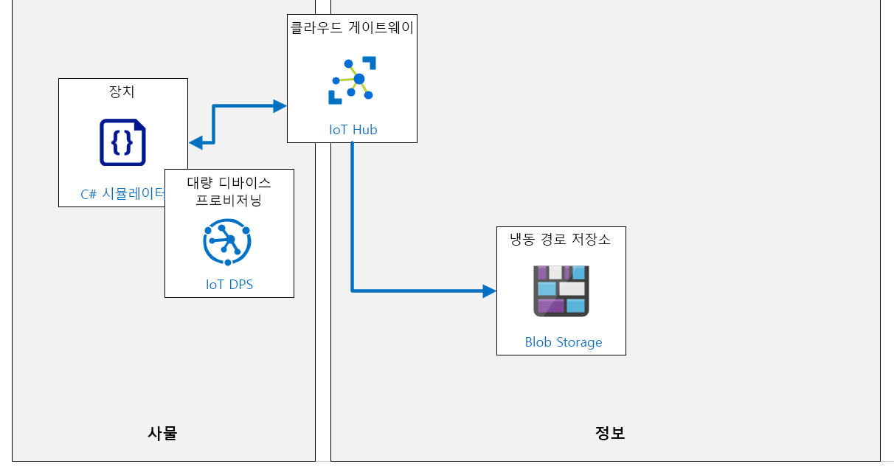

---
lab:
    title: '랩 17: Azure IoT Hub를 관리하는 방법'
    module: '모듈 9: 솔루션 테스트, 진단 및 로깅'
---

# Azure IoT Hub를 관리하는 방법

## 랩 시나리오

Contoso의 자산 모니터링 및 추적 솔루션은 훌륭하게 작동하고 있습니다. 이 시스템은 포장 및 배송 프로세스 전반에 걸쳐 지속적인 모니터링을 제공합니다. DPS 내에서 그룹 등록을 구현하여 디바이스를 규모에 맞게 프로비전하고 컨테이너가 대상에 도착하면 IoT 디바이스가 DPS를 통해 "서비스 해제"되어 향후 배송에 다시 사용할 수 있습니다.

디바이스 사용률 및 그 외 솔루션 특성을 관리하기 위해 IT 부서는 팀에 IoT 솔루션 내에서 Azure 모니터링 및 로깅 서비스를 구현할 것을 요청했습니다.

추가 워크로드를 커밋하기 전에 IT 담당자와 함께 검토할 수 있는 몇 가지 간단한 메트릭을 구현하는 것으로 시작하는 데 동의합니다.

이 랩에서는 모니터링을 구현하여 전송된 연결된 디바이스 및 원격 분석 메시지 수를 추적하고 로그에 연결 이벤트를 보냅니다. 또한 연결된 디바이스의 평균 수에 따라 트리거되는 경고를 만듭니다. 시스템을 테스트하려면 루트 CA 인증서 체인에서 생성된 디바이스 CA 인증서를 사용하여 DPS로 인증할 10개의 시뮬레이션된 IoT 디바이스를 구성합니다. IoT 디바이스는 원격 분석을 IoT Hub로 보내도록 구성됩니다.

다음의 리소스가 만들어집니다.



## 이 랩에서

이 랩에서는 다음 활동을 완료할 예정입니다.

* 랩 필수 구성 요소 확인
* 진단 로그 사용
* 메트릭을 사용합니다.
* 이러한 메트릭에 대한 경고를 설정합니다.
* X.509를 통해 연결하고 허브로 메시지를 보내는 IoT 디바이스를 시뮬레이션하는 앱을 다운로드하여 실행합니다.
* 경고가 실행되기 시작할 때까지 앱을 실행합니다.
* 메트릭 결과를 보고 진단 로그를 확인합니다.

## 랩 지침

### 연습 1: 랩 필수 구성 요소 확인

이 랩은 다음 Azure 리소스를 사용할 수 있다고 가정합니다.

| 리소스 종류 | 리소스 이름 |
| :-- | :-- |
| 리소스 그룹 | AZ-220-RG |
| IoT Hub | AZ-220-HUB-{YOUR-ID} |
| 디바이스 프로비저닝 서비스 | AZ-220-DPS-{YOUR-ID} |
| 스토리지 계정 | az220storage{your-id} |

이러한 리소스를 사용할 수 없는 경우 연습 2로 이동하기 전에 아래 설명에 따라 **lab17-setup.azcli** 스크립트를 실행해야 합니다. 스크립트 파일은 개발자 환경 구성(랩 3)의 일부로 로컬로 복제한 GitHub 리포지토리에 포함됩니다.

**lab17-setup.azcli** 스크립트는 **Bash** 셸 환경에서 실행하도록 작성됩니다. 이를 실행하는 가장 쉬운 방법은 Azure Cloud Shell에서 실행하는 것입니다.

1. 브라우저를 사용하여 [Azure Cloud Shell](https://shell.azure.com/)을 열고 이 과정에 사용 중인 Azure 구독으로 로그인합니다.

    Cloud Shell에 대한 저장소 설정 관련 메시지가 표시되면 기본값을 수락합니다.

1. Azure Cloud Shell에서 **Bash**를 사용하고 있는지 확인합니다.

1. Azure Shell 도구 모음에서 **파일 업로드/다운로드**(오른쪽에서 네 번째 단추)를 클릭합니다.

1. 드롭다운에서 **업로드**를 클릭합니다.

1. 파일 선택 대화 상자에서 개발 환경을 구성할 때 다운로드한 GitHub 랩 파일의 폴더 위치로 이동합니다.

    _랩 3: 개발 환경 설정_, ZIP 파일을 다운로드하고 콘텐츠를 로컬로 추출하여 랩 리소스를 포함하는 GitHub 리포지토리를 복제했습니다. 추출된 폴더 구조는 다음 폴더 경로를 포함합니다.

    * Allfiles
      * 랩
          * 17-Azure IoT Hub를 관리하는 방법
            * 설정

    lab17-setup.azcli 스크립트 파일은 랩 17의 설치 폴더에 있습니다.

1. **lab17-setup.azcli** 파일을 선택한 다음 **열기**를 클릭합니다.   

    파일 업로드가 완료되면 알림이 나타납니다.

1. Azure Cloud Shell에 올바른 파일이 업로드되었는지 확인하려면 다음 명령을 입력합니다.

    ```bash
    ls
    ```

    `ls` 명령으로 현재 디렉터리의 내용을 나열합니다. lab17-setup.azcli 파일이 나열되어 있어야 합니다.

1. 설치 스크립트가 포함된 이 랩에 대한 디렉터리를 만든 다음 해당 디렉터리로 이동하려면 다음 Bash 명령을 입력합니다.

    ```bash
    mkdir lab17
    mv lab17-setup.azcli lab17
    cd lab17
    ```

1.  **lab17-setup.azcli** 스크립트에 실행 권한이 있는지 확인하려면 다음 명령을 입력합니다.

    ```bash
    chmod +x lab17-setup.azcli
    ```

1. Cloud Shell 도구 모음에서 lab17-setup.azcli 파일을 편집하려면 **편집기 열기**(오른쪽에서 두 번째 단추 - { })를 클릭합니다. 

1. **파일** 목록에서 lab17 폴더를 확장하고 스크립트 파일을 열려면 **lab17을** 클릭한 다음 **lab17-setup.azcli**를 클릭합니다.

    이제 편집기에서 **lab17-setup.azcli**파일의 내용이 표시됩니다.

1. 편집기에서 `{YOUR-ID}` 및 `{YOUR-LOCATION}` 변수의 값을 업데이트하세요.

    아래 샘플을 예로 들어, `{YOUR-ID}`를 이 과정을 시작할 때 만든 고유 ID(예: **CAH191211**)로 설정하고 `{YOUR-LOCATION}`를 리소스에 적합한 위치로 설정해야 합니다.

    ```bash
    #!/bin/bash

    YourID="{YOUR-ID}"
    RGName="AZ-220-RG"
    IoTHubName="AZ-220-HUB-$YourID"
    DPSName="AZ-220-DPS-$YourID"
    DeviceName="asset-track"
    Location="{YOUR-LOCATION}"
    ```

    > **참고**:  `{YOUR-LOCATION}` 변수는 해당 지역의 짧은 이름으로 설정되어야 합니다. 이 명령을 입력하면 사용 가능한 지역 목록과 이 지역의 짧은 이름(**이름** 열)을 볼 수 있습니다.
    >
    > ```bash
    > az account list-locations -o Table
    >
    > 표시이름           위도    경도    이름
    > --------------------  ----------  -----------  ------------------
    > 동아시아             22.267      114.188      eastasia
    > 동남 아시아        1.283       103.833      southeastasia
    > 미국 중부            41.5908     -93.6208     centralus
    > 미국 동부               37.3719     -79.8164     eastus
    > 미국 동부 2             36.6681     -78.3889     eastus2
    > ```

1. 파일의 변경 내용을 저장하고 편집기를 닫으려면 편집기 창의 오른쪽 상단에서 ...를 클릭한 다음 **편집기 닫기**를 클릭합니다.

    저장하라는 메시지가 표시된 경우 **저장**을 클릭하면 편집기가 닫힙니다.

    > **참고**:  **CTRL+S**를 사용하여 언제든지 저장할 수 있으며 **CTRL+Q**를 사용하여 편집기를 닫을 수 있습니다.

1. 이 랩에 필요한 리소스를 만들려면 다음 명령을 입력합니다.

    ```bash
    ./lab17-setup.azcli
    ```

    이 스크립트를 실행하는 데 몇 분이 걸릴 수 있습니다. 각 단계가 완료되면 JSON 출력이 표시됩니다.

    스크립트는 먼저 **AZ-220-RG**라는 이름의 리소스 그룹을 만든 다음 **AZ-220-HUB-{YourID}**라는 이름의 IoT Hub와 **AZ-220-DPS-{YourID}**라는 이름의 디바이스 프로비저닝 서비스를 만듭니다. 서비스가 이미 있는 경우 해당 메시지가 표시됩니다. 스크립트는 IoT Hub와 DPS를 연결합니다. 그런 다음 스크립트는 **az220storage{your-id}**라는 이름의 스토리지 계정을 만듭니다.

    이제 이 랩의 연습 2를 진행할 준비가 되어야 합니다.

### 연습 2: IoT Hub를 사용하여 메트릭 및 진단 로그 설정 및 사용

Azure Resource 로그는 내부 작업을 설명하는 Azure 리소스에서 내보내는 플랫폼 로그입니다. 모든 리소스 로그는 공통된 최상위 스키마를 공유하며, 각 서비스가 자체 이벤트에 대해 고유한 속성을 전송할 수 있는 유연성이 있습니다.

프로덕션 환경에서 실행 중인 IoT Hub 솔루션이 있는 경우 다양한 메트릭을 설정하고 진단 로그를 사용하도록 설정해야 할 수 있습니다. 그런 다음 문제가 발생하면 문제를 진단하고 더 빨리 해결하는 데 도움이 되는 데이터를 확인할 수 있습니다.

이 연습에서는 진단 로그를 활성화하고 이를 사용하여 오류를 확인합니다. 또한 시청할 몇 가지 메트릭과 메트릭이 특정 경계에 도달하면 발생하는 경고가 설정됩니다.

#### 작업 1: 진단 활성화

1. 필요한 경우 Azure 계정 자격 증명을 사용하여 Azure Portal에 로그인합니다.

    둘 이상의 Azure 계정이 있는 경우에는 이 과정에 사용할 구독에 연결된 계정으로 로그인해야 합니다.

1. Azure 대시보드에서 **AZ-220-HUB-{YOUR-ID}**를 클릭합니다.

    대시보드에는 AZ-220-RG 리소스 그룹 타일에 IoT Hub로 연결되는 링크가 있어야 합니다.

1. 왼쪽 탐색 메뉴에서 **모니터링** 아래에 있는 **진단 설정**을 클릭합니다.   

    > **참고**: 현재 설명서에서는 진단을 기본적으로 비활성화할 수도 있음을 제안하고 있습니다. 그렇다면 IoT Hub에 대한 진단 데이터를 수집하려면 "진단 켜기"를 해야 할 수도 있습니다. **진단 켜기**를 클릭하면 **진단 설정** 블레이드가 열립니다.

1. **진단 설정** 창에서 **이름** 아래에 있는 **진단 설정 추가**를 클릭합니다.

1. **진단 설정 이름** 텍스트 상자에 **diags-hub**를 입력합니다.

1. 잠시 시간을 내어 **대상 세부 사항** 아래에 나열된 옵션을 검토하세요.

    메트릭을 라우팅하는 데 사용할 수 있는 3가지 옵션이 있음을 확인할 수 있습니다. 아래 링크를 통해 각각에 대해 자세히 알아볼 수 있습니다.

    * [스토리지 계정에 Azure 리소스 로그 보관](https://docs.microsoft.com/ko-kr/azure/azure-monitor/platform/resource-logs-collect-storage)
    * [Azure 모니터링 데이터를 이벤트 허브로 스트리밍](https://docs.microsoft.com/ko-kr/azure/azure-monitor/platform/stream-monitoring-data-event-hubs)
    * [Azure Monitor의 Log Analytics 작업 영역에서 Azure 리소스 로그 수집](https://docs.microsoft.com/ko-kr/azure/azure-monitor/platform/resource-logs-collect-workspace)

    이 랩에서는 스토리지 계정 옵션을 사용합니다.

1. **대상 세부 사항**에서 **스토리지 계정으로 보관**을 클릭합니다.   

    이 대상 옵션을 선택하면 로그 범주에 대한 **재방문 주기(일)**를 지정하는 옵션을 포함하여 추가 필드를 사용할 수 있습니다.

    > **참고**: 잠시 시간을 내어 스토리지 계정 및 비용에 대한 메모를 검토합니다.

1. **구독** 필드의 경우 IoT Hub를 만드는 데 사용한 구독을 선택합니다.

1. **스토리지 계정** 필드의 경우 **az220storage{your-id}** 스토리지 계정을 선택합니다.

    이 계정은 lab17-setup.azcli 스크립트에서 만들었습니다. 드롭다운에 나열되지 않은 경우 계정을 수동으로 만들어야 할 수도 있습니다(강사와 확인).

1. **진단 설정** 블레이드에서 **범주 세부 정보** 아래에 있는 **연결**을 클릭한 다음 **DeviceTelemetry**를 클릭합니다.

1. 선택한 각 로그 범주의 경우 **재방문 주기(일)** 필드에 **7**을 입력합니다. 

1. 블레이드 상단에서 **저장**을 클릭한 다음 블레이드를 닫습니다. 

    이제 IoT Hub의 **진단 설정** 창으로 이동해야 하며 **진단 설정** 목록이 업데이트되어 방금 만든 **diags-hub** 설정이 표시되고 있음을 알 수 있어야 합니다.

    나중에 진단 로그를 보면 디바이스의 연결 로깅과 연결 해제 로깅을 확인할 수 있습니다.

#### 작업 2: 설정 메트릭

이 작업에서는 메시지가 IoT Hub로 전송되는 시기를 감시할 다양한 메트릭을 설정합니다.

1. IoT Hub 블레이드를 열어 두세요.

    이전 작업으로 인해 IoT Hub 블레이드의 **진단 설정** 창에 남아 있습니다.

1. 왼쪽 탐색 메뉴에서 **모니터링** 아래에 있는 **메트릭**을 클릭합니다.

    새로운 빈 차트를 표시하는 **메트릭** 창이 표시됩니다. 

1. 화면의 오른쪽 상단에서 차트의 시간 범위와 단위를 변경하려면 **마지막 24시간(자동)**을 클릭합니다.

1. 표시되는 컨텍스트 메뉴에서 **시간 범위** 아래에 있는 **마지막 4시간**을 클릭합니다.

1. 동일한 컨텍스트 메뉴에서 **시간 단위** 아래에 보이는 **1분**을 클릭하고 **시간을 다음으로 표시** 아래에 **로컬**이 선택되었는지 확인합니다. 

1. 시간 설정을 저장하려면 **적용**을 클릭합니다. 

1. 잠시 시간을 내어 차트 메트릭을 지정하는 데 사용된 설정을 검사합니다.

    **차트 제목** 및 차트의 도구 모음 아래에 메트릭을 지정하는 영역이 표시됩니다. 

    * **범위**가 이미 **AZ-220-HUB-{YOUR-ID}**로 설정되어 있습니다.
    * **메트릭 네임스페이스**가 이미 **IoT Hub 표준 메트릭**으로 설정되어 있습니다.

    > **참고**: 기본적으로 사용할 수 있는 메트릭 네임스페이스는 하나만 있습니다. 네임스페이스는 유사한 메트릭을 분류하거나 그룹화하는 방법입니다. 네임스페이스를 사용하면 다양한 인사이트 또는 성능 지표를 수집하는 메트릭 그룹 간에 격리를 수행할 수 있습니다. 예를 들어 앱을 프로파일링하는 메모리 사용 메트릭을 추적하는 **az220memorymetrics**라는 네임스페이스가 있을 수 있습니다. **az220apptransaction**이라는 또 다른 네임스페이스는 애플리케이션의 사용자 트랜잭션에 대한 모든 메트릭을 추적할 수 있습니다. 사용자 지정 메트릭 및 네임스페이스에 대한 자세한 내용은 [여기](https://docs.microsoft.com/ko-kr/azure/azure-monitor/platform/metrics-custom-overview?toc=%2Fazure%2Fazure-monitor%2Ftoc.json#namespace)에서 확인할 수 있습니다.

    다음 단계는 IoT Hub로 전송된 원격 분석 메시지 수를 모니터링하는 데 사용되는 메트릭을 추가하는 것입니다.

1. **메트릭** 드롭다운에서 **전송된 원격 분석 메시지**를 클릭합니다.

    선택할 가능한 수많은 메트릭을 확인합니다!

1. **집계에서** **합계**가 선택되었는지 확인합니다.

    *평균*, *최소*, *최대*, *합계* 4개의 집계 작업을 사용할 수 있습니다.

1. 잠시 차트를 검토합니다.

    선택한 메트릭을 반영하도록 차트 제목이 업데이트되었습니다.

    첫 번째 메트릭에 대한 사양을 완료했습니다. 다음으로 연결된 디바이스 수를 모니터링하기 위해 다른 메트릭을 추가합니다.

1. 차트 제목의 도구 모음에서 **메트릭 추가**를 클릭합니다.

    새 메트릭이 나타납니다. **범위** 및 **메트릭 네임스페이스** 값이 미리 채워져 있는 것을 알 수 있습니다.

1. **메트릭** 드롭다운에서 **연결된 디바이스(미리 보기)**를 클릭합니다.

1. **집계에서** **평균**이 선택되었는지 확인합니다.

    이제 화면에 전송된 원격 분석 메시지의 최소화된 메트릭과 연결된 평균적 디바이스에 대한 새 메트릭이 표시됩니다. 차트 제목이 두 메트릭을 모두 반영하도록 업데이트되었습니다.

    > **참고**: 차트 제목을 편집하려면 제목 오른쪽에 있는 **연필**을 클릭합니다.

1. 도구 모음의 오른쪽에 있는 **차트 제목**에서 **대시보드에 고정**을 클릭한 다음 **현재 대시보드에 고정**을 클릭합니다.

    > **참고**:  방금 만든 차트를 유지하려면 대시보드에 고정을 **해야만 합니다.**

1. "AZ-220" 대시보드로 이동하여 차트가 표시되는지 확인합니다.

    > **참고**: 끌어서 놓기 작업으로 차트의 크기와 위치를 사용자가 직접 지정할 수 있습니다.

메트릭을 모니터링하기 위한 로깅 및 차트 설정이 활성화되었으므로 알림을 설정하는 것이 좋습니다.

### 연습 3: 경고 구성

알림은 모니터링 데이터에서 중요한 조건이 확인되면 사전에 알려주는 역할을 합니다. 이를 통해 시스템 사용자가 문제를 인지하기 전에 문제를 식별하고 해결할 수 있습니다. 

자산 추적 시나리오에서는 센서를 사용하여 고객에게 되는 컨테이너를 추적합니다. 전달된 컨테이너에 센서가 추가될 때마다 DPS를 통해 자동 프로비저닝됩니다. 

예정된 개념 증명 데모의 경우 현재 전송 중인 번호 컨테이너가 용량 제한에 다다를 때 트리거되는 경고를 만들어야 합니다. 경고를 트리거하려면 IoT Hub의 디바이스 연결 수 이벤트를 사용합니다.

이번 연습에서는 5개 이상의 디바이스가 연결되었을 때 트리거되는 경고를 추가하려고 합니다.

1. Azure Portal 창에서 IoT Hub 블레이드를 엽니다.

1. 왼쪽 탐색 메뉴의 **모니터링**에서 를 클릭합니다.

    빈 **경고**페이지가 표시됩니다. **구독**, **리소스 그룹**, **리소스** 및 **시간 범위** 필 드가 미리 채워진 것을 알 수 있습니다.

1. **시간 범위** 드롭다운에서 **지난 시간**을 클릭합니다.

1. **경고** 창 상단에서 **새 경고 규칙**을 클릭합니다.

    이제 **규칙 만들기** 블레이드가 표시됩니다.

1. 잠시 **규칙 만들기** 블레이드를 검토합니다.

    블레이드의 맨 위에는 **리소스**와 **계층 구조** 두 필드가 있습니다. 이러한 필드는 IoT Hub의 속성으로 미리 채워진 것을 알 수 있습니다. 미리 선택한 리소스를 변경해야 하는 경우 리소스에서 **선택**을 클릭합니다.

1. **조건**에서 **추가**를 클릭합니다.

    이제 **신호 논리 구성** 창이 표시됩니다. 사용 가능한 신호가 페이지가 지정된 테이블에 표시됩니다. 테이블 위의 필드는 테이블을 필터링하여 원하는 신호 유형을 찾는 데 도움이 됩니다.

1. **신호 유형**이 **모두**로 선택되어 있는지 확인합니다.

    신호 유형 드롭다운을 열면 다음과 같은 3가지 옵션이 있습니다. *모두*, *메트릭* 그리고 *활동 로그*.

    > **참고**: 모니터링에 사용할 수 있는 신호 유형은 선택한 대상에 따라 다릅니다. 신호 유형은 메트릭, 로그 검색 쿼리 또는 활동 로그일 수 있습니다.

1. **모니터 서비스**에서 **모두**가 선택되어 있는지 확인합니다.

    모니터 서비스 드롭다운을 열면 다음과 같은 3가지 옵션이 있습니다. *모두*, *플랫폼*및 *활동 로그 - 관리*.

    > **참고**:  플랫폼 서비스는 활동 로그가 관리 활동을 추적하는 서비스 사용률에 대한 메트릭을 제공합니다.

1. **신호 이름으로 검색** 텍스트 상자에서 **연결됨**을 입력하세요.

1. 신호 목록은 항목에 따라 즉시 필터링됩니다.

1. **신호 이름**에서 **연결된 디바이스(미리 보기)**를 클릭합니다.

    창이 업데이트되어 **메트릭** 차트로 만들었던 것과 비슷한 차트가 표시됩니다. 차트는 선택한 신호와 연관된 값을 표시합니다(이 경우 *연결된 디바이스(미리 보기)*).

    차트 아래에는 **경고 논리**를 정의하는 영역이 있습니다.

1. 잠시 **경고 논리**의 옵션을 검토하세요.

    **임계값**에는 *정적* 및 *동적* 두 가지 선택영역이 있습니다. 또한 **정적**이 선택되어 있고 **동적**은 신호 유형에 사용할 수 없는 것을 알 수 있습니다.

    > **참고**:  이름에서 알 수 있듯이 *정적 임계값*은 임계값에 대한 상수 식을 지정하는 반면 *동적 임계값* 검색은 ML(고급 기계 학습)을 활용하여 메트릭의 과거 동작을 학습하고 가능한 서비스 문제를 나타내는 패턴 및 이상 징후를 식별합니다. *동적 임계값*에 대한 자세한 내용은 [여기](https://docs.microsoft.com/ko-kr/azure/azure-monitor/platform/alerts-dynamic-thresholds)에서 확인할 수 있습니다.

    *연결된 디바이스(미리 보기)* 신호가 5개 이상이 될 때마다 발생하고 경고하는 정적 임계값을 만들려고 합니다.

1. **연산자** 드롭다운에서 **크거나 같음**을 클릭합니다.

    이 필드와 다른 필드에 대한 다른 옵션을 기록해 두세요.

1. **집계 유형**에서 **평균**이 선택되어 있는지 확인합니다.

1. **임계값** 텍스트 상자에 **5**를 입력합니다.

    > **참고**: **조건 미리 보기**에는 입력한 연산자, 집계 유형 및 임계값 설정에 따라 디스플레이가 새로 고쳐지는 조건이 표시됩니다. **조건 미리 보기** 아래에는 영역을 **기반으로 한 평가**가 있습니다. 이러한 값은 위에서 선택한 **집계 유형**을 사용하여 집계된 기록 기간과 조건이 평가되는 빈도를 결정합니다.

1. **집계 세분성 (기간)**이 **5분**으로 선택되어 있는지 확인하세요.

1. **평가 빈도**가 **1분마다**로 선택되어 있는지 확인하세요.

    > **참고**: **평가 빈도**가 **집계 세분성(기간)**보다 짧기 때문에 슬라이딩 윈도우 평가가 생성됩니다. 즉, 매 분마다 앞의 5분 짜리 값이 집계되고(이 경우 평균) 조건이 평가됩니다. 시간이 경과한 후 이전 5분의 데이터가 다시 한 번 집계됩니다. 이는 1분간의 새 데이터와 이미 평가된 4분간의 데이터입니다. 따라서 한 번에 1분 앞으로 이동하는 슬라이딩 창이 있지만 이전 창의 일부로 평가된 4분의 데이터도 항상 포함되어 있습니다.

1. **신호 논리 구성** 창의 맨 아래에서 경고 조건을 구성하려면 **완료**를 클릭합니다.

    **신호 구성 논리** 창이 닫히고 **규칙 만들기** 블레이드가 표시됩니다. 이제 **조건**이 채워지고 **월별 비용 (USD)**가 표시됩니다. 작성 당시 경고 조건의 예상 비용은 0.10 USD입니다.

    그런 다음 경고 조건이 충족될 때 수행된 작업을 구성해야 합니다.

1. 잠시 **작업 그룹(선택 사항)** 영역을 검토합니다. 

    작업 그룹이 선택되지 않았습니다. **추가**와 **만들기 ** 두 가지 옵션을 사용할 수 있습니다. 

    > **참고**: 작업 그룹은 Azure 구독 소유자가 정의한 알림 기본 설정 컬렉션입니다. 작업 그룹 이름은 연관된 리소스 그룹 내에서 고유해야 합니다. Azure Monitor 및 Service Health 경고는 작업 그룹을 사용하여 경고가 트리거되었음을 사용자에게 알립니다. 사용자 요구 사항에 따라 여러 경고가 같거나 다른 작업 그룹을 사용할 수 있습니다. 구독에서 최대 2,000개의 작업 그룹을 구성할 수 있습니다. 작업 그룹을 만들고 관리하는 방법에 대한 자세한 내용은 [여기](https://docs.microsoft.com/ko-kr/azure/azure-monitor/platform/action-groups)에서 확인할 수 있습니다.

1. **작업 그룹(선택 사항)**에서 **만들기**를 클릭합니다.

    **작업 그룹 추가** 블레이드가 나타납니다.

1. **작업 그룹 이름**에 **AZ-220 이메일 작업 그룹**을 입력합니다.

    > **참고**: 작업 그룹 이름은 연관된 리소스 그룹 내에서 고유해야 합니다.

1. **약식 이름**에 **AZ220EmailAG**를 입력합니다.

    > **참고**: 약식 이름은 이 그룹을 사용하여 알림을 보낼 때 전체 작업 그룹 이름 대신 사용되며 최대 12자로 제한됩니다.

1. **구독**에서 이 랩에 사용 중인 구독이 선택되어 있는지 확인합니다.

1. **리소스 그룹** 드롭다운에서 **AZ-220-RG**를 클릭합니다.

    > **참고**: 작업 그룹은 일반적으로 구독 간에 공유되며 Azure 구독 소유자가 중앙에서 관리합니다. 따라서 "AZ-220-RG"와 같은 프로젝트 특정 리소스 그룹보다는 공통 리소스 그룹에 포함될 가능성이 높습니다. 랩을 마친 후 리소스를 보다 쉽게 정리할 수 있도록 "AZ-220-RG"를 사용하고 있습니다.

    다음 영역인 **작업**은 이 작업 그룹을 호출할 때마다 수행되는 작업 목록을 정의하는 데 사용됩니다.

1. **작업 이름**에 **AZ220Notifications**를 입력합니다.

1. **작업 유형** 드롭다운을 연 다음 사용 가능한 옵션을 검토합니다.

1. **작업 유형** 드롭다운에서 **이메일/SMS/푸시/음성**을 클릭합니다.

    즉시 이 작업 유형에 대한 작업 세부 정보를 보여주는 **이메일/SMS/푸시/음성** 블레이드가 표시됩니다. 알림을 전달하는 방법을 최대 4개까지 선택할 수 있습니다.

1. **전자 메일/SMS/푸시/음성** 블레이드에서 **이메일**을 클릭한 다음 쉽게 액세스할 수 있는 이메일 주소를 입력합니다. 

1. **SMS**를 클릭한 다음 SMS 경고를 수신하는 데 사용할 전화의 **국가 번호**와 **전화 번호**를 입력합니다.

1. **Azure 앱 푸시 알림**과 **음성**을 건너뜁니다.

1. **공통 경고 스키마 사용**에서 **예**를 클릭합니다.

   > **참고**:  일반 경고 스키마를 사용하면 여러가지 이점이 있습니다. 현재 Azure의 경고 알림에 대한 소비 환경을 표준화합니다. 지금까지 Azure의 세 가지 경고 유형(메트릭, 로그, 활동 로그)에는 자체 이메일 템플릿, 웹후크 스키마 등이 있었습니다. 이제 일반 경고 스키마를 사용하면 일관된 스키마를 통해 경고 알림을 받을 수 있습니다. 일반 Alert6 스키마에 대한 자세한 내용은 [여기](https://docs.microsoft.com/ko-kr/azure/azure-monitor/platform/alerts-common-schema)에서 확인할 수 있습니다.
   >
   > **중요:** 이점을 감안할 때 기본 경고 스키마가 기본적으로 활성화되지 않는 이유가 궁금할 것입니다. **예**를 선택하면 **기본 경고 스키마를 활성화하면 기존의 통합이 망가질 수 있습니다**라는 경고가 나타납니다. 사용자 고유의 환경에서 이 점을 염두에 두십시오.

1. 작업 구성을 저장하려면 **이메일/SMS/푸시/음성** 블레이드 하단의 **확인**을 클릭합니다.

    이제 **작업 그룹 추가** 블레이드에 작업이 나열됩니다. 새 작업에는 변경이 필요한 경우 사용할 수 있는 **세부 정보 편집**에 대한 링크가 있습니다.

    이 시점에서 *웹후크* 또는 *Azure 함수*를 통해 일부 비즈니스 통합을 시작해야 하는 경우 여러 작업을 추가할 수 있지만 이 랩의 경우 간단한 알림이면 충분합니다.

1. 이 작업 그룹을 만들려면 **작업 그룹 추가** 블레이드의 하단에서 **확인**을 클릭합니다.

    몇 가지가 동시에 발생 합니다. 먼저 **작업 그룹 추가** 블레이드가 닫히면 새 작업 그룹이 **작업** 목록에 추가된 **규칙 만들기**블레이드가 표시됩니다.

    그런 다음 **AZ220EmailAG** 작업 그룹에 추가되었음을 알려주는 SMS 알림과 이메일을 연달아 받게 될 것입니다. SMS 메시지에서 회신하여 알림 수신 등을 중지할 수 있습니다.  이에 대한 더 자세한 정보는 [여기](https://docs.microsoft.com/ko-kr/azure/azure-monitor/platform/alerts-sms-behavior)에서 찾을 수 있습니다. 이메일에는 클릭하여 작업 그룹에 대한 세부 정보를 볼 수 있는 링크가 있으며, 이메일 하단(작은 글꼴)에는 구독 취소 옵션이 표시됩니다.

    그런 다음 **세부 정보 알림**를 구성합니다.

1. **규칙 만들기** 블레이드의 **경고 규칙 이름**에 **연결된 디바이스 5개 이상**이라고 입력합니다.

    이름은 경고를 식별할 수 있도록 묘사하는 형식이어야 합니다.

1. **설명**에 **이 경고는 AZ-220-HUB-{YOUR-ID} hub에 연결된 디바이스가 5개 이상일 때 발생합니다**라고 입력하세요.

    설명 필드는 선택 사항이지만 권장됩니다.

1. **심각도**는 **Sev 3**이 선택된 상태로 둡니다.

    이 시나리오에서는 이 경고는 *정보 제공용*이며 심각한 오류를 나타내는 것이 아니므로 **Sev 3**이 올바른 선택입니다.

    > **참고**:  심각도 수준 옵션은 Sev 0 - Sev 4입니다. 비즈니스에는 각 수준에 대해 확립된 정의가 있어야 합니다. 
    >
    > 예를 들어, Contoso는 다음과 같이 이러한 수준을 정의했을 수 있습니다.
    >* Sev 0 = Critical
    >* Sev 1 = Error
    >* Sev 2 = Warning
    >* Sev 3 = Informational
    >* Sev 4 = Verbose

1.  **생성 시 규칙 사용**에서 **예**가 선택되었는지 확인합니다.

    > **참고**:  메트릭 경고 규칙이 활성화되려면 최대 10분이 걸릴 수 있습니다.

1. 블레이드 하단에서 **경고 규칙 만들기**를 클릭합니다.

    이제 IoT Hub의 **경고** 창이 표시되어야 합니다. 중간에 경고가 없다는 메시지가 표시되어야 하며 **경고 규칙 관리(1)** 버튼이 해당 상태 메시지 아래에 추가되었음을 확인할 수 있어야 합니다.

이제 경고를 트리거하는 데 필요한 환경을 구성할 차례입니다.

### 연습 4: 센서 시뮬레이션

Contoso의 자산 추적 시스템을 시뮬레이션하려면 배송 컨테이너 안에 배치된 IoT 디바이스를 시뮬레이션해야 합니다. 각 디바이스가 활성화되면 자동 디바이스 프로비저닝을 사용하여 IoT 솔루션에 연결하고 원격 분석 전송을 시작해야 합니다. 자동으로 연결하려면, 각 디바이스는 그룹 등록을 만드는 데 사용되는 루트 인증서에 대한 체인의 일부인 자체 X.509 인증서가 필요합니다.

이 연습에서는 기존 환경을 확인하고, 필요한 설정을 수행하고, 10개의 디바이스 인증서를 생성하고, 10개의 디바이스를 시뮬레이션하는 콘솔 응용프로그램을 구성합니다.

> **참고**: 이 과정의 랩 6(**랩 6-DPS에서 디바이스 자동 등록계약**)에서는 DPS가 X.509 리소스를 사용하도록 구성했습니다. 해당 구성을 계속 사용할 수 있는 경우 아래 작업 중 하나 이상을 건너뛸 수도 있습니다.

#### 작업 1: DPS 구성 확인

1. 브라우저에서 [Azure Portal](https://portal.azure.com/)로 이동하여 구독에 로그인합니다.

1. 대시보드의 "AZ-220-RG" 리소스 그룹 타일에서 **AZ-220-DPS-{YOUR-ID}** 디바이스 프로비저닝 서비스를 확인합니다.

    > **참고**:  **AZ-220-DPS-{YOUR-ID}**가 없는 경우 이 랩의 연습 1로 돌아가서 설정 스크립트를 실행합니다.

1. 리소스 그룹 타일에서 **AZ-220-DPS-{YOUR-ID}**를 클릭합니다.

1. 왼쪽 탐색 메뉴에서 **설정** 아래에 있는 **인증서**를 클릭합니다.   

1. **인증서** 창을 열고 다음 지침을 따르십시오.

    * 인증서 목록이 비어 있으면 이 연습의 작업 2 - **작업 2: OpenSSL 확인**으로 바로 이동합니다.
    *  **root-ca-cert**라는 이름의 인증서가 나열된 경우 다음 단계로 이동합니다.  

1. 나열된 인증서의 경우 **상태** 아래에 있는 값을 확인하고 다음 지침을 따릅니다. 

    * 인증서 상태가 **확인되지 않은** 경우:
        * 인증서를 클릭하여 세부 정보를 확인한 다음 **삭제**를 클릭합니다.  
        * **인증서 이름**을 입력하여 삭제를 확인하고 **확인**을 클릭합니다. 
        * 이 연습의 작업 2로 바로 이동합니다 - **작업 2: OpenSSL 확인**으로 바로 이동합니다.
    * 인증서 상태가 **확인됨** 상태인 경우 다음 단계로 계속 이동합니다.

1. 왼쪽 탐색 메뉴에서 **설정** 아래에 있는 **등록 관리**를 클릭합니다.  

1. **등록 관리** 창에서 DPS의 등록 그룹 목록을 보려면 **등록 그룹**을 클릭합니다.

1. **시뮬레이션된 디바이스** 등록 그룹이 나열된 경우 다음 연습으로 바로 이동합니다 - **연습 5: 디바이스 시뮬레이션**

1.  **시뮬레이션된 디바이스** 등록 그룹이 없는 경우 다음 지침을 따르십시오.

    * **root-ca-cert** 라는 이름의 확인된 인증서가 있는 경우 이 연습의 작업 5로 바로 이동합니다 - **작업 5: 등록계약 그룹 만들기**.
    * 위에서 확인된 인증서를 찾지 못한 경우 작업 2로 이동합니다 - **작업 2: OpenSSL 확인**으로 바로 이동합니다.

#### 작업 2: OpenSSL 확인

다음 단계에서는 이전 랩에 설치된 OpenSSL 도구를 계속 사용할 수 있는지 확인합니다.

1. 브라우저에서 [Azure Shell](https://shell.azure.com/)로 이동하여 구독에 로그인합니다.

1. 셸 프롬프트에서 다음 명령을 실행합니다.

    ```bash
    cd ~/certificates
    ```

    **해당 파일 또는 디렉터리 없음**을 명시하는 오류를 확인하면 이 연습의 작업 3으로 바로 이동합니다 - **작업 3: OpenSSL 도구 설치**.

1. Cloud Shell 명령 프롬프트에서 다음 명령을 입력합니다.

    ```bash
    cd certs
    ```

    **해당 파일 또는 디렉터리 없음**을 명시하는 오류를 확인하면 이 연습의 작업 4로 바로 이동합니다 - **작업 4: OpenSSL을 사용하여 x.509 CA 인증서를 만들고 구성합니다**.

1. **certs** 폴더를 사용할 수 있는 경우 이 연습의 작업 5로 바로 이동합니다 - **작업 5: 등록계약 그룹 만들기**.

#### 작업 3: OpenSSL 도구 설치

1. Cloud Shell에서 다음 명령을 입력합니다.

    ```bash
    mkdir ~/certificates

    # 인증서 디렉터리로 이동
    cd ~/certificates

    # 도우미 스크립트 파일 다운로드
    curl https://raw.githubusercontent.com/Azure/azure-iot-sdk-c/master/tools/CACertificates/certGen.sh --output certGen.sh
    curl https://raw.githubusercontent.com/Azure/azure-iot-sdk-c/master/tools/CACertificates/openssl_device_intermediate_ca.cnf --output openssl_device_intermediate_ca.cnf
    curl https://raw.githubusercontent.com/Azure/azure-iot-sdk-c/master/tools/CACertificates/openssl_root_ca.cnf --output openssl_root_ca.cnf

    # 업데이트 스크립트 사용 권한으로 사용자가 읽고 쓰고 실행할 수 있습니다
    chmod 700 certGen.sh
    ```

### 작업 4: OpenSSL을 사용하여 x.509 CA 인증서 만들기 및 구성

필요한 첫 번째 X.509 인증서는 CA 및 중간 인증서입니다. 이러한 인증서는 `create_root_and_intermediate` 옵션을 전달하여 `certGen.sh` 도우미 스크립트를 가지고 생성될 수 있습니다.

1. Cloud Shell에서 현재 `~/certificates` 디렉터리에 있는지 확인합니다. 

1. Cloud Shell 명령 프롬프트에서 CA 및 중간 인증서를 생성하려면 다음 명령을 입력합니다.

    ```sh
    ./certGen.sh create_root_and_intermediate
    ```

    이 명령은 `azure-iot-test-only.root.ca.cert.pem`라는 CA 루트 인증서를 생성하고 `./certs` 디렉터리에 배치합니다.

1. Cloud Shell 명령 프롬프트에서 `azure-iot-test-only.root.ca.cert.pem` 인증서를 로컬 컴퓨터에 다운로드하려면(DPS에 업로드할 수 있음) 다음 명령을 입력합니다.

    ```sh
    download ~/certificates/certs/azure-iot-test-only.root.ca.cert.pem
    ```

1. Azure Portal에서 **AZ-220-DPS-{YOUR-ID}** 디바이스 프로비저닝 서비스를 엽니다.

1. **디바이스 프로비저닝 서비스** 블레이드의 왼쪽 탐색 메뉴의 **설정**에서 **인증서**를 클릭합니다.

1. **인증서** 창에서 블레이드 상단의 **추가**를 클릭합니다.

    > **참고**:  기존 인증서가 표시되면 인증서를 선택하고 삭제합니다.

1. **인증서 추가** 창의 **인증서 .pem 또는 .cer 파일** 업로드 필드에서 x.509 CA 인증서 파일을 선택합니다. 

    방금 다운로드한 `azure-iot-test-only.root.ca.cert.pem` CA 인증서입니다.

1. **인증서 이름** 필드에 **root-ca-cert**를 입력합니다.

    이 이름은 인증서 파일의 이름과 같거나 다른 이름일 수 있습니다. 이 논리적 이름은 x.509 CA 인증서 내의 _일반 이름_ 과 상관 관계가 없습니다.

1. **저장**을 클릭합니다.

    x.509 CA 인증서가 업로드되면 **인증서** 창에는 **확인되지 않음** **상태**의 인증서가표시됩니다. 이 CA 인증서를 사용하여 디바이스를 DPS에 인증하려면 인증서 **보유 증명**을 확인해야 합니다.

1. 인증서 소지 증명 확인 프로세스를 시작하려면 **root-ca-cert**를 클릭합니다.

1. **인증서 세부 정보** 창에서 **확인 코드 생성**을 클릭합니다.

1. 새로 생성된 **확인 코드** 값을 복사합니다.

    > **참고**:  확인 인증서를 생성하는 동안 **인증서 세부 정보** 창을 **열어 두어야** 합니다. 창을 닫으면 확인 코드가 무효화되어 새로 생성해야 합니다.

1. **Azure Cloud Shell**을 열고 이전에서 아직 열지 않은 경우 `~/certificates` 디렉터리로 이동합니다.

    CA 인증서의 **소유 증명**은 CA 인증서에서 생성된 인증서를 DPS 내에서 방금 생성된 **유효성 검사 코드**와 함께 업로드 하므로써 DPS에 제공됩니다. 이렇게 하면 CA 인증서를 실제로 보유하고 있다는 증거를 제공할 수 있습니다.

1. Cloud Shell 명령 프롬프트에서 **확인 인증서**(**확인 코드**로 전달)을 만들려면 다음 명령을 입력합니다.

    ```sh
    ./certGen.sh create_verification_certificate <verification-code>
    ```

    `<verification-code>` 자리 표시자를 Azure Portal에서 만든 **확인 코드**로 바꿔야 합니다.

    실행된 명령은 다음과 유사합니다.

    ```sh
    ./certGen.sh create_verification_certificate 49C900C30C78D916C46AE9D9C124E9CFFD5FCE124696FAEA
    ```

    이 명령은 확인 코드를 사용하여 CA 인증서에 연결된 **확인 인증서**를 생성합니다. `verification-code.cert.pem`이라는 이름으로 생성된 확인 인증서는 Azure Cloud Shell의 `./certs` 디렉터리 내에 있습니다.

1. 이 **확인 인증서**를 로컬 컴퓨터에 다운로드하여 (DPS에 업로드할 수 있도록) Cloud Shell 명령 프롬프트에서 다음 명령을 입력합니다.

    ```sh
    download ~/certificates/certs/verification-code.cert.pem
    ```

1. Azure Portal에서 **CA 인증서**의 **인증서 세부 정보** 창으로 돌아갑니다.

1. **확인 인증서 .pem 또는 .cer 파일** 필드에서 **verification-code.cert.pem**을 클릭합니다.

    새로 생성되고 다운로드된 **확인 인증서** 파일입니다.

1. **인증서 세부 정보** 창에서 **확인**을 클릭합니다.

    CA 인증서 **소지 증명**이 완료되면 **인증서** 창의 인증서 **상태**가 **확인됨**으로 표시됩니다.

#### 작업 5: 등록계약 그룹 만들기

1. Azure Portal에서 **AZ-220-DPS-{YOUR-ID}** 디바이스 프로비저닝 서비스 블레이드가 열려 있는지 확인합니다.

1. 왼쪽 탐색 메뉴의 **설정**에서 **등록 관리**를 클릭합니다.

    나열된 등록계약 그룹이 없어야 합니다.
 
1. 블레이드 상단에서 **등록 그룹 추가**를 클릭합니다.

1. **등록 그룹 추가** 블레이드의 **그룹 이름** 필드에 **시뮬레이션된 디바이스**를 입력합니다.

1. **증명 유형**이 **인증서**로 설정되어 있는지 확인합니다.

1. **인증서 유형** 필드가 **CA 인증서**로 설정되어 있는지 확인합니다.

1. **기본 인증서** 드롭다운에서 **root-ca-cert**를 클릭합니다.

    **이 그룹이 할당할 수 있는 IoT Hub 선택** 드롭다운에 **AZ-220-HUB-_{YOUR-ID}_** IoT Hub가 포함되어 있는지 확인합니다. 이렇게 하면 디바이스가 프로비전될 때 이 IoT Hub에 추가됩니다.

1. 초기 디바이스 쌍 상태 필드에서 `property.desired` JSON 개체에 값이 `"1"`인 `telemetryDelay`라는 속성이 포함되도록 수정합니다. 이는 디바이스가 센서 원격 분석을 읽고 이벤트를 IoT Hub로 보내는 시간 지연을 설정하는 데 사용됩니다.

    최종 JSON은 다음과 같습니다.

    ```js
    {
        "tags": {},
        "properties": {
            "desired": {
                "telemetryDelay": "1"
            }
        }
    }
    ```

1. 블레이드 상단에서 **저장**을 클릭합니다.

이제 환경이 설정되었으므로 디바이스 인증서를 생성할 차례입니다.

### 연습 5: 디바이스 시뮬레이션

이 연습에서는 루트 인증서에서 X.509 인증서를 생성합니다. 그런 다음 콘솔 애플리케이션에서 이러한 인증서를 사용하여 DPS에 연결하고 원격 분석을 IoT Hub로 보내는 10개의 디바이스를 시뮬레이션합니다.

#### 작업 1: 디바이스 인증서 생성

이제 10개의 디바이스 인증서를 생성하고 다운로드합니다.

1. [Azure Cloud Shell](https://shell.azure.com/)을 열고 이 과정에 사용 중인 Azure 구독으로 로그인합니다.

1. **monitoring** 이라는 디렉터리를 만들고 이동하려면 Cloud Shell 명령 프롬프트에서 다음 명령을 입력합니다.

    ```bash
    mkdir monitoring
    cd monitoring
    ```

1. 디바이스 생성 스크립트를 복사할 빈 파일을 만들려면 다음 명령을 입력합니다.

    ```bash
    touch gen-dev-certs.sh
    chmod +x gen-dev-certs.sh
    ```

1. Cloud Shell 도구 모음에서 **편집기 열기**를 클릭합니다.

    Cloud Shell 편집기를 여는 단추는 오른쪽에서 두 번째에 있는 **{ }** 아이콘입니다.

1. gen-dev-certs.sh 파일의 내용을 편집하려면 **파일**에서 **monitoring**을 클릭한 다음 **gen-dev-certs.sh**를 클릭합니다. 

    **gen-dev-certs.sh**파일이 현재 비어 있습니다.

1. 다음 코드를 클라우드 편집기에 붙여넣습니다.

    ```bash
    #!/bin/bash

    # 디바이스 10개 인증서 생성
    # 각 디바이스의 이름 변경
    # Cloud CLI에서 다운로드
    pushd ~/certificates
    for i in {1..10}
    do
        chmod +w ./certs/new-device.cert.pem
        ./certGen.sh create_device_certificate asset-track$i
        sleep 5
        cp ./certs/new-device.cert.pfx ./certs/new-asset-track$i.cert.pfx
        download ./certs/new-asset-track$i.cert.pfx
    done
    popd
    ```

    이 스크립트는 10개의 디바이스 인증서를 만들고 다운로드합니다.

1. 편집된 **gen-dev-certs.sh** 파일을 저장하려면 **CTRL-Q**를 누릅니다. 

    편집기를 닫기 전에 변경 내용을 저장하라는 메시지가 표시되면 **저장**을 클릭합니다.

1. Cloud Shell 명령 프롬프트에서 **gen-dev-certs.sh** 스크립트를 실행하려면 다음 명령을 입력합니다.

    ```bash
    ./gen-dev-certs.sh
    ```

    스크립트가 실행되는 동안 인증서 생성기의 출력이 표시되고 브라우저가 각 인증서를 차례대로 자동 다운로드합니다. 

    > **참고**: 브라우저에서 파일로 수행할 작업에 대해 묻는 경우 각 파일 **저장**을 클릭합니다.


    완료되면 브라우저 다운로드 위치에서 10개의 인증서를 사용할 수 있습니다.

    * new-asset-track1.cert.pfx
    * new-asset-track2.cert.pfx
    * new-asset-track3.cert.pfx
    * new-asset-track4.cert.pfx
    * new-asset-track5.cert.pfx
    * new-asset-track6.cert.pfx
    * new-asset-track7.cert.pfx
    * new-asset-track8.cert.pfx
    * new-asset-track9.cert.pfx
    * new-asset-track10.cert.pfx

이러한 인증서를 사용할 수 있으므로 디바이스 시뮬레이터를 구성할 준비가 되었습니다.

#### 작업 2: 시뮬레이터에 인증서 추가

1. 다운로드한 **X.509 디바이스 인증서** 파일을 랩 17 **시작** 폴더에 복사합니다.

    _랩 3: 개발 환경 설정_, ZIP 파일을 다운로드하고 콘텐츠를 로컬로 추출하여 랩 리소스를 포함하는 GitHub 리포지토리를 복제했습니다. 추출된 폴더 구조는 다음 폴더 경로를 포함합니다.

    * Allfiles
      * 랩
          * 17-Azure IoT Hub를 관리하는 방법
            * 시작

    랩 17의 Starter 폴더에는 SimulatedDevice.csproj 및 Program.cs 파일이 포함되어 있습니다. 프로젝트는 디바이스 프로비저닝 서비스에 인증할 때 이 인증서 파일에 액세스해야 합니다. 파일은 프로젝트 폴더의 루트에 배치해야 합니다.

    복사 후 인증서 파일은 다음 위치에 있습니다.

    ```text
    /Starter/new-asset-track1.cert.pfx
    /Starter/new-asset-track2.cert.pfx
    /Starter/new-asset-track3.cert.pfx
    /Starter/new-asset-track4.cert.pfx
    /Starter/new-asset-track5.cert.pfx
    /Starter/new-asset-track6.cert.pfx
    /Starter/new-asset-track7.cert.pfx
    /Starter/new-asset-track8.cert.pfx
    /Starter/new-asset-track9.cert.pfx
    /Starter/new-asset-track10.cert.pfx
    ```

1. Visual Studio Code를 엽니다.

1. **파일** 메뉴에서 **폴더 열기**를 클릭합니다.

1. **폴더 열기** 대화 상자에서 랩 17 시작 폴더로 이동한 다음 **시작**을 클릭하고 **폴더 선택**을 클릭합니다.

    > **참고**: Visual Studio Code가 자산 로드 또는 복원 수행을 제안한 경우 제안을 따릅니다.
 
1. **탐색기** 창에서 Program.cs 파일을 열려면 **Program.cs**를 클릭합니다.

    인증서 파일도 나열되어 있어야 합니다.

1. 코드 편집기에서 `GlobalDeviceEndpoint` 변수를 찾습니다.

    값이 `global.azure-devices-provisioning.net`로 설정되어 있습니다. 공용 Azure Cloud 내 DPS(디바이스 프로비저닝 서비스)의 **전역 디바이스 엔드포인트**입니다. Azure DPS에 연결하는 모든 디바이스는 이 글로벌 디바이스 엔드포인트 DNS 이름으로 구성됩니다.

    ```csharp
    private const string GlobalDeviceEndpoint = "global.azure-devices-provisioning.net";
    ```

1. `dpsIdScope` 변수를 찾습니다.

    ```csharp
    private static string dpsIdScope = "<DPS-ID-Scope>";
    ```

    `<DPS-ID-Scope>`의 값을 자리 표시자에서 실제 값으로 바꿔야 합니다.

1. Azure Cloud Shell을 포함하는 브라우저 창으로 돌아갑니다.

1. Cloud Shell 명령 프롬프트에서 DPS 서비스의 ID 범위를 표시하려면 다음 명령을 입력합니다.

    ```bash
    az iot dps show --name AZ-220-DPS-{YOUR-ID} --query properties.idScope
    ```

    > **참고**: {YOUR-ID}를 이 클래스의 시작 시 만든 ID로 바꿔야 합니다.

1. 명령 출력 복사

1. Visual Studio Code로 돌아갑니다.

1. `<DPS-ID-Scope>` 값을 Azure Cloud Shell에서 복사한 값으로 바꿉니다.

   ```csharp
   private static string dpsIdScope = "0ne000A6D9B";
   ```

이 앱은 이전 랩인 **L06-DPS에서 디바이스 자동 등록**에서 사용했던 앱과 매우 유사합니다. 주요 차이점은 단일 디바이스 시뮬레이터를 등록한 다음 원격 분석을 보내는 대신 30초마다 10개의 디바이스를 등록한다는 것입니다. 그러면 시뮬레이션된 각 디바이스가 원격 분석을 보냅니다. 이렇게 하면 경고가 발생하고 모니터링 데이터를 스토리지에 기록합니다.

#### 작업 3: 시뮬레이터 실행

1. Visual Studio Code의 **터미널** 메뉴에서 **새 터미널**을 클릭합니다.

1. 터미널 명령 프롬프트에서 앱을 실행하려면 다음 명령을 입력합니다.

    ```bash
    dotnet run
    ```

    DPS를 통해 연결된 첫 번째 디바이스를 표시한 다음 원격 분석을 전송하는 출력이 표시됩니다. 이후 30초마다 추가 디바이스가 연결되고 원격 분석 전송이 시작되며 10개의 장치가 모두 연결되고 원격 분석이 전송될 때까지 이 작업은 계속됩니다.

1. Azure Portal의 DPS 그룹 등록으로 돌아옵니다.

1. **시뮬레이션된 디바이스** 등록 그룹에서 연결된 디바이스를 보려면 **등록 레코드**를 클릭합니다.

    연결된 디바이스 목록이 나옵니다. **새로 고침**을 눌러 목록을 업데이트할 수 있습니다.

    이제 디바이스가 연결되어 원격 분석을 전송하므로 5분 동안 5개 이상의 장치가 연결되면 경고 트리거링을 기다려 볼 수 있습니다. 다음과 유사한 SMS 메시지를 받게 됩니다.

    ```text
    AZ220EmailAG:Fired:Sev3 Azure Monitor 경고 5개 이상의 디바이스가 <귀하의 IoT Hub>에 연결되었습니다.
    ```

1. 경고 알림이 도착하면 애플리케이션을 종료할 수 있습니다.

    Visual Studio Code 터미널에서 **CTRL+C**를 누르거나 Visual Studio Code를 닫습니다.

    > **참고**:  디바이스의 연결이 끊어지면 경고가 해결되었음을 알리는 메시지가 나타납니다.

이제 스토리지 계정을 확인하고 Azure Monitor에서 기록한 것이 있는지 확인합니다.

### 연습 6: 메트릭, 경고 및 보관 검토

이번 연습에서는 랩의 초반에 구성했던 일부 보고 및 로깅 리소스를 검사하고 경과한 짧은 시간 내에 기록된 이벤트 데이터를 검토합니다.

#### 작업 1: Portal에서 메트릭 보기

1. Azure Portal에서 차트 제목을 클릭하여 대시보드에 고정한 메트릭 차트를 엽니다.

    차트가 열리고 페이지를 채웁니다.

1. 시간 값을 **마지막 30분**으로 변경합니다.

    차트 하단에 있는 가장 최근의 숫자로 *원격 분석 메시지 전송* 및 *연결된 디바이스(미리 보기)** 값을 볼 수 있습니다. 차트 위에서 마우스를 움직여 특정 시점의 값을 확인합니다.

#### 작업 2: 알림 보기

Azure Portal을 사용하여 경고를 검토하려면 다음 단계를 완료합니다.

1. Azure Portal에서 대시보드로 이동합니다.

1. Azure Portal 도구 모음의 검색 상자에서 **모니터**를 입력합니다.

1. 검색 결과 창의 **서비스**에서 **모니터**를 클릭합니다.

    **모니터 - 개요**페이지가 표시됩니다. 현재 구독에 대한 모든 모니터링 활동에 대한 개요입니다.

1. 왼쪽 탐색 메뉴의 목록 상단 쪽에서 **경고**를 클릭합니다.

    이 경고 보기에는 모든 구독에 대한 모든 경고가 표시됩니다. IoT Hub로 필터링해 보겠습니다.

1. 블레이드 상단, **구독**에서 이 클래스에 사용 중인 구독을 선택합니다.

1. **리소스 그룹** 드롭다운에서 **AZ-220-RG**를 클릭합니다.

1. **리소스** 드롭다운에서 **AZ-220-HUB-{YOUR-ID}**를 클릭합니다.

1. **시간 범위** 드롭다운에서 **지난 시간**을 클릭합니다.

    이제 지난 1시간 동안의 경고 요약이 표시됩니다. **총 경고 규칙**에 이전에 만든 경고 **1**이 표시됩니다. 아래에는 심각도 범주 목록과 범주별 경고 수가 표시됩니다. 우리가 눈여겨볼 **Sev 3**입니다. 하나 이상의 표시가 있어야 합니다 (디바이스 시뮬레이터를 중지하고 다시 시작한 경우 해당 경고를 더 많이 생성했을 수 있음).

1. 심각도 목록에서 **Sev 3**을 클릭합니다.

    **모든 경고** 페이지가 열립니다. 페이지 상단에는 여러 필터 필드가 표시되는데 이는 이전 화면의 값으로 채워져 선택된 IoT Hub의 **Sev 3** 경고만 표시되도록 합니다. 활성 상태의 경고가 표시되고 주의 사항이 있는 경우 주의 사항도 표시됩니다.

1. **이름**에서 Sev 3 경고를 선택하려면 **연결된 디바이스 5개 이상**을 클릭합니다.

    경고 세부 정보의 **요약**을 보여줄 창이 열립니다. 여기에는 경고가 발생한 이유를 설명하는 차트가 포함됩니다. 점선은 임계값은 물론 모니터링된 메트릭의 현재 값도 보여줍니다. 다음은 **기준** 및 기타 세부정보입니다.

1. 창 상단 제목 아래 **기록**을 클릭합니다.

    이 보기에서는 경고가 발생한 시기, 호출된 작업 그룹 및 경고가 해결된 시기와 같은 기타 변경 사항을 확인할 수 있습니다.

1. 창 상단의 제목 아래에서 **진단**을 클릭합니다.

    경고와 관련된 문제가 있는 경우 추가 세부 정보가 여기에 표시됩니다.

#### 작업 3: 진단 로그 보기

이 랩의 초기에 Blob Storage로 내보낼 진단 로그를 설정했습니다. 그것은 확인하고 기록된 것을 볼 수 있는 좋은 시간이다.

1. 대시보드로 이동한 다음 "AZ-220-RG" 리소스 그룹 타일을 찾습니다.

1. 리소스 목록에서 이전에 만든 스토리지 계정 **az220storage{your-id})**를 선택합니다.

    스토리지 계정에 대한 **개요**가 표시됩니다.

1. 스토리지 계정의 메트릭 차트를 볼 수 있을 때까지 아래로 스크롤합니다. *총 송신*, *총 수신*, *평균 대기 시간* 및 *요청 분석 결과*.

    활동이 표시되는 것을 볼 수 있습니다.

1. 왼쪽 탐색 메뉴에서 로그인된 데이터를 보려면 **Storage Explorer(미리 보기)**를 클릭합니다.

1. **Storage Explorer** 창에서 **Blob 컨테이너** 노드를 펼칩니다.

    Azure Monitor가 먼저 스토리지 계정으로 데이터를 전송하면 **insights-logs-connection**이라는 컨테이너를 만듭니다.

1. **Blob 컨테이너**에서 **nsights-logs-connection**을 클릭합니다.

    컨테이너의 내용이 오른쪽에 나열됩니다.

    로그는 매우 중첩된 방식으로 컨테이너에 기록됩니다. 실제 로그 데이터로 이동하려면 각 하위 폴더를 차례로 열어야 합니다. 구조는 아래와 유사합니다.

    * **resourceId=**
      * **SUBSCRIPTIONS**
        * **<GUID>** - 로그를 생성하는 구독 ID입니다.
          * **RESOURCEGROUPS** - 에는 로그를 생성한 각 리소스 그룹의 폴더가 포함되어 있습니다.
            * "AZ-220-RG" - IoT Hub를 포함하는 리소스 그룹
              * **PROVIDERS**
                * **MICROSOFT.DEVICES**
                  * **IOTHUBS**
                    * **AZ-220-HUB-{YOUR-INITIALS-AND-CURRENT-DATE}** - 에는 로그가 생성된 각 해마다의 폴더가 포함되어 있습니다.
                      * **Y=2019** - 에는 로그가 생성된 각 월마다의 폴더가 포함되어 있습니다.
                        * **m=12** - 에는 로그가 생성된 각 일에 대한 폴더가 포함되어 있습니다.
                          * **d=15** - 에는 로그가 생성된 각 시간마다의 폴더가 포함되어 있습니다.
                            * **h=15** - 에는 로그가 생성된 각 분마다의 폴더가 포함되어 있습니다.
                              * **m=00** - 에는 해당 분에 대한 로그 파일이 포함되어 있습니다.

    현재 날짜까지 드릴다운하여 가장 최근 파일을 선택합니다.

1. 파일을 선택한 후 창 상단의 도구 모음에서 **다운로드**를 클릭합니다.

1. Visual Studio Code에서 다운로드된 파일을 엽니다.

    여러 줄의 JSON의 표시됩니다.

1. JSON을 더 쉽게 읽을 수 있도록 하려면 **F1** 키를 누르고 **문서 서식**을 입력한 후 옵션 목록에서 **문서 서식**을 선택합니다.

    JSON은 다음과 유사한 연결 및 연결 끊김 이벤트 목록을 표시합니다.

    ```json
    {
        "time": "2019-12-26T14:32:45Z",
        "resourceId": "/SUBSCRIPTIONS/AE82FF3B-4BD0-462B-8449-D713DD18E11E/RESOURCEGROUPS/AZ-220/PROVIDERS/MICROSOFT.DEVICES/IOTHUBS/AZ-220-HUB-DM121619",
        "operationName": "deviceConnect",
        "category": "Connections",
        "level": "Information",
        "properties": "{\"deviceId\":\"asset-track9\",\"protocol\":\"Amqp\",\"authType\":\"{\\\"scope\\\":\\\"device\\\",\\\"type\\\":\\\"x509Certificate\\\",\\\"issuer\\\":\\\"external\\\",\\\"acceptingIpFilterRule\\\":null}\",\"maskedIpAddress\":\"67.176.115.XXX\",\"statusCode\":null}",
        "location": "westus"
    }
    {
        "time": "2019-12-26T14:33:12Z",
        "resourceId": "/SUBSCRIPTIONS/AE82FF3B-4BD0-462B-8449-D713DD18E11E/RESOURCEGROUPS/AZ-220/PROVIDERS/MICROSOFT.DEVICES/IOTHUBS/AZ-220-HUB-DM121619",
        "operationName": "deviceConnect",
        "category": "Connections",
        "level": "Information",
        "properties": "{\"deviceId\":\"asset-track10\",\"protocol\":\"Amqp\",\"authType\":\"{\\\"scope\\\":\\\"device\\\",\\\"type\\\":\\\"x509Certificate\\\",\\\"issuer\\\":\\\"external\\\",\\\"acceptingIpFilterRule\\\":null}\",\"maskedIpAddress\":\"67.176.115.XXX\",\"statusCode\":null}",
        "location": "westus"
    }
    {
        "time": "2019-12-26T14:37:29Z",
        "resourceId": "/SUBSCRIPTIONS/AE82FF3B-4BD0-462B-8449-D713DD18E11E/RESOURCEGROUPS/AZ-220/PROVIDERS/MICROSOFT.DEVICES/IOTHUBS/AZ-220-HUB-DM121619",
        "operationName": "deviceDisconnect",
        "category": "Connections",
        "level": "Information",
        "properties": "{\"deviceId\":\"asset-track8\",\"protocol\":\"Amqp\",\"authType\":null,\"maskedIpAddress\":\"67.176.115.XXX\",\"statusCode\":null}",
        "location": "westus"
    }
    {
        "time": "2019-12-26T14:37:29Z",
        "resourceId": "/SUBSCRIPTIONS/AE82FF3B-4BD0-462B-8449-D713DD18E11E/RESOURCEGROUPS/AZ-220/PROVIDERS/MICROSOFT.DEVICES/IOTHUBS/AZ-220-HUB-DM121619",
        "operationName": "deviceDisconnect",
        "category": "Connections",
        "level": "Information",
        "properties": "{\"deviceId\":\"asset-track4\",\"protocol\":\"Amqp\",\"authType\":null,\"maskedIpAddress\":\"67.176.115.XXX\",\"statusCode\":null}",
        "location": "westus"
    }
    ```

    전체 문서가 유효한 JSON 문서는 아니지만 각 개별 항목은 단일 JSON 레코드입니다. 각 레코드 내에서 원래 IoT Hub와 관련된 세부 정보 및 각 이벤트에 대한 **속성**을 볼 수 있습니다. **속성** 개체 내에서 연결된(또는 연결 해제된) **디바이스 ID**를 볼 수 있습니다.
