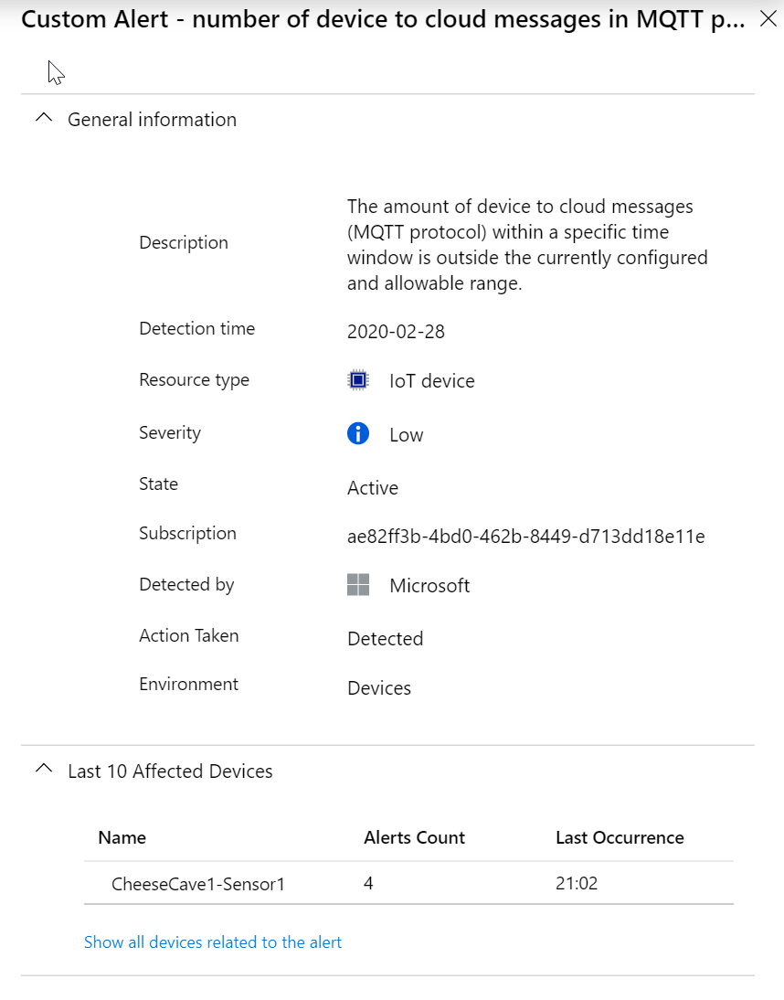

---
lab:
    title: '랩 18: Azure Defender for IoT를 사용하여 IoT 디바이스가 변조되었는지 검색'
    module: '모듈 10: Azure Defender 및 IoT 보안'
---

# Azure Defender for IoT를 사용하여 IoT 디바이스가 변조되었는지 검색

## 랩 시나리오

Contoso는 보안을 염두에 두고 모든 솔루션을 구축했습니다. 그러나 Azure IoT 솔루션을 포함하여 모든 온-프레미스 및 클라우드 워크로드에서 보안에 대한 통합된 보기를 마련할 수 있는 방법을 알아보고자 합니다. 또한 새 디바이스를 온보딩할 때 회사는 보안 표준을 준수하고 향상된 보안 태세를 보장하기 위해 워크로드(리프 디바이스, Microsoft Edge 디바이스, IoT Hub)에 보안 정책을 적용하려고 합니다.

Contoso는 새로운 주문에 대해 증가하는 배송 및 포장 수요를 충족하기 위해 새로운 IoT 디바이스를 갖춘 새로운 조립 라인을 추가하고 있습니다. 새로운 디바이스가 보호되는지 확인하고 솔루션의 보안을 지속적으로 개선하는 데 도움이 되는 보안 권장 사항을 확인하고 싶습니다(전체 엔드투엔드 IoT 솔루션 고려). 솔루션에 대해 IoT용 Azure IoT Center를 사용하여 조사를 시작합니다.

Contoso는 또한 다른 치즈 동굴에서 온도를 모니터링하고 제어하는 능력을 향상시키는 새로운 연결된 온도 조절 장치를 설치하고 있습니다. Contoso 보안 요구 사항의 일부로 온도 조절 장치가 예상 원격 분석 전송 주파수를 초과하는지 여부를 모니터링하는 사용자 지정 경고를 만듭니다.

다음 리소스가 만들어집니다.


> **팁**: **Azure Defender for IoT**의 이전 명칭은 **Azure Security Center for IoT**입니다. 이름 변경은 단계별로 적용되므로, 온라인 설명서, GitHub 리소스 및 이 콘텐츠에 두 가지 이름이 모두 나올 수도 있습니다.

## 랩 내용

이 랩에서는 다음 활동을 완료할 예정입니다.

* 랩 필수 구성 요소가 충족되는지 확인(필요한 Azure 리소스가 있음)

    * 필요한 경우 스크립트를 실행하여 IoT Hub 만들기

* Azure Defender for IoT를 사용하도록 설정
* 새 디바이스를 만들고 등록
* 보안 모듈 쌍 만들기
* Linux 디바이스에 C# 기반 보안 에이전트 설치
* 모니터링되는 리소스 구성
* 사용자 지정 경고 만들기
* 알림을 트리거하는 콘솔 앱을 만드세요.
* Azure Defender for IoT에서 경고 검토

## 랩 지침

### 실습 1: 랩 필수 구성 요소 확인

이 랩은 다음 Azure 리소스를 사용할 수 있다고 가정합니다.

| 리소스 유형 | 리소스 이름 |
| :-- | :-- |
| 리소스 그룹 | rg-az220 |
| IoT Hub | iot-az220-training-{your-id} |

이러한 리소스를 사용할 수 없는 경우 연습 2로 이동하기 전에 아래 설명에 따라 **lab18-setup.azcli** 스크립트를 실행해야 합니다. 스크립트 파일은 개발자 환경 구성(랩 3)의 일부로 로컬로 복제한 GitHub 리포지토리에 포함됩니다.

> **참고**: **lab18-setup.azcli** 스크립트는 **bash** 셸 환경에서 실행되도록 작성됩니다. 이는 Azure Cloud Shell에서 실행할 수 있는 가장 쉬운 방법입니다.

1. 브라우저를 사용하여 [Azure Cloud Shell](https://shell.azure.com/)을 열고 이 과정에 사용 중인 Azure 구독으로 로그인합니다.

1. Cloud Shell에 대한 스토리지 설정 관련 메시지가 표시되면 기본값을 수락합니다.

1. Cloud Shell에서 **Bash**를 사용하고 있는지 확인합니다.

    Azure Cloud Shell 페이지의 왼쪽 상단에 있는 드롭다운은 환경을 선택하는 데 사용됩니다. 선택한 드롭다운 값이 **Bash**인지 확인합니다.

1. Cloud Shell 도구 모음에서 **파일 업로드/다운로드**(오른쪽의 네 번째 단추)를 클릭합니다.

1. 드롭다운에서 **업로드**를 클릭합니다.

1. 파일 선택 대화 상자에서 개발 환경을 구성할 때 다운로드한 GitHub 랩 파일의 폴더 위치로 이동합니다.

    이 과정의 랩 3 "개발 환경 설정"에서 ZIP 파일을 다운로드하고 내용을 로컬로 추출하여 랩 리소스를 포함하는 GitHub 리포지토리를 복제했습니다. 추출된 폴더 구조에는 다음 폴더 경로가 포함됩니다.

    * Allfiles
      * Labs
          * 18-Azure-security-center-for-iot
            * Setup

    lab18-setup.azcli 스크립트 파일은 랩 18의 Setup 폴더에 있습니다.

1. **lab18-setup.azcli** 파일을 선택한 다음 **열기**를 클릭합니다.

    파일 업로드가 완료되면 알림이 표시됩니다.

1. 올바른 파일을 업로드했는지 확인하려면 다음 명령을 입력합니다.

    ```bash
    ls
    ```

    `ls` 명령으로 현재 디렉터리의 내용을 나열합니다. lab18-setup.azcli 파일이 나열됩니다.

1. 설치 스크립트가 포함된 이 랩에 대한 디렉터리를 만든 다음 해당 디렉터리로 이동하려면 다음 Bash 명령을 입력합니다.

    ```bash
    mkdir lab18
    mv lab18-setup.azcli lab18
    cd lab18
    ```

    이러한 명령은 이 랩의디렉터리를 만들고 **lab18-setup.azcli** 파일을 해당 디렉터리로 이동한 다음 디렉터리를 변경하여 새 디렉터리를 현재 작업 디렉터리로 만듭니다.

1. **lab18-setup.azcli**에 실행 권한이 있는지 확인하려면 다음 명령을 입력합니다.

    ```bash
    chmod +x lab18-setup.azcli
    ```

1. Cloud Shell 도구 모음에서 lab18-setup.azcli 파일에 액세스할 수 있도록 설정하려면 **편집기 열기**(오른쪽에서 두 번째 단추 - **{}**)를 클릭합니다.

1. **파일** 목록에서 lab18 폴더를 확장하고 스크립트 파일을 열려면 **lab18**를 클릭한 다음 **lab18-setup.azcli**를 클릭합니다.

    이제 편집기에서 **lab18-setup.azcli** 파일의 내용을 표시합니다.

1. 편집기에서 `{your-id}` 및 `{your-location}` 변수의 값을 업데이트합니다.

    아래 샘플을 예로 들면 `{your-id}`는 이 과정을 시작할 때 만든 고유 ID(**cah191211**)로 설정해야 하며 `{your-location}`는 리소스 그룹과 일치하는 위치로 설정해야 합니다.

    ```bash
    #!/bin/bash

    # 아래 값을 변경하세요!
    YourID="{your-id}"
    Location="{your-location}"
    ```

    > **참고**:  `{your-location}` 변수는 모든 리소스를 배포하는 지역의 짧은 이름으로 설정해야 합니다. 이 명령을 입력하면 사용 가능한 위치 및 짧은 이름(**이름** 열)의 목록을 볼 수 있습니다.

    ```bash
    az account list-locations -o Table

    DisplayName           Latitude    Longitude    Name
    --------------------  ----------  -----------  ------------------
    East Asia             22.267      114.188      eastasia
    Southeast Asia        1.283       103.833      southeastasia
    Central US            41.5908     -93.6208     centralus
    East US               37.3719     -79.8164     eastus
    East US 2             36.6681     -78.3889     eastus2
    ```

1. 파일의 변경 내용을 저장하고 편집기를 닫으려면 편집기 창 오른쪽 위의 **...** 를 클릭한 다음 **편집기 닫기**를 클릭합니다.

    저장하라는 메시지가 표시된 경우 **저장**을 클릭하면 편집기가 닫힙니다.

    > **참고**:  **CTRL+S**를 사용하여 언제든지 저장할 수 있으며 **CTRL+Q**를 사용하여 편집기를 닫을 수 있습니다.

1. 이 랩에 필요한 리소스를 만들려면 다음 명령을 입력합니다.

    ```bash
    ./lab18-setup.azcli
    ```

    이 작업을 실행하려면 몇 분 정도 걸립니다. 각 단계가 완료될 때 출력이 표시됩니다.

### 연습 2: Azure Defender for IoT Hub를 사용하도록 설정

Azure Defender for IoT를 사용하면 하이브리드 클라우드 워크로드 및 Azure IoT 솔루션 전반에 걸쳐 보안 관리를 통합하고 종단 간 위협 탐지와 분석을 사용할 수 있습니다.

Azure Defender for IoT는 다음과 같은 구성 요소로 구성됩니다.

* IoT Hub 통합
* 디바이스 에이전트(선택 사항)
* 보안 메시지 SDK 보내기
* 분석 파이프라인

#### 작업 1: Azure Defender for IoT를 사용하도록 설정

이 작업에서는 IoT Hub에서 **Azure Defender for IoT**를 사용하도록 설정합니다.

1. 필요한 경우 Azure 계정 자격 증명을 사용하여 Azure Portal에 로그인합니다.

    Azure 계정이 두 개 이상인 경우 이 과정에 사용할 구독에 연결된 계정으로 로그인해야 합니다.

1. Azure 대시보드에서 **iot-az220-training-{your-id}** 를 클릭합니다.

    대시보드의 rg-az220 리소스 그룹 타일에 IoT Hub로 이동하는 링크가 있습니다.

1. 왼쪽 메뉴의 **보안** 아래에서 **개요**를 클릭합니다.

    보안 창을 처음 열면 Azure Defender for IoT Hub가 온보딩됩니다.

1. **IoT 솔루션 보호 단추**가 표시되면 **IoT 솔루션 보호**를 클릭하고 메시지가 표시되면 브라우저 창을 새로 고칩니다.

    잠시 후 **이 IoT Hub의 온보딩이 성공했습니다. 변경 내용을 적용하려면 새로 고치세요.** 라는 메시지가 표시됩니다.

1. 보안 개요 창의 내용을 잠시 검토합니다.

    > **참고**: Azure Defender for IoT를 처음 온보딩하는 즉시 위협이 검색되지는 않습니다. 이 랩을 종료하기 전에 해당 개요 창에 위협 검색 내용이 보고되기 시작합니다.

#### 작업 2: Log Analytics 만들기

Azure Defender for IoT가 켜져 있으면 IoT 디바이스, IoT Edge 및 IoT Hub에 대한 원시 보안 이벤트, 경고 및 권장 사항을 저장하기 위한 Azure Log Analytics 작업 영역이 작성됩니다.

이 작업에서는 Log Analytics의 작업 영역 구성을 빠르게 살펴봅니다.

1. 왼쪽 탐색 영역의 **보안**에서 **설정**을 클릭합니다.

    **설정 페이지**가 표시되고 구성 가능한 영역 4개가 나열됩니다.

    * 데이터 수집
    * 권장 사항 구성
    * 모니터링되는 리소스
    * 사용자 지정 경고

1. 기본 **데이터 수집** 설정을 확인하려면 **데이터 수집**을 클릭합니다.

1. **작업 영역 구성** 섹션의 **연결하려는 Log Analytics 작업 영역 선택:** 아래에서 토글 단추가 **켜기**로 설정되어 있는지 확인합니다.

1. **구독** 드롭다운에서 이 랩에 사용 중인 구독이 선택되어 있는지 확인합니다.

1. **작업 영역** 드롭다운 아래에서 **새 작업 영역 만들기**를 클릭합니다.

1. **Log Analytics 작업 영역** 창의 **Log Analytics 작업 영역** 아래 **log-az220-training-{your-id}** 를 입력합니다.

1. **구독**에서 이 과정에 사용 중인 구독이 선택되어 있는지 확인합니다.

1. **리소스 그룹** 드롭다운에서 **rg-az220**을 클릭합니다.

1. **위치** 드롭다운에서 가장 가까운 Azure 지역이나 Azure IoT Hub가 프로비전되어 있는 지역을 선택합니다.

1. **가격 책정 계층**에서 **종량제**가 선택되어 있는지 확인합니다.

1. 작업 영역을 만들려면 **확인**을 클릭합니다.

    잠시 후 작업 영역이 작성되고 창이 닫힙니다.

1. **설정 | 데이터 수집** 페이지로 돌아와 **작업 영역** 드롭다운에서 **log-az220-training-{your-id}** 를 선택합니다.

1. **원시 보안 데이터 액세스**가 선택되어 있는지 확인합니다.

1. **심층 보안 권장 사항 및 사용자 지정 경고**가 선택되어 있는지 확인합니다.

1. **IP 데이터 수집**이 선택되어 있는지 확인합니다.

1. 데이터 수집 구성을 저장하려면 **저장**을 클릭합니다. 그런 후에 페이지를 닫으려면 페이지 오른쪽 상단에 있는 **닫기** 단추를 클릭합니다.

### 연습 3: 새 디바이스 만들기 및 등록

이 실행에서는 IoT 디바이스를 시뮬레이션하는 데 사용할 가상 머신을 설정합니다. 이 랩의 후반부에서는 이 디바이스를 사용하여 컨베이어 벨트의 진동을 측정합니다.

#### 작업 1: 새 IoT 디바이스 만들기

이 작업에서는 IoT 디바이스를 나타내는 가상 머신을 만듭니다. 이 랩에서는 시뮬레이션된 디바이스 코드가 아닌 VM을 사용합니다. IoT 디바이스(VM)에 보안 모듈을 설치할 것이기 때문입니다.

1. Azure 계정 자격 증명을 사용하여 [portal.azure.com](https://portal.azure.com)에 로그인합니다.

1. **리소스, 서비스 및 문서 검색** 필드에 **가상 머신**을 입력합니다.

1. 검색 결과의 **서비스**에서 **가상 머신**을 클릭합니다.

1. **가상 머신** 페이지에서 **+ 추가**를 클릭하고 **가상 머신**을 클릭합니다.

1. **가상 머신 만들기** 블레이드의 **구독** 드롭다운에서 이 과정에 사용 중인 구독이 선택되었는지 확인합니다.

1. **리소스 그룹** 드롭다운에서 **rg-az220vm**을 클릭합니다.

    > **참고**: 여기서는 리소스 그룹 하나를 사용하여 이 과정에서 만드는 모든 가상 머신 리소스를 추적하고 관리합니다. **rg-az220vm** 리소스 그룹을 아직 만들지 않았으면 아래 지침에 따라 지금 만듭니다.

    * **리소스 그룹** 드롭다운에서 **새로 만들기**를 클릭합니다.
    * 상황에 맞는 메뉴에서 **이름** 아래에 **rg-az220vm**을 입력하고 **확인**을 클릭합니다.

    > **참고**: 각 VM용으로 별도의 리소스 그룹을 만들라는 지침이 나올 수도 있습니다. 각 VM용으로 개별 리소스 그룹을 만들면 VM에 추가하는 리소스를 쉽게 관리할 수 있습니다. 하지만 이 과정에서는 VM을 단순한 방식으로 사용하므로 각 VM용으로 개별 리소스 그룹을 만들 필요도 없고 만들 수도 없습니다.

1. **인스턴스 세부 정보**의 **가상 머신 이름** 텍스트 상자에 **vm-az220-training-edge0002-{your-id}** 를 입력합니다.

1. **지역** 드롭다운에서 가장 가까운 Azure 지역 또는 Azure IoT Hub가 프로비전된 지역을 선택하세요.

1. **가용성 옵션** 드롭다운에서 **인프라가 중복될 필요가 없습니다**를 선택했는지 확인하세요.

    > **팁**:
    > Azure에서는 애플리케이션 가용성과 복원력을 관리하는 다양한 옵션을 제공합니다. 가용성 영역 또는 가용성 집합에 복제된 VM을 사용하도록 솔루션을 설계하면 데이터 센터 중단 및 유지 관리 이벤트 시 앱과 데이터를 보호할 수 있습니다. 이 랩에서는 고가용성 기능이 필요하지 않습니다.

1. **이미지** 필드에서 **Ubuntu Server 18.04 LTS - Gen1** 이미지를 선택합니다.

1. **Azure Spot 인스턴스** 필드는 선택하지 않은 상태로 유지합니다.

1. **크기**의 오른쪽에서 **크기 변경**을 클릭합니다.

1. **VM 크기 선택** 블레이드의 **VM 크기**에서 **Standard_B1ms**를 클릭한 다음 **선택**을 클릭합니다.

    목록에서 이 크기를 사용할 수 있게 하려면 **모든 필터 지우기** 링크를 사용해야 합니다.

    > **참고**: 일부 VM 크기는 일부 지역에서 사용할 수 없습니다. 이후 단계에서 VM 크기를 선택할 수 없는 경우 다른 지역을 시도해 보세요. 예를 들어 **미국 서부**에 사용 가능한 크기가 없는 경우 **미국 서부 2**를 사용해 보세요.

1. **관리자 계정**에서 **인증 유형**의 오른쪽에 있는 **암호**를 클릭합니다.

1. VM 관리자 계정은 **사용자 이름**, **암호** 및 **암호 확인** 필드에 값을 입력하세요.

    > **중요:** 이러한 값 없이는 VM에 연결할 수 없으니 잊어버리지 마세요.

1. **인바운드 포트 규칙**은 VM에 대한 인바운드 **SSH** 액세스를 사용하도록 구성됩니다.

    이 규칙은 VM을 원격으로 구성 및 관리하는 데 사용됩니다.

1. **검토 + 만들기**를 클릭합니다.

1. **유효성 검사 통과** 메시지가 블레이드 상단에 표시될 때까지 기다린 다음 **만들기**를 클릭합니다.

    > **참고**:  배포가 완료되기까지 최대 5분이 걸릴 수 있습니다. 배포 중에 다음 연습을 할 수 있습니다.

#### 작업 2: 새 디바이스 등록하기

디바이스를 연결하기 전 IoT Hub에 디바이스를 등록해야 합니다. 등록하세요.

1. Azure Portal 메뉴에서 **대시보드**를 클릭합니다.

1. rg-az220 리소스 그룹 타일에서 **iot-az220-training-{your-id}** 를 클릭합니다.

    IoT Hub 블레이드를 열 수 있는 수많은 방법이 있습니다. 원하는 메서드를 사용하세요.

1. 왼쪽 메뉴의 **탐색기** 아래에서 **IoT 디바이스**를 클릭합니다.

1. **IoT 디바이스** 창의 상단에서 **+ 새로 만들기**를 클릭합니다.

1. **디바이스 ID** 아래에 **vm-az220-training-edge0002-{your-id}** 를 입력합니다.

    예. VM에 할당한 이름을 디바이스 ID로 사용하고 있습니다.

    인증에 **대칭 키**를 사용할 것이므로 다른 설정을 기본값으로 그대로 둘 수 있습니다.

1. 블레이드 하단에서 **저장**을 선택하세요.

### 연습 4: 보안 모듈 쌍 만들기

Azure Defender for IoT는 기존 IoT 디바이스 관리 플랫폼과 완벽하게 통합되어 디바이스 보안 상태를 관리하고 기존 디바이스 제어 기능을 활용할 수 있도록 지원합니다.

Azure Defender for IoT는 모듈 쌍 메커니즘을 사용하고 각 디바이스에 대한 azureiotsecurity라는 보안 모듈 쌍을 유지 관리합니다. 보안 모듈 쌍에는 각 디바이스에 대한 디바이스 보안과 관련된 모든 정보가 포함되어 있습니다. Azure Defender for IoT 기능을 최대한 활용하려면 새 IoT Edge 디바이스용으로 이러한 보안 모듈 쌍을 작성, 구성 및 사용해야 합니다.

보안 모듈 쌍 (**azureiotsecurity**) 은 다음 메서드를 사용해 만들 수 있습니다.

* [모듈 일괄 처리 스크립트](https://github.com/Azure/Azure-IoT-Security/tree/master/security_module_twin)를 사용하세요. 이 스크립트는 기본 구성을 사용하여 새 디바이스 (또는 모듈 쌍이 없는 디바이스) 에 대한 모듈 쌍을 자동으로 만듭니다.
* 각 디바이스에 대해 특정하게 구성된 각 모듈 쌍을 개별적으로 수동 편집하세요.

이 작업에서는 수동으로 보안 모듈 쌍을 만듭니다.

1. 필요하다면 Azure Portal에서 IoT Hub의 **IoT 디바이스** 창으로 이동하세요.

    IoT Hub 블레이드에서 **IoT 디바이스** 창을 열려면 왼쪽 메뉴에서 **탐색기** 아래의 **IoT 디바이스**를 클릭합니다.

1. **디바이스 ID**에서 **vm-az220-training-edge0002-{your-id}** 를 클릭합니다.

    **추가 로드**를 클릭해야 디바이스가 표시될 수도 있습니다.

1. **vm-az220-training-edge0002-{your-id}** 블레이드 위쪽에서 **+ 모듈 ID 추가**를 클릭합니다.

1. **모듈 ID 추가** 창에서 **모듈 ID 이름** 아래에 **azureiotsecurity**를 입력합니다.

    인증에 대칭 키를 사용하므로 모든 필드를 기본값으로 그대로 둘 수 있습니다.

1. 창 하단에서 **저장**을 클릭합니다.

1. **vm-az220-training-edge0002-{your-id}** 블레이드의 **모듈 ID** 아래에 **azureiotsecurity** 디바이스가 표시됩니다.

    연결 상태는 **연결 끊김**입니다.

    > **중요**: 모듈 ID는 다른 고유 이름이 아닌 **azureiotsecurity**라고 해야 합니다.

    

1. **vm-az220-training-edge0002-{your-id}** 블레이드의 **기본 키** 오른쪽에서 **복사**를 클릭하고 나중에 확인할 수 있도록 값을 저장합니다.

    > **참고**: 연결 문자열이 아닌 디바이스의 **기본 키**를 복사해야 합니다.

    

1. IoT Hub 블레이드로 다시 이동합니다.

1. 왼쪽 메뉴에서 **개요**를 클릭합니다.

1. 블레이드 상단 근처의 Essentials 영역 내의, **호스트 이름** 오른쪽에서 **클립보드에 복사**를 클릭하고 나중을 위해 값을 저장하세요.

    > **참고**: IoT Hub 호스트 이름은 iot-az220-training-cah102119.azure-devices.net과 같은 형식입니다.

### 연습5: Azure Defender for IoT C# 보안 에이전트 배포

Azure Defender for IoT는 보안 데이터를 IoT Hub를 통해 로그, 처리, 집계, 그리고 전송하는 보안 에이전트에 대한 참조 아키텍처를 제공합니다. C 및 C# 기반 에이전트가 있습니다. C 에이전트는 좀 더 제한적이거나 최소한의 디바이스 리소스가 있는 디바이스에 권장됩니다.

보안 에이전트는 다음 기능을 지원합니다.

* 기본 운영 체제(Linux, Windows)에서 원시 보안 이벤트를 수집합니다. 사용 가능한 보안 데이터 수집기에 대해 더 알아보려면 Azure Defender for IoT 에이전트 구성을 참조하세요.
* 원시 보안 이벤트를 IoT Hub를 통해 전송된 메시지로 집계합니다.
* 기존 디바이스 ID 또는 전용 모듈 ID로 인증합니다. 자세한 내용은 보안 에이전트 인증 메서드를 참조하세요.
* **azureiotsecurity** 모듈 쌍을 사용하여 원격으로 구성합니다. 자세한 내용을 보려면 Azure Defender for IoT 에이전트 구성을 참조하세요.

이 실행에서는 시뮬레이션된 디바이스(Linux VM)에 배포할 C#용 보안 에이전트를 추가합니다.

#### 작업 1: IoT 디바이스에 로그인 - 리눅스 VM

1. 필요한 경우 Azure 계정 자격 증명을 사용하여 Azure Portal에 로그인합니다.

    Azure 계정이 두 개 이상인 경우 이 과정에 사용할 구독에 연결된 계정으로 로그인해야 합니다.

1. Azure Portal 메뉴에서 **모든 리소스**를 클릭하세요.

    **모든 서비스**가 아닌 **모든 리소스**를 선택해야 합니다.

1. **모든 리소스** 블레이드의 **이름으로 필터링** 텍스트 상자에 **vm-az220-training-edge0002** 를 입력합니다

1. **이름**에서 **vm-az220-training-edge0002-{your-id}** 를 클릭합니다.

    새로 만든 가상 머신 (**vm-az220-training-edge0002-{your-id}**) 의 개요 창이 열립니다.

1. 블레이드 상단에서 **연결**을 클릭한 다음 **SSH**를 클릭하세요.

1. 잠시 동안 **연결** 창의 내용 리뷰하기

    이전에 보았듯이 이 과정은 SSH 연결을 여는 예제 명령을 제공합니다.

1. 샘플 SSH 명령을 사용하여 VM 연결용 명령을 작성합니다.

    예제 명령을 텍스트 편집기로 복사한 다음, 명령에서 `-i <private key path>를 제거하세요. 다음과 같은 형식의 명령이 남아 있어야 합니다.

    ```cmd\sh
    ssh <admin user>@<ip address>
    ```

    여러분의 명령은 다음과 유사해야 합니다. `ssh demouser@52.170.205.79`

1. Azure Portal 도구 모음에서 **Cloud Shell**을 클릭합니다.

    Cloud Shell 내에서 **Bash** 환경을 선택했는지 확인합니다.

1. Cloud Shell 명령 프롬프트에서 위에서 만든 `ssh` 명령을 입력한 다음 **Enter 키**를 누릅니다.

1. **계속 연결하시겠습니까?** 라는 메시지가 나타나면 **네**라고 입력하고 **Enter 키**를 누르세요.

    해당 메시지는 VM에 대한 연결 보안에 사용된 인증서가 자체 서명된 인증서이므로 보안 확인입니다. 이 메시지에 대한 대답은 이후 연결을 위해 기억되며, 이 메시지는 첫 번째 연결에서만 표시됩니다.

1. 암호를 입력하라는 메시지가 나타나면 VM용으로 만든 관리자 암호를 입력하세요.

    연결되면 터미널 명령 프롬프트가 다음과 유사한 Linux VM의 이름을 표시하게 바뀝니다.

    ```cmd/sh
    demouser@vm-az220-training-edge0002-{your-id}:~$
    ```

    이렇게 해서 여러분이 연결된 VM과 현재 사용자를 추적할 수 있습니다.

#### 작업 3: 디바이스에 대칭 키 추가하기

보안 에이전트의 C# 버전으로 IoT Hub에 연결할 수 있습니다. 연결하려면 디바이스의 대칭 키 또는 인증서 정보가 필요합니다.

이 랩에서는 대칭 키를 인증으로 사용하고 디바이스의 임시 텍스트 문서에 저장해야 합니다.

1. **vm-az220-training-edge0002-{your-id}** 디바이스의 **기본 키** 값을 사용할 수 있는지 확인합니다.

    기본 키 값은 이 랩의 앞부분에서 저장했습니다. 해당 값을 저장하지 않았다면 다음 단계를 완료합니다.

    1. 새 브라우저 탭을 열고 그 새 탭에서 Azure Portal로 이동하세요.
    1. Azure Portal 메뉴에서 **대시보드**를 클릭한 다음 IoT Hub를 엽니다.
    1. 왼쪽 메뉴의 **탐색기** 아래에서 **IoT 디바이스**를 클릭합니다.
    1. **디바이스 ID**에서 **vm-az220-training-edge0002-{your-id}** 를 클릭합니다.
    1. 세부 정보 목록에서 **기본 키**를 복사하세요.
    1. Azure Cloud Shell 브라우저 탭으로 돌아옵니다. **vm-az220-training-edge0002-{your-id}** 가상 머신에 아직 연결되어 있어야 합니다.

1. Cloud Shell 명령 프롬프트에서 다음 명령을 입력합니다.

    ```cmd/sh
    echo "<primary_key>" > s.key
    ```

    이 명령은 **vm-az220-training-edge0002-{your-id}** 디바이스의 **기본 키**가 포함된 디바이스 인증 유형 파일을 만듭니다.

    > **참고**: 파일에 올바른 기본 키를 추가했는지 확인하려면 `nano s.key` 명령을 실행하여 파일을 엽니다. 디바이스의 **기본 키**가 파일에 있는지 확인합니다. 나노 편집기를 종료하려면 `Ctrl` 및 `X`를 길게 누르세요. `shift`와 `Y`를 길게 눌러 파일을 저장하세요. 그런 다음 enter 키를 누르세요.

#### 작업 4: 보안 에이전트 설치

1. Cloud Shell 세션이 여전히 SSH를 통해 VM에 연결되어 있는지 확인하세요.

1. Cloud Shell 명령 프롬프트에서 C#용 최신 버전 보안 에이전트를 디바이스에 다운로드하려면 다음 명령을 입력합니다.

    ```bash
    wget https://github.com/Azure/Azure-IoT-Security-Agent-CS/releases/download/0.0.6/ubuntu-18.04-x64.tar.gz
    ```

    > **참고**: 위의 명령은 Ubuntu Server 18.04 LTS를 대상으로 실행됩니다.

1. Cloud Shell 명령 프롬프트에서 패키지의 내용을 추출하고 `/Install` 폴더로 이동하려면 다음 명령을 입력하세요.

    ```bash
    tar -xzvf ubuntu-18.04-x64.tar.gz && cd Install
    ```

1. Cloud Shell 명령 프롬프트에서 `InstallSecurityAgent` 스크립트에 실행 권한을 추가하려면 다음 명령을 입력하세요.

    ```bash
    chmod +x InstallSecurityAgent.sh
    ```

1. Cloud Shell 명령 프롬프트에서 다음 명령을 사용자 지정한 후에 실행합니다.

    자리 표시자 값은 인증 매개 변수로 바꿔야 합니다.

    ```bash
    sudo ./InstallSecurityAgent.sh -i -aui Device -aum SymmetricKey -f <Insert file location of your s.key file> -hn <Insert your full IoT Hub host name> -di vm-az220-training-edge0002-{your-id}
    ```

    다음은 명령 형식의 예시입니다.

    `sudo ./InstallSecurityAgent.sh -i -aui Device -aum SymmetricKey -f ../s.key -hn iot-az220-training-ab200213.azure-devices.net -di vm-az220-training-edge0002-{your-id}`

    > **참고**: 나열된 호스트 이름 대신 IoT Hub 호스트 이름을 지정해야 합니다.

    > **중요**:
    > `-hn` 스위치 값으로는 **iot-az220-training-ab200213.azure-devices.net** 과 같은 전체 IoT Hub 호스트 이름을 사용해야 합니다.

    이 스크립트는 다음 기능을 수행합니다.

    * 필수 구성 요소를 설치합니다.
    * 서비스 사용자를 추가하세요 (대화형 로그인 해제).
    * 에이전트를 디먼으로 설치하세요. 디바이스가 서비스 관리를 위해 **systemd**를 사용한다고 가정합니다.
    * 에이전트가 특정 작업을 루트로 수행할 수 있도록 **sudo 사용자**를 구성하세요.
    * 제공된 인증 매개 변수를 사용하여 에이전트를 구성합니다.

1. Cloud Shell 터미널에서 출력을 보며 명령의 진행률을 관찰하세요.

    에이전트 설치를 완료하려면 재부팅해야 합니다.

1. Cloud Shell 터미널에서 재부팅을 시작하기 위해 **y**를 입력하세요.

    디바이스를 재부팅하면 SSH 세션이 손실됩니다.

1. Cloud Shell 명령 프롬프트에서 가상 머신에 다시 연결하려면, 이전에 사용한 SSH 명령을 입력하세요.

    Azure Defender for IoT 에이전트가 활성화되어 실행됩니다.

1. Azure Defender for IoT 에이전트의 배포 상태를 확인하려면 Cloud Shell 명령 프롬프트에서 다음 명령을 입력합니다.

    ```cmd/sh
    systemctl status ASCIoTAgent.service
    ```

    다음과 유사한 출력이 표시됩니다.

    ```log
    ● ASCIoTAgent.service - Azure Security Center for IoT Agent
       Loaded: loaded (/etc/systemd/system/ASCIoTAgent.service; enabled; vendor preset: enabled)
       Active: active (running) since Wed 2020-01-15 19:08:15 UTC; 3min 3s ago
     Main PID: 1092 (ASCIoTAgent)
        Tasks: 7 (limit: 9513)
       CGroup: /system.slice/ASCIoTAgent.service
            └─1092 /var/ASCIoTAgent/ASCIoTAgent
    ```

    특히 서비스가 **로드되었는지 확인해야 합니다. 로드** 및 **활성: 활성 (실행 중)**.

    > **참고**: Azure Defender for IoT가 실행되지 않거나 활성 상태가 아니면 [Linux용 Defender for IoT C# 기반 보안 에이전트 배포](https://docs.microsoft.com/ko-kr/azure/defender-for-iot/how-to-deploy-linux-css)의 내용을 확인하세요. 일반적인 문제는 서비스를 **활성 상태로 둘 수 있습니다. 활성화**는 부정확한 키 값이거나 IoT Hub 호스트 이름을 지정하지 않는 것입니다.

1. Azure Portal에서 IoT Hub 블레이드로 다시 이동하여 **vm-az220-training-edge0002-{your-id}** 디바이스 블레이드를 엽니다.

    IoT Hub 블레이드를 열고 탐색 메뉴의 **탐색기** 아래에서 **IoT 디바이스**를 클릭한 다음 **vm-az220-training-edge0002-{your-id}** 을 클릭합니다.

1. **모듈 ID** 아래에서 **azureiotsecurity** 모듈이 이제 **연결된** 상태임을 확인하세요.

    

Azure Defender for IoT 디바이스 에이전트를 디바이스에 설치했으므로 에이전트가 디바이스에서 원시 보안 이벤트를 수집, 집계 및 분석할 수 있습니다.

### 연습 6: 솔루션 관리 구성

Azure Defender for IoT는 Azure 기반 IoT 솔루션에 엔드투엔드 보안 기능을 제공합니다.

Azure Defender for IoT를 사용하면 하나의 대시보드에서 전체 IoT 솔루션을 모니터링하여 Azure의 IoT 디바이스, IoT 플랫폼 및 백 엔드 리소스를 모두 검색할 수 있습니다.

Azure Defender for IoT는 IoT Hub에서 사용하도록 설정되면 IoT Hub에 연결되고 IoT 솔루션과 관련된 다른 Azure 서비스를 자동으로 식별합니다.

자동 관계 검색 외에도 IoT 솔루션의 일부로 태그를 지정할 다른 Azure 리소스 그룹을 찾아서 선택할 수도 있습니다. 선택하는 경우 전체 구독, 리소스 그룹 또는 단일 리소스를 추가할 수 있습니다.

#### 작업 1: IoT Hub 열기

1. 브라우저에서 Azure Portal을 열고 IoT Hub로 이동하세요.

1. 왼쪽 메뉴에서 **보안** 아래에 있는 **설정**을 클릭합니다.

    **설정 페이지**에 다음 영역이 표시됩니다.

    * 데이터 수집
    * 권장 사항 구성
    * 모니터링되는 리소스
    * 사용자 지정 경고

1. 리소스 목록을 확인하려면 **모니터링되는 리소스**를 클릭합니다.

    리소스 목록에는 IoT Hub, 앞에서 Azure Defender for IoT를 활성화할 때 작성된 작업 영역 및 현재 구독이 이미 포함되어 있습니다.

1. 화면 상단에서 **편집**을 클릭하세요.

    **솔루션 관리**창이 열리며, 여기서 소유 리소스 그룹을 선택하여 보안 솔루션에 추가 Azure 리소스를 연결할 수 있습니다.

1. **구독**에서 이 과정에 사용 중인 구독을 선택했는지 확인하세요.

    > **참고:**
    > 리소스의 여러 구독을 보안 솔루션에 추가할 수 있습니다.

1. **리소스 그룹** 드롭다운에서 **rg-az220vm**을 클릭합니다.

    이제 두 개의 리소스 그룹을 선택해야 합니다. 방금 추가한 리소스 그룹의 추가 리소스를 반영하도록 리소스 목록이 업데이트 되었는지 확인하세요.

1. **솔루션 관리** 창 하단에서 **적용**을 클릭하세요.

    **적용** 단추를 사용할 수 없다면 걱정하지 마세요. 리소스는 이미 추가되었습니다.

1. **솔루션 관리** 창을 닫으세요.

모든 리소스 관계가 정의되면 Azure Defender for IoT는 Azure Defender를 활용하여 이러한 리소스에 대한 보안 권장 사항과 경고를 제공합니다.

#### 작업 2: Azure Defender for IoT의 작동 방식 확인

이제 디바이스에 보안 에이전트를 설치하였으며 솔루션을 구성하였습니다. 이번에는 Azure Defender for IoT의 다양한 보기를 확인해 보겠습니다.

1. 왼쪽 메뉴에서 **보안** 아래에 있는 **개요**를 클릭합니다.

    디바이스, 허브 및 기타 리소스에 대한 상태 개요가 두 개의 차트에 나타납니다. Azure IoT Defender를 켤 때 바로 활성화된 기본 제공 실시간 모니터링, 추천 및 경고를 볼 수 있습니다.

    

1. 모니터링되는 리소스를 확인하려면 왼쪽 메뉴의 **보안** 아래에서 **설정**을 클릭하고 **모니터링되는 리소스**를 클릭합니다.

    이 창에는 IoT 솔루션과 관련하여 현재 모니터링되는 모든 리소스가 표시됩니다. IoT 솔루션 전반의 전체적인 리소스 상태를 대략적으로 파악할 수 있으며, 각 리소스를 선택하여 추가 세부 정보를 확인할 수 있습니다. 리소스를 더 추가하려는 경우 **편집**을 클릭하고 추가하려는 리소스가 포함된 구독과 리소스 그룹을 선택하면 됩니다.

    > **중요**:
    > IoT 리소스의 보안 구성을 평가하는 프로세스는 실행하는 데 최대 24시간이 걸릴 수 있으므로, 대시보드에 표시된 초기 상태는 리소스의 실제 상태를 반영하지 않습니다.

    아래 이미지는 보안 평가를 수행한 후의 대시보드 상태를 보여줍니다.

    

### 연습 7: 사용자 지정 경고 소개하기

사용자 지정 보안 그룹 및 경고를 사용하여 전체 IoT 솔루션에서 엔드투엔드 보안 정보 및 범주형 디바이스 지식을 최대한 활용할 수 있습니다. 이는 솔루션에 대한 더 나은 보안을 제공하는 데 도움이 됩니다.

#### 사용자 지정 경고를 사용하는 이유는?

여러분은 기본으로 제공되는 알고리즘보다 여러분의 IoT 디바이스를 더 잘 알고 있습니다.

예상되는 디바이스 동작을 완전히 이해하고 있는 고객을 위해 Azure Defender for IoT를 사용하면 이러한 이해를 디바이스 동작 정책으로 변환하고 예상되는 정상적인 동작으로부터의 이탈에 대해 경고할 수 있습니다.

#### 작업 1 - 알림 사용자 지정하기

위에서 언급했듯이, 솔루션의 특정한 원하는 동작을 이해하는 고객은 원하는 동작을 초과할 때 트리거되는 사용자 지정 알림을 구성할 수 있습니다. 이 연습에서는 **MQTT** 프로토콜을 통해 **디바이스-클라우드** 메시지를 모니터링하는 사용자 지정 알림을 만듭니다.

정상적인 상황에서 Contoso의 치즈 동굴 모니터링 시스템은 IoT Hub 온도 및 습도 데이터를 높은 비율로 전송하지 않습니다. 각 디바이스는 5분 동안 1~5개의 디바이스-클라우드 메시지를 보낼 것으로 예상됩니다. 이 범위는 온도가 더 빠르게 변할 수 있고 값이 설정한 경계 값을 벗어나지 않도록 하기 위해 필요할 수 있는 보다 빈번한 데이터가 필요할 수 있는 황혼 기간을 수용합니다.

이 작업에서는 사용자 지정 알림을 만듭니다.

1. Azure Portal에서 IoT Hub 블레이드로 이동하세요.

1. 왼쪽 메뉴에서 **보안** 아래에 있는 **설정**을 클릭합니다.

    **설정 페이지**에 다음 영역이 표시됩니다.

    * 데이터 수집
    * 권장 사항 구성
    * 모니터링되는 리소스
    * 사용자 지정 경고

1. 사용자 지정 경고 목록을 확인하려면 **사용자 지정 경고**를 클릭합니다.

1. 잠시 동안 **사용자 지정 알림** 창을 검사하세요.

    언뜻 보기에 이 창이 비어 있는 것처럼 보일 수 있지만, **이름** 아래에 나열된 항목은 실제로 자동으로 만든 **기본** 보안 그룹입니다.

    보안 그룹을 사용하면 디바이스의 논리적 그룹을 정의하고 해당 보안 상태를 중앙 집중식으로 관리할 수 있습니다. 이러한 그룹은 특정 하드웨어가 있는 디바이스, 특정 위치에 배포된 디바이스 또는 특정 요구 사항에 적합한 다른 그룹을 나타낼 수 있습니다.

1. 기본 보안 그룹에 사용자 지정 알림을 추가하려면 **기본**을 클릭하세요.

    **디바이스 보안 그룹** 블레이드에는 모든 활성 사용자 지정 알림이 나열됩니다. 이 블레이드에는 처음 방문했으므로, 비어있을 것입니다.

1. 블레이드 상단에서 **사용자 지정 경고 규칙 만들기**를 클릭하세요.

    **사용자 지정 경고 규칙 만들기** 창이 열립니다. **디바이스 보안 그룹** 필드가 **기본** 그룹으로 채워졌는지 확인하세요.

1. **사용자 지정 알림** 드롭다운에서 **허용되지 않은 범위의 디바이스 - 클라우드 메시지의 수 (MQTT 프로토콜)** 를 클릭하세요.

    > **팁**:
    > 사용 가능한 많은 사용자 지정 알림을 리뷰하세요. 솔루션을 보호하는 데 어떻게 사용할 수 있는지 고려하세요.

    > **참고**:
    > **설명** 및 **필수 속성**은 선택한 **사용자 지정 알림**에 따라 변경됩니다.

1. **필수 속성**에서 **최소 임계값 필드**에 **1**을 입력하세요.

    이렇게 하면 5분 동안 한 개 이상의 메시지를 보내야 한다는 기대를 충족합니다.

1. **최대 임계값**에 **5**를 입력하세요.

    이는 5분 동안 다섯 개 이하의 메시지를 전송해야 한다는 기대를 충족합니다.

1. **시간 창 크기** 드롭다운에서 **00:05:00**을 클릭하세요.

    이것은 설정한 오 분의 시간을 충족합니다.

    > **참고**:
    사용 가능한 시간 창은 4개 있습니다.
    > * 5분
    > * 10분
    > * 15분
    > * 30분

1. **사용자 지정 경고 규칙** 창 하단에서 **확인**을 클릭하세요.

1. **기본** (디바이스 보안 그룹) 블레이드 상단에서 **저장**을 클릭하세요.

    새 경고를 저장하지 않으면 나중에 IoT Hub를 닫을 때 해당 경고가 삭제됩니다.

    사용자 지정 알림 목록으로 돌아갑니다. 다음은 여러 사용자 지정 알림을 보여 주는 이미지입니다.

    

### 연습 8: 디바이스 앱 구성하기

이 연습에서는 IoT Hub 디바이스와 .Net Core 콘솔 애플리케이션(#C)을 구성합니다. 이 애플리케이션은 **Microsoft.Azure.Devices.Client** nuget 패키지를 활용하여 IoT Hub에 연결합니다. 콘솔 애플리케이션은 10초마다 원격 분석을 보내고, 사용자 지정 알림 (이전 실행에서 만든 사용자 지정 알림) 에 구성한 디바이스-클라우드 메시지 임계값을 초과하도록 설계하였습니다.

#### 작업 1: 새 IoT 디바이스 등록하기

연결하기 전에 디바이스를 IoT Hub에 등록해야 합니다.

1. Azure Portal 메뉴에서 **대시보드**를 클릭한 다음 IoT Hub를 엽니다.

1. 왼쪽 메뉴의 **탐색기** 아래에서 **IoT 디바이스**를 클릭합니다.

1. **IoT 디바이스** 창 상단에서 **+ 새로 만들기**를 클릭합니다.

1. **디바이스 만들기** 블레이드에서 **디바이스 ID** 아래에 **sensor-th-0070**를 입력합니다.

    인증용 **대칭 키**를 사용할 것이므로 다른 값을 기본으로 두세요.

1. 블레이드 하단에서 **저장**을 선택하세요.

1. **IoT 디바이스** 창의 **디바이스 ID** 아래에서 **sensor-th-0070**을 클릭합니다.

    **sensor-th-0070** 디바이스에 액세스하려면 **추가 로드**를 클릭해야 할 수 있습니다.

1. 디바이스 쌍을 표시하려면 **디바이스 쌍**을 클릭합니다.

    다음과 같은 기존 디바이스 쌍 JSON이 표시됩니다.

    ```json
    {
        "deviceId": "sensor-th-0070",
        "etag": "AAAAAAAAAAE=",
        "deviceEtag": "Mjg2NzY5NzAw",
        "status": "enabled",
        "statusUpdateTime": "0001-01-01T00:00:00Z",
        "connectionState": "Disconnected",
        "lastActivityTime": "0001-01-01T00:00:00Z",
        "cloudToDeviceMessageCount": 0,
        "authenticationType": "sas",
        "x509Thumbprint": {
            "primaryThumbprint": null,
            "secondaryThumbprint": null
        },
        "version": 2,
        "tags": {
            "SecurityGroup": "default"
        },
        "properties": {
            "desired": {
                "$metadata": {
                    "$lastUpdated": "2020-06-11T13:09:38.4712899Z"
                },
                "$version": 1
            },
            "reported": {
                "$metadata": {
                    "$lastUpdated": "2020-06-11T13:09:38.4712899Z"
                },
                "$version": 1
            }
        },
        "capabilities": {
            "iotEdge": false
        }
    }
    ```

1. **default** 보안 그룹에 디바이스를 추가하려면 **version** 필드와 **properties** 필드 사이에 다음 JSON을 삽입합니다.

    ```json
    "tags": {
        "SecurityGroup": "default"
    },
    ```

    이렇게 완성한 JSON은 다음과 같습니다.

    ```json
    {
        "deviceId": "sensor-th-0070",
        "etag": "AAAAAAAAAAE=",
        "deviceEtag": "Mjg2NzY5NzAw",
        "status": "enabled",
        "statusUpdateTime": "0001-01-01T00:00:00Z",
        "connectionState": "Disconnected",
        "lastActivityTime": "0001-01-01T00:00:00Z",
        "cloudToDeviceMessageCount": 0,
        "authenticationType": "sas",
        "x509Thumbprint": {
            "primaryThumbprint": null,
            "secondaryThumbprint": null
        },
        "version": 2,
        "tags": {
            "SecurityGroup": "default"
        },
        "properties": {
            "desired": {
                "$metadata": {
                    "$lastUpdated": "2020-06-11T13:09:38.4712899Z"
                },
                "$version": 1
            },
            "reported": {
                "$metadata": {
                    "$lastUpdated": "2020-06-11T13:09:38.4712899Z"
                },
                "$version": 1
            }
        },
        "capabilities": {
            "iotEdge": false
        }
    }
    ```

1. 업데이트된 JSON을 적용하려면 **저장**을 클릭합니다.

1. **디바이스 쌍** 창을 닫고 **sensor-th-0070** 세부 정보 보기로 돌아옵니다.

1. **주요 연결 문자열**의 오른쪽에서 **복사**를 클릭한 다음 값을 텍스트 파일에 저장하세요.

    이 연결 문자열은 sensor-th-0070 디바이스용입니다. 디바이스 앱의 연결 문자열 값이 필요합니다.

#### 작업 2: Cave Device 앱 구성

1. **Visual Studio Code**를 엽니다.

1. **파일** 메뉴에서 **폴더 열기**를 클릭합니다.

1. 폴더 열기 대화 상자에서 랩 18 Starter 폴더로 이동합니다.

1. **CaveDevice**를 클릭하고 **폴더 선택**을 클릭합니다.

    Visual Studio Code의 EXPLORER 창에 다음 파일이 나열되어야 합니다.

    * Program.cs
    * CaveDevice.csproj

1. **Program.cs** 파일을 엽니다.

    **CaveDevice** 애플리케이션은 이전 랩에서 사용한 애플리케이션과 매우 비슷함을 쉽게 확인할 수 있습니다. 이 애플리케이션 버전에서는 지연 시간이 길어져서 메시지가 10초마다 전송됩니다. `await Task.Delay(10000);`

1. **터미널** 메뉴에서 **새 터미널**을 클릭합니다.

    명령 프롬프트의 일부로 표시된 디렉터리 경로를 확인합니다. 이전 랩 프로젝트의 폴더 구조 내에서 이 프로젝트를 빌드하지 않으려고 합니다.

1. 터미널 명령 프롬프트에서 애플리케이션 빌드를 확인하려면 다음 명령을 입력합니다.

   ```bash
   dotnet build
   ```

    그러면 다음과 같은 출력이 표시됩니다.

    ```text
    ❯ dotnet build
    Microsoft (R) Build Engine version 16.5.0+d4cbfca49 for .NET Core
    Copyright (C) Microsoft Corporation. All rights reserved.

    Restore completed in 39.27 ms for D:\Az220-Code\AllFiles\Labs\15-Remotely monitor and control devices with Azure IoT Hub\Starter\CheeseCaveDevice\CheeseCaveDevice.csproj.
    CheeseCaveDevice -> D:\Az220-Code\AllFiles\Labs\15-Remotely monitor and control devices with Azure IoT Hub\Starter\CheeseCaveDevice\bin\Debug\netcoreapp3.1\CheeseCaveDevice.dll

    Build succeeded.
        0 Warning(s)
        0 Error(s)

    Time Elapsed 00:00:01.16
    ```

1. 코드 편집기 창에서 다음 코드 줄을 찾습니다.

    ```csharp
    private readonly static string deviceConnectionString = "<your device connection string>";
    ```

1. `<your device connection string>`은 sensor-th-0070 디바이스의 기본 연결 문자열로 바꿉니다.

1. **파일** 메뉴에서 **저장**을 클릭합니다.

1. 애플리케이션을 빌드하고 실행하려면 터미널 명령 프롬프트에서 다음 명령을 입력합니다.

    ```bash
    dotnet run
    ```

1. 원격 분석 메시지가 IoT Hub에 정상적으로 전송되고 있는지 확인합니다.

    다음과 같은 출력이 표시되어야 합니다.

    ```text
    IoT Hub C# Simulated Thermostat Device. CTRL+C to exit.

    2/28/2020 1:32:21 PM > Sending message: {"temperature":25.7199231282435,"humidity":79.50078555359542}
    2/28/2020 1:32:31 PM > Sending message: {"temperature":21.877205091005752,"humidity":61.30029373862794}
    2/28/2020 1:32:41 PM > Sending message: {"temperature":21.245898961204055,"humidity":71.36471955634873}
    2/28/2020 1:32:51 PM > Sending message: {"temperature":32.61750500072609,"humidity":66.07430422961447}
    2/28/2020 1:33:01 PM > Sending message: {"temperature":31.100763578946125,"humidity":79.93955616836416}
    2/28/2020 1:33:11 PM > Sending message: {"temperature":25.02041019034591,"humidity":70.50569472392355}
    ```

    이 랩의 나머지 부분에서 앱을 실행 상태로 두면 여러 알림이 생성될 수 있습니다.

### 연습 9: Azure Defender for IoT 경고 검토

이 시점에서 콘솔 앱은 이전에 만든 사용자 지정 경고를 트리거하기에 충분한 원격 분석을 보냈습니다.

> **팁**:
> 5분 시간 창 이내에 디바이스에서 클라우드로 전송된 메시지가 1개 미만 또는 5개 이상인 경우 알림이 트리거하도록 설정되었습니다.

#### 작업 1: Azure Defender for IoT 대시보드 검토

1. Azure Portal 메뉴에서 **대시보드**를 클릭한 다음 IoT Hub를 엽니다.

1. 왼쪽 메뉴에서 **보안** 아래에 있는 **개요**를 클릭합니다.

    **위협 탐지** 섹션을 살펴보세요. **디바이스 보안 경고** 차트에서 하나 이상의 경고를 볼 수 있어야 합니다.

    

    또한 **경고가 가장 많은 디바이스** 타일에 **sensor-th-0070** 디바이스에 해당하는 항목이 표시됩니다.

    

    > **참고**: 대시보드에 경고가 표시되려면 최대 30분이 걸릴 수 있습니다.

1. **위협 탐지**에서 **가장 알림이 많이 발생한 디바이스** 타일을 클릭하세요.

    왼쪽 메뉴에서 **보안** 아래의 **보안 경고**를 클릭하는 경우에 표시되는 것과 같은 **경고** 블레이드가 열립니다.

    보안 알림 목록이 표시됩니다.

    

    최신 알림은 **신규** 레이블로 표시됩니다.

1. 최신 알림을 클릭합니다.

    세부 창이 열립니다. **일반 정보**는 알림에 관련된 상위 수준 정보를 제공합니다. 그리고 일반 정보 아래의 **마지막으로 영향을 받은 디바이스 10개**에 **sensor-th-0070** 디바이스가 표시됩니다.

    

1. Visual Studio Code로 돌아가서 디바이스 앱을 종료합니다.

    터미널 창에 입력 포커스를 배치하고 **CTRL+C**를 눌러 앱을 닫을 수 있습니다.
