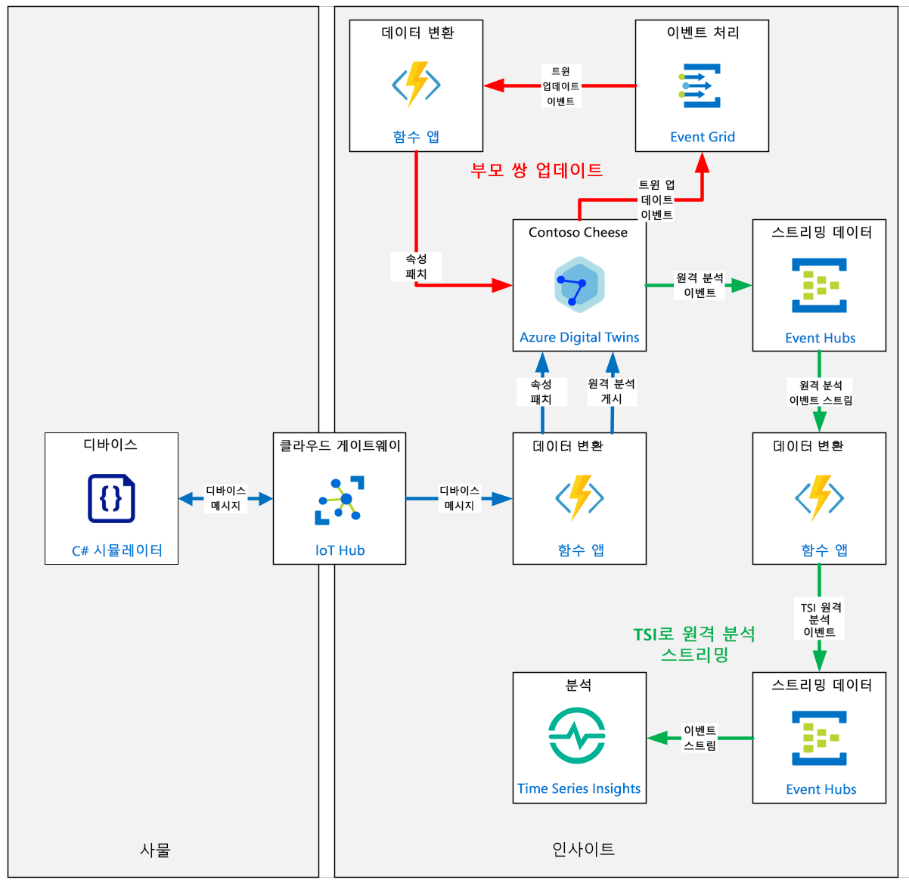
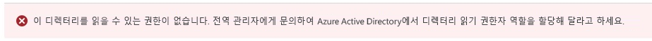
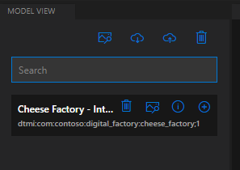
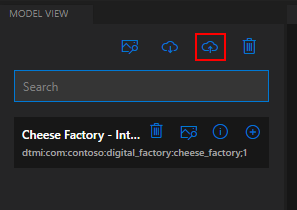
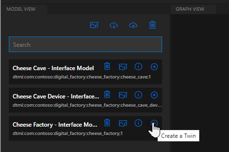
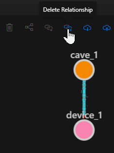
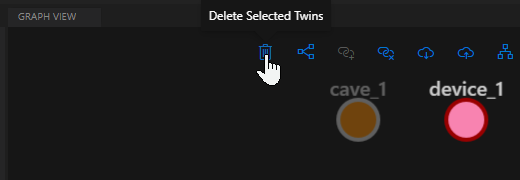
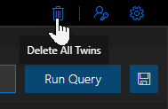
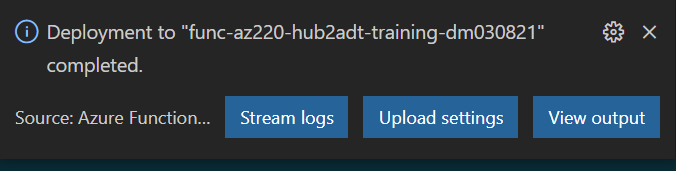
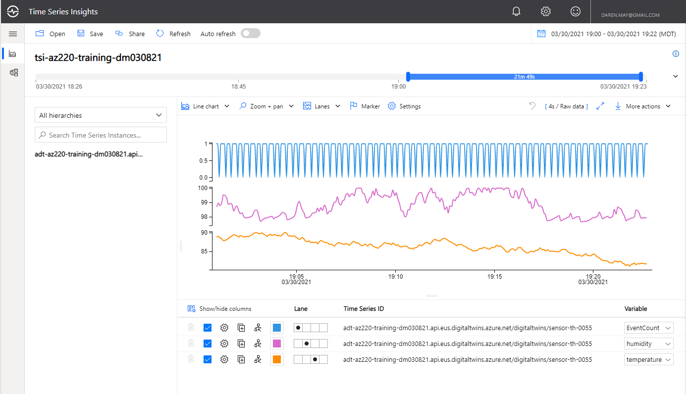

---
lab:
    title: '랩 19: ADT(Azure Digital Twins) 솔루션 개발'
    module: '모듈 11: Azure Digital Twins를 사용하여 개발 작업 수행'
---

# ADT(Azure Digital Twins) 솔루션 개발

## 랩 시나리오

디지털 혁신의 차기 단계 진행을 결정한 Contoso Management에서는 ADT(Azure Digital Twins)를 사용하여 치즈 생산 시설의 모델을 개발하기로 했습니다. Azure Digital Twins를 사용하면 실제 환경의 라이브 모델을 만들어 해당 모델과 상호 작용할 수 있습니다. 먼저 개별 요소를 디지털 트윈으로 모델링합니다. 그런 다음, 라이브 이벤트에 응답하고 정보를 쿼리할 수 있는 기술 자료 그래프에 이러한 모델을 연결합니다.

여러분은 ADT를 가장 효율적으로 활용하는 방법을 자세히 파악하기 위한 개념 증명 프로토타입 제작 업무를 맡게 되었습니다. 이 프로토타입은 기존 Cheese Cave Device 센서 원격 정보를 다음과 같은 간단한 모델 계층 구조에 통합할 수 있는 방법을 제시해야 합니다.

* Cheese Factory
* Cheese Cave
* Cheese Cave Device

이 1차 프로토타입에서 다음 시나리오에 사용 가능한 솔루션을 제시하라는 요청을 받았습니다.

* 디바이스 원격 분석을 IoT Hub에서 ADT의 적절한 디바이스로 매핑하는 방법
* 자식 디지털 트윈 속성을 업데이트하여 부모 트윈 속성을 업데이트하는 방법(Cheese Cave Device 속성을 업데이트하여 Cheese Cave 속성 업데이트)
* ADT를 통해 Time Series Insights로 디바이스 원격 분석을 라우팅할 수 있는 방법

다음 리소스가 만들어집니다.



## 랩 내용

이 랩에서는 다음 활동을 완료할 예정입니다.

* 랩 필수 구성 요소가 충족되는지 확인(필요한 Azure 리소스가 있음)
* 디지털 트윈 모델 디자인 및 개발
  * ADT(Azure Digital Twins) 인스턴스 만들기 및 구성
  * IoT 디바이스 데이터를 ADT 모델 및 관계에 매핑
  * 디지털 트윈 모델 만들기 및 모델 유효성 검사
* 디지털 트윈 만들기 및 구성
  * DTDL을 사용하여 디지털 트윈 만들기
  * 디지털 트윈 인스턴스를 사용하여 ADT 그래프 작성
* ADT 그래프 상호 작용 구현(ADT Explorer)
  * ADT Explorer 설치 및 실행
  * ADT 그래프 쿼리
  * 그래프에서 ADT 엔터티의 속성 업데이트
* 업스트림 및 다운스트림 시스템과 ADT 통합
  * IoT 디바이스 메시지를 수집하여 ADT로 변환
  * 원격 분석을 TSI(Time Series Insights)에 게시하도록 ADT 경로 및 엔드포인트 구성

## 랩 지침

### 실습 1: 랩 필수 구성 요소 확인

#### 작업 1 – 리소스 만들기

이 랩은 다음 Azure 리소스를 사용할 수 있다고 가정합니다.

| 리소스 유형  | 리소스 이름                |
| :------------- | :--------------------------- |
| 리소스 그룹 | rg-az220                     |
| IoT Hub        | iot-az220-training-{your-id} |
| TSI            | tsi-az220-training-{your-id} |
| TSI 액세스 정책 | access1                   |

> **참고**:  **lab19-setup.azcli** 스크립트는 **bash** 셸 환경에서 실행되도록 작성됩니다. 이는 Azure Cloud Shell에서 실행할 수 있는 가장 쉬운 방법입니다.

1. 브라우저를 사용하여 [Azure Cloud Shell](https://shell.azure.com/)을 열고 이 과정에 사용 중인 Azure 구독으로 로그인합니다.

1. Cloud Shell에 대한 스토리지 설정 관련 메시지가 표시되면 기본값을 수락합니다.

1. Cloud Shell에서 **Bash**를 사용하고 있는지 확인합니다.

    Azure Cloud Shell 페이지의 왼쪽 상단에 있는 드롭다운은 환경을 선택하는 데 사용됩니다. 선택한 드롭다운 값이 **Bash**인지 확인합니다.

1. Cloud Shell 도구 모음에서 **파일 업로드/다운로드**(오른쪽의 네 번째 단추)를 클릭합니다.

1. 드롭다운에서 **업로드**를 클릭합니다.

1. 파일 선택 대화 상자에서 개발 환경을 구성할 때 다운로드한 GitHub 랩 파일의 폴더 위치로 이동합니다.

    이 과정의 랩 3 "개발 환경 설정"에서 ZIP 파일을 다운로드하고 내용을 로컬로 추출하여 랩 리소스를 포함하는 GitHub 리포지토리를 복제했습니다. 추출된 폴더 구조에는 다음 폴더 경로가 포함됩니다.

    * Allfiles
      * Labs
          * 19-Azure Digital Twins
            * 설정

    lab19-setup.azcli 스크립트 파일은 랩 19의 Setup 폴더에 있습니다.

1. **lab19-setup.azcli** 파일을 선택한 다음 **열기**를 클릭합니다.

    파일 업로드가 완료되면 알림이 표시됩니다.

1. 올바른 파일을 업로드했는지 확인하려면 다음 명령을 입력합니다.

    ```bash
    ls
    ```

    `ls` 명령으로 현재 디렉터리의 내용을 나열합니다. lab19-setup.azcli 파일이 나열됩니다.

1. 설치 스크립트가 포함된 이 랩에 대한 디렉터리를 만든 다음 해당 디렉터리로 이동하려면 다음 Bash 명령을 입력합니다.

    ```bash
    mkdir lab19
    mv lab19-setup.azcli lab19
    cd lab19
    ```

    이러한 명령은 이 랩의디렉터리를 만들고 **lab19-setup.azcli** 파일을 해당 디렉터리로 이동한 다음 디렉터리를 변경하여 새 디렉터리를 현재 작업 디렉터리로 만듭니다.

1. **lab19-setup.azcli**에 실행 권한이 있는지 확인하려면 다음 명령을 입력합니다.

    ```bash
    chmod +x lab19-setup.azcli
    ```

1. Cloud Shell 도구 모음에서 lab19-setup.azcli 파일에 액세스할 수 있도록 설정하려면 **편집기 열기**(오른쪽에서 두 번째 단추 - **{}**)를 클릭합니다.

1. **파일** 목록에서 lab19 폴더를 확장하고 스크립트 파일을 열려면 **lab19**를 클릭한 다음 **lab19-setup.azcli**를 클릭합니다.

    이제 편집기에서 **lab19-setup.azcli** 파일의 내용을 표시합니다.

1. 편집기에서 `{your-id}` 및 `{your-location}` 변수의 값을 업데이트합니다.

    아래 샘플을 예로 들면 `{your-id}`는 이 과정을 시작할 때 만든 고유 ID (**cah191211**) 로 설정해야 하며 `{your-location}`는 리소스 그룹과 일치하는 위치로 설정해야 합니다.

    ```bash
    #!/bin/bash

    # 아래 값을 변경하세요!
    YourID="{your-id}"
    Location="{your-location}"
    ```

    > **참고**:  `{your-location}` 변수는 모든 리소스를 배포하는 지역의 짧은 이름으로 설정해야 합니다. 이 명령을 입력하면 사용 가능한 위치 및 짧은 이름(**이름** 열)의 목록을 볼 수 있습니다.

    ```bash
    az account list-locations -o Table

    DisplayName           Latitude    Longitude    Name
    --------------------  ----------  -----------  ------------------
    East Asia             22.267      114.188      eastasia
    Southeast Asia        1.283       103.833      southeastasia
    Central US            41.5908     -93.6208     centralus
    East US               37.3719     -79.8164     eastus
    East US 2             36.6681     -78.3889     eastus2
    ```

1. 파일의 변경 내용을 저장하고 편집기를 닫으려면 편집기 창 오른쪽 위의 **...** 를 클릭한 다음 **편집기 닫기**를 클릭합니다.

    저장하라는 메시지가 표시된 경우 **저장**을 클릭하면 편집기가 닫힙니다.

    > **참고**:  **CTRL+S**를 사용하여 언제든지 저장할 수 있으며 **CTRL+Q**를 사용하여 편집기를 닫을 수 있습니다.

1. 이 랩에 필요한 리소스를 만들려면 다음 명령을 입력합니다.

    ```bash
    ./lab19-setup.azcli
    ```

    이 작업을 실행하려면 몇 분 정도 걸립니다. 각 단계가 완료될 때 출력이 표시됩니다.

#### 작업 2 – 도구 확인

1. 명령 프롬프트를 열고 다음 명령을 실행하여 Azure CLI가 로컬에 설치되어 있는지 확인합니다.

    ```powershell
    az --version
    ```

1. 출력에 azure-cli 버전 2.4.0 이상이 표시되는지 확인합니다.

    Azure CLI가 설치되어 있지 않으면 계속 진행하기 전에 설치해야 합니다.

### 연습 2: Azure Digital Twins 리소스의 인스턴스 만들기

이 연습에서는 Azure Portal을 사용하여 ADT(Azure Digital Twins) 인스턴스를 만듭니다. 그러면 Azure Digital Twins의 연결 데이터가 나중에 사용 가능하도록 텍스트 파일에 저장됩니다. 마지막으로, 현재 사용자에게 ADT 리소스 액세스를 허용하는 역할을 할당합니다.

#### 작업 1: Azure Portal을 사용하여 리소스(Azure Digital Twins) 만들기

1. 새 브라우저 창에서 [Azure Portal](https://portal.azure.com)을 엽니다.

1. Azure Portal 메뉴에서 **+ 리소스 만들기**를 클릭합니다.

    그러면 열리는 **새로 만들기** 블레이드는 Azure Marketplace의 프런트 엔드입니다. Azure Marketplace에서는 Azure에서 만들 수 있는 모든 리소스의 컬렉션이 제공됩니다. 마켓플레이스에는 Microsoft와 커뮤니티의 리소스가 포함되어 있습니다.

1. **Marketplace 검색** 텍스트 상자에 **Azure Digital Twins**를 입력합니다.

1. 옵션이 표시되면 **Azure Digital Twins**를 선택하고 **만들기**를 클릭합니다.

1. **리소스 만들기** 창의 **구독**에서 이 과정에 사용 중인 구독이 선택되어 있는지 확인합니다.

    > **참고**: 계정에 구독의 관리자 역할이 할당되어 있어야 합니다.

1. **리소스 그룹**으로 **rg-az220**를 선택합니다.

1. **위치** 드롭다운에서 Azure IoT Hub가 프로비전된 지역을 선택합니다.

1. **리소스 이름**으로 **adt-az220-training-{your-id}** 를 입력합니다.

1. 입력한 값을 검토하려면 **검토 + 만들기**를 클릭합니다.

1. 배포 프로세스를 시작하려면 **만들기**를 클릭합니다.

    **배포 진행 중**이 표시되는 동안 잠시 기다립니다.

1. **리소스로 이동**을 선택합니다.

    ADT 리소스의 개요 창이 표시됩니다. 이 창에는 제목이 **Azure Digital Twins 시작**인 본문 섹션이 포함되어 있습니다.

#### 작업 2: 참조 파일에 연결 데이터 저장

1. **메모장** 또는 유사한 텍스트 편집기를 사용해 **adt-connection.txt** 파일을 만듭니다.

1. 이 파일에 Azure Digital Twins 인스턴스의 이름인 **adt-az220-training-{your-id}** 를 추가합니다.

1. 이 파일에 리소스 그룹인 **rg-az220**을 추가합니다.

1. 브라우저에서 Digital Twins 인스턴스 **개요** 창으로 돌아옵니다.

1. 개요 창의 **필수** 섹션에서 **호스트 이름** 필드를 찾습니다.

1. **호스트 이름** 필드를 마우스 포인터로 가리키고 값 오른쪽에 나타나는 아이콘을 사용하여 호스트 이름을 클립보드에 복사한 후 텍스트 파일에 붙여넣습니다.

1. 텍스트 파일에서 호스트 이름 시작 부분에 **https://** 를 추가하여 호스트 이름을 Digital Twins 인스턴스의 연결 URL로 변환합니다.

    수정된 URL은 다음과 같습니다.

    ```http
    https://adt-az220-training-dm030821.api.eus.digitaltwins.azure.net
    ```

1. **adt-connection.txt** 파일을 저장합니다.

#### 작업 3: ADT 역할 할당 구성

1. 사용자 역할을 업데이트하려면 왼쪽 메뉴에서 **액세스 제어(IAM)** 를 클릭합니다.

1. 현재 사용자 액세스 권한을 확인하려면 **내 액세스 권한 보기**를 클릭합니다.

    그러면 표시되는 창에 현재 사용자에게 할당된 역할이 나열됩니다. 현재 사용자에게는 **서비스 관리자** 역할이 할당되어 있습니다. 이 역할은 ADT를 만들 때 할당된 것입니다.

1. **할당** 창을 닫습니다.

1. 모든 사용자의 기존 역할 할당을 확인하려면 **역할 할당** 탭을 선택합니다.

    현재 계정 사용자가 **소유자** 역할 아래에 표시되어야 합니다.

    > **참고**: 다음 오류가 표시되는 경우 무시하면 됩니다. 이 랩에서는 다른 역할 할당 확인을 위한 액세스 권한이 필요하지 않습니다.
    > 

1. 새 할당을 추가하려면 **+ 추가**를 클릭한 다음 **역할 할당 추가**를 클릭합니다.

1. **역할 할당 추가** 창의 **역할** 드롭다운에서 **Azure Digital Twins 데이터 소유자**를 선택합니다.

1. **다음에 대한 액세스 권한 할당** 필드 값이 **사용자, 그룹 또는 서비스 주체**인지 확인합니다.

    **참고**: **함수 앱**, **논리 앱**, **가상 머신** 등 여러 가지 유형의 보안 주체 중에서 선택할 수 있습니다.

    사용 가능한 사용자 목록이 제공됩니다.

1. 사용자 목록을 필터링하려면 **선택** 필드에서 전체 이름과 전자 메일 주소가 검색 결과 목록에 표시될 때까지 이름이나 전자 메일을 입력합니다.

1. 그런 다음 사용자 계정에 해당하는 항목을 선택합니다.

    사용 중인 계정을 모르는 경우 **Azure Shell**을 열고 다음 명령을 실행합니다.

    ```bash
    az ad signed-in-user show --query "userPrincipalName" -o tsv
    ```

    그러면 출력에 선택해야 하는 계정이 표시됩니다.

    > **참고**: Azure Active Directory에서 관리되는 사용자 계정의 형식은 Skype, Xbox 등에서 사용하기 위해 만든 Microsoft 계정과 같이 외부 기관에서 관리하는 사용자 계정의 형식과는 다릅니다. 따라서 로그인되어 있는 계정에 맞는 항목을 정확하게 선택해야 합니다. 예를 들면 다음과 같습니다.
    > * **joe@contoso.com** - AAD에서 관리하며 사용자 지정 도메인을 사용하는 사용자 계정
    > * **joe@joesazure.onmicrosoft.com** - AAD에서 관리하며 기본 도메인을 사용하는 사용자 계정
    > * **joe.smith_gmail.com#EXT#@joesazure.onmicrosoft.com** - 외부 Microsoft 계정 기관에서 관리하며, AAD에 게스트로 추가된 사용자 계정(기본 도메인 사용)

1. 역할을 할당하려면 **저장**을 클릭합니다.

    몇 분 정도 지나면 역할이 할당되며 **Azure Digital Twins 데이터 소유자** 역할 아래에 현재 사용자가 표시됩니다.

    > **참고**: 외부 사용자를 표시하려면 시간이 더 오래 걸릴 수 있습니다. 도구 모음에서 **새로 고침**을 클릭해 보거나, **개요** 창으로 이동했다가 **액세스 제어(IAM)** 창으로 돌아와 볼 수 있습니다.

Azure Digital Twin 리소스가 작성되었고 사용자 계정이 업데이트되었으므로, API를 통해 리소스에 액세스할 수 있습니다.

### 연습 3 - IoT 디바이스 데이터를 ADT 모델 및 관계에 매핑

이 연습에서는 DTDL(Digital Twins Definition Language)을 사용하여 Contoso Cheese Factory에 해당되는 모델 하위 집합을 정의합니다. 모델은 치즈 생산 라인 등의 실제 개체 특성을 정의합니다. 세부 정보의 수준과 개체의 크기는 기업의 요구에 따라 달라집니다. 개체는 온도 센서만큼 작고, 건물이나 공장만큼 크고, 센서, 사람, 차량 또는 만큼 다양할 수 있습니다. 작업과 관련된 거의 모든 항목이 될 수 있습니다. 모델에는 이름이 지정됩니다. 이 랩의 뒷부분에서 모델의 디지털 트윈 인스턴스를 만듭니다.

> **참고**: DTDL 관련 추가 정보, 필수/선택적 항목의 전체 목록 및 허용되는 단위의 전체 목록은 [DTDL 사양](https://github.com/Azure/opendigitaltwins-dtdl/blob/master/DTDL/v2/dtdlv2.md)을 참조하세요.

앞에서 설명한 것처럼, 모델을 통해 기업을 표시할 때는 기업의 요구에 따라 대부분의 분류와 세부 정보를 결정하게 됩니다. 구체적으로는 해결할 문제, 작성할 시뮬레이션 등을 결정할 수 있습니다. 그러나 솔루션에 포함되는 IoT 디바이스에 따라 결정되는 모델 구성 요소도 있습니다. 구체적으로는 속성, 원격 분석 및 모델이 수행하는 작업 등이 이러한 구성 요소에 해당됩니다.

이 연습에서는 Cheese Cave Device와 Cheese Cave 간의 관계를 고려하여 모델 계층 구조를 만듭니다. 그런 후에 Cheese Cave Device의 특성을 고려하여 디지털 트윈 모델의 기능에 매핑합니다.

> **참고**: 이 연습에서는 과정 앞부분에서 개발한 Cheese Cave Device 시뮬레이터(코드 프로젝트)를 사용하여 이 연습에 사용할 디바이스 특성을 정의합니다. 소스 코드는 이 랩의 **Starter** 폴더에 포함되어 있습니다.

#### 작업 1 - 디바이스 기능 고려

ADT 모델을 디자인할 때도 모든 유형의 디자인 작업에서와 마찬가지로 어느 정도 계획을 세워야 합니다. ADT 모델을 사용하여 IoT 디바이스를 표시하려는 경우의 계획 과정에서는 IoT 디바이스의 특성을 해당 ADT 모델의 필드에 매핑할 방법을 조사해야 합니다. 그러려면 각 IoT 디바이스 유형에 대해 다음 단계를 완료해야 합니다.

1. IoT Hub 디바이스 트윈을 평가합니다.

    Cheese Cave Device는 디바이스 트윈(디지털 트윈과 혼동하면 안 됨)을 사용하여 다음 설정을 지정합니다.

    * 적정 온도(화씨)
    * 적정 습도(0~100)

1. IoT 디바이스 메시지의 내용을 평가합니다.

    Cheese Cave Device는 다음 항목이 포함된 메시지를 IoT Hub로 전송합니다.

    * 속성
        * sensorID - 현재 센서 ID(**S1**로 설정됨)
        * fanAlert - 팬이 오류 상태이면 **true**이고 그렇지 않으면 **false**
        * temperatureAlert - true인 경우에만 표시되며, 온도가 적정 온도에서 +/- 5도 범위 내이면 **true**로 설정됨
        * humidityAlert - true인 경우에만 표시되며, 습도가 적정 습도 백분율에서 +/- 10% 범위 내이면 **true**로 설정됨
    * 원격 분석
        * temperature - 현재 온도(화씨)
        * humidity - 현재 습도(0~100)

1. 클라우드-디바이스 및 디바이스-클라우드 추가 상호 작용을 평가합니다.

    Cheese Cave Device는 다음과 같은 직접 메서드를 지원합니다.

    * SetFanState - Cheese Cave 팬 켜기나 끄기를 시도합니다(팬에 오류가 발생할 수 있음).

    디바이스에서 고급 메시지 기능(적용되는 기능이 있는 경우)을 사용할 수도 있습니다.

    다음 단계에서는 ADT 모델 내에서 IoT 디바이스 특성을 표시하는 방법을 고려합니다.

1. ADT 모델의 DTDL 내에는 4개 기본 필드인 *Property*, *Telemetry*, *Component*, *Relationship*이 포함되어 있습니다.

1. IoT 디바이스 트윈과 디바이스-클라우드 메시지에 모두 지정되어 있는 속성을 ADT 모델의 속성에 매핑하는 것이 좋습니다.

    모든 IoT 디바이스 속성의 직접 매핑을 ADT 모델에 포함할 수도 있고, 비즈니스 요구 사항에 맞는 하위 집합을 선택할 수도 있습니다. Azure Digital Twins의 현재 버전에서는 IoT Hub(디바이스 속성)와 ADT 모델 속성 간의 자동 통합 기능이 제공되지 않습니다.

1. IoT 디바이스 원격 분석 측정값은 해당하는 ADT 모델 원격 분석 필드에 매핑할 수 있습니다.

1. ADT 모델에서 표시해야 할 수 있는 추가 디바이스 특성 또는 상호 작용을 고려합니다.

    ADT 모델에 직접 매핑되지 않는 IoT 디바이스 특성도 있습니다. Cheese Cave Device의 경우에는 직접 메서드 호출 **SetFanState**에 직접 매핑되는 특성이 없습니다. 직접 메서드에는 직접 매핑을 적용할 수 없습니다. DTDL 사양에 명령 정의가 포함되어 있기는 하지만 현재 ADT에서는 명령 정의가 지원되지 않습니다. 그러므로 직접 메서드는 매핑할 수 없으며, 비즈니스 논리의 일부분으로 코드를 작성해야 합니다. 이 코드는 대개 Azure 함수 내에서 구현됩니다.

#### 작업 2 - Cheese Cave Device 속성용 DTDL 코드 생성

> **참고**: 이 작업에서는 ADT 모델에서 사용할 수 있는 DTDL 코드를 생성합니다. 사용할 도구는 직접 선택할 수 있습니다. 이 연습의 작업에는 Visual Studio Code 또는 메모장을 사용하면 효율적입니다.

1. IoT 디바이스 메시지 속성 **sensorID**에 해당하는 DTDL 코드를 생성합니다.

    이 속성은 문자열 값이며 다음과 같이 DTDL 조각으로 표시할 수 있습니다.

    ```json
    {
        "@type": "Property",
        "name": "sensorID",
        "schema": "string",
        "description": "Manufacturer Sensor ID",
        "writable": true
    }
    ```

    Property 필드의 DTDL 사양에 따르면 **@type**은 필수 항목이며 최소한 **Property** 값을 포함해야 합니다. 경우에 따라 의미 형식을 정의하는 배열로 type을 설정할 수도 있습니다.

    > **팁**: 다음 리소스를 다시 참조하면 사용 가능한 의미 형식을 확인할 수 있습니다.
    > * [DTDL(Digital Twins Definition Language)](https://github.com/Azure/opendigitaltwins-dtdl/blob/master/DTDL/v2/dtdlv2.md#semantic-types)

    **name** 속성은 필수 항목이며 현재 모델 정의 내의 속성을 고유하게 식별해야 합니다. 이 예제에서 **name**은 디바이스 메시지에서 매핑된 속성과 일치합니다. name이 해당 속성과 반드시 일치할 필요는 없지만, 일치하는 경우 매핑 프로세스를 간편하게 진행할 수 있습니다.

    **schema** 속성은 필수 항목이며 속성의 데이터 형식(여기서는 **string**)을 정의합니다. 스키마는 [원시 스키마](https://github.com/Azure/opendigitaltwins-dtdl/blob/master/DTDL/v2/dtdlv2.md#primitive-schemas) 또는 [복합 스키마](https://github.com/Azure/opendigitaltwins-dtdl/blob/master/DTDL/v2/dtdlv2.md#complex-schemas)로 정의할 수 있습니다. 그러나 **Array** 또는 **Array**를 포함하는 복합 스키마로 정의할 수는 없습니다.

    **description** 속성은 선택 사항이며 표시용으로 지역화 가능한 설명입니다.

    > **팁**: 지역화 관련 추가 정보를 확인하려는 경우
    > * [표시 문자열 지역화](https://github.com/Azure/opendigitaltwins-dtdl/blob/master/DTDL/v2/dtdlv2.md#display-string-localization) 리소스를 검토하면 됩니다.

    **writable** 속성은 선택 사항이며 외부 원본에서 이 속성에 데이터를 쓸 수 있음을 나타냅니다. 예를 들어 디바이스 메시지에서 값을 업데이트하려는 경우에는 **writable** 값이 **true**여야 합니다. 기본값은 false(읽기 전용)입니다.

    > **팁**: 여기서는 디지털 트윈 속성을 정의할 때 사용할 수 있는 속성 중 몇 가지만 살펴보았습니다. 전체 속성 목록을 확인하려면 다음 리소스를 검토하세요.
    > * [DTDL 속성](https://github.com/Azure/opendigitaltwins-dtdl/blob/master/DTDL/v2/dtdlv2.md#property)

1. IoT 디바이스 메시지 속성 **desiredTemperature**에 해당하는 DTDL 코드를 생성합니다.

    이 속성은 double 값이며 다음과 같이 DTDL 조각으로 표시할 수 있습니다.

    ```json
    {
        "@type": ["Property", "Temperature"],
        "name": "desiredTemperature",
        "schema": "double",
        "unit": "degreeFahrenheit",
        "description": "Cave desired temperature in Fahrenheit",
        "writable": true
    }
    ```

    여기서는 **@type** 값이 배열로 선언되어 있으며 필수 **Property** 값과 **Temperature** 의미 형식을 모두 포함하고 있습니다. 의미 형식을 추가하면 **unit** 값을 추가하여 속성 값이 화씨 단위임을 지정할 수 있습니다.

    **schema** 값도 **double** 형식입니다.

1. 나머지 디바이스 속성을 추가하여 DTDL을 업데이트합니다.

    ```json
    {
        "@type": "Property",
        "name": "sensorID",
        "schema": "string",
        "description": "Manufacturer Sensor ID",
        "writable": true
    },
    {
        "@type": ["Property", "Temperature"],
        "name": "desiredTemperature",
        "schema": "double",
        "unit": "degreeFahrenheit",
        "description": "Cave desired temperature in Fahrenheit",
        "writable": true
    },
    {
        "@type": "Property",
        "name": "desiredHumidity",
        "schema": "double",
        "description": "Cave desired humidity in percent",
        "writable": true
    },
    {
        "@type": "Property",
        "name": "fanAlert",
        "schema": "boolean",
        "description": "Fan failure alert",
        "writable": true
    },
    {
        "@type": "Property",
        "name": "temperatureAlert",
        "schema": "boolean",
        "description": "Over/Under desired temperature alert",
        "writable": true
    },
    {
        "@type": "Property",
        "name": "humidityAlert",
        "schema": "boolean",
        "description": "Over/Under desired humidity alert",
        "writable": true
    },
    ```

    위의 코드에서 확인할 수 있는 것처럼, 추가 속성도 동일한 패턴을 따릅니다.

#### 작업 3 - Cheese Cave Device 원격 분석용 DTDL 코드 생성

1. IoT 디바이스 원격 분석 **temperature** 값에 해당하는 DTDL 코드를 생성합니다.

    먼저 디바이스 메시지 원격 분석 값 **temperature**를 살펴보겠습니다. 이 값은 화씨 단위 온도 판독값이 포함된 double 값이며, 다음과 같이 DTDL 조각으로 표시할 수 있습니다.

    ```json
    {
        "@type": ["Telemetry", "Temperature"],
        "name": "temperature",
        "schema": "double",
        "unit": "degreeFahrenheit",
        "description": "Current measured temperature"
    }
    ```

    **Telemetry** 필드도 **Property** 필드와 비슷하게 정의됩니다. 즉, **@type**은 필수 항목이며 최소한 **Telemetry** 값을 포함해야 합니다. 그리고 **Property**와 마찬가지로 경우에 따라 의미 형식을 정의하는 배열로 type을 설정할 수도 있습니다.

    **name** 속성은 필수 항목이며 현재 모델 정의 내의 필드를 고유하게 식별해야 합니다. 이 예제에서 **name**은 디바이스 메시지에서 매핑된 값과 일치합니다. name이 해당 값과 반드시 일치할 필요는 없지만, 일치하는 경우 매핑 프로세스를 간편하게 진행할 수 있습니다.

    **schema** 속성은 필수 항목이며 원격 분석의 데이터 형식(여기서는 **double**)을 정의합니다. 스키마는 [원시 스키마](https://github.com/Azure/opendigitaltwins-dtdl/blob/master/DTDL/v2/dtdlv2.md#primitive-schemas) 또는 [복합 스키마](https://github.com/Azure/opendigitaltwins-dtdl/blob/master/DTDL/v2/dtdlv2.md#complex-schemas)로 정의할 수 있습니다. 그러나 **Array** 또는 **Array**를 포함하는 복합 스키마로 정의할 수는 없습니다.

    **description** 속성은 선택 사항이며 표시용으로 지역화 가능한 설명입니다.

    위 코드 조각이나 사양에는 **writable** 값이 없습니다. **Telemetry** 값은 외부 원본에서 작성되기 때문입니다.

    > **팁**: 여기서는 ADT 모델 내의 원격 분석 필드를 정의할 때 사용할 수 있는 속성 중 몇 가지만 살펴보았습니다. 전체 속성 목록을 확인하려면 다음 리소스를 검토하세요.
    > * [DTDL 원격 분석](https://github.com/Azure/opendigitaltwins-dtdl/blob/master/DTDL/v2/dtdlv2.md#telemetry)

1. 디바이스 메시지 원격 분석 **humidity** 값용 DTDL 코드를 생성합니다.

    > **팁**: 습도 값은 단위 없이 지정됩니다(0~100 사이의 상대 습도 측정값).

1. 완성한 DTDL 코드를 아래 코드와 비교합니다.

    ```json
    {
        "@type": ["Telemetry", "Temperature"],
        "name": "temperature",
        "unit": "degreeFahrenheit",
        "description": "Current measured temperature",
        "schema": "double"
    },
    {
        "@type": "Telemetry",
        "name": "humidity",
        "description": "Current measured humidity",
        "schema": "double"
    }
    ```

### 연습 4 - 디지털 트윈 모델 만들기 및 모델 유효성 검사

이전 연습에서는 Cheese Cave Device 메시지 콘텐츠를 DTDL **Property** 및 **Telemetry** 필드 정의에 매핑했습니다. 이러한 DTDL 코드 조각을 사용하려면 **인터페이스**(모델의 최상위 코드 항목)에 통합해야 합니다. Cheese Cave Device 모델의 **인터페이스**는 Contoso Cheese Factory용 Azure Digital Twins 환경의 작은 일부분일 뿐입니다. 이 과정에서는 전체 공장에 해당되는 환경을 모델링하는 과정을 설명하지 않습니다. 대신 Cheese Cave Device 모델, 관련 Cheese Cave 모델 및 Factory 모델을 중심으로 하는 매우 간략한 환경을 고려합니다. 모델 계층 구조는 다음과 같습니다.

* Cheese Factory 인터페이스
* Cheese Cave 인터페이스
* Cheese Cave Device 인터페이스

위의 인터페이스 정의 계층 구조와 정의 간의 관계를 고려하면 **Cheese Factory에는 Cheese Cave가 포함**되어 있고 **Cheese Cave에는 Cheese Cave Device가 포함**되어 있다고 할 수 있습니다.

ADT 환경용 디지털 트윈 모델을 디자인할 때는 일관된 방식을 사용하여 인터페이스, 스키마, 관계에 사용되는 ID를 작성하는 것이 가장 좋습니다. 환경 내의 각 엔터티에는 **@id** 속성(인터페이스의 필수 속성)이 포함됩니다. 이 속성은 해당 엔터티를 고유하게 식별해야 합니다. ID 값의 형식은 **DTMI(디지털 트윈 모델 식별자)** 의 형식과 동일합니다. DTMI의 세 가지 구성 요소는 scheme, path, version입니다. scheme과 path는 콜론 `:`으로 구분하고 path와 version은 세미콜론 `;`으로 구분합니다. 예를 들어 `<scheme> : <path> ; <version>`과 같은 형식을 사용할 수 있습니다. DTMI 형식 ID 내의 scheme 값은 항상 **dtmi**입니다.

Contoso Cheese Factory에서 사용되는 ID 값의 한 예로 `dtmi:com:contoso:digital_factory:cheese_factory;1`이 있습니다.

이 예에서 scheme 값은 필수 형식인 **dtmi**이며, 버전은 **1**로 설정되어 있습니다. 이 ID 값 내의 `<path>` 구성 요소는 다음 분류법을 사용합니다.

* 모델의 원본 - **com:contoso**
* 모델 범주 - **digital_factory**
* 범주 내의 유형 - **cheese_factory**

> **팁**: DTMI 형식에 대해 자세히 알아보려면 다음 리소스를 검토하세요.
> * [디지털 트윈 모델 식별자](https://github.com/Azure/opendigitaltwins-dtdl/blob/master/DTDL/v2/dtdlv2.md#digital-twin-model-identifier)

위에서 설명한 모델 계층 구조와 관계를 적용할 때 사용 가능한 ID의 예는 다음과 같습니다.

| 인터페이스                      | ID                                                                     |
| :----------------------------- | :--------------------------------------------------------------------- |
| Cheese Factory 인터페이스       | dtmi:com:contoso:digital_factory:cheese_factory;1                      |
| Cheese Cave 인터페이스        | dtmi:com:contoso:digital_factory:cheese_factory:cheese_cave;1        |
| Cheese Cave Device 인터페이스 | dtmi:com:contoso:digital_factory:cheese_factory:cheese_cave_device;1 |

그리고 ID 간게는 다음과 같은 관계가 설정될 수 있습니다.

| 관계 | ID                                                                | 관계 시작 ID                                                         | 관계 종료 ID                                                                  |
| :----------- | :---------------------------------------------------------------- | :-------------------------------------------------------------- | :--------------------------------------------------------------------- |
| Cave 포함  | dtmi:com:contoso:digital_factory:cheese_factory:rel_has_caves;1 | dtmi:com:contoso:digital_factory:cheese_factory;1               | dtmi:com:contoso:digital_factory:cheese_factory:cheese_cave;1        |
| Device 포함  | dtmi:com:contoso:digital_factory:cheese_cave:rel_has_devices;1  | dtmi:com:contoso:digital_factory:cheese_factory:cheese_cave;1 | dtmi:com:contoso:digital_factory:cheese_factory:cheese_cave_device;1 |

> **참고**: _랩 3: 개발 환경 설정_, ZIP 파일을 다운로드하고 콘텐츠를 로컬로 추출하여 랩 리소스를 포함하는 GitHub 리포지토리를 복제했습니다. 추출된 폴더 구조에는 다음 폴더 경로가 포함됩니다.
>
> * Allfiles
>   * 랩
>       * 19-Azure Digital Twins
>           * 최종
>               * 모델
>
>  이 연습에서 참조한 전체 모델이 이 폴더 위치에서 제공됩니다.

#### 작업 1 - Factory 인터페이스 만들기

Contoso Cheese사의 비즈니스 분석자는 다음 속성을 포함하는 단순한 Cheese Factory 모델을 만들기로 결정했습니다.

| 이름        | 스키마 | 설명                                                                                              |
| :---------- | :----- | :------------------------------------------------------------------------------------------------------- |
| FactoryName | 문자열 | 공장의 이름입니다.                                                                                  |
| GeoLocation | 개체 | 공장의 위치입니다. 구체적으로는 Latitude 및 Longitude 값이 double로 표시되는 복합 속성입니다. |

또한 Factory와 Cheese Cave 간에는 관계가 설정됩니다.

1. Cheese Factory 모델 만들기 작업을 시작하려면 Visual Studio Code를 엽니다.

    > **참고**: Microsoft에서는 Visual Studio Code용 확장인 **DTDL Editor for Visual Studio Code**를 제공합니다. 이 확장을 설치하면 다음의 주요 기능을 모두 활용하여 DTDL을 더욱 효율적으로 사용할 수 있습니다.
    >
    > * 미리 정의된 템플릿이나 사용자 지정된 템플릿을 사용하여 명령 팔레트에서 인터페이스 만들기
    > * 언어 구문(자동 완성 포함) 지원용 Intellisense
    > * 미리 정의된 코드 조각을 사용하여 효율적으로 DTDL 개발
    > * 구문 유효성 검사

1. DTDL 확장을 사용하여 새 인터페이스 파일을 만들려면 VS Code 명령 팔레트를 열고 **DTDL: 인터페이스 만들기**를 선택합니다.

    명령 팔레트는 보기 메뉴에서 제공됩니다.

1. **폴더 선택** 메시지가 표시되면 인터페이스 파일을 저장할 위치를 찾아서 선택합니다.

1. **인터페이스 이름**을 입력하라는 메시지가 표시되면 **CheeseFactoryInterface**를 입력합니다.

    Visual Studio Code에서 선택한 폴더 위치가 열리고 **CheeseFactoryInterface.json** 파일이 작성됩니다.

1. **CheeseFactoryInterface.json**을 선택하고 편집할 수 있도록 엽니다. 이 파일에는 다음과 같은 내용이 포함되어 있습니다.

    ```json
    {
        "@context": "dtmi:dtdl:context;2",
        "@id": "dtmi:com:example:CheeseFactoryInterface;1",
        "@type": "Interface",
        "displayName": "CheeseFactoryInterface",
        "contents": [
            {
                "@type": "Telemetry",
                "name": "temperature",
                "schema": "double"
            },
            {
                "@type": "Property",
                "name": "deviceStatus",
                "schema": "string"
            },
            {
                "@type": "Command",
                "name": "reboot",
                "request": {
                    "name": "delay",
                    "schema": "integer"
                }
            }
        ]
    }
    ```

    이 시작 템플릿에는 인터페이스 파일의 필수 콘텐츠 및 구조가 나와 있습니다. 물론 Contoso Cheese Factory의 요구 사항에 맞게 이 템플릿을 사용자 지정해야 합니다.

    **@context** 속성은 필수 항목이며 이 DTDL 버전에서는 **dtmi:dtdl:context;2**로 설정해야 합니다.

    **@type** 속성은 필수 항목이며 **Interface**로 설정해야 합니다.

    나머지 속성에 대해서는 이후 단계에서 설명하겠습니다.

1. **@id** 속성을 찾아서 값을 **"dtmi:com:contoso:digital_factory:cheese_factory;1"** 로 업데이트합니다.

    **@id** 속성은 필수 항목이며 인터페이스를 고유하게 식별해야 합니다. 위에 사용된 값은 `<path>`에 다음 분류법을 사용합니다.

    * 모델의 원본 - **com:contoso**
    * 모델 범주 - **digital_factory**
    * 범주 내의 유형 - **cheese_factory**

    모델의 버전은 **1**입니다.

1. 더 적절한 표시 이름을 제공하려면 **displayName** 속성을 찾아서 값을 **"Cheese Factory - Interface Model"** 로 업데이트합니다.

    > **참고**: **displayName** 값은 지역화할 수 있습니다.

1. 샘플 속성을 제거하려면 **contents** 배열을 찾아서 내용을 삭제합니다.

    편집 후의 CheeseFactoryInterface.json 파일은 다음과 같습니다.

    ```json
    {
        "@context": "dtmi:dtdl:context;2",
        "@id": "dtmi:com:contoso:digital_factory:cheese_factory;1",
        "@type": "Interface",
        "displayName": "Cheese Factory - Interface Model",
        "contents": [
        ]
    }
    ```

1. **FactoryName**의 DTDL 속성을 추가하려면 **contents** 속성을 다음과 같이 업데이트합니다.

    ```json
    "contents": [
        {
            "@type": "Property",
            "name": "FactoryName",
            "schema": "string",
            "writable": true
        }
    ]
    ```

    **contents** 속성은 JSON 배열로 정의되므로 DTDL 속성과 원격 분석이 배열 내의 개체로 추가됩니다.

1. 다른 속성 추가를 준비하려면 위의 닫는 중괄호 `}` 뒤에 커서를 놓고 쉼표 **,** 를 추가한 후에 **Enter** 키를 누릅니다.

1. 코드 조각을 사용하여 **Property**를 만들려면 **dtp**를 입력하고 **DTDL 속성 추가** 코드 조각을 선택합니다(**Tab** 키를 눌러도 됨).

    

    코드 조각을 확장한 후의 코드는 다음과 같습니다.

    

1. **name** 속성 값을 **GeoLocation**으로 설정합니다.

    비즈니스 요구 사항에 따르면 **GeoLocation** DTDL 속성은 Latitude와 Longitude로 구성된 복합 속성입니다. 이 속성을 지정하는 한 가지 방법은 인라인 스키마를 포함하는 것입니다. 스키마는 디지털 트윈 인터페이스에서 데이터의 연결된 형식(직렬화된 형식)을 설명하는 데 사용됩니다.

    > **팁**: 스키마에 대해 자세히 알아보려면 다음 리소스를 검토하세요.
    > * [DTDL 스키마](https://github.com/Azure/opendigitaltwins-dtdl/blob/master/DTDL/v2/dtdlv2.md#schemas)

1. **GeoLocation**의 복합 스키마 정의를 추가하려면 **schema** 속성 값을 다음과 같이 업데이트합니다.

    ```json
    {
        "@type": "Property",
        "name": "GeoLocation",
        "schema": {
            "@id": "dtmi:com:contoso:digital_factory:custom_schema:GeoCord;1",
            "@type": "Object",
            "fields": [
                {
                    "@id": "dtmi:com:contoso:digital_factory:custom_schema:GeoCord:lat;1",
                    "name": "Latitude",
                    "schema": "double"
                },
                {
                    "@id": "dtmi:com:contoso:digital_factory:custom_schema:GeoCord:lon;1",
                    "name": "Longitude",
                    "schema": "double"
                }
            ]
        }
    },
    ```

    스키마에는 **@id** 값이 있습니다(값을 추가하지 않으면 자동 생성됨). DTMI 사양을 따르는 이 값은 Factory를 정의하는 데 사용되는 분류법을 확장합니다.

    **@type** 속성은 복합 스키마의 유형을 지정합니다. 현재 제공되는 복합 스키마는 **Array**, **Enum**, **Map**, **Object**입니다. 이 예제에서는 **Object** 유형이 사용되었습니다. **Object**는 명명된 필드로 구성되어 있는 데이터 형식(예: C의 구조체)을 설명합니다. Object 맵의 필드는 원시 스키마일 수도 있고 복합 스키마일 수도 있습니다.

    **fields** 속성은 필드 설명 배열로 설정됩니다. **Object**의 각 필드에 대해 이 속성이 하나씩 설정됩니다. 각 필드에는 **@id**(선택 사항), **name**(필수), **type**(필수)이 하나씩 포함됩니다.

    > **팁**: 사용 가능한 복합 형식에 대해 자세히 알아보려면 다음 리소스를 검토하세요.
    >
    > * [Array](https://github.com/Azure/opendigitaltwins-dtdl/blob/master/DTDL/v2/dtdlv2.md#array)
    > * [열거형](https://github.com/Azure/opendigitaltwins-dtdl/blob/master/DTDL/v2/dtdlv2.md#enum)
    > * [지도](https://github.com/Azure/opendigitaltwins-dtdl/blob/master/DTDL/v2/dtdlv2.md#map)
    > * [개체](https://github.com/Azure/opendigitaltwins-dtdl/blob/master/DTDL/v2/dtdlv2.md#object)

1. Factory와 Cave 간의 관계를 추가하려면(다음 작업에서 Cave 인터페이스를 정의함) **content** 배열에 다음 JSON 개체를 추가합니다.

    ```json
    {
        "@type": "Relationship",
        "@id": "dtmi:com:contoso:digital_factory:cheese_factory:rel_has_caves;1",
        "name": "rel_has_caves",
        "displayName": "Has caves",
        "target": "dtmi:com:contoso:digital_factory:cheese_cave;1"
    }
    ```

    **@type** 속성은 필수 항목이며 **Relationship**으로 설정해야 합니다.

    **@id**는 선택 사항이며 값을 추가하지 않으면 자동 생성됩니다. 여기서 사용된 값은 관계가 **cheese_factory**에 속함을 나타내는 구조를 사용합니다.

    **name** 속성은 필수 항목이며 관계의 "프로그래밍" 이름입니다. 즉, 쿼리 등을 수행할 때 이 값을 기준으로 관계를 참조합니다.

    **displayName** 속성은 선택 사항이며 지역화 가능합니다.

    마지막으로 **target** 속성은 선택 사항이며 대상의 인터페이스 **@id**를 지정합니다. **target**이 없으면 모든 인터페이스를 대상으로 관계를 설정할 수 있습니다. 여기서 사용된 값인 **"dtmi:com:contoso:digital_factory:cheese_cave;1"** 은 다음 작업에서 만들 Cave 모델을 대상으로 지정합니다.

    > **팁**: 여기서 설명한 속성 외에도 더 많은 선택적 속성이 제공됩니다. 예를 들어 이 관계 인스턴스의 최수 수와 최대 수를 제한할 수 있는 2개 속성 등을 사용할 수 있습니다. 자세히 알아보려면 아래 설명서를 검토하세요.
    > * [DTDL 관계](https://github.com/Azure/opendigitaltwins-dtdl/blob/master/DTDL/v2/dtdlv2.md#relationship)

1. 완성된 인터페이스 정의는 다음과 같습니다.

    ```json
    {
        "@context": "dtmi:dtdl:context;2",
        "@id": "dtmi:com:contoso:digital_factory:cheese_factory;1",
        "@type": "Interface",
        "displayName": "Cheese Factory - Interface Model",
        "contents": [
            {
                "@type": "Property",
                "name": "FactoryName",
                "schema": "string",
                "writable": true
            },
            {
                "@type": "Property",
                "name": "GeoLocation",
                "schema": {
                    "@id": "dtmi:com:contoso:digital_factory:custom_schema:GeoCord;1",
                    "@type": "Object",
                    "fields": [
                        {
                            "@id": "dtmi:com:contoso:digital_factory:custom_schema:GeoCord:lat;1",
                            "name": "Latitude",
                            "schema": "double"
                        },
                        {
                            "@id": "dtmi:com:contoso:digital_factory:custom_schema:GeoCord:lon;1",
                            "name": "Longitude",
                            "schema": "double"
                        }
                    ]
                }
            },
            {
                "@type": "Relationship",
                "@id": "dtmi:com:contoso:digital_factory:cheese_factory:rel_has_caves;1",
                "name": "rel_has_caves",
                "displayName": "Has caves",
                "target": "dtmi:com:contoso:digital_factory:cheese_factory:cheese_cave;1"
            }
        ]
    }
    ```

#### 작업 2 - Cheese Cave 인터페이스 검토

Contoso Cheese사의 비즈니스 분석자는 Cheese Cave 모델에 Cave의 현재 상태 및 적정 온도와 습도를 추적하는 속성을 포함하기로 결정했습니다. 이러한 값은 연결된 Cheese Cave Device에서 보고하는 값과 중복되는 경우가 많습니다. 하지만 디바이스를 교체하거나 다른 저장고로 옮기는 경우도 고려해야 합니다. 디바이스의 값을 저장고로 롤업하면 저장고의 최신 상태를 확인할 수 있습니다.

Cheese Cave 모델용으로 확인된 속성의 전체 목록은 다음과 같습니다.

| 이름               | 스키마  | 설명                                   |
| :----------------- | :------ | :-------------------------------------------- |
| inUse              | 부울 | 치즈 저장고가 사용 중인지 여부를 나타냅니다. |
| temperatureAlert   | 부울 | 적정 온도 초과/미달 경고입니다.          |
| humidityAlert      | 부울 | 적정 습도 초과/미달 경고입니다.             |
| fanAlert           | 부울 | 팬 고장 경고입니다.                             |
| 온도        | double  | 마지막으로 측정한 온도(화씨)입니다.       |
| 습도           | double  | 마지막으로 측정한 습도입니다.                        |
| desiredTemperature | double  | 저장고의 적정 온도(화씨)입니다.      |
| desiredHumidity    | double  | 저장고의 적정 습도(비율)입니다.            |

1. **Cheese Cave 인터페이스**의 인터페이스 정의를 검토합니다.

    ```json
    {
        "@id": "dtmi:com:contoso:digital_factory:cheese_factory:cheese_cave;1",
        "@type": "Interface",
        "displayName": "Cheese Cave - Interface Model",
        "@context": "dtmi:dtdl:context;2",
        "contents": [
            {
                "@type": "Property",
                "name": "inUse",
                "schema": "boolean",
                "description": "Indicates whether the Cheese Cave is in use",
                "writable": true
            },
            {
                "@type": "Property",
                "name": "temperatureAlert",
                "schema": "boolean",
                "description": "Over/under desired temperature alert",
                "writable": true
            },
            {
                "@type": "Property",
                "name": "humidityAlert",
                "schema": "boolean",
                "description": "Over/under desired humidity alert",
                "writable": true
            },
            {
                "@type": "Property",
                "name": "fanAlert",
                "schema": "boolean",
                "description": "Fan failure alert",
                "writable": true
            },
            {
                "@type": ["Property", "Temperature"],
                "name": "temperature",
                "schema": "double",
                "unit": "degreeFahrenheit",
                "description": "Last measured temperature",
                "writable": true
            },
            {
                "@type": "Property",
                "name": "humidity",
                "schema": "double",
                "description": "Last measured humidity",
                "writable": true
            },
            {
                "@type": ["Property", "Temperature"],
                "name": "desiredTemperature",
                "schema": "double",
                "unit": "degreeFahrenheit",
                "description": "Cave desired temperature in Fahrenheit",
                "writable": true
            },
            {
                "@type": "Property",
                "name": "desiredHumidity",
                "schema": "double",
                "description": "Cave desired humidity in percent",
                "writable": true
            },
            {
                "@type": "Relationship",
                "@id": "dtmi:com:contoso:digital_factory:cheese_cave:rel_has_devices;1",
                "name": "rel_has_devices",
                "displayName": "Has devices",
                "target": "dtmi:com:contoso:digital_factory:cheese_cave:cheese_cave_device;1"
            }
        ]
    }
    ```

    각 속성 정의는 요구 사항에 해당됩니다. Cheese Cave Device에 대한 관계도 제공됩니다.

    > **참고**: 완성된 모델 파일인 **CheeseCaveInterface.json**은 이 랩과 연관된 **Final\Models** 폴더에서 제공됩니다.

#### 작업 3 - Cheese Cave Device 인터페이스 검토

이 작업에서는 **연습 2 - IoT 디바이스 데이터를 ADT 모델 및 관계에 매핑**에서 확인한 매핑된 속성 및 원격 분석 값을 인터페이스 정의에 통합합니다.

| 속성 이름      | 스키마  | 설명                              |
| :----------------- | :------ | :--------------------------------------- |
| sensorID           | 문자열  | 제조업체 센서 ID입니다.                   |
| desiredTemperature | double  | 저장고의 적정 온도(화씨)입니다. |
| desiredHumidity    | double  | 저장고의 적정 습도(비율)입니다.       |
| fanAlert           | 부울 | 팬 고장 경고입니다.                        |
| temperatureAlert   | 부울 | 적정 온도 초과/미달 경고입니다.     |
| humidityAlert      | 부울 | 적정 습도 초과/미달 경고입니다.        |

| 원격 분석 이름 | 스키마 | 설명                  |
| :------------- | :----- | :--------------------------- |
| 온도    | double | 측정된 현재 온도입니다. |
| 습도       | double | 측정된 현재 습도입니다.    |

1. **Cheese Cave Device 인터페이스**의 인터페이스 정의를 검토합니다.

    ```json
    {
        "@context": "dtmi:dtdl:context;2",
        "@id": "dtmi:com:contoso:digital_factory:cheese_factory:cheese_cave_device;1",
        "@type": "Interface",
        "displayName": "Cheese Cave Device - Interface Model",
        "contents": [
            {
                "@type": "Property",
                "name": "sensorID",
                "schema": "string",
                "description": "Manufacturer Sensor ID",
                "writable": true
            },
            {
                "@type": ["Property", "Temperature"],
                "name": "desiredTemperature",
                "schema": "double",
                "unit": "degreeFahrenheit",
                "description": "Cave desired temperature in Fahrenheit",
                "writable": true
            },
            {
                "@type": "Property",
                "name": "desiredHumidity",
                "schema": "double",
                "description": "Cave desired humidity in percent",
                "writable": true
            },
            {
                "@type": "Property",
                "name": "fanAlert",
                "schema": "boolean",
                "description": "Fan failure alert",
                "writable": true
            },
            {
                "@type": "Property",
                "name": "temperatureAlert",
                "schema": "boolean",
                "description": "Over/under desired temperature alert",
                "writable": true
            },
            {
                "@type": "Property",
                "name": "humidityAlert",
                "schema": "boolean",
                "description": "Over/under desired humidity alert",
                "writable": true
            },
            {
                "@type": ["Telemetry", "Temperature"],
                "name": "temperature",
                "schema": "double",
                "unit": "degreeFahrenheit",
                "description": "Current measured temperature",
            },
            {
                "@type": "Telemetry",
                "name": "humidity",
                "schema": "double",
                "description": "Current measured humidity"
            }
        ]
    }
    ```

    각 속성 정의는 요구 사항에 해당됩니다.

    > **참고**: 완성된 모델 파일인 **CheeseCaveDeviceInterface.json**은 이 랩과 연관된 **Final\Models** 폴더에서 제공됩니다.

#### 작업 4 - DTDL Validator 설치

**DTDL Editor for Visual Studio Code** 확장은 개별 모델의 구문 유효성 검사는 효율적으로 수행할 수 있습니다. 그러나 모델 계층 구조의 유효성을 검사하여 관계에서 확인된 **target**이 있는지를 확인할 수는 없습니다. Microsoft는 이 문제를 해결하기 위해 DTDL 파일 디렉터리 트리의 유효성을 검사할 수 있는 명령줄 도구인 **DTDL Validator**를 개발했습니다. 이 유틸리티는 **Microsoft.Azure.DigitalTwins.Parser** NuGet 패키지를 사용하여 파일 구문 분석 및 유효성 검사를 수행합니다.

1. **DTDL Validator**를 설치하려면 브라우저를 열고 [DTDL Validator](https://docs.microsoft.com/samples/azure-samples/dtdl-validator/dtdl-validator/) 페이지로 이동합니다.

1. 원본 zip을 다운로드하려면 **Download ZIP**을 클릭합니다.

1. 원하는 위치에 **DTDL_Validator.zip**의 압축을 풉니다.

1. 명령 프롬프트를 열고 **UnZip-Location}\DTDLValidator-Sample\DTDLValidator** 폴더로 이동합니다.

1. **DTDL Validator**의 명령줄 옵션을 확인하려면 다음 명령을 입력합니다.

    ```powershell
    dotnet run -- --help
    ```

    그러면 다음과 같은 출력이 표시됩니다.

    ```cmd
    DTDLValidator 1.0.0
    Copyright (C) 2021 DTDLValidator

    -e, --extension      (Default: json) File extension of files to be processed.

    -d, --directory      (Default: .) Directory to search files in.

    -r, --recursive      (Default: true) Search given directory (option -d) only (false) or subdirectories too (true)

    -i, --interactive    (Default: false) Run in interactive mode

    --help               Display this help screen.

    --version            Display version information.
    ```

#### 작업 5 - DTDL Validator를 사용하여 모델 유효성 검사

1. 폴더와 하위 폴더에서 모델 파일의 유효성을 검사하려면 다음 명령을 입력합니다.

    ```powershell
    dotnet run -- --directory {model-location}
    ```

    여기서 **{모델 위치}** 토큰은 모델이 있는 폴더로 바꿉니다. 예를 들어 **Allfiles\Labs\19-Azure Digital Twins\Final\Models** 폴더를 입력할 수 있습니다.

    이 랩에 포함된 모델을 대상으로 유효성 검사를 실행한 경우의 샘플 출력은 다음과 같습니다.

    ```cmd
    dotnet run -- --directory "D:\D-Repos\AZ220-DeveloperLabs\Allfiles\Labs\19-Azure Digital Twins\Final\Models"
    Simple DTDL Validator (dtdl parser library version 3.12.5.0)
    Validating *.json files in folder 'D:\D-Repos\AZ220-DeveloperLabs\Allfiles\Labs\19-Azure Digital Twins\Final\Models'.
    Recursive is set to True

    Read 3 files from specified directory
    Validated JSON for all files - now validating DTDL

    **********************************************
    ** Validated all files - Your DTDL is valid **
    **********************************************
    ```

1. 오류가 있는 파일의 출력 예제를 확인하려는 경우 **Allfiles\Labs\19-Azure Digital Twins\Final\Models** 폴더에 있는 오류가 포함된 파일인 **CheeseCaveDeviceInterface.json.bad**를 사용할 수 있습니다. 이 파일을 대상으로 **DTDL Validator** 도구를 실행하려는 경우 다음과 같이 **--extension** 인수를 사용하면 됩니다.

    ```powershell
    dotnet run -- --extension bad --directory "D:\Az220\Allfiles\Labs\19-Azure Digital Twins\Final\Models"
    ```

    이 명령의 출력에는 JSON의 오류가 표시됩니다.

    ```cmd
    Simple DTDL Validator (dtdl parser library version 3.12.5.0)
    Validating *.bad files in folder 'D:\Az220\Allfiles\Labs\19-Azure Digital Twins\Final\Models'.
    Recursive is set to True

    Read 1 files from specified directory
    Invalid json found in file D:\Az220\Allfiles\Labs\19-Azure Digital Twins\Final\Models\CheeseCaveDeviceInterface.json.bad.
    Json parser error
    The JSON object contains a trailing comma at the end which is not supported in this mode. Change the reader options. LineNumber: 55 | BytePositionInLine: 8.

    Found  1 Json parsing errors
    ```

1. 이 오류를 수정하려면 Visual Studio Code에서 파일을 열어 55행 끝부분의 추가 쉼표 `,`를 제거합니다.

1. 파일을 저장하고 명령을 다시 실행합니다.

    ```powershell
    dotnet run -- --extension bad --directory "D:\Az220\Allfiles\Labs\19-Azure Digital Twins\Final\Models"
    ```

    이번에는 Validator에서 **@context**가 DTDL 버전 1로 설정되어 있음을 나타내는 오류를 보고합니다.

1. Visual Studio Code로 돌아와 **@context** 속성을 찾은 후 **dtmi:dtdl:context;2**로 설정합니다.

1. 파일을 저장하고 명령을 다시 실행합니다.

    ```powershell
    dotnet run -- --extension bad --directory "D:\Az220\Allfiles\Labs\19-Azure Digital Twins\Final\Models"
    ```

    이번에는 Validator에서 다음 오류를 보고합니다. *Top-level element dtmi:com:contoso:digital_factory:cheese_factory:cheese_cave_device;1 does not have @type of Array, Command, CommandPayload, Component, Enum, EnumValue, Field, Interface, Map, MapKey, MapValue, Object, Property, Relationship, or Telemetry. Provide a @type in the set of allowable types.*

1. Visual Studio Code로 돌아와서 4행을 찾습니다. 속성 이름이 **@type**이 아닌 **@typo**로 되어 있습니다. 오타를 수정합니다. - 

1. 파일을 저장하고 명령을 다시 실행합니다.

    ```powershell
    dotnet run -- --extension bad --directory "D:\Az220\Allfiles\Labs\19-Azure Digital Twins\Final\Models"
    ```

    이번에는 Validator에서 **desiredTemperature** 속성과 관련한 오류 2개를 보고합니다. **schema**가 **double**이 아닌 **byte**로 설정되어 있기 때문입니다.

위에서 살펴본 것처럼 **DTDL Validator**는 문제를 파악하려는 경우에는 매우 유용할 수 있습니다. 하지만 모든 문제를 확인하려면 DTDL Validator를 여러 번 실행해야 합니다.

### 연습 5 - 모델의 그래프 만들기

지금까지 개념 증명에서 사용할 각 디지털 트윈용 인터페이스를 정의했습니다. 이번에는 디지털 트윈의 실제 그래프를 생성해 보겠습니다. 그래프를 작성하는 과정은 단순합니다.

* 모델 정의 가져오기
* 적절한 모델에서 트윈 인스턴스 만들기
* 정의된 모델 관계를 사용하여 트윈 인스턴스 간의 관계 만들기

이 과정은 다양한 방식으로 진행할 수 있습니다.

* 명령줄이나 스크립트에서 Azure CLI 명령 사용
* 프로그래밍 방식으로(SDK 중 하나를 사용하거나 REST API를 통해 직접 명령 실행)
* ADT Explorer 샘플 등의 도구 사용

ADT 그래프의 다양한 시각화가 포함되어 있는 ADT Explorer는 개념 증명용으로 간단한 그래프를 작성할 때 유용하게 활용할 수 있습니다. 그러나 더욱 복잡한 대형 모델도 지원됩니다. 그리고 포괄적인 대량 가져오기/내보내기 기능을 활용하면 반복 디자인 작업을 쉽게 수행할 수 있습니다. 이 연습에서는 다음 작업을 완료합니다.

* 로컬에 ADT Explorer 설치
* ADT 인스턴스에 ADT Explorer 연결
* Contoso Cheese 모델 가져오기
* 모델을 사용하여 디지털 트윈 만들기
* 그래프에 관계 추가
* ADT에서 트윈, 관계, 모델을 사용하고 삭제하는 방법 알아보기
* ADT로 그래프 대량 가져오기

#### 작업 1 - ADT Explorer 설치

**ADT Explorer**는 Azure Digital Twins 서비스용 샘플 애플리케이션입니다. Azure Digital Twins 인스턴스에 연결되는 이 앱은 다음 기능을 제공합니다.

* 모델 업로드 및 탐색
* 트윈 그래프 업로드 및 편집
* 다양한 레이아웃 기술을 사용해 트윈 그래프 시각화
* 트윈의 속성 편집
* 트윈 그래프를 대상으로 쿼리 실행

ADT Explorer는 단일 페이지 JavaScript 애플리케이션으로 작성되었으며 로컬에서 node.js 애플리케이션으로 실행할 수 있습니다. 아래 지침을 참조하세요.

1. **node.js**가 설치되어 있는지 확인하려면 명령 셸을 열어 다음 명령을 입력합니다.

    ```powershell
    node --version
    ```

    노드가 설치되어 있으면 버전 10 이상이 표시되는지 확인합니다. 그 외의 버전이 표시되면 [node.js 다운로드 및 설치](https://nodejs.org/en/#home-downloadhead)를 수행합니다.

1. ADT Explorer 원본 코드를 다운로드하려면 브라우저를 열고 다음 링크를 클릭합니다. [Azure Digital Twins (ADT) explorer Release zip](https://github.com/Azure-Samples/digital-twins-explorer/releases/download/235622/Azure_Digital_Twins__ADT__explorer.zip).

    브라우저에서 **Azure_Digital_Twins__ADT__explorer.zip** 파일이 다운로드됩니다.

1. 원하는 위치에 **Azure_Digital_Twins__ADT__explorer.zip**의 파일 압푹을 풉니다.

1. 명령 셸에서 **Azure_Digital_Twins__ADT__explorer.zip**의 압축을 푼 위치로 이동합니다.

    이 폴더 구조에는 설명서 및 애플리케이션을 포함하는 폴더가 들어 있습니다.

1. **client\src** 폴더로 이동합니다.

1. 애플리케이션 종속성을 복원하려면 다음 명령을 입력합니다.

    ```powershell
    npm install
    ```

    이 작업은 몇 분 정도 걸립니다.

1. Azure Digital Twins 인스턴스에 액세스하려는 사용자는 Azure CLI를 사용하여 Azure에 로그인해야 합니다. 현재 사용자가 로그인되어 있는지 확인하려면 다음 명령을 입력합니다.

    ```powershell
    az login
    ```

    브라우저를 사용하여 일반적인 방식으로 로그인합니다.

1. **adt-connection.txt** 파일(이 랩의 앞부분에서 ADT 인스턴스를 만든 후에 저장한 파일)을 열고 ADT URL을 복사합니다.

    Azure에서 실행 중인 ADT 인스턴스에 **ADT Explorer**를 연결하려면 ADT URL이 필요합니다. 이 URL은 **adt-connection.txt** 파일에 포함되어 있습니다. 그러나 해당 파일을 사용할 수 없으면 명령줄에서 다음 명령을 입력하여 호스트 이름을 확인할 수 있습니다.

    ```powershell
    az dt list --query "[].hostName" -o tsv
    ```

    > **참고**: **hostname** 앞에 **https://** 값을 접두사로 추가해야 합니다. 예를 들면 다음과 같습니다.
    > ```http
    > https://adt-az220-training-dm030821.api.eus.digitaltwins.azure.net
    > ```

1. 애플리케이션을 시작하려면 다음 명령을 입력합니다.

    ```powershell
    npm run start
    ```

    애플리케이션이 시작되면 브라우저에서 주소가 [http://localhost:3000](http://localhost:3000)인 페이지가 열립니다.

1. 브라우저 페이지 오른쪽 위의 ADT URL 아이콘을 사용하여 **Azure Digital Twins URL** 대화 상자를 엽니다.

1. **Azure Digital Twins URL** 대화 상자의 **ADT URL**에 ADT URL 값을 입력합니다.

1. **Save**를 클릭하여 브라우저 앱 로컬 스토리지에 정보를 추가하고 ADT 인스턴스에 연결합니다.

    > **참고**: **사용 권한 요청** 팝업이 표시되면 앱 실행에 동의해야 할 수 있습니다.

이제 **ADT Explorer** 샘플 애플리케이션을 사용할 수 있습니다. 다음 작업에서는 모델을 로드합니다. 사용 가능한 모델이 없다는 오류 메시지가 표시되어도 놀라지 마세요.

#### 작업 2 – 모델 가져오기

ADT에서 디지털 트윈을 만들려면 먼저 모델을 업로드해야 합니다. 다음과 같은 여러 가지 방식으로 모델을 업로드할 수 있습니다.

* [데이터 평면 SDK](https://docs.microsoft.com/azure/digital-twins/how-to-use-apis-sdks)
* [데이터 평면 REST API](https://docs.microsoft.com/rest/api/azure-digitaltwins/)
* [Azure CLI](https://docs.microsoft.com/cli/azure/ext/azure-iot/dt?view=azure-cli-latest)
* [ADT Explorer](https://docs.microsoft.com/samples/azure-samples/digital-twins-explorer/digital-twins-explorer/)의 가져오기 기능

처음 두 옵션은 프로그래밍 방식 시나리오에 적합하며, Azure CLI는 **CaC(Configuration as Code)** 시나리오 또는 한 번만 충족하면 되는 요구 사항 적용 시에 유용할 수 있습니다. **ADT Explorer** 앱을 사용하면 ADT와 직관적인 방식으로 상호 작용할 수 있습니다.

> **팁**: 참고로 **CaC(Configuration as Code)** 에 대해 간략하게 설명하겠습니다. 구성은 소스 코드(예: Azure CLI 명령이 포함된 스크립트)로 작성되므로 최적 개발 방식을 모두 활용하여 구성을 최적화할 수 있습니다. 가령 재사용 가능한 모델 업로드 정의 만들기, 매개 변수화, 루프를 사용해 서로 다른 모델 인스턴스를 대량으로 만들기 등의 방식을 사용할 수 있습니다. 이러한 스크립트는 소스 코드 컨트롤에 저장하여 보존하고 버전을 제어할 수 있습니다.

이 작업에서는 Azure CLI 명령과 ADT Explorer 샘플 앱을 사용하여 **Allfiles\Labs\19-Azure Digital Twins\Final\Models** 폴더에 포함된 모델을 업로드합니다.

1. 새 명령 프롬프트 창을 엽니다.

    열려 있는 명령줄 도구에서 ADT-explorer를 실행 중인 상태로 유지해야 합니다.

1. 올바른 Azure 계정 자격 증명을 사용 중인지 확인하려면 다음 명령을 사용하여 Azure에 로그인합니다.

    ```powershell
    az login
    ```

1. **Cheese Factory 인터페이스**를 업로드하려면 다음 명령을 입력합니다.

    ```powershell
    az dt model create --models "{파일 루트}\Allfiles\Labs\19-Azure Digital Twins\Final\Models\CheeseFactoryInterface.json" -n adt-az220-training-{your-id}
    ```

    여기서 **{파일 루트}** 는 이 랩용 도우미 파일이 포함된 폴더로 바꾸고 **{your-id}** 는 사용자의 고유 식별자로 바꿔야 합니다.

    명령 실행이 정상적으로 완료되면 다음과 같은 출력이 표시됩니다.

    ```json
    [
        {
            "decommissioned": false,
            "description": {},
            "displayName": {
            "en": "Cheese Factory - Interface Model"
            },
            "id": "dtmi:com:contoso:digital_factory:cheese_factory;1",
            "uploadTime": "2021-03-24T19:56:53.8723857+00:00"
        }
    ]
    ```

1. 브라우저에서 [http://localhost:3000](http://localhost:3000)의 **ADT Explorer**로 돌아옵니다.

    > **팁**: 애플리케이션이 이미 실행 중이면 브라우저를 새로 고쳐 **MODEL VIEW**를 새로 고칩니다.

    업로드한 **Cheese Factory - Interface Model**이 표시됩니다.

    

1. **ADT Explorer**를 사용하여 나머지 두 모델을 가져오려면 **MODEL VIEW**에서 **Upload a Model** 아이콘을 클릭합니다.

    

1. **Open** 대화 상자에서 **Models** 폴더로 이동하여 **CheeseCaveInterface.json** 및 **CheeseCaveDeviceInterface.json** 파일을 선택하고 **Open**을 클릭합니다.

    두 파일이 ADT에 업로드되고 모델이 추가됩니다. 업로드가 완료되면 **MODEL VIEW**가 업데이트되어 3개 모델이 모두 표시됩니다.

모델을 업로드했으므로 이제 디지털 트윈을 만들 수 있습니다.

#### 작업 3 – 트윈 만들기

Azure Digital Twins 솔루션에서는 환경의 엔터티가 디지털 트윈으로 표시됩니다. 디지털 트윈은 사용자 정의 모델 중 하나의 인스턴스입니다. 관계를 통해 여러 디지털 트윈을 연결하여 트윈 그래프를 생성할 수 있습니다. 이 트윈 그래프는 전체 환경의 표현입니다.

모델과 마찬가지로 디지털 트윈과 관계도 다음과 같은 여러 가지 방식으로 만들 수 있습니다.

* [데이터 평면 SDK](https://docs.microsoft.com/azure/digital-twins/how-to-use-apis-sdks)
* [데이터 평면 REST API](https://docs.microsoft.com/rest/api/azure-digitaltwins/)
* [Azure CLI](https://docs.microsoft.com/cli/azure/ext/azure-iot/dt?view=azure-cli-latest)
* [ADT Explorer](https://docs.microsoft.com/samples/azure-samples/digital-twins-explorer/digital-twins-explorer/)의 가져오기 기능

앞에서 설명한 것처럼, 처음 두 옵션은 프로그래밍 방식 시나리오에 적합하며 Azure CLI는 **CaC(Configuration as Code)** 시나리오 또는 한 번만 충족하면 되는 요구 사항 적용 시에 유용할 수 있습니다. 디지털 트윈과 관계를 만드는 가장 직관적인 방식은 **ADT Explorer**를 사용하는 것입니다. 그러나 ADT Explorer 사용 시에는 속성 초기화가 다소 제한됩니다.

1. CheeseFactoryInterface 모델을 업로드하는 데 사용한 명령줄 창을 엽니다.

1. Azure CLI를 사용하여 Cheese Factory 모델에서 디지털 트윈을 만들려면 다음 명령을 입력합니다.

    ```powershell
    az dt twin create --dt-name adt-az220-training-{your-id} --dtmi "dtmi:com:contoso:digital_factory:cheese_factory;1" --twin-id factory_1 --properties "{파일 루트}\Allfiles\Labs\19-Azure Digital Twins\Final\Properties\FactoryProperties.json"
    ```

    여기서 **{파일 루트}** 는 이 랩용 도우미 파일이 포함된 폴더로 바꾸고 **{your-id}** 는 사용자의 고유 식별자로 바꿔야 합니다.

    이 명령에 포함된 각 값의 용도는 다음과 같습니다.

    * **--dt-name** 값은 ADT 트윈 인스턴스를 지정합니다.
    * **--dtmi** 값은 앞에서 업로드한 Cheese Factory 모델을 지정합니다.
    * **--twin-id**는 디지털 트윈에 지정되는 ID를 지정합니다.
    * **--properties** 값은 트윈을 초기화하는 데 사용할 JSON 문서의 파일 경로를 제공합니다. 간단한 JSON을 인라인으로 지정할 수도 있습니다.

    명령 실행이 정상적으로 완료되면 다음과 같은 명령 출력이 표시됩니다.

    ```json
    {
        "$dtId": "factory_1",
        "$etag": "W/\"09e781e5-c31f-4bf1-aed4-52a4472b0c5b\"",
        "$metadata": {
            "$model": "dtmi:com:contoso:digital_factory:cheese_factory;1",
            "FactoryName": {
                "lastUpdateTime": "2021-03-24T21:51:04.1371421Z"
            },
            "GeoLocation": {
                "lastUpdateTime": "2021-03-24T21:51:04.1371421Z"
            }
        },
        "FactoryName": "Contoso Cheese 1",
        "GeoLocation": {
            "Latitude": 47.64319985218156,
            "Longitude": -122.12449651580214
        }
    }
    ```

    **$metadata** 속성에는 속성을 마지막으로 업데이트한 시간을 추적하는 개체가 포함되어 있습니다.

1. **FactoryProperties.json** 파일에 포함된 JSON은 다음과 같습니다.

    ```json
    {
        "FactoryName": "Contoso Cheese 1",
        "GeoLocation": {
            "Latitude": 47.64319985218156,
            "Longitude": -122.12449651580214
        }
    }
    ```

    속성 이름은 Cheese Factory 인터페이스에서 선언한 DTDL 속성 값과 일치합니다.

    > **참고**: 복합 속성 **GeoLocation**은 **Latitude** 및 **Longitude** 속성이 포함된 JSON 개체를 통해 할당됩니다. 하지만 현재 **ADT Explorer**는 UI를 사용하여 이러한 복합 속성을 초기화할 수 없습니다.

1. 브라우저에서 [http://localhost:3000](http://localhost:3000)의 **ADT Explorer**로 돌아옵니다.

1. 지금까지 작성한 디지털 트윈을 표시하려면 **Run Query**를 클릭합니다.

    > **참고**: 쿼리와 쿼리 언어에 대해서는 잠시 후에 설명합니다.

    몇 분 정도 지나면 **GRAPH VIEW**에 **factory_1** 디지털 트윈이 표시됩니다.

    

1. 디지털 트윈 속성을 확인하려면 **GRAPH VIEW**에서 **factory_1**을 클릭합니다.

    **factory_1**의 속성이 **Property View**에 트리 보기의 노드로 표시됩니다.

1. 경도 및 위도 속성 값을 확인하려면 **GeoLocation**을 클릭합니다.

    이 두 값은 **FactoryProperties.json** 파일의 값과 일치합니다.

1. Cheese Factory 모델에서 다른 디지털 트윈을 만들려면 **MODEL VIEW**에서 **Cheese Factory** 모델을 찾은 후 **Create a Twin**을 클릭합니다.

    

1. **New Twin Name**을 입력하라는 메시지가 표시되면 **factory_2**를 입력하고 **Save**를 클릭합니다.

1. **factory_2**의 디지털 트윈 속성을 확인하려면 **GRAPH VIEW**에서 **factory_2**를 클릭합니다.

    **FactoryName** 및 **GeoLocation** 속성은 초기화되어 있지 않습니다.

1. **factoryName**을 설정하려면 속성 오른쪽에 마우스 커서를 놓습니다. 그러면 텍스트 상자 컨트롤이 나타납니다. **Cheese Factory 2**를 입력합니다.

    

1. Property Explorer 창에서 속성 업데이트를 저장하려면 **Patch Twin** 아이콘을 선택합니다.

    > **참고**: Patch Twin 아이콘은 Run Query 단추 오른쪽에 있는 Save Query 아이콘과 같은 모양으로 표시됩니다. 하지만 Save Query 아이콘을 클릭하면 안 됩니다.

    Patch Twin을 선택하면 JSON Patch가 작성 및 전송되어 디지털 트윈이 업데이트됩니다. 그러면 대화 상자에 **Patch Information**이 표시됩니다. 이 값은 지금 처음 설정했으므로 **op**(작업) 속성은 **add**입니다. 나중에 값을 변경하면 작업이 **replace**로 바뀝니다. 속성 변경을 확인하려면 다른 업데이트를 수행하기 전에 **Run Query**를 클릭하여 **GRAPH VIEW**를 새로 고칩니다.

   > **팁**: JSON Patch 문서에 대해 자세히 알아보려면 다음 리소스를 검토하세요.
   > * [JSON(JavaScript Object Notation) Patch](https://tools.ietf.org/html/rfc6902)
   > * [JSON Patch란 무엇인가요?](http://jsonpatch.com/)

1. **PROPERTY EXPLORER**에서 **GeoLocation** 노드를 확장합니다. 현재 해당 값은 **{빈 개체}** 입니다.

    현재 **ADT Explorer**는 초기화되지 않은 속성에 복합 개체를 추가할 수 없습니다.

1. **MODEL VIEW**에서 적절한 모델을 선택하고 **Add a Twin**을 클릭하여 다음 디지털 트윈을 추가합니다.

    | 모델 이름                             | 디지털 트윈 이름 |
    | :------------------------------------- | :---------------- |
    | Cheese Cave - Interface Model        | cave_1          |
    | Cheese Cave - Interface Model        | cave_2          |
    | Cheese Cave Device - Interface Model | device_1          |
    | Cheese Cave Device - Interface Model | device_2          |

    

트윈을 몇 개 만들었으므로 이번에는 관계를 추가해 보겠습니다.

#### 작업 4 – 관계 추가

트윈은 관계를 통해 연결되어 트윈 그래프를 형성합니다. 트윈에 설정할 수 있는 관계는 모델의 일부분으로 정의됩니다.

예를 들어 **Cheese Factory** 모델은 **Cheese Cave** 유형 트윈을 대상으로 하는 "contains" 관계를 정의합니다. 이 정의를 사용하는 경우 Azure Digital Twins에서는 모든 **Cheese Factory** 트윈과 모든 **Cheese Cave** 트윈(특정 치즈에 사용되는 특수 **Cheese Cave**와 같이 **Cheese Cave**의 하위 유형에 해당되는 트윈 포함) 간에 **rel_has_caves** 관계를 작성할 수 있습니다.

이 관계 작성 프로세스를 진행하면 그래프에서 에지(관계)로 연결되는 노드(디지털 트윈) 집합이 생성됩니다.

모델 및 트윈과 마찬가지로 관계도 여러 가지 방식으로 만들 수 있습니다.

1. Azure CLI를 통해 관계를 만들려면 명령 프롬프트로 돌아와 다음 명령을 실행합니다.

    ```powershell
    az dt twin relationship create -n adt-az220-training-{your-id} --relationship-id factory_1_has_cave_1 --relationship rel_has_caves --twin-id factory_1 --target cave_1
    ```

    **{your-id}** 를 사용자의 고유 식별자로 바꿔야 합니다.

    명령 실행이 정상적으로 완료되면 다음과 같은 명령 출력이 표시됩니다.

    ```json
    {
        "$etag": "W/\"cdb10516-36e7-4ec3-a154-c050afed3800\"",
        "$relationshipId": "factory_1_has_cave_1",
        "$relationshipName": "rel_has_caves",
        "$sourceId": "factory_1",
        "$targetId": "cave_1"
    }
    ```

1. 관계를 시각화하려면 브라우저에서 [http://localhost:3000](http://localhost:3000)의 **ADT Explorer**로 돌아옵니다.

1. 업데이트된 디지털 트윈을 표시하려면 **Run Query**를 클릭합니다.

    다이어그램이 새로 고쳐지고 새 관계가 표시됩니다.

    

    관계가 표시되지 않으면 브라우저 창을 새로 고친 후에 쿼리를 실행합니다.

1. **ADT Explorer**를 사용하여 관계를 추가하려면 **cave_1**을 클릭하고 **Ctrl** 키를 누른 상태로 **device_1**을 클릭합니다.

    그러면 두 트윈이 모두 선택되며 **Add Relationship** 단추가 활성화됩니다.

1. 관계를 추가하려면 **Add Relationship** 단추를 클릭합니다.

    

1. **Create Relationship** 대화 상자의 **Source ID**에 **cave_1**이 표시되는지 확인합니다.

1. **Target ID**에는 **device_1**이 표시되는지 확인합니다.

1. **Relationship**에는 **rel_has_devices**가 표시되는지 확인합니다.

    > **참고**: Azure CLI를 사용하여 관계를 만들 때와는 달리, ADT Explorer에는 **$relationshipId** 값을 제공하는 UI가 없습니다. 대신 GUID가 할당됩니다.

1. 관계를 만들려면 **Save**를 클릭합니다.

    관계가 작성되며 다이어그램이 업데이트되어 관계가 표시됩니다. 이제 다이어그램에 **factory_1**에는 **cave_1**이 포함되며 cave_1에는 **device_1**이 포함됨을 나타내는 관계가 표시됩니다.

1. 관계를 2개 더 추가합니다.

    | 원본    | 대상   | 관계    |
    | :-------- | :------- | :-------------- |
    | factory_1 | cave_2 | rel_has_caves |
    | cave_2  | device_2 | rel_has_devices |

    그러면 그래프가 다음과 같이 표시됩니다.

    

1. **GRAPH VIEW**의 레이아웃 옵션을 확인하려면 **Run Layout** 단추 오른쪽의 드롭다운을 클릭합니다.

    **GRAPH VIEW**에서는 여러 알고리즘을 사용하여 그래프의 레이아웃을 설정할 수 있습니다. 기본적으로는 **Klay** 레이아웃이 선택됩니다. 다른 레이아웃을 선택하여 그래프의 모양이 어떻게 바뀌는지를 확인할 수 있습니다.

#### 작업 5 - 모델, 관계 및 트윈 삭제

ADT를 사용하는 모델링 과정의 디자인 프로세스에서는 개념 증명을 여러 개 만들 가능성이 높습니다. 이렇게 만든 개념 증명 중 대부분은 삭제됩니다. 디지털 트윈에 대해 수행하는 다른 작업과 마찬가지로 모델과 트윈 삭제 역시 프로그래밍 방식(API, SDK, CLI)으로 수행할 수도 있고 **ADT Explorer**를 사용할 수도 있습니다.

> **참고**: 삭제 작업은 비동기식으로 수행됩니다. 따라서 REST API 호출이나 **ADT Explorer**에서 수행하는 삭제 작업이 즉시 완료되는 것처럼 표시되어도 ADT 서비스 내에서 해당 작업이 완료되려면 몇 분 정도 걸릴 수 있습니다. 그러므로 백 엔드 작업이 완료될 때까지는 최근 삭제한 모델과 이름이 같은 수정된 모델 업로드 시도가 예기치 않게 실패할 수 있습니다.

1. CLI를 통해 **factory_2** 디지털 트윈을 삭제하려면 명령 프롬프트 창으로 돌아와 다음 명령을 입력합니다.

    ```powershell
    az dt twin delete -n adt-az220-training-{your-id} --twin-id factory_2
    ```

    다른 명령과 달리 이 명령은 실행이 완료되어도 출력이 표시되지 않습니다(명령에서 오류가 생성되는 경우는 제외).

1. **factory_1**과 **cave_1** 간의 관계를 삭제하려면 다음 명령을 입력합니다.

    ```powershell
    az dt twin relationship delete -n adt-az220-training-{your-id} --twin-id factory_1 --relationship-id factory_1_has_cave_1
    ```

    이 명령을 실행하려면 관계 ID가 필요합니다. 지정된 트윈의 관계 ID를 확인할 수 있습니다. 예를 들어 **factory_1**의 관계 ID를 확인하려는 경우 다음 명령을 입력하면 됩니다.

    ```powershell
    az dt twin relationship list -n adt-az220-training-{your-id} --twin-id factory_1
    ```

    cave_1에 대한 관계를 삭제하기 전에 이 명령을 실행하면 다음과 같은 출력이 표시됩니다.

    ```json
    [
        {
            "$etag": "W/\"a6a9f506-3cfa-4b62-bcf8-c51b5ecc6f6d\"",
            "$relationshipId": "47b0754a-25d1-4b71-ac47-c2409bb08535",
            "$relationshipName": "rel_has_caves",
            "$sourceId": "factory_1",
            "$targetId": "cave_2"
        },
        {
            "$etag": "W/\"b5207e88-7c86-498f-a272-7f81dde88dee\"",
            "$relationshipId": "factory_1_has_cave_1",
            "$relationshipName": "rel_has_caves",
            "$sourceId": "factory_1",
            "$targetId": "cave_1"
        }
    ]
    ```

1. 모델을 삭제하려면 다음 명령을 입력합니다.

    ```powershell
    az dt model delete -n adt-az220-training-{your-id} --dtmi "dtmi:com:contoso:digital_factory:cheese_factory;1"
    ```

    이번에도 출력은 표시되지 않습니다.

    > **중요**: 이 명령이 정상적으로 실행되어 Factory 모델이 삭제되더라도 **factory_1** 디지털 트윈은 계속 남아 있습니다. 그래프를 쿼리하면 삭제된 모델을 사용하여 만든 디지털 트윈도 계속 찾을 수 있습니다. 그러나 모델이 없는 트윈의 속성은 더 이상 업데이트할 수 없습니다. 그러므로 일치하지 않는 그래프가 생성되지 않도록 하려면 모델 관리 작업(버전 관리, 삭제 등)을 완료할 때 각별히 주의해야 합니다.

1. 디지털 트윈의 최근 변경 내용을 표시하려면 [http://localhost:3000](http://localhost:3000)의 **ADT Explorer**로 돌아옵니다.

1. 표시를 업데이트하려면 브라우저 페이지를 새로 고친 후 **Run Query**를 선택합니다.

    **Cheese Factory** 모델이 **MODEL VIEW**에 표시되지 않으며, **GRAPH VIEW**에서 **factory_1**과 **cave_1** 간의 관계도 표시되지 않습니다.

1. **cave_1**과 **device_1** 간의 관계를 선택하려면 두 트윈 사이의 선을 클릭합니다.

    선이 굵게 바뀌어 관계가 선택되었음이 표시되며, **Delete Relationship** 단추가 활성화됩니다.

    

1. 관계를 삭제하려면 **Delete Relationship**을 클릭한 후 **Delete**를 클릭하여 삭제를 확인합니다.

    관계가 삭제되며 그래프가 업데이트됩니다.

1. 삭제를 위해 **device_1** 디지털 트윈을 선택하려면 **device_1**을 클릭합니다.

    **Delete Selected Twins** 단추가 활성화됩니다.

    

    > **참고**: **Ctrl** 키를 사용하면 여러 트윈을 선택하여 삭제할 수 있습니다.

1. **device_1**을 삭제하려면 **Delete Selected Twins**을 클릭한 후 **Delete**를 클릭하여 삭제를 확인합니다.

    트윈이 삭제되며 그래프가 업데이트됩니다.

1. 그래프의 모든 디지털 트윈을 삭제하려면 ADT Explorer 페이지 오른쪽 위에서 **Delete All Twins**를 클릭한 후 **Delete**를 클릭하여 삭제를 확인합니다.

    

    > **중요**: 이 기능은 실행 취소할 수 없으므로 사용 시 주의하시기 바랍니다.

    > **참고**: 모든 트윈을 삭제하고 나면 **MODEL VIEW**에도 모델이 표시되지 않을 수 있습니다. 하지만 모델은 삭제된 것이 **아닙니다**. 브라우저를 새로 고치면 모델이 다시 표시됩니다.

1. **MODEL VIEW**에서 **Cheese Cave Device** 모델을 삭제하려면 관련 **Delete Model** 단추를 클릭한 후 **Delete**를 클릭하여 삭제를 확인합니다.

1. 모든 모델을 삭제하려면 **MODEL VIEW** 위쪽의 **Delete All Models**를 클릭합니다.

    > **중요**: 이 기능은 실행 취소할 수 없으므로 사용 시 주의하시기 바랍니다.

이제 ADT 인스턴스에서 모델, 트윈, 관계가 모두 삭제되었습니다. 다음 작업에서 **Import Graph** 기능을 사용하여 새 그래프를 만들 것이므로 걱정하지 않아도 됩니다.

#### 작업 6 - ADT Explorer를 사용하여 대량 가져오기

**ADT Explorer**에서는 디지털 트윈 그래프 가져오기와 내보내기가 지원됩니다. **Export** 기능은 모델, 트윈, 관계를 비롯한 최신 쿼리 결과를 JSON 기반 형식으로 직렬화합니다. **Import** 기능은 내보내기에서 생성된 JSON 기반 형식 또는 사용자 지정 Excel 기반 형식에서 역직렬화를 수행합니다. 가져오기를 실행하기 전에 유효성 검사를 위해 그래프 미리 보기가 제공됩니다.

Excel 가져오기 형식에서는 다음 열이 사용됩니다.

* **ModelId**: 인스턴스화해야 하는 모델의 전체 dtmi입니다.
* **ID**: 작성할 트윈의 고유 ID입니다.
* **Relationship**: 새로운 트윈으로의 나가는 관계가 설정된 트윈 ID입니다.
* **Relationship name**: 이전 열의 트윈에서 나가는 관계의 이름입니다.
* **Init data**: 만들 트윈의 **Property** 설정이 포함된 JSON 문자열입니다.

> **참고**: Excel 가져오기 기능으로는 모델 정의를 가져올 수 **없으며** 트윈과 관계만 가져올 수 있습니다. JSON 형식에서는 모델도 지원됩니다.

아래 표에는 이 작업에서 만들 트윈과 관계가 나와 있습니다(내용을 쉽게 확인할 수 있도록 **Init Data** 값은 제거됨).

| ModelID                                                                | ID             | Relationship (From) | Relationship Name | Init Data |
| :--------------------------------------------------------------------- | :------------- | :------------------ | :---------------- | :-------- |
| dtmi:com:contoso:digital_factory:cheese_factory;1                      | factory_1      |                     |                   |           |
| dtmi:com:contoso:digital_factory:cheese_factory:cheese_cave;1        | cave_1       | factory_1           | rel_has_caves   |           |
| dtmi:com:contoso:digital_factory:cheese_factory:cheese_cave;1        | cave_2       | factory_1           | rel_has_caves   |           |
| dtmi:com:contoso:digital_factory:cheese_factory:cheese_cave;1        | cave_3       | factory_1           | rel_has_caves   |           |
| dtmi:com:contoso:digital_factory:cheese_factory:cheese_cave_device;1 | sensor-th-0055 | cave_1            | rel_has_devices   |           |
| dtmi:com:contoso:digital_factory:cheese_factory:cheese_cave_device;1 | sensor-th-0056 | cave_2            | rel_has_devices   |           |
| dtmi:com:contoso:digital_factory:cheese_factory:cheese_cave_device;1 | sensor-th-0057 | cave_3            | rel_has_devices   |           |

**cheese-factory-scenario.xlsx** 스프레드시트는 **{file-root}\Allfiles\Labs\19-Azure Digital Twins\Final\Models** 폴더에 있습니다.

1. 브라우저에서 [http://localhost:3000](http://localhost:3000)의 **ADT Explorer**로 돌아옵니다.

1. **ADT Explorer**를 사용하여 모델을 가져오려면 **MODEL VIEW**에서 **Upload a Model** 아이콘을 클릭합니다.

1. **Open** 대화 상자에서 **Models** 폴더로 이동하여 **CheeseFactoryInterface.json**, **CheeseCaveInterface.json** 및 **CheeseCaveDeviceInterface.json** 파일을 선택하고 **Open**을 클릭합니다.

    그러면 모든 모델이 다시 로드됩니다.

1. **cheese-factory-scenario.xlsx** 스프레드시트를 가져오려면 **Import Graph**를 클릭합니다.

    

1. **Open** 대화 상자에서 **Models** 폴더로 이동하여 **cheese-factory-scenario.xlsx** 파일을 선택하고 **Open**을 클릭합니다.

    **Import** 보기에 가져올 그래프의 미리 보기가 표시됩니다.

    

1. 가져오기를 완료하려면 **Start Import**를 클릭합니다.

    트윈 7개와 관계 6개를 가져왔다는 메시지가 포함된 **Import Successful** 대화 상자가 표시됩니다. **Close**를 클릭하여 계속 진행합니다.

    **Import** 창이 닫히고 **GRAPH VIEW**가 표시됩니다.

1. **GRAPH VIEW**를 새로 고치려면 **Run Query**를 클릭합니다.

    가져온 그래프가 표시됩니다. 각 트윈을 클릭하여 속성을 확인할 수 있습니다(각 트윈은 값이 적용되어 초기화됨).

1. 현재 그래프를 JSON으로 내보내려면 **Export Graph**(앞에서 사용한 **Import Graph** 단추 옆에 있음)를 클릭합니다.

    왼쪽 위에 **Download** 링크가 있는 **Export** 보기가 표시됩니다.

1. JSON으로 모델을 다운로드하려면 **Download** 링크를 클릭합니다.

    브라우저에서 모델이 다운로드됩니다.

1. JSON을 확인하려면 Visual Studio Code에서 다운로드된 파일을 엽니다.

    JSON이 한 줄로 표시되면 명령 팔레트를 통해 **Format Document** 명령을 사용하거나 **Shift+Alt+F**를 눌러 JSON의 서식을 다시 지정합니다.

    JSON에는 세 가지 주요 섹션이 있습니다.

    * **digitalTwinsFileInfo** - 내보낸 파일 형식의 버전이 포함되어 있습니다.
    * **digitalTwinsGraph** - 내보낸 그래프에 표시되었던 모든 트윈과 관계(쿼리를 기준으로 표시되었던 트윈과 관계만 해당됨)의 인스턴스 데이터가 포함되어 있습니다.
    * **digitalTwinsModels** - 모델 정의입니다.

    > **참고**: Excel 형식과는 달리 JSON 파일에는 모델 정의가 포함되어 있습니다. 그러므로 파일 하나만 사용하면 모든 항목을 가져올 수 있습니다.

1. JSON 파일을 가져오려면 **ADT Explorer**를 사용하여 이전 작업의 지침에 따라 모델과 트윈을 삭제한 후에 방금 만든 JSON 내보내기 파일을 가져옵니다. 모델, 트윈과 해당 속성 및 관계는 다시 작성됩니다.

이 트윈 그래프는 쿼리 관련 연습에서 기준 그래프로 사용됩니다.

### 연습 6 - ADT Explorer를 사용하여 그래프 쿼리

>**참고**: 이 연습을 진행하려면 연습 5에서 가져온 그래프가 필요합니다.

먼저 디지털 트윈 그래프 쿼리 언어를 잠시 검토해 보겠습니다.

방금 작성한 디지털 트윈 그래프를 쿼리하여 디지털 트윈과 해당 트윈에 포함된 관계에 대한 정보를 확인할 수 있습니다. 이러한 쿼리는 Azure Digital Twins 쿼리 언어라고 하는 SQL과 유사한 사용자 지정 쿼리 언어로 작성합니다. 또한 이 언어는 Azure IoT Hub의 쿼리 언어와도 비슷합니다.

Digital Twins REST API와 SDK를 통해 쿼리를 수행할 수 있습니다. 이 연습에서는 API 호출을 자동으로 처리하는 Azure Digital Twins Explorer 샘플 앱을 사용합니다. 추가 도구는 이 랩 뒷부분에서 살펴봅니다.

> **참고**: 그래프 시각화용 도구인 **ADT Explorer**에서는 이름 등 트윈에서 선택한 단일 값이 아닌 전체 트윈만 표시할 수 있습니다.

#### 작업 1 - ADT Explorer를 사용하여 쿼리

이 작업에서는 ADT Explorer를 사용해 그래프 쿼리를 실행하고 결과를 그래프로 렌더링합니다. 트윈은 속성, 모델 유형 및 관계를 기준으로 쿼리할 수 있습니다. 조합 연산자를 사용해 여러 쿼리를 결합하여 복합 쿼리로 만들 수 있습니다. 이러한 복합 쿼리를 사용하면 한 번에 여러 트윈 설명자 유형을 쿼리할 수 있습니다.

1. 브라우저에서 [http://localhost:3000](http://localhost:3000)의 **ADT Explorer**로 돌아옵니다.

1. **QUERY EXPLORER** 쿼리가 다음과 같이 설정되어 있는지 확인합니다.

    ```sql
    SELECT * FROM digitaltwins
    ```

    SQL 사용법을 알고 있다면 이 쿼리는 디지털 트윈의 모든 정보를 반환함을 알 수 있을 것입니다.

1. 이 쿼리를 실행하려면 **Run Query**를 클릭합니다.

    방금 언급했던 대로 전체 그래프가 표시됩니다.

1. 이 그래프를 명명된 쿼리로 저장하려면 **Save** 아이콘(**Run Query** 단추 바로 오른쪽에 있음)을 클릭합니다.

1. **Save Query** 대화 상자에서 이름으로 **All Twins**를 입력하고 **Save**를 클릭합니다.

    쿼리가 로컬에 저장되며, 쿼리 텍스트 상자 왼쪽의 **Saved Queries** 드롭다운에서 해당 쿼리를 사용할 수 있습니다. 저장한 쿼리를 삭제하려면 **Saved Queries** 드롭다운이 열려 있을 때 쿼리 이름 옆의 **X** 아이콘을 클릭합니다.

    > **팁**: **All Twins** 쿼리를 실행하면 언제든지 전체 보기로 돌아올 수 있습니다.

1. **Cheese Cave** 트윈만 표시되도록 그래프를 필터링하려면 다음 쿼리를 입력하여 실행합니다.

    ```sql
    SELECT * FROM digitaltwins
    WHERE IS_OF_MODEL('dtmi:com:contoso:digital_factory:cheese_factory:cheese_cave;1')
    ```

    이제 그래프에 **Cheese Cave** 트윈 3개만 표시됩니다.

    이 쿼리를 **Just Caves**로 저장합니다.

1. **inUse** 상태인 **Cheese Cave** 트윈만 표시하려면 다음 쿼리를 입력하여 실행합니다.

    ```sql
    SELECT * FROM digitaltwins
    WHERE IS_OF_MODEL('dtmi:com:contoso:digital_factory:cheese_factory:cheese_cave;1')
    AND inUse = true
    ```

    이제 그래프에 **cave_3** 및 **cave_1**만 표시됩니다.

1. **inUse** 상태이며 **temperatureAlert**가 있는 **Cheese Cave** 트윈만 표시하려면 다음 쿼리를 입력하여 실행합니다.

    ```sql
    SELECT * FROM digitaltwins
    WHERE IS_OF_MODEL('dtmi:com:contoso:digital_factory:cheese_factory:cheese_cave;1')
    AND inUse = true
    AND temperatureAlert = true
    ```

    이제 그래프에 **cave_3**만 표시됩니다.

1. 관계를 사용하여 조인을 통해 **sensor-th-0055** 디바이스의 부모를 찾으려면 다음 쿼리를 입력합니다.

    ```sql
    SELECT Parent FROM digitaltwins Parent
    JOIN Child RELATED Parent.rel_has_devices
    WHERE Child.$dtId = 'sensor-th-0055'
    ```

    **cave_1** 트윈이 표시됩니다.

    SQL JOIN 사용법을 알고 있다면 여기서 사용된 구문이 기존의 JOIN 구문과 다르다는 점을 눈치채셨을 것입니다. 즉, 기존 JOIN 구문에서와 같이 WHERE 절의 키 값을 사용하여 이 JOIN의 상관 관계를 설정하거나 JOIN 정의와 인라인으로 키 값을 지정하는 대신 여기서는 **rel_has_devices** 관계의 이름을 지정했습니다. 관계 속성 자체가 대상 엔터티를 식별하기 때문에 이 상관 관계는 자동으로 컴퓨팅됩니다. 관계 정의는 다음과 같습니다.

    ```json
    {
        "@type": "Relationship",
        "@id": "dtmi:com:contoso:digital_factory:cheese_cave:rel_has_devices;1",
        "name": "rel_has_devices",
        "displayName": "Has devices",
        "target": "dtmi:com:contoso:digital_factory:cheese_factory:cheese_cave_device;1"
    }
    ```

#### 작업 2 - ADT Explorer를 사용하여 속성 쿼리

**ADT Explorer**의 주요 제한 사항 중 하나는, 이 앱은 그래프 렌더링용으로 제작되었으므로 속성만 반환하는 쿼리의 결과는 표시할 수가 없다는 점입니다. 이 작업에서는 코딩 솔루션을 사용하지 않고도 이러한 쿼리의 결과를 확인하는 방법을 알아봅니다.

1. 속성만 반환하는 유효한 쿼리를 실행하려면 다음 쿼리를 입력합니다.

    ```sql
    SELECT Parent.desiredTemperature FROM digitaltwins Parent
    JOIN Child RELATED Parent.rel_has_devices
    WHERE Child.$dtId = 'sensor-th-0055'
    AND IS_PRIMITIVE(Parent.desiredTemperature)
    ```

    이 쿼리는 오류 없이 실행되기는 하지만 그래프는 표시되지 않습니다. 하지만 **ADT Explorer**에서도 결과를 확인할 수 있는 방법이 있습니다. 다음 작업에서 **Output** 창을 열어 쿼리 결과를 확인하겠습니다.

    > **중요**: 위의 쿼리에서는 **IS_PRIMITIVE** 함수가 사용되었습니다. ADT 쿼리에서는 복합 속성이 지원되지 않습니다(복합 속성의 예: **Cheese Factory**의 **GeoLocation** 속성). 프로젝션 속성의 유효성을 유지하려면 ADT 쿼리에 IS_PRIMITIVE 검사를 포함해야 합니다. 위의 예에서 `IS_PRIMITIVE(Parent.desiredTemperature)` 함수는 true를 반환합니다. 따라서 **Parent.desiredTemperature** 속성은 기본 속성입니다. 이 검사를 생략하면 오류가 발생하며 쿼리 실행이 실패합니다.

1. **Output** 창을 열려면 페이지 오른쪽 위의 **Settings** 아이콘을 클릭합니다.

1. 그러면 표시되는 대화 상자의 **View** 아래에서 **Output**을 사용하도록 설정하고 대화 상자를 닫습니다.

    페이지 아래쪽에 **Output** 창이 나타납니다.

1. 위의 쿼리를 다시 실행하고 **Output**창의 내용을 검토합니다.

    OUTPUT 창에 **Requested query**가 표시된 다음 반환된 JSON이 표시됩니다. 이 JSON은 다음과 같습니다.

    ```json
    {
        "queryCharge": 20.259999999999998,
        "connection": "close",
        "content-encoding": "gzip",
        "content-type": "application/json; charset=utf-8",
        "date": "Thu, 25 Mar 2021 21:34:40 GMT",
        "strict-transport-security": "max-age=2592000",
        "traceresponse": "00-182f5e54efb95c4b8b3e2a6aac15499f-9c5ffe6b8299584e-01",
        "transfer-encoding": "chunked",
        "vary": "Accept-Encoding",
        "x-powered-by": "Express",
        "value": [
            {
            "desiredTemperature": 50
            }
        ],
        "continuationToken": null
    }
    ```

    위의 JSON에는 추가 결과 메타데이터가 포함되어 있으며, **value** 속성에는 선택한 **desiredTemperature** 속성과 값이 포함되어 있습니다.

### 연습 7 - 디바이스 시뮬레이터 구성 및 시작

이전 연습에서는 개념 증명용 디지털 트윈 모델과 그래프를 만들었습니다. 이 개념 증명을 통해 IoT Hub에서 ADT로 디바이스 메시지 트래픽을 라우팅하는 방법을 시연하려는 경우 디바이스 시뮬레이터를 사용하면 유용합니다. 이 연습에서는 랩 15에서 개발한 시뮬레이션된 디바이스 앱이 IoT Hub로 원격 분석을 전송하도록 구성합니다.

#### 작업 1: 디바이스 시뮬레이터 프로젝트 열기

이 작업에서는 구성 준비를 위해 Visual Studio Code에서 Cheese Cave Device 시뮬레이터 앱을 엽니다.

1. **Visual Studio Code**를 엽니다.

1. **파일** 메뉴에서 **폴더 열기**를 클릭합니다.

1. 폴더 열기 대화 상자에서 랩 19 Starter 폴더로 이동합니다.

    _랩 3: 개발 환경 설정_, ZIP 파일을 다운로드하고 콘텐츠를 로컬로 추출하여 랩 리소스를 포함하는 GitHub 리포지토리를 복제했습니다. 추출된 폴더 구조에는 다음 폴더 경로가 포함됩니다.

    * Allfiles
        * Labs
            * 19-Azure Digital Twins
                * Starter
                    * cheesecavedevice

1. **cheesecavedevice**를 클릭하고 **폴더 선택**을 클릭합니다.

    Visual Studio Code의 EXPLORER 창에 다음 파일이 나열되어야 합니다.

    * cheesecavedevice.csproj
    * Program.cs

1. 코드 파일을 열려면 **Program.cs**를 클릭합니다.

    이 애플리케이션은 이전 랩의 작업에서 사용했던 시뮬레이션된 디바이스 애플리케이션과 매우 비슷함을 쉽게 확인할 수 있습니다. 이 버전은 대칭 키 인증을 사용하며 원격 분석 및 로깅 메시지를 IoT Hub로 전송합니다. 그리고 이전 랩의 애플리케이션보다 더 복잡한 센서가 구현되어 있습니다.

1. **터미널** 메뉴에서 **새 터미널**을 클릭합니다.

    명령 프롬프트의 일부로 표시된 디렉터리 경로를 확인합니다. 이전 랩 프로젝트의 폴더 구조 내에서 이 프로젝트를 빌드하지 않으려고 합니다.

1. 터미널 명령 프롬프트에서 애플리케이션 빌드를 확인하려면 다음 명령을 입력합니다.

    ```bash
    dotnet build
    ```

    그러면 다음과 같은 출력이 표시됩니다.

    ```text
    > dotnet build
    Microsoft (R) Build Engine version 16.5.0+d4cbfca49 for .NET Core
    Copyright (C) Microsoft Corporation. All rights reserved.

    Restore completed in 39.27 ms for D:\Az220\AllFiles\Labs\19-Azure Digital Twins\Starter\CheeseCaveDevice\CheeseCaveDevice.csproj.
    CheeseCaveDevice -> D:\Az220\AllFiles\Labs\19-Azure Digital Twins\Starter\CheeseCaveDevice\bin\Debug\netcoreapp3.1\CheeseCaveDevice.dll

    Build succeeded.
        0 Warning(s)
        0 Error(s)

    Time Elapsed 00:00:01.16
    ```

다음 작업에서 연결 문자열을 구성하고 애플리케이션을 검토합니다.

#### 작업 2: 연결 구성 및 코드 검토

이 작업에서 빌드하는 시뮬레이션된 디바이스 앱은 온도와 습도를 모니터링하는 IoT 디바이스를 시뮬레이트합니다. 랩 15에서 빌드했던 것과 동일한 이 앱은 2초마다 센서 판독값을 시뮬레이션하고 센서 데이터와 통신합니다.

1. **Visual Studio Code**에서 Program.cs 파일이 열려 있는지 확인합니다.

1. 코드 편집기에서 다음 코드 줄을 찾습니다.

    ```csharp
    private readonly static string deviceConnectionString = "<디바이스 연결 문자열>";
    ```

1. **\<디바이스 연결 문자열\>** 은 랩 설정 연습의 거의 끝부분에서 저장했던 디바이스 연결 문자열로 바꿉니다.

    IoT Hub로 원격 분석을 보내기 전에 구현해야 하는 변경은 이 항목뿐입니다.

    > **참고**: 랩 설정 연습에서는 디바이스 및 서비스 연결 문자열을 모두 저장했습니다. 여기서는 디바이스 연결 문자열을 입력해야 합니다.

1. **파일** 메뉴에서 **저장**을 클릭합니다.

#### 작업 3: 원격 분석 전송 코드 테스트

이 작업에서는 구성한 시뮬레이션된 앱을 시작하고 원격 분석이 정상적으로 전송되는지 확인합니다.

1. Visual Studio Code에서 터미널이 아직 열려 있는지 확인합니다.

1. 시뮬레이션된 디바이스 앱을 실행하려면 터미널 명령 프롬프트에서 다음 명령을 입력합니다.

    ```bash
    dotnet run
    ```

   이 명령은 현재 폴더에서 **Program.cs** 파일을 실행합니다.

1. 터미널로 전송되는 출력을 확인합니다.

    다음과 유사한 콘솔 출력을 빠르게 확인해야 합니다.

    

    > **참고**:  녹색 텍스트는 실행이 정상적으로 완료되었음을 나타냅니다. 빨간색 텍스트는 문제가 발생했음을 나타냅니다. 위의 이미지와 비슷한 화면이 표시되지 않으면 디바이스 연결 문자열부터 확인합니다.

1. 이 앱을 실행 상태로 둡니다.

    이 랩의 후반부에 IoT Hub로 원격 분석을 보내야 합니다.

### 연습 8 - 데이터를 수집하도록 Azure 함수 설정

개념 증명에서 진행해야 하는 중요한 작업 중  하나는 디바이스의 데이터를 Azure Digital Twins로 제공하는 방법을 시연하는 것입니다. Virtual machines, Azure Functions 및 Logic Apps와 같은 외부 컴퓨팅 리소스를 통해 Azure Digital Twins로 데이터를 수집할 수 있습니다. 이 연습에서는 IoT Hub의 기본 제공 Event Grid를 통해 함수 앱을 호출합니다. 함수 앱은 데이터를 수신하고 Azure Digital Twins API를 사용하여 적절하 디지털 트윈 인스턴스에서 속성을 설정합니다.

#### 작업 1 - 함수 앱 만들기 및 구성

IoT Hub Event Grid 엔드포인트가 Azure 함수로 원격 분석을 라우팅하도록 구성하려면 먼저 Azure 함수를 만들어야 합니다. 이 작업에서는 개별 Azure Functions가 실행되는 실행 컨텍스트를 제공하는 Azure 함수 앱을 만듭니다.

Azure Digital Twins와 해당 API에 액세스하려면 적절한 권한이 있는 서비스 주체를 사용해야 합니다. 이 작업에서는 함수 앱용으로 서비스 주체를 만든 후에 적절한 권한을 할당합니다. 함수 앱에 적절한 권한이 할당되면 함수 앱 컨텍스트 내에서 실행되는 모든 Azure 함수는 해당 서비스 주체를 사용하므로 ADT 액세스 권한이 부여됩니다.

함수 앱 컨텍스트에서는 함수 하나 이상의 앱 설정을 관리할 수 있는 환경도 제공됩니다. 이 작업에서는 해당 기능을 사용하여 ADT 연결 문자열이 포함된 설정을 정의합니다. 그러면 Azure Functions에서 해당 연결 문자열을 읽을 수 있습니다. 함수 코드에 값을 하드 코드하는 방식보다는 앱 설정에서 연결 문자열 및 기타 구성 값을 캡슐화하는 방식이 훨씬 효율적입니다.

1. Azure Portal이 표시된 브라우저 창을 열고 Azure Cloud Shell을 엽니다.

1. Cloud Shell 명령 프롬프트에서 Azure 함수 앱을 만들려면 다음 명령을 입력합니다.

    ```bash
    az functionapp create --resource-group rg-az220 --consumption-plan-location {your-location} --name func-az220-hub2adt-training-{your-id} --storage-account staz220training{your-id} --functions-version 3
    ```

    > **참고**: 위의 **{사용자 위치}** 및 **{your-id}** 토큰은 적절한 값으로 바꿔야 합니다.

    Azure 함수가 Azure Digital Twins에 인증을 하려면 전달자 토큰을 함수에 전달해야 합니다. 이 토큰이 전달되었는지 확인하려면 함수 앱에 대한 관리 ID를 만들어야 합니다.

1. 함수 앱용 시스템 관리 ID를 작성(할당)하고 연결된 서비스 주체 ID를 표시하려면 다음 명령을 입력합니다.

    ```bash
    az functionapp identity assign -g rg-az220 -n func-az220-hub2adt-training-{your-id} --query principalId -o tsv
    ```

    > **참고**: 위의 **{your-id}** 토큰은 적절한 값으로 바꿔야 합니다.

    그러면 다음과 같은 출력이 표시됩니다.

    ```bash
    1179da2d-cc37-48bb-84b3-544cbb02d194
    ```

    이 출력이 함수 앱에 할당된 서비스 주체 ID입니다. 다음 단계에서 이 서비스 주체 ID가 필요합니다.

1. 함수 앱 서비스 주체에 **Azure Digital Twins 데이터 소유자** 역할을 할당하려면 다음 명령을 입력합니다.

    ```bash
    az dt role-assignment create --dt-name adt-az220-training-{your-id} --assignee {principal-id} --role "Azure Digital Twins Data Owner"
    ```

    > **참고**: 위의 **{your-id}** 및 **{서비스 주체 ID}** 토큰은 적절한 값으로 바꿔야 합니다. **{서비스 주체 ID}** 값은 이전 단계의 출력으로 표시되었던 값입니다.

    이제 Azure 함수 앱에 서비스 주체가 할당되었으므로 해당 서비스 주체가 Azure Digital Twins 인스턴스에 액세스할 수 있도록 **Azure Digital Twins 데이터 소유자** 역할을 할당해야 합니다.

1. Azure 함수 앱에 Azure Digital Twins 인스턴스 URL을 환경 변수로 제공하려면 다음 명령을 입력합니다.

    ```bash
    az functionapp config appsettings set -g rg-az220 -n func-az220-hub2adt-training-{your-id} --settings "ADT_SERVICE_URL={adt-url}"
    ```

    > **참고**: 위의 **{your-id}** 및 **{ADT URL}** 토큰은 적절한 값으로 바꿔야 합니다. 이전 작업에서 **adt-connection.txt** 파일에 저장했던 **{ADT URL}** 값은 `https://adt-az220-training-dm030821.api.eus.digitaltwins.azure.net`과 같은 형식입니다.

    명령 실행이 완료되면 사용 가능한 모든 설정의 목록이 표시됩니다. 이제 Azure 함수가 **ADT_SERVICE_URL** 값을 읽어 ADT 서비스 URL을 가져올 수 있습니다.

#### 작업 2 - Visual Studio Code에서 Azure 함수 프로젝트 만들기

이 작업에서는 Visual Studio Code를 사용하여 로컬 Azure Functions 프로젝트를 만듭니다. 이 프로젝트에서는 이전 작업에서 만든 함수 앱을 사용합니다. 이 프로젝트는 C#을 사용하도록 구성할 것이며, 초기 함수는 Event Grid 이벤트를 통해 트리거되도록 구성하겠습니다. 이 연습 뒷부분에서 함수 코드를 이전 작업에서 만든 Azure 함수 앱에 게시합니다.

1. **Visual Studio Code**를 엽니다.

1. 작업 막대에서 **Azure** 아이콘을 선택한 후 **Azure: Functions** 영역에서 **새 프로젝트 만들기** 아이콘을 선택합니다.

    

1. 새 폴더를 만들어 이름을 **Contoso.AdtFunctions**로 지정하고 해당 폴더를 선택한 후에 **선택**을 클릭합니다.

    > **참고**: 이 디렉터리는 비어 있는 새 디렉터리이며 이 Azure Functions 프로젝트에 대해 고유해야 합니다.

1. 프롬프트에서 다음 정보를 제공합니다.

   * **함수 프로젝트에 대한 언어 선택**: **C#** 을 선택합니다.
   * **.NET 런타임 선택** 메시지가 표시되면 **NET Core 3**을 선택합니다.
   * **프로젝트 첫 번째 함수의 템플릿 선택**: **템플릿 필터 변경**을 선택합니다.
   * **템플릿 필터 선택**: **모두**를 선택합니다.
   * **프로젝트 첫 번째 함수의 템플릿 선택**: **EventGridTrigger**를 선택합니다.
   * **함수 이름 제공**: **HubToAdtFunction**을 입력합니다.
   * **네임스페이스 제공**: **HContoso.AdtFunctions**를 입력합니다.
   * **스토리지 계정에 대한 메시지가 표시되는 경우**: **지금은 건너뛰기**를 클릭합니다.
   * **프로젝트를 여는 방법 선택**: **작업 영역에 추가**를 선택합니다.

    Visual Studio Code에서 프로젝트가 작성되고 선택한 폴더가 열립니다.

#### 작업 3 - NuGet 패키지 추가

Azure 함수는 다양한 NuGet 패키지를 사용하여 ADT 및 Azure Identity와 상호 작용합니다. 이 작업에서는 프로젝트에 해당 패키지를 추가합니다.

1. Visual Studio Code의 **보기 **메뉴에서** 터미널**을 선택합니다.

    **터미널** 창이 열립니다.

1. 필요한 NuGet 패키지를 설치하려면**터미널**창에서 다음 명령을 입력합니다.

    ```powershell
    dotnet add package Azure.DigitalTwins.Core
    dotnet add package Azure.identity
    dotnet add package System.Net.Http
    ```

    * **Azure.DigitalTwins.Core** 패키지에는 Azure Digital Twins 서비스용 SDK가 포함되어 있습니다. 이 라이브러리는 트윈, 모델, 관계 등을 관리할 수 있도록 Azure Digital Twins 서비스 액세스 권한을 제공합니다.
    * **Azure.identity**  패키지에는 Azure Identity용 Azure SDK 클라이언트 라이브러리 구현이 포함되어 있습니다. Azure Identity 라이브러리는 Azure SDK 전체에서 Azure Active Directory 토큰 인증을 지원합니다. 즉, 이 라이브러리는 AAD 토큰 인증을 지원하는 Azure SDK 클라이언트를 생성하는 데 사용할 수 있는 TokenCredential 구현 집합을 제공합니다.
    * **System.Net.Http** 패키지는 최신 HTTP 애플리케이션용 프로그래밍 인터페이스를 제공합니다. 이러한 인터페이스에는 애플리케이션이 HTTP를 통해 웹 서비스를 사용할 수 있도록 하는 HTTP 클라이언트 구성 요소, 그리고 클라이언트와 서버가 모두 HTTP 헤더를 구문 분석하는 데 사용할 수 있는 HTTP 구성 요소 등이 포함됩니다.

#### 작업 4 - Event Grid 트리거를 사용하여 Azure 함수 작성

이 작업에서는 연결된 Event Grid에서 이벤트가 발생할 때마다 실행되는 Azure 함수를 개발합니다. 이 함수가 실행되면 이벤트가 처리되며 메시지와 원격 분석이 ADT로 라우팅됩니다.

1. Visual Studio Code에서 **HubToAdtFunction.cs** 파일을 엽니다.

1. 파일의 내용을 다음 코드로 바꿉니다.

    ```csharp
    using System;
    using Microsoft.Azure.WebJobs;
    using Microsoft.Azure.EventGrid.Models;
    using Microsoft.Azure.WebJobs.Extensions.EventGrid;
    using Microsoft.Extensions.Logging;
    using Azure.DigitalTwins.Core;
    using Azure.Identity;
    using System.Net.Http;
    using Azure.Core.Pipeline;
    using Newtonsoft.Json;
    using Newtonsoft.Json.Linq;
    using System.Text;

    namespace Contoso.AdtFunctions
    {
        public static class HubToAdtFunction
        {
            // INSERT 이 주석 아래에 멤버 변수를 삽입합니다.

            // INSERT 이 주석 아래에 Run 메서드를 삽입합니다.
        }
    }
    ```

1. 함수용 멤버 변수를 추가하려면 `// INSERT 이 주석 아래에 멤버 변수를 삽입합니다.` 주석을 찾은 다음 그 아래에 다음 코드를 삽입합니다.

    ```csharp
    //Digital Twins URL은 Azure Functions의 애플리케이션 설정에 저장됩니다.
    private static readonly string adtInstanceUrl = Environment.GetEnvironmentVariable("ADT_SERVICE_URL");
    private static readonly HttpClient httpClient = new HttpClient();
    ```

    이 연습 앞부분에서 정의한 **ADT_SERVICE_URL** 환경 변수의 값이 **adtInstanceUrl** 변수에 할당되어 있습니다. 또한 이 코드는 **HttpClient**의 단일 정적 인스턴스를 사용하는 모범 사례를 따릅니다.

1. **Run** 메서드 선언을 추가하려면 `// INSERT 이 주석 아래에 Run 메서드를 삽입합니다.` 주석을 찾은 다음 그 아래에 다음 코드를 삽입합니다.

    ```csharp
    [FunctionName("HubToAdtFunction")]
    public async static void Run([EventGridTrigger] EventGridEvent eventGridEvent, ILogger log)
    {
        // INSERT 이 주석 아래에 log 문을 삽입합니다.

        // INSERT 이 주석 아래에 환경 변수 검사를 삽입합니다.

        // INSERT 이 주석 아래에 try/catch 블록을 삽입합니다.
    }
    ```

    위의 코드에서는 **FunctionName** 특성을 사용하여 **Run** 메서드를 **HubToAdtFunction**의 진입점 **Run**으로 표시했습니다. 또한 이 메서드는 Azure Digital Twin 실행을 비동기적으로(`async`) 업데이트하는 코드로 선언되어 있습니다.

    **eventGridEvent** 매개 변수에는 함수 호출을 트리거한 Event Grid 이벤트가 할당되어 있습니다. 그리고 **log** 매개 변수는 디버그에 사용 가능한 로거 액세스 권한을 제공합니다.

    > **팁**: Azure Functions용 Azure Event Grid 트리거에 대해 자세히 알아보려면 아래 리소스를 검토하세요.
    > * [Azure Functions의 Azure Event Grid 트리거](https://docs.microsoft.com/azure/azure-functions/functions-bindings-event-grid-trigger?tabs=csharp%2Cbash)

1. Event Grid 이벤트 데이터 관련 정보 데이터를 로깅하려면 `// INSERT 이 주석 아래에 log 문을 삽입합니다.` 주석을 찾은 다음 그 아래에 다음 코드를 삽입합니다.

    ```csharp
    log.LogInformation(eventGridEvent.Data.ToString());
    ```

    **Microsoft.Extensions.Logging** 네임스페이스에서 정의되는 **ILogger** 인터페이스는 대다수 로깅 패턴을 단일 메서드 호출로 집계합니다. 위의 코드에서는 **Information** 수준에서 로그 항목을 만듭니다. critical, error 등의 여러 수준에서 로드 항목을 만드는 방법도 있습니다. Azure 함수는 클라우드에서 실행되므로 개발과 프로덕션 과정에서 로깅을 반드시 수행해야 합니다.

    > **팁:** **Microsoft.Extensions.Logging** 기능에 대해 자세히 알아보려면 다음 리소스를 검토하세요.
    > * [.NET의 로깅](https://docs.microsoft.com/dotnet/core/extensions/logging?tabs=command-line)
    > * [Microsoft.Extensions.Logging 네임스페이스](https://docs.microsoft.com/dotnet/api/microsoft.extensions.logging?view=dotnet-plat-ext-5.0&viewFallbackFrom=netcore-3.1)
    > * [ILogger 인터페이스](https://docs.microsoft.com/ko-kr/dotnet/api/microsoft.extensions.logging.ilogger?view=dotnet-plat-ext-5.0&viewFallbackFrom=netcore-3.1)

1. **ADT_SERVICE_URL** 환경 변수가 정의되었는지 확인하려면 `// INSERT 이 주석 아래에 환경 변수 검사를 삽입합니다.` 주석을 찾은 다음 그 아래에 다음 코드를 삽입합니다.

    ```csharp
    if (adtInstanceUrl == null)
    {
        log.LogError("Application setting \"ADT_SERVICE_URL\" not set");
        return;
    }
    ```

    이 코드는 **adtInstanceUrl** 환경 변수가 설정되었는지 검사합니다. 해당 환경 변수가 설정되지 않았으면 오류가 로깅되며 함수가 종료됩니다. 이 연습에서는 로깅을 수행하여 함수가 잘못 구성되었음을 파악하는 방법을 확인했습니다.

1. 모든 예외가 로깅되도록 하려면 `// INSERT 이 주석 아래에 try/catch 블록을 삽입합니다.` 주석을 찾은 다음 그 아래에 다음 코드를 삽입합니다.

    ```csharp
    try
    {
        // INSERT 이 주석 아래에 인증 코드를 삽입합니다.

        // INSERT 이 주석 아래에 이벤트 처리 코드를 삽입합니다.
    }
    catch (Exception e)
    {
        log.LogError(e.Message);
    }
    ```

    예외 메시지가 로깅됩니다.

1. 함수 앱 서비스 주체를 사용하여 ADT에 인증한 다음 클라이언트 인스턴스를 만들려면 `// INSERT 이 주석 아래에 인증 코드를 삽입합니다.` 주석을 찾은 다음 그 아래에 다음 코드를 삽입합니다.

    ```csharp
    ManagedIdentityCredential cred = new ManagedIdentityCredential("https://digitaltwins.azure.net");
    DigitalTwinsClient client = new DigitalTwinsClient(new Uri(adtInstanceUrl), cred, new DigitalTwinsClientOptions { Transport = new HttpClientTransport(httpClient) });
    log.LogInformation($"Azure digital twins service client connection created.");
    ```

    위의 코드에서는 **ManagedIdentityCredential** 클래스가 사용되었습니다. 이 클래스는 앞에서 배포 환경에 할당했던 관리 ID를 사용하여 인증을 시도합니다. 반환된 자격 증명은 **DigitalTwinsClient** 인스턴스를 생성하는 데 사용됩니다. 클라이언트에는 모델, 구성 요소, 속성, 관계 등의 디지털 트윈 정보를 검색하고 업데이트하는 메서드가 포함되어 있습니다.

1. Event Grid 이벤트 처리를 시작하려면 `// INSERT 이 주석 아래에 이벤트 처리 코드를 삽입합니다.` 주석을 찾은 다음 그 아래에 다음 코드를 삽입합니다.

    ```csharp
    if (eventGridEvent != null && eventGridEvent.Data != null)
    {
        // IoT Hub JSON의 deviceId 및 temperature를 읽습니다.
        JObject deviceMessage = (JObject)JsonConvert.DeserializeObject(eventGridEvent.Data.ToString());
        string deviceId = (string)deviceMessage["systemProperties"]["iothub-connection-device-id"];
        var fanAlert = (bool)deviceMessage["properties"]["fanAlert"]; // cast directly to a bool
        var temperatureAlert = deviceMessage["properties"].SelectToken("temperatureAlert") ?? false; // JToken object
        var humidityAlert = deviceMessage["properties"].SelectToken("humidityAlert") ?? false; // JToken object
        log.LogInformation($"Device:{deviceId} fanAlert is:{fanAlert}");
        log.LogInformation($"Device:{deviceId} temperatureAlert is:{temperatureAlert}");
        log.LogInformation($"Device:{deviceId} humidityAlert is:{humidityAlert}");

        var bodyJson = Encoding.ASCII.GetString((byte[])deviceMessage["body"]);
        JObject body = (JObject)JsonConvert.DeserializeObject(bodyJson);
        log.LogInformation($"Device:{deviceId} Temperature is:{body["temperature"]}");
        log.LogInformation($"Device:{deviceId} Humidity is:{body["humidity"]}");
        // INSERT 이 주석 아래에 ADT 업데이트 코드를 삽입합니다.
    }
    ```

    위의 코드에서는 JSON deserialization을 사용하여 이벤트 데이터에 액세스합니다. 이벤트 데이터 JSON은 다음과 같습니다.

    ```JSON
    {
        "properties": {
            "sensorID": "S1",
            "fanAlert": "false",
            "temperatureAlert": "true",
            "humidityAlert": "true"
        },
        "systemProperties": {
            "iothub-connection-device-id": "sensor-th-0055",
            "iothub-connection-auth-method": "{\"scope\":\"device\",\"type\":\"sas\",\"issuer\":\"iothub\",\"acceptingIpFilterRule\":null}",
            "iothub-connection-auth-generation-id": "637508617957275763",
            "iothub-enqueuedtime": "2021-03-11T03:27:21.866Z",
            "iothub-message-source": "Telemetry"
        },
        "body": "eyJ0ZW1wZXJhdHVyZSI6OTMuOTEsImh1bWlkaXR5Ijo5OC4wMn0="
    }
    ```

    인덱서 방식을 사용하면 메시지 **properties** 및 **systemProperties**에 쉽게 액세스할 수 있습니다. 그러나 **temperatureAlert**, **humidityAlert** 등과 같이 속성이 선택 사항인 경우에는 예외가 throw되지 않도록 `SelectToken`을 사용해야 하며 null 병합 작업을 수행해야 합니다.

    > **팁**: null 병합 연산자 `??`에 대해 자세히 알아보려면 다음 콘텐츠를 참조하세요.
    > * [?? 및 ??= 연산자(C# 참조)](https://docs.microsoft.com/dotnet/csharp/language-reference/operators/null-coalescing-operator)

    ASCII로 인코딩된 JSON인 메시지 **body**에는 원격 분석 페이로드가 포함됩니다. 그러므로 body를 먼저 디코드한 후 역직렬화해야 원격 분석 속성에 액세스할 수 있습니다.

    > **팁**: 이벤트 스키마에 대해 자세히 알아보려면 다음 리소스를 검토하세요.
    > * [이벤트 스키마](https://docs.microsoft.com/azure/azure-functions/functions-bindings-event-grid-trigger?tabs=csharp%2Cbash#event-schema)

1. ADT 트윈을 업데이트하는 코드를 추가하려면 `// INSERT 이 주석 아래에 ADT 업데이트 코드를 삽입합니다.` 주석을 찾은 다음 그 아래에 다음 코드를 삽입합니다.

    ```csharp
    //트윈 업데이트
    var patch = new Azure.JsonPatchDocument();
    patch.AppendReplace<bool>("/fanAlert", fanAlert); // 이미 부울임
    patch.AppendReplace<bool>("/temperatureAlert", temperatureAlert.Value<bool>()); // JToken 값을 부울로 변환
    patch.AppendReplace<bool>("/humidityAlert", humidityAlert.Value<bool>()); // JToken 값을 부울로 변환

    await client.UpdateDigitalTwinAsync(deviceId, patch);

    // 원격 분석 게시
    await client.PublishTelemetryAsync(deviceId, null, bodyJson);
    ```

    위의 코드에서는 두 가지 방식으로 디지털 트윈에 데이터를 적용합니다. 첫 번째 방식은 JSON 패치를 사용해 속성을 업데이트하는 것이고, 두 번째 방식은 원격 분석 데이터를 게시하는 것입니다.

    ADT 클라이언트는 JSON Patch 문서를 사용해 디지털 트윈 속성을 추가하거나 업데이트합니다. JSON Patch는 JSON 문서에 적용할 작업 시퀀스를 표현하는 JSON 문서 구조를 정의합니다. 패치에는 여러 값이 추가 또는 바꾸기 작업으로 추가됩니다. 그러면 ADT가 비동기식으로 업데이트됩니다.

   > **팁**: JSON Patch 문서에 대해 자세히 알아보려면 다음 리소스를 검토하세요.
   > * [JSON(JavaScript Object Notation) Patch](https://tools.ietf.org/html/rfc6902)
   > * [JSON Patch란 무엇인가요?](http://jsonpatch.com/)
   > * [JsonPatchDocument 클래스](https://docs.microsoft.com/dotnet/api/azure.jsonpatchdocument?view=azure-dotnet)

   > **중요**: `AppendReplace` 작업을 사용하기 전에 디지털 트윈 인스턴스에 기존 값이 있어야 합니다.

   원격 분석 데이터는 속성과는 다른 방식으로 처리됩니다. 즉, 원격 분석 데이터는 디지털 트윈 속성을 설정하는 데 사용되지 않으며 원격 분석 이벤트로 게시됩니다. 이러한 메커니즘이 사용되므로 디지털 트윈 이벤트 경로의 다운스트림 구독자가 원격 분석을 사용할 수 있습니다.

   > **참고**: 원격 분석 메시지를 게시하기 전에 디지털 트윈 이벤트 경로를 정의해야 합니다. 이렇게 하지 않으면 메시지가 사용 가능하도록 라우팅되지 않습니다.

1. Visual Studio Code **파일** 메뉴에서 **저장**을 클릭합니다.

#### 작업 5 - Azure에 함수 앱 게시

Azure 함수를 만들었으므로 이제 Azure에 게시해야 합니다.

1. Visual Studio Code용 Azure Functions 확장에서 **함수 앱에 배포**를 선택합니다.

    

1. 메시지가 표시되면 다음 항목을 선택합니다.

    * **구독 선택**: 이 과정에 사용 중인 구독을 선택합니다.
    * **Azure에서 함수 앱 선택**: **func-az220-hub2adt-training-{your-id}** 를 선택합니다.

    배포를 확인하라는 메시지가 표시되면 **배포**를 클릭합니다.

    함수가 컴파일되며, 컴파일이 정상적으로 완료되면 함수가 배포됩니다. 어느 정도 시간이 걸릴 수 있습니다.

1. 배포가 완료되면 다음 메시지가 표시됩니다.

    

    **로그 스트리밍**를 선택하고 애플리케이션 로깅을 사용할지 확인하라는 대화 상자에서 **예**를 클릭합니다.

    그러면 **출력** 창에 배포된 함수의 로그 스트림이 표시됩니다. 이 스트림은 2시간 후에 만료됩니다. 상태 정보도 몇 가지 표시됩니다. 그러나 함수 앱을 시작할 때까지는 함수 자체에서 진단 정보가 제공되지는 않습니다. 진단 정보에 대해서는 다음 연습에서 살펴봅니다.

    Visual Studio Code에서 Azure 함수를 마우스 오른쪽 단추로 클릭하고 **로그 스트리밍 시작** 또는 **로그 스트리밍 중지**를 선택하면 언제든지 스트리밍을 시작하거나 중지할 수 있습니다.

    

### 연습 9 - Azure 함수에 IoT Hub 연결

이 연습에서는 설정 스크립트를 사용하여 만든 IoT Hub가 발생하는 이벤트를 이전 연습에서 만든 Azure 함수에 게시하도록 구성합니다. 그러면 앞에서 만든 디바이스 시뮬레이터의 원격 분석이 ADT 인스턴스로 라우팅됩니다.

1. 브라우저를 열고 [Azure Portal](https://portal.azure.com/)로 이동합니다.

1. **iot-az220-training-{your-id}** IoT Hub로 이동합니다.

1. 왼쪽 탐색 영역에서 **이벤트**를 선택합니다.

1. 이벤트 구독을 추가하려면 **+ 이벤트 구독**을 클릭합니다.

1. **이벤트 구독 정보** 섹션의 **이름** 필드에 **device-telemetry**를 입력합니다.

1. **Event Grid 스키마** 드롭다운에서 **Event Grid 스키마**가 선택되어 있는지 확인합니다.

1. **항목 정보** 섹션에서 **항목 유형**이 **IoT Hub**로, **원본 리소스**가 **iot-az220-training-{your-id}** 로 설정되어 있는지 확인합니다.

1. **시스템 항목 이름** 필드에 **Twin-Topic**을 입력합니다.

1. **이벤트 형식** 섹션의 **이벤트 형식 필터링** 드롭다운에서 **디바이스 원격 분석**_만_을 선택합니다.

1. **엔드포인트 정보** 섹션의 **엔드포인트 유형** 드롭다운에서 **Azure 함수**를 선택합니다.

    UI가 업데이트되어 엔드포인트 선택 항목이 제공됩니다.

1. **엔드포인트** 필드에서 **엔드포인트 선택**을 클릭합니다.

1. **Azure 함수 선택** 창의 **구독** 아래에서 올바른 구독이 선택되어 있는지 확인합니다.

1. **리소스 그룹**에서 **rg-az220**이 선택되어 있는지 확인합니다.

1. 함수 앱 아래에서 **func-az220-hub2adt-training-{your-id}** 를 선택합니다.

1. **슬롯** 아래에 **프로덕션**이 선택되어 있는지 확인합니다.

1. **함수** 아래에 **HubToAdtFunction**이 선택되어 있는지 확인합니다.

1. 해당 엔드포인트를 선택하려면 **선택 확인**을 클릭합니다.

1. 이제 지정된 엔드포인트가 **HubToAdtFunction**인지 확인합니다.

    **이벤트 구독 만들기** 창의 **엔드포인트 정보** 섹션 **엔드포인트** 필드에 **HubToAdtFunction**이 표시되어야 합니다.

1. 해당 이벤트 구독을 만들려면 **만들기**를 클릭합니다.

    구독이 작성되고 나면 이전 연습에서 구성한 Azure Functions 로그 스트림에 메시지가 표시됩니다. Azure Functions 로그 스트림은 Event Grid에서 수신되는 원격 분석을 표시합니다. 또한 Azure Digital Twins에 연결하거나 트윈을 업데이트할 때 발생하는 모든 오류를 표시합니다.

    함수가 정상적으로 호출되면 표시되는 로그 출력은 다음과 같습니다.

    ```log
    2021-03-12T19:14:17.180 [Information] Executing 'HubToAdtFunction' (Reason='EventGrid trigger fired at 2021-03-12T19:14:17.1797847+00:00', Id=88d9f9e8-5cfa-4a20-a4cb-36e07a78acd6)
    2021-03-12T19:14:17.180 [Information] {
    "properties": {
        "sensorID": "S1",
        "fanAlert": "false",
        "temperatureAlert": "true",
        "humidityAlert": "true"
    },
    "systemProperties": {
        "iothub-connection-device-id": "sensor-th-0055",
        "iothub-connection-auth-method": "{\"scope\":\"device\",\"type\":\"sas\",\"issuer\":\"iothub\",\"acceptingIpFilterRule\":null}",
        "iothub-connection-auth-generation-id": "637508617957275763",
        "iothub-enqueuedtime": "2021-03-12T19:14:16.824Z",
        "iothub-message-source": "Telemetry"
    },
    "body": "eyJ0ZW1wZXJhdHVyZSI6NjkuNDcsImh1bWlkaXR5Ijo5Ny44OX0="
    }
    2021-03-12T19:14:17.181 [Information] Azure digital twins service client connection created.
    2021-03-12T19:14:17.181 [Information] Device:sensor-th-0055 fanAlert is:False
    2021-03-12T19:14:17.181 [Information] Device:sensor-th-0055 temperatureAlert is:true
    2021-03-12T19:14:17.181 [Information] Device:sensor-th-0055 humidityAlert is:true
    2021-03-12T19:14:17.181 [Information] Device:sensor-th-0055 Temperature is:69.47
    2021-03-12T19:14:17.181 [Information] Device:sensor-th-0055 Humidity is:97.89
    2021-03-12T19:14:17.182 [Information] Executed 'HubToAdtFunction' (Succeeded, Id=88d9f9e8-5cfa-4a20-a4cb-36e07a78acd6, Duration=2ms)
    ```

    디지털 트윈 인스턴스를 찾을 수 없는 경우의 예제 로그는 다음과 같습니다.

    ```log
    2021-03-11T16:35:43.646 [Information] Executing 'HubToAdtFunction' (Reason='EventGrid trigger fired at 2021-03-11T16:35:43.6457834+00:00', Id=9f7a3611-0795-4da7-ac8c-0b380310f4db)
    2021-03-11T16:35:43.646 [Information] {
    "properties": {
        "sensorID": "S1",
        "fanAlert": "false",
        "temperatureAlert": "true",
        "humidityAlert": "true"
    },
    "systemProperties": {
        "iothub-connection-device-id": "sensor-th-0055",
        "iothub-connection-auth-method": "{\"scope\":\"device\",\"type\":\"sas\",\"issuer\":\"iothub\",\"acceptingIpFilterRule\":null}",
        "iothub-connection-auth-generation-id": "637508617957275763",
        "iothub-enqueuedtime": "2021-03-11T16:35:43.279Z",
        "iothub-message-source": "Telemetry"
    },
    "body": "eyJ0ZW1wZXJhdHVyZSI6NjkuNzMsImh1bWlkaXR5Ijo5OC4wOH0="
    }
    2021-03-11T16:35:43.646 [Information] Azure digital twins service client connection created.
    2021-03-11T16:35:43.647 [Information] Device:sensor-th-0055 fanAlert is:False
    2021-03-11T16:35:43.647 [Information] Device:sensor-th-0055 temperatureAlert is:true
    2021-03-11T16:35:43.647 [Information] Device:sensor-th-0055 humidityAlert is:true
    2021-03-11T16:35:43.647 [Information] Device:sensor-th-0055 Temperature is:69.73
    2021-03-11T16:35:43.647 [Information] Device:sensor-th-0055 Humidity is:98.08
    2021-03-11T16:35:43.648 [Information] Executed 'HubToAdtFunction' (Succeeded, Id=9f7a3611-0795-4da7-ac8c-0b380310f4db, Duration=2ms)
    2021-03-11T16:35:43.728 [Error] Service request failed.
    Status: 404 (Not Found)

    Content:
    {"error":{"code":"DigitalTwinNotFound","message":"There is no digital twin instance that exists with the ID sensor-th-0055. Please verify that the twin id is valid and ensure that the twin is not deleted. See section on querying the twins http://aka.ms/adtv2query."}}

    Headers:
    Strict-Transport-Security: REDACTED
    traceresponse: REDACTED
    Date: Thu, 11 Mar 2021 16:35:43 GMT
    Content-Length: 267
    Content-Type: application/json; charset=utf-8
    ```

1. 브라우저의 **ADT Explorer** 인스턴스로 돌아와 그래프를 쿼리합니다.

    **fanAlert**, **temperatureAlert** 및 **humidityAlert** 속성이 업데이트된 상태로 표시되어야 합니다.

지금까지 디바이스(여기서는 디바이스 시뮬레이터)에서 ADT로의 데이터 수집 과정을 살펴보았습니다. 이어지는 몇 개 연습에서는 ADT REST API를 살펴봅니다. 그러나 연습 12와 13에서는 개념 증명 구현 과정을 다시 진행하여 부모 트윈을 업데이트하고 TSI(Time Series Insights)로 원격 분석을 스트리밍하는 방법을 시연합니다.

### 연습 10 - ADT API 액세스를 위한 앱 서비스 주체 만들기

프로토타입 작성을 진행하던 중, ADT와 상호 작용하는 데 사용할 대체 방법으로 ADT REST API가 적당한지를 조사해 달라는 요청을 받았습니다.

ADT REST API에 액세스하려면 적절한 권한과 역할이 할당된 서비스 주체를 사용하여 Azure Active Directory에 인증해야 합니다. 다음 작업에서는 REST 호출에 사용할 수 있는 앱 등록과 서비스 주체를 만드는 프로세스를 단계별로 진행합니다. 그런 다음 이 서비스 주체에 ADT API 읽기/쓰기 권한을 부여하고 **Azure Digital Twins 소유자** 역할을 할당합니다.

#### 작업 1 - Azure Digital Twins에서 사용할 앱 등록 만들기

REST API를 통한 OAuth 스타일 인증을 사용하는 경우와 같이 인증 전략상 **클라이언트 ID**와 **테넌트 ID**를 사용하여 인증을 해야 하는 경우에는 Azure Active Directory(AAD)에서 앱 등록을 만들어야 합니다. 앱 등록을 만들면 ADT에 액세스하는 데 사용할 수 있는 서비스 주체도 작성됩니다.

1. 브라우저에서 [Azure Portal](https://portal.azure.com)로 이동합니다.

1. **리소스, 서비스 및 문서 검색** 필드에 **Azure Active Directory**를 입력하고 검색 결과에서 **Azure Active Directory**를 클릭합니다.

    **기본 디렉터리 개요**가 표시됩니다.

1. 왼쪽 탐색 영역의 **관리**에서 **앱 등록**을 클릭합니다.

1. REST API에 사용할 새 앱 등록을 추가하려면 **+ 새 등록**을 클릭합니다.

1. **이름**에 **app-az220-rest**를 입력합니다.

1. **지원되는 계정 유형**에서 **이 조직 디렉터리의 계정만(기본 디렉터리만 - 단일 테넌트)** 가 선택되어 있는지 확인합니다.

    > **팁**: 사용 가능한 계정 유형은 다음과 같습니다.
    > * **이 조직 디렉터리의 계정만(기본 디렉터리만 - 단일 테넌트)** - 디렉터리의 모든 사용자 및 게스트 계정이 애플리케이션 또는 API를 사용할 수 있습니다. 대상 그룹이 조직 내부자인 경우 이 옵션을 사용합니다.
    > * **조직 디렉터리의 계정(모든 Azure AD 디렉터리 - 다중 테넌트)** - Microsoft의 회사 또는 학교 계정을 소유한 모든 사용자가 애플리케이션 또는 API를 사용할 수 있습니다. 여기에는 Office 365를 사용하는 학교 및 회사가 포함됩니다. 대상 그룹이 비즈니스 또는 교육용 고객이며 다중 테넌트를 사용하도록 설정하려는 경우 이 옵션을 사용합니다.
    > * **조직 디렉터리의 계정(모든 Azure AD 디렉터리 - 다중 테넌트) 및 개인 Microsoft 계정(예: Skype, Xbox)** - 회사 또는 학교 계정이나 개인 Microsoft 계정을 소유한 모든 사용자가 애플리케이션 또는 API를 사용할 수 있습니다. Skype 및 Xbox와 같은 서비스에 로그인하는 데 사용되는 개인 계정뿐만 아니라 Office 365를 사용하는 학교 및 회사가 포함됩니다. 가장 광범위한 Microsoft ID 집합을 대상으로 지정하고 다중 테넌트를 사용하도록 설정하려면 이 옵션을 사용합니다.
    > * **개인 Microsoft 계정만** -  - Xbox 및 Skype와 같은 서비스에 로그인하는 데 사용되는 개인 계정만 애플리케이션 또는 API를 사용할 수 있습니다. 가장 광범위한 Microsoft ID 집합을 대상으로 지정하려면 이 옵션을 사용합니다.

1. **리디렉션 URI**에서 드롭다운 값을 **퍼블릭 클라이언트/네이티브(모바일 및 데스크톱)** 로 변경하고 **http://localhost** 를 입력합니다.

1. 등록을 만들려면 **등록**을 클릭합니다.

    등록이 완료되면 **app-az220-rest** 등록 정보 페이지가 표시됩니다.

1. 원하는 텍스트 편집기에서 **appid-details.txt** 파일을 만들고 **애플리케이션(클라이언트) ID** 및 **디렉터리(테넌트) ID**를 기록합니다.

    나중에 세부 정보에 액세스할 수 있도록 파일을 저장합니다.

#### 작업 2 - ADT API 권한 추가

Azure Digital Twins API에 액세스하려며 앱 등록에 **Azure Digital Twins** 권한을 부여해야 합니다.

1. **app-az220-rest** 등록 정보 페이지의 왼쪽 탐색 영역에서 **API 권한**을 클릭합니다.

1. **API 권한 요청** 작업을 시작하려면 **+권한 추가**를 클릭합니다.

1. **API 권한 요청** 페이지에서 **내 조직에서 사용하는 API** 탭으로 전환하여 **azure digital twins**를 검색합니다.

    > **참고**: Azure Digital Twins의 구체적인 **애플리케이션(클라이언트) ID**는 `0b07f429-9f4b-4714-9392-cc5e8e80c8b0`입니다. 다른 랩에서도 이 값이 나올 수 있습니다.

1. 검색 결과에서 **Azure Digital Twins**를 선택하여 Azure Digital Twins API용 권한 할당 과정을 진행합니다.

    > **참고**:  서비스의 이전 공개 미리 보기(2020년 7월 이전 버전)에서 제공되었던 기존 Azure Digital Twins 인스턴스가 구독에 아직 포함되어 있으면 **Azure Smart Spaces Service**를 검색하여 선택해야 합니다. Azure Smart Spaces Service는 동일 API 집합의 이전 이름입니다(애플리케이션(클라이언트) ID가 같음). 이 단계 이후에는 환경이 변경되지 않습니다.

1. 이러한 API에 부여할 권한을 선택하려면 **읽기** 권한 섹션을 확장(축소되어 있는 경우)하고 **Read.Write**를 선택합니다.

1. 앱 등록에 읽기 권한자 및 작성자 권한을 부여하려면 **권한 추가**를 클릭합니다.

    권한 부여를 완료하면 **API 권한** 페이지가 표시되고 새 권한 목록이 표시됩니다.

1. 관리자 동의 설정 검토

    앱 등록 시에는 **[회사]에 대한 관리자 동의 허용** 작업을 수행해야 하는 경우가 많습니다. 조직이 Azure Active Directory(Azure AD)에서 구독 내의 모든 앱 등록을 대상으로 **관리자 동의가 필요함**을 전역 설정한 경우가 여기에 해당됩니다. 그런 경우 앱 등록이 유효하려면 소유자 또는 관리자가 해당 앱 등록의 API 권한 페이지에서 회사에 대해 이 단추를 선택해야 합니다.

    

#### 작업 3 - 비밀 기반 인증 추가

REST API를 사용하려면 HTTP 헤더에서 비밀(또는 암호)을 전달해야 합니다. 다음 단계를 수행하면 애플리케이션 비밀이 생성됩니다.

1. **app-az220-rest** 등록 정보 페이지의 왼쪽 탐색 영역에서 **인증서 및 암호**를 클릭합니다.

1. **클라이언트 암호** 섹션에서 **+새 클라이언트 암호**를 선택합니다.

1. **클라이언트 암호 추가** 팝업의 **설명** 아래에 **AZ220 ADT 랩용 암호**를 입력합니다.

1. **만료**에서 **1년 후**를 선택합니다.

    > **팁**: 비밀 만료를 **안 함**으로 설정하면 편리할 수도 있지만, 조직에서는 보안 정책의 일환으로 토큰 만료를 설정하는 경우가 많습니다.

1. 비밀을 만들려면 **추가**를 클릭합니다.

    > **중요**: 다음 단계를 완료하려면 생성된 **값**을 지금 적어 두어야 합니다(앞에서 만든 **appid-details.txt** 파일에 해당 값 추가). 이 페이지에서 다른 위치로 이동하면 해당 값을 확인할 수 없습니다. 나중에 값을 확인하는 방법은 비밀을 삭제한 후에 새로 추가하는 것뿐입니다.

1. 앱 비밀 정보(값과 ID에 할당한 값)를 앞에서 만든 **appid-details.txt** 파일에 복사합니다.

#### 작업 4 - 앱 서비스 주체에 Azure Digital Twins 소유자 역할 추가

마지막으로 앱 등록 서비스 주체에 ADT 역할을 부여해야 합니다.

1. **iot-az220-training-{your-id}** ADT 인스턴스를 엽니다.

    **리소스, 서비스 및 문서 검색** 필드에 **adt-az220**을 입력한 후 검색 결과에서 **adt-az220-training-{your-id}** 를 클릭하여 ADT 인스턴스로 이동할 수 있습니다.

1. 사용자 역할을 업데이트하려면 왼쪽 메뉴에서 **액세스 제어(IAM)** 를 클릭합니다.

1. 새 할당을 추가하려면 **+ 추가**를 클릭한 다음 **역할 할당 추가**를 클릭합니다.

1. **역할** 드롭다운에서 **Azure Digital Twins 데이터 소유자**를 선택합니다.

1. **다음에 대한 액세스 권한 할당** 필드 값이 **사용자, 그룹 또는 서비스 주체**인지 확인합니다.

    **참고**: **함수 앱**, **논리 앱**, **가상 머신** 등 여러 가지 유형의 보안 주체 중에서 선택할 수 있습니다.

    사용 가능한 모든 사용자의 목록이 표시되지만 앱 서비스 주체는 표시되지 않습니다.

1. 앱 서비스 주체를 표시하려면 **선택** 필드에 **app-az220-rest**를 입력합니다.

    그러면 앱 등록 서비스 주체가 표시됩니다.

1. **app-az220-rest**를 선택하고 **선택한 구성원**에 서비스 주체가 추가되었는지 확인한 후에 **저장**을 클릭합니다.

1. 역할 할당을 확인하려면 **역할 할당**을 클릭합니다. 그러면 **Azure Digital Twins 소유자** 역할 아래에 **app-az220-rest**가 나열됩니다.

### 연습 11 - Postman을 사용하여 REST API 호출

이전 연습에서는 Azure Digital Twins REST API를 탐색할 수 있도록 서비스 주체를 만들었습니다. Azure Digital Twins SDK를 지원하지 않는 애플리케이션 아키텍처도 있으므로, Azure Digital Twins REST API를 사용하여 컨트롤 플레인 작업(예: Azure Digital Twins 인스턴스 만들기)과 데이터 평면 작업(예: 원격 분석 수집 또는 Azure Digital Twins 인스턴스 속성 수정)을 모두 수행할 수 있습니다.

#### 작업 1 - Postman을 사용하여 인증 토큰 검색

이 작업에서는 Postman 애플리케이션을 시작한 후 ADT REST API에서 사용 가능하도록 구성합니다. 구체적으로는 앞에서 만든 서비스 주체의 세부 정보를 사용하여 전역 Azure Active Directory 인증 서비스에 액세스하는 GET 요청을 만듭니다. 서비스 호출에서는 Azure AAD 인증 엔드포인트의 액세스 토큰이 반환됩니다. 이후 ADT REST API 호출에서 이 토큰을 사용할 수 있습니다.

1. **Postman** 애플리케이션 시작

1. 기존 **Postman** 계정이 있는 경우 현재 계정으로 로그인하면 됩니다.

    **또는**

    무료 계정을 신청합니다.

1. **File** 메뉴에서 **New...** 를 선택합니다.

1. **Create New** 대화 상자에서 **Request**를 클릭합니다.

1. **Request name** 아래에 **Retrieve ADT Token**을 입력합니다.

1. **Select a collection or folder to save to:** 아래에서 **+ Create Collection**을 클릭합니다.

1. **Name your collection** 필드에 **ADT APIs**를 입력하고 확인 표시를 클릭하여 입력 내용을 확인합니다.

1. 새 컬렉션에 요청을 저장하려면 **Save to ADT APIs**를 클릭합니다.

    새 요청이 표시됩니다.

1. 드롭다운에서 **GET** 값을 찾아 **POST**로 변경합니다.

1. **Enter request URL** 필드에 **https://login.microsoftonline.com/{테넌트 ID}/oauth2/v2.0/token**을 입력합니다.

    이 URL은 Azure Active Directory 테넌트의 인증 엔드포인트입니다.

    > **참고**: **{테넌트 ID}** 토큰은 **appid-details.txt** 파일에 저장했던 **디렉터리(테넌트) ID** 값으로 바꿉니다.

1. URL 아래에서 **Headers** 탭을 선택하고 다음 정보를 입력합니다.

    | 키          | 값                             |
    | :----------- | :-------------------------------- |
    | Content-Type | application/x-www-form-urlencoded |

1. 전송할 데이터를 입력하려면 **Body** 탭을 선택합니다.

1. 데이터 항목을 키/값 쌍으로 구성하려면 **x-www-form-urlencoded** 탭을 선택하고 다음 정보를 입력합니다.

    | 키           | 값                                   |
    | :------------ | :-------------------------------------- |
    | client_id     | {애플리케이션 ID}                        |
    | scope         | https://digitaltwins.azure.net/.default |
    | client_secret | {비밀}                                |
    | grant_type    | client_credentials                      |

    > **참고**: **{애플리케이션 ID}** 토큰은 **애플리케이션(클라이언트) ID** 값으로, **{비밀}** 토큰은 **appid-details.txt** 파일에 저장했던 **비밀** 값으로 바꿉니다.

1. 토큰을 검색하려면 **Send**를 클릭합니다.

    요청이 정상적으로 전송되면 다음과 같은 JSON 본문이 포함된 응답이 반환됩니다.

    ```json
    {
        "token_type": "Bearer",
        "expires_in": 3599,
        "ext_expires_in": 3599,
        "access_token": "eyJ0eXAiOiJKV1QiLCJhbGciOiJSUzI1NiIsIng1dCI6Im5PbzNaRHJPRFhFSzFqS1doWHNsSFJfS1hFZyIsImtpZCI6Im5PbzNaRHJPRFhFSzFqS1doWHNsSFJfS1hFZyJ9.eyJhdWQiOiJodHRwczovL2RpZ2l0YWx0d2lucy5henVyZS5uZXQiLCJpc3MiOiJodHRwczovL3N0cy53aW5kb3dzLm5ldC83ODFkZTliYS05NWI1LTRlZWMtODg4NC02YWMwNWI5MGNhYmIvIiwiaWF0IjoxNjE1NjY2OTg5LCJuYmYiOjE2MTU2NjY5ODksImV4cCI6MTYxNTY3MDg4OSwiYWlvIjoiRTJZQWd1VzZuN1k4RUpPWFRuK3UrWmJQL3dNQSIsImFwcGlkIjoiMzY2NGY4Y2UtZjFhMC00MWY4LTg1NjItMmIyZjEwMTg2N2UxIiwiYXBwaWRhY3IiOiIxIiwiaWRwIjoiaHR0cHM6Ly9zdHMud2luZG93cy5uZXQvNzgxZGU5YmEtOTViNS00ZWVjLTg4ODQtNmFjMDViOTBjYWJiLyIsIm9pZCI6IjViNjExY2I4LTkyZjAtNDg3YS05ZGUyLWQ3YjA0NTBhMmY1OSIsInJoIjoiMC5BUWNBdXVrZGVMV1Y3RTZJaEdyQVc1REt1ODc0WkRhZzhmaEJoV0lyTHhBWVotRUhBQUEuIiwic3ViIjoiNWI2MTFjYjgtOTJmMC00ODdhLTlkZTItZDdiMDQ1MGEyZjU5IiwidGlkIjoiNzgxZGU5YmEtOTViNS00ZWVjLTg4ODQtNmFjMDViOTBjYWJiIiwidXRpIjoiYjNRZFVxVm9hVTJfbGtGd2h5SWhBQSIsInZlciI6IjEuMCJ9.b8epFAPh9SBC-8Scm5elgb2JsjS0HP0Q6kTNOd_dbXA5VYBdWw7xbuXF-yb4CRxyzqK1nyedZfDO43vIxzyLsKKSsq4ebfx3ixdnUMKWkhZMOWl8vBcJ7kZ_Xoyj_GMONgVRjL52iplr2FD9qCMK1S4icoPfW_8ceTgwLtWwHYfsfDh65-6nDw-kJ3AqBGCwjdEZTQrej05j1KdfDrR6PY2gFAwVNDQvkQs7WlZ37NOroCDBRixf1xiEZzjYccjGF4-z3R6hJNDXmMroa6bRwzHCT78Mb5OGcVABXCTS4Hh_UF1iXX0aZE-ESqJRvBhSvuzINT6L1-FHgxlaw2Nxfg"
    }
    ```

    제공된 **expires_in** 값(초 단위)은 위 토큰이 약 1시간 후에 만료됨을 나타냅니다.

1. **your request**에서 반환된 **access_token** 값(따옴표로 묶인 여러 줄로 된 문자열)을 복사하여 **appid-details.txt** 파일에 추가합니다.

#### 작업 2 - REST API를 사용하여 ADT 속성 업데이트

이 작업에서는 ADT REST API를 사용해 Cheese Cave 트윈을 업데이트하고 **desiredTemperature** 및 **desiredHumidity** 속성을 업데이트합니다.

1. **Postman** 애플리케이션의 **File** 메뉴에서 **New..** 를 선택합니다.

1. **Create New** 대화 상자에서 **Request**를 클릭합니다.

1. **Request name** 아래에 **Update Cave desired properties**를 입력합니다.

1. **Select a collection or folder to save to:** 아래에서 **ADT APIs**가 선택되어 있는지 확인합니다.

1. 컬렉션에 새 요청을 저장하려면 **Save to ADT APIs**를 클릭합니다.

    새 요청이 표시됩니다.

1. 드롭다운에서 **GET** 값을 찾아 **PATCH**로 변경합니다.

1. **Enter request URL** 필드에 **https://{adt-hostname}/digitaltwins/{twin_id}** 를 입력합니다.

    > **참고**: **{twin_id}** 토큰은 **cave_2**로, **{adt-hostname}** 토큰은 Azure Digital Twins 인스턴스의 호스트 이름으로 바꿉니다. 다음 Azure CLI 명령을 실행하면 현재 구독 내 모든 ADT 인스턴스의 호스트 이름 목록이 표시됩니다. `az dt list --query "[].hostName"`.

1. URL 아래에서 **Query params** 탭을 선택하고 다음 정보를 입력합니다.

    | 키         | 값      |
    | :---------- | :--------- |
    | api-version | 2020-10-31 |

1. URL 아래에서 **Headers** 탭을 선택하고 다음 정보를 입력합니다.

    | 키           | 값              |
    | :------------ | :----------------- |
    | Content-Type  | application/json   |
    | Authorization | Bearer {aad_token} |

    > **참고**: **{aad_token}** 토큰은 **appid-details.txt** 파일에 저장했던 **access_token** 값으로 바꿉니다.

    이 값은 다음 그림과 같습니다.

    

1. JSON Patch 데이터를 제공하려면 **Body** 탭을 선택합니다.

1. 데이터 형식을 지정하려면 **raw**를 선택합니다. 그러면 **JSON**이 기본적으로 선택된 형식 드롭다운이 표시됩니다.

1. body 필드에 다음을 입력합니다.

    ```json
    [
        {
            "op": "replace",
            "path": "/desiredTemperature",
            "value": 75.0
        },
        {
            "op": "replace",
            "path": "/desiredHumidity",
            "value": 85.0
        }
    ]
    ```

1. 요청을 전송하려면 **Send**를 클릭합니다.

    호출이 정상적으로 완료되면 HTTP 상태 **204 No Content**가 반환됩니다. 그러나 오류가 발생하면 JSON 문서와 해당 HTTP 상태가 표시됩니다. 예를 들어 없는 속성 업데이트를 시도하면 HTTP 상태 **400 Bad Request**와 함께 다음 결과가 반환됩니다.

    ```json
    {
        "error": {
            "code": "JsonPatchInvalid",
            "message": "DesiredMissingHumidity does not exist on component. Please provide a valid patch document. See section on update apis in the documentation http://aka.ms/adtv2twins."
        }
    }
    ```

#### 작업 3 - REST API를 사용하여 ADT 쿼리

이 작업에서는 ADT REST API를 사용해 간단한 쿼리를 실행합니다.

1. **Postman** 애플리케이션의 **File** 메뉴에서 **New...** 를 선택합니다.

1. **Create New** 대화 상자에서 **Request**를 클릭합니다.

1. **Request name** 아래에 **Query ADT**를 입력합니다.

1. **Select a collection or folder to save to:** 아래에서 **ADT APIs**가 선택되어 있는지 확인합니다.

1. 새 컬렉션에 요청을 저장하려면 **Save to ADT APIs**를 클릭합니다.

    새 요청이 표시됩니다.

1. 드롭다운에서 **GET** 값을 찾아 **POST**로 변경합니다.

1. **Enter request URL** 필드에 **https://{adt-hostname}/query**를 입력합니다.

    > **참고**: **{adt-hostname}** 토큰은 Azure Digital Twins 인스턴스의 호스트 이름으로 바꿉니다. 다음 Azure CLI 명령을 실행하면 현재 구독 내 모든 ADT 인스턴스의 호스트 이름 목록이 표시됩니다. `az dt list --query "[].hostName"`.

1. URL 아래에서 **Query params** 탭을 선택하고 다음 정보를 입력합니다.

    | 키         | 값      |
    | :---------- | :--------- |
    | api-version | 2020-10-31 |

1. URL 아래에서 **Headers** 탭을 선택하고 다음 정보를 입력합니다.

    | 키           | 값              |
    | :------------ | :----------------- |
    | Content-Type  | application/json   |
    | Authorization | Bearer {aad_token} |

    > **참고**: **{aad_token}** 토큰은 **appid-details.txt** 파일에 저장했던 **access_token** 값으로 바꿉니다.

    이 값은 다음 그림과 같습니다.

    

1. JSON Patch 데이터를 제공하려면 **Body** 탭을 선택합니다.

1. 데이터 형식을 지정하려면 **raw**를 선택합니다. 그러면 **JSON**이 기본적으로 선택된 형식 드롭다운이 표시됩니다.

1. body 필드에 다음을 입력합니다.

    ```json
    {
        "query": "SELECT desiredTemperature, desiredHumidity FROM DIGITALTWINS where $dtId = 'cave_2' AND IS_PRIMITIVE(desiredTemperature) AND IS_PRIMITIVE(desiredHumidity)"
    }
    ```

    > **참고**: 현재 복합 속성은 지원되지 않습니다. 프로젝션 속성의 유효성을 유지하려면 위에 나와 있는 것처럼 프로젝션과 **IS_PRIMITIVE** 검사를 함께 사용해야 합니다.

1. 요청을 전송하려면 **Send**를 클릭합니다.

    호출이 정상적으로 완료되면 HTTP 상태 **200 OK** 및 다음과 같은 JSON이 반환됩니다.

    ```json
    {
        "value": [
            {
                "DesiredTemperature": 75,
                "DesiredHumidity": 85
            }
        ],
        "continuationToken": null
    }
    ```

    > **참고**: **continuationToken** 토큰은 결과 수가 단일 호출의 제한을 초과하는 경우 이전 쿼리의 다음 결과 집합을 검색하는 데 사용됩니다. 그러면 후속 쿼리 호출의 본문의 키/값 목록에 **continuationToken** 키와 값이 추가됩니다.
    > ```json
    > {
    >     "query": "SELECT DesiredTemperature, DesiredHumidity FROM DIGITALTWINS where $dtId = 'cave_5' AND IS_PRIMITIVE(DesiredTemperature) AND IS_PRIMITIVE(DesiredHumidity)",
    >     "continuationToken": "{continuation-token}"
    > }
    > ```

### 연습 12 - 트윈 업데이트 알림을 위한 경로 및 필터 만들기

이제 다시 개념 증명 시나리오로 돌아가서 자식 Cheese Cave Device의 속성 변경 내용을 기준으로 Cheese Cave의 속성을 업데이트하는 방법을 살펴보겠습니다. Cheese Factory 시나리오에서 각 Cheese Cave Device에는 부모 Cheese Cave가 있습니다. 그러나 Cheese Cave Device 트윈과 부모 Cheese Cave 트윈 간의 구체적인 관계는 일시적으로만 유지된다고 할 수 있습니다. Cheese Cave 트윈은 실제 위치에 해당되므로 변경될 가능성이 거의 없지만, Cheese Cave Device 트윈은 오류가 발생하여 교체될 수도 있는 디바이스에 해당되기 때문입니다. 디바이스에서 오류가 발생하면 오류 발생 디바이스와 저장고 간의 관계를 삭제한 후 교체용 디바이스와의 관계를 만들어야 합니다.

Contoso의 비즈니스 분석자는 이 관계를 고려하여 Cheese Cave 트윈을 Cheese Cave의 현재 상태 레코드로 간주하기로 결정했습니다. 그러므로 쿼리에서는 Cheese Cave 트윈만 고려해야 합니다. 따라서 Cheese Cave 트윈을 최신 상태로 유지하려면 Cheese Cave Device 트윈의 속성 값 변경 내용을 부모 Cheese Cave로 전파해야 합니다.

이러한 결정에 따라 개념 증명 개발자는 디지털 트윈 변경 알림을 모니터링하기로 했습니다. 즉, Cheese Cave Device가 변경되면 부모 Cheese Cave 디지털 트윈을 확인하여 적절하게 업데이트합니다.

Azure Digital Twins에서는 여러 이벤트로 인해 알림이 생성됩니다. 그리고 이벤트가 발생하면 솔루션 백 엔드에 경고가 전송됩니다. 이벤트 알림은 Azure Digital Twins 안팎의 여러 위치로 라우팅됩니다. 이러한 위치에서는 해당 정보를 사용하여 적절한 작업을 수행할 수 있습니다.

Azure Digital Twins에서는 다양한 유형의 알림이 생성될 수 있습니다. 알림이 생성되는 이벤트 유형에 따라 알림 메시지는 약간씩 다르게 표시될 수 있습니다.

아래 차트에 여러 가지 알림 유형이 나와 있습니다.

| 알림 유형                             | 라우팅 원본 이름                           | 생성되는 상황                           |
| :-------------------------------------------- | :-------------------------------------------- | :------------------------------------------ |
| 디지털 트윈 변경 알림              | 디지털 트윈 변경 알림              | 디지털 트윈 속성 변경            |
| 디지털 트윈 수명 주기 알림           | 디지털 트윈 수명 주기 알림           | 디지털 트윈 만들기 또는 삭제 작업 |
| 디지털 트윈 관계 변경 알림 | 디지털 트윈 관계 변경 알림 | 디지털 트윈 관계 변경        |
| 디지털 트윈 원격 분석 메시지               | 원격 분석 메시지                            | 원격 분석 메시지                       |

알림에는 대개 머리글과 본문의 두 부분이 있습니다.

> **참고**: 알림에 대한 자세한 내용은 다음 페이지에서 확인할 수 있습니다.
> * [이벤트 데이터 이해](https://docs.microsoft.com//azure/digital-twins/how-to-interpret-event-data)

이 과정 앞부분에서는 Azure Digital Twins에 입력하기 위한 IoT Hub 디바이스 메시지를 처리하는 Azure 함수를 구현했습니다. 이 Azure 함수는 다음 작업을 수행합니다.

* 디바이스 메시지의 속성을 추출한 다음 디바이스 디지털 트윈에 매핑된 속성(팬, 온도, 습도 경고)을 업데이트합니다.
* 디바이스 온도 및 습도 원격 분석을 ADT에 게시합니다.

> **참고**: 디지털 트윈 속성이 업데이트되면 디지털 트윈 변경 알림이 생성되므로 이 함수는 적절한 이벤트에만 응답해야 합니다.

다음은 이 데이터 흐름 설정을 위해 완료해야 하는 작업입니다.

* Event Grid에 인스턴스를 연결하는 Azure Digital Twins에서 Event Grid 엔드포인트 만들기
* Azure Digital Twins 내에서 트윈 속성 변경 이벤트로 엔드포인트로 전송하는 경로 설정
* 엔드포인트를 수신 대기(Event Grid를 통해)하며 Cheese Cave Device에서 생성된 메시지가 확인되면 부모 Cheese Cave에 업데이트를 적용하는 Azure Functions 앱 배포
* 시뮬레이션된 디바이스를 실행하고 Azure Digital Twins를 쿼리하여 라이브 결과 확인

> **팁**: **Event Grid**와 **Event Hub** 비교 - Event Hub와 Event Grid는 비슷해 보이며 둘 다 이벤트를 처리하지만, 이 두 서비스가 사용되는 용도는 서로 다릅니다. 애플리케이션이 트윈 업데이트 등의 개별 이벤트를 처리할 때는 **Event Grid**를 사용합니다. 즉, **Event Grid**는 애플리케이션이 게시자/구독자 모델에서 작동해야 하는 경우에 사용됩니다. 반면 **Event Hub**는 애플리케이션이 대량으로 발생할 수 있는 일련의 이벤트(예: 여러 센서의 스트리밍 원격 분석)를 처리할 때 사용됩니다. 이 연습에서 트윈 업데이트 이벤트를 처리할 때는 **Event Grid**를 사용하는 것이 적절합니다. 이후 연습에서는 **Event Hub**를 사용하여 Azure Digital Twins에서 Time Series Insights로 디바이스 원격 분석을 스트리밍합니다.

#### 작업 1 - Event Grid 항목 만들기

Event Grid는 Azure 서비스에서 생성된 이벤트를 Azure 내의 다른 위치로 라우팅 및 전달하는 데 사용할 수 있는 Azure 서비스입니다. 이벤트 그리드 항목을 만들어 원본에서 특정 이벤트를 수집할 수 있습니다. 그러면 구독자가 항목에서 수신 대기하여 이벤트가 올 때 해당 이벤트를 받을 수 있습니다.

1. 브라우저에서 [Azure Portal](https://portal.azure.com)로 이동합니다.

1. Azure Portal 메뉴에서 **+ 리소스 만들기**를 클릭합니다.

1. 검색 텍스트 상자에 **Event Grid 항목**을 입력합니다.

    검색 결과가 업데이트되어 검색 기준과 일치하는 사용 가능한 서비스가 표시됩니다.

1. **새로 만들기** 블레이드에서 **Event Grid 항목** 검색 결과를 클릭합니다.

1. Event Grid 항목을 만드는 프로세스를 시작하려면 **만들기**를 클릭합니다.

1. **항목 만들기** 블레이드의 **구독** 드롭다운에서 이 과정에서 사용할 Azure 구독이 선택되어 있는지 확인합니다.

1. **리소스 그룹** 오른쪽에서 드롭다운을 열고 **rg-az220**을 클릭합니다.

1. **항목 정보** 섹션의 **이름** 필드에 **evgt-az220-adtoutput**을 입력합니다.

1. **위치** 드롭다운에서 가까운 지역을 선택합니다.

1. **검토 + 만들기**를 클릭합니다.

1. 유효성 검사 메시지가 표시되는지 확인하고 **만들기**를 클릭합니다.

   리소스가 정상적으로 배포되면 다음 작업을 진행합니다.

#### 작업 2 - 엔드포인트 설정

엔드포인트를 정의해야 Azure Digital Twins에서 이벤트를 보낼 수 있습니다.

1. Azure Portal에서 Azure Digital Twins 인스턴스 **adt-az220-training-{your-id}** 로 이동합니다.

1. 왼쪽 탐색 영역의 **출력 연결**에서 **엔드포인트**를 클릭합니다.

    기존 엔드포인트 목록이 표시됩니다.

1. 새 엔드포인트를 추가하려면 **+ 엔드포인트 만들기**를 클릭합니다.

1. **엔드포인트 만들기** 창의 **이름**에 **eventgrid-endpoint**를 입력합니다.

1. **엔드포인트 유형**에서 **Event Grid**가 선택되어 있는지 확인합니다.

    > **참고**: 이 선택 항목의 값에 따라 아래쪽 UI가 선택 항목과 관련된 필드로 변경됩니다.

1. **구독**에서 이 과정에 사용하려는 Azure 구독이 선택되어 있는지 확인합니다.

1. **Event Grid 항목**에서 드롭다운을 열고 **evgt-az220-adtoutput**(앞에서 만든 Event Grid 항목)을 선택합니다.

1. 엔드포인트를 만들려면 **저장**을 클릭합니다.

    **엔드포인트 만들기** 창이 닫히고 새 엔드포인트가 포함되어 엔드포인트 목록이 업데이트됩니다. 엔드포인트 상태는 **프로비전**입니다. 몇 분 정도 기다린 후 **새로 고침**을 클릭하여 목록을 업데이트합니다. 엔드포인트 상태가 **활성**이 될 때까지 이 작업을 반복합니다.

#### 작업 3 – 경로 설정

엔드포인트를 만들어해야 Azure Digital Twins에서 엔드포인트를 통해 이벤트를 보낼 수 있습니다.

1. 왼쪽 탐색 영역의 **출력 연결**에서 **이벤트 경로**를 클릭합니다.

    기존 이벤트 경로 목록이 표시됩니다.

1. 새 이벤트 경로를 추가하려면 **+ 이벤트 경로 만들기**를 클릭합니다.

1. **이벤트 경로 만들기** 창의 **이름**에 **eventgrid-updateeventroute**를 입력합니다.

1. **엔드포인트** 아래에서 **eventgrid-endpoint**를 선택합니다.

1. **이벤트 경로 필터 추가** 섹션에서 **고급 편집기** 설정은 사용하지 않도록 설정된 상태로 유지합니다.

    > **참고**: 필터링을 적용하지 않으면 엔드포인트가 Azure Digital Twins에서 다음과 같은 여러 이벤트를 수신합니다.
    > * Azure Digital Twins 서비스 API를 사용하여 디지털 트윈에서 생성한 원격 분석
    > * Azure Digital Twins 인스턴스 내 트윈의 속성 변경 시 생성되는 트윈 속성 변경 알림
    > * 트윈 또는 관계가 작성되거나 삭제되면 생성되는 수명 주기 이벤트
    >
    > 이벤트 경로에 엔드포인트용 필터를 추가하면 전송되는 이벤트를 제한할 수 있습니다. **고급 편집기**에서 필터 식을 텍스트로 작성할 수 있습니다. 필터에 대해 자세히 알아보려면 다음 리소스를 검토하세요.
    > * [이벤트 필터링](https://docs.microsoft.com/azure/digital-twins/how-to-manage-routes-apis-cli#filter-events)

1. **eventgrid-endpoint**로 트윈 업데이트 이벤트만 전송되도록 경로를 구성하려면 **이벤트 유형** 드롭다운을 확장하고 **트윈 업데이트** 옵션만 선택합니다.

    옵션을 변경하면 **필터** 아래에 표시된 텍스트가 업데이트됩니다. **고급 편집기**를 사용하도록 설정하면 이 텍스트를 직접 업데이트할 수 있습니다.

1. 이 경로와 필터를 저장하려면 **저장**을 클릭합니다.

    **이벤트 경로 만들기** 창이 닫히고 새 경로가 포함되어 이벤트 경로 목록이 업데이트됩니다. 필요한 경우 **새로 고침**을 클릭하여 목록을 업데이트합니다.

#### 작업 4 – 트윈 업데이트 함수 만들기

이 작업에서는 기존 **func-az220-hub2adt-training-{your-id}** 함수 앱과 관련 코드 프로젝트에 새 함수를 추가합니다. 이 함수는 Cheese Cave Device에서 라우팅된 트윈 업데이트 이벤트에 응답하여 부모 Cheese Cave 트윈에서 속성을 업데이트합니다.

> **참고**: 이 함수는 기존 함수 앱 내에 배포되므로 ADT 액세스 권한이 있는 서비스 주체를 상속합니다.

1. Visual Studio Code에서 **Contoso.AdtFunctions** 프로젝트를 엽니다.

1. 기존 프로젝트에 새 함수를 추가하려면 **보기** 메뉴에서 **명령 팔레트**를 클릭하고 다음 명령을 입력합니다. **Azure Functions: 함수 만들기**

1. 프롬프트에서 다음 정보를 제공합니다.

   * **함수의 템플릿 선택**: **템플릿 필터 변경**을 선택합니다.
   * **템플릿 필터 선택**: **모두**를 선택합니다.
   * **함수의 템플릿 선택**: **EventGridTrigger**를 선택합니다.
   * **함수 이름 제공**: **UpdateTwinFunction**을 입력합니다.
   * **네임스페이스 제공**: **Contoso.AdtFunctions**를 입력합니다.
   * **스토리지 계정에 대한 메시지가 표시되는 경우**: **지금은 건너뛰기**를 클릭합니다.

    **UpdateTwinFunction.cs** 파일이 프로젝트에 추가되며 편집할 수 있도록 열립니다.

1. 파일 위쪽의 `using` 문을 다음 문으로 바꿉니다.

    ```csharp
    using Azure;
    using Azure.Core.Pipeline;
    using Azure.DigitalTwins.Core;
    using Azure.Identity;
    using Microsoft.Azure.EventGrid.Models;
    using Microsoft.Azure.WebJobs;
    using Microsoft.Azure.WebJobs.Extensions.EventGrid;
    using Microsoft.Extensions.Logging;
    using Newtonsoft.Json;
    using Newtonsoft.Json.Linq;
    using System;
    using System.Linq;
    using System.Net.Http;
    using System.Threading.Tasks;
    ```

1. **UpdateTwinFunction** 클래스 정의를 다음 코드로 바꿉니다.

    ```csharp
    public static class UpdateTwinFunction
    {
        //Digital Twins URL은 Azure Functions의 애플리케이션 설정에 저장됩니다.
        private static readonly string adtInstanceUrl = Environment.GetEnvironmentVariable("ADT_SERVICE_URL");
        private static readonly HttpClient httpClient = new HttpClient();

        private static string[] mappedProperties = new string[] {
                                "/fanAlert",
                                "/humidityAlert",
                                "/temperatureAlert"
                            };

        [FunctionName("UpdateTwinFunction")]
        public async static void Run([EventGridTrigger] EventGridEvent eventGridEvent, ILogger log)
        {
            log.LogInformation(eventGridEvent.Data.ToString());

            if (adtInstanceUrl == null)
            {
                log.LogError("Application setting \"ADT_SERVICE_URL\" not set");
                return;
            }

            try
            {
                // INSERT 이 주석 아래에 인증 코드를 삽입합니다.
                ManagedIdentityCredential cred = new ManagedIdentityCredential("https://digitaltwins.azure.net");
                DigitalTwinsClient client = new DigitalTwinsClient(new Uri(adtInstanceUrl), cred, new DigitalTwinsClientOptions { Transport = new HttpClientTransport(httpClient) });
                log.LogInformation($"Azure digital twins service client connection created.");

                // INSERT 이 주석 아래에 이벤트 처리 코드를 삽입합니다.
            }
            catch (Exception e)
            {
                log.LogError(e.Message);
            }
        }
    }
    ```

    이 코드는 앞에서 만든 **HubToAdtFunction**에 사용되었던 것과 사실상 동일합니다. **mappedProperties** 배열은 함수가 읽은 후 부모 Cheese Cave의 일치하는 속성에 적용할 Cheese Cave Device 속성의 목록입니다.

1. Event Grid 이벤트 처리를 시작하려면 `// INSERT 이 주석 아래에 이벤트 처리 코드를 삽입합니다.` 주석을 찾은 다음 그 아래에 다음 코드를 삽입합니다.

    ```csharp
    if (eventGridEvent != null && eventGridEvent.Data != null)
    {
        string twinId = eventGridEvent.Subject.ToString();
        JObject message = (JObject)JsonConvert.DeserializeObject(eventGridEvent.Data.ToString());

        log.LogInformation($"Reading event from {twinId}: {eventGridEvent.EventType}: {message["data"]}");

        if (message["data"]["modelId"] != null && (string)message["data"]["modelId"] == "dtmi:com:contoso:digital_factory:cheese_factory:cheese_cave_device;1")
        {
            // INSERT 디바이스 부모 모델(Cheese Cave)을 찾습니다.

        }
        else
        {
            log.LogInformation($"Source model is not a Cheese Cave Device: {(message["data"]["modelId"] != null ? (string)message["data"]["modelId"] : "null")}");
        }
    }
    ```

    앞에서 살펴본 함수와 마찬가지로 이 함수도 **eventGridEvent**에 데이터가 있음을 확인한 후 이벤트를 처리합니다. 이 코드에서는 원래 트윈 ID가 제목으로 제공되었습니다.

    > **참고**: 디지털 트윈 변경 알림의 형식에 대해 자세히 알아보려면 다음 리소스를 검토하세요.
    >
    > * [디지털 트윈 변경 알림](https://docs.microsoft.com/azure/digital-twins/how-to-interpret-event-data#digital-twin-change-notifications)

    그리고 나면 **eventGridEvent** 데이터에서 메시지가 역직렬화됩니다. 메시지 데이터 JSON의 예는 다음과 같습니다.

    ```json
    {
        "modelId": "dtmi:com:contoso:digital_factory:cheese_factory:cheese_cave_device;1",
        "patch": [
            {
                "value": false,
                "path": "/fanAlert",
                "op": "replace"
            },
            {
                "value": true,
                "path": "/temperatureAlert",
                "op": "replace"
            },
            {
                "value": true,
                "path": "/humidityAlert",
                "op": "replace"
            }
        ]
    }
    ```

    위의 코드에 나와 있는 것처럼, 메시지 데이터의 **modelId** 속성으로 원본 모델을 식별합니다. 이 함수는 이벤트를 처리하기 전에 원래 모델이 Cheese Cave Device인지를 확인합니다. 원래 모델이 Cheese Cave Device가 아니면 함수는 원본이 Cheese Cave Device가 아님을 나타내는 메시지를 로깅합니다.

    > **참고**: 다른 모델에서 이벤트가 수신되는 상황은 정상적인 현상이므로 이 메시지는 오류가 아닌 정보로 로깅됩니다. 여러 모델의 업데이트를 처리하여 각기 다른 작업을 수행하도록 함수를 개선할 수 있는 경우도 있습니다.

1. 원본 Cheese Cave Device의 부모 Cheese Cave를 찾으려면 `// INSERT 디바이스 부모 모델(Cheese Cave)을 찾습니다.` 주석을 찾은 다음 그 아래에 다음 코드를 삽입합니다.

    ```csharp
    AsyncPageable<IncomingRelationship> rels = client.GetIncomingRelationshipsAsync(twinId);

    string parentId = null;
    await foreach (IncomingRelationship ie in rels)
    {
        if (ie.RelationshipName == "rel_has_devices")
        {
            parentId = ie.SourceId;
            break;
        }
    }

    if (parentId == null)
    {
        log.LogError($"Unable to find parent for {twinId}");
    }
    else
    {
        // INSERT 부모를 업데이트합니다.
    }
    ```

    위의 코드는 부모 Cheese Cave를 찾기 위해 디지털 트윈을 대상으로 하는 모든 관계를 검색합니다. 결과는 **AsyncPageable** 컬렉션에 캡슐화됩니다. AsyncPageable은 여러 서비스 요청을 반복 실행할 수 있는 값 컬렉션입니다. 이 컬렉션을 활용하면 페이징된 비동기 데이터 호출을 훨씬 간편하게 사용할 수 있습니다. 간단하게 설명하자면, **GetIncomingRelationshipsAsync** 구현에서는 다음과 같은 개체를 반환합니다.

    * 결과의 첫 페이지를 비동기식으로 검색
    * 결과 페이지에 반복 적용 가능한 열거자 제공. 이 열거자는 마지막 결과 전에 페이지 끝에 도달하면 다음 페이지를 자동 검색하며, 새 페이지에서도 반복 적용되는 식으로 마지막 결과까지 모든 결과를 열거합니다.

    > **팁**: .NET용 Azure SDK에 포함되어 있는 **AsyncPageable** 컬렉션 관련 설명은 아래 리소스에 나와 있습니다.
    >
    > * [AsyncPageable<T> 클래스](https://docs.microsoft.com/dotnet/api/azure.asyncpageable-1?view=azure-dotnet)

    위의 코드에서는 `await foreach (IncomingRelationship ie in rels)`를 사용하여 **GetIncomingRelationshipsAsync**에서 반환되는 관계를 반복 확인합니다.

    이 과정에서 적절한 이름(**rel_has_devices**)의 관계를 찾습니다. 즉, 디지털 트윈 모델에 정의된 관계의 이름을 검색합니다. 해당 이름의 관계 원본 ID가 부모 ID입니다.

    이 이름의 관계가 없으면 오류가 로깅되며, 관계가 있으면 메시지가 처리되어 부모가 업데이트됩니다.

1. 부모 Cheese Cave를 업데이트하려면 `// INSERT 부모를합니다.` 주석을 찾은 다음 그 아래에 다음 코드를 삽입합니다.

    ```csharp
    // 각 작업에서 값이 변경된 속성을 읽습니다.
    var patch = new Azure.JsonPatchDocument();
    foreach (var operation in message["data"]["patch"])
    {

        string opValue = (string)operation["op"];
        if (opValue.Equals("replace"))
        {
            string propertyPath = ((string)operation["path"]);

            if (mappedProperties.Contains(propertyPath))
            {
                var value = operation["value"].Value<bool>();
                patch.AppendReplace<bool>(propertyPath, value);
                log.LogInformation($"Updating parent {parentId}: {propertyPath} = {value}");
            }
        }
    }

    await client.UpdateDigitalTwinAsync(parentId, patch);
    ```

    이 코드는 새 **JsonPatchDocument**를 만든 후 이벤트 데이터의 **patch** 속성 내 각 개체에 대해 반복 실행됩니다.

    ```json
    {
        "modelId": "dtmi:com:contoso:digital_factory:cheese_factory:cheese_cave_device;1",
        "patch": [
            {
                "value": false,
                "path": "/fanAlert",
                "op": "replace"
            },
            {
                "value": true,
                "path": "/temperatureAlert",
                "op": "replace"
            },
            {
                "value": true,
                "path": "/humidityAlert",
                "op": "replace"
            }
        ]
    }
    ```

    개체 작업이 **replace**이며 함수 윗부분에 선언되어 있는 **mappedProperties** 목록에 **path**(속성)가 포함되어 있으면 속성 변경 내용이 새 **JsonPatchDocument**에 추가됩니다.

    ```csharp
    private static string[] mappedProperties = new string[] {
                            "/fanAlert",
                            "/humidityAlert",
                            "/temperatureAlert"
                        };
    ```

    모든 작업의 검사가 완료되면 디지털 트윈이 업데이트됩니다.

#### 작업 5 - Azure에 함수 앱 배포

함수를 작성했으므로 이제 전체 함수 앱을 Azure에 배포할 수 있습니다.

1. Visual Studio Code용 Azure Functions 확장에서 **함수 앱에 배포**를 선택합니다.

    

1. 메시지가 표시되면 다음 항목을 선택합니다.

    * **구독 선택**: 이 과정에 사용 중인 구독을 선택합니다.
    * **Azure에서 함수 앱 선택**: **func-az220-hub2adt-training-{your-id}** 를 선택합니다.

    배포를 확인하라는 메시지가 표시되면 **배포**를 클릭합니다.

    함수가 컴파일되며, 컴파일이 정상적으로 완료되면 함수가 배포됩니다. 어느 정도 시간이 걸릴 수 있습니다.

1. 배포가 완료되면 다음 메시지가 표시됩니다.

    

    **로그 스트리밍**를 선택하고 애플리케이션 로깅을 사용할지 확인하라는 대화 상자에서 **예**를 클릭합니다.

    그러면 **출력** 창에 배포된 함수의 로그 스트림이 표시됩니다. 이 스트림은 2시간 후에 만료됩니다. 상태 정보도 몇 가지 표시됩니다. 그러나 함수 앱을 시작할 때까지는 함수 자체에서 진단 정보가 제공되지는 않습니다. 진단 정보에 대해서는 다음 연습에서 살펴봅니다.

    Visual Studio Code에서 Azure 함수를 마우스 오른쪽 단추로 클릭하고 **로그 스트리밍 시작** 또는 **로그 스트리밍 중지**를 선택하면 언제든지 스트리밍을 시작하거나 중지할 수 있습니다.

    

#### 작업 6 - Event Grid에 함수 연결

이전 작업에서 함수를 배포했습니다. 이제 해당 함수가 이벤트를 구독하도록 설정해야 합니다.

1. 브라우저에서 Azure Portal로 돌아와 **evgt-az220-adtoutput** Event Grid 항목으로 이동합니다.

1. **개요** 창에서 **+ 이벤트 구독**을 클릭합니다.

    이 이벤트 구독을 만드는 단계는 이 모듈의 앞부분에서 첫 번째 Azure 함수가 IoT Hub를 구독하도록 설정할 때 수행했던 단계와 비슷합니다. 이번에는 수신 대기할 이벤트 유형으로 디바이스 원격 분석을 지정할 필요가 없으며 다른 Azure 함수에 연결합니다.

1. **이벤트 구독 만들기** 페이지의 **이름** 필드에 **twin-updates**를 입력합니다.

1. **이벤트 스키마** 필드에서 **Event Grid 스키마**가 선택되어 있는지 확인합니다.

1. **항목 정보** 섹션의 **항목 유형** 및 **원본 리소스**는 미리 입력되어 있으며 읽기 전용 상태입니다.

1. **이벤트 유형** 섹션에서는 필터를 추가하여 이 구독을 통해 게시되는 이벤트 유형을 제한할 수 있습니다. 이 연습에서는 해당 섹션을 비워 둡니다.

    > **참고**: 기본적으로 이벤트 원본에 대한 모든 이벤트 유형이 엔드포인트로 전송됩니다. 특정 이벤트 유형만 엔드포인트에 전송하도록 정할 수 있습니다. 예를 들어 리소스 업데이트에 대한 알림을 받을 수 있지만 삭제와 같은 다른 작업에 대한 알림은 받지 않습니다. 이 경우 **Microsoft.Resources.ResourceWriteSuccess** 이벤트 유형별로 필터링합니다. 이벤트 유형 필터링에 대해 자세히 알아보려면 다음 리소스를 검토하세요.
    >
    > * [Event Grid 구독에 대한 이벤트 필터링 이해](https://docs.microsoft.com/azure/event-grid/event-filtering)

1. **엔드포인트 정보** 섹션의 **엔드포인트 유형**에서 **Azure 함수**를 선택합니다.

1. **엔드포인트**에서 **엔드포인트 선택**을 클릭합니다.

1. **Azure 함수 선택** 창의 **구독** 아래에서 올바른 구독이 선택되어 있는지 확인합니다.

1. **리소스 그룹**에서 **rg-az220**이 선택되어 있는지 확인합니다.

1. 함수 앱 아래에서 **func-az220-hub2adt-training-{your-id}** 를 선택합니다.

1. **슬롯** 아래에 **프로덕션**이 선택되어 있는지 확인합니다.

1. **함수** 아래에서 **UpdateTwinFunction**을 선택합니다.

1. 해당 엔드포인트를 선택하려면 **선택 확인**을 클릭합니다.

1. **이벤트 구독 만들기** 창의 **엔드포인트 정보** 섹션 **엔드포인트**필드에 이제 **UpdateTwinFunction**이 표시되는지 확인합니다.

1. 구독을 만들려면 **만들기**를 클릭합니다.

구독이 작성되면 디지털 트윈의 모든 업데이트가 **UpdateTwinFunction**으로 전송됩니다.

#### 작업 7 - 시뮬레이터 실행

이 랩의 _연습 7_에서는 **CheeseCaveDevice** 시뮬레이터를 구성하여 시작했습니다. 이 앱이 아직 실행되고 있으면 다음 작업으로 넘어가고, 그렇지 않으면 _연습 7_로 돌아가서 시뮬레이터를 시작하는 작업과 단계를 완료합니다.

#### 작업 8 - cave_1에 적용된 업데이트 확인

**CheeseCaveDevice** 시뮬레이터가 실행되고 있으며 **TwinUpdateFunction**이 로그를 스트리밍하고 있는지 확인합니다.

1. 함수 로그를 스트리밍하는 Visual Studio Code 인스턴스에서 함수 출력을 검토합니다. **UpdateTwinFunction**의 출력 예제가 아래에 나와 있습니다.

    ```log
    2021-03-26T16:42:47.983 [Information] Executing 'UpdateTwinFunction' (Reason='EventGrid trigger fired at 2021-03-26T16:42:47.9834088+00:00', Id=b3a742e7-c2bd-4e42-af8d-759c416af238)
    2021-03-26T16:42:47.984 [Information] Azure digital twins service client connection created.
    2021-03-26T16:42:47.984 [Information] Reading event from sensor-th-0055: Microsoft.DigitalTwins.Twin.Update: {
        "modelId": "dtmi:com:contoso:digital_factory:cheese_factory:cheese_cave_device;1",
        "patch": [
            {
                "value": false,
                "path": "/fanAlert",
                "op": "replace"
            },
            {
                "value": true,
                "path": "/temperatureAlert",
                "op": "replace"
            },
            {
                "value": true,
                "path": "/humidityAlert",
                "op": "replace"
            }
        ]
    }
    2021-03-26T16:42:47.984 [Information] Executed 'UpdateTwinFunction' (Succeeded, Id=b3a742e7-c2bd-4e42-af8d-759c416af238, Duration=1ms)
    2021-03-26T16:42:48.002 [Information] Updating parent cave_1: /fanAlert = False
    2021-03-26T16:42:48.003 [Information] Updating parent cave_1: /temperatureAlert = True
    2021-03-26T16:42:48.003 [Information] Updating parent cave_1: /humidityAlert = True
    ```

    **sensor-th-0055**의 트윈 업데이트 알림이 처리되었으며 **cave_1**에 업데이트가 적용되었습니다.

    아래에는 **cave_1**에 대해 무시된 업데이트의 예가 나와 있습니다.

    ```log
    2021-03-26T16:42:48.175 [Information] Executing 'UpdateTwinFunction' (Reason='EventGrid trigger fired at 2021-03-26T16:42:48.1754078+00:00', Id=03e26a1d-e2df-477c-ac49-0039d87450ad)
    2021-03-26T16:42:48.176 [Information] Azure digital twins service client connection created.
    2021-03-26T16:42:48.176 [Information] Reading event from cave_1: Microsoft.DigitalTwins.Twin.Update: {
        "modelId": "dtmi:com:contoso:digital_factory:cheese_factory:cheese_cave;1",
        "patch": [
            {
                "value": false,
                "path": "/fanAlert",
                "op": "replace"
            },
            {
                "value": true,
                "path": "/temperatureAlert",
                "op": "replace"
            },
            {
                "value": true,
                "path": "/humidityAlert",
                "op": "replace"
            }
        ]
    }
    2021-03-26T16:42:48.176 [Information] Source model is not a Cheese Cave Device: dtmi:com:contoso:digital_factory:cheese_factory:cheese_cave;1
    2021-03-26T16:42:48.176 [Information] Executed 'UpdateTwinFunction' (Succeeded, Id=03e26a1d-e2df-477c-ac49-0039d87450ad, Duration=1ms)
    ```

1. 브라우저에서 [http://localhost:3000](http://localhost:3000)의 **ADT Explorer**로 돌아옵니다.

1. **QUERY EXPLORER** 쿼리가 다음과 같이 설정되어 있는지 확인합니다.

    ```sql
    SELECT * FROM digitaltwins
    ```

1. 이 쿼리를 실행하려면 **Run Query**를 클릭합니다.

1. **cave_1** 디바이스를 선택하고 **PROPERTY EXPLORER**의 속성을 검토합니다.

    **cave_1** 트윈을 초기화할 때 **temperatureAlert** 및 **humidityAlert**는 false로 설정되었습니다. 여러 업데이트가 적용되고 나면 **temperatureAlert** 및 **humidityAlert** 속성은 이제 true로 설정됩니다.

1. **cave_1** 트윈에서 속성을 마지막으로 업데이트한 시간을 확인하려면 **$metadata** 속성을 확장합니다.

    **lastUpdateTime** 값(UTC로 표시됨)에 속성을 최근 업데이트했다는 내용이 표시됩니다.

1. **Run Query**를 클릭하여 쿼리를 다시 실행하고 **temperatureAlert** 및 **humidityAlert** 속성의 **lastUpdateTime** 값이 변경됨을 확인합니다.

    **lastUpdateTime** 값이 업데이트되지 않으면 브라우저 창을 새로 고친 후에 쿼리를 다시 실행합니다.

### 연습 13 - TSI에 ADT 연결

이 연습에서는 개념 증명의 마지막 과정을 완료합니다. 즉, 시뮬레이터를 통해 Cheese Cave Device sensor-th-0055에서 전송되는 디바이스 원격 분석을 Azure Digital Twins를 통해 Time Series Insights로 스트리밍합니다.

> **참고**: 앞에서 이 랩용 설정 스크립트를 실행할 때 이 연습에서 사용할 Azure Storage 계정, Time Series Insights 환경 및 액세스 정책이 작성되었습니다.

이벤트 데이터는 다음과 같은 기본적인 흐름을 통해 ADT에서 TSI로 라우팅됩니다.

* ADT가 Event Hub(adt2func)에 알림 이벤트를 게시합니다.
* adt2func Event Hub의 이벤트에 의해 Azure 함수가 트리거되어 TSI용으로 새 이벤트를 만들고 파티션 키를 추가한 후 다른 Event Hub(func2tsi)에 새 이벤트를 게시합니다.
* TSI가 func2tsi Event Hub에 게시된 이벤트를 구독합니다.

이 흐름을 구현하려면 (ADT와 TSI 이외에) 다음 리소스를 만들어야 합니다.

* Azure 함수
* Event Hub 네임스페이스
* Event Hub 2개 - ADT에서 Azure 함수로 전송되는 이벤트용 Event Hub 및 Azure 함수가 TSI용으로 만드는 이벤트용 Event Hub

다음과 같은 여러 가지 용도로 Azure 함수를 사용할 수 있습니다.

* 디바이스별 원격 분석 메시지 형식(속성 이름, 데이터 형식 등)을 TSI용 단일 형식에 매핑. 따라서 여러 디바이스의 데이터를 통합 확인할 수 있을 뿐 아니라, TSI 솔루션이 솔루션의 다른 부분을 변경하는 현상도 방지할 수 있습니다.
* 다른 원본의 메시지 보강
* TSI 내에서 시계열 ID 속성으로 사용할 필드를 각 이벤트에 추가

#### 작업 1 - Event Hub 네임스페이스 만들기

Event Hub 네임스페이스는 DNS 통합 네트워크 엔드포인트와 다양한 액세스 제어 및 네트워크 통합 관리 기능(예: IP 필터링, 가상 네트워크 서비스 엔드포인트)을 제공합니다. 또한 여러 Event Hub 인스턴스(Kafka 용어로는 항목) 중 하나를 저장할 수 있는 관리 컨테이너인 Private Link도 제공합니다. 이 네임스페이스 내에서 이 솔루션에 필요한 Event Hub 2개를 만듭니다.

1. Azure 계정 자격 증명을 사용하여 [portal.azure.com](https://portal.azure.com)에 로그인합니다.

1. Azure Portal 메뉴에서 **+ 리소스 만들기**를 클릭합니다.

1. 검색 텍스트 상자에 **Event Hubs**를 입력하고 검색 결과에서 **Event Hubs**를 클릭합니다.

1. **Event Hub**를 만들려면 **만들기**를 클릭합니다.

    **네임스페이스 만들기** 페이지가 열립니다.

1. **네임스페이스 만들기** 블레이드의 **구독** 드롭다운에서 이 과정에 사용 중인 Azure 구독이 선택되어 있는지 확인합니다.

1. **리소스 그룹** 오른쪽에서 드롭다운을 열고 **rg-az220**을 클릭합니다.

1. **네임스페이스 이름** 필드에 **adt-az220-training-{your-id}** 를 입력합니다.

    이 리소스는 공개적으로 액세스 가능하며, 고유한 이름을 지정해야 합니다.

1. **위치** 오른쪽의 드롭다운 목록을 열고 리소스 그룹용으로 선택한 것과 같은 위치를 선택합니다.

1. **가격 책정 계층** 오른쪽의 드롭다운 목록을 열고 **표준**을 선택합니다.

    > **팁**: 이 연습에서는 **기본** 계층을 사용해도 됩니다. 그러나 대다수 프로덕션 시나리오에서는 **표준**을 선택하는 것이 더 좋습니다.
    >
    > * **기본**
    >   * 소비자 그룹 1개
    >   * 조정된 연결 100개
    >   * 수신 이벤트 - 1백만 개당 $0.028(이 문서 작성 시점의 가격)
    >   * 메시지 보존 - 1일
    > * **표준**
    >   * 소비자 그룹 20개
    >   * 조정된 연결 1000개
    >   * 수신 이벤트 - 1백만 개당 $0.028(이 문서 작성 시점의 가격)
    >   * 메시지 보존 - 1일
    >   * 추가 저장 - 최대 7일
    >   * 게시자 정책

1. **처리량 단위** 오른쪽의 선택 항목을 **1**로 유지합니다.

    > **팁**: Event Hubs의 처리량 용량은 처리량 단위로 제어됩니다. 처리량 단위는 미리 구매한 용량 단위입니다. 1처리량당 제공되는 한도는 다음과 같습니다.
    >
    > * 수신: 초당 최대 1MB 또는 초당 1000개의 이벤트(둘 중 먼저 발생하는 것).
    > * 송신: 초당 최대 2MB 또는 초당 4096개의 이벤트.

1. 입력한 데이터의 유효성 검사를 시작하려면 **검토 + 만들기**를 클릭합니다.

1. 유효성 검사가 정상적으로 완료되면 **만들기**를 클릭합니다.

    잠시 후 리소스가 배포됩니다. **리소스로 이동**을 클릭합니다.

이 네임스페이스에는 디지털 트윈 원격 분석을 Azure 함수와 통합하는 데 사용되는 Event Hub, 그리고 Azure 함수의 출력을 가져와 Time Series Insights와 통합하는 Event Hub가 하나씩 포함됩니다.

#### 작업 2 - ADT용 Event Hub 추가

이 작업에서는 트윈 원격 분석 이벤트를 구독하여 Azure 함수로 전달하는 Event Hub를 만듭니다.

1. **adt-az220-training-{your-id}** 네임스페이스의 **개요** 페이지에서 **+ Event Hub**를 클릭합니다.

1. **이벤트 허브 만들기** 페이지의 **이름** 아래에 **evh-az220-adt2func**를 입력합니다.

1. **파티션 수** 값은 **1**로 유지합니다.

    > **팁**: 파티션은 데이터 조직 메커니즘으로서 애플리케이션 소비에 필요한 다운스트림 병렬 처리와 관련되어 있습니다. 이벤트 허브의 파티션 수는 예상되는 동시 읽기 권한자 수와 직접 관련이 있습니다.

1. **메시지 보존** 값은 **1**로 유지합니다.

    > **팁**: 이벤트의 보존 기간입니다. 보존 기간을 1일에서 7일 사이로 설정할 수 있습니다.

1. **캡처**에서 값을 **끄기**로 설정된 상태로 유지합니다.

    > **팁**: Azure Event Hubs Capture를 사용하면 시간 또는 크기 간격을 지정할 수 있는 유연성이 추가되어 Event Hub의 스트리밍 데이터를 선택한 Azure Blob 스토리지 또는 선택한 Azure Data Lake Store 계정으로 자동 전달할 수 있습니다. 캡처 설정이 신속하며 실행을 위한 관리 비용이 없고 Event Hubs 처리량 단위에 따라 크기가 자동으로 조정됩니다. Event Hubs 캡처는 스트리밍 데이터를 Azure에 로드하는 가장 쉬운 방법이며 데이터 캡처보다는 데이터 처리에 집중할 수 있게 해줍니다.

1. Event Hub를 만들려면 **만들기**를 클릭합니다.

    잠시 후에 Event Hub가 작성되고 Event Hubs 네임스페이스 **개요**가 표시됩니다. 필요한 경우 페이지 아래쪽으로 스크롤합니다. 그러면 **evh-az220-adt2func** Event Hub가 표시됩니다.

#### 작업 3 - Event Hub에 권한 부여 규칙 추가

각 Event Hubs 네임스페이스 및 각 Event Hubs 엔터티(Event Hub 인스턴스 또는 Kafka 항목)에는 규칙으로 구성된 공유 액세스 권한 부여 정책이 포함되어 있습니다. 네임스페이스 수준에서 정책은 개별 정책 구성에 관계 없이 네임스페이스 내부의 모든 엔터티에 적용됩니다. 각각의 권한 부여 정책 규칙의 경우 이름, 범위 및 권한 등, 3가지 정보를 결정합니다. 이름은 해당 범위에서 고유한 이름입니다. 범위는 해당 리소스의 URI입니다. Event Hubs 네임스페이스에서 범위는 `https://evhns-az220-training-{your-id}.servicebus.windows.net/`과 같은 FQDN(정규화된 도메인 이름)입니다.

정책 규칙에 의해 제공되는 권한은 다음의 조합일 수 있습니다.

* 보내기 - 엔터티에 메시지를 보낼 권한을 부여합니다.
* 수신 대기 - 엔터티의 메시지를 수신하거나 수신 대기할 권한을 부여합니다.
* 관리 - 엔터티 만들기 및 삭제를 포함하여 네임스페이스의 토폴로지를 관리할 권한을 부여합니다.

이 작업에서는 **수신 대기** 및 **보내기** 권한이 있는 권한 부여 규칙을 만듭니다.

1. **evhns-az220-training-{your-id}** 네임스페이스의 **개요** 페이지에서 **evh-az220-adt2func** Event Hub를 클릭합니다.

1. 왼쪽 탐색 영역의 **설정**에서 **공유 액세스 정책**을 클릭합니다.

    이 Event Hub와 관련된 빈 정책 목록이 표시됩니다.

1. 새 권한 부여 규칙을 만들려면 **+ 추가**를 클릭합니다.

1. **SAS 정책 추가** 창의 정책 이름에 **ADTHubPolicy**를 입력합니다.

1. 권한 목록에서 **보내기**와 **수신 대기**만 선택합니다.

1. **만들기**를 클릭하여 권한 부여 규칙을 만듭니다.

    잠시 후에 창이 닫히고 정책 목록이 새로 고쳐집니다.

1. 권한 부여 규칙의 기본 연결 문자열을 검색하려면 목록에서 **ADTHubPolicy**를 클릭합니다.

    **SAS 정책: ADTHubPolicy** 창이 열립니다.

1. **연결 문자열 기본 키** 값을 복사하여 새 텍스트 파일 **telemetry-function.txt**에 추가합니다.

1. **SAS 정책: ADTHubPolicy** 창을 닫습니다.

#### 작업 4 - ADT 인스턴스에 Event Hub 엔드포인트 추가

Event Hub를 만들었으므로 엔드포인트로 추가해야 합니다. 그러면 ADT 인스턴스가 해당 엔드포인트를 출력으로 사용하여 이벤트를 보낼 수 있습니다.

1. **iot-az229-training-{your-id}** 인스턴스로 이동합니다.

1. 왼쪽 탐색 영역의 **출력 연결**에서 **엔드포인트**를 클릭합니다.

    앞에서 만든 **eventgrid-endpoint**가 포함된 엔드포인트 목록이 표시됩니다.

1. 새 엔드포인트를 추가하려면 **+ 엔드포인트 만들기**를 클릭합니다.

1. **엔드포인트 만들기** 창의 **이름**에 **eventhub-endpoint**를 입력합니다.

1. **엔드포인트 유형**에서 **Event Hub**를 선택합니다.

    Event Hub 정보를 지정하는 필드가 포함되어 UI가 업데이트됩니다.

1. **구독** 드롭다운에서 이 과정에 사용하려는 Azure 구독이 선택되어 있는지 확인합니다.

1. **Event Hub 네임스페이스** 드롭다운에서 **adt-az220-training-{your-id}** 를 선택합니다.

1. **Event Hub** 드롭다운에서 **evh-az220-adt2func**를 선택합니다.

1. **권한 부여 규칙** 드롭다운에서 **ADTHubPolicy**를 선택합니다.

   이 규칙은 앞에서 만든 권한 부여 규칙입니다.

1. 엔드포인트를 만들려면 **저장**을 클릭합니다.

    창이 닫히고 잠시 후에 새 엔드포인트가 포함되어 엔드포인트 목록이 업데이트됩니다.

#### 작업 5 - Event Hub에 원격 분석을 전송하기 위한 경로 추가

ADT 인스턴스에 Event Hub 엔드포인트를 추가했으므로 이제 트윈 원격 분석 이벤트를 해당 엔드포인트로 전송하는 경로를 만들어야 합니다.

1. 왼쪽 탐색 영역의 **출력 연결**에서 **이벤트 경로**를 클릭합니다.

    앞에서 만든 **eventgrid-updateeventroute**가 포함된 기존 경로 목록이 표시됩니다.

1. 새 이벤트 경로를 추가하려면 **+ 이벤트 경로 만들기**를 클릭합니다.

1. **이벤트 경로 만들기** 창의 **이름**에 **eventhub-telemetryeventroute**를 입력합니다.

1. **엔드포인트** 드롭다운에서 **eventhub-endpoint**를 선택합니다.

1. **이벤트 유형** 드롭다운에서 **원격 분석**만 선택합니다.

1. 이벤트 경로를 만들려면 **저장**을 클릭합니다.

    창이 닫히고 잠시 후에 새 경로가 포함되어 이벤트 경로 목록이 업데이트됩니다.

#### 작업 6 - TSI Event Hub 및 정책 만들기

이번에는 Azure CLI를 사용하여 Event Hub 및 권한 부여 규칙을 만듭니다.

1. 명령 프롬프트로 돌아와서 다음 명령을 입력해 세션에 아직 로그인되어 있는지 확인합니다.

    ```powershell
    az account list
    ```

    `az login`을 실행하라는 메시지가 표시되면 az login을 실행하여 로그인합니다.

1. Azure 함수와 TSI 간의 Event Hub를 만들려면 다음 명령을 입력합니다.

    ```powershell
    az eventhubs eventhub create --name evh-az220-func2tsi --resource-group rg-az220 --namespace-name evhns-az220-training-{your-id}
    ```

    **{your-id}** 는 적절한 값으로 바꿔야 합니다.

1. 새 Event Hub에 대한 수신 대기 및 보내기 권한이 있는 권한 부여 규칙을 만들려면 다음 명령을 입력합니다.

    ```powershell
    az eventhubs eventhub authorization-rule create --rights Listen Send --resource-group rg-az220  --eventhub-name evh-az220-func2tsi --name TSIHubPolicy --namespace-name evhns-az220-training-{your-id}
    ```

    **{your-id}** 는 적절한 값으로 바꿔야 합니다.

1. 권한 부여 규칙의 기본 연결 문자열을 검색하려면 다음 명령을 입력합니다.

    ```powershell
    az eventhubs eventhub authorization-rule keys list --resource-group rg-az220 --eventhub-name evh-az220-func2tsi --name TSIHubPolicy --namespace-name evhns-az220-training-{your-id} --query primaryConnectionString -o tsv
    ```

    **{your-id}** 는 적절한 값으로 바꿔야 합니다.

    그러면 다음과 같은 출력이 표시됩니다.

    ```text
    Endpoint=sb://evhns-az220-training-dm030821.servicebus.windows.net/;SharedAccessKeyName=TSIHubPolicy;SharedAccessKey=x4xItgUG6clhGR9pZe/U6JqrNV+drIfu1rlvYHEdk9I=;EntityPath=evh-az220-func2tsi
    ```

1. **연결 문자열 기본 키** 값을 복사하여 텍스트 파일 **telemetry-function.txt**에 추가합니다.

    다음 작업에서 연결 문자열 2개가 필요합니다.

#### 작업 7 - Azure 함수용 앱 설정으로 엔드포인트 주소 추가

Azure 함수가 Event Hub에 연결하려면 적절한 권한이 있는 정책의 연결 문자열에 액세스할 수 있어야 합니다. 이 시나리오에서는 Event Hub 2개가 사용됩니다. 그 중 하나는 ADT의 이벤트를 게시하는 허브이고, 다른 하나는 Azure 함수에서 변환한 데이터를 TSI에 게시하는 허브입니다.

1. Event Hub 권한 부여 규칙 연결 문자열을 환경 변수로 제공하려면 Azure Portal에서 **func-az220-hub2adt-training-{your-id}** 인스턴스로 이동합니다.

1. 왼쪽 탐색 영역의 **설정**에서 **구성**을 클릭합니다.

1. **구성** 페이지의 **애플리케이션 설정** 탭에서 나열되어 있는 현재 **애플리케이션 설정**을 검토합니다.

    앞에서 CLI를 통해 추가한 **ADT_SERVICE_URL**이 목록에 포함되어 있어야 합니다.

1. adt2func 규칙 연결 문자열용 환경 변수를 추가하려면 **+ 새 애플리케이션 설정**을 클릭합니다.

1. **애플리케이션 설정 추가/편집** 창의 **이름** 필드에 **ADT_HUB_CONNECTIONSTRING**을 입력합니다.

1. **값** 필드에는 이전 작업에서 **telemetry-function.txt** 파일에 저장했으며 `EntityPath=evh-az220-adt2func`로 끝나는 권한 부여 규칙 연결 문자열 값을 입력합니다.

    이 값은 `Endpoint=sb://evhns-az220-training-dm030821.servicebus.windows.net/;SharedAccessKeyName=ADTHubPolicy;SharedAccessKey=fHnhXtgjRGpC+rR0LFfntlsMg3Z/vjI2z9yBb9MRDGc=;EntityPath=evh-az220-adt2func`와 같은 형식입니다.

1. 창을 닫으려면 **확인**을 클릭합니다.

    > **참고**: 이 설정은 아직 저장되지 않았습니다.

1. func2tsi 규칙 연결 문자열용 환경 변수를 추가하려면 **+ 새 애플리케이션 설정**을 클릭합니다.

1. **애플리케이션 설정 추가/편집** 창의 **이름** 필드에 **TSI_HUB_CONNECTIONSTRING**을 입력합니다.

1. **값** 필드에는 이전 작업에서 **telemetry-function.txt** 파일에 저장했으며 `EntityPath=evh-az220-func2tsi`로 끝나는 권한 부여 규칙 연결 문자열 값을 입력합니다.

    이 값은 `Endpoint=sb://evhns-az220-training-dm030821.servicebus.windows.net/;SharedAccessKeyName=TSIHubPolicy;SharedAccessKey=x4xItgUG6clhGR9pZe/U6JqrNV+drIfu1rlvYHEdk9I=;EntityPath=evh-az220-func2tsi`와 같은 형식입니다.

1. 창을 닫으려면 **확인**을 클릭합니다.

    > **참고**: 이 설정은 아직 저장되지 않았습니다.

1. 새 설정 2개를 모두 저장하려면 **저장**, **계속**을 차례로 클릭합니다.

    > **참고**: 애플리케이션 설정을 변경하면 함수가 다시 시작됩니다.

#### 작업 8 - 원격 분석 Azure 함수 추가

이 작업에서는 **func-az220-hub2adt-training-{your-id}** 함수 앱에 다른 Azure 함수를 추가합니다. 이 함수는 TSI용 대체 형식에 디바이스 원격 분석 메시지를 매핑합니다. 이 방식을 사용하는 경우 TSI 솔루션을 변경하지 않고도 디바이스 원격 분석 형식의 변경을 처리할 수 있습니다.

1. Visual Studio Code에서 **Contoso.AdtFunctions** 프로젝트를 엽니다.

1. 기존 프로젝트에 새 함수를 추가하려면 보기 메뉴에서 **명령 팔레트**를 클릭하고 다음 명령을 입력합니다. **Azure Functions: 함수 만들기**

1. 프롬프트에서 다음 정보를 제공합니다.

   * **함수의 템플릿 선택**: **템플릿 필터 변경**을 선택합니다.
   * **템플릿 필터 선택**: **모두**를 선택합니다.
   * **함수의 템플릿 선택**: **EventHubTrigger**를 선택합니다.
   * **함수 이름 제공**: **TelemetryFunction**을 입력합니다.
   * **네임스페이스 제공**: **HContoso.AdtFunctions**를 입력합니다.
   * **local.settings.json에서 설정 선택**: Enter 키를 누릅니다.
   * **구독 선택**: 사용 중인 구독을 선택합니다.
   * **이벤트 허브 네임스페이스 선택**: **evhns-az220-training-{your-id}** 를 선택합니다.
   * **이벤트 허브 선택**: **evh-az220-adt2func**를 선택합니다.
   * **이벤트 허브 정책 선택**: **ADTHubPolicy**를 선택합니다.
   * **스토리지 계정에 대한 메시지가 표시되는 경우**: 지금은 건너뛰기를 선택합니다.

    **TelemetryFunction.cs** 파일이 프로젝트에 추가되며 편집할 수 있도록 열립니다.

    > **팁**: **EventHubTrigger**가 아닌 **EventGridTrigger**를 선택했는지 다시 한 번 확인하세요.

1. 파일 위쪽의 `using` 문을 다음 문으로 바꿉니다.

    ```csharp
    using System;
    using System.Collections.Generic;
    using System.Linq;
    using System.Text;
    using System.Threading.Tasks;
    using Microsoft.Azure.EventHubs;
    using Microsoft.Azure.WebJobs;
    using Microsoft.Extensions.Logging;
    using Newtonsoft.Json;
    using Newtonsoft.Json.Linq;
    ```

1. **TelemetryFunction** 클래스 정의를 다음 코드로 바꿉니다.

    ```csharp
    public static class TelemetryFunction
    {
        [FunctionName("TelemetryFunction")]
        public static async Task Run(
            [EventHubTrigger("evh-az220-adt2func", Connection = "ADT_HUB_CONNECTIONSTRING")] EventData[] events,
            [EventHub("evh-az220-func2tsi", Connection = "TSI_HUB_CONNECTIONSTRING")] IAsyncCollector<string> outputEvents,
            ILogger log)
        {
            var exceptions = new List<Exception>();

            foreach (EventData eventData in events)
            {
                try
                {
                    // INSERT 이 주석 아래의 원격 분석을 검사합니다.
                }
                catch (Exception e)
                {
                    // 나머지 배치는 계속 처리해야 합니다. 이 예외를 캡처하고 계속 진행합니다.
                    // 그리고 나중에 다시 처리할 수 있도록 처리하지 못한 메시지 세부 정보도 캡처하는 것이 좋습니다.
                    exceptions.Add(e);
                }
            }

            // 배치 처리가 완료된 후 배치에서 처리하지 못한 메시지가 있으면 오류 레코드가 생성되도록 예외를 throw합니다.

            if (exceptions.Count > 1)
                throw new AggregateException(exceptions);

            if (exceptions.Count == 1)
                throw exceptions.Single();
        }
    }
    ```

    **Run** 메서드 정의를 잠시 살펴보겠습니다. **events** 매개 변수는 **EventHubTrigger** 특성을 사용합니다. 이 특성의 생성자는 Event Hub의 이름, 소비자 그룹의 **optional** 이름(생략하는 경우 **$Default**가 사용됨), 그리고 연결 문자열이 포함되어 있는 앱 설정의 이름을 가져옵니다. 그러면 Event Hub 이벤트 스트림으로 전송된 이벤트에 응답하는 함수 트리거가 구성됩니다. **events**는 EventData 배열로 정의되므로 이벤트 배치를 입력할 수 있습니다.

    > **팁** **EventHubTrigger**에 대해 자세히 알아보려면 다음 리소스를 검토하세요.
    > [Azure Functions의 Azure Event Hubs 트리거](https://docs.microsoft.com/azure/azure-functions/functions-bindings-event-hubs-trigger?tabs=csharp)

    다음 매개 변수인 **outputEvents**에는 **EventHub** 특성이 있습니다. 이 특성의 생성자는 Event Hub의 이름, 그리고 연결 문자열이 포함되어 있는 앱 설정의 이름을 가져옵니다. **outputEvents** 변수에 추가하는 데이터는 연결된 Event Hub에 게시됩니다.

    이 함수는 이벤트 배치를 처리하므로, 예외를 포함할 컬렉션을 만들어서 오류를 처리할 수 있습니다. 그러면 함수가 배치의 각 이벤트에 대해 반복 실행되어 예외를 catch한 후 컬렉션에 추가합니다. 예외가 여러 개이면 함수 끝부분에 있는 **AggregaeException**이 컬렉션과 함께 작성됩니다. 예외가 하나만 생성되면 단일 예외가 throw됩니다.

1. 이벤트에 Cheese Cave Device 원격 분석이 포함되어 있는지를 확인하는 코드를 추가하려면 `// INSERT  이 주석 아래의 원격 분석을 검사합니다.` 주석을 찾은 다음 그 아래에 다음 코드를 삽입합니다.

    ```csharp
    if ((string)eventData.Properties["cloudEvents:type"] == "microsoft.iot.telemetry" &&
        (string)eventData.Properties["cloudEvents:dataschema"] == "dtmi:com:contoso:digital_factory:cheese_factory:cheese_cave_device;1")
    {
        // INSERT 이 주석 아래에 TSI 이벤트를 만듭니다.
    }
    else
    {
        log.LogInformation($"Not Cheese Cave Device telemetry");
        await Task.Yield();
    }
    ```

    이 코드는 현재 이벤트가 Cheese Cave Device ADT 트윈에서 보낸 원격 분석인지를 확인하여 아닌 경우 Cheese Cave Device 트윈의 원격 분석이 아니라는 내용을 로깅합니다. 그런 다음 메서드를 비동기식으로 강제 완료합니다. 이렇게 메서드를 강제 완료하면 리소스 사용 효율성을 높일 수 있습니다.

    > **팁**: `await Task.Yield();` 사용법을 자세히 알아보려면 다음 리소스를 검토하세요.
    > * [Task.Yield 메서드](https://docs.microsoft.com/dotnet/api/system.threading.tasks.task.yield?view=net-5.0)

1. 이벤트를 처리하고 TSI용 메시지를 만드는 코드를 추가하려면 `// INSERT 이 주석 아래에 TSI 이벤트를 만듭니다.` 주석을 찾은 다음 그 아래에 다음 코드를 삽입합니다.

    ```csharp
    // 이벤트가 Cheese Cave Device 원격 분석입니다.
    string messageBody = Encoding.UTF8.GetString(eventData.Body.Array, eventData.Body.Offset, eventData.Body.Count);
    JObject message = (JObject)JsonConvert.DeserializeObject(messageBody);

    var tsiUpdate = new Dictionary<string, object>();
    tsiUpdate.Add("$dtId", eventData.Properties["cloudEvents:source"]);
    tsiUpdate.Add("temperature", message["temperature"]);
    tsiUpdate.Add("humidity", message["humidity"]);

    var tsiUpdateMessage = JsonConvert.SerializeObject(tsiUpdate);
    log.LogInformation($"TSI event: {tsiUpdateMessage}");

    await outputEvents.AddAsync(tsiUpdateMessage);
    ```

    **eventData.Body**는 단순한 배열이 아닌 **ArraySegment**로 정의되므로 **messageBody**가 포함된 기본 배열 부분을 추출한 후에 역직렬화해야 합니다.

    > **팁**: **ArraySegment**에 대해 자세히 알아보려면 다음 리소스를 검토하세요.
    > * [ArraySegment&lt;T&gt; 구조체](https://docs.microsoft.com/dotnet/api/system.arraysegment-1?view=net-5.0)

    그리고 나면 키/값 쌍을 저장할 **Dictionary**가 인스턴스화됩니다. TSI 이벤트 내에서 전송되는 속성은 이 키/값 쌍으로 구성됩니다. **\$dtId** 키에는 **cloudEvents:source** 속성(`adt-az220-training-dm030821.api.eus.digitaltwins.azure.net/digitaltwins/sensor-th-0055`와 같은 정규화된 트윈 ID가 포함된 속성)이 할당됩니다. 이 키가 특별한 이유는, 설정 과정에서 작성된 Time Series Insights 환경이 **\$dtId**를 **시계열 ID 속성**으로 사용하기 때문입니다.

    **temperature** 및 **humidity** 값은 메시지에서 추출되어 TSI 업데이트에 추가됩니다.

    그런 후에 업데이트가 JSON으로 직렬화된 후 **outputEvents**에 추가되며, 그러면 Event Hub에 업데이트가 게시됩니다.

    이제 함수를 게시할 수 있습니다.

#### 작업 9 - Azure에 함수 앱 게시

1. Visual Studio Code용 Azure Functions 확장에서 **함수 앱에 배포**를 선택합니다.

    

1. 메시지가 표시되면 다음 항목을 선택합니다.

    * **구독 선택**: 이 과정에 사용 중인 구독을 선택합니다.
    * **Azure에서 함수 앱 선택**: **func-az220-hub2adt-training-{your-id}** 를 선택합니다.

    배포를 확인하라는 메시지가 표시되면 **배포**를 클릭합니다.

    함수가 컴파일되며, 컴파일이 정상적으로 완료되면 함수가 배포됩니다. 어느 정도 시간이 걸릴 수 있습니다.

1. 배포가 완료되면 다음 메시지가 표시됩니다.

    

    **로그 스트리밍**를 선택하고 애플리케이션 로깅을 사용할지 확인하라는 대화 상자에서 **예**를 클릭합니다.

    그러면 **출력** 창에 배포된 함수의 로그 스트림이 표시됩니다. 이 스트림은 2시간 후에 만료됩니다. 상태 정보도 몇 가지 표시됩니다. 그러나 함수 앱을 시작할 때까지는 함수 자체에서 진단 정보가 제공되지는 않습니다. 진단 정보에 대해서는 다음 연습에서 살펴봅니다.

    Visual Studio Code에서 Azure 함수를 마우스 오른쪽 단추로 클릭하고 **로그 스트리밍 시작** 또는 **로그 스트리밍 중지**를 선택하면 언제든지 스트리밍을 시작하거나 중지할 수 있습니다.

    

#### 작업 10 - TSI 구성

1. 브라우저에서 Azure Portal에 연결한 후 **tsi-az220-training-{your-id}** 리소스를 찾습니다.

    > **참고**: 이 리소스는 설정 스크립트에 의해 작성된 것입니다. 설정 스크립트를 실행하지 않았다면 지금 실행하세요. 기존 리소스에는 아무런 영향이 없습니다.

1. **개요** 창의 **필수** 섹션에서 **시계열 ID 속성** 필드와 값 **$dtid**를 찾습니다. TSI 환경을 만들 때 지정된 이 값은 TSI로 스트리밍하는 이벤트 데이터의 필드 값과 일치해야 합니다.

    > **중요**: **시계열 ID 속성** 값은 TSI 환경을 만들 때 지정되며, 그 이후에는 변경할 수 없습니다.

1. 왼쪽 탐색 영역의 **설정**에서 **이벤트 원본**을 클릭합니다.

    **이벤트 원본** 목록이 표시됩니다. 현재 해당 목록은 비어 있습니다.

1. 새 이벤트 원본을 추가하려면 **+ 추가**를 클릭합니다.

1. **새 이벤트 원본** 창의 **이벤트 원본 이름**에 **adt-telemetry**를 입력합니다.

1. **원본**에서 **이벤트 허브**를 선택합니다.

1. **가져오기 옵션**에서 **사용 가능한 구독의 이벤트 허브 사용**을 선택합니다.

1. **구독 ID**에서 이 과정에 사용 중인 구독을 선택합니다.

1. **Event Hub 네임스페이스**에서 **echns-az220-training-{your-id}** 를 선택합니다.

1. **Event Hub 이름**에서 **evh-az220-func2tsi**를 선택합니다.

1. **Event Hub 정책 값**에서 **TSIHubPolicy**를 선택합니다.

    읽기 전용 필드인 **이벤트 허브 정책 키**에 값이 자동으로 입력됩니다.

1. **Event Hub 소비자 그룹**에서 **$Default**를 선택합니다.

    > **팁**: 여기서는 **evh-az220-func2tsi** Event Hub의 이벤트 읽기 권한자가 한 명뿐이므로 **$Default** 소비자 그룹을 선택하면 됩니다. 읽기 권한자를 더 추가하려면 읽기 권한자당 소비자 그룹을 하나씩 사용하는 것이 좋습니다. 소비자 그룹은 Event Hub에 작성됩니다.

1. **이벤트 Serialization 형식**에서 읽기 전용 값이 **JSON**인지 확인합니다.

1. **타임스탬프 속성 이름** 값은 비워 둡니다.

    > **팁**: 이 이름은 이벤트 타임스탬프로 사용해야 하는 이벤트 속성의 이름입니다. 이 이름을 지정하지 않으면 이벤트 원본 내의 이벤트 인큐 시간이 이벤트 타임스탬프로 사용됩니다.

1. 이벤트 원본을 만들려면 **저장**을 클릭합니다.

#### 작업 11 - Time Series Insights에서 원격 분석 데이터 시각화

이제 데이터가 Time Series Insights 인스턴스로 전송되므로 분석이 가능합니다. 다음 단계에 따라 들어오는 데이터를 탐색합니다.

1. 브라우저에서 **tsi-az220-training-{your-id}** 리소스의 **개요** 창으로 돌아옵니다.

1. **TSI 탐색기**로 이동하려면 **TSI 탐색기로 이동**을 클릭합니다.

    브라우저의 새 탭에서 **TSI 탐색기**가 열립니다.

1. 탐색기의 왼쪽에는 Azure Digital Twins가 표시됩니다.

    

1. 그래프에 원격 분석을 추가하려면 트윈을 클릭하고 **EventCount**, **humidity** 및 **temperature**를 선택합니다.

    적절한 시간 범위를 선택하면 다음과 같이 데이터가 표시됩니다.

    

Time Series Insights에서는 기본적으로 디지털 트윈이 단순 계층 구조로 저장됩니다. 그러나 여러 수준이 포함된 조직의 계층 구조와 모델 정보로 디지털 트윈을 보강할 수 있습니다. 사용자 지정 논리를 작성하여 Azure Digital Twins에 이미 저장되어 있는 모델 및 그래프 데이터를 사용해 이 정보를 자동으로 제공할 수 있습니다.
