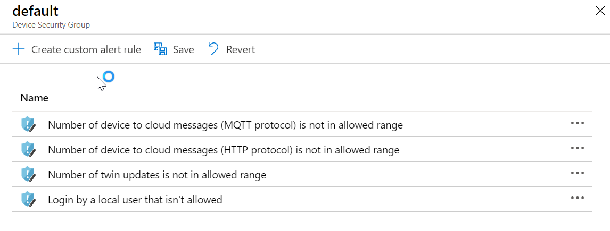

---
lab:
    title: '랩 19: IoT 디바이스가 IoT용 Azure Security Center로 임의 변경되었는지 검색'
    module: '모듈 10: Azure Security Center 및 IoT 보안'
---

# IoT용 Azure Security Center를 통해 디바이스 임의 변경을 검색하세요.

## 랩 시나리오

Contoso는 보안을 염두에 두고 모든 솔루션을 구축했습니다. 그러나, Azure IoT 솔루션을 포함하여 모든 온-프레미스 및 클라우드 워크로드에서 보안을 더욱 자세히 확인할 수 있는 방법을 알아보려고 합니다. 또한 새 디바이스를 온보딩할 때 회사는 보안 표준 및 향상된 보안 상태에 대한 규정 준수를 위해 워크로드 (Leaf 디바이스, Microsoft Edge 디바이스, IoT Hub)에 보안 정책을 적용하고자 합니다.

Contoso는 신규 주문으로 인해 증가하는 배송과 포장 수요를 지원하는 새로운 IoT 디바이스를 갖춘 새로운 어셈블리 라인을 추가하고 있습니다. 모든 새로운 디바이스를 보호하는지 확인하고, 솔루션의 보안을 지속적으로 개선하는 데 유용한 보안 권장 사항을 확인하고자 할 수도 있습니다 (전체 종단 간 IoT 솔루션 고려). 솔루션에 대한 IoT용 Azure IoT 센터를 사용하여 조사를 시작합니다.

Contoso는 또한 다른 치즈 케이브 온도를 모니터링 및 제어하는 능력을 향상시키는 새로 연결한 자동 온도 조절기를 설치하고 있습니다. Contoso가 요구하는 보안 요건 사항의 일부로, 자동 온도 조절기의 예상 원격 분석 전송 주파수 초과 여부를 모니터링하는 사용자 지정 알림을 만드세요.

다음의 리소스가 만들어집니다.


## 이 랩에서

이 랩에서는 다음 활동을 완료할 예정입니다.

* 랩 필수 구성 요소 확인
* 새 IoT Hub 만들기
* IoT용 Azure Security Center 사용
* 새 디바이스를 만들고 등록
* 보안 모듈 쌍 만들기
* Linux 디바이스에 C# 기반 보안 에이전트 설치
* 솔루션 구성하기
* 사용자 지정 알림 구성하기
* 알림을 트리거하는 콘솔 앱을 만드세요.
* Azure Security Center에서 경고 리뷰

## 랩 지침

### 연습 1: 랩 필수 구성 요소 확인

이 랩은 다음 Azure 리소스를 사용할 수 있다고 가정합니다.

| 리소스 종류 | 리소스 이름 |
| :-- | :-- |
| 리소스 그룹 | AZ-220-RG |
| IoT Hub | AZ-220-HUB-{YOUR-ID} |

이러한 리소스를 사용할 수 없다면 실행 2로 옮기기 전에 아래에서 지시하는 **lab19-setup.azcli** 스크립트를 실행해야 합니다. 스크립트 파일은 개발자 환경 구성(랩 3)의 일부로 로컬로 복제한 GitHub 리포지토리에 포함됩니다.

> **참고**: **lab19-setup.azcli** 스크립트는 **Bash** 셸 환경에서 실행하도록 작성됩니다. 이를 실행하는 가장 쉬운 방법은 Azure Cloud Shell에서 실행하는 것입니다.

1. 브라우저를 사용하여 [Azure Cloud Shell](https://shell.azure.com/)을 열고 이 과정에 사용 중인 Azure 구독으로 로그인합니다.

1. Cloud Shell에 대한 저장소 설정 관련 메시지가 표시되면 기본값을 수락합니다.

1. Azure Shell에서 **Bash**를 사용 중인지 확인합니다.

    Azure Cloud Shell 페이지의 왼쪽 상단에 있는 드롭다운으로 환경을 선택할 수 있습니다. 선택한 드롭다운 값이 **Bash**인지 확인합니다.

1. Azure Shell 도구 모음에서 **파일 업로드/다운로드**(오른쪽에서 네 번째 단추)를 클릭합니다.

1. 드롭다운에서 **업로드**를 클릭합니다.

1. 파일 선택 대화 상자에서 개발 환경을 구성할 때 다운로드한 GitHub 랩 파일의 폴더 위치로 이동합니다.

    이 과정의 랩 3 "개발 환경 설정"에서 ZIP 파일을 다운로드하고 그 내용물을 로컬에서 추출하여 랩 리소스를 포함하는 GitHub 리포지토리를 복제했습니다. 추출된 폴더 구조는 다음 폴더 경로를 포함합니다.

    * Allfiles
      * 랩
          * 19-IoT 디바이스가 IoT용 Azure Security Center로 임의 변경되었는지 검색하기
            * 설정

    lab19-setup.azcli 스크립트 파일은 랩 19의 설치 폴더에 있습니다.

1. **lab19-setup.azcli** 파일을 선택한 다음 **열기**를 클릭하세요.

    파일 업로드가 완료되면 알림이 나타납니다.

1. 올바른 파일을 업로드했는지 확인하려면 다음 명령을 입력합니다.

    ```bash
    ls
    ```

    `ls` 명령으로 현재 디렉터리의 내용을 나열합니다. 나열된 lab19-setup.azcli 파일을 보세요.

1. 설치 스크립트가 포함된 이 랩에 대한 디렉터리를 만든 다음 해당 디렉터리로 이동하려면 다음 Bash 명령을 입력합니다.

    ```bash
    mkdir lab19
    mv lab19-setup.azcli lab19
    cd lab19
    ```

    이러한 명령은 이 랩용 디렉터리를 만들고, **lab19-setup.azcli** 파일을 해당 디렉터리로 옮긴 다음, 디렉터리를 변경하여 새 디렉터리를 현재 작업 디렉터리로 만듭니다.

1. 다음 명령을 입력하여 **lab19-setup.azcli**에 실행 권한이 있는지 확인하세요.

    ```bash
    chmod +x lab19-setup.azcli
    ```

1. Cloud Shell 도구 모음에서 **lab19-setup.azcli** 파일을 편집하려면, **편집기 열기**(오른쪽에서 두 번째 단추 - { })를 클릭하세요.

1. **파일** 목록에서 랩19 폴더를 펼치려면 **랩19**를 클릭한 다음 **lab19-setup.azcli**를 클릭합니다.

    이제 에디터에 **lab19-setup.azcli** 파일의 내용이 나타납니다.

1. 편집기에서 `{YOUR-ID}` 및 `{YOUR-LOCATION}` 변수의 값을 업데이트하세요.

    아래 샘플을 예로 들, `{YOUR-ID}`를 이 과정의 시작 시 만든 고유 ID(예: **CAH191211**)로 설정하고 리소스 그룹과 일치하는 위치로 `{YOUR-LOCATION}`을 설정해야 합니다.

    ```bash
    #!/bin/bash

    RGName="AZ-220-RG"
    IoTHubName="AZ-220-HUB-{YOUR-ID}"

    Location="{YOUR-LOCATION}"
    ```

    > **참고**:  `{YOUR-LOCATION}` 변수는 모든 리소스를 배포하는 지역의 짧은 이름으로 설정되어야 합니다. 이 명령을 입력하면 사용 가능한 위치 및 짧은 이름(**이름** 열)의 목록을 볼 수 있습니다.
    >
    > ```bash
    > az account list-locations -o Table
    >
    > 표시이름           위도    경도    이름
    > --------------------  ----------  -----------  ------------------
    > 동아시아             22.267      114.188      eastasia
    > 동남 아시아        1.283       103.833      southeastasia
    > 미국 중부            41.5908     -93.6208     centralus
    > 미국 동부               37.3719     -79.8164     eastus
    > 미국 동부 2             36.6681     -78.3889     eastus2
    > ```

1. 파일의 변경 내용을 저장하고 편집기를 닫으려면 편집기 창의 오른쪽 상단에서 ...를 클릭한 다음 **편집기 닫기**를 클릭합니다.

    저장하라는 메시지가 표시된 경우 **저장**을 클릭하면 편집기가 닫힙니다.

    > **참고**:  **CTRL+S**를 사용하여 언제든지 저장할 수 있으며 **CTRL+Q**를 사용하여 편집기를 닫을 수 있습니다.

1. 이 랩에 필요한 리소스를 만들려면 다음 명령을 입력합니다.

    ```bash
    ./lab19-setup.azcli
    ```

    이 작업을 실행하려면 몇 분 정도 걸립니다. 각 단계가 완료되면 JSON 출력이 표시됩니다.

### 연습 2: IoT Hub용 Azure Security Center 활성화

IoT용 Azure Security Center를 사용하면 하이브리드 클라우드 워크로드와 Azure IoT 솔루션 전반에 걸쳐 보안 관리를 통합하고 엔드투엔드 위협 감지 및 분석이 가능합니다.

IoT용 Azure Security Center는 다음 구성 요소로 구성됩니다.

* IoT Hub 통합
* 디바이스 에이전트 (선택 사항)
* 보안 메시지 SDK를 보내기
* 분석 파이프라인

#### 작업 1: IoT용 Azure Security Center 사용

이 작업에서는 **IoT용 Azure Security Center**를 IoT Hub에 사용하도록 설정할 수 있습니다. 

1. 필요한 경우 Azure 계정 자격 증명을 사용하여 Azure Portal에 로그인합니다.

    둘 이상의 Azure 계정이 있는 경우에는 이 과정에 사용할 구독에 연결된 계정으로 로그인해야 합니다.

1. Azure 대시보드에서 **AZ-220-HUB-{YOUR-ID}** 를 클릭합니다.

    대시보드에는 AZ-220-RG 리소스 그룹 타일에 IoT Hub로 연결되는 링크가 있어야 합니다.

1. 탐색 메뉴 왼쪽의 **보안** 아래에서, **개요**를 클릭하세요.

    IoT Hub용 Azure Security Center는 보안 창을 처음 열 때 온보딩됩니다. 
    
    * **IoT 솔루션 보안 유지하기**를 클릭하라는 창이 나타날 수 있습니다.
    * 잠시 후 **이 IoT Hub에 대한 온보딩을 성공했다는 메시지가 표시될 수 있으며, 변경 사항을 적용하려면 새로 고침을 하세요**라는 메시지가 나타날 수 있습니다.

1. 잠시 동안 보안 개요 창의 콘텐츠를 리뷰하세요.

#### 작업 2: 로그 분석 만들기

IoT용 Azure Security Center가 켜져 있으면 IoT 디바이스, IoT Edge, 그리고 IoT Hub에 대한 원시 보안 이벤트, 알림 및 권장 사항을 저장하기 위한 기본 Azure Log Analytics 작업 영역이 만들어집니다.

이 작업에서는 Log Analytics의 작업 영역 구성을 빠르게 살펴봅니다.

1. 필요하다면 IoT Hub에 대한 보안 개요 창을 여세요.

1. 블레이드 상단에서 보안 설정을 보려면 **설정**을 클릭하세요. 

    이제 **데이터 컬렉션** 창이 나타나며 **설정** 블레이드가 열려야 합니다. 

1. 잠시 동안 나타난 설정 정보를 리뷰하세요.

    Log Analytics 작업 영역에 대해 정의한 **작업 영역 구성**을 확인하세요.

기본적으로 IoT 솔루션용 Azure Security Center를 켜면 Azure 구독에서 모든 IoT Hub를 자동으로 보호합니다.

### 연습 3: 새 디바이스 만들기 및 등록

이 실행에서는 IoT 디바이스를 시뮬레이션하는 데 사용할 가상 머신을 설정합니다. 이 랩의 후반부에서는 이 디바이스를 사용하여 컨베이어 벨트의 진동을 측정합니다.

#### 작업 1: 새로운 IoT 디바이스를 만드세요.

이 작업에서는 IoT 디바이스를 나타내는 VM을 만듭니다.

1. Azure 계정 자격 증명을 사용하여 [portal.azure.com](https://portal.azure.com)에 로그인하세요.

1. 포털 메뉴에서 **리소스 만들기**를 클릭한 다음 **Ubuntu Server 18.04 LTS**용 마켓플레이스를 검색하기

1. Search 결과에서 **Ubuntu Server 18.04 LTS**를 클릭하세요.

1. **Ubuntu Server 18.04 LTS** 블레이드에서 **만들기**를 선택하세요.

1. **가상 머신 블레이드 만들기** 상 **구독** 아래에서, 이 과정에 사용 중인 구독을 선택했는지 확인하세요.

1. **리소스 그룹** 드롭다운에서 **새로 만들기** 선택하기

1. 컨텍스트 메뉴에서 **이름** 아래에 **AZ-220-SECVM-RG**를 입력한 다음 **확인**을 클릭합니다.

    > **참고**: VM에 대한 리소스 그룹을 만드는 것이 가장 좋습니다. 이를 통해 VM에 추가하고 만드는 추가 리소스를 추적할 수 있습니다. 이 과정의 간단한 사용 사례의 주요 혜택은 정리가 쉽다는 점이지만, 또한 랩에서 추후 이 리소스 그룹으로 더 많은 작업을 수행할 수 있을 것입니다.

1. **가상 머신 이름** 텍스트 상자에 **vm-device01** 입력하기

1. **지역** 드롭다운에서 가장 가까운 Azure 지역 또는 Azure IoT Hub가 프로비전된 지역을 선택하세요.

1. **가용성 옵션** 드롭다운에서 **인프라가 중복될 필요가 없습니다**를 선택했는지 확인하세요.

    > **팁**:
    > Azure는 애플리케이션의 가용성 및 복원력을 관리하기 위한 다양한 옵션을 제공합니다. 가용성 영역 또는 가용성 집합에서 복제된 VM을 사용하여 데이터 센터 중단 및 유지 관리 이벤트로부터 앱과 데이터를 보호하는 솔루션을 설계하세요. 이 랩에서는 고가용성 기능이 필요하지 않습니다.

1. **이미지** 드롭다운에서 **Ubuntu Server 18.04 LTS**를 선택했는지 확인하세요.

1. **Azure Spot 인스턴스** 필드의 경우 **아니요**를 선택했는지 확인하세요.

    > **팁**:
    > Spot VM을 사용하면 Azure 미사용 용량을 매우 절약할 수 있습니다. Azure에서 용량을 다시 필요로 하는 모든 시점에 Azure 인프라는 Spot VM을 제거합니다. 따라서 Spot VM은 일괄 처리 프로세싱 작업, 개발/테스트 환경, 대규모 컴퓨팅 워크로드 등의 중단을 처리할 수 있는 워크로드에 적합합니다. 이 랩에서는 기존 VM을 사용합니다.

1. **관리자 계정**에서 **인증 유형**의 오른쪽에 있는 **암호**를 클릭합니다.

1. 관리자 **사용자 이름** 및 **암호** 필드에는 VM 관리자 계정 값을 입력하세요.

    > **중요**: VM 관리자 사용자 이름 및 암호를 기록하세요. 프로덕션 환경에서 이러한 보안을 유지해야 합니다. 이 랩에서는 나중에 찾을 수 있도록 값을 텍스트 문서에 저장해도 됩니다(잊어버릴 경우를 대비하여). 

1. **인바운드 포트 규칙**의 오른쪽에 **SSH (22)** 가 선택되어 있음을 확인하세요.

    VM을 구성 및 관리해야 할 때 SSH를 사용하여 VM에 원격으로 액세스할 수 있습니다.

1. 블레이드 하단의 **검토 + 생성**을 클릭하세요.

1. "유효성 검사 통과" 메시지가 나타나면 **만들기**를 선택하세요.

    > **참고**:
    > 배포를 완료하려면 5분 정도 걸립니다. 배포하는 동안 다음 단원으로 이동할 수 있습니다.

#### 작업 2: 새 디바이스 등록하기

디바이스를 연결하기 전 IoT Hub에 디바이스를 등록해야 합니다. 등록하세요.

1. Azure Portal 메뉴에서 **대시보드**를 클릭합니다.

1. AZ-220-RG 리소스 그룹 타일에서 **AZ-220-HUB-{YOUR-ID}** 를 클릭하세요.

    IoT Hub 블레이드를 열 수 있는 수많은 방법이 있습니다. 원하는 메서드를 사용하세요.

1. 왼쪽 탐색 메뉴 내 **탐색기** 아래에서 **IoT 디바이스를**클릭하세요.

1. **IoT 디바이스** 창의 상단에서 **새로 만들기** 클릭하기

1. **디바이스 ID** 아래에, **vm-device01**을 입력하세요.

    예. VM에 할당한 이름을 디바이스 ID로 사용하고 있습니다.

    인증에 **대칭 키**를 사용할 것이므로 다른 설정을 기본값으로 그대로 둘 수 있습니다.

1. 블레이드 하단에서 **저장**을 선택하세요.

### 연습 4: 보안 모듈 쌍 만들기

IoT용 Azure Security Center는 기존 IoT 디바이스 관리 플랫폼과 완전히 통합되어 디바이스 보안 상태를 관리하고 기존의 디바이스 제어 기능을 활용할 수 있도록 해줍니다.

IoT용 Azure Security Center는 모듈 쌍 메커니즘을 사용하고, 각 디바이스에 azureiotsecurity라고 하는 보안 모듈 쌍을 유지 관리합니다. 보안 모듈 쌍은 각 디바이스의 디바이스 보안과 관련된 모든 정보를 보유합니다. IoT용 Azure Security Center 기능을 최대한 활용하려면 새로운 IoT Edge 디바이스에 이러한 보안 모듈 쌍을 만들고, 구성하고, 사용하세요.

보안 모듈 쌍 (**azureiotsecurity**) 은 다음 메서드를 사용해 만들 수 있습니다.

* [모듈 일괄 처리 스크립트](https://github.com/Azure/Azure-IoT-Security/tree/master/security_module_twin)를 사용하세요. 이 스크립트는 기본 구성을 사용하여 새 디바이스 (또는 모듈 쌍이 없는 디바이스) 에 대한 모듈 쌍을 자동으로 만듭니다.
* 각 디바이스에 대해 특정하게 구성된 각 모듈 쌍을 개별적으로 수동 편집하세요.

이 작업에서는 수동으로 보안 모듈 쌍을 만듭니다.

1. 필요하다면 Azure Portal에서 IoT Hub의 **IoT 디바이스** 창으로 이동하세요.

    IoT Hub 블레이드에서 **IoT 디바이스** 창을 열려면, 왼쪽 탐색 메뉴에서 **탐색기** 아래의 **IoT 디바이스**를 클릭하세요.

1. **디바이스 ID** 아래에서 **vm-device01**을 클릭하세요.

1. 블레이드 상단 근처에 있는 **vm-device01** 블레이드에서 **모듈 ID 추가**를 클릭하세요.

1. **모듈 ID 추가** 창에서 **모듈 ID 이름** 아래에 **azureiotsecurity**를 입력합니다.

    인증에 대칭 키를 사용하므로 모든 필드를 기본값으로 그대로 둘 수 있습니다.

1. 창 하단에서 **저장**을 클릭합니다.

    **모듈 ID** 아래에서 이제 나열된 **azureiotsecurity** 디바이스가 나타나야 합니다. 연결 상태는 **연결 끊김**입니다.

    > **중요**: 모듈 ID는 다른 고유 이름이 아닌 **azureiotsecurity**라고 해야 합니다.


1. **vm-device01** 블레이드에서 **기본 키**의 오른쪽에 있는 **복사**를 선택하세요.

    > **참고**: 연결 문자열이 아닌 디바이스의 **기본 키**를 복사해야 합니다.


1. IoT Hub 블레이드로 돌아가세요.

1. 왼쪽의 탐색 메뉴에서 **개요**를 클릭하세요.

1. 블레이드 상단 근처의 Essentials 영역 내의, **호스트 이름** 오른쪽에서 **클립보드에 복사**를 클릭하고 나중을 위해 값을 저장하세요.

    > **참고**: IoT Hub 호스트 이름은 다음과 유사합니다. AZ-220-HUB-CAH102119.azure-devices.net

### 연습 5: IoT용 Azure Security Center C# 보안 에이전트 배포

IoT용 Azure Security Center는 보안 데이터를 IoT Hub를 통해 로그, 처리, 집계, 그리고 전송하는 보안 에이전트에 대한 참조 아키텍처를 제공합니다. C 및 C# 기반 에이전트가 있습니다. C 에이전트는 좀 더 제한적이거나 최소한의 디바이스 리소스가 있는 디바이스에 권장됩니다.

보안 에이전트는 다음 기능을 지원합니다.

* 기본 운영 체제(Linux, Windows)에서 원시 보안 이벤트를 수집합니다. 사용 가능한 보안 데이터 수집기에 대해 더 알아보려면 IoT용 Azure Security Center 에이전트 구성을 참조하세요.
* 원시 보안 이벤트를 IoT Hub를 통해 전송된 메시지로 집계합니다.
* 기존의 디바이스 ID 또는 전용 모듈 ID로 인증합니다. 자세한 내용은 보안 에이전트 인증 메서드를 참조하세요.
* **azureiotsecurity** 모듈 쌍을 사용하여 원격으로 구성합니다. 자세한 내용을 보려면 IoT용 Azure Security Center 에이전트 구성을 참조하세요.

이 실행에서는 시뮬레이션된 디바이스(Linux VM)에 배포할 C#용 보안 에이전트를 추가합니다. 

#### 작업 1: IoT 디바이스에 로그인 - 리눅스 VM

1. 필요한 경우 Azure 계정 자격 증명을 사용하여 Azure Portal에 로그인합니다.

    둘 이상의 Azure 계정이 있는 경우에는 이 과정에 사용할 구독에 연결된 계정으로 로그인해야 합니다.

1. Azure Portal 메뉴에서 **모든 리소스**를 클릭하세요.

    **모든 서비스**가 아닌 **모든 리소스**를 선택해야 합니다.

1. **이름별 필터링** 텍스트 상자의 **모든 리소스** 블레이드에서 **vm-device01**을 입력합니다

1. **이름** 아래에서 **vm-device01**을 클릭하세요.

    이제 새로 만든 가상 머신 (**vm-device01**)에 대한 개요 창이 열려 있어야 합니다

1. 블레이드 상단에서 **연결**을 클릭한 다음 **SSH**를 클릭하세요.

1. 잠시 동안 **연결** 창의 내용 리뷰하기

    이전에 보았듯이 이 과정은 SSH 연결을 여는 예제 명령을 제공합니다.

    예제 명령을 텍스트 편집기로 복사한 다음, 명령에서 `-i <private key path>를 제거하세요. 다음과 같은 형식의 명령이 남아 있어야 합니다.

    ```cmd\sh
    ssh <admin user>@<ip address>
    ```

    여러분의 명령은 다음과 유사해야 합니다. `ssh demouser@52.170.205.79`

1. Azure Portal 도구 모음에서 **Cloud Shell**을 클릭합니다.

    Cloud Shell 내에서 **Bash** 환경을 선택했는지 확인합니다.

1. Cloud Shell 명령 프롬프트에서 위에서 만든 `ssh` 명령을 입력한 다음 **Enter 키**를 누릅니다.

1. **계속 연결하시겠습니까?** 라는 메시지가 나타나면 **네**라고 입력하고 **Enter 키**를 누르세요.

    VM에 대한 연결을 보호하는 데 사용되는 인증서는 자체 서명되므로, 이 메시지는 보안 확인입니다. 이 메시지에 대한 답변은 나중에 연결할 수 있도록 기억되며 첫 번째 연결에서만 메시지가 표시됩니다.

1. 암호를 입력하라는 메시지가 나타나면 VM용으로 만든 관리자 암호를 입력하세요.

    연결되면 터미널 명령 프롬프트가 다음과 유사한 Linux VM의 이름을 표시하게 바뀝니다.

    ```cmd/sh
    demouser@vm-device01:~$
    ```

    이렇게 해서 여러분이 연결된 VM과 현재 사용자를 추적할 수 있습니다.

#### 작업 3: 디바이스에 대칭 키 추가하기

보안 에이전트의 C# 버전으로 IoT Hub에 연결할 수 있습니다. 연결하려면 디바이스의 대칭 키 또는 인증서 정보가 필요합니다.

이 랩에서는 대칭 키를 인증으로 사용하고 디바이스의 임시 텍스트 문서에 저장해야 합니다.

1. **vm-device01** 디바이스의 **기본 키** 값을 사용할 수 있는지 확인하세요.

    이 랩에서 우선 기본 키 값을 저장해야 합니다. 그렇지 않는다면, 다음을 마치세요.

    1. 새 브라우저 탭을 열고 그 새 탭에서 Azure Portal로 이동하세요.
    1. Azure Portal 메뉴에서 **대시보드**를 클릭한 다음 IoT Hub를 엽니다.
    1. **탐색기** 아래의 왼쪽 탐색 메뉴에서 **IoT 디바이스**를 클릭하세요.
    1. **디바이스 ID** 아래에서 **vm-device01**을 클릭하세요.
    1. 세부 정보 목록에서 **기본 키**를 복사하세요.
    1. Azure Cloud Shell 브라우저 탭 반환 - **vm-device01** 가상 머신에 계속 연결된 상태여야 합니다.

1. Cloud Shell 명령 프롬프트에서 다음 명령을 입력합니다.

    ```cmd/sh
    echo "<primary_key>" > s.key
    ```

    이 명령은 **vm-device01** 디바이스의 **기본 키**가 있는 디바이스 인증 형식 파일을 만듭니다.

    > [!참고] 파일에 올바른 기본 키를 추가했는지 확인하려면 `nano s.key` 명령으로 파일을 여세요. 기기의 **기본 키**가 파일에 있는지 확인하세요. 나노 편집기를 종료하려면 `Ctrl 키` 및 `X 키`를 길게 누르세요. `shift 키`와 `Y 키`를 길게 눌러 파일을 저장하세요. 그런 다음 enter 키를 누르세요.

#### 작업 4: 보안 에이전트 설치

1. Cloud Shell 세션이 여전히 SSH를 통해 VM에 연결되어 있는지 확인하세요.

1. Cloud Shell 명령 프롬프트에서 C#용 최신 버전 보안 에이전트를 디바이스에 다운로드하려면 다음 명령을 입력합니다.

    ```bash
    wget https://github.com/Azure/Azure-IoT-Security-Agent-CS/releases/download/0.0.6/ubuntu-18.04-x64.tar.gz
    ```

1. Cloud Shell 명령 프롬프트에서 패키지의 내용을 추출하고 `/Install` 폴더로 이동하려면 다음 명령을 입력하세요.

    ```bash
    tar -xzvf ubuntu-18.04-x64.tar.gz && cd Install
    ```

1. Cloud Shell 명령 프롬프트에서 `InstallSecurityAgent` 스크립트에 실행 권한을 추가하려면 다음 명령을 입력하세요.

    ```bash
    chmod +x InstallSecurityAgent.sh
    ```

1. Cloud Shell 명령 프롬프트에서 다음 명령을 입력합니다. 

    값을 인증 매개 변수로 바꿔야 합니다.

    ```bash
    sudo ./InstallSecurityAgent.sh -i -aui Device -aum SymmetricKey -f <Insert file location of your s.key file> -hn <Insert your full IoT Hub host name> -di vm-device01
    ```

    다음은 명령 형식의 예시입니다.

    `sudo ./InstallSecurityAgent.sh -i -aui Device -aum SymmetricKey -f ../s.key -hn AZ-220-HUB-AB20200213.azure-devices.net -di vm-device01`

    > **참고**: 나열된 호스트 이름 대신 IoT Hub 호스트 이름을 지정해야 합니다. 
    
    > **중요**:
    > 전체 IoT Hub 호스트 이름을 사용하는지 확인하세요(예: `-hn` 스위치 값용 **AZ-220-HUB-AB20200213.azure-devices.net**).

    이 스크립트는 다음 기능을 수행합니다.

    * 필수 구성 요소를 설치하세요.
    * 서비스 사용자를 추가하세요 (대화형 로그인 해제).
    * 에이전트를 디먼으로 설치하세요. 디바이스가 서비스 관리를 위해 **systemd**를 사용한다고 가정합니다.
    * 에이전트가 특정 작업을 루트로 수행할 수 있도록 **sudo 사용자**를 구성하세요.
    * 제공된 인증 매개 변수로 에이전트를 구성하세요.

1. Cloud Shell 터미널에서 출력을 보며 명령의 진행률을 관찰하세요.

    에이전트 설치를 완료하려면 재부팅해야 합니다.

1. Cloud Shell 터미널에서 재부팅을 시작하기 위해 **y**를 입력하세요.

    디바이스를 재부팅하면 SSH 세션이 손실됩니다.
 
1. Cloud Shell 명령 프롬프트에서 가상 머신에 다시 연결하려면, 이전에 사용한 SSH 명령을 입력하세요.

    이제 IoT 에이전트용 Azure Security Center가 활성화되고 실행 중이어야 합니다.

1. Cloud Shell 명령 프롬프트에서 IoT 에이전트용 Azure Security Center의 배포 상태를 확인하려면 다음 명령을 입력하세요. 

    ```cmd/sh
    systemctl status ASCIoTAgent.service
    ```

    다음과 비슷한 출력이 나타나야 합니다.

    ```log
    ● ASCIoTAgent.service - IoT 에이전트용 Azure Security Center
       Loaded: loaded (/etc/systemd/system/ASCIoTAgent.service; enabled; vendor preset: enabled)
       Active: active (running) since Wed 2020-01-15 19:08:15 UTC; 3min 3s ago
     Main PID: 1092 (ASCIoTAgent)
        Tasks: 7 (limit: 9513)
       CGroup: /system.slice/ASCIoTAgent.service
            └─1092 /var/ASCIoTAgent/ASCIoTAgent
    ```

    특히 서비스가 **로드되었는지 확인해야 합니다. 로드** 및 **활성: 활성 (실행 중)**.

    > **참고**: IoT 에이전트용 Azure Security Center가 실행 중 또는 활성 상태가 아니라면 [Linux 가이드 문제 해결 섹션에 대한 IoT C# 기반 보안 에이전트용 Azure Security Center 배포](https://docs.microsoft.com/ko-kr/azure/asc-for-iot/how-to-deploy-linux-cs)를 확인하세요. 일반적인 문제는 서비스를 **활성 상태로 둘 수 있습니다. 활성화**는 부정확한 키 값이거나 IoT Hub 호스트 이름을 지정하지 않는 것입니다.

1. Azure Portal에서 IoT Hub 블레이드로 돌아간 다음 **vm-device01** 디바이스 블레이드를 여세요.

    **탐색기** 아래의 탐색 메뉴에서 IoT Hub 블레이드를 열고, **IoT 디바이스**를 클릭한 다음 **vm-device01**을 클릭하세요.

1. **모듈 ID** 아래에서 **azureiotsecurity** 모듈이 이제 **연결됨** 상태임을 확인하세요.


이제 IoT 디바이스 에이전트용 Azure Security Center를 디바이스에 설치하였으므로 에이전트는 디바이스에서 원시 보안 이벤트를 수집, 집계 및 분석할 수 있습니다.

### 연습 6: 솔루션 관리 구성

IoT용 Azure Security Center는 Azure 기반 IoT 솔루션에 광범위한 종단 간 보안을 제공합니다.

IoT용 Azure Security Center를 사용하면 하나의 대시보드에서 전체 IoT 솔루션을 모니터링하여 Azure의 모든 IoT 디바이스, IoT 플랫폼 및 백 엔드 리소스를 표시할 수 있습니다.

IoT Hub에서 활성화되면 IoT용 Azure Security Center는 다른 Azure 서비스를 자동으로 식별하고 IoT Hub에 연결되어 있으며, IoT 솔루션과 관련되어 있습니다.

자동 관계 검색 외에도 IoT 솔루션의 일부로 태그할 다른 Azure 리소스 그룹을 선택할 수도 있습니다. 선택을 통해 전체 구독, 리소스 그룹 또는 단일 리소스를 추가할 수 있습니다.

#### 작업 1: IoT Hub 열기

1. 브라우저에서 Azure Portal을 열고 IoT Hub로 이동하세요.

1. 왼쪽 탐색 메뉴에서 **보안** 아래의 **리소스**를 클릭하세요.

    IoT용 Azure Security Center과 현재 구독이 이미 활성화되어 있을 때 리소스 목록은 이미 IoT Hub에 포함되어 있고, 작업 영역이 생성되어 있습니다.

1. 화면 상단에서 **편집**을 클릭하세요.

    **솔루션 관리**창이 열리며, 여기서 소유 리소스 그룹을 선택하여 보안 솔루션에 추가 Azure 리소스를 연결할 수 있습니다.

1. **구독**에서 이 과정에 사용 중인 구독을 선택했는지 확인하세요.

    > **참고:**
    > 리소스의 여러 구독을 보안 솔루션에 추가할 수 있습니다.

1. **리소스 그룹**에서, VM - **AZ-220-SECVM-RG**에 대한 리소스 그룹을 선택하세요.

    이제 두 개의 리소스 그룹을 선택해야 합니다. 방금 추가한 리소스 그룹의 추가 리소스를 반영하도록 리소스 목록이 업데이트 되었는지 확인하세요.

1. **솔루션 관리** 창 하단에서 **적용**을 클릭하세요.

    **적용** 단추를 사용할 수 없다면 걱정하지 마세요. 리소스는 이미 추가되었습니다.

1. **솔루션 관리** 창을 닫으세요.

모든 리소스 관계를 정의한 후 IoT용 Azure Security Center는 Azure Security Center를 활용하여 이러한 리소스에 대한 보안 추천 및 경고를 제공합니다.

#### 작업 2: 작업에서 IoT용 Azure Security Center 보기

이제 디바이스에 보안 에이전트를 설치하였으며 솔루션을 구성하였습니다. IoT용 Azure Security Center에 대한 다양한 보기를 확인하기 좋은 시점입니다.

1. 왼쪽 탐색 메뉴에서 **보안** 아래의 **개요**를 클릭하세요. 

    디바이스, 허브 및 기타 리소스에 대한 상태 개요가 두 개의 차트에 나타납니다. Azure IoT Security Center를 켤 때 바로 활성화된 기본 제공 실시간 모니터링, 추천 및 경고를 볼 수 있습니다.


1. 왼쪽 탐색 메뉴에서 **보안** 아래의 **리소스**를 클릭하세요.

    이 창은 IoT 솔루션 전반의 리소스 상태에 액세스할 수 있게 해줍니다.

    > **중요**:
    > IoT 리소스의 보안 구성을 평가하는 프로세스는 실행하는 데 최대 24시간이 걸릴 수 있으므로, 대시보드에 표시된 초기 상태는 리소스의 실제 상태를 반영하지 않습니다. 

    아래 이미지는 보안 평가를 수행한 후의 대시보드 상태를 보여줍니다.


### 연습 7: 사용자 지정 경고 소개하기

사용자 지정 보안 그룹 및 경고를 사용하여 전체 IoT 솔루션에서 엔드투엔드 보안 정보 및 범주형 디바이스 지식을 최대한 활용할 수 있습니다. 이는 솔루션에 대한 더 나은 보안을 제공하는 데 도움이 됩니다. 

#### 사용자 지정 도메인을 사용하는 이유

여러분은 기본으로 제공되는 알고리즘보다 여러분의 IoT 디바이스를 더 잘 알고 있습니다.

예상 디바이스 동작을 완전히 이해하는 고객의 경우, IoT용 Azure Security Center를 통해 이러한 해석을 디바이스 동작 정책으로 변환하고 예상되는 정상 동작과의 편차에 대해 알릴 수 있습니다.

#### 작업 1 - 알림 사용자 지정하기

위에서 언급했듯이, 솔루션의 특정한 원하는 동작을 이해하는 고객은 원하는 동작을 초과할 때 트리거되는 사용자 지정 알림을 구성할 수 있습니다. 이 연습에서는 **MQTT** 프로토콜을 통해 **디바이스-클라우드** 메시지를 모니터링하는 사용자 지정 알림을 만듭니다.

정상적인 상황에서 Contoso의 치즈 동굴 모니터링 시스템은 IoT Hub 온도 및 습도 데이터를 높은 비율로 전송하지 않습니다. 각 디바이스는 5분 동안 1~5개의 디바이스-클라우드 메시지를 보낼 것으로 예상됩니다. 이 범위는 온도가 더 빠르게 변할 수 있고 값이 설정한 경계 값을 벗어나지 않도록 하기 위해 필요할 수 있는 보다 빈번한 데이터가 필요할 수 있는 황혼 기간을 수용합니다.

이 작업에서는 사용자 지정 알림을 만듭니다.

1. Azure Portal에서 IoT Hub 블레이드로 이동하세요.

1. 왼쪽 탐색 메뉴에서 **보안** 아래의 **사용자 지정 알림**을 클릭하세요.

1. 잠시 동안 **사용자 지정 알림** 창을 검사하세요.

    언뜻 보기에 이 창이 비어 있는 것처럼 보일 수 있지만, **이름** 아래에 나열된 항목은 실제로 자동으로 만든 **기본** 보안 그룹입니다.

    보안 그룹을 사용하면 디바이스의 논리적 그룹을 정의하고, 중앙 집중식 방식으로 해당 보안 상태를 관리할 수 있습니다. 이러한 그룹은 특정 하드웨어가 있는 디바이스, 특정 위치에 배포된 디바이스 또는 특정 요구에 적합한 모든 다른 그룹을 나타낼 수 있습니다.

1. 기본 보안 그룹에 사용자 지정 알림을 추가하려면 **기본**을 클릭하세요.

    **디바이스 보안 그룹** 블레이드에는 모든 활성 사용자 지정 알림이 나열됩니다. 이 블레이드에는 처음 방문했으므로, 비어있을 것입니다.

1. 블레이드 상단에서 **사용자 지정 경고 규칙 만들기**를 클릭하세요.

    **사용자 지정 경고 규칙 만들기** 창이 열립니다. **디바이스 보안 그룹** 필드가 **기본** 그룹으로 채워졌는지 확인하세요.

1. **사용자 지정 알림** 드롭다운에서 **허용되지 않은 범위의 디바이스 - 클라우드 메시지의 수 (MQTT 프로토콜)** 를 클릭하세요.

    > **팁**:
    > 사용 가능한 많은 사용자 지정 알림을 리뷰하세요. 솔루션을 보호하는 데 어떻게 사용할 수 있는지 고려하세요.

    > **참고**:
    > **설명** 및 **필수 속성**은 선택한 **사용자 지정 알림**에 따라 변경됩니다.

1. **필수 속성**에서 **최소 임계값 필드**에 **1**을 입력하세요.

    이렇게 하면 5분 동안 한 개 이상의 메시지를 보내야 한다는 기대를 충족합니다.

1. **최대 임계값**에 **5**를 입력하세요.

    이는 5분 동안 다섯 개 이하의 메시지를 전송해야 한다는 기대를 충족합니다.

1. **시간 창 크기** 드롭다운에서 **00:05:00**을 클릭하세요.

    이것은 설정한 오 분의 시간을 충족합니다.

    > **참고**:
    사용 가능한 시간 창은 4개 있습니다.
    > * 5분
    > * 10분
    > * 15분
    > * 30분

1. **사용자 지정 경고 규칙** 창 하단에서 **확인**을 클릭하세요.

1. **기본** (디바이스 보안 그룹) 블레이드 상단에서 **저장**을 클릭하세요.

    새 알림을 저장하지 않으면 다음에 IoT Hub를 닫을 때 경고가 삭제됩니다.

    사용자 지정 알림 목록으로 돌아갑니다. 다음은 여러 사용자 지정 알림을 보여 주는 이미지입니다.



### 연습 8: 디바이스 앱 구성하기

이 실행에서는 IoT Hub 디바이스와  .Net Core 콘솔 애플리케이션 (C#) 을 만들어 IoT Hub에 연결하는 **Microsoft.Azure.Devices.Client** nuget 패키지를 활용합니다. 콘솔 애플리케이션은 10초마다 원격 분석을 보내고, 사용자 지정 알림 (이전 실행에서 만든 사용자 지정 알림) 에 구성한 디바이스-클라우드 메시지 임계값을 초과하도록 설계하였습니다.

#### 작업 1: 새 IoT 디바이스 등록하기

디바이스를 연결하려면 먼저 IoT Hub에 디바이스를 등록해야 합니다.

1. Azure Portal 메뉴에서 **대시보드**를 클릭한 다음 IoT Hub를 엽니다.

1. **탐색기** 아래의 왼쪽 탐색 메뉴에서 **IoT 디바이스**를 클릭하세요.

1. **IoT 디바이스** 창 상단에서 **새로 만들기**를 클릭하세요.

1. **디바이스 만들기** 블레이드의 **디바이스 ID**에 **CheeseCave1-Sensor1**를 입력합니다.

    인증용 **대칭 키**를 사용할 것이므로 다른 값을 기본으로 두세요.

1. 블레이드 하단에서 **저장**을 선택하세요.

1. **IoT 디바이스** 창의 **장치 ID** 아래에서 **CheeseCave1-Sensor1**을 클릭하세요.

    **CheeseCave1-Sensor1** 디바이스에 액세스 하려면 **더 로드하기**를 클릭해야 할 수 있습니다.

1. **주요 연결 문자열**의 오른쪽에서 **복사**를 클릭한 다음 값을 텍스트 파일에 저장하세요.

    CheeseCave1-Sensor1 디바이스의 연결 문자열이라는 점을 기억하세요. 디바이스 앱의 연결 문자열 값이 필요합니다.

#### 작업 2: 콘솔 앱 만들기

1. Visual Studio Code를 엽니다.

1. **파일** 메뉴에서 **폴더 열기**를 클릭합니다.

1. **폴더 열기** 대화상자의 상단에서 **새 폴더**를 클릭하고, **ThermostatDevice**를 입력한 다음 **Enter 키**를 누르세요.

    랩 19 폴더 또는 원하는 다른 위치 아래에 ThermostatDevice 폴더를 만들 수 있습니다.

1. **온도 자동 조절 장치**를 클릭하고 **폴더 선택**을 선택하세요.

1. **파일** 메뉴에서 파일 자동 저장이 활성화되어 있는지 확인하려면 **자동 저장**을 클릭하세요.

    여러 코드 블록으로 복사할 수 있으며 이렇게 하면 파일의 최신 편집에 대해 항상 작동할 수 있습니다.

1. **보기** 메뉴에서 통합 터미널을 열기 위해 **터미널**을 클릭하세요.

1. 터미널 명령 프롬프트에서 새 콘솔 앱을 만들려면 다음 명령을 입력하세요.

    ```bash
    dotnet new console
    ```

#### 작업 3: 앱을 IoT Hub에 연결하기

1. 필요한 NuGet 패키지를 설치하려면 터미널 명령 프롬프트에서 다음 명령을 입력하세요.

    ```bash
    dotnet add package Microsoft.Azure.Devices.Client
    ```

1. 탐색기 창에서 **Program.cs**를 클릭합니다.

1. 코드 편집기에서 기존 코드를 모두 삭제하세요.

1. 코드 편집기에서 앱이 필요로 할 `using` 문장을 추가하기 위해 다음 코드를 입력하세요.

    ```csharp
    using System;
    using Microsoft.Azure.Devices.Client;
    using Newtonsoft.Json;
    using System.Text;
    using System.Threading.Tasks;
    ```

1. 애플리케이션에 대한 네임스페이스를 만들려면 `using` 문 아래에 다음 코드를 입력하세요.

    ```csharp
    namespace ThermostatDevice
    {
        // 여기에 클래스 추가하기
    }
    ```

1. **ThermostatDevice** 클래스를 만들려면 `// 아래에 클래스 추가하기` 주석 아래 빈 코드 줄에 다음 코드를 입력합니다.

    ```csharp
    class ThermostatDevice
    {
        // 여기 아래에 변수를 추가합니다.
    }
    ```

1. 디바이스 연결 문자열에 대한 변수를 정의하려면 `// 이 아래에 변수 추가` 주석 아래의 빈 코드 줄에 다음 코드를 입력하세요.

    ```csharp
    private static DeviceClient s_deviceClient;
    private readonly static string s_connectionString = "<DEVICE-CONNECTION-STRING>";

    // 아래에 SendDeviceToCloudMessagesAsync 메서드 추가하기
    ```

    첫 번째 줄은 `DeviceClient`에 대한 참조를 제공합니다.
    두 번째 줄은 디바이스 연결 문자열에 대한 변수를 제공합니다(이전에 복사한 문자열). 

    > **팁**:
    > `<DEVICE-CONNECTION-STRING>`을 이전에 Azure Portal에서 복사한 디바이스 기본 연결 문자열로 바꾸세요.

1. IoT Hub에 디바이스-클라우드 메시지를 보내려면 `// 이 아래에 SendDeviceToCloudMessagesAsync 메서드 추가하기` 주석 아래의 빈 코드 줄에 다음 코드를 추가하세요.

    ```csharp
    private static async void SendDeviceToCloudMessagesAsync()
    {
        // 초기 원격 분석 값
        double minTemperature = 20;
        double minHumidity = 60;
        Random rand = new Random();

        // 사용자가 CTRL+C에 도달할 때까지 반복하기
        while (true)
        {
            double currentTemperature = minTemperature + rand.NextDouble() * 15;
            double currentHumidity = minHumidity + rand.NextDouble() * 20;

            // 익명 형식을 사용하여 JSON 메시지 만들기
            var telemetryDataPoint = new
            {
                temperature = currentTemperature,
                humidity = currentHumidity
            };
            var messageString = JsonConvert.SerializeObject(telemetryDataPoint);
            var message = new Message(Encoding.ASCII.GetBytes(messageString));

            // 메시지에 사용자 지정 애플리케이션 속성을 추가합니다.
            // IoT Hub는 메시지 본문에 액세스하지 않고 이러한 속성을 필터링할 수 있습니다.
            message.Properties.Add("temperatureAlert", (currentTemperature > 30) ? "true" : "false");

            // 원격 분석 메시지 보내기
            await s_deviceClient.SendEventAsync(message);
            Console.WriteLine("{0} > Sending message: {1}", DateTime.Now, messageString);

            // 다음 메시지를 보내기 전에 10초 기다리기
            await Task.Delay(10000);
        }
    }

    // 여기에 주요 메서드 추가하기
    ```

    위의 `await Task.Delay(10000);` 코드를 확인하세요. 이렇게 하면 시간 지연이 발생하여 10초마다 메시지가 전송되고, 사용자 지정 알림의 "5분 안에 5개 이하의 메시지" 임계값을 초과합니다.

    > **팁**:
    > 코드 주석을 읽고 메서드 작동 방식을 이해하세요.

1. 앱에 기본 메서드(진입점)를 제공하려면 `// 이 아래에 기본 메서드 추가하기` 주석 아래의 빈 코드 줄에 다음 코드를 입력하세요.

    ```csharp
    private static void Main(string[] args)
    {
        Console.WriteLine("IoT Hub C# Simulated Thermostat Device. CTRL+C to exit.\n");

        // MQTT 프로토콜을 사용하여 IoT Hub에 연결
        s_deviceClient = DeviceClient.CreateFromConnectionString(s_connectionString, TransportType.Mqtt);
        SendDeviceToCloudMessagesAsync();
        Console.ReadLine();
    }
    ```

    > **참고**:
    `DeviceClient` 인스턴스가 생성되면 **MQTT**프로토콜은 `TransportType.Mqtt`로 지정됩니다. 이는 생성된 사용자 지정 알림에서 지정한 프로토콜을 사용하여 디바이스-클라우드 메시지가 전송되도록 합니다.

1. 애플리케이션을 빌드하고 실행하려면 터미널 명령 프롬프트에서 다음 명령을 입력합니다.

    ```bash
    dotnet run
    ```

    출력은 다음과 유사합니다.

    ```text
    IoT Hub C# 시뮬레이션 자동 온도 조절 디바이스. CTRL+C를 눌러 나가세요.

    2/28/2020 1:32:21 PM > Sending message: {"temperature":25.7199231282435,"humidity":79.50078555359542}
    2/28/2020 1:32:31 PM > Sending message: {"temperature":21.877205091005752,"humidity":61.30029373862794}
    2/28/2020 1:32:41 PM > Sending message: {"temperature":21.245898961204055,"humidity":71.36471955634873}
    2/28/2020 1:32:51 PM > Sending message: {"temperature":32.61750500072609,"humidity":66.07430422961447}
    2/28/2020 1:33:01 PM > Sending message: {"temperature":31.100763578946125,"humidity":79.93955616836416}
    2/28/2020 1:33:11 PM > Sending message: {"temperature":25.02041019034591,"humidity":70.50569472392355}
    ```

    이 랩의 나머지 부분에서 앱을 실행 상태로 두면 여러 알림이 생성될 수 있습니다.

### 연습 9: Security Center 경고 리뷰하기

이 시점에서 콘솔 앱은 이전에 만든 사용자 지정 경고를 트리거하기에 충분한 원격 분석을 보냈습니다. 

> **팁**:
> 5분 시간 창 이내에 디바이스에서 클라우드로 전송된 메시지가 1개 미만 또는 5개 이상인 경우 알림이 트리거하도록 설정되었습니다.

#### 작업 1: Security Center 대시보드 리뷰하기

1. Azure Portal 메뉴에서 **대시보드**를 클릭한 다음 IoT Hub를 엽니다.

1. 왼쪽 탐색 메뉴에서 **보안** 아래의 **개요**를 클릭하세요.

    **위협 탐지** 섹션을 살펴보세요. **디바이스 보안 경고** 차트에서 하나 이상의 경고를 볼 수 있어야 합니다.


    또한 **CheeseCave1-Sensor1** 디바이스에 대한 항목을 **가장 알림이 많이 발생한 디바이스** 타일에서 볼 수 있어야 합니다.


    > [!참고]
    > 대시보드에 경고가 나타나는데 10~15분 정도 걸릴 수 있습니다.

1. **위협 탐지**에서 **가장 알림이 많이 발생한 디바이스** 타일을 클릭하세요.

    왼쪽 탐색 메뉴에서 **보안** 아래의 **보안 알림**을 클릭한 것과 동일한 **알림** 블레이드가 열립니다.

    보안 알림 목록이 표시됩니다.


    최신 알림은 **신규** 레이블로 표시됩니다.

1. 최신 알림을 클릭합니다.

    세부 창이 열립니다. **일반 정보**는 알림에 관련된 상위 수준 정보를 제공합니다. 이 아래에, **최근 영향을 받은 10개의 디바이스**는 **CheeseCave1-Sensor1**디바이스를 나열해야 합니다.


1. Visual Studio Code로 돌아가서 디바이스 앱을 종료합니다.

    터미널 창에 입력 포커스를 배치하고 **CTRL+C**를 눌러 앱을 닫을 수 있습니다.
