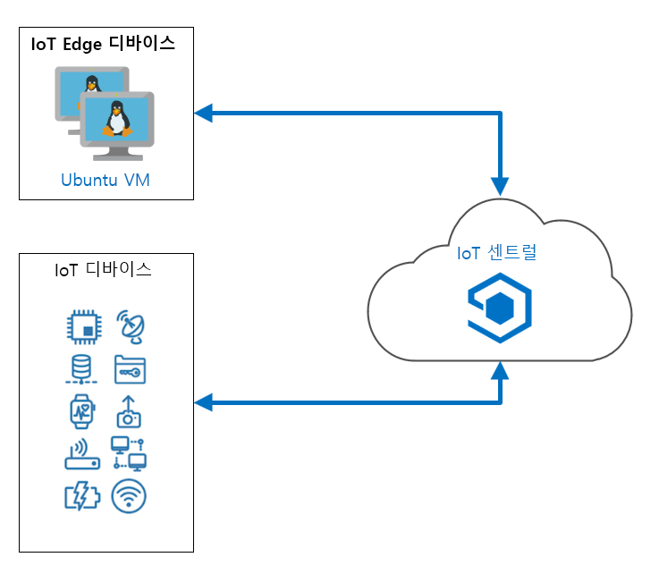

---
lab:
    title: '랩 20: 첫 번째 Azure IoT Central 앱 만들기'
    module: '모듈 12: IoT Central로 구축'
---

# 첫 번째 Azure IoT Central 앱 만들기

Azure IoT 서비스 및 기술은 사용자 팀이 있을 때 훌륭한 역량을 발휘하고 쉽게 관리할 수 있지만, 소규모의 비전문가팀이 구현하고 지원하기에는 전체 IoT 솔루션 아키텍처는 너무 많을 수 있습니다. Azure IoT Central은 Azure IoT Hub, Azure DPS(디바이스 프로비저닝 시스템), Azure Maps, Azure Time Series Insights, Azure IoT Edge 등을 비롯하여 기본 IoT 기술의 전체 범위를 포괄하는 SaaS 애플리케이션입니다. IoT Central은 이러한 기술을 직접 구현할 때 얻게 되는 세분성 수준을 제공하지는 않지만, 이를 통해 소규모 팀은 일련의 원격 디바이스를 쉽게 관리하고 모니터링할 수 있습니다.

특히, 이 랩에서는 IoT Central이 특정 시나리오를 지원하는 올바른 도구가 되는 시기를 결정하는 데 도움이 됩니다. 그러므로 IoT Central이 수행할 수 있는 작업을 탐색할 준비를 하.

## 랩 시나리오

Contoso는 도시와 주변 지역에서 치즈를 배달하는 데 사용되는 냉장 트럭을 운영합니다. 이 지역에는 많은 고객이 있으며 도시에서는 중앙 집중식 위치를 사용하여 차량을 운영합니다. 매일 트럭에는 제품이 실려 있으며, 운행 관리원이 운전자에게 배달 경로를 알려줍니다. 이 시스템은 훌륭하게 작동하며 거의 문제가 없습니다. 그러나 트럭의 냉각 시스템이 고장나면 운전자와 운행 관리원은 최선의 진행 방법을 논의해야 합니다. 운행 관리원은 창고로 반납하여 검사할 제품을 갖거나 차량의 현재 위치와 가까운 고객 위치로 배달할 제품을 갖습니다. 트럭에 배달되지 않고 남은 제품의 양뿐만 아니라 냉장 구역의 온도 모두 결정 요인입니다.

정보에 입각한 결정을 내리기 위해 운전자와 발송자는 트럭과 트럭이 나르는 제품에 대한 최신 정보를 필요로 합니다. 지도에서 각 트럭의 위치, 트럭의 냉장 시스템 상태 및 트럭 화물 상태를 알아야 합니다.

IoT Central은 이 시나리오를 처리하는 데 필요한 모든 것을 제공합니다.

다음 리소스가 만들어집니다.



## 랩 내용

이 랩에서는 다음 활동을 완료할 예정입니다.

* IoT Central 포털을 사용하여 Azure IoT Central 사용자 지정 앱 만들기
* IoT Central 포털을 사용하여 사용자 지정 디바이스에 대한 디바이스 템플릿 만들기
* Azure Maps에서 선택한 경로, Visual Studio Code 또는 Visual Studio를 사용하여 냉동 트럭을 시뮬레이션하는 프로그래밍 프로젝트를 만듭니다.
* IoT Central 대시보드에서 시뮬레이션된 디바이스 모니터링 및 명령

## 랩 지침

### 연습 1: Azure IoT Central 만들기 및 구성

#### 작업 1: 초기 IoT Central 앱 만들기

1. [Azure IoT Central](https://apps.azureiotcentral.com/?azure-portal=true)로 이동합니다.

    이 URL은 모든 IoT Central 앱의 홈이기 때문에 책갈피를 지정해 두는 것이 좋습니다.

1. 잠시 아래로 스크롤하면서 이 홈페이지의 내용을 읽으세요.

1. 왼쪽 탐색 메뉴에서 **빌드**를 클릭합니다.

    특정 시나리오에 대해 고급 시작 지점을 제공하는 몇 가지 옵션이 있습니다.

1. **추천**에서 **사용자 지정 앱**을 클릭합니다.

1. **새 애플리케이션** 페이지에서 **애플리케이션 이름**에 **Refrigerated-Trucks-{your-id}** 를 입력합니다.

    입력한 애플리케이션 이름이 애플리케이션 URL의 루트로 사용되고 있습니다(소문자로 변환됨).

    애플리케이션 이름은 어떤 이름이든 사용할 수 있지만 **URL**은 _반드시_ 고유해야 합니다. 이 둘이 정확히 일치할 필요는 없지만 일치하면 혼동을 줄일 수 있습니다.

    애플리케이션 이름에 `{your-id}`를 추가하면 고유한 URL을 만들 수 있습니다.

1. **애플리케이션 템플릿**에서 기본 **사용자 지정 애플리케이션** 값을 유지합니다.

1. 잠시 **청구 정보** 아래의 필드를 검토합니다.

    **디렉터리** 필드는 Azure Active Directory 테넌트를 지정하는 데 사용됩니다. 조직에서 AAD 테넌트를 사용하는 경우 여기에 지정합니다. 이 과정에서는 기본값을 그대로 두겠습니다.

    비용이 포함된 가격 책정 옵션을 선택하는 경우 Azure 구독을 지정해야 합니다.

1. **가격 책정 계획**에서 **무료**를 클릭합니다.

    무료 옵션은 7일 평가판을 제공하며 5개의 무료 디바이스가 포함되어 있습니다. **청구 정보** 섹션도 **연락처 정보**에 업데이트되었습니다.

1. **연락처 정보**의 각 필수 필드 내에 연락처 정보를 제공합니다.

    > **참고**: 플랜과 관련된 약정 또는 해지 수수료는 없습니다. IoT Central 가격 책정에 대한 자세한 내용을 위해 **빌드** 페이지에 [가격 정보 가져오기](https://aka.ms/iotcentral-pricing-kor) 링크가 포함되어 있습니다.

1. 페이지 하단에서 **만들기**를 클릭합니다.

    앱 리소스가 빌드되는 동안 몇 초 정도 기다리면 몇 가지 기본 링크와 함께 **대시보드**가 표시됩니다.

1. Azure IoT Central 브라우저 탭을 닫습니다.

    다음에 Azure IoT Central 홈 페이지를 열 때 왼쪽 탐색 메뉴에서 **내 앱**을 선택하면 **Refrigerated-Trucks-{your-id}** 앱이 나열됩니다.

1. 브라우저를 사용하여 [Azure IoT Central](https://apps.azureiotcentral.com/?azure-portal=true)을 엽니다.

1. 왼쪽 탐색 메뉴에서 **내 앱**을 클릭한 다음 **Refrigerated-Trucks-{your-id}** 를 클릭합니다.

    다음 단계는 _디바이스 템플릿_을 지정하는 것입니다.

#### 작업 2: 디바이스 템플릿 만들기

원격 디바이스와 IoT Central 간에 통신할 데이터는 _디바이스 템플릿_에 지정됩니다. 디바이스 템플릿은 데이터의 모든 세부 정보를 캡슐화하므로, 디바이스와 IoT Central 둘 다 통신을 이해하는 데 필요한 모든 것을 갖추고 있어야 합니다.

1. Azure IoT Central 앱의 **대시보드** 페이지에서 **앱 설정** 아래 왼쪽 탐색 메뉴에서 **디바이스 템플릿**을 클릭합니다.

1. **디바이스 템플릿**에서 **+ 새로 만들기**를 클릭합니다.

    다양한 사용자 지정 및 미리 구성된 디바이스 템플릿이 표시됩니다.

    > **팁**: 미리 구성된 옵션을 기록해 두세요. 연결된 하드웨어가 있는 경우 향후 프로젝트에 미리 구성된 디바이스 템플릿 중 하나를 사용해야 할 수 있습니다.

1. **사용자 지정 디바이스 템플릿 만들기**에서 **IoT 디바이스**를 클릭합니다.

1. 페이지 하단에서 **다음:**을 클릭합니다.** 사용자 지정**

1. **디바이스 템플릿 이름 입력** 텍스트 상자에 **RefrigeratedTruck**을 입력한 다음 **Enter** 키를 누릅니다.

    > **참고**: **게이트웨이 디바이스**를 선택하지 마세요.

1. 페이지 하단에서 **다음:**을 클릭합니다.** 검토**

    표시되는 **기본 정보**를 확인합니다.

1. **검토** 페이지 하단에서 **만들기**를 클릭합니다.

    템플릿이 작성되면 **RefrigeratedTruck** 페이지가 표시됩니다.

1. **RefrigeratedTruck** 페이지의 **기능 모델 만들기**에서 **사용자 지정**을 클릭합니다.

    이제 디바이스 템플릿의 세부 정보를 추가할 준비가 되었습니다.

#### 작업 3: 센서 원격 분석 추가

원격 분석은 센서에서 전송하는 데이터 값입니다. 냉동 트럭에서 가장 중요한 센서는 화물의 온도를 모니터링합니다.

1. **RefrigeratedTruck** 디바이스 템플릿 페이지에서 **+ 인터페이스 추가**를 클릭한 다음 **사용자 지정**을 클릭합니다.

    인터페이스는 _기능_ 집합을 정의합니다. 냉장 트럭의 기능을 정의하기 위해 상당히 많은 인터페이스를 추가하게 될 것입니다.

    사용자 지정 인터페이스를 사용하면 빈 인터페이스에서 빌드를 시작할 수 있습니다.

1. **기능**에서 **+ 기능 추가**를 클릭합니다.

1. 사용 가능한 필드 유형을 잠시 검토합니다.

1. 트럭의 온도 센서 기능을 정의하려면 다음 필드 값을 입력합니다.

    | 필드 | 값 |
    | --- | --- |
    | 표시 이름 | 화물 온도 |
    | 이름 | ContentsTemperature |
    | 기능 유형 | 원격 분석 |
    | 의미 체계 유형 | 온도 |
    | 스키마 | Double |
    | 단위 | <sup>o</sup> C |

1. 잠시 시간을 내어 입력한 정보를 다시 확인합니다.

    > **중요**:
    > 이 랩에 나중에 추가할 코드는 위에 나열된 이름을 사용하므로 인터페이스에 입력한 이름은 표시된 대로 _정확하게_ 입력해야 합니다.

#### 작업 4: 상태 및 이벤트 원격 분석 추가

상태는 중요하며, 운영자는 상태를 통해 진행 상황을 알 수 있습니다. IoT Central의 상태는 값 범위와 연결된 이름입니다. 이 랩의 후반부에서는 각 상태 값과 연결할 색상을 선택하므로 쉽게 식별할 수 있습니다.

1. **기능**에서 **+ 기능 추가**를 클릭합니다.

1. 트럭의 화물 상태에 대한 기능을 정의하려면 다음 필드 값을 입력하세요.

    | 필드 | 값 |
    | --- | --- |
    | 표시 이름 | 화물 상태 |
    | 이름 | ContentsState |
    | 기능 유형 | 원격 분석 |
    | 의미 체계 유형 | 상태 |
    | 값 스키마 | 문자열 |

1. **값 스키마**에서 **복합 형식을 정의해야 합니다** 메시지가 표시됩니다.

    랩 시나리오를 단순화하기 위해 트럭의 화물 상태를 _비어 있음_, _가득 참_ 또는 _녹는 중_ 중 하나로 정의합니다.

1. **복합 형식을 정의해야 합니다** 메시지에서 **+** 를 클릭합니다.

1. **표시 이름**에 **비어 있음**을 입력합니다.

    **이름** 필드는 자동으로 **비어 있음**으로 채워져야 합니다.

1. **값**에 **비어 있음**을 입력합니다.

    세 필드 모두 **비어 있음**이어야 합니다.

1. 방금 입력한 필드 바로 아래의 **+** 를 클릭합니다.

1. 위의 프로세스를 사용하여 **가득 참** 및 **녹는 중** 상태 값도 추가합니다.

    다시 말하지만, 각 추가 상태 값 옵션의 **표시 이름**, **이름** 및 **값** 필드에 동일한 텍스트가 표시되어야 합니다.

1. 진행하기 전에 각 기능을 신중하게 확인하세요.

    이제 시뮬레이션에 불확실성을 더하기 위해 트럭 냉장 시스템의 고장 상태를 추가해 보겠습니다. 이 랩에서 나중에 볼 수 있듯이 냉장 시스템이 고장나면 내용물이 "녹을" 가능성이 상당히 높아집니다! 트럭 냉장 시스템에 _켜짐_, _꺼짐_ 및 _고장_ 항목을 추가합니다.

1. **RefrigeratedTruck** 디바이스 템플릿 페이지의 **기능**에서 **+ 기능 추가**를 클릭합니다.

1. 트럭의 냉장 시스템 상태에 기능을 정의하려면 다음 필드 값을 입력합니다.

    | 필드 | 값 |
    | --- | --- |
    | 표시 이름 | 냉각 시스템 상태 |
    | 이름 | CoolingSystemState |
    | 기능 유형 | 원격 분석 |
    | 의미 체계 유형 | 상태 |
    | 값 스키마 | 문자열 |

1. **복합 형식을 정의해야 합니다** 메시지에서 **+** 를 클릭한 후 위에서 사용한 프로세스에 따라 다음 상태 값 옵션을 추가합니다.

    * 에
    * 끄기
    * 실패

    세 가지 상태 값 옵션(켜짐, 꺼짐, 고장)이 세 가지(**표시 이름**, **이름**, **값**) 필드에 모두 반복되었는지 확인합니다.

    트럭 자체에는 훨씬 더 복잡한 상태가 정의되어야 합니다. 모든 것이 잘 진행되면 트럭의 정상적인 경로는 다음과 같습니다. _준비_, _이동 중_, _배송 중_, _복귀 중_, _적재 중_, 그리고 다시 _준비_ 상태가 됩니다. 그러나, 녹은 내용물을 검사(및 필요한 경우 폐기)하기 위해 창고로 반송하는 경우에 대비하여 _덤핑 중_ 상태를 포함합니다.

1. 이전 상태 기능을 정의하는 데 사용한 것과 동일한 프로세스를 사용하여 다음과 같이 새 기능을 만듭니다.

    | 필드 | 값 |
    | --- | --- |
    | 표시 이름 | 트럭 상태 |
    | 이름 | TruckState |
    | 기능 유형 | 원격 분석 |
    | 의미 체계 유형 | 상태 |
    | 값 스키마 | 문자열 |

    상태 값 옵션에는 다음을 사용합니다.

    * 준비
    * 이동 중
    * 배송 중
    * 복귀 중
    * 적재 중
    * 덤핑 중

    지정해야 하는 다음 기능 유형은 이벤트입니다. 이벤트는 디바이스에서 트리거하여 IoT Central 앱에 전달된 이슈입니다. 이슈는 세 가지 유형 _오류_, _경고_ 또는 _정보_.

1. 이벤트 기능을 만들려면 **+ 기능 추가**를 클릭한 후 다음과 같이 새 기능을 만듭니다.

    | 필드 | 값 |
    | --- | --- |
    | 표시 이름 | 이벤트 |
    | 이름 | 이벤트 |
    | 기능 유형 | 원격 분석 |
    | 의미 체계 유형 | 이벤트 |
    | 스키마 | 문자열 |

    디바이스에서 트리거할 수 있는 이벤트 중 하나는 충돌하는 명령입니다. 트럭이 고객에게 배달 후 빈 채로 복귀 중인데, 다른 고객에게 화물을 배달하라는 명령을 받는 경우를 예로 들 수 있습니다. 충돌이 발생하면 디바이스가 IoT Central 앱의 운영자에게 경고하는 이벤트를 트리거하는 것이 좋습니다.

    또 다른 이벤트는 트럭이 제공하는 고객 ID를 승인하고 기록하는 것일 수 있습니다.

#### 작업 5: 위치 원격 분석 추가

위치는 가장 중요하며, 디바이스 템플릿에 가장 쉽게 추가할 수 있는 측정값 중 하나입니다. 내부적으로는 디바이스의 위도, 경도 및 선택 사항인 고도로 구성됩니다.

1. 위치 기능을 만들려면 **+ 기능 추가**를 클릭한 다음 다음과 같이 새 기능을 만듭니다.

    | 필드 | 값 |
    | --- | --- |
    | 표시 이름 | Location |
    | 이름 | Location |
    | 기능 유형 | 원격 분석 |
    | 의미 체계 유형 | Location |
    | 스키마 | Geopoint |

#### 작업 6: 속성 추가

디바이스의 속성은 일반적으로 통신을 처음 시작할 때 IoT Central 앱에 전달되는 상수 값입니다. 냉장 트럭 시나리오에서 속성의 좋은 예는 트럭의 번호판 또는 일부 유사한 고유 트럭 ID입니다.

속성은 디바이스 구성 데이터에도 사용할 수 있습니다. 트럭 내용물의 _최적 온도_를 속성으로 정의합니다. 이 최적 온도는 화물의 종류, 기후 등 적절한 조건에 따라 달라질 수 있습니다. 설정의 초기 기본값이 있습니다. 이 값을 변경할 필요가 없는 경우도 있지만, 필요하다면 이 값을 쉽고 빠르게 변경할 수 있습니다. 이러한 종류의 속성을 _쓰기 가능한 속성_이라고 합니다.

속성은 단일 값입니다. 더 복잡한 데이터 세트를 디바이스에 전송해야 하는 경우에는 명령(아래 참조)이 좀 더 적절한 처리 방법입니다.

1. 트럭 ID에 대한 속성 기능을 만들려면 **+ 기능 추가**를 클릭한 후 다음과 같이 새 기능을 만듭니다.

    | 필드 | 값 |
    | --- | --- |
    | 표시 이름 | 트럭 ID |
    | 이름 | TruckID |
    | 기능 유형 | 속성 |
    | 의미 체계 유형 | 없음 |
    | 스키마 | 문자열 |
    | 쓰기 가능 | 해제 |
    | 단위 | 없음 |

1. 최적의 온도에 속성 기능을 만들려면 **+ 기능 추가**를 클릭한 후 다음과 같이 새 기능을 만듭니다.

    | 필드 | 값 |
    | --- | --- |
    | 표시 이름 | 최적 온도 |
    | 이름 | OptimalTemperature |
    | 기능 유형 | 속성 |
    | 의미 체계 유형 | 없음 |
    | 스키마 | Double |
    | 쓰기 가능 | 설정 |
    | 단위 |  <sup>o</sup> C  |

#### 작업 7: 명령 추가

명령은 IoT Central 앱의 운영자가 원격 디바이스로 보냅니다. 명령은 쓰기 가능한 속성과 유사합니다. 명령에는 원하는 수의 입력 필드를 포함할 수 있으며 쓰기 가능 속성은 단일 값으로 제한됩니다.

냉동 트럭의 경우 두 가지 명령을 추가해야 합니다. 하나는 고객에게 화물을 배달하는 명령이고, 다른 하나는 트럭을 기지로 회차하는 명령입니다.

1. 고객에게 내용물을 전달하는 명령 기능을 만들려면 **+ 기능 추가**를 클릭한 후 다음과 같이 새 기능을 만듭니다.

    | 필드 | 값 |
    | --- | --- |
    | 표시 이름 | 고객에게 이동 |
    | 이름 | GoToCustomer |
    | 기능 유형 | 명령 |
    | 명령 | 동기 |

1. **명령**에서 **요청**을 클릭합니다.

    **요청** 옵션을 켜면 명령에 대한 자세한 내용을 입력할 수 있습니다.

1. 명령 기능의 **요청** 부분을 완료하려면 다음과 같이 필드 값을 입력합니다.

    | 필드 | 값 |
    | --- | --- |
    | 요청 | 설정 |
    | 표시 이름 | 고객 ID |
    | 이름 | CustomerID |
    | 스키마 | Integer |
    | 단위 | 없음 |

1. 트럭 리콜을 위한 명령 기능을 만들려면 **+ 기능 추가**를 클릭한 후 다음과 같이 새 기능을 만듭니다.

    | 필드 | 값 |
    | --- | --- |
    | 표시 이름 | 리콜 |
    | 이름 | 리콜 |
    | 기능 유형 | 명령 |
    | 명령 | 동기 |

    이 명령에 추가 매개 변수가 없으므로 **요청**을 해제 상태로 둡니다.

1. 페이지 상단 근처에서 **저장**을 클릭합니다.

    더 자세히 살펴보기 전에 인터페이스를 확인합니다. 인터페이스를 게시한 후에는 매우 제한된 편집 옵션이 있습니다. 게시하기 바로 전에 확인하는 것이 중요합니다.

    디바이스 템플릿의 이름을 클릭하면 **보기** 옵션으로 끝나는 메뉴에서 기능 요약을 확인할 수 있습니다.

#### 작업 8: 템플릿 게시

1. 마지막으로 저장한 후 변경했다면 **저장**을 클릭합니다.

1. **RefrigeratedTruck** 디바이스 템플릿의 오른쪽 상단 모서리에서 **게시**를 클릭합니다.

    > **참고**: 확인을 요청하는 팝업 대화 상자가 나타나면 **게시**를 클릭합니다.

    **초안**에서 **게시됨**으로 주석이 바뀐 것을 알 수 있습니다.

디바이스 템플릿을 준비할 때 주의를 기울여야 하며 약간의 시간이 필요합니다.

다음 연습에서는 디바이스 템플릿의 기능을 사용하여 컨트롤러 대시보드를 준비합니다. 보기 준비는 디바이스 템플릿이 게시되기 전이나 후에 수행할 수 있습니다.

### 연습 3: 시뮬레이션된 디바이스 모니터링

이 연습을 시작하려면 디바이스 템플릿의 모든 기능을 보여주는 대시보드를 만듭니다. 그런 다음, 디바이스 템플릿을 사용하여 디바이스를 만들고 원격 디바이스 앱에 필요한 연결 설정을 기록합니다.

#### 작업 1: 다양한 기능이 포함된 대시보드 만들기

1. **RefrigeratedTruck** 디바이스 템플릿의 왼쪽 메뉴에서 **보기**를 클릭한 다음 **디바이스 시각화**를 클릭합니다.

1. 사용 가능한 **원격 분석**, **속성** 및 **명령** 목록을 잠시 검토합니다.

    이것은 학생들이 만든 기능으로서, 각각 선택 확인란이 있습니다.

1. **원격 분석**에서 **위치**, **타일 추가**를 순서대로 클릭합니다.

    대시보드는 타일을 사용하여 생성되며, 선택한 타일의 크기를 정렬하고 크기를 조정할 수 있습니다. 위치 타일은 세계 지도에서 트럭 위치를 표시하며, 먼저 만듬으로써 지도 크기를 조정할 수있는 충분한 공간이 있습니다.

1. 마우스 포인터를 타일의 오른쪽 아래 모서리 위로 가져간 다음 모서리를 드래그하여 타일 높이와 너비가 기본 크기의 약 두 배가 되도록 합니다.

1. **보기 이름**에 **트럭 보기**를 입력합니다.

1. **원격 분석**에서 **콘텐츠 상태**를 클릭한 다음 **타일 추가**를 클릭합니다.

1. 위에서 아래로 작업하면서 나머지 각 원격 분석 기능에 대한 이전 단계를 반복합니다.

    위치 타일을 이미 추가했다는 점을 명심하세요.

1. 동일한 하향식 프로세스를 사용하여 속성 기능을 추가합니다.

    랩 후반부에서 대시보드의 타일을 정렬할 수 있습니다. 지금은 원격 디바이스에서 전송되는 모든 원격 분석을 확인하는 대시보드만 필요합니다.

    옵션이 존재해도 대시보드에 해당 명령을 추가할 필요는 없습니다.

1. 잠시 대시보드를 확인합니다.

    스크롤하여 대시보드를 봅니다. 타일 내용을 확인하고 해당 정보를 어떻게 사용할지를 생각합니다.

1. 신속하게 타일의 위치를 정렬합니다.

    지금은 여기에 너무 많은 시간을 할애하지 않습니다. 타일을 드래그할 수 있으며 Portal에서 타일을 깔끔하게 다시 정렬합니다.

1. **저장**을 클릭하고 **게시**를 클릭합니다.

    이제 게시 대화 상자의 **보기** 옆에 **예**가 표시됩니다.

1. 게시 대화 상자에서 **게시**를 클릭합니다.

필요한 만큼 보기를 만들어 각자 식별 이름을 지정할 수 있습니다.

다음 작업에서는 디바이스 템플릿에서 디바이스를 만듭니다.

#### 작업 2: 실제 디바이스 만들기

IoT Central은 실제 센서가 있는 물리적 디바이스나 알고리즘을 기반으로 데이터를 생성하는 시뮬레이션된 디바이스에 연결할 수 있습니다. 두 경우 모두 IoT Central은 원격 앱이 원격 분석 데이터를 생성하고 있으며 연결된 디바이스를 "실제" 디바이스로 취급한다는 것을 알고 있습니다.

1. 왼쪽 탐색 메뉴에서 **디바이스**를 클릭합니다.

1. **디바이스** 메뉴의 **모든 디바이스**에서 **RefrigeratedTruck**을 클릭합니다.

    화면이 새로 고쳐지고 선택한 디바이스 템플릿이 굵은 문자로 표시됩니다. 디바이스 템플릿이 많으면, 디바이스 템플릿을 정확하게 사용하는데 도움이 됩니다.

1. 상단 메뉴에서 **+ 새로 만들기**를 클릭합니다.

1. **새 디바이스 만들기** 대화 상자의 **디바이스 이름**에서 **RefrigeratedTruck**이 접두사로 있는지 확인합니다.

    정확한 디바이스 템플릿을 선택했는지 확인할 수 있는 또 다른 기회입니다.

1. **디바이스 ID**에 **RefrigeratedTruck1**을 입력합니다.

1. **디바이스 이름**에 **RefrigeratedTruck - 1**을 입력합니다.

1. **시뮬레이션**에서 **꺼짐**이 선택되어 있는지 확인합니다.

    IoT Central은 물리적 디바이스와 시뮬레이션된 디바이스의 연결을 동일한 방식으로 처리합니다. 둘 다 원격 앱이고 실제입니다. 여기서 실제 트럭을 구축하게 됩니다. 시뮬레이션된 _실제_ 트럭입니다!

    이 시뮬레이션된 값을 **켜기**로 설정하면 IoT Central이 원격 분석의 임의 값을 출력하도록 지시합니다. 이러한 임의의 값은 디바이스 템플릿의 유효성을 검사하는 데 유용할 수 있지만 이 랩에서는 시뮬레이션된 디바이스(트럭)를 사용하여 원격 분석을 시뮬레이션합니다.

1. **새 디바이스 만들기** 대화 상자에서 **만들기**를 클릭합니다.

    몇 초 후에 디바이스 목록이 단일 항목으로 채워집니다.

    **디바이스 상태**가 **등록됨**으로 설정되어 있습니다. IoT Central 앱은 **디바이스 상태**가 **프로비전된** 경우에만 디바이스의 연결을 허용합니다. 이 랩의 후반부에서는 디바이스를 프로비전하는 방법을 보여주는 코딩 작업이 있습니다.

1. **디바이스 이름**에서 **RefrigeratedTruck - 1**을 클릭합니다.

    라이브 대시보드가 표시됩니다(많은 **데이터 대기 중** 메시지).

1. 디바이스 대시보드의 **RefrigeratedTruck - 1** 바로 아래에서 **명령**을 클릭합니다.

    입력한 두 명령이 이미 있으며 실행할 준비가 되었습니다.

다음 단계는 원격 디바이스가 IoT Central 앱과 통신할 수 있는 키를 만드는 것입니다.

#### 작업 3: 연결 키 기록

1. 오른쪽 상단 메뉴에서 **연결**을 클릭합니다.

    **게이트웨이에 연결**을 클릭하지 _마십시오_.

1. **디바이스 연결** 대화 상자에서 **ID 범위**, **디바이스 ID** 및 **기본 키** 값을 복사한 후 **Truck-connections.txt**라는 텍스트 파일에 저장합니다.

    메모장(또는 다른 텍스트 편집기)을 사용하여 값을 텍스트 파일에 저장하여 Truck-connections.txt와 같은 의미 있는 이름을 제공합니다.

1. **연결 방법**에서 **SAS(공유 액세스 서명)** 가 선택되어 있는지 확인합니다.

1. 대화 상자 하단에서 **닫기**를 클릭합니다.

IoT 포털을 브라우저에서 열어 둔 상태로 두고 기다립니다.

### 연습 4: Azure Maps 체험 계정 만들기

Azure Maps 계정이 아직 없는 경우 새로 만들어야 합니다.

1. 새 브라우저 탭을 열고 [Azure Maps](https://azure.microsoft.com/services/azure-maps/?azure-portal=true)로 이동합니다.

1. 무료 계정을 만들려면 오른쪽 상단 모서리에서 **무료로 시작**을 클릭하고 제공된 지침을 따릅니다.

    > **참고**: 이 과정에서 사용했던 구독과 리소스 그룹을 사용하여 Azure Maps 계정을 만들고, 계정 이름에 AZ-220-MAPS를, 가격 책정 계층에 표준 S1을 사용할 수 있습니다.

1. Azure Maps 계정이 만들어지면 Azure Maps 계정 구독 키(기본 키)를 Truck-connections.txt 텍스트 파일에 복사합니다.

    이 과정에서 사용 중인 Azure 구독을 사용하여 Azure Maps 계정을 만든 경우, 다음과 같이 Azure Portal에서 계정의 기본 키를 찾을 수 있습니다. Azure Maps(AZ-220-MAPS) 블레이드를 열고 인증 창을 엽니다. 기본 키가 표시됩니다.

    > **참고**: Azure Maps의 경우 기본 키가 올바른지 확인하려는 경우. .html 파일에 다음 HTML을 저장합니다. `'<your Azure Maps subscription key>'` 자리 표시자를 기본 키 값으로 바꾼 다음, 파일을 웹 브라우저에 로드합니다. 세계 지도가 표시됩니다.

    ```html
    <!DOCTYPE html>
    <html>

    <head>
        <title>지도</title>
        <meta charset="utf-8">
        <meta name="viewport" content="width=device-width, initial-scale=1, shrink-to-fit=no">

        <!-- 참조를 Azure Maps Map 맵 컨트롤 JavaScript 및 CSS 파일에 추가합니다. -->
        <link rel="stylesheet" href="https://atlas.microsoft.com/sdk/javascript/mapcontrol/2/atlas.min.css" type="text/css">
        <script src="https://atlas.microsoft.com/sdk/javascript/mapcontrol/2/atlas.min.js"></script>

        <!-- 참조를 Azure Maps 서비스 랩 JavaScript 파일에 추가합니다. -->
        <script src="https://atlas.microsoft.com/sdk/javascript/mapcontrol/2/atlas-service.min.js"></script>

        <script>
            function GetMap() {
                // 맵 개체 인스턴스화
                var map = new atlas.Map("myMap", {
                    // Azure Maps 구독 키를 맵 SDK에 추가합니다. https://azure.com/maps에서 Azure Maps 키 받기
                    authOptions: {
                        authType: 'subscriptionKey',
                        subscriptionKey: '<your Azure Maps subscription key>'
                    }
                });
            }
        </script>
        <style>
            html,
            body {
                width: 100%;
                height: 100%;
                padding: 0;
                margin: 0;
            }

            #myMap {
                width: 100%;
                height: 100%;
            }
        </style>
    </head>

    <body onload="GetMap()">
        <div id="myMap"></div>
    </body>

    </html>
    ```

첫 번째 IoT Central 앱을 실제 디바이스에 연결하기 위한 준비 단계를 완료했습니다. 좋습니다!

다음 단계에서는 디바이스 앱을 만듭니다.

### 연습 5: 실제 디바이스용 프로그래밍 프로젝트 만들기

이 작업에서는 냉동 트럭에서 센서 디바이스를 시뮬레이션하는 프로그래밍 프로젝트를 만듭니다. 이 시뮬레이션을 사용하면 물리적 디바이스를 요구하기 훨씬 전에 코드를 테스트할 수 있습니다.

IoT Central은 디바이스 앱과 IoT Central 앱 간의 통신 코드가 물리적 디바이스/트럭용과 동일하기 때문에 이 시뮬레이션을 "실제"로 처리합니다. 즉, 냉동 트럭 회사를 운영하는 경우 이 작업의 코드와 유사한 시뮬레이션된 코드로 시작합니다. 코드가 만족스럽게 작동하는지 확인한 후 시뮬레이션 관련 코드가 센서 데이터를 수신하는 코드로 대체됩니다. 따라서 이 제한된 업데이트에서는 다음 코드를 작성하면서 소중한 경험을 쌓을 수 있습니다.

#### 작업 1: 디바이스 앱 만들기

Visual Studio Code를 사용하여 디바이스 센서 앱을 빌드합니다.

1. Visual Studio Code의 새 인스턴스를 엽니다.

1. **파일** 메뉴에서 **폴더 열기**를 클릭합니다.

1. **폴더 열기** 대화 상자의 상단에서 **새 폴더**를 클릭하고 **RefrigeratedTruck**을 입력한 후 **Enter** 키를 누릅니다.

    이 과정의 랩 20 폴더 또는 선택한 다른 위치에서 RefrigeratedTruck 폴더를 만들 수 있습니다.

1. **RefrigeratedTruck**을 클릭하고 **폴더 선택**을 클릭합니다.

    이제 Visual Studio Code 탐색기 창을 열어야 합니다.

1. **보기** 메뉴에서 통합 터미널을 열기 위해 **터미널**을 클릭하세요.

    터미널 명령 프롬프트에 RefrigeratedTruck 폴더가 표시되어야 합니다. 이는 다음 명령이 현재 폴더에서 실행되므로 중요합니다.

1. 터미널 명령 프롬프트에서 새 콘솔 앱을 만들려면 다음 명령을 입력하세요.

    ```cmd/sh
    dotnet new console
    ```

    이 명령은 프로젝트 파일과 함께 폴더에 Program.cs 파일을 만듭니다.

1. 앱이 필수 .NET 패키지에 액세스할 수 있도록 하려면 터미널 명령 프롬프트에서 다음 명령을 입력합니다.

    ```cmd/sh
    dotnet restore
    ```

1. 터미널 명령 프롬프트에서 필요한 라이브러리를 설치하려면 다음 명령을 입력합니다.

    ```CLI
    dotnet add package AzureMapsRestToolkit
    dotnet add package Microsoft.Azure.Devices.Client
    dotnet add package Microsoft.Azure.Devices.Provisioning.Client
    dotnet add package Microsoft.Azure.Devices.Provisioning.Transport.Mqtt
    dotnet add package System.Text.Json
    ```

1. **탐색기** 창에서 **Program.cs**를 클릭합니다.

1. 코드 편집기 창에서 Program.cs 파일의 내용을 삭제합니다.

이제 아래 코드를 추가할 준비가 되었습니다.

#### 작업 2: 디바이스 앱 작성

이 작업에서는 냉장 트럭을 위한 시뮬레이션된 디바이스 앱을 한 번에 한 섹션씩 빌드합니다. 각 섹션에 대한 간략한 설명이 제공됩니다.

이 프로세스를 최대한 간단하게 만들려면 여기에 나열된 순서대로 각 추가 코드 섹션을 파일 끝에 추가해야 합니다.

> **참고**:
> 이 작업을 건너뛰고 모든 코드를 앱에 로드하려면 [MicrosoftDocs/mslearn-your-first-iot-central-app](https://github.com/MicrosoftDocs/mslearn-your-first-iot-central-app)에서 Program.cs의 모든 내용을 다운로드하여 프로젝트의 Program.cs 파일에 복사합니다. 이 코드를 복사하고 연결 및 구독 문자열을 바꾸면 다음 작업으로 바로 이동하여 테스트를 시작합니다.

1. 코드 편집기 창에서 필요한 `using` 문을 추가하려면 다음 코드를 입력합니다.

   ```cs
    using System;
    using System.Text.Json;
    using System.Text;
    using System.Threading;
    using System.Threading.Tasks;
    using Microsoft.Azure.Devices.Client;
    using Microsoft.Azure.Devices.Shared;
    using Microsoft.Azure.Devices.Provisioning.Client;
    using Microsoft.Azure.Devices.Provisioning.Client.Transport;
    using AzureMapsToolkit;
    using AzureMapsToolkit.Common;
    ```

    이러한 `using` 문을 사용하면 Azure IoT Central 및 Azure Maps와 같이 코드에서 사용하는 리소스에 쉽게 액세스할 수 있습니다.

1. 코드 편집기 창에서 네임스페이스, 클래스 및 전역 변수를 추가하려면 다음 코드를 입력합니다.

   ```cs
    namespace refrigerated_truck
    {
        class Program
        {
            enum StateEnum
            {
                ready,
                enroute,
                delivering,
                returning,
                loading,
                dumping
            };
            enum ContentsEnum
            {
                full,
                melting,
                empty
            }
            enum FanEnum
            {
                on,
                off,
                failed
            }

            // Azure Maps 서비스 전역.
            static AzureMapsServices azureMapsServices;

            // 전역 원격 분석.
            const int intervalInMilliseconds = 5000;        // 대기 기능에 필요한 시간 간격.

            // 냉장 트럭 전역.
            static int truckNum = 1;
            static string truckIdentification = "Truck number " + truckNum;

            const double deliverTime = 600;                 // 배달 완료 시간(초).
            const double loadingTime = 800;                 // 내용물 적재 시간.
            const double dumpingTime = 400;                 // 녹은 내용물 덤프하는 시간.
            const double tooWarmThreshold = 2;              // 내용물에 너무 뜨거운 온도(C).
            const double tooWarmtooLong = 60;               // 온도가 임계값을 초과할 경우 내용물이 녹기 시작하는 시간(초).


            static double timeOnCurrentTask = 0;            // 현재 작업의 시간(초).
            static double interval = 60;                    // 시뮬레이션된 시간 간격(초).
            static double tooWarmPeriod = 0;                // 내용물이 너무 뜨거운 시간(초).
            static double tempContents = -2;                // 내용물의 현재 온도(°C).
            static double baseLat = 47.644702;              // 기지 위치 위도.
            static double baseLon = -122.130137;            // 기지 위치 경도.
            static double currentLat;                       // 현재 위치 위도.
            static double currentLon;                       // 현재 위치 경도.
            static double destinationLat;                   // 목적지 위치 위도.
            static double destinationLon;                   // 목적지 위치 경도.

            static FanEnum fan = FanEnum.on;                // 냉각 팬 상태.
            static ContentsEnum contents = ContentsEnum.full;    // 트럭 내용물 상태.
            static StateEnum state = StateEnum.ready;       // 트럭이 가득 찼으며 이동 준비가 되었습니다!
            static double optimalTemperature = -5;         // 설정 - IoT Central에서 운영자가 변경 가능.

            const string noEvent = "none";
            static string eventText = noEvent;              // IoT Central에 전송된 이벤트 텍스트.

            static double[,] customer = new double[,]
            {
                // 고객의 위도/경도 위치.
                // 개스웍스 공원
                {47.645892, -122.336954},

                // 골든 가든 파크
                {47.688741, -122.402965},

                // 슈어드 파크
                {47.551093, -122.249266},

                // 레이크 사마미쉬 공원
                {47.555698, -122.065996},

                // 메리무어 공원
                {47.663747, -122.120879},

                // 메도우데일 비치 파크
                {47.857295, -122.316355},

                // 링컨 파크
                {47.530250, -122.393055},

                // 진 쿨론 파크
                {47.503266, -122.200194},

                // 루터 뱅크 파크
                {47.591094, -122.226833},

                // 파이오니어 파크
                {47.544120, -122.221673 }
            };

            static double[,] path;                          // 경로의 위도/경도 단계.
            static double[] timeOnPath;                     // 각 경로 섹션의 시간(초).
            static int truckOnSection;                      // 트럭이 이동 중인 현재 경로 섹션.
            static double truckSectionsCompletedTime;       // 이전 완료 섹션에 트럭이 사용한 시간.
            static Random rand;

            // IoT Central 전역 변수.
            static DeviceClient s_deviceClient;
            static CancellationTokenSource cts;
            static string GlobalDeviceEndpoint = "global.azure-devices-provisioning.net";
            static TwinCollection reportedProperties = new TwinCollection();

            // 사용자 ID
            static string ScopeID = "<your Scope ID>";
            static string DeviceID = "<your Device ID>";
            static string PrimaryKey = "<your device Primary Key>";
            static string AzureMapsKey = "<your Azure Maps Subscription Key>";
    ```

    추가할 코드가 더 많지만 지금은 방금 입력한 자리 표시자 값을 대체하기에 좋은 시점입니다. 이러한 모든 항목은 랩에서 추가한 텍스트 파일에서 사용할 수 있어야 합니다.

1. 이전에 저장한 RefrigeratorTruck1 및 Azure Maps 계정 정보를 포함하는 텍스트 파일을 엽니다.

1. 코드 편집기 창에서 자리 표시자 값을 텍스트 파일의 해당 값으로 바꿉니다.

    코드에서 이러한 값을 업데이트하면 앱 빌드로 돌아갈 수 있습니다.

1. Azure Maps를 통해 경로를 얻는 데 사용할 메서드를 추가하려면 코드 편집기 창에서 다음 코드를 입력합니다.

   ```cs
            static double Degrees2Radians(double deg)
            {
                return deg * Math.PI / 180;
            }

            // 지구상의 두 위치 사이의 거리를 미터로 반환합니다.
            static double DistanceInMeters(double lat1, double lon1, double lat2, double lon2)
            {
                var dlon = Degrees2Radians(lon2 - lon1);
                var dlat = Degrees2Radians(lat2 - lat1);

                var a = (Math.Sin(dlat / 2) * Math.Sin(dlat / 2)) + Math.Cos(Degrees2Radians(lat1)) * Math.Cos(Degrees2Radians(lat2)) * (Math.Sin(dlon / 2) * Math.Sin(dlon / 2));
                var angle = 2 * Math.Atan2(Math.Sqrt(a), Math.Sqrt(1 - a));
                var meters = angle * 6371000;
                return meters;
            }

            static bool Arrived()
            {
                // 트럭이 목적지에서 10미터 이내의 거리에 있으면 양호로 판단합니다.
                if (DistanceInMeters(currentLat, currentLon, destinationLat, destinationLon) < 10)
                    return true;
                return false;
            }

            static void UpdatePosition()
            {
                while ((truckSectionsCompletedTime + timeOnPath[truckOnSection] < timeOnCurrentTask) && (truckOnSection < timeOnPath.Length - 1))
                {
                    // 트럭이 다음 섹션으로 이동했습니다.
                    truckSectionsCompletedTime += timeOnPath[truckOnSection];
                    ++truckOnSection;
                }

                필요한 항목을 간격에 따라 계산할 수도 있으므로 나머지가 0에서 1인지 확인하세요.
                var remainderFraction = Math.Min(1, (timeOnCurrentTask - truckSectionsCompletedTime) / timeOnPath[truckOnSection]);

                // 경로는 timeOnPath 배열보다 긴 하나의 항목이어야 합니다.
                // 트럭이 이동한 섹션을 따라 얼마나 멀리 이동했는지 알아보세요.
                currentLat = path[truckOnSection, 0] + remainderFraction * (path[truckOnSection + 1, 0] - path[truckOnSection, 0]);
                currentLon = path[truckOnSection, 1] + remainderFraction * (path[truckOnSection + 1, 1] - path[truckOnSection, 1]);
            }

            static void GetRoute(StateEnum newState)
            {
                // 새 경로가 도착할 때까지 상태를 준비 상태로 설정합니다.
                state = StateEnum.ready;

                var req = new RouteRequestDirections
                {
                    Query = FormattableString.Invariant($"{currentLat},{currentLon}:{destinationLat},{destinationLon}")
                };
                var directions = azureMapsServices.GetRouteDirections(req).Result;

                if (directions.Error != null || directions.Result == null)
                {
                    // 오류를 처리합니다.
                    redMessage("Failed to find map route");
                }
                else
                {
                    int nPoints = directions.Result.Routes[0].Legs[0].Points.Length;
                    greenMessage($"Route found. Number of points = {nPoints}");

                    // 경로를 지웁니다. 시작 지점과 목적지에 두 지점을 추가합니다.
                    path = new double[nPoints + 2, 2];
                    int c = 0;

                    // 현재 위치에서 시작합니다.
                    path[c, 0] = currentLat;
                    path[c, 1] = currentLon;
                    ++c;

                    // 경로를 검색하고 포인트를 배열로 푸시합니다.
                    for (var n = 0; n < nPoints; n++)
                    {
                        var x = directions.Result.Routes[0].Legs[0].Points[n].Latitude;
                        var y = directions.Result.Routes[0].Legs[0].Points[n].Longitude;
                        path[c, 0] = x;
                        path[c, 1] = y;
                        ++c;
                    }

                    // 목적지에서 마칩니다.
                    path[c, 0] = destinationLat;
                    path[c, 1] = destinationLon;

                    // 평균 속도를 계산하기 위해 소요된 경로 거리와 시간을 저장합니다.
                    var meters = directions.Result.Routes[0].Summary.LengthInMeters;
                    var seconds = directions.Result.Routes[0].Summary.TravelTimeInSeconds;
                    var pathSpeed = meters / seconds;

                    double distanceApartInMeters;
                    double timeForOneSection;

                    // 경로 배열의 시간을 지웁니다. 경로 배열은 지점 배열보다 1이 적습니다.
                    timeOnPath = new double[nPoints + 1];

                    // 경로의 각 섹션에 필요한 시간을 계산합니다.
                    for (var t = 0; t < nPoints + 1; t++)
                    {
                        // 두 경로 지점 사이의 거리를 미터로 계산합니다.
                        distanceApartInMeters = DistanceInMeters(path[t, 0], path[t, 1], path[t + 1, 0], path[t + 1, 1]);

                        // 경로의 각 섹션에 대한 시간을 계산합니다.
                        timeForOneSection = distanceApartInMeters / pathSpeed;
                        timeOnPath[t] = timeForOneSection;
                    }
                    truckOnSection = 0;
                    truckSectionsCompletedTime = 0;
                    timeOnCurrentTask = 0;

                    // 이제 경로가 도착했기 때문에 상태를 업데이트합니다. One of: enroute or returning.
                    state = newState;
                }
            }
    ```

    > **참고**:
    > 위의 코드에 있는 키 호출은 `var directions = azureMapsServices.GetRouteDirections(req).Result;`입니다. `directions` 구조는 복잡합니다. 이 메서드에서 중단점을 설정하고 `directions`의 내용을 검사하는 것이 좋습니다.

1. 코드 편집기 창에서 고객에게 전달할 직접 메서드를 추가하려면 다음 코드를 입력합니다.

   ```cs
        static Task<MethodResponse> CmdGoToCustomer(MethodRequest methodRequest, object userContext)
        {
            try
            {
                // IoT Central에 지정된 이름으로 요청 페이로드에서 변수를 선택합니다.
                var payloadString = Encoding.UTF8.GetString(methodRequest.Data);
                int customerNumber = Int32.Parse(payloadString);

                // 유효한 키와 고객 ID를 확인합니다.
                if (customerNumber >= 0 && customerNumber < customer.Length)
                {
                    switch (state)
                    {
                        case StateEnum.dumping:
                        case StateEnum.loading:
                        case StateEnum.delivering:
                            eventText = "Unable to act - " + state;
                            break;

                        case StateEnum.ready:
                        case StateEnum.enroute:
                        case StateEnum.returning:
                            if (contents == ContentsEnum.empty)
                            {
                                eventText = "조치할 수 없음 - 비어 있음";
                            }
                            else
                            {
                                // 모든 것이 양호한 경우에만 이벤트를 설정합니다.
                                eventText = "New customer: " + customerNumber.ToString();

                                destinationLat = customer[customerNumber, 0];
                                destinationLon = customer[customerNumber, 1];

                                // 경로를 저장하여 현재 위치에서 대상까지의 경로를 찾습니다.
                                GetRoute(StateEnum.enroute);
                            }
                            break;
                    }

                    // 200 성공 메시지와 함께 직접 메서드 호출을 승인합니다.
                    string result = "{\"result\":\"Executed direct method: " + methodRequest.Name + "\"}";
                    return Task.FromResult(new MethodResponse(Encoding.UTF8.GetBytes(result), 200));
                }
                else
                {
                    eventText = $"Invalid customer: {customerNumber}";

                    // 400 오류 메시지가 있는 직접 메서드 호출을 승인합니다.
                    string result = "{\"result\":\"Invalid customer\"}";
                    return Task.FromResult(new MethodResponse(Encoding.UTF8.GetBytes(result), 400));
                }
            }
            catch
            {
                // 400 오류 메시지가 있는 직접 메서드 호출을 승인합니다.
                string result = "{\"result\":\"Invalid call\"}";
                return Task.FromResult(new MethodResponse(Encoding.UTF8.GetBytes(result), 400));
            }
        }
    ```

    > **참고**:
    > 디바이스가 올바른 상태가 아닌 경우 디바이스는 충돌로 응답합니다. 명령 자체는 메서드의 끝에서 승인됩니다. 다음 단계에서 이어지는 회차 명령은 유사한 작업을 처리합니다.

1. 회수 직접 메서드를 추가하려면 코드 편집기 창에서 다음 코드를 입력합니다.

   ```cs
        static void ReturnToBase()
        {
            destinationLat = baseLat;
            destinationLon = baseLon;

            // 현재 위치에서 베이스까지의 경로를 찾고 경로를 저장합니다.
            GetRoute(StateEnum.returning);
        }
        static Task<MethodResponse> CmdRecall(MethodRequest methodRequest, object userContext)
        {
            switch (state)
            {
                case StateEnum.ready:
                case StateEnum.loading:
                case StateEnum.dumping:
                    eventText = "Already at base";
                    break;

                case StateEnum.returning:
                    eventText = "Already returning";
                    break;

                case StateEnum.delivering:
                    eventText = "Unable to recall - " + state;
                    break;

                case StateEnum.enroute:
                    ReturnToBase();
                    break;
            }

            // 명령을 승인합니다.
            if (eventText == noEvent)
            {
                // 200 성공 메시지와 함께 직접 메서드 호출을 승인합니다.
                string result = "{\"result\":\"Executed direct method: " + methodRequest.Name + "\"}";
                return Task.FromResult(new MethodResponse(Encoding.UTF8.GetBytes(result), 200));
            }
            else
            {
                // 400 오류 메시지가 있는 직접 메서드 호출을 승인합니다.
                string result = "{\"result\":\"Invalid call\"}";
                return Task.FromResult(new MethodResponse(Encoding.UTF8.GetBytes(result), 400));
            }
        }
    ```

1. 코드 편집기 창에서 매 시간 간격으로 트럭 시뮬레이션을 업데이트하는 메서드를 추가하려면 다음 코드를 입력합니다.

   ```cs
        static double DieRoll(double max)
        {
            return rand.NextDouble() * max;
        }

        static void UpdateTruck()
        {
            if (contents == ContentsEnum.empty)
            {
                // 내용물이 비어 있는 경우 가능하면 냉각 시스템을 끕니다.
                if (fan == FanEnum.on)
                {
                    fan = FanEnum.off;
                }
                tempContents += -2.9 + DieRoll(6);
            }
            else
            {
                // 내용물이 가득 차 있거나 녹고 있습니다.
                if (fan != FanEnum.failed)
                {
                    if (tempContents < optimalTemperature - 5)
                    {
                        // 내용물이 너무 차가워지므로 냉각 시스템을 끕니다.
                        fan = FanEnum.off;
                    }
                    else
                    {
                        if (tempContents > optimalTemperature)
                        {
                            // 온도가 상승하고 있어서 냉각 시스템을 다시 켭니다.
                            fan = FanEnum.on;
                        }
                    }

                    // 냉각 시스템의 작동을 불규칙적으로 멈춥니다.
                    if (DieRoll(100) < 1)
                    {
                        fan = FanEnum.failed;
                    }
                }

                // 내용물 온도를 설정합니다. 냉각 시스템이 켜지면 더 차가운 온도를 유지합니다.
                if (fan == FanEnum.on)
                {
                    tempContents += -3 + DieRoll(5);
                }
                else
                {
                    tempContents += -2.9 + DieRoll(6);
                }

                // 온도가 임계값을 초과하는 경우 발생한 시간(초)을 계산하고, 너무 오래 진행되면 내용물이 녹습니다.
                if (tempContents >= tooWarmThreshold)
                {
                    // 내용물이 뜨거워지고 있습니다.
                    tooWarmPeriod += interval;

                    if (tooWarmPeriod >= tooWarmtooLong)
                    {
                        // 내용물이 녹고 있습니다.
                        contents = ContentsEnum.melting;
                    }
                }
                else
                {
                    // 내용물이 냉각되고 있습니다.
                    tooWarmPeriod = Math.Max(0, tooWarmPeriod - interval);
                }
            }

            timeOnCurrentTask += interval;

            switch (state)
            {
                case StateEnum.loading:
                    if (timeOnCurrentTask >= loadingTime)
                    {
                        // 적재가 완료되었습니다.
                        state = StateEnum.ready;
                        contents = ContentsEnum.full;
                        timeOnCurrentTask = 0;

                        // 냉각 팬을 켭니다.
                        // 팬이 고장 상태인 경우, 팬이 기지에 있는 것처럼 수리되었다고 가정합니다.
                        fan = FanEnum.on;
                        tempContents = -2;
                    }
                    break;

                case StateEnum.ready:
                    timeOnCurrentTask = 0;
                    break;

                case StateEnum.delivering:
                    if (timeOnCurrentTask >= deliverTime)
                    {
                        // 배달을 완료했습니다.
                        contents = ContentsEnum.empty;
                        ReturnToBase();
                    }
                    break;

                case StateEnum.returning:

                    // 트럭 위치를 업데이트합니다.
                    UpdatePosition();

                    // 트럭이 기지에 다시 도착했는지 확인합니다.
                    if (Arrived())
                    {
                        switch (contents)
                        {
                            case ContentsEnum.empty:
                                state = StateEnum.loading;
                                break;

                            case ContentsEnum.full:
                                state = StateEnum.ready;
                                break;

                            case ContentsEnum.melting:
                                state = StateEnum.dumping;
                                break;
                        }
                        timeOnCurrentTask = 0;
                    }
                    break;

                case StateEnum.enroute:

                    // 트럭을 이동합니다.
                    UpdatePosition();

                    // 트럭이 고객에게 도착했는지 확인합니다.
                    if (Arrived())
                    {
                        state = StateEnum.delivering;
                        timeOnCurrentTask = 0;
                    }
                    break;

                case StateEnum.dumping:
                    if (timeOnCurrentTask >= dumpingTime)
                    {
                        // 덤핑이 완료되었습니다.
                        state = StateEnum.loading;
                        contents = ContentsEnum.empty;
                        timeOnCurrentTask = 0;
                    }
                    break;
            }
        }
    ```

    > **참고**:
    > 이 함수는 시간 간격마다 호출됩니다. 실제 시간 간격은 5초로 설정되지만 _시뮬레이션된 시간_(이 함수가 호출될 때마다 경과하도록 지정한 시뮬레이션된 초)은 전역 `static double interval = 60`으로 설정됩니다. 이 값을 60으로 설정하면 시뮬레이션이 5/60의 속도, 즉 실제 시간의 12배속으로 실행됩니다. 시뮬레이션된 시간을 줄이려면 `interval`을 예를 들어, 30(실시간으로 6회 실행되는 시뮬레이션)으로 줄입니다. `interval`을 5로 설정하면 시뮬레이션이 실시간으로 실행됩니다. 따라서 고객 목적지까지의 실제 운전 시간을 감안할 때 현실적이기는 하지만 약간 느립니다.

1. 코드 편집기 창에서 트럭 원격 분석을 보내는 메서드를 추가하기 위해 (이벤트가 발생한 경우 이벤트도 전송) 다음 코드를 입력합니다.

   ```cs
        static void colorMessage(string text, ConsoleColor clr)
        {
            Console.ForegroundColor = clr;
            Console.WriteLine(text);
            Console.ResetColor();
        }
        static void greenMessage(string text)
        {
            colorMessage(text, ConsoleColor.Green);
        }

        static void redMessage(string text)
        {
            colorMessage(text, ConsoleColor.Red);
        }

        static async void SendTruckTelemetryAsync(Random rand, CancellationToken token)
        {
            while (true)
            {
                UpdateTruck();

                // 원격 분석 JSON 메시지를 만듭니다.
                var telemetryDataPoint = new
                {
                    ContentsTemperature = Math.Round(tempContents, 2),
                    TruckState = state.ToString(),
                    CoolingSystemState = fan.ToString(),
                    ContentsState = contents.ToString(),
                    Location = new { lon = currentLon, lat = currentLat },
                    Event = eventText,
                };
                var telemetryMessageString = JsonSerializer.Serialize(telemetryDataPoint);
                var telemetryMessage = new Message(Encoding.ASCII.GetBytes(telemetryMessageString));

                // 메시지가 전송되었기 때문에 이벤트를 지웁니다.
                eventText = noEvent;

                Console.WriteLine($"\nTelemetry data: {telemetryMessageString}");

                // 요청하면 종료합니다.
                token.ThrowIfCancellationRequested();

                // 원격 분석 메시지를 보냅니다.
                await s_deviceClient.SendEventAsync(telemetryMessage);
                greenMessage($"Telemetry sent {DateTime.Now.ToShortTimeString()}");

                await Task.Delay(intervalInMilliseconds);
            }
        }
    ```

    > **참고**:
    > `SendTruckTelemetryAsync`는 원격 분석, 상태 및 이벤트를 IoT Central으로 전송하는 중요한 기능입니다. JSON 문자열을 사용하여 데이터를 보냅니다.

1. 코드 편집기 창에서 설정 및 속성을 처리하는 코드를 추가하려면 다음 코드를 입력합니다.

   ```cs
        static async Task SendDevicePropertiesAsync()
        {
            reportedProperties["TruckID"] = truckIdentification;
            await s_deviceClient.UpdateReportedPropertiesAsync(reportedProperties);
            greenMessage($"Sent device properties: {JsonSerializer.Serialize(reportedProperties)}");
        }
        static async Task HandleSettingChanged(TwinCollection desiredProperties, object userContext)
        {
            string setting = "OptimalTemperature";
            if (desiredProperties.Contains(setting))
            {
                BuildAcknowledgement(desiredProperties, setting);
                optimalTemperature = (int) desiredProperties[setting];
                greenMessage($"Optimal temperature updated: {optimalTemperature}");
            }
            await s_deviceClient.UpdateReportedPropertiesAsync(reportedProperties);
        }

        static void BuildAcknowledgement(TwinCollection desiredProperties, string setting)
        {
            reportedProperties[setting] = new
            {
                value = desiredProperties[setting],
                status = "completed",
                desiredVersion = desiredProperties["$version"],
                message = "Processed"
            };
        }
    ```

    하나의 설정과 하나의 속성만 앱에 추가됩니다. 더 필요한 경우 쉽게 추가할 수 있습니다.

    > **참고**:
    > 이 코드 섹션은 IoT Central과 통신하는 대부분의 C# 앱에서 일반적입니다. 추가 속성 또는 설정을 추가하려면 `reportedProperties`에 추가하거나 새 설정 문자열을 만들고 각각 `desiredProperties`를 확인합니다. 대부분 다른 코드를 변경할 필요가 없습니다.

1. 코드 편집기 창에서 `Main` 함수를 추가하려면 다음 코드를 입력합니다.

   ```cs
            static void Main(string[] args)
            {

                rand = new Random();
                colorMessage($"Starting {truckIdentification}", ConsoleColor.Yellow);
                currentLat = baseLat;
                currentLon = baseLon;

                // Azure Maps에 연결합니다.
                azureMapsServices = new AzureMapsServices(AzureMapsKey);

                try
                {
                    using (var security = new SecurityProviderSymmetricKey(DeviceID, PrimaryKey, null))
                    {
                        DeviceRegistrationResult result = RegisterDeviceAsync(security).GetAwaiter().GetResult();
                        if (result.Status != ProvisioningRegistrationStatusType.Assigned)
                        {
                            Console.WriteLine("디바이스 등록 실패");
                            return;
                        }
                        IAuthenticationMethod auth = new DeviceAuthenticationWithRegistrySymmetricKey(result.DeviceId, (security as SecurityProviderSymmetricKey).GetPrimaryKey());
                        s_deviceClient = DeviceClient.Create(result.AssignedHub, auth, TransportType.Mqtt);
                    }
                    greenMessage("디바이스를 Azure IoT Central에 성공적으로 연결");

                    SendDevicePropertiesAsync().GetAwaiter().GetResult();

                    Console.Write("Register settings changed handler...");
                    s_deviceClient.SetDesiredPropertyUpdateCallbackAsync(HandleSettingChanged, null).GetAwaiter().GetResult();
                    Console.WriteLine("Done");

                    cts = new CancellationTokenSource();

                    // 직접 메서드 호출에 대한 처리기를 만듭니다.
                    s_deviceClient.SetMethodHandlerAsync("GoToCustomer", CmdGoToCustomer, null).Wait();
                    s_deviceClient.SetMethodHandlerAsync("Recall", CmdRecall, null).Wait();

                    SendTruckTelemetryAsync(rand, cts.Token);

                    Console.WriteLine("끝내려면 아무 키나 누르세요...");
                    Console.ReadKey();
                    cts.Cancel();
                }
                catch (Exception ex)
                {
                    Console.WriteLine();
                    Console.WriteLine(ex.Message);
                }
            }


            public static async Task<DeviceRegistrationResult> RegisterDeviceAsync(SecurityProviderSymmetricKey security)
            {
                Console.WriteLine("Register device...");

                using (var transport = new ProvisioningTransportHandlerMqtt(TransportFallbackType.TcpOnly))
                {
                    ProvisioningDeviceClient provClient =
                              ProvisioningDeviceClient.Create(GlobalDeviceEndpoint, ScopeID, security, transport);

                    Console.WriteLine($"RegistrationID = {security.GetRegistrationID()}");

                    Console.Write("ProvisioningClient RegisterAsync...");
                    DeviceRegistrationResult result = await provClient.RegisterAsync();

                    Console.WriteLine($"{result.Status}");

                    return result;
                }
            }
        }
    }
    ```

    > **참고**:
    > 직접 메서드는 `s_deviceClient.SetMethodHandlerAsync("cmdGoTo", CmdGoToCustomer, null).Wait();`와 같은 문을 사용하여 클라이언트에서 설정됩니다.

1. **파일** 메뉴에서 **저장**을 클릭합니다.

    시뮬레이션된 디바이스 앱이 완료되면 이제 코드 테스트에 대해 생각할 수 있습니다.

### 연습 6: IoT Central 디바이스 테스트

이 연습에서는 마지막으로 만든 모든 움직이는 부품이 의도한 대로 함께 작동하는지 확인합니다.

냉동 트럭 디바이스 한 대를 완벽하게 테스트하려면 테스트를 여러 가지 개별 검사로 세분화하는 것이 좋습니다.

* 디바이스 앱은 Azure IoT Central에 연결합니다.

* 원격 분석 함수는 지정된 간격으로 데이터를 전송합니다.

* IoT Central에서 데이터를 올바르게 선택합니다.

* 지정된 고객에게 트럭을 보내는 명령은 예상대로 작동합니다.

* 트럭을 회차하는 명령은 예상대로 작동합니다.

* 고객 및 충돌 이벤트가 올바르게 전송되는지 확인합니다.

* 트럭 속성을 확인하고 최적 온도를 변경합니다.

이 목록 외에도 조사할 수 있는 예외 사례가 있습니다. 해당 사례에서 트럭의 화물이 녹기 시작하는 경우에는 어떻게 되나요? 이 상태는 이전 작업 코드의 난수를 사용하며 운에 따라 시뮬레이션됩니다.

#### 작업 1: IoT Central 및 시뮬레이션된 디바이스 준비

1. Azure IoT Central 앱이 브라우저에서 열려 있는지 확인합니다.

    IoT Central과 디바이스 간 연결을 테스트하기 전에 Azure IoT Central 앱이 브라우저에서 열려 있는지 확인합니다. RefrigeratedTruck - 1 대시보드의 명령 탭이 열린 상태로 앱을 나갔습니다. 필요한 경우 브라우저에서 [Azure IoT Central](https://apps.azureiotcentral.com/?azure-portal=true)을 다시 열 수 있습니다.

1. Visual Studio Code의 터미널 명령 프롬프트에 다음 명령을 입력합니다.

    ```cmd/sh
    dotnet run
    ```

1. 터미널 창으로 전송되는 출력을 검사하세요.

    터미널 콘솔에 문자와 함께 나타난 출력을 봐야 합니다. **시작 트럭 번호 1**.

1. 문자가 다음과 같은지 확인하세요. **시작 트럭 번호 1**이 나타납니다.

    > **참고**: 모든 것이 예상대로 작동한다면 정의된 테스트 사례 여러 개를 매우 빠르게 확인할 수 있습니다.

    예정 작업에 대한 터미널 창을 계속 모니터링하세요.

#### 작업 2: 디바이스 앱을 Azure IoT Central에 연결하는지 확인

1. **Azure IoT Central에 성공적으로 연결된 디바이스**가 터미널 창에 나타나는지 확인하세요.

    콘솔의 다음 줄 중 하나가 **디바이스가 Azure IoT Central에 성공적으로 연결됨**이면 연결을 완료한 것입니다. 이 메시지가 표시되지 않으면 일반적으로 IoT Central 앱이 실행되고 있지 않거나 연결 키 문자열이 올바르지 않은 것입니다.

1. "연결된" 메시지 뒤에 설정 및 속성이 성공적으로 전송되었는지 확인하는 텍스트가 있는지 확인합니다.

    모든 것이 잘 진행되면 두 번째 테스트(작업 3)를 계속 진행합니다.

#### 작업 3: 원격 분석 함수가 지정된 간격으로 데이터를 전송하는지 확인합니다.

1. 원격 분석 데이터가 전송되고 있는지 확인합니다.

    콘솔 메시지는 화물 온도와 함께 5초마다 표시됩니다.

1. 잠시 동안 원격 분석을 보며 이 랩의 주요 테스트에 대한 마음의 준비를 하세요!

#### 작업 4: IoT Central에서 데이터를 올바르게 선택했는지 확인

1. Azure IoT Central 앱이 포함된 브라우저 창으로 전환합니다.

1. 당신의 **RefrigeratedTruck - 1** 대시보드에, **트럭 보기**를 클릭합니다.

    IoT Central에서 RefrigeratedTruck 디바이스를 선택하지 않은 경우 다음을 수행합니다.

    * 왼쪽 탐색 메뉴에서 **디바이스**를 클릭합니다.
    * 디바이스 목록에서 냉장 트럭 - **>RefrigeratedTruck - 1**을 두 번 클릭합니다.
    * 대시보드에서 **트럭 보기**가 선택되어 있는지 확인합니다.

1. 데이터가 **RefrigeratedTruck - 1** 대시보드에 있는지 확인합니다.

    예를 들어 트럭 ID 타일에는 "트럭 번호 1"이 표시되고 트럭 상태 타일에는 "준비됨" 및 시간 값이 표시되어야 합니다.

1. 대시보드에서 **내용 온도** 타일을 찾습니다.

    > **참고**: 일반적으로 허용되는 온도(약 섭씨 0도)의 기간 후, 숫자가 위로 순환하기 시작합니다.

1. 디바이스 앱에서 전송되는 온도가 IoT Central 앱의 원격 분석 보기에 표시되는 데이터와 일치하는지 확인합니다.

    Visual Studio Code의 터미널 창에서 가장 최근 값을 "내용물 온도" 그래프에 표시된 최신 값과 비교합니다.

1. 트럭과 그 콘텐츠가 예상된 상태에 있는지 확인하려면 상태 타일을 확인합니다. **트럭 상태**, **냉각 시스템 상태** 및 **내용물 상태**.

1. 디바이스의 **위치** 맵 보기를 확인합니다.

    미국 시애틀 근처의 파란색 원은 트럭의 출발 준비가 끝났다는 뜻입니다. 약간 축소해야 보일 수도 있습니다.

    트럭은 기지, 올바른 상태, 명령을 기다리는 위치에 있어야 합니다.

    다음 작업에서는 앱 테스트를 완료합니다.

#### 태스크 5: 지정된 고객에게 트럭을 보내는 명령이 예상대로 작동하는지 확인

1. 대시보드 제목 바로 아래의 **RefrigeratedTruck - 1** 대시보드에서 **명령**을 클릭합니다.

1. **고객 ID**에 **1**을 입력합니다.

    "0"에서 "9"까지의 모든 값은 유효한 고객 ID입니다

1. 명령을 실행하려면 **실행**을 클릭합니다.

1. **트럭 보기**로 다시 전환합니다.

    디바이스 앱의 콘솔에는 **새 고객** 이벤트와 **라우팅 검색** 메시지가 모두 표시됩니다.

   > **참고**:
   > **올바르지 않은 구독 키로 인해 액세스 거부됨**이라는 텍스트가 포함된 메시지가 표시되면 Azure Maps에 대한 구독 키를 확인합니다.

1. 대시보드 **위치** 타일에서 트럭이 도중에 있는지 확인합니다.

    두 앱이 동기화될 때까지 잠시 기다려야 할 수 있습니다.

1. 이벤트 타일에서 이벤트 텍스트가 업데이트되고 있는지 확인합니다.

1. 잠시 지도 업데이트를 보면, 트럭이 그 내용을 전달합니다.

#### 태스크 6: 트럭 회차 명령이 예상대로 작동하는지 확인

1. 트럭이 기지로 돌아와 내용물을 다시 실을 때 트럭 상태가 **준비**로 업데이트되었는지 확인하세요.

    다른 배달 명령을 실행해 보세요. 다른 고객 ID를 선택하세요.

1. 트럭이 고객에게 도달하기 전에 리콜 명령을 행합니다.

1. 트럭이 이 명령에 응답하는지 확인하세요.

#### 태스크 7: 고객 및 충돌 이벤트가 올바르게 전송되는지 확인

충돌 이벤트를 테스트하려면 이해가 되지 않는 명령을 보낼 수 있습니다.

1. 기지의 트럭을 사용하여 회차 명령을 실행합니다.

1. 트럭이 "이미 기본" 이벤트로 응답하는지 확인합니다.

#### 태스크 8: 트럭 속성을 확인하고 최적 온도를 변경합니다.

1. **트럭 ID** 타일에  **트럭 번호 1**이 표시되는지 확인합니다.

    이 속성은 테스트 할 수 있는 가장 간단한 것들에 있습니다.

    쓰기 가능한 속성을 테스트하는 것이 더 복잡하며 **OptimalTemperature** 속성은 쓰기 가능한 속성이므로 다음 테스트가 될 것입니다.

1. 왼쪽 탐색 메뉴에서 **작업**을 클릭합니다.

1. **작업**에서 **+ 새로 만들기**를 클릭합니다.

1. **작업**에서 **새 작업 이름 입력**을 바꾸려면 **최적 온도를 -10으로 설정**을 입력합니다.

1. **디바이스 그룹** 드롭다운에서 **RefrigeratedTruck - All devices**를 클릭합니다.

1. **작업 유형** 드롭다운에서 **속성**을 클릭합니다.

1. **이름** 드롭다운에서 **최적 온도**를 클릭합니다.

1. **값** 텍스트 상자에 **-10**을 입력합니다.

    이 작업을 실행할 때 디바이스 그룹의 모든 트럭에 대한 최적 온도를 설정해야 하며, 이 경우 하나만 설정해야 합니다.

1. 창 상단에서 **실행**을 클릭합니다.

1. 잠시 후, 작업 **상태**가 **보류 중**에서 **완료됨**으로 변경됩니다.

    이 변경은 몇 초면 끝납니다.

1. **디바이스**를 통해 대시보드로 다시 이동합니다.

1. 대시보드에서 **>최적 온도** 타일의 **최적 온도**가 -10으로 설정되었는지 확인합니다.

한 대의 트럭에 대한 테스트가 완료되면 IoT Central 시스템 확장을 고려할 때입니다.

### 연습 7: 여러 디바이스 만들기

이 연습에서는 여러 대의 트럭을 차량에 추가하는 데 필요한 단계를 완료합니다.

#### 작업 1: IoT Central 앱에 여러 디바이스 추가

1. IoT Central 앱이 열려 있는지 확인합니다.

    필요한 경우 [Azure IoT Central](https://apps.azureiotcentral.com/?azure-portal=true) 앱을 엽니다.

1. 왼쪽 탐색 메뉴에서 **디바이스**를 클릭합니다.

1. **디바이스** 아래에서 **RefrigeratedTruck**를 클릭합니다.

    이렇게 하면 만든 디바이스가 이 디바이스 템플릿을 사용할 수 있습니다. 선택한 디바이스 템플릿은 굵은 텍스트로 표시됩니다.

1. **RefrigeratedTruck**에서 **+ 새로 만들기**를 클릭합니다.

    기본 디바이스 이름에 **RefrigeratedTruck** 텍스트가 포함되어 있는지 확인합니다. 그렇지 않으면 올바른 디바이스 템플릿을 선택하지 않은 것입니다.

1. **새 디바이스 만들기** 대화 상자의 **디바이스 ID**에 **RefrigeratedTruck2**를 입력합니다.

1. **디바이스 이름**에 **RefrigeratedTruck - 2**을 입력합니다.

1. **새 디바이스 만들기** 대화 상자 하단에서 **만들기**를 클릭합니다.

    원하는 경우 위의 프로세스를 추가 트럭에 반복할 수 있습니다.

#### 작업 2: 새 디바이스 프로비저닝

1. **디바이스 이름**에서 **RefrigeratedTruck - 2**를 두 번 클릭합니다.

1. 페이지 오른쪽 상단에서 **연결**을 클릭합니다.

1. **디바이스 연결** 대화 상자에서 **장치 ID**와 **기본 키**를 텍스트 파일에 복사하여 두 번째 트럭용임을 확인합니다.

    이 값은 첫 번째 트럭의 값과 동일하므로 **ID 범위**를 복사할 필요가 없습니다(개별 디바이스가 아닌 앱을 식별함).

1. **디바이스 연결**의 대화 상자 하단에서 **닫기**를 클릭합니다.

1. **디바이스** 페이지로 돌아가서, 만든 다른 디바이스에 대한 프로세스를 반복하여 **장치 ID** 및 **기본 키**를 텍스트 파일에 복사합니다.

1. 새 트럭이 모두 연결되면 **프로비전 상태**가 여전히 **등록됨**임을 확인합니다.

    이는 연결할 때까지 변경되지 않습니다.

#### 작업 3: 각 새 디바이스에 대해 새 앱 만들기

각 트럭은 시뮬레이션된 디바이스 앱의 별도로 실행되는 인스턴스로 시뮬레이션됩니다. 따라서 동시에 실행되는 앱의 여러 버전이 필요합니다.

1. 새 시뮬레이션된 디바이스 앱을 만들려면 IoT Central 앱에서 만든 각 새 트럭에 대한 **실제 디바이스용 프로그래밍 프로젝트 만들기** 작업을 반복합니다.

1. **장치 ID** 및 **기본 키**를 새 트럭의 값으로 바꿨는지 확인합니다.

    **범위 ID** 및 **Azure Maps 계정 기본 키**는 모든 디바이스에 대해 동일해야 합니다.

1. 각 새 프로젝트에 필요한 라이브러리를 로드해야 합니다.

1. 각 프로젝트의 `truckNum`을 다른 값으로 변경합니다.

1. 각 프로젝트에 대해 터미널 명령 `dotnet run`을 사용하여 앱을 시작합니다.

#### 작업 4: 모든 디바이스에서 원격 분석 확인

1. 만든 대시보드가 모든 트럭에 대해 작동하는지 확인합니다.

1. 각 트럭에 대해 대시보드를 사용하여 다른 고객에게 트럭을 정렬해 보세요.

1. 각 대시보드의 **위치** 맵을 사용하여 트럭이 정확한 방향으로 향하고 있는지 확인합니다.

    랩을 완료했습니다!

1. 리소스를 정리합니다.
